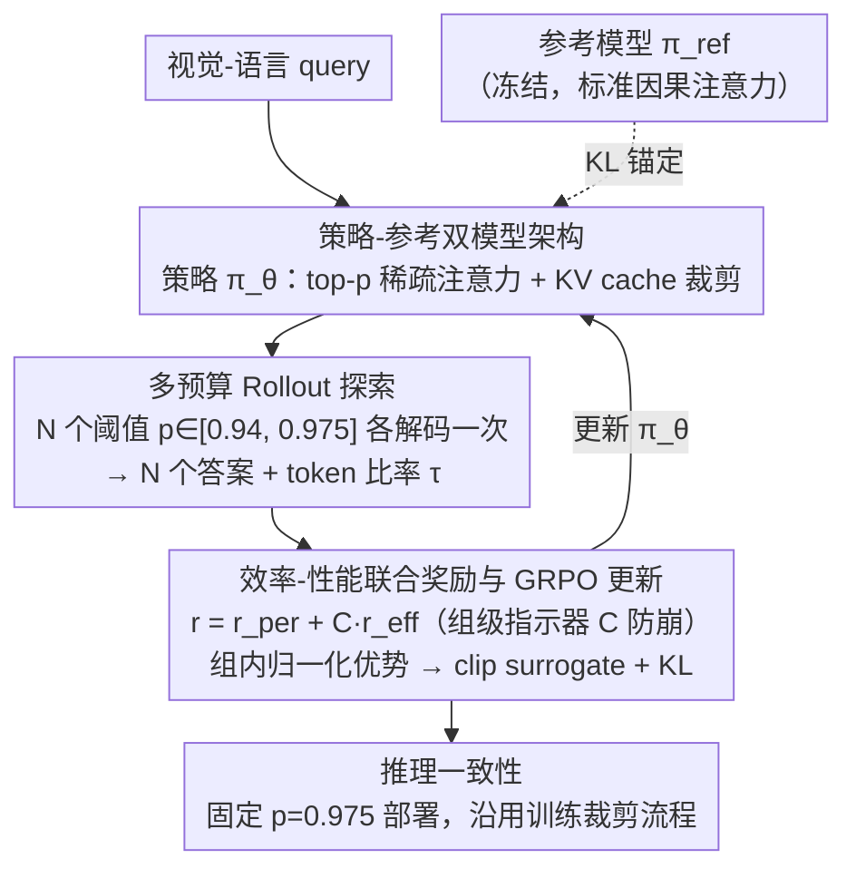

# Sparsity Forcing: Reinforcing Token Sparsity of MLLMs

**会议**: ICLR 2026  
**arXiv**: [2504.18579](https://arxiv.org/abs/2504.18579)  
**领域**: 多模态VLM  
**关键词**: token稀疏, RL后训练, GRPO, 效率-性能联合奖励, 多预算探索

## 一句话总结
提出Sparsity Forcing——基于GRPO的RL后训练框架，将带稀疏注意力的MLLM作为策略模型、原始MLLM作为参考模型，通过多预算rollout探索不同token保留阈值$p$，以效率(token减少率)+性能(答案正确性)为联合奖励做组内对比优化，将Qwen2/2.5-VL的token减少率从20%提升至75%且精度损失极小，实现内存降3×、解码加速3.3×。

## 研究背景与动机

**MLLM推理瓶颈**：处理高分辨率图像或长视频时，视觉编码器产生海量visual token，严重制约生成效率（如16k+ token的视频输入）。

**天然稀疏性利用已到上限**：FastV/ZipVL等方法利用注意力图的固有稀疏性裁剪冗余token，但仅能安全减少约50%，进一步压缩（如保留20%或10%）就会导致精度急剧下降。

**可训练稀疏注意力局限**：MOBA/NSA等方法预定义刚性稀疏模式，忽略输入和层的动态性，且需要从头训练，在MLLM后训练场景下不实用。

**注意力锐化正则的代理目标问题**：$L_\infty$/熵最小化等正则项优化的是注意力分布锐度的代理目标，不直接控制token预算，学到的锐度不能可靠地转化为端到端token节省。

**SFT的训练-推理不匹配**：现有SFT方法在teacher forcing下强制稀疏作用于ground-truth token而非生成输出，与推理时的自回归解码不一致，导致实际效率收益有限。

**核心动机**：需要一个推理对齐(inference-aligned)的后训练方法，直接以效率-性能为端到端目标而非代理，让模型主动学会"哪些token可以安全丢弃"。

## 方法详解

### 整体框架

Sparsity Forcing 把"让 MLLM 更稀疏"当成一个强化学习目标来训练：带 top-$p$ 稀疏注意力的 MLLM 充当策略模型 $\pi_\theta$，参数冻结的原始 MLLM 充当参考模型 $\pi_{\text{ref}}$。对每个视觉-语言 query，策略模型用若干个不同的 token 保留阈值各跑一次自回归解码（rollout），按"答案是否正确 + token 砍掉多少"算联合奖励，再用 GRPO 做组内对比优化、把梯度回传给策略模型；训练好后推理时把阈值固定在训练上界即可直接部署。整个训练 loop 用的是和部署时一模一样的稀疏注意力 + KV cache 裁剪流程，因此学到的稀疏性可以无损迁移到推理。

### 关键设计

**1. 策略-参考双模型架构：在高稀疏率下守住原始能力**

策略模型 $\pi_\theta$ 在解码时执行稀疏 token 选择和 KV cache 裁剪，其 top-$p$ 注意力在每一层独立决定保留多少 token——把当层注意力分数累积排序，取最小的前缀 $b$ 使累积质量达到阈值：$b = \min\{p \in \mathbb{Z} \mid \sum_{j=1}^{p} a_{\text{sorted}(j)} \geq p \times \ell\}$，其中 $a_j = \sum_{c=1}^{\ell} \mathbf{A}_{c,j}$ 是第 $j$ 个 token 的累积注意力分数，$\ell$ 为序列长度。这样裁剪是激进的，单靠它很容易把模型推坏，所以引入参数冻结、用标准因果注意力的参考模型 $\pi_{\text{ref}}$，通过 KL 散度 $\mathbb{D}_{\text{KL}}(\pi_\theta \| \pi_{\text{ref}})$ 把策略锚回原始分布附近。参考模型相当于一根安全绳，让模型敢于探索高稀疏率，又不至于偏离到丢失任务保真度。

**2. 多预算 Rollout 探索：让对比信号自己长出来，不用手工标正负样本**

对同一个 query，方法用 $N$ 个不同阈值 $p_n$ 各做一次独立 rollout，得到 $N$ 个答案 $\{\mathbf{o}_1, \dots, \mathbf{o}_N\}$ 和对应的 token 比率 $\{\tau_1, \dots, \tau_N\}$。这些阈值构成一次从稀疏到密集的"预算扫描"：小 $p$ 只保留少量 token，赌还能不能答对；大 $p$ 多留 token，充当正确性兜底。训练阈值范围设为 $p \in [0.94, 0.975]$、步长 0.005。这样做绕开了 DPO 需要预先定义正/负样本对的痛点——同一组里既高效又答对的 rollout 自然拿到正优势，答错或留太多 token 的拿负优势；而且随着训练推进，"能答对的最小预算"会一路下移，rollout 范围跟着自动适应，不需要人工调整偏好对。

**3. 效率-性能联合奖励与 GRPO 更新：把效率从代理目标变成端到端目标**

每个 rollout 拿两份奖励：性能奖励 $r_{\text{per}} \in \{0, 1\}$ 看答案对错，效率奖励 $r_{\text{eff}} = 1 - \tau_i$ 等于 token 减少率。关键是加了一个组级指示器 $C = \mathbb{1}\{\exists j: \text{Correct}(\mathbf{o}_j) = 1\}$，只有当组里至少有一个 rollout 答对时，效率奖励才计入总奖励：$r_i = r_{\text{per},i} + C \cdot r_{\text{eff},i}$。这是防崩的核心——如果一组全错，没有 $C$ 把关，效率信号还会继续奖励"砍得更狠"，把模型推向输出空答案的极端稀疏。拿到奖励后按组内归一化算优势 $A_i = (r_i - \text{mean}) / \text{std}$，再用 GRPO 的 clip surrogate 目标更新：

$$\mathcal{J}(\theta) = \mathbb{E}\left[\min\left(\frac{\pi_\theta(\mathbf{o}_n|\mathbf{x})}{\pi_{\theta_{\text{old}}}(\mathbf{o}_n|\mathbf{x})} A_i,\; \kappa(\cdot) A_i\right) - \beta \mathbb{D}_{\text{KL}}(\pi_\theta \| \pi_{\text{ref}})\right]$$

GRPO 的 on-policy 特性让正/负对比随训练实时更新，避免了 DPO 预定义偏好对会越训越陈旧的问题，效率和性能由此成为真正的端到端优化目标，而不是注意力锐度那类只能间接逼近 token 预算的代理。

**4. 推理一致性：训练 loop 完全镜像部署 pipeline**

训练和推理用的是同一套稀疏注意力流程——同样的 token 裁剪策略、同样的 KV cache 管理。推理时把阈值固定在训练范围上界 $p=0.975$，模型在训练中已经学会即便在这个相对宽松的阈值下也产生更稀疏的注意力分布，于是既保住精度又带走训练里学到的效率收益。这一点正是对 SFT 的纠偏：SFT 训练时用 teacher forcing、推理时是自回归解码，两条 pipeline 不一致，导致稀疏作用在 ground-truth token 上、实际效率收益打折；而这里训练时就用自回归 rollout，做到 deployment-aligned。

## 实验结果

### 表1：图像基准（7个任务）对比

| 模型 | 方法 | Token比率↓ | MME | MMBench | MMStar | ChartQA | TextVQA | OCRBench | MMMU-Pro | 均值 |
|------|------|-----------|-----|---------|--------|---------|---------|----------|----------|------|
| Qwen2.5-VL-7B | Full | 100% | 2303 | 83.9 | 62.2 | 84.0 | 82.9 | 845 | 36.7 | 73.8 |
| | FastV | 52.1% | 2115 | 81.9 | 61.2 | 80.2 | 79.6 | 760 | 34.5 | 69.9 |
| | ZipVL | 79.5% | 2290 | 83.9 | 60.4 | 82.0 | 82.6 | 837 | 36.2 | 72.9 |
| | **Sparsity Forcing** | **24.7%** | **2286** | **84.1** | **62.5** | **83.1** | **82.6** | **847** | **36.7** | **73.6** |

### 表2：增强稀疏性方法对比（Qwen2.5-VL-7B）

| 方法 | 类型 | Token比率↓ | MME | MMStar | ChartQA | VideoMME | 均值 |
|------|------|-----------|-----|--------|---------|----------|------|
| Full | - | 100% | 2303 | 62.2 | 84.0 | 64.5 | 73.2 |
| MOBA | 可训练稀疏注意力 | 25% | 1906 | 58.6 | 77.3 | 62.6 | 66.6 |
| Sharpness Loss | 注意力锐化正则 | 25% | 1965 | 59.6 | 77.0 | 63.7 | 67.6 |
| ZipVL (后训练) | 稀疏注意力微调 | 61.7% | 2264 | 62.0 | 78.9 | 64.2 | 71.5 |
| **Sparsity Forcing** | **RL后训练** | **26.4%** | **2286** | **62.5** | **83.1** | **64.0** | **72.8** |

### 表3：稀疏注意力类型消融（Qwen2.5-VL-7B）

| 稀疏注意力 | Token比率 | MME | VideoMME |
|-----------|----------|-----|----------|
| Top-$k$ | 25% | 2160 | 60.2 |
| Threshold | 37.8% | 2218 | 61.6 |
| **Top-$p$** | **24.1%** | **2286** | **64.0** |

## 关键发现

1. **稀疏性可被RL强化3.75×**：ZipVL固有稀疏仅能从100%→~80%（减20%），Sparsity Forcing训练后可安全减至~25%（减75%），说明MLLM的稀疏性潜力远未被利用。

2. **组级指示器$C$是防崩关键**：若不加$C$，全错组的效率信号仍在推动极端稀疏→模型退化为输出空答案。$C$确保仅在"至少有人答对"时才奖励效率。

3. **Top-$p$优于Top-$k$和Threshold**：Top-$p$作为在线策略可根据每层注意力分布自适应调整保留token数，而Top-$k$和Threshold是离线策略→不适应输入变化→同样token比率下精度差3-4分。

4. **逐层稀疏性差异巨大**：训练后不同层的token保留率差异显著——浅层保留多（需全局上下文），深层保留少（已聚焦关键token），验证了动态逐层策略的必要性。

5. **长序列下稀疏性自适应增长**：输入从4k增至20k token时，保留比率从~35%降至~20%，精度几乎不变→序列越长冗余越多→方法自然扩展。

## 亮点

- **范式转变 "从利用到强化"**：以往方法被动利用固有稀疏性→Sparsity Forcing主动训练更稀疏→本质区别在于让模型学会重组注意力分布。
- **推理一致性设计**：训练loop完全mirror推理pipeline（autoregressive + sparse KV cache），不存在SFT的teacher forcing gap。
- **实际部署价值**：3×内存降低 + 3.3×解码加速→长视频处理从不可行变为可行→直接影响MLLM部署。
- **轻量后训练**：883 GPU hours（8×A100）训练Qwen2.5-VL-7B→不需从头训练→在已有强模型上增效。

## 局限性

1. **训练开销仍不轻**：883 GPU hours / 164 GPU hours虽比从头训练少，但多rollout本身增加了训练成本（group size=8意味着每个样本做8次推理）。
2. **仅验证QwenVL和LLaVA系列**：未在更多架构（如InternVL、Gemini等）上验证泛化性，其他MLLM的注意力稀疏特性可能不同。
3. **推理时需稀疏注意力框架支持**：依赖ZipVL等sparse attention实现→不是所有推理引擎都原生支持→部署需额外工程。
4. **visual token为主**：主要裁剪视觉token→对纯文本或text-heavy任务的提升有限→OCR类任务的稀疏空间确实更小。

## 相关工作对比

### vs ZipVL (He et al., 2024)
ZipVL是训练无关的稀疏注意力→利用固有稀疏性→top-$p$阈值动态选token→但仅能安全减约20%。Sparsity Forcing建立在ZipVL之上→通过RL后训练强化稀疏性→把ZipVL从"利用"升级为"强化"→同一框架下token减少从20%→75%。本质区别：ZipVL不改变模型权重，Sparsity Forcing改变模型注意力分布使其天然更稀疏。

### vs MOBA (Lu et al., 2025)
MOBA是可训练稀疏注意力→block-wise attention probing + MoE思路→预定义稀疏模式→需从头训练。在后训练场景对比（表3），MOBA在25% token比率下MME仅1906（vs Sparsity Forcing的2286），性能差距巨大（6.2分均值差距）。原因：MOBA的刚性模式忽略输入和层的动态→不适合后训练微调已有MLLM。

## 评分

- **新颖性**: ⭐⭐⭐⭐⭐ 首次将GRPO应用于MLLM稀疏性强化，联合奖励+多预算探索+推理一致性的组合设计独特
- **实验充分度**: ⭐⭐⭐⭐⭐ 13基准(7图像+6视频)+4个模型+详细消融(稀疏机制/rollout范围/组大小/幻觉鲁棒性)
- **写作质量**: ⭐⭐⭐⭐⭐ 问题分析透彻，从"利用"到"强化"的叙事线清晰，图示有效
- **实用价值**: ⭐⭐⭐⭐⭐ 3×内存+3.3×速度→直接可用于MLLM部署加速，后训练方式降低使用门槛

<!-- RELATED:START -->

## 相关论文

- [\[ICCV 2025\] SparseMM: Head Sparsity Emerges from Visual Concept Responses in MLLMs](../../ICCV2025/multimodal_vlm/sparsemm_head_sparsity_emerges_from_visual_concept_responses_in_mllms.md)
- [\[ICLR 2026\] Patch-as-Decodable-Token: Towards Unified Multi-Modal Vision Tasks in MLLMs](patch-as-decodable-token_towards_unified_multi-modal_vision_tasks_in_mllms.md)
- [\[ICCV 2025\] Sparsity Outperforms Low-Rank Projections in Few-Shot Adaptation](../../ICCV2025/multimodal_vlm/sparsity_outperforms_low-rank_projections_in_few-shot_adaptation.md)
- [\[ICLR 2026\] Enhancing Multi-Image Understanding through Delimiter Token Scaling](enhancing_multi-image_understanding_through_delimiter_token_scaling.md)
- [\[ICLR 2026\] MMDuet2: Enhancing Proactive Interaction of Video MLLMs with Multi-Turn Reinforcement Learning](mmduet2_enhancing_proactive_interaction_of_video_mllms_with_multi-turn_reinforce.md)

<!-- RELATED:END -->
