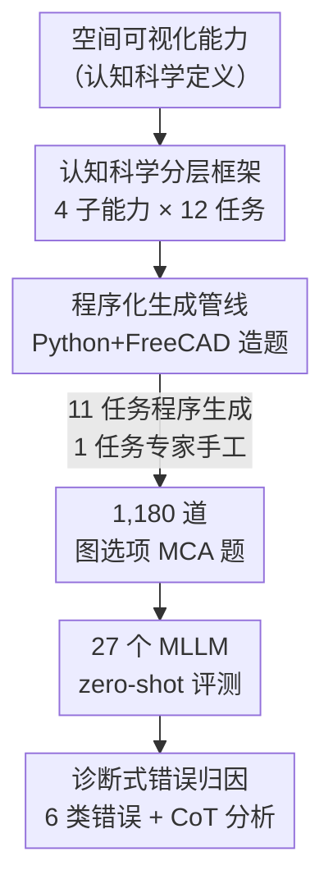

# SpatialViz-Bench：一个认知科学驱动、用于诊断 MLLM 空间可视化能力的基准

**会议**: ICLR 2026  
**OpenReview**: [https://openreview.net/forum?id=OqZ7bm28Xx](https://openreview.net/forum?id=OqZ7bm28Xx)  
**代码**: https://github.com/wangst0181/SpatialViz-Bench  
**领域**: 多模态VLM  
**关键词**: 空间可视化, MLLM 评测基准, 程序化生成, 认知科学, 错误诊断

## 一句话总结
针对现有多模态基准只考"看得见的信息"、却很难评测"在脑子里旋转/折叠/透视物体"这种空间可视化能力的空白，本文用认知科学把空间可视化拆成 4 个子能力 × 12 个任务，并用 Python+FreeCAD 程序化生成 1,180 道可无限扩展、防数据污染的题目；在 27 个 MLLM 上评测发现最强的 Gemini-2.5-pro 也只有 44.66%（人类 82.46%），且开源模型用 CoT 反而掉点。

## 研究背景与动机

**领域现状**：MLLM 把 LLM 的推理能力接上了 ViT 的"眼睛"，在大量多模态任务上表现亮眼。但这些任务大多评测的是**空间感知（spatial perception）**——从可见的视觉输入里识别物体的相对位置、距离、大小（如 BLINK、What'sUp、SpatialRGPT-bench），或者**空间记忆（spatial memorization）**——在视频里追踪物体（如 VSI-bench、VCBench）。这些都依赖"看得见的"显式信息。

**现有痛点**：人类有一种叫**空间可视化（spatial visualization）**的能力——在脑子里构造和操纵看不见的结构（心理旋转一个物体、想象折纸展开后的样子、推断实心体的内部剖面、预测齿轮系的运动），这在建筑设计、医学影像辅助手术里至关重要，但当前 MLLM 在这上面很弱、且几乎没被系统评测过。已有的零散评测有三个硬伤：① **数据污染**——题目大多扒自在线 IQ 测试、行政考试、数学竞赛，训练集和评测集可能重叠，可靠性存疑（SOTA 在 MM-IQ 的 3D Geometry 上只有 27.64，在 MathVision 的 Descriptive Geometry 上只有 26.00）；② **类别被淹没**——空间可视化常被塞进"数学推理"或"逻辑推理"这种大筐里，关注点变成"把题做出来"而非"考核空间能力本身"；③ **覆盖狭窄**——专门数据集往往只盯单一子技能（如只考心理旋转或只考折纸），每个子技能题量太少，随机误差被放大。

**核心矛盾**：空间可视化是一种**与可见信息脱钩、需要内部心理操作**的能力，而现有评测要么混在大任务里测不准、要么靠扒公开题目无法防污染。要干净地诊断它，必须把它从混杂因素里隔离出来——像设计一场好的物理考试那样，只考基本原理。

**本文目标**：建一个程序化、标准化、可动态更新的基准，专门评测 MLLM 的空间可视化能力，并能细到诊断"模型到底错在哪一环"。

**切入角度**：回到认知科学的源头。Thurstone(1938) 最早定义空间可视化为"对视觉图像执行心理操作"，并把空间能力拆成空间感知、空间可视化、心理旋转等因子。作者据此搭一个层级框架，再用程序化生成（受 CLEVR 用 Blender 造数据的启发）来保证可扩展、可控难度、可防污染。

**核心 idea**：用**认知科学的子能力分类**做骨架设计任务，用 **Python+FreeCAD 程序化生成**做血肉造题，把"考什么"和"怎么造干净的题"两件事一起解决。

## 方法详解

### 整体框架
SpatialViz-Bench 不是一个模型，而是一套"分层任务设计 + 程序化造题 + 诊断式评测"的基准构造方法。它先用认知框架把空间可视化分解为**观察可见信息**和**辨别隐含信息**两个阶段，后者又在空间可视化（心理操纵图像）和空间记忆（暂存视觉空间信息）之间反复交替；据此定下 4 个核心子能力——心理旋转、心理折叠、视觉透视、心理动画——每个子能力配 3 个评测任务，共 12 个任务、1,180 道题。题目的生成主体（12 个任务里的 11 个）走一条程序化管线：给定任务名、任务参数和标准化问题模板，从算法池里随机生成参考图、正样本（正确答案）和带几何变换的负样本（干扰项），同时程序化记录每个错误选项的解释，最后输出"输入图像 + 输入文本 + 标准答案 + 解释"的完整数据实例。评测时在 27 个 MLLM 上跑 zero-shot，再用一套 6 类错误归因体系做诊断分析。

### 关键设计

**1. 认知科学驱动的四子能力 × 十二任务分层框架：把"空间可视化"从大筐里拆出来单独考**

针对"空间可视化被淹没在数学/逻辑大任务里、考不准"这个痛点，作者不按题型而按**认知能力**搭骨架。基于 Thurstone 的空间因子理论，把空间可视化分解为四个子能力：**心理旋转**（在保持物体特征的前提下心理表征并旋转它）、**心理折叠**（在脑中把 2D 图样折成 3D 物体或反之）、**视觉透视**（从外部特征想象物体的内部结构）、**心理动画**（在脑中可视化系统内部组件的运动）。每个子能力再设计 3 个任务，例如心理旋转下设 2D 旋转、3D 旋转、三视图投影；心理折叠下设折纸、立方体展开、立方体重构；视觉透视下设剖面、数立方体、立方体拼合；心理动画下设箭头移动、方块移动（带重力）、机械系统。每个任务有 2-3 个难度级、每级 40 或 50 题，合计 1,180 题，且**大多选项是图像**而非文字，逼模型真做视觉推理而非文本匹配。这样设计的好处是评测目标干净——每道题只考一个明确的子技能，便于做细粒度的错误归因，而不是笼统地报一个"做对/做错"。

**2. Python + FreeCAD 程序化生成管线：用可控随机造出防污染、可扩展、自带解释的题**

针对"扒公开题目导致数据污染、题量少放大随机误差"的痛点，作者把造题工程化。受 CLEVR 用 Blender 生成数据的启发，他们搭了一条集成 **Python 与 FreeCAD** 的管线（12 个任务里的 11 个走此路）。关键在于**用认知负荷参数而非启发式规则**来控制难度：例如把旋转复杂度（整体物体旋转 vs. 内部图案旋转）对齐到心理变换步数（Shepard & Metzler 1971 的经典发现），从而精确调节难度梯度。管线还用**受控随机性**增强多样性，并系统化生成**带解释的干扰项**——每个错误选项是怎么从正确答案做几何变换得来的（如把立方体堆"删掉一个小方块"、把视图"镜像"），都被程序记录下来，供后续做深度诊断。防污染靠**动态更新题库**：随机化生成意味着可以源源不断造出全新题目，永远不和模型训练数据重叠。少数例外：三视图投影任务的 Level 1 用了固定的 DeepCAD 工程零件模型，但干扰项（随机删线、翻转视图）仍是程序生成的以保证新颖性；机械系统任务因"程序化生成物理一致的运动"技术上太难，是**专家手工设计**的，参考公开仿真从零出题，专考动态运动传播（如从单张图推断旋转动力学）。

**3. 六类错误归因体系：不只报准确率，还诊断"模型错在感知、变换还是推理"**

针对"现有评测只给一个分数、说不清模型差在哪"的痛点，作者设计了一套诊断式的错误分析方法。他们手工定义 **6 类错误**：感知错误（Perceptual）、空间变换错误（Spatial Transformation）、空间记忆错误（Spatial Memorization）、指令遵循错误（Instruction Following）、方法论错误（Methodological，即采用了次优解题策略）、计算与推理错误（Calculation & Reasoning）。错误标注主要靠人工（2 名标注者），并用 Gemini-2.5-pro 当辅助工具；为保证可靠性，两名标注者独立标了 100 个错误的子集，算出 Cohen's Kappa κ=0.85（强一致性），分歧由第三位专家裁决。这套体系的价值在于把"模型为什么错"量化出来——后面的实验正是靠它得出"瓶颈在底层感知与变换、不在高层推理"这个核心结论，从而给改进指明方向（增加正确解题过程的训练数据）。

### 一个数据实例：立方体旋转题
以"心理旋转-立方体拼合/旋转"任务为例走一遍生成与作答：输入是任务名 + 任务参数 + 问题模板"右边哪个选项**无法**由原立方体堆旋转得到？"。管线先渲染参考图（原始立方体堆），正样本通过"绕 x 轴旋转 270°""绕 y 轴旋转 90°"等合法变换生成（对应选项 A、B，它们是"能旋转得到"的，因此不是答案），负样本通过"删掉一个小方块"这种非旋转变换生成（对应选项 C，它无法靠旋转得到，因此**是**正确答案）。输出打包成"输入图像 + 题干文本 + 标准答案 C + 每个选项的解释"。模型要做的是：在脑中把原堆旋转一遍，逐个排除能旋转得到的选项，找出那个"形状变了、不可能旋转得到"的——这正是心理旋转能力的核心。

## 实验关键数据

### 主实验
在 27 个 MLLM（8 闭源 + 19 开源）+ 1 个纯文本 LLM + 人类基线上做 zero-shot 评测，准确率（%）：

| 模型 | Overall | 心理旋转 Avg | 心理折叠 Avg | 视觉透视 Avg | 心理动画 Avg |
|------|---------|------|------|------|------|
| 人类基线 | **82.46** | 85.56 | 80.56 | 75.42 | 88.33 |
| Gemini-2.5-pro（最强） | 44.66 | 44.23 | 35.00 | 42.19 | 62.92 |
| o1 | 41.36 | 46.92 | 29.72 | 37.81 | 57.50 |
| Gemini-2.5-flash | 36.86 | 35.77 | 32.50 | 32.81 | 50.00 |
| LLaMA-4-Scout-17B（最强开源） | 34.24 | 37.31 | 28.61 | 34.06 | 39.58 |
| Qwen2.5-VL-72B-Instruct | 35.00 | 29.23 | 24.17 | 39.06 | 43.75 |
| Qwen2.5-72B（纯文本） | 25.86 | 21.67 | 22.22 | 31.25 | 28.33 |
| 随机基线 | 25.08 | 27.69 | 21.67 | 28.12 | 23.33 |

核心信号：① 最强模型 44.66% 与人类 82.46% 差距巨大；② 纯文本模型 25.86% ≈ 随机 25.08%，证明任务**强依赖视觉**、不能靠文本捷径；③ 闭源 Gemini-2.5-pro 的 95% Wilson 置信区间 [41.85, 47.51] 与最强开源 LLaMA-4-Scout [31.58, 36.99] 不重叠，统计上确证闭源比开源强约 10 个点。

### 消融/分析实验：CoT 悖论与鲁棒性

| 配置 | 关键现象 | 说明 |
|------|---------|------|
| CoT vs. 非 CoT | 闭源（Claude-3.5）受益、多个开源模型显著掉点 | "CoT 悖论"，与 EMMA 的观察一致 |
| 掉点集中在哪 | 纯视觉任务（三视图投影、3D 旋转）掉得最狠 | CoT 干扰了开源模型的原生视觉空间判断 |
| 换 CoT 模板（A→B） | Qwen2.5-VL-72B -2.12、Claude-3.5 -4.23 | 趋势稳定，掉点不是某个 prompt 的偶然 |
| 换答案抽取规则（A→B） | 差异 < 1.2% | 排除"解析失败"，确认 -5%~-9% 是真·推理失败 |

### 关键发现
- **感知 + 空间变换错误占近 60%**：在 6 类错误里，感知错误和空间变换错误合计接近 60%，方法论错误约 23% 排第三，而计算与推理、指令遵循错误很少。这量化证明了核心假设——MLLM 的瓶颈在**底层视觉感知与变换**，不在高层推理；也反证基准成功隔离出了空间缺陷。
- **放大模型救不了空间缺陷**：绝对错误数与排名相关（Gemini-2.5-pro 204 < o1 236 < Qwen-72B 272 < Qwen-7B 328），但 Qwen2.5-VL 从 7B 放大到 72B（10 倍参数），核心错误模式几乎没变，感知与变换错误仍占主导——72B 几乎消灭了空间记忆和计算错误，却对最关键的两类错误只有有限改善。
- **难度塌缩只在顶尖模型可见**：作者验证的难度梯度只在最强模型上体现——10 个模型在 L0 就出现"性能地板"（≤1 个显著难度梯度），而 Gemini-2.5-pro 最敏感（7 个）。在 3D 旋转上，只有 Top-2（Gemini-2.5-pro、o1）出现显著难度塌缩，因为只有它们在 L0 达到了非随机准确率、才有可能在 L1 表现出统计上的下滑。
- **核心 3D 任务普遍翻车**：多数模型在 3D 旋转、立方体展开/重构等核心 3D 任务上接近随机，暴露 3D 空间里普遍而严重的感知与可视化缺陷。

## 亮点与洞察
- **"考能力"而非"考题型"的设计哲学**：用认知科学的子能力做骨架，而不是按现成题型攒题，这让基准能做细粒度诊断——不是报一个总分，而是能说清"模型在心理折叠上比心理动画弱、错主要错在感知"。这个思路可迁移到任何想做"诊断式评测"的领域。
- **程序化生成 = 防污染 + 可控难度 + 自带解释，一箭三雕**：随机化生成天然防止数据泄漏（题库可无限刷新），用认知负荷参数控制难度让难度梯度有理论依据，而程序记录干扰项的几何来源让每道错题都自带"为什么错"的解释——这是后续错误归因能做深的前提。
- **CoT 悖论的精细定位**：作者没停在"CoT 让开源模型掉点"这个现象，而是定位到掉点**集中在纯视觉任务**，并用换模板、换抽取规则两组鲁棒性实验排除了 prompt 工程和解析失败的干扰，论证这是真·推理失败——对"什么时候该用 CoT"有实操指导意义。
- **模型可作内部世界模型的视角**：作者指出强空间可视化能力可让模型跑轻量的内部"what-if"推演（如"齿轮顺时针转，相连齿轮往哪转"），比调用大型扩散视频生成模型显式渲染未来状态高效得多——给空间能力的下游价值提供了清晰动机。

## 局限与展望
- **机械系统任务靠手工设计**：12 个任务里唯一不能程序化生成的机械系统任务是专家手工出题，无法享受"动态更新题库"的防污染红利，可扩展性受限。
- **人类基线规模偏小**：人类基线只用了 8 名机械/计算机背景的研究生，做 72 题子集，样本量小，且选的是空间能力强的人群，可能高估"普通人类"水平。
- **错误归因部分依赖 LLM 辅助**：6 类错误标注虽以人工为主、Kappa 高，但用 Gemini-2.5-pro 当辅助工具标注模型错误，存在"用强模型评判别人"的潜在偏置。
- **诊断到改进还差一步**：基准很好地诊断出"瓶颈在感知与变换"，但作者给的改进方向（增加正确解题过程的训练数据）较笼统，没有给出验证这条路有效的实验。

## 相关工作与启发
- **vs 空间感知基准（BLINK / What'sUp / SpatialRGPT-bench）**：它们考"从可见输入识别空间关系"，本文考"推断看不见的隐含结构"，覆盖了前者忽略的空间可视化盲区。
- **vs MM-IQ / MathVision**：它们把空间可视化淹没在数学/逻辑大任务里、题目扒自公开来源有污染风险，本文按认知能力单独拆出来、程序化生成防污染。
- **vs 单一子技能数据集（SPARE3D / CLEVR-MRT 只考心理旋转、SRBench 只考折纸）**：它们覆盖窄，本文用 4 子能力 × 12 任务做全面覆盖。
- **vs LEGO-Puzzles**：同样用程序化生成防污染，但本文的覆盖面（4 子能力）和诊断深度（6 类错误归因）更广更细。

## 评分
- 新颖性: ⭐⭐⭐⭐⭐ 第一个把空间可视化作为独立认知能力、用认知科学+程序化生成系统评测的基准
- 实验充分度: ⭐⭐⭐⭐⭐ 27 个 MLLM + 置信区间 + CoT 鲁棒性 + 6 类错误归因，诊断扎实
- 写作质量: ⭐⭐⭐⭐ 认知框架与造题管线讲得清晰，部分附录引用（如 Table 5）正文未完全展开
- 价值: ⭐⭐⭐⭐⭐ 揭示 MLLM 空间瓶颈在底层感知而非推理，给改进方向，且题库可持续防污染

<!-- RELATED:START -->

## 相关论文

- [\[ICLR 2026\] VisJudge-Bench: Aesthetics and Quality Assessment of Visualizations](visjudge-bench_aesthetics_and_quality_assessment_of_visualizations.md)
- [\[ICLR 2026\] MMSI-Bench: A Benchmark for Multi-Image Spatial Intelligence](mmsi-bench_a_benchmark_for_multi-image_spatial_intelligence.md)
- [\[ICLR 2026\] ODI-Bench: Can MLLMs Understand Immersive Omnidirectional Environments?](odi-bench_can_mllms_understand_immersive_omnidirectional_environments.md)
- [\[ICLR 2026\] PRISMM-Bench: A Benchmark of Peer-Review Grounded Multimodal Inconsistencies](prismm-bench_a_benchmark_of_peer-review_grounded_multimodal_inconsistencies.md)
- [\[ICLR 2026\] IWR-Bench: Can LVLMs Reconstruct Interactive Webpage from a User Interaction Video?](iwr-bench_can_lvlms_reconstruct_interactive_webpage_from_a_user_interaction_vide.md)

<!-- RELATED:END -->
