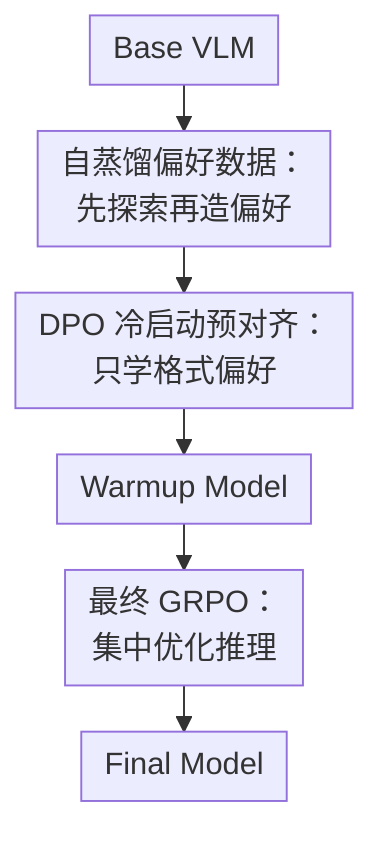

# SPECS: Decoupling Multimodal Learning via Self-distilled Preference-based Cold Start

**会议**: ICLR2026  
**OpenReview**: [https://openreview.net/forum?id=oNmMv7Lcj5](https://openreview.net/forum?id=oNmMv7Lcj5)  
**代码**: 待确认  
**领域**: 多模态VLM  
**关键词**: 多模态推理, 偏好冷启动, 自蒸馏, DPO, GRPO  

## 一句话总结
SPECS 重新设计多模态大模型进入 RLVR 之前的冷启动阶段：先用自蒸馏构造只区分输出范式的偏好对，再用 DPO+SFT loss 做格式预对齐，最后交给 GRPO 学深层推理，从而比传统 SFT 冷启动获得更好的泛化、训练稳定性和多模态推理性能。

## 研究背景与动机
**领域现状**：DeepSeek-R1 之后，越来越多工作把带可验证奖励的强化学习（RLVR）搬到视觉语言模型上，形成一批面向多模态推理的 MLLM-r1 方法。它们通常不会直接从 base VLM 开始做 RL，而是先做一个冷启动，让模型至少会输出可读的推理格式、遵守答案格式，并具备初步的复杂题求解能力。

**现有痛点**：主流冷启动做法是 SFT，即把高质量推理轨迹当成标准答案让模型模仿。这个选择短期很有效，因为模型很快学会训练集里的推理模板和答案写法；但它也把“怎么写格式”“怎么组织推理”“具体题怎么解”绑在同一个交叉熵目标里。模型可能在训练分布上收敛很快，却对稍微不同的输出指令、题型或格式要求泛化较差，后续 RL 也更容易沿着已经模仿出来的窄轨道更新。

**核心矛盾**：冷启动本来应该给 RL 一个更好的初始策略，但 SFT 式冷启动如果过早学习具体解题内容，就可能牺牲探索空间。多模态推理中的答案格式往往可以浅层迁移，而真正的视觉理解、数学推理、跨模态证据整合需要在 RL 阶段通过奖励继续打磨；把两类目标混在一起，会让冷启动阶段承担过多任务。

**本文目标**：作者想回答两个问题：第一，冷启动阶段到底该用 SFT 还是偏好学习，哪一种更有利于泛化和后续 RL；第二，冷启动数据是否一定要来自更强教师模型或人工标注，能不能由模型自身生成足够匹配的偏好信号。

**切入角度**：论文从“泛化能力能否量化”入手，提出 Generalization Factor（GF）来同时衡量 ID 和 OOD 的收益。实验发现 DPO 及 DPO+SFT loss 在冷启动阶段比 SFT 更能保持 OOD 表现，于是作者把冷启动重新定义成一种浅层偏好对齐：只让模型学会正确的回答结构和推理范式，不让它在这一步过度记忆具体答案内容。

**核心 idea**：用自蒸馏生成“答案都正确但格式一好一坏”的偏好对，让 DPO 冷启动只学习可迁移的输出范式，再把复杂推理能力留给最终 GRPO 优化。

## 方法详解

### 整体框架
SPECS 的整体流程可以理解为“先造一个会探索的自己，再用自己生成格式偏好，最后把推理交给 RL”。它不是把 SFT 换成另一个同样模仿内容的预训练步骤，而是把冷启动目标收窄到格式、结构、风格等浅层可迁移标准：chosen 和 rejected 尽量都保留正确答案，主要差异来自输出范式是否满足要求。

训练分三段。第一段先对 base VLM 做一小段 GRPO，得到 Ours-zero，也就是一个比 base 更会探索和生成推理轨迹的种子模型；随后用它和 base model 生成响应，并经过答案一致性过滤与格式污染，构造自蒸馏偏好数据。第二段用这些偏好对训练 DPO 冷启动模型，同时在 chosen 响应上加 SFT loss 作为约束，得到格式感知的 Warmup Model。第三段再以这个 Warmup Model 为起点做最终 GRPO，让奖励主要推动答案正确性和推理质量。

### 关键设计
**1. GF：把冷启动泛化能力变成可比较的量**

论文没有直接假设“SFT 会过拟合、DPO 会泛化”，而是先设计了一个衡量冷启动泛化的指标。作者把训练分布内任务记为 ID，把格式或任务要求发生变化的任务记为 OOD，分别计算相对 base model 的性能增益 $G_{ID}(n)$ 和 $G_{OOD}(n)$。GF 使用类似 $F_\beta$ 的形式合并二者：$\Gamma(n)=(1+\beta^2)\frac{G_{ID}(n)G_{OOD}(n)}{\beta^2G_{ID}(n)+G_{OOD}(n)}$，其中论文通常取 $\beta=2$ 来更重视 OOD 收益。

这个指标的关键不是数学形式多复杂，而是它惩罚“只在训练格式上变强”的冷启动。SFT 在 ID 上最快收敛，但如果 OOD 收益很低，GF 会被拉低；DPO 起步慢一些，却能保持更高 OOD 表现。这个观察直接支撑了 SPECS 的选择：冷启动阶段不应只看训练集拟合速度，而要看它会不会给后续 RL 留出更广的泛化和探索空间。

**2. 自蒸馏偏好数据：用模型自身能力构造贴近学生分布的格式偏好**

传统合成冷启动数据常依赖更强教师模型，但教师和学生能力差距太大时，生成分布可能和学生当前能力不匹配。SPECS 先用短程 GRPO 把 base VLM 训练成 Ours-zero，这一步目标不是冲最终分数，而是让模型具备更好的探索和初步推理能力。随后 Ours-zero 与 base model 在同一批多模态题目上生成响应，系统要求它们使用类似 `<think>...</think><answer>...</answer>` 的结构。

chosen 响应不是简单挑更长或更像教师的回答，而是用外部评估器检查“推理过程和最终答案是否一致”，只保留答案与推理一致的样本。rejected 响应则被设计成答案也正确、但输出格式被破坏的样本，例如删掉全部标签、只删 `<answer>` 标签、只删 `<think>` 标签，或者把答案标签替换成普通 `Answer:` 文本。这样构成的偏好对把内容正确性尽量控制住，让偏好信号主要落在格式和推理范式上。

**3. DPO 冷启动预对齐：让模型学相对偏好而不是死记 chosen 文本**

在冷启动阶段，SPECS 用 DPO 直接优化 chosen 相对 rejected 的概率优势。标准 DPO loss 可以写成 $L_{DPO}=-\mathbb{E}[\log\sigma(\beta\log\frac{\pi_\theta(y_w|x)}{\pi_{ref}(y_w|x)}-\beta\log\frac{\pi_\theta(y_l|x)}{\pi_{ref}(y_l|x)})]$。这里 chosen 和 rejected 都围绕同一个问题构造，且尽量都包含正确答案，因此模型被鼓励学习“哪种表达结构更符合偏好”，而不是把某个完整推理轨迹逐 token 复制下来。

论文还加入 chosen 样本上的 SFT loss，得到 $L_{hybrid}=L_{DPO}+\lambda L_{SFT}$，实验中 $\lambda=1$。这个正则项的作用是防止纯 DPO 只拉大 chosen/rejected margin，却把 chosen 本身的概率也压低。换句话说，DPO 给方向，SFT loss 稳住高质量文本分布；两者合起来更适合当 RL 前的 warm-up，而不是变成另一个只追求训练格式拟合的 SFT。

**4. 最终 GRPO：把冷启动学会的格式让位给深层推理优化**

SPECS 的最后一段仍然使用 GRPO 做 RLVR，但起点已经不是 base model 或 SFT model，而是 DPO 预对齐后的 Warmup Model。由于模型在冷启动中已经比较稳定地遵守输出结构，RL 阶段的 credit assignment 更容易集中到答案正确性、视觉证据使用和推理路径质量上，而不是反复为标签格式、答案包装这类浅层问题付出更新。

最终奖励由格式奖励和准确率奖励相加：$R_{total}(o,q)=R_{format}(o)+R_{acc}(o,q)$。格式正确给固定 $0.5$，答案正确性则按题型判断：选择题和数值题用规则评估，短答题用 GPT-4o 作为外部 judge。这个设计和前面的解耦目标是一致的：冷启动先把格式纪律推到一个可用水平，最终 RL 再用可验证奖励把模型推向更高的多模态推理上限。

### 一个完整示例
假设训练题是一道视觉几何题，系统要求模型把推理放在 `<think>` 标签里，把最终答案放在 `<answer>` 标签里。base VLM 可能直接写出自然语言答案，或者虽然算出了正确数值，却没有按要求闭合标签；Ours-zero 经过短程 GRPO 后更可能生成完整推理链和正确答案，但仍可能存在少量“推理说 4、答案写 3”的不一致样本。

SPECS 会先让 Ours-zero 生成候选 chosen，然后用评估器检查推理和答案是否一致，只留下“推理过程支持最终答案”的回答。对于 rejected，它不会故意选择答案错误的回答，而是从答案正确的响应里构造格式错误版本：例如去掉 `<answer>` 标签，或把答案段改成 `Answer: 12`。于是同一个问题得到一对偏好数据：chosen 的答案正确且格式完整，rejected 的答案也正确但格式不合规。

DPO 看到这对样本时，学习目标就很清晰：不是“这道题必须背成 chosen 的每个 token”，而是“在答案同样正确时，结构化推理和答案包装更应该被偏好”。等到最终 GRPO 阶段，模型已经不用从零学标签规则，可以把 rollout 的探索预算更多花在图像对象计数、几何关系、数学运算和跨模态证据核对上。

### 损失函数 / 训练策略
训练数据分配上，Stage 1 和 Stage 3 的 GRPO 使用 Orsta47K 与 virl39K，Stage 2 的冷启动使用约 9K 条自蒸馏偏好数据。基础模型是 Qwen2.5-VL-7B，GRPO 训练基于 MM-EUREKA 框架，DPO 与对照 SFT 训练基于 LlamaFactory。

GRPO 阶段 rollout 和训练 batch size 都设为 128，每个样本生成 8 个 rollout，学习率为 $1\times10^{-6}$，最大输出长度为 10,240 tokens，并采用类似 DAPO 的 clipping 设置，不加 KL penalty。DPO 阶段 batch size 为 64，学习率同样是 $1\times10^{-6}$，最大输出长度扩展到 16,384 tokens，混合损失中的 $\lambda$ 设为 1。

作者还比较了 SFT 和 DPO 的训练开销。在约 9K 数据、相同训练参数下，DPO 相比 SFT 的运行时间只多约 498 秒，吞吐从 1.035 samples/s 降到 0.979 samples/s。这个结果说明 SPECS 的收益并不是靠显著增加训练成本换来的，冷启动目标改变才是主要因素。

## 实验关键数据

### 主实验
SPECS 在 MEGA-Bench Core 上和通用 VLM、推理型 VLM 做比较，基础模型是 QwenVL-2.5-7B。Ours-7B 在总体分数和多个子领域上都超过 backbone，尤其是 Science 类别提升较大。

| 模型 | MEGA-Bench Core | Knowledge | Mathematics | Perception | Science | Metrics |
|------|-----------------|-----------|-------------|------------|---------|---------|
| QwenVL-2.5-7B | 38.84 | 27.67 | 41.24 | 28.93 | 41.64 | 35.07 |
| Orsta-7B | 41.65 | 31.48 | 43.84 | 32.82 | 41.66 | 38.31 |
| Ours-zero | 42.44 | 29.87 | 43.77 | 32.80 | 47.32 | 37.96 |
| Ours-7B | 42.64 | 31.71 | 44.58 | 34.14 | 51.87 | 39.17 |
| Ours - Backbone | +3.8 | +4.0 | +3.3 | +5.2 | +10.2 | +4.1 |

在其他多模态理解和数学推理基准上，SPECS 也带来稳定收益。相对 QwenVL-2.5-7B，MathVista 提升 $12.2$，MathVerse 提升 $10.5$，说明这种冷启动方式不只是改善格式合规，也确实有助于后续 RL 学到更强的多模态推理能力。

| 模型 | MMMU | MathVision | MathVista | MathVerse | Overall |
|------|------|------------|-----------|-----------|---------|
| QwenVL-2.5-7B | 54.2 | 25.40 | 63.70 | 38.20 | 45.38 |
| MM-Eureka-7B | 55.55 | 26.90 | 73.00 | 47.58 | 50.76 |
| VL-Rethinker-7B | 56.70 | 29.70 | 73.60 | 48.98 | 52.25 |
| Orsta-7B | 54.33 | 25.76 | 70.20 | 32.10 | 45.60 |
| Ours-zero | 54.30 | 26.88 | 72.90 | 47.33 | 50.35 |
| Ours-7B | 56.78 | 29.50 | 75.90 | 48.73 | 52.73 |
| Ours - Backbone | +2.5 | +4.1 | +12.2 | +10.5 | +7.3 |

### 消融实验
自蒸馏和解耦数据策略是 SPECS 的两个核心消融点。表中斜杠左侧是冷启动后分数，右侧是冷启动+RL 后分数。可以看到，使用外部 Qwen32B/72B 教师并不一定更好，自蒸馏最终平均分最高；解耦数据在冷启动后分数略低于 coupled data，但经过 RL 后上限更高。

| 配置 | MEGA-Bench | MMMU | MathVista | MathVision | MathVerse | AVG |
|------|------------|------|-----------|------------|-----------|-----|
| Qwen2.5-VL-7B | 35.07 | 54.20 | 63.70 | 25.40 | 38.20 | 43.31 |
| Qwen32B Distillation | 27.04 / 29.87 | 51.44 / 56.67 | 66.90 / 71.50 | 25.53 / 28.03 | 43.53 / 46.07 | 42.89 / 46.43 |
| Qwen72B Distillation | 34.00 / 37.30 | 53.89 / 58.56 | 67.50 / 73.30 | 25.62 / 28.91 | 43.53 / 46.83 | 44.90 / 48.98 |
| Base model Distillation | 35.37 / 37.92 | 53.11 / 56.11 | 67.90 / 74.40 | 25.55 / 28.68 | 43.40 / 46.82 | 45.07 / 48.79 |
| Self Distillation | 37.52 / 39.17 | 54.89 / 56.78 | 72.00 / 75.90 | 25.75 / 29.50 | 46.19 / 48.73 | 47.27 / 50.02 |
| Coupled Data | 37.02 / 38.76 | 55.44 / 55.44 | 71.10 / 73.10 | 27.37 / 28.65 | 47.46 / 47.46 | 47.67 / 48.68 |
| Decoupled Data | 37.52 / 39.17 | 54.89 / 56.78 | 72.00 / 75.90 | 25.75 / 29.50 | 46.19 / 48.73 | 47.27 / 50.02 |

另一个关键消融是冷启动方法本身。DPO-based GRPO 在所有列出的基准上都优于 SFT-based GRPO，平均分从 47.65 提升到 50.02。论文还报告 DPO-based GRPO 的 policy loss 曲线更平滑，format reward 更稳定，说明它和后续 reward-driven 优化目标更一致。

| 冷启动方式 | MEGA-Bench | MMMU | MathVista | MathVision | MathVerse | AVG |
|------------|------------|------|-----------|------------|-----------|-----|
| Qwen2.5-VL-7B-Instruct | 35.07 | 54.20 | 63.70 | 25.40 | 38.20 | 43.31 |
| SFT-based GRPO | 37.52 | 54.44 | 74.10 | 28.61 | 43.60 | 47.65 |
| DPO-based GRPO | 39.17 | 56.78 | 75.90 | 29.50 | 48.73 | 50.02 |

### 关键发现
- DPO 冷启动的优势不是只体现在最终分数上，也体现在更高的 OOD 泛化、Pass@K 潜力和 rollout 探索能力上。附录中 RBF 统计显示 ours 在 120、240、480 sample size 下都高于 base 和 SFT，说明生成分布更宽，有利于 RL 搜索更好的解。
- 自蒸馏比强教师蒸馏更适合这里的问题。原因不是教师不强，而是强教师输出分布可能离 7B 学生太远；SPECS 从 Ours-zero 中取 chosen，更贴近学生自身能力边界，偏好信号更可学。
- 解耦数据的冷启动即时分数不一定最高，但 RL 后效果更好。这说明冷启动阶段过早学习“答案正确性差异”可能会抢走 RL 阶段的任务，而只学格式偏好反而给最终推理优化留下空间。
- chosen response 过滤有实际价值。去掉验证时平均分为 48.13，加入验证后为 50.02，说明“推理和答案不一致”的少量样本足以干扰冷启动质量。

## 亮点与洞察
- SPECS 最巧的地方是把冷启动从“先教模型解题”改成“先教模型怎么表达可被 RL 使用的推理”。这让 DPO 的偏好信号更干净，也避免了 SFT 把具体题目模式和格式规则绑死。
- GF 是一个有用的诊断工具。很多冷启动方法只报告下游最终分数，但 GF 迫使研究者看 ID 和 OOD 的平衡，能更早发现 SFT 型方法在指令格式迁移上的脆弱性。
- 自蒸馏的选择很务实。与其找一个过强 teacher 生成学生难以吸收的长链条，不如先用短程 RL 把学生推到可探索区域，再让它自己产生贴近能力分布的候选数据。
- “答案都正确但格式不同”的偏好对很适合迁移到其他 RLVR 场景。比如文本数学、代码推理或 agent 工具调用冷启动，都可以把偏好差异限制在结构化输出、工具调用协议或检查点格式上，把真正的任务优化留给 RL。
- DPO+SFT loss 的混合目标给了一个稳定折中。纯 DPO 可能过度追求 margin，SFT loss 则把 chosen 分布拉住；这对冷启动这种短训练阶段尤其重要。

## 局限与展望
- 实验主要集中在多模态 VLM 推理，尚未证明同样流程在纯文本数学、代码推理或长程 agent 任务中也能稳定收益。论文结论更适合先理解为“多模态 RLVR 冷启动”的证据。
- OOD 设置主要围绕输出格式变化和若干 benchmark 泛化，真实部署中的 OOD 可能包含视觉域变化、题目语言变化、工具环境变化等更复杂因素。GF 指标本身有价值，但 OOD 分布怎么选仍会影响结论。
- 自蒸馏流程仍依赖外部模型做 chosen response 一致性验证，短答题准确性评估也使用 GPT-4o judge。虽然这些调用不是强教师蒸馏，但仍引入了外部评估器的偏差和成本。
- 冷启动数据强调格式偏好，可能对需要显式学习任务策略的场景不够充分。若某些任务的“浅层格式”和“深层策略”无法清楚分开，解耦数据可能需要加入更细的偏好维度。
- 论文使用 Qwen2.5-VL-7B 作为主 backbone，模型尺度和架构变化后的规律还需要更多验证。特别是更小模型可能缺乏 Ours-zero 自蒸馏所需的基础探索能力，更大模型则可能对冷启动方式不那么敏感。

## 相关工作与启发
- **vs SFT cold start**: SFT 把 chosen 推理轨迹当作标准答案模仿，ID 收敛快但容易把格式和内容一起记住；SPECS 用偏好学习只拉开好格式和坏格式的相对概率，牺牲一点早期拟合速度，换来更好的 OOD 和后续 RL 稳定性。
- **vs R1-Onevision / Vision-R1 等 SFT+RL 路线**: 这些方法通常先合成长 CoT 或指令数据做 SFT，再用 RL 增强多模态推理；SPECS 的区别是冷启动不再追求直接教会复杂推理，而是把输出范式预对齐，让 GRPO 承担主要推理学习。
- **vs MM-Eureka / Orsta / VL-Rethinker**: 这些工作重点在 RL 数据、奖励或多模态推理能力本身，SPECS 更关注 RL 之前的初始化策略。它可以被看作对这类 RLVR pipeline 的补丁：同样的最终 GRPO，如果起点更泛化、更稳定，上限会更高。
- **vs 外部教师蒸馏**: 强教师蒸馏提供高质量答案，但可能和学生分布错位；SPECS 用 Ours-zero 自蒸馏，牺牲一些教师能力上限，换取更贴近学生当前能力的偏好数据。
- **对后续研究的启发**: 冷启动不一定越强越好，关键是它是否把后续 RL 需要探索的空间保留下来。未来可以继续研究更细粒度的解耦，例如把格式、证据引用、工具调用、答案校验分别做成偏好维度。

## 评分
- 新颖性: ⭐⭐⭐⭐☆ 不是发明 DPO 或 GRPO，但把多模态 RLVR 冷启动明确重构为“自蒸馏偏好+目标解耦”，问题定义很清楚。
- 实验充分度: ⭐⭐⭐⭐☆ 覆盖主流多模态与数学推理基准，并有自蒸馏、解耦数据、SFT/DPO、验证器等消融；若能加入更多 backbone 和真实 OOD 会更完整。
- 写作质量: ⭐⭐⭐⭐☆ 方法链条和实验结论比较直观，GF 也帮助组织叙事；个别表格命名和文字细节略粗糙，但不影响理解核心贡献。
- 价值: ⭐⭐⭐⭐⭐ 对正在做 MLLM-r1 / RLVR 的研究很有参考价值，因为它指出冷启动不是简单“先 SFT 一下”，而是会决定后续 RL 的探索空间和训练上限。

<!-- RELATED:START -->

## 相关论文

- [\[ICLR 2026\] Catching the Details: Self-Distilled RoI Predictors for Fine-Grained MLLM Perception](catching_the_details_self-distilled_roi_predictors_for_fine-grained_mllm_percept.md)
- [\[ECCV 2024\] Decoupling Common and Unique Representations for Multimodal Self-supervised Learning](../../ECCV2024/multimodal_vlm/decoupling_common_and_unique_representations_for_multimodal_self-supervised_lear.md)
- [\[ICLR 2026\] Decoupling Primitive with Experts: Dynamic Feature Alignment for Compositional Zero-Shot Learning](decoupling_primitive_with_experts_dynamic_feature_alignment_for_compositional_ze.md)
- [\[ICLR 2026\] Thinking as Society: Multi-Social-Agent Self-Distillation for Multimodal Misinformation Detection](thinking_as_society_multi-social-agent_self-distillation_for_multimodal_misinfor.md)
- [\[ICLR 2026\] CapRL: Stimulating Dense Image Caption Capabilities via Reinforcement Learning](caprl_stimulating_dense_image_caption_capabilities_via_reinforcement_learning.md)

<!-- RELATED:END -->
