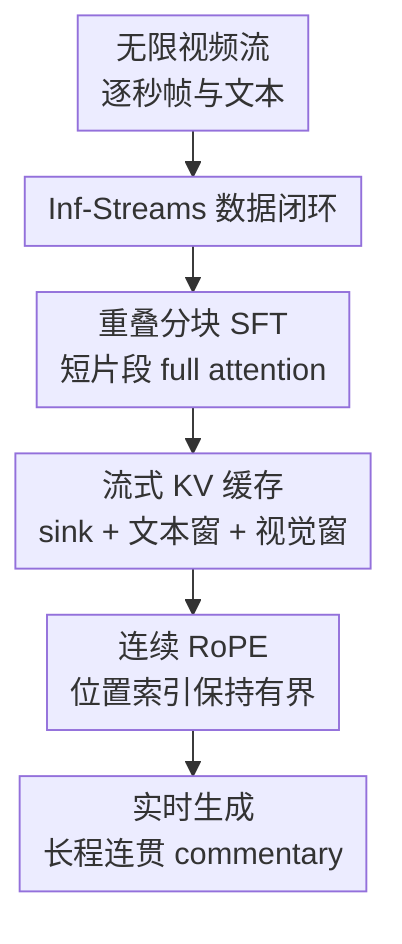

# StreamingVLM: Real-Time Understanding for Infinite Video Streams

**会议**: ICLR2026  
**OpenReview**: [https://openreview.net/forum?id=gVbPWbA97s](https://openreview.net/forum?id=gVbPWbA97s)  
**代码**: https://github.com/mit-han-lab/streaming-vlm  
**领域**: 多模态VLM / 流式视频理解  
**关键词**: 流式VLM, 无限视频, KV缓存, 连续RoPE, 实时解说  

## 一句话总结
StreamingVLM 用“训练时重叠短片段、推理时复用紧凑 KV cache”的统一框架，让 7B 级 VLM 能在数小时视频流上保持低延迟、长程记忆和逐秒级实时解说能力。

## 研究背景与动机
**领域现状**：视频 VLM 正在从离线短视频问答走向实时助手、具身智能和自动驾驶这类持续感知场景。传统视频 VLM 往往把一段有限视频编码后一次性回答问题，或者把视频切成若干 chunk 分别处理；这对几十秒到几分钟的视频还能工作，但和真实世界的“永不停机的视频流”有明显距离。

**现有痛点**：如果直接对整段视频做 full attention，视觉 token 和文本 token 会随时间不断累积，显存与计算很快爆炸，而且位置编码也会越过训练时见过的长度范围。简单滑动窗口虽然能限制上下文长度，但无重叠窗口会频繁丢掉上下文，导致解说前后不连贯；有重叠窗口又要反复重算大量历史 token，延迟无法满足实时要求。

**核心矛盾**：实时视频理解同时要求三件事：保留足够历史让模型知道“刚才发生了什么”，及时看到最近视觉帧让模型知道“现在正在发生什么”，还要把每一步延迟压在固定预算内。现有方案通常只能取其一二：要么记得多但慢，要么快但失忆，要么训练时和推理时的注意力模式完全不一致。

**本文目标**：作者希望把 VLM 改造成真正可流式运行的系统：输入是持续到来的视频帧和历史文本，输出是随时间生成的实时 commentary；模型需要在 2 小时以上的长视频里稳定工作，并且在单张 H100 上达到最高 8 FPS 的实时处理速度。

**切入角度**：论文的关键观察是，长视频推理不一定需要把所有历史视觉 token 都保留下来。对于体育解说这类流式任务，最重要的是少量稳定锚点、较长的文本历史和较短的最近视觉窗口；如果训练时就让模型习惯这种“近期视觉 + 历史文本”的上下文形态，推理时就不必依赖昂贵的全量重算。

**核心 idea**：StreamingVLM 用重叠短片段 full-attention SFT 模拟推理时的 attention sink + 滑动窗口结构，再用可复用 KV cache 和连续 RoPE 在推理阶段把上下文长度固定住，从而把无限视频流转化为稳定的有限上下文更新问题。

## 方法详解

### 整体框架
StreamingVLM 的整体流程分成训练、数据和推理三条线：先从长时体育视频中构建逐秒对齐的视觉-解说数据，再用重叠短片段 SFT 让模型学习流式上下文，最后在推理时只保留 attention sink、最近文本窗口和最近视觉窗口的 KV 状态。这样，模型每来一小段新视频就更新一次紧凑 cache，而不是重新处理整个历史。

框架里真正的贡献节点有四个：流式 KV 缓存决定“记什么、丢什么”；连续 RoPE 决定“丢 token 以后位置怎么还稳定”；重叠分块 SFT 决定“训练时怎样贴近推理”；Inf-Streams 数据闭环则提供足够长、足够密的训练与评测信号。

### 关键设计
**1. 流式 KV 缓存：把无限历史压成可复用的三段上下文**

StreamingVLM 推理时不再为每个滑动窗口重新计算历史 token，而是维护一个紧凑 KV cache。这个 cache 由三部分组成：长度为 $T_{sink}$ 的 attention-sink 文本 token，长度为 $T_{window}$ 的最近文本 token，以及覆盖最近 $V_{window}$ 秒的视觉 token。论文的默认描述里，实际系统保留 512 个 sink token、512 个最近文本 token 和 16 秒视觉窗口。

这个设计对应的是任务本身的记忆结构。体育解说需要知道开场信息、比分、前文已经说过什么，所以文本历史比视觉历史更值得保留；但视觉内容变化快，较老画面往往不再直接决定当前输出，因此可以优先淘汰旧视觉 token。相比无重叠滑窗，它不会在 chunk 边界突然失忆；相比有重叠滑窗，它复用已有 KV 状态，避免对重叠部分反复做 attention 计算。

**2. 连续 RoPE：丢弃旧 token 后仍让位置编码落在训练分布内**

KV cache 只保留有限窗口后，会产生一个容易被忽略的问题：如果新 token 的 RoPE 位置继续按真实时间无限增长，模型很快会看到远超训练长度的位置索引；如果简单重置位置，又会破坏保留 token 和新 token 之间的相对关系。StreamingVLM 的做法是使用连续 RoPE：当旧 token 被淘汰时，把后续与新进入的 token 位置整体左移，使保留序列的索引仍然连续。

因此，超过窗口长度后，有效 RoPE 索引不再随视频时长无限增加，而是在一个固定范围内滚动。对 Qwen-VL 这类使用 3D 位置编码的模型，论文进一步把这个思想扩展到视觉 token 的时间、高度、宽度 3D RoPE 上：视觉 token 仍按 3D 规则组装位置，但时间索引也随窗口左移保持连续。这解释了为什么 contiguous RoPE 在无限流上比 native RoPE 稳定得多。

**3. 重叠分块 SFT：用短上下文训练出流式推理习惯**

真正训练数小时视频的 full attention 代价太高，所以 StreamingVLM 没有直接把超长视频塞进模型。它把长视频切成长度 $W$ 秒的连续片段，相邻片段重叠 $O$ 秒，训练时每个片段内部使用 full attention。论文实验中 SFT 片段采用 $W=24s$、$O=12s$，视觉 token 和文本 token 按 1 秒间隔交错排列，而不是常见的“所有视觉 token 在前、文本在后”。

这个训练策略的妙处在于，它不是逐字复制推理时的 sparse/evicted attention mask，而是用重叠短片段近似推理时可见的上下文：前面的 sink 和最近文本提供历史，重叠区域提供近期视觉连续性。模型在训练中反复看到“上一段留下的上下文 + 当前段视觉变化 + 当前秒文本输出”的结构，推理时面对固定 KV cache 就不会像普通 VLM 那样突然失去对时间流的同步感。

**4. Inf-Streams 数据闭环：让模型学会何时说、说什么、何时沉默**

论文不只改推理算法，还构建了面向流式解说的数据。作者从篮球、足球、冰球、棒球、美式橄榄球五类运动中收集 6000 小时以上英文比赛视频，用 WhisperX 做 ASR，再用 GPT-5 按句子清洗：保留真正的比赛解说，编辑球员名、队名等识别错误，删除广告和主持闲聊。清洗后形成 2449 场完整比赛，并进一步构建 525K 个流式 SFT 样本。

这套数据的关键不是“视频很多”本身，而是有逐秒级的视觉-文本对齐。训练中每秒都有一个位置：有解说就预测文本，没有解说就插入占位符 `...`。这让模型学到实时 commentary 的节奏感：画面变化但不值得说时保持沉默，关键动作出现时立刻输出。高质量 annealing 数据再筛出 14786 个更聚焦场上动作的片段，用于提升最终解说质量。

### 一个完整示例
假设模型正在连续观看一场 2 小时足球比赛。开场时，系统提示和早期文字进入 attention sink；比赛推进到第 3 分 30 秒，最近 16 秒视觉窗口里出现点球准备动作，最近文本窗口里还保留“葡萄牙进攻”“Ronaldo 站上点球点”等上下文。模型根据当前视觉窗口生成“Ronaldo against David De Gea. A heart-stopping penalty.”，并把这段输出加入文本历史。

比赛继续到第 91 分 31 秒时，早期视觉画面早已被淘汰，但历史文本窗口和 sink 仍让模型知道双方、比分走势和此前事件。此时画面出现新的进球或赛后信息，StreamingVLM 不需要回看整场视频，也不需要重算所有旧 token；它只用保留的文本历史、最近视觉窗口和连续 RoPE 的有界位置，就能生成类似“Portugal got three points with Ronaldo's three goals!”的长程一致解说。

这个例子也说明了普通滑窗的失败点：如果只看当前 chunk，模型可能不知道 Ronaldo 之前已经罚过点球、进过球；如果用大重叠窗口保留这些信息，延迟会在长视频后不断升高。StreamingVLM 通过“视觉短记忆 + 文本长记忆”把这两个需求拆开处理。

### 损失函数 / 训练策略
StreamingVLM 的训练主体是监督微调。模型从 Qwen2.5-VL-Instruct-7B 初始化，第一阶段用 Inf-Streams-Train 的 525K 流式样本和 LiveCC 的 Live-WhisperX-526K 样本学习流式上下文；第二阶段用 14K 高质量 annealing 样本强化实时动作解说。总训练开销约为 128 H100-days。

训练时只在文本位置计算 loss，视觉 token 作为上下文参与 attention；没有解说的秒级位置用 `...` 占位，避免模型误以为每一帧都必须输出一句话。训练片段内部是 full attention，但数据组织方式模拟了推理时的 sink、文本窗口和视觉窗口，因此训练目标和推理形态保持一致。

## 实验关键数据

### 主实验
论文主实验覆盖两类任务：流式 captioning/commentary 和通用视频 VQA。captioning 主要在 Inf-Streams-Eval 与 LiveCC-Sports-3K CC 上比较 win rate；VQA 则用 MVBench、VideoMME、LongVideoBench 和 OVOBench Realtime 测试是否损伤甚至提升通用视频理解能力。

| 任务 / 数据集 | 对比对象 | StreamingVLM 结果 | 基线结果或说明 | 结论 |
|--------|------|------|----------|------|
| Inf-Streams-Eval | vs GPT-4o mini chunk | 66.18 win rate | GPT-4o mini 只能 chunk 评测 | 无限流模式仍胜出 |
| Inf-Streams-Eval | vs LiveCC chunk | 87.81 win rate | LiveCC chunk 受窗口限制 | 长程连贯性更强 |
| Inf-Streams-Eval | vs LiveCC infinite | 99.12 win rate | LiveCC infinite 长程记忆不足 | 几乎全面胜出 |
| LiveCC-Sports-3K CC | vs LiveCC | 56.19 win rate | LiveCC 是专门体育解说模型 | 泛化到短视频解说也更好 |
| LongVideoBench | 准确率 | 59.00 | Qwen2.5-VL-7B 为 54.70 | 无 VQA SFT 仍提升 +4.30 |
| OVOBench Realtime | 准确率 | 61.96 | Qwen2.5-VL-7B 为 56.00 | 实时感知提升 +5.96 |

主结果的含义很清楚：StreamingVLM 并不是只在自建解说数据上“会说体育话术”，它在长视频问答和实时视频理解上也有提升。尤其 LongVideoBench 和 OVOBench Realtime 的增益说明，重叠分块 SFT 与流式上下文训练没有牺牲基础 VQA 能力，反而让模型更会利用时间连续性。

### 消融实验
| 配置 | 关键指标 | 说明 |
|------|---------|------|
| Native RoPE chunk 100s | vs GPT-4o mini 63.23 | 切成 100 秒片段能部分避免位置越界，但损伤长程记忆 |
| Native RoPE infinite | vs GPT-4o mini 25.09 | 位置索引无限增长后性能明显崩落 |
| Contiguous RoPE infinite | vs GPT-4o mini 66.18 | 有界连续位置支撑无限流推理 |
| $V_{window}=0s$ | vs GPT-4o mini 52.90 | 不保留近期视觉会明显掉点 |
| $V_{window}=16s$ | vs GPT-4o mini 66.18 | 近期动作覆盖和效率之间最平衡 |
| 仅 Live-WhisperX-526K | vs GPT-4o mini 32.17 | 普通流式语音数据不足以解决长视频实时解说 |
| + Inf-Streams-Train | vs GPT-4o mini 63.46 | 重叠 SFT 数据带来最大跃升 |
| + 高质量 annealing | vs GPT-4o mini 66.18 | 进一步改善动作解说质量与综合表现 |

### 关键发现
- 最大的结构性收益来自训练-推理一致性：ReKV 这类训练无关的 KV eviction 对普通 Qwen 不能带来足够实时解说能力，对已经微调过的 StreamingVLM 甚至会破坏固定上下文格式，出现无输出问题。
- Contiguous RoPE 是无限流推理的稳定器。Native RoPE 在 chunk 模式还能勉强工作，但 infinite 模式下 win rate 从 63.23 降到 25.09，说明位置外推不是小问题，而是长视频崩溃的主因之一。
- 视觉窗口不是越长越好。0 秒视觉窗口显著变差，1 到 16 秒逐步提升，32 秒没有继续带来明显收益；16 秒大致覆盖了体育动作的近期上下文，同时还能保持固定延迟。
- 高质量 annealing 数据的贡献更像“质感修正”：它不是从零建立流式能力，但能把模型从泛泛解说拉向更贴近场上动作的实时 commentary。

## 亮点与洞察
- 把“无限视频”拆成“有限 KV 状态更新”是这篇最实用的地方。它没有追求把上下文窗口无限扩展，而是承认视觉和文本历史的价值不同，用不对称保留策略解决实际部署问题。
- 训练策略很克制：训练时仍用短片段 full attention，没有引入复杂稀疏 attention 训练；真正关键是通过重叠、交错 V/T 布局和文本 loss 位置，让模型习惯推理时会看到的上下文形态。
- 连续 RoPE 是一个容易迁移的 trick。凡是需要 KV eviction 的跨模态长流任务，都可能遇到位置索引出分布问题；把保留 token 和新 token 的位置重排到连续有界范围，是比简单截断更稳的选择。
- Inf-Streams-Eval 的价值不只是一个新榜单。它要求 2 小时级视频、逐秒对齐和实时输出，更接近机器人、车载助手、运动直播助手这类应用，而不是只考“看完整段视频后回答一个问题”。

## 局限与展望
- 数据域集中在体育英文解说，模型学到的实时节奏、事件重点和语言风格可能对监控、手术、驾驶、日常第一视角视频不完全适用。跨领域流式数据仍然是下一步瓶颈。
- StreamingVLM 依赖历史文本作为长程记忆。若早期输出发生幻觉或遗漏，后续文本窗口可能把错误继续带下去；论文展示了长程稳定性，但对错误累积和自我纠错机制讨论还不够。
- 评测大量使用 GPT-5 作为 judge 做 pairwise win rate，这适合开放式 commentary，但仍可能偏好更流畅或更像人类解说的文本，而不完全等价于事实正确性。
- 目前主要展示 7B 模型和单 H100 下的效率。对更小端侧模型、多摄像头输入、音频-视频联合流、低算力设备部署，还需要重新调窗口大小、帧率和缓存策略。
- 后续可以把短视觉窗口扩展成事件级记忆：不是机械保留最近 16 秒，而是把关键动作、比分变化、人物状态压缩成结构化 memory，再和文本窗口一起参与推理。

## 相关工作与启发
- **vs Full Attention 视频 VLM**: full attention 保留所有视觉和文本 token，理论上信息最完整，但显存、延迟和位置长度都不可控。StreamingVLM 牺牲旧视觉细节，换来稳定实时推理，更适合在线部署。
- **vs 普通 Sliding Window**: 无重叠滑窗计算便宜但会在边界断上下文，有重叠滑窗性能接近但反复重算。StreamingVLM 用 KV 复用保留重叠信息，因此性能接近有重叠方案，延迟却更稳定。
- **vs StreamingLLM / attention sink**: StreamingLLM 主要解决文本 LLM 的无限生成问题，StreamingVLM 把 sink + recent window 思路迁移到视觉-语言交错输入，并额外处理视觉 token 淘汰和 3D RoPE 连续化。
- **vs ReKV / SnapKV / H2O 等 KV 压缩**: 这些方法更多是训练后选择或压缩 KV，和模型训练目标未必一致。StreamingVLM 的核心差别是从 SFT 数据组织开始就让模型适应推理时的缓存形态。
- **vs LiveCC / VideoLLM-online**: 这些工作推动了实时视频对话或体育解说，但在很长视频上仍容易遇到失忆、延迟或训练长度限制。StreamingVLM 更系统地把训练数据、位置编码和推理缓存统一起来。

## 评分
- 新颖性: ⭐⭐⭐⭐☆ 把 attention sink、KV 复用、连续 RoPE 和重叠 SFT 组合到流式 VLM 场景，工程味强但问题抓得准。
- 实验充分度: ⭐⭐⭐⭐⭐ 覆盖 captioning、VQA、效率、RoPE、窗口大小、数据与训练策略消融，证据链比较完整。
- 写作质量: ⭐⭐⭐⭐☆ 主线清楚，图 1 到图 4 很好地解释了方法动机；少数表格指标较多，读者需要来回对照。
- 价值: ⭐⭐⭐⭐⭐ 面向真实实时视频助手的瓶颈很明确，方法可复用性高，对长视频 VLM 部署有直接参考价值。

<!-- RELATED:START -->

## 相关论文

- [\[ICLR 2026\] WorldSense: Evaluating Real-World Omnimodal Understanding for Multimodal LLMs](worldsense_evaluating_real-world_omnimodal_understanding_for_multimodal_llms.md)
- [\[ACL 2026\] Hybrid Autoregressive-Diffusion Model for Real-Time Sign Language Production](../../ACL2026/multimodal_vlm/hybrid_autoregressive-diffusion_model_for_real-time_sign_language_production.md)
- [\[ICLR 2026\] Can Vision-Language Models Answer Face to Face Questions in the Real-World?](can_vision-language_models_answer_face_to_face_questions_in_the_real-world.md)
- [\[ICLR 2026\] Long-tailed Test-Time Adaptation for Vision-Language Models](long-tailed_test-time_adaptation_for_vision-language_models.md)
- [\[ICML 2026\] TimeSpot: Benchmarking Geo-Temporal Understanding in Vision-Language Models in Real-World Settings](../../ICML2026/multimodal_vlm/timespot_benchmarking_geo-temporal_understanding_in_vision-language_models_in_re.md)

<!-- RELATED:END -->
