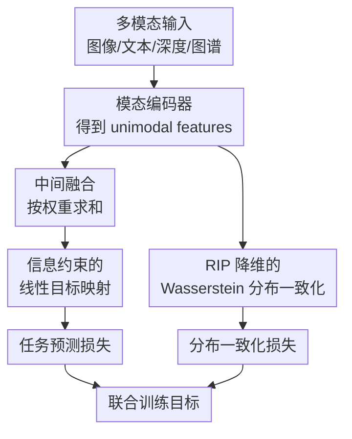

# Supporting Multimodal Intermediate Fusion with Informatic Constraint and Distribution Coherence

**会议**: ICLR2026  
**OpenReview**: [https://openreview.net/forum?id=5bxmmuRhO6](https://openreview.net/forum?id=5bxmmuRhO6)  
**代码**: 随 supplementary 提供，未见公开仓库  
**领域**: 多模态融合 / 多模态表示学习  
**关键词**: 中间融合, 信息约束, 分布一致性, Wasserstein距离, 多模态泛化  

## 一句话总结
本文从泛化误差角度重新分析多模态中间融合（IF）与后期融合（LF）的差异，提出 IID：用信息约束保证 IF 的线性目标映射满足理论条件，再用带 RIP 降维的 Wasserstein 分布一致化降低模态间分布不协调，从而在视觉-语言分类、场景识别和多模态知识图谱链接预测上稳定提升性能。

## 研究背景与动机
**领域现状**：多模态表示学习通常要把来自图像、文本、深度图、知识图谱等不同模态的特征合成一个可用于下游任务的表示。常见融合范式主要有两类：中间融合（Intermediate Fusion, IF）先在 latent space 汇合各模态特征，再通过统一目标映射做预测；后期融合（Late Fusion, LF）则让每个模态各自经过目标映射，最后在 logits 或决策层加权合并。

**现有痛点**：经验上 IF 往往很强，因为它在表示层就能混合各模态的信息；但已有可证明的多模态泛化分析大多建立在 LF 框架上。这使得 IF 的优势停留在经验层面：它为什么可能比 LF 泛化更好、什么条件下更好、应该怎样设计一个由理论直接指导的 IF 方法，都还没有被充分回答。

**核心矛盾**：IF 的潜力来自更早地合并多模态语义，但也带来一个容易被忽略的问题：不同模态特征分布可能并不一致。若图像特征、文本特征和融合特征来自差异很大的分布，统一的目标映射虽然共享参数，却可能在训练时被分布偏移拖累。换句话说，IF 一边保留更多任务相关信息，一边也暴露在更强的模态分布不协调中。

**本文目标**：作者试图同时解决两个子问题。第一，给 IF 相对 LF 的优势建立足够明确的理论条件，而不是只做经验替换；第二，在这个理论条件下设计可训练模块，让 IF 的线性目标映射靠近理论上有利的参数集合，并让不同模态表示在分布层面更协调。

**切入角度**：论文从“特征维度是否承载任务相关语义”这个细粒度视角重新拆解 IF 和 LF。每个模态的 latent feature 被划分为任务相关语义维度和任务无关噪声维度，IF 的融合特征则由不同模态的语义/噪声维度组合而来。这个视角使作者可以讨论：同一个线性目标映射是否存在某些参数，使 IF 的交叉熵损失不高于 LF。

**核心 idea**：用“信息约束 + 分布一致化”把 IF 的经验优势落实成可优化目标：信息约束让线性目标映射满足理论所需的有利参数条件，分布一致化则降低泛化误差上界里的模态分布不协调项。

## 方法详解

### 整体框架
IID 是一个建立在 IF 上的通用多模态训练框架。给定一个 batch 中第 $i$ 个样本的 $M$ 个模态输入 $x_i=\{x_i^1,\cdots,x_i^M\}$，模型先用各模态 encoder 得到 unimodal features $z_i^m=h_m(x_i^m)$，再通过融合权重 $w_m$ 做 latent-space 加权求和，得到融合表示 $z_i=\sum_m w_m z_i^m$。随后，融合表示进入一个线性目标映射 $g(\cdot)$ 产生预测；训练时额外加入两个正则项：信息约束损失 $L_{ic}$ 和分布一致化损失 $L_{dc}$。

这套框架的关键点不是重新发明融合权重，而是把已有静态或动态权重方法接到 IF 框架中，并补上两个由理论推导出的约束。论文因此实现了三个版本：IID-L 使用 vanilla late-fusion 风格的静态权重，IID-Q 复用 QMF 的动态权重，IID-P 复用 PDF 的动态权重。这样做能把“融合权重策略”与“本文两个模块的贡献”拆开比较。

### 关键设计
**1. 信息约束的线性目标映射：让 IF 的分类头落入理论上有利的参数集合**

论文首先证明，在某个线性目标映射参数集合 $\Lambda$ 内，IF 可以让每个样本的交叉熵损失不高于 LF；进一步地，IF 的泛化误差也可不高于 LF。这个结论本身还只是存在性结果：它说明有一类参数对 IF 有利，但训练时不会自动保证分类头朝这个集合收敛。因此 IID 需要一个可计算的约束，把线性目标映射推向这种理论上有利的状态。

直接约束目标是困难的，因为理论式子里需要 LF 的每个模态分类损失 $L(z_m\theta_m,y)$，而 IID 本身是 IF 框架，不会显式训练每个模态独立分类头。作者于是借用信息论视角：交叉熵越低，特征与标签的互信息通常越高。于是原本希望“融合表示的预测损失低于各模态预测损失”的目标，被转写成最大化 $I(z;y)-\sum_m I(z_m;y)$，即让融合表示比单模态表示含有更多面向标签的有效信息。

最终的信息约束损失写成可优化的变分形式：

$$
L_{ic}=\sum_i\left(-\log q_\theta(y_i|z_i)+\lambda KL(N_{z_i}\|N)-\sum_m[\log q_\theta(y_i|z_i^m)-\lambda KL(N_{z_i^m}\|N)]\right).
$$

这里 $q_\theta(\cdot|\cdot)$ 由线性目标映射给出，$N_{z}$ 是由特征均值和方差拟合出的高斯分布，$N$ 是标准高斯。前半部分鼓励融合表示对标签更有信息量，后半部分抑制单模态表示单独解释标签的能力，同时 KL 项避免表示塌缩。这样，信息约束就把理论里的“IF 优势条件”变成了训练中能施加到分类头上的正则。

**2. RIP 降维的 Wasserstein 分布一致化：降低泛化误差上界中的分布不协调项**

在理论分析的第二步，作者在 $K$-Lipschitz 假设下推导 IF 的泛化误差上界。这个上界除了经验误差、融合权重相关误差和假设空间偏差外，还包含一项 $\sum_m K\mathbb{E}(w_m)D_M(\mu_m,\mu)$。其中 $\mu_m$ 是第 $m$ 个模态特征分布，$\mu$ 是融合特征分布；这项被称为 distribution incoherence。直观地说，如果某个单模态分布离融合分布很远，那么训练阶段学到的统一目标映射在测试分布上就更容易出现泛化损失。

直接寻找多模态分布的 Wasserstein barycenter 代价太高，论文转而证明：在 IF 加权求和的常见设置下，单模态分布到融合分布的距离可以被模态间分布距离的总和上界住。因此实际优化不必直接对齐每个 $\mu_m$ 和 $\mu$，可以最小化不同模态之间的 Wasserstein 距离。Wasserstein 距离满足非负性、对称性和三角不等式，适合作为这里的完整分布距离度量。

难点在计算。高维特征上直接跑 Sinkhorn，需要构造大规模 pairwise cost matrix，成本很高；采样版 Sinkhorn 会丢掉部分样本信息，Radon transform neural network 又依赖非线性拟合，估计精度不稳定。IID 的解决办法是先把高维特征转到频域，用 FFT 得到 $\hat z_m=F(z_m)$，只保留幅值最大的 $d_1$ 个主成分，再用满足 Restricted Isometry Property (RIP) 的降维矩阵 $\Psi_m=\Phi F^{-1}$ 得到低维表示 $\tilde z_m=\Psi_m\hat z_m$。RIP 的作用是尽量保持点间几何结构，使降维后计算的 Wasserstein 距离仍能反映原空间的分布差异。

**3. 松弛最优传输约束：让分布一致化对降维扰动更稳健**

降维不可避免会损失部分语义，如果仍强制最优传输计划精确满足原始边际分布，训练会对降维误差过于敏感。IID 因此在 Wasserstein 估计中加入 Lagrange 形式的松弛边际约束：

$$
\widetilde W(\mu_{m_1},\mu_{m_2})=\arg\min_T\sum_{j,k}T_{jk}C_{jk}+\lambda_1[KL(T\mathbf{1}\|u)+KL(T^\top\mathbf{1}\|v)].
$$

这里 $T$ 是 transport plan，$C_{jk}$ 是低维特征之间的欧氏距离，$u,v$ 是两个模态分布的离散支持权重。KL 松弛允许匹配质量有一定弹性，避免因为频域截断或随机降维带来的小扰动让 transport plan 变得僵硬。最终分布一致化损失为 $L_{dc}=\sum_{m_1\ne m_2}\widetilde W(\mu_{m_1},\mu_{m_2})$。

**4. 与融合权重策略解耦：把 IID 做成 IF 方法的通用增强模块**

论文没有把贡献押在某个新的 fusion weight 公式上，而是承认泛化误差上界中还存在与 $w_m$ 和单模态损失相关的误差项。已有 QMF、PDF 等方法已经围绕动态融合权重做了理论和工程设计，IID 则把注意力放在之前较少被处理的 distribution incoherence 和 IF 线性目标映射约束上。

这种解耦带来两个好处。第一，实验比较更干净：IID-Q 与 QMF 使用相同权重，IID-P 与 PDF 使用相同权重，性能差异更能归因于信息约束和分布一致化。第二，方法更像一个 plug-and-play 模块：在链接预测任务中，作者把两个模块接入已有 IF 模型 MMKRL 和 OTKGE，仍能得到进一步提升，说明 IID 不局限于视觉-语言分类这一种设置。

### 一个完整示例
以图文情感分类为例，一个样本包含推文文本“Outcast came out last week. Should you skip it? Our review:”和对应图片。BERT 编码文本得到 $z_{text}$，ResNet 编码图片得到 $z_{img}$；若采用 IID-P，融合权重沿用 PDF 的动态权重计算方式，例如当前样本文本更可靠、图像噪声更大时，文本权重会更高。随后 IF 得到 $z=w_{text}z_{text}+w_{img}z_{img}$，统一线性分类头输出情感类别。

普通 IF 到这里就结束了，而 IID 还会在训练时做两件额外的事。信息约束要求融合表示 $z$ 对标签的解释力高于单独的 $z_{text}$ 和 $z_{img}$，避免分类头只依赖某个单模态捷径；分布一致化则把一批文本特征和图像特征投到低维频域表示后估计 Wasserstein 距离，鼓励两种模态的表示分布更接近。这样，一个样本的监督信号不只来自最终交叉熵，还来自“融合表示是否更有标签信息”和“模态分布是否更协调”这两个结构性约束。

### 损失函数 / 训练策略
IID 的总损失由三部分组成：

$$
L_{IID}=\alpha L_{ic}+\beta L_{dc}+\sum_i L(f_{IF}(x_i),y_i).
$$

其中 $L(f_{IF}(x_i),y_i)$ 是普通任务交叉熵，$L_{ic}$ 是信息约束，$L_{dc}$ 是分布一致化。$\alpha$ 与 $\beta$ 控制两个正则项的强度。作者在不同数据集上搜索 $\alpha\in\{1,0.1,0.01,0.001\}$ 或 $\{0.1,0.01,0.001\}$，搜索 $\beta\in\{10^{-10},10^{-11},10^{-12},10^{-13},10^{-14}\}$。实验表明最优组合随数据集变化较大，例如 MVSA-Single 的最优组合为 $\{0.01,10^{-12}\}$，MVSA-Multiple 为 $\{0.1,10^{-10}\}$，NYU Depth V2 为 $\{1,10^{-12}\}$。

训练流程可以概括为：每个 batch 先编码各模态特征，计算融合特征和分类损失；同时对各模态特征做频域稀疏化和 RIP 降维，估计模态间 Wasserstein 距离；最后把分类损失、信息约束损失和分布一致化损失加权求和并反向传播。

## 实验关键数据

### 主实验
论文在三类任务、八个数据集上验证 IID：视觉-语言分类包括 MVSA-Single、MVSA-Multiple、HFM、Food101；场景识别包括 NYU Depth V2、SUN RGB-D；链接预测包括 FB-IMG、WN9-IMG。视觉-语言分类和场景识别同时报告平均准确率和 worst-case 准确率；链接预测报告 MRR 和 Hits@k。

| 任务 / 数据集 | 指标 | 本文最好结果 | 主要对照 | 提升 |
|--------|------|------|----------|------|
| MVSA-Single | Avg Acc | IID-P 81.13 ± 0.84 | PDF 79.94 ± 0.95 | +1.19 |
| MVSA-Multiple | Avg Acc | IID-P 71.23 ± 0.44 | PDF 69.54 ± 0.25 | +1.69 |
| HFM | Avg Acc | IID-P 86.88 ± 0.39 | PDF 86.03 ± 0.31 | +0.85 |
| Food101 | Avg Acc | IID-P 93.73 ± 0.14 | PDF 93.32 ± 0.22 | +0.41 |
| NYU Depth V2 | Avg Acc | IID-P 72.04 ± 0.55 | PDF 71.37 ± 0.76 | +0.67 |
| SUN RGB-D | Avg Acc | IID-P 62.99 ± 0.24 | PDF 62.34 ± 0.43 | +0.65 |

| 链接预测数据集 | 指标 | OTKGE | OTKGE + IID | 提升 |
|--------|------|------|----------|------|
| FB-IMG | MRR | 0.843 | 0.855 | +0.012 |
| FB-IMG | H@1 | 0.799 | 0.813 | +0.014 |
| FB-IMG | H@10 | 0.916 | 0.925 | +0.009 |
| WN9-IMG | MRR | 0.923 | 0.932 | +0.009 |
| WN9-IMG | H@3 | 0.930 | 0.938 | +0.008 |
| WN9-IMG | H@10 | 0.947 | 0.957 | +0.010 |

在视觉-语言和场景识别中，IID-Q 与 IID-P 基本包揽 Top-2，且与 QMF、PDF、Late-fusion 对应版本使用相同的融合权重实现。论文还对这些成对结果做 Student t-test，表中 p-value 均小于 0.05，因此作者认为提升不是随机种子造成的偶然波动。

### 消融实验
| 数据集 / 版本 | w/o D | w/o I | 完整 IID | 说明 |
|------|---------|------|------|------|
| MVSA-Single / IID-P | 80.79 ± 0.80 | 80.46 ± 0.73 | 81.13 ± 0.84 | 去掉任一模块都会低于完整模型 |
| MVSA-Multiple / IID-Q | 69.59 ± 1.20 | 70.67 ± 0.29 | 71.08 ± 0.30 | 分布一致化在该设置下贡献更明显 |
| HFM / IID-P | 86.61 ± 0.37 | 86.35 ± 0.59 | 86.88 ± 0.39 | 两个模块都有稳定增益 |
| Food101 / IID-L | 91.43 ± 0.11 | 91.35 ± 0.34 | 91.93 ± 0.25 | 静态权重设置下仍能提升 |
| NYU Depth V2 / IID-Q | 70.95 ± 0.40 | 70.48 ± 0.97 | 71.61 ± 0.50 | 信息约束和分布一致化都重要 |
| SUN RGB-D / IID-P | 62.77 ± 0.19 | 62.53 ± 0.38 | 62.99 ± 0.24 | 完整模型最好但绝对提升较小 |

### 关键发现
- IF 本身已经能带来提升：论文把 QMF、PDF 的 LF 框架替换成 IF 后，在四个视觉-语言数据集上都观察到更好的准确率，这支撑了“IF 值得被理论化”的动机。
- 信息约束进一步放大 IF 相对 LF 的优势。Figure 5 显示，在 QMF 及 vanilla Late-fusion 的变体中，从 LF 到 IF 会提升，而加入 $L_{ic}$ 后提升继续扩大，说明信息约束确实让线性目标映射更接近理论上有利的参数状态。
- 分布一致化与准确率提升方向一致。Figure 4 中 IID-Q 相比 QMF 在多个数据集上降低平均 Wasserstein distance，同时准确率提升；这为“减少 distribution incoherence 有助于泛化”提供了经验支持。
- 计算代价与估计精度之间的折中较好。Figure 2 显示，直接在高维特征上跑完整 Sinkhorn 代价高；采样 Sinkhorn 和 RTN 估计偏差较大；IID 的 RIP 降维估计在时间开销有限增加的情况下更接近 ground-truth Wasserstein 距离。
- 插件化能力是一个重要信号。在链接预测中，MMKRL+IID 和 OTKGE+IID 都优于原模型，说明 IID 不只是某个视觉-语言 pipeline 的局部 trick，而是能增强已有 IF 多模态模型。

## 亮点与洞察
- 理论问题选得准：论文没有泛泛讨论“多模态融合更好”，而是抓住 IF 缺少泛化理论支撑这个空位，并把 IF/LF 的差异拆到特征维度级别。这个切口让后续方法设计有了明确落点。
- 信息约束的设计比较巧妙：作者没有强行在 IF 框架里额外训练 LF 分类头，而是用互信息和变分近似绕开不可计算项。虽然这只是必要条件近似，不是完全等价，但工程上更轻量，也保留了 IF 框架的简洁性。
- 分布一致化没有停在“加一个 OT loss”这么粗糙的层面。论文意识到高维 Sinkhorn 的实际成本，并通过频域稀疏化、RIP 降维和松弛边际约束一起处理精度、效率和鲁棒性三个问题。
- 实验设计能较好隔离贡献。IID-Q 对 QMF、IID-P 对 PDF、IID-L 对 Late-fusion 的成对比较，使读者能看清“权重策略不变时，本文模块还能带来多少收益”。这比只报告一个新模型对一堆 baseline 更有说服力。
- 对其他任务的启发是：当一个多模态模型已经有成熟的动态权重或 gating 机制时，下一步不一定要继续改权重公式，而可以检查表示分布是否协调、统一分类头是否真的利用了融合后的信息。

## 局限与展望
- 理论条件仍有一定理想化。IF 优于 LF 的结论依赖线性目标映射和参数集合 $\Lambda$ 的存在性，实际深度网络中的非线性头、复杂 encoder 与训练动态可能让这个条件更难严格满足。
- 信息约束从交叉熵转为互信息目标是一种必要条件近似，并非完全等价。论文用实验验证其有效性，但理论上仍存在 gap：互信息差异增大是否总能代表 IF 分类损失相对 LF 更优，需要更细的分析。
- Wasserstein 分布一致化增加了额外超参数和计算步骤。虽然 RIP 降维降低了成本，但 $\alpha$、$\beta$、$d_1$、$\lambda_1$ 等参数对不同数据集较敏感，实际部署时仍需要验证集调参。
- 实验主要覆盖分类、场景识别和链接预测，尚未验证到生成式 VLM、跨模态检索、视觉问答或多模态大模型指令调优等更复杂场景。在这些任务里，目标映射未必是简单线性层，IID 的理论假设需要重新适配。
- 分布一致化可能有过度对齐风险。某些任务需要保留强模态特异性，例如文本提供关系、图像提供细粒度视觉证据；若 Wasserstein 对齐过强，可能削弱有用的 modality-specific 信息。

## 相关工作与启发
- **vs QMF**: QMF 从低质量多模态数据的动态融合权重出发，关注权重与经验误差之间的关系；IID-Q 复用 QMF 的权重，但额外加入信息约束和分布一致化，因此提升来自 IF 结构与两个正则模块。
- **vs PDF**: PDF 分析融合权重与模态损失之间的协方差，仍主要基于 LF 框架；IID-P 复用 PDF 权重，把决策层融合换成中间融合，并补上对 IF 目标映射与分布不协调的处理。
- **vs OTKGE / MOC 等 optimal transport 多模态方法**: 这些方法已经使用 OT 或 Wasserstein 处理模态交互，但 IID 的重点在于从 IF 泛化误差上界推出分布一致化项，并设计低维 RIP 估计来降低高维 Wasserstein 计算成本。
- **vs MISA / modality-invariant representation**: MISA 一类方法显式拆分模态不变和模态特异表示；IID 不做表示结构拆分，而是在融合训练目标中约束模态分布距离，形式更像可插拔正则。
- **对后续工作的启发**: 对多模态大模型而言，可以考虑在 adapter、projection head 或 cross-modal projector 处引入类似的信息约束和分布一致化，而不是只依赖对比学习或指令微调来对齐模态。

## 评分
- 新颖性: ⭐⭐⭐⭐☆ 从 IF 泛化理论出发设计信息约束和分布一致化，切口较新；但互信息近似和 OT 对齐本身已有相关基础。
- 实验充分度: ⭐⭐⭐⭐☆ 覆盖三类任务八个数据集，含消融、理论验证图和插件化测试；若能加入更大规模 VLM 任务会更完整。
- 写作质量: ⭐⭐⭐⭐☆ 理论链条和方法动机比较连贯，图表支撑充分；部分公式推导较重，读者需要一定泛化理论和 OT 背景。
- 价值: ⭐⭐⭐⭐☆ 对研究多模态融合机制、尤其是 IF 与 LF 差异的工作很有参考价值，也提供了可迁移到已有 IF 模型的增强思路。

<!-- RELATED:START -->

## 相关论文

- [\[ACL 2025\] Enhance Multimodal Consistency and Coherence for Text-Image Plan Generation](../../ACL2025/multimodal_vlm/enhance_multimodal_consistency_and_coherence_for_text-image_plan_generation.md)
- [\[CVPR 2026\] Multimodal Distribution Matching for Vision-Language Dataset Distillation](../../CVPR2026/multimodal_vlm/multimodal_distribution_matching_for_vision-language_dataset_distillation.md)
- [\[CVPR 2026\] Beyond What's Shared: Recovering Lost Unique Information from Intermediate Layers to Boost Multimodal Geo-Foundation Models](../../CVPR2026/multimodal_vlm/beyond_whats_shared_recovering_lost_unique_information_from_intermediate_layers_.md)
- [\[ACL 2025\] CORDIAL: Can Multimodal Large Language Models Effectively Understand Coherence Relations?](../../ACL2025/multimodal_vlm/cordial_can_multimodal_large_language_models_effectively_understand_coherence_re.md)
- [\[CVPR 2026\] The More, the Merrier: Contrastive Fusion for Higher-Order Multimodal Alignment](../../CVPR2026/multimodal_vlm/the_more_the_merrier_contrastive_fusion_for_higher-order_multimodal_alignment.md)

<!-- RELATED:END -->
