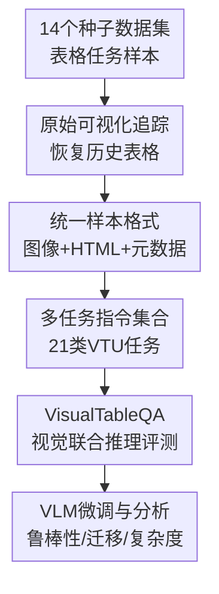

# TABLET: A Large-Scale Dataset for Robust Visual Table Understanding

**会议**: ICLR 2026  
**OpenReview**: [https://openreview.net/forum?id=5UbeQDlYDj](https://openreview.net/forum?id=5UbeQDlYDj)  
**论文**: [OpenReview](https://openreview.net/forum?id=5UbeQDlYDj)  
**代码**: https://github.com/alonsoapp/TABLET  
**领域**: 多模态VLM / 文档智能 / 视觉表格理解  
**关键词**: 视觉表格理解、表格数据集、文档智能、视觉问答、多模态训练  

## 一句话总结
TABLET 将 14 个表格理解种子数据集重新组织成 400 万条视觉表格指令样本，并尽量找回真实网页或文档中的原始表格截图，使 VLM 在合成渲染表格之外也能学习真实表格的版式、颜色、合并单元格和图像线索。

## 研究背景与动机
**领域现状**：表格理解长期把表格当作结构化文本处理，常见做法是把 HTML、Markdown 或图结构线性化后交给语言模型；近两年 VLM 能直接读取截图、PDF 页面和网页界面，视觉表格理解（Visual Table Understanding, VTU）开始变成更自然的范式。对 GUI agent、网页 agent 和文档智能系统来说，很多表格本来就是像素输入，模型必须从屏幕上看到的版式里理解行列关系、视觉强调和嵌入图片。

**现有痛点**：已有 VTU 训练集和 benchmark 往往把序列化表格重新渲染成统一风格的合成图片。这样做方便规模化，但会抹掉真实表格中很关键的线索，例如不规则表头、跨行跨列、背景色、字体变化、细边框、图标和图片单元格。模型在这种数据上训练，容易学会“干净 HTML 表格”的视觉模式，却在真实 Wikipedia 表格、科学论文表格或数学题表格上遇到明显的 train-test mismatch。

**核心矛盾**：表格任务本身需要规模和任务多样性，但视觉鲁棒性又依赖真实可视化。只做真实截图，难以覆盖足够多任务；只做合成渲染，又无法训练模型理解真实视觉风格。TABLET 的核心问题就是怎样在不重新标注数百万样本的前提下，把已有表格任务和真实表格图像重新对齐。

**本文目标**：作者并不提出一个专门模型，而是构建一个可训练、可评测、可扩展的大规模 VTU 资源。这个资源要同时满足四件事：保留原始表格视觉、覆盖多种表格任务、保留可回溯的源数据标识，并提供一个真正需要视觉和表格联合推理的新 benchmark。

**切入角度**：很多经典表格数据集来自 Wikipedia 或文档集合，虽然发布时通常只保留序列化表格或任务样本，但原始网页的历史版本仍可通过 page id、revision id 或数据集元信息找回。作者抓住这一点，把“旧表格任务”重新链接回“当时真实存在的表格可视化”，再把它们统一封装成 VLM 指令数据。

**核心 idea**：TABLET 用“源数据追踪 + 历史页面恢复 + 原始截图/HTML 双表示”的方式，把已有表格理解任务升级成真实视觉表格训练集，并用 VisualTableQA 检验模型是否真的会联合使用视觉线索和表格结构。

## 方法详解

### 整体框架
TABLET 的方法可以理解为一条数据再构建流水线：先收集 14 个已有表格理解数据集中的任务样本，再为每个样本追踪对应的原始表格，尽可能从历史网页或文档中恢复真实可视化；若无法恢复，则退回到合成渲染。最后，作者把所有任务统一成指令格式，并额外构造 VisualTableQA 来测试视觉线索是否真正被模型利用。

这个流程的关键不是简单“把表格截图存起来”，而是让每个训练样本都同时拥有图像、HTML、任务指令、答案和源数据标识。这样后续研究者既能训练 VLM，也能重渲染表格、改写 prompt、做高亮单元格定位或构造新任务。

### 关键设计
**1. 原始可视化追踪：把旧表格任务重新接回真实世界表格**

现有视觉表格数据最大的缺口，是样本规模和真实视觉之间很难兼得。TABLET 的做法不是重新雇人标注 400 万条任务，而是复用已有表格任务的语义监督，同时为它们找回原始视觉。对于来自 Wikipedia 的表格，作者根据种子数据集的抓取时间、页面标识和 revision 信息，通过 Wikipedia 历史归档 API 还原当时页面，再在页面中的多个表格之间做匹配。

匹配时，作者把候选表格和种子表格转成 Markdown 类表示，用 Levenshtein edit distance 衡量相似度，并设置 0.7 的最小相似阈值。这个阈值背后的直觉很具体：Wikipedia 页面持续变化，完全一致不现实；但如果相似度太低，把错误表格截图绑定到任务样本会直接污染监督信号。无法可靠匹配时，TABLET 才把序列化表格渲染成合成图像，因此真实图像优先，合成图像是保覆盖率的后备方案。

**2. 统一样本格式：让数据集不只是图片和固定 prompt 的堆叠**

很多图像式表格数据集只发布固定截图和固定问题，研究者很难知道样本来自哪里，也无法重新高亮单元格、改写指令或构造新监督。TABLET 为每条样本保留 instruction、output、table image path、raw/highlighted HTML、源数据 example id、table id、Wikipedia page id、oldid、任务类型和数据切分等字段。这个设计让 TABLET 更像一个可重组的数据底座，而不是一次性 benchmark。

HTML 表示在这里尤其重要。对于 ToTTo、TURL 这类依赖高亮单元格或高亮列的任务，模型如果只从 prompt 里看到 highlighted value，可能绕开图像直接回答。作者通过 HTML 反查原表格中的对应单元格，在真实可视化上生成显式高亮版本，使监督信号回到图像本身。这样训练目标从“读 prompt 里的值”变成“在表格图像中定位被强调的结构，再完成下游任务”。

**3. 多任务视觉表格集合：用任务多样性训练通用 VTU 能力**

TABLET 覆盖的不是单一表格问答，而是 21 类任务，来自 14 个种子数据集，合计 4,066,851 条样本和 2,031,256 张唯一表格图像。任务范围包括列类型标注、实体链接、关系抽取、结构感知解析、表格问答、表格到文本、数值推理、表格事实验证、单元格抽取、合并单元格检测和表格识别等。这样的组合让 VLM 同时学习三类能力：看清表格结构、理解表格内容，以及把表格内容映射到自然语言或 JSON 答案。

论文还设计了不同规模的训练集来分析数据量和任务平衡。TABLET-L 是最大版本，实验中包含 3,419,176 条训练样本；TABLET-M 对每个任务最多采样 14 万条，得到 1,031,082 条更均衡样本；TABLET-S 则移除列类型、实体链接和关系抽取等 Table Interpretation 任务，保留 690,467 条样本。这个设置把“是不是数据越大越好”和“基础表格解释任务有没有帮助”拆开检验，避免只用一个最终数字讲故事。

**4. VisualTableQA 与视觉复杂度：把评测焦点放在真正需要看的表格上**

TABLET 中很多任务虽然使用视觉复杂表格，但答案有时仍能从纯文本表格内容推出。为了检验模型是否真的学会利用视觉线索，作者构造了 VisualTableQA：标注者选择视觉复杂度高的表格，提出必须联合视觉和表格结构才能回答的问题，例如根据单元格图片判断人物是否穿军装、根据灰色行找队伍、根据背景色选择对应条目。为了避免问题被合成表格或文本信息轻松解出，作者还过滤掉只靠 lossy synthetic representation 就能回答的样本。

视觉复杂度指标把 HTML 结构特征和图像特征合成一个 $S\in[0,1]$ 分数。结构侧包括 colspan/rowspan 不规则性、颜色多样性、字体多样性、嵌入图片比例；视觉侧包括灰度熵、RGB 颜色复杂度、Sobel 边缘不规则性、饱和度和非白背景比例。最终分数是加权和 $S=\sum_k w_kS_k$，其中跨度不规则、颜色多样性、视觉熵等权重较高。这个指标让作者能够按表格视觉难度分桶，观察模型是否在复杂表格上退化。

### 一个完整示例
假设种子数据集中有一条 ToTTo 样本，要求根据 Wikipedia 页面某个表格的高亮单元格生成一句话。传统做法会从序列化表格生成一张统一样式图片，模型看到的是干净的行列网格；TABLET 则先根据页面标题、section、源表格 id 和抓取时间找到对应 Wikipedia 历史版本，再从页面中多个候选表格里选出与种子表格最接近的一个。

如果匹配成功，TABLET 截取真实页面里的表格图像，保留原始字体、颜色、边框、合并单元格和可能的图片。随后，系统用 HTML 定位 ToTTo 标注的 highlighted cells，在真实表格上生成高亮版本，并把“输入指令、输出答案、原始 HTML、原始图像、高亮 HTML、高亮图像、源 example id”写进统一 JSON 样本。模型训练时看到的是视觉表格和指令，输出则被规范成如 `{\"answer\": \"...\"}` 的 JSON。

如果历史页面无法找到足够相似的表格，系统才从种子数据的序列化内容渲染合成图像。这样一条样本仍能进入训练集，但 metadata 会记录它的图像来源。最终，真实图像和合成图像可以被分开训练、混合训练或用于鲁棒性对比。

### 损失函数 / 训练策略
论文没有提出新的损失函数，训练使用标准监督微调（SFT）：给定表格图像和指令，模型自回归生成指定格式答案。主实验使用 Qwen2.5-VL-7B-Instruct，并保持各训练集超参一致，以便把性能差异归因到数据而不是训练技巧。

Qwen2.5-VL-7B 的完整微调采用 DeepSpeed ZeRO-3、bf16、3 个 epoch、AdamW、学习率 $2\times10^{-7}$、weight decay 0.01、cosine decay、warmup ratio 0.03、最大序列长度 8192。视觉输入限制为 max pixels 50,176、min pixels 784，并只训练 multimodal MLP 和 LLM 部分，不训练 vision encoder。Gemma-3-4B-IT 的实验使用 LoRA，rank 为 16，LoRA alpha 为 16，dropout 为 0.05，量化为 4-bit NF4，学习率 $2\times10^{-4}$。

## 实验关键数据

### 主实验
主实验回答三个问题：真实可视化是否提升鲁棒性，TABLET 是否优于 MMTab 等现有资源，以及 TABLET 训练是否能迁移到未见任务。评测包含 held-in 任务（如 WikiTQ、TabMWP、HiTab、TabFact、FeTaQA、TAT-QA）和 held-out 任务（如 InfoTabs、AIT-QA、PubHealthTab、HybridQA、Table Recognition、VisualTableQA）。不同任务使用不同指标：问答和分类多用 accuracy / exact match，生成任务用 BLEU，HiTab 用 F1，Table Recognition 用 Tree-Edit-Distance-based Similarity。

| 设置 | 规模 / 数据来源 | 代表结果 | 结论 |
|------|----------------|----------|------|
| 0-shot Qwen2.5-VL | 无 TABLET 微调 | VTQA 42.4，HiTab 31.2，TAT-QA 6.9 | 基础 VLM 有一定表格能力，但复杂表格和数值推理不足 |
| MMTab 微调 | 约 23 万训练样本，多为合成视觉 | VTQA 41.1，HiTab 41.5，TabRec 43.6 | 对部分结构任务有帮助，但对真实视觉问答没有提升 |
| TABLET-S | 690,467 训练样本，移除 Table Interpretation | VTQA 45.2，HiTab 64.8，TAT-QA 27.8 | 即使较小规模，也显著优于 MMTab 多个任务 |
| TABLET-M | 1,031,082 训练样本，任务更均衡 | VTQA 47.8，HiTab 67.0，TAT-QA 31.0 | 性价比最高，VisualTableQA 最强 |
| TABLET-L | 3,419,176 训练样本，最大版本 | AIT-QA 70.8，PubHealthTab 70.2，TabRec 45.4，TAT-QA 32.5 | 全量数据在多数 held-in/held-out 任务上最稳 |

在 held-in 表格任务上，Qwen2.5-VL 经过 TABLET-L 微调后，相比零样本基线有明显提升：ToTTo 从 9.1 到 30.4，HiTab 从 31.2 到 67.5，FeTaQA 从 7.0 到 31.5，TAT-QA 从 6.9 到 32.5。TabMWP 本来零样本就较强，TABLET-L 仍达到 84.5。WikiTQ 则比较特殊，TABLET-L 为 55.5，略高于零样本 53.4，但不如某些任务上的提升幅度，说明并不是所有表格任务都会同等受益。

在 held-out 任务上，TABLET-L 在 AIT-QA 上达到 70.8，明显超过 0-shot 的 51.7 和 MMTab 的 56.6；PubHealthTab 达到 70.2，高于 0-shot 的 64.7 和 MMTab 的 63.9；Table Recognition 达到 45.4，高于 0-shot 的 24.5。VisualTableQA 上最好的不是最大数据，而是 TABLET-M 的 47.8，说明更均衡的数据分布有时比简单堆更多样本更适合视觉联合推理。

### 消融实验
| 配置 | 关键指标 | 说明 |
|------|---------|------|
| 0-shot 原始 vs 合成评测 | DegScore = -28.90 | 不训练时，模型在真实表格图像上相比合成图像明显退化 |
| TABLET-Bsynth | DegScore = -22.35 | 只用合成图像训练能缓解一点退化，但仍难适应真实视觉 |
| TABLET-Borg | DegScore = -6.63 | 用原始 Wikipedia 可视化训练后，真实表格鲁棒性大幅改善 |
| TABLET-Bmix | DegScore = -7.87，5/7 任务原始图像表现最佳 | 混合真实与合成图像兼顾视觉真实性和样本规模 |
| TABLET-S | 690,467 样本，14 任务 | 去掉 Table Interpretation 后仍强，但多数任务弱于 TABLET-M |
| TABLET-M | 1,031,082 样本，17 任务 | 在 6/8 held-in 和 4/5 held-out 任务上优于 TABLET-S，说明基础解释任务有迁移价值 |
| TABLET-L | 3,419,176 样本，17 任务 | 数据最大，在不少任务上继续提升，但训练成本高达 4000 A100 GPU hours |

视觉复杂度分析进一步支持论文动机。作者按复杂度分桶观察 ToTTo、FeTaQA、HiTab、TabMWP 等任务，发现 TABLET 训练模型在复杂度升高时更不容易崩。尤其在 TabMWP 这类表格图像与数值推理结合的任务上，是否经过视觉表格训练会直接影响高复杂度区间的稳定性。

### 关键发现
- 原始可视化不是噪声，而是鲁棒性的关键来源。只看合成表格训练出来的模型，在真实表格上会遭遇明显退化；TABLET-Borg 将总退化从 -28.90 缩小到 -6.63。
- 混合真实和合成图像通常比二选一更稳。真实图像提供自然版式，合成图像补足无法恢复的表格和额外规模，TABLET-Bmix 在 5/7 个任务的原始图像评测上最好。
- TABLET-M 展现出很强的规模效率。它只有 TABLET-L 约三分之一训练样本，却在 VisualTableQA 上达到 47.8，超过 TABLET-L 的 45.6。
- Table Interpretation 任务并非“低级任务凑数”。加入列类型、实体链接和关系抽取后，模型在多数 held-in 和 held-out 任务上优于 TABLET-S，说明基础表格语义技能能迁移到更复杂 VTU 任务。
- VisualTableQA 的提升很关键，因为它没有加入训练集。TABLET-M 相比 0-shot 的 42.4 达到 47.8，说明训练数据中的真实视觉和任务混合确实带来一定组合泛化。

## 亮点与洞察
- TABLET 最大的亮点是把“数据集工程”做成了可复用研究资产。它不只是发布图片和答案，还保留 HTML、源 id、历史页面 revision 和任务元信息，后续可以继续改 prompt、做高亮、重渲染或构造新 benchmark。
- 论文对真实视觉的论证很扎实。它没有只说真实截图更自然，而是用 original vs synthetic 的退化分数、混合训练对比和视觉复杂度分桶，把 train-test mismatch 量化出来。
- VisualTableQA 的设计抓住了视觉表格理解的本质：不是所有 table QA 都需要视觉，但真实世界有些问题必须看颜色、图片、相对位置和格式。这个 benchmark 能把“读表格文本”与“读表格图像”区分开。
- TABLET-M 的结果提醒我们，大规模数据集不一定只靠更多样本取胜。任务均衡、视觉多样性和源数据质量，可能比简单扩充最大任务更重要。
- 这个资源对 GUI agent 和文档智能很有迁移价值。很多 agent 在网页或 PDF 中面对的不是规范化 CSV，而是含视觉层级和样式暗示的表格截图，TABLET 正好补上这类训练信号。

## 局限与展望
- 数据源仍然高度依赖 Wikipedia。虽然视觉样式比合成渲染丰富，但页面主题、表格规范和语言分布仍可能与企业文档、扫描 PDF、财报和网页后台表格存在差异。
- 原始可视化恢复并不完美。有些 Wikipedia 页面已变化或资源缺失，嵌入图片不可访问时只能退化处理；相似度匹配阈值也可能带来少量错配或漏配。
- VisualTableQA 只有 306 条样本，适合做精细诊断，但规模不足以覆盖所有视觉表格场景。未来可以扩展更多问题类型，例如跨表格比较、图标语义、颜色图例、复杂 footnote 和多页表格。
- 实验主要围绕 Qwen2.5-VL-7B 完整微调展开，其他模型多为零样本或 LoRA 验证。更大模型、推理型 VLM、自反思解码和多步工具调用是否能更充分利用 TABLET，还需要进一步实验。
- 论文没有完整逐任务消融。Table Interpretation 的整体贡献被验证了，但 21 个任务中哪些最能提升视觉结构、哪些最能提升问答迁移，目前还没有拆细。
- 训练成本较高。TABLET-L 完整微调需要约 4000 A100 GPU hours，中小团队更可能使用 TABLET-M、LoRA 或采样子集，因此后续需要更系统的数据选择策略。

## 相关工作与启发
- **vs MMTab**: MMTab 是已有的大规模多模态表格理解资源，覆盖多种任务，但主要依赖合成渲染表格，规模约 43 万样本且缺少源数据可追溯性。TABLET 规模约为其 9.38 倍，并尽量保留原始可视化和 HTML，因此更适合训练真实视觉鲁棒性。
- **vs WikiDT**: WikiDT 保留了 Wikipedia 原始表格可视化，但主要聚焦视觉表格识别和问答。TABLET 的差异在于任务覆盖更广，从结构解析到表格生成、NLI、数值推理和实体链接都有统一格式。
- **vs TableVQA-Bench / MMTBench**: 这些 benchmark 能评估视觉表格能力，但不是大规模训练资源。TABLET 同时提供训练集和 VisualTableQA 评测，使模型能力提升与诊断分析可以在同一资源体系里完成。
- **vs PubTabNet / TableBank / DocStruct4M**: 这些数据集主要服务表格检测、识别或结构解析，更接近 OCR/TSR。TABLET 把结构理解和下游语义任务放在一起，让 VLM 不只会转 Markdown，还要回答、验证、生成和推理。
- **启发**: 文档智能数据集可以从“重新标注”转向“重连源数据”。如果已有任务样本能追溯到原始页面、PDF 或截图，就可以用类似 TABLET 的方式补回视觉层，低成本构造更贴近真实使用场景的多模态训练数据。

## 评分
- 新颖性: ⭐⭐⭐⭐☆ 不是新模型，但把源数据追踪、原始可视化恢复和多任务 VTU 统一到大规模资源中，数据集设计很有价值。
- 实验充分度: ⭐⭐⭐⭐☆ 覆盖 original/synthetic、数据规模、任务消融、held-in/held-out、VisualTableQA 和复杂度分析，但逐任务贡献和更多模型完整微调还可加强。
- 写作质量: ⭐⭐⭐⭐☆ 论文结构清楚，表格和消融能支撑主张；少数任务数量和 TABLET 任务总数表述在正文/表格中略显密集，需要读者仔细对齐。
- 价值: ⭐⭐⭐⭐⭐ 对视觉表格理解、文档智能和像素级 agent 都是高价值基础资源，尤其适合训练和诊断模型在真实表格版式上的鲁棒性。

<!-- RELATED:START -->

## 相关论文

- [\[CVPR 2026\] ChartNet: A Million-Scale, High-Quality Multimodal Dataset for Robust Chart Understanding](../../CVPR2026/multimodal_vlm/chartnet_a_million-scale_high-quality_multimodal_dataset_for_robust_chart_unders.md)
- [\[CVPR 2026\] Towards Open-Vocabulary Industrial Defect Understanding with a Large-Scale Multimodal Dataset](../../CVPR2026/multimodal_vlm/towards_open-vocabulary_industrial_defect_understanding_with_a_large-scale_multi.md)
- [\[ICLR 2026\] TableDART: Dynamic Adaptive Multi-Modal Routing for Table Understanding](tabledart_dynamic_adaptive_multi-modal_routing_for_table_understanding.md)
- [\[ICLR 2026\] RAVENEA: A Benchmark for Multimodal Retrieval-Augmented Visual Culture Understanding](ravenea_a_benchmark_for_multimodal_retrieval-augmented_visual_culture_understand.md)
- [\[ICLR 2026\] Plug, Play, and Fortify: A Low-Cost Module for Robust Multimodal Image Understanding](plug_play_and_fortify_a_low-cost_module_for_robust_multimodal_image_understandin.md)

<!-- RELATED:END -->
