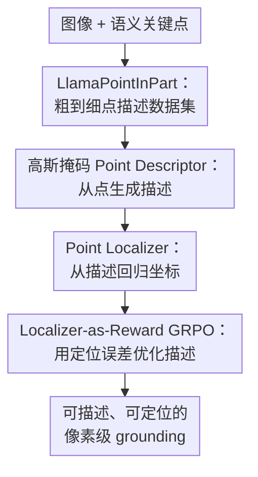

# Talking Points: Describing and Localizing Pixels

**会议**: ICLR2026  
**OpenReview**: [https://openreview.net/forum?id=FcGQVshxMP](https://openreview.net/forum?id=FcGQVshxMP)  
**代码**: https://matanr.github.io/Talking Points  
**领域**: 多模态VLM / 像素级视觉语言定位  
**关键词**: 像素级 grounding、关键点描述、VLM、点定位、GRPO

## 一句话总结
这篇论文提出 TalkingPoints，用 Point Descriptor 把图像中的单个像素/关键点描述成粗到细的自然语言，再用 Point Localizer 从描述回归像素坐标，并通过定位准确率来训练和评价“一个点有没有被说清楚”。

## 研究背景与动机
**领域现状**：视觉语言模型已经能做图像问答、区域描述、框/掩码 grounding，甚至可以接受点、框、mask 作为提示来讨论某个局部区域。SAM、Grounding-DINO、OMG-LLaVA、DAM 这类方法把空间提示和语言连接起来之后，VLM 的 grounding 能力已经从整图走到了对象和区域尺度。

**现有痛点**：问题在于，区域级 grounding 并不等于像素级理解。一个 box 或一个 mask 允许模型笼统地说“这只猫”“这片椅背”，但如果输入是猫爪上一枚很小的暗点，模型需要同时说明它属于哪个对象、哪个部件、部件内部的相对位置，以及周围有什么视觉纹理。已有关键点方法如 KptLLM、LocLLM 更多依赖“左肩”“猫的左眼”这类预定义名称或模板，能告诉模型找哪个语义部件，却不能自由描述一个任意像素为何是这个像素。

**核心矛盾**：像素级语言 grounding 的难点不是“有没有语言”，而是语言必须足够可定位。人写的自然描述可能很丰富，但风格不稳定；模板化 keypoint name 很稳定，却缺少实例位置和局部外观。要训练模型生成这种描述，还缺少现成的图像-像素-描述三元组数据。

**本文目标**：作者把目标拆成两个互逆问题：给定图像和一个点，生成能唯一定位该点的自然语言描述；给定图像和这段描述，回归对应点的像素坐标。前者测试模型能不能“说清一个像素”，后者测试这段话是否真的可定位。

**切入角度**：论文的关键观察是，像素点描述应该是粗到细的：先说明对象在整图中的位置，再说明部件在对象中的位置，再说明点在部件里的相对位置，最后补上点附近的颜色、纹理、形状等局部线索。这个结构比单纯说“狗鼻子”更适合区分多实例、多部件和微小局部差异。

**核心 idea**：用一个“描述器-定位器”闭环来定义像素级语言 grounding：描述器负责生成可定位语言，定位器负责把语言还原成坐标，并把还原误差作为评价甚至强化学习奖励。

## 方法详解

### 整体框架
TalkingPoints 由数据构建、点到语言、语言到点、闭环优化四部分组成。作者先合成 LlamaPointInPart 数据集，为每个图像中的语义关键点生成粗到细描述；然后分别训练 Point Descriptor 和 Point Localizer，使前者从图像点生成描述，后者从图像描述回归坐标；最后在没有描述标注的 AP-10K 上，用冻结的 Localizer 给 Descriptor 的输出打分，做 localization-based GRPO 适配。

这个框架里最重要的不是单个模型结构有多复杂，而是任务定义本身形成了闭环。描述器如果只是写出流畅 caption，但定位器找不回原点，就说明这段话没有真正刻画像素；定位器如果只能处理训练集风格描述，也会暴露出评价协议的风格依赖。

### 关键设计
**1. LlamaPointInPart：把像素点写成可定位的粗到细语言**

论文首先解决“没有训练数据”的问题。作者从 PascalPart116、ADE20KPart234 和 PartImageNet 中取带 part-level box 标注的图像，在语义部件内部用 SIFT 响应挑选关键点，因此点不是纯随机背景像素，而是落在有语义归属的对象部件上。然后系统记录点相对部件的位置，例如靠近上边缘、位于中心偏右等，这一步给后续语言描述提供了可定位的空间骨架。

真正让数据集有价值的是多尺度描述合成。OMG-LLaVA 负责看整图和点，生成对象/部件层面的上下文；LLaVA 看以点为中心的高斯遮罩局部区域，补充纹理、颜色、形状等细节；Llama3.3 再把这些信息整理成一段从场景到局部的自然语言。最终描述通常包含四层：对象在图中哪里，部件在对象哪里，点在部件哪里，点周围看起来怎样。这样生成的 LlamaPointInPart 有 20K+ 三元组，训练集约 17K、测试集约 4K，覆盖 64 类对象和 297 类部件。

**2. 高斯掩码 Point Descriptor：让 VLM 真正看向这个像素**

Point Descriptor 改造自 OMG-LLaVA，但它不再预测对象 mask，而是把输入点 $(x, y)$ 转成以该点为中心的固定高斯 attention mask。点坐标一方面通过 learnable prompt embedding 形成初始语义查询，另一方面经过正弦位置编码和线性投影形成空间查询；这些查询进入 OMG-Seg decoder，与多尺度图像特征交互。

高斯掩码的作用是强制 cross-attention 只聚焦在关键点邻域，而不是像对象级 mask 那样覆盖整个物体。这样得到的表示不再是“object features”，而是更贴近像素邻域的 keypoint features；同时，完整图像特征仍然被送入 LLM，使生成描述时既有全局上下文，也有局部焦点。消融显示，如果去掉高斯掩码，让模型沿用 OMG-LLaVA 的对象 mask 机制，mPCK 会从 78.13 降到 23.63，说明像素级描述不是靠普通区域对齐自然涌现出来的，必须显式告诉模型“看这里”。

**3. <SEG> Point Localizer：用一个特殊 token 把语言压成坐标**

Point Localizer 做反向映射：输入图像和一段描述，输出归一化坐标 $\hat{p}=(\hat{x},\hat{y})\in[0,1]^2$。它沿用 grounding VLM 的对话形式，把提示写成“Please segment region1: [Description]”，模型回复里包含 `
 keypoint 
 <SEG>`。作者取 `<SEG>` token 对应的隐藏状态 $h\in R^d$，经过 text-to-vision projection 和一个轻量 MLP，直接回归二维坐标。

训练目标是坐标均方误差 $L_{loc}=\mathrm{MSE}(\hat{p},p_{gt})$。看起来这是一个小改动，但它把评价从“描述文本像不像参考答案”改成了“描述能不能把点找回来”。这对像素级语言任务很关键，因为同一个点可以有多种说法，BLEU 或语义相似度未必能判断可定位性；定位误差则直接检查语言是否包含足够的空间和视觉线索。

**4. Localizer-as-Reward GRPO：没有描述标注时用定位误差训练描述器**

在 AP-10K 这类只有图像和关键点、没有自然语言描述的数据上，作者用冻结 Point Localizer 作为 reward model 来优化 Descriptor。对同一个图像点，Descriptor 采样 $G$ 条描述 $o_i$，Localizer 分别预测坐标 $\hat{p_i}$，奖励定义为 $r_i=-\mathrm{MSE}(\hat{p_i},p)$。描述越能让 Localizer 找回原点，奖励越高。

优化时使用改造版 GRPO。组内优势写作 $\hat{A_i}=\frac{r_i-\mathrm{mean}(r)}{\mathrm{std}(r)}$，再把每条序列的优势分配给该序列所有 token，并按长度归一化。完整目标还加入相对参考策略 $\pi_{ref}$ 的 KL 正则，避免模型为了骗过当前 Localizer 而漂移到奇怪语言。这个闭环的价值在于降低描述标注成本：关键点坐标比人工写高质量点描述便宜得多，如果 reward 足够可靠，Descriptor 就可以在更多类别上继续适配。

### 一个完整示例
假设输入是一张两只狗在雪地里的图像，目标点在右侧小狗鼻子附近。传统模板可能只给“dog nose”，如果图里有多只狗，Localizer 仍然不知道是哪一只；人类也可能写“右边小狗的鼻尖”，但如果训练数据更偏向粗到细格式，模型未必能稳定解析。

TalkingPoints 的描述会先说目标对象是更靠近图像右下角的小狗，再说点位于它的鼻子上，接着补充在鼻子内部略偏上的相对位置，最后加入“深色、近圆形、和雪地背景形成对比”这类局部外观。Localizer 读到这段话后，不是生成 mask，而是通过 `<SEG>` 的隐藏状态回归 $(\hat{x},\hat{y})$。如果预测点落在归一化距离阈值 0.1 或 0.2 内，就计入 PCK；Descriptor 的好坏也由这个回归结果间接评估。

这个例子说明了论文和普通 captioning 的区别：文字不是为了“描述得漂亮”，而是为了让另一个模型在同一张图上重新找到那个像素。因此对象顺序、部件位置、部件内相对方位和局部纹理缺一不可。

### 损失函数 / 训练策略
Point Descriptor 从 OMG-LLaVA 初始化，在 LlamaPointInPart 上训练 10 个 epoch，batch size 为 8，学习率约为 $2\times10^{-4}$，使用标准语言建模损失 $L_{text}$，主要通过 LoRA 适配语言模型。Point Localizer 训练 15 个 epoch，学习率为 $10^{-5}$，同样 batch size 为 8；它优化 LoRA、vision-to-text projection 和坐标回归 MLP，其余参数冻结。

定位评价使用 PCK。先把图像坐标归一化到 $[0,1]$，计算预测点和真值点的欧氏距离；若小于阈值则视为正确。论文报告 mPCK，定义为 PCK@0.1 和 PCK@0.2 的平均值，用一个指标同时覆盖精细定位和粗粒度区域定位。

RL 阶段设组大小 $G=3$，KL 系数 $\beta_{KL}=0.1$，学习率 $5\times10^{-6}$，训练 3 个 epoch。由于每个样本要采样多条描述并调用 Localizer，RL 计算开销明显更高，所以论文只在 Bovidae/Canidae 交叉类别设置上做了较小规模验证。

## 实验关键数据

### 主实验
论文的核心实验在 LlamaPointInPart 测试集上进行：所有方法生成或提供描述，再由同一个 Point Localizer 回归坐标，用 mPCK 衡量描述是否可定位。结果显示，TalkingPoints 的预测描述几乎达到 ground-truth 描述水平，并大幅超过 OMG-LLaVA 和 DAM。

| 数据集 | 指标 | 本文 | 之前SOTA / 基线 | 提升 |
|--------|------|------|-----------------|------|
| LlamaPointInPart test | mPCK | 78.13 | OMG-LLaVA 31.03 | +47.10 |
| LlamaPointInPart test | mPCK | 78.13 | DAM 42.87 | +35.26 |
| LlamaPointInPart test | mPCK | 78.13 | GT Description 78.83 | 接近人工构造真值描述 |
| 100 个扩展样本 | mPCK | 约 78 | ChatGPT-5 约 62 | +16 |
| 100 个扩展样本 | mPCK | 约 78 | Human 约 56 | +22 |

更细的 PCK 分解也很有信息量。本文方法在严格阈值 PCK@0.1 上达到 63.93，在宽松阈值 PCK@0.2 上达到 92.33；这说明它不仅能把点落回大致区域，也能在相当多样本上达到较精细的像素级定位。

| 方法 | PCK@0.1 | PCK@0.2 | mPCK |
|------|---------|---------|------|
| OMG-LLaVA | 17.26 | 44.80 | 31.03 |
| DAM | 28.24 | 57.49 | 42.87 |
| TP (Ours) | 63.93 | 92.33 | 78.13 |
| GT Description | 65.60 | 92.05 | 78.83 |

### 消融实验
两个消融都直接对应方法设计。高斯掩码验证的是 Descriptor 是否真的获得像素级视觉焦点；LLM LoRA 适配验证的是 Localizer 是否需要语言模型本体参与关键点理解。

| 配置 | 关键指标 | 说明 |
|------|---------|------|
| Point Descriptor | mPCK 78.13 | 使用高斯掩码聚焦关键点邻域 |
| w/o Gaussian mask | mPCK 23.63 | 退回 OMG-LLaVA 式对象 mask 机制，几乎学不会点和描述的对应 |
| Point Localizer | mPCK 78.83 | 使用 GT 描述时的定位上限 |
| w/o LLM adaptation | mPCK 47.60 | 冻结 LLM，仅训练投影层和 MLP，语言-坐标对齐明显变弱 |

跨类别 RL 实验的绝对值不高，但方向一致。训练在 Bovidae、测试 Canidae 时，mPCK 从 29.85 到 29.96；反向从 28.56 到 30.36。作者也承认这只是 promising direction，而不是已经解决大规模开放类别泛化。

| 测试集 | 方法 | mPCK | 变化 |
|--------|------|------|------|
| Canidae | TP zero-shot | 29.85 | - |
| Canidae | TP+RL on Bovidae | 29.96 | +0.11 |
| Bovidae | TP zero-shot | 28.56 | - |
| Bovidae | TP+RL on Canidae | 30.36 | +1.80 |

### 关键发现
- 高斯掩码是最大贡献点之一。没有它时，即使训练数据相同，模型也容易把点提示理解成普通对象/区域提示，无法绑定到具体像素。
- 预测描述几乎追平 GT 描述，说明 Descriptor 学到的不是泛泛 caption，而是和 Localizer 训练分布高度匹配的可定位语言。
- Human 描述低于 ChatGPT-5 和 TP 不应被解读为“人类不会描述点”，更可能说明当前 Localizer 对 LlamaPointInPart 风格敏感；这既是有趣结果，也是评价协议的局限。
- RL 在 AP-10K 上提升有限但一致，说明 localization reward 有信号，不过跨数据集、跨动物超类时，单靠当前 Localizer 还不足以获得强泛化。

## 亮点与洞察
- 论文最好的地方是把“描述质量”从文本相似度转成定位可还原性。像素描述有很多合法说法，只比较参考文本会惩罚同义改写；通过 Localizer 找点，评价目标和任务本身更一致。
- Point Descriptor 和 Point Localizer 的双向结构很自然。前者回答“这个点怎么说”，后者回答“这句话指哪个点”，闭环后可以作为训练目标、评价协议，也可能成为交互式标注工具。
- LlamaPointInPart 的粗到细描述结构很可复用。对象位置、部件位置、部件内方位、局部外观这四层不仅适用于关键点，也适用于指代表达、局部编辑、机器人抓取点解释等任务。
- 高斯掩码这个设计提醒我们，VLM 的空间输入不能只靠语言 token 暗示。对象级 grounding 和像素级 grounding 的 inductive bias 不同，前者要聚合区域语义，后者要保留局部坐标和邻域纹理。
- 用 Localizer 做 reward 的思路有潜力扩展到低成本数据。只要有图像和点，就可以让 Descriptor 自己尝试写描述，再用定位误差筛选和优化，避免每个点都请人写长文本。

## 局限与展望
- 当前评价依赖单个在 LlamaPointInPart 上训练的 Localizer，因此指标更适合比较相同描述风格下的方法。若描述风格偏离训练集，例如人类写得更口语、更省略，分数可能低估真实可理解性。
- 描述高度依赖同一张图中的空间关系。比如“靠近图像左上”“在椅座右边缘”对单图定位很有用，但在跨视角匹配、视频跟踪或 stereo correspondence 中，图像坐标和对象姿态变化后可能失效。
- 数据构建使用多个 VLM 和 LLM 合成描述，质量虽然抽检较高，但仍可能继承教师模型偏差。尤其是局部细节描述可能把纹理误解成语义部件，或者在标注缺失时补出并不存在的解释。
- RL 结果还比较初步。Bovidae/Canidae 都是动物关键点，视觉结构仍相近；若迁移到工具、家具、医学图像或遥感场景，reward model 是否可靠还需要更强证据。
- 未来可以训练多风格 Localizer，或引入人类描述、短描述、跨视角描述共同训练，让评价协议更少依赖单一合成语料风格。另一个方向是把描述从“相对图像坐标”转向更稳定的语义和外观特征，用于图像对应和机器人操作。

## 相关工作与启发
- **vs OMG-LLaVA**: OMG-LLaVA 能接受点、框、mask 做区域对话，也能生成 segmentation token，但核心仍偏对象/区域级理解。本文复用其架构基础，却用高斯掩码和坐标回归把任务压到单个关键点。
- **vs DAM / Describe Anything**: DAM 强在给局部区域生成详细描述，适合 mask/region captioning；TalkingPoints 更关心描述是否能唯一定位一个像素，因此评价标准从描述质量转为点回归准确率。
- **vs LocLLM**: LocLLM 直接从人体关键点描述回归坐标，主要在人体关键点和模板式描述中工作。本文的描述更自由，类别也来自多源部件数据，并明确引入反向 Descriptor。
- **vs KptLLM**: KptLLM 关注语义关键点名称理解和跨类 pose 任务，文本多是对象、部件、keypoint name 的组合。本文试图摆脱固定 keypoint name，用视觉上下文和局部外观来描述任意语义部件内的点。
- **vs CLAMP / CapeX**: 这些方法利用文字解释或文本 prompt 改善 category-agnostic pose estimation，任务仍偏“找预定义关键点集合”。TalkingPoints 更像一个基础 pixel-language grounding 任务，可以为关键点检测提供更细粒度的语言接口。

## 评分
- 新颖性: ⭐⭐⭐⭐⭐ 把像素点描述和像素点定位做成互逆闭环，并用定位误差评价语言描述，任务定义和评价方式都很有启发性。
- 实验充分度: ⭐⭐⭐⭐☆ 主实验、消融和扩展评估支撑核心结论，但 RL 泛化实验规模较小，评价器风格依赖也需要更多验证。
- 写作质量: ⭐⭐⭐⭐☆ 方法线索清楚，图和表能解释主要贡献；部分实验结论，尤其 human 描述表现，需要读者注意评价协议 caveat。
- 价值: ⭐⭐⭐⭐⭐ 这篇论文为 VLM 从区域 grounding 走向像素级语言接口提供了清晰基准、数据构建方法和可训练闭环，后续可迁移到局部编辑、机器人操作和细粒度视觉标注。

<!-- RELATED:START -->

## 相关论文

- [\[ICLR 2026\] From Pixels to Words -- Towards Native Vision-Language Primitives at Scale](from_pixels_to_words_--_towards_native_vision-language_primitives_at_scale.md)
- [\[CVPR 2025\] Ground-V: Teaching VLMs to Ground Complex Instructions in Pixels](../../CVPR2025/multimodal_vlm/ground-v_teaching_vlms_to_ground_complex_instructions_in_pixels.md)
- [\[CVPR 2026\] Pixels Don't Lie (But Your Detector Might): Bootstrapping MLLM-as-a-Judge for Trustworthy Deepfake Detection and Reasoning Supervision](../../CVPR2026/multimodal_vlm/pixels_dont_lie_but_your_detector_might_bootstrapping_mllm-as-a-judge_for_trustw.md)
- [\[ICLR 2026\] CapRL: Stimulating Dense Image Caption Capabilities via Reinforcement Learning](caprl_stimulating_dense_image_caption_capabilities_via_reinforcement_learning.md)
- [\[ICLR 2026\] SPECS: Decoupling Multimodal Learning via Self-distilled Preference-based Cold Start](specs_decoupling_multimodal_learning_via_self-distilled_preference-based_cold_st.md)

<!-- RELATED:END -->
