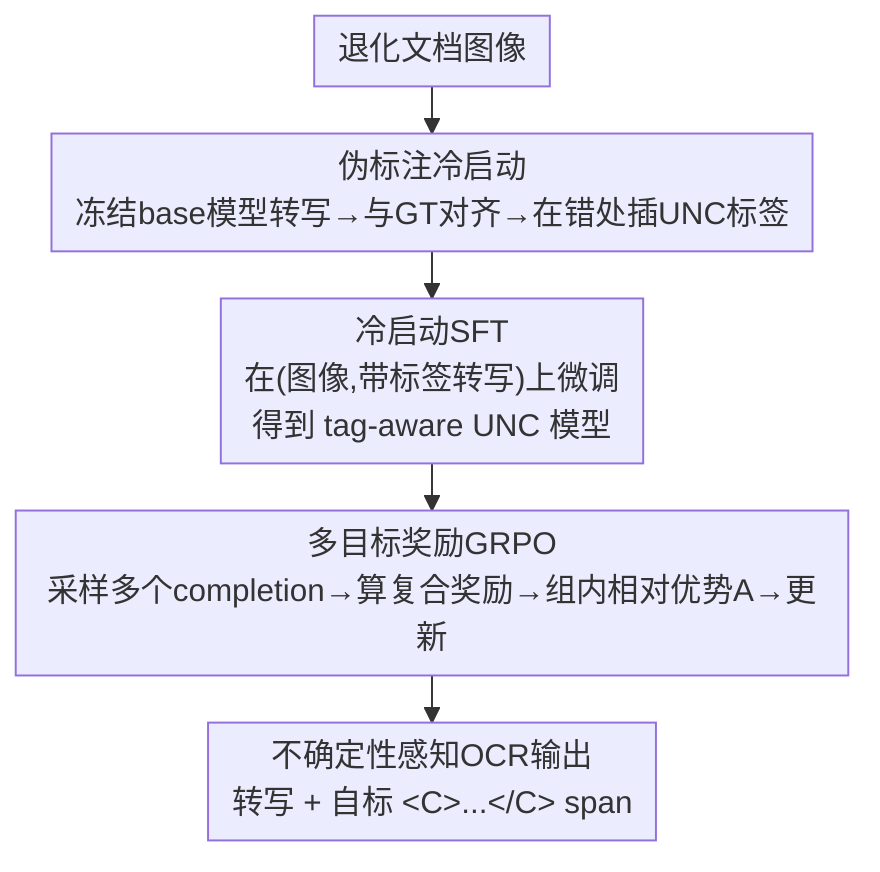

# Teaching VLMs to Admit Uncertainty in OCR from Lossy Visual Inputs

**会议**: ICLR 2026  
**OpenReview**: [https://openreview.net/forum?id=zyCjizqOxB](https://openreview.net/forum?id=zyCjizqOxB)  
**代码**: https://github.com/NikoGuan/Uncertainty_OCR  
**领域**: 多模态VLM  
**关键词**: 不确定性感知OCR, 视觉语言模型, 幻觉, GRPO, 退化文档

## 一句话总结
针对 VLM 在模糊/退化文档上"流畅地编造错字却不示警"的幻觉问题，本文让模型在转写的同时用一对 `<C>...</C>` 标签把自己拿不准的片段框出来，靠"伪标注冷启动 + 多目标奖励 GRPO"训练，在自建的 Blur-OCR 基准上把不确定标签的 word 级 F1 做到 0.685、且不损失转写精度。

## 研究背景与动机

**领域现状**：现代 OCR 正在被 VLM（如 Qwen2.5-VL、GOT、Dolphin）大规模取代，它们在干净文档上的转写精度远超传统 CRNN/TrOCR 这类 pipeline。

**现有痛点**：当输入是模糊、低分辨率、压缩失真、遮挡的退化文档时，VLM 会"幻觉"——生成读起来通顺、却没有视觉证据支撑的文字，而且**不给任何不确定信号**。这比传统 OCR 更危险：传统模型在读不清的区域往往吐出乱码或畸形串，人眼一看就知道这里有问题、容易定位和过滤；而 VLM 的错误"看起来都对"，下游很难发现，错误会悄悄传播，污染数字化档案、训练数据和分析结果。

**核心矛盾**：当前的后训练（SFT/RLHF）一味奖励准确率，这等于在逼模型"即使没把握也要猜一个"——越鼓励准确，越鼓励瞎猜。于是"高精度"和"诚实地承认不确定"成了一对被忽视的矛盾。

**本文目标**：训练一个 OCR 模型，既保持强转写精度，又能**显式、局部地**标出自己不可靠的片段，并配套一套能客观评测"标得准不准"的协议。

**切入角度**：作者的关键观察是——不要去压制猜测，而要让猜测"透明化"。模型该不该打标签不取决于像素层面"这块到底能不能读"（这是因人/因模型而异的主观判断），而取决于**它自己这次的转写靠不靠谱**：哪怕区域很糊，只要模型能靠上下文正确补全，就不该打标签。

**核心 idea**：把 OCR 重构成"转写 + 自标不确定 span"的序列决策任务，用一对 UNC 标签 `<C>...</C>` 包住可疑片段，并用 GRPO + 多目标奖励来教会这个全局性的标注行为。

## 方法详解

### 整体框架

整篇方法要解决的是：怎么让一个本来只会"硬转写"的 VLM，学会在转写流里把自己没把握的片段用 `<C>...</C>` 框起来，且不能为了多框而牺牲转写精度、也不能靠投机取巧骗奖励。作者用一条**两阶段**流水线（冷启动 → GRPO）实现：先用"伪标注冷启动"给模型一个会打标签的初始策略，再用一个把转写精度和不确定覆盖率揉到一起、并带防作弊阻尼的多目标奖励，通过 GRPO 把这个行为强化好。

为什么不能只用 SFT？因为 UNC 标签是**成对括号、可以跨很长一段文本**，放在哪是依赖整条转写的**全局选择**；而 token 级 SFT 只优化局部 next-token 似然，会过度惩罚"整体更好但有近似 span"的转写、又放过"整体更差但标签畸形/截断"的转写——目标和评测错位。所以核心训练交给序列级奖励的 GRPO。

### 关键设计

**1. 不确定性标签范式与隶属规则：把"哪里不放心"做成可评测的二分类**

这是全文的地基，针对的痛点是"VLM 不示警 + 没有客观标准衡量示警对不对"。作者定义 UNC 标签为成对定界符 `<C>...</C>`，推理时模型用它包住自认为可疑/可能出错的片段；并在**字符级**和**词级**两种粒度 $L\in\{\text{char},\text{word}\}$ 上严格规定了"什么算被框住"。具体地，先丢弃所有非法标签（嵌套、交叉、未闭合），只保留良构对；再把预测 $\hat{y}$ 与真值 $y$ 对齐：显式在内（落在一对 `<C></C>` 之间）的字符算 inside，而 GT 里有、预测里缺失的连续段，若在对齐路径上**紧贴**某个显式 UNC span 边界（中间没有已对齐字符），则算"隐式 inside"。这样"被标住的单元总数 = 显式标注 + 邻接缺失隐式归因"。

在此之上把评测变成一个二分类：把"错"当正类，定义 $\text{ErrIn}_L$（UNC 内的错误单元，TP）、$\text{CorrectIn}_L$（UNC 内的正确单元，FP）、$\text{ErrOut}_L$（UNC 外的错误单元，FN），于是

$$P_L=\frac{\text{ErrIn}_L}{\text{CorrectIn}_L+\text{ErrIn}_L},\quad R_L=\frac{\text{ErrIn}_L}{\text{ErrOut}_L+\text{ErrIn}_L},\quad F_{1,L}=\frac{2P_LR_L}{P_L+R_L}.$$

由于总错误单元数恰等于该粒度下的编辑距离，$R_L$ 度量"所有错误被 UNC 覆盖的比例"、$P_L$ 度量"UNC 框住内容的纯度"。转写精度则用归一化后的 Levenshtein 编辑距离率 $e_L=\text{ED}_L(y,\hat{y})/|y|_L$，$\text{Accuracy}_L=1-e_L$。作者还报告一个 Gap 指标 $\text{Gap}_L=e_{\text{in},L}-e_{\text{out},L}$，即 UNC 内外错误率之差，越大说明标签越能把错误"圈进去、把正确留在外面"。

**2. 伪标注冷启动：给模型自己的输出打标签，而不是给真值打**

针对的痛点是"纯 RL 教不会"——没有先验，策略几乎探索不到合法的标签结构，收敛慢、校准差。作者的做法是先造一批冷启动监督：在一批退化图上跑预训练 base 模型得到转写，把转写与 GT 对齐定位出替换/插入/删除错误，然后**在模型自己的转写**里、围绕这些错误插入 UNC 标签。两种粒度分别准备：字符级精确包住替换/插入产生的错字；词级把含至少一个错的整词包住。对"缺失"（预测里根本没有对应文本、无从打标）的字符或词，则把不确定指派给**最近的词**并整词包住。

这里最关键的设计取舍是**给自己的输出打标签、而不是给 GT 打**。理由很硬核：推理时模型只有自己的转写、看不到 GT；若按 GT 位置打标签，模型会学着在测试时根本看不见的 GT 位置上贴标签，且插入/删除会让位置映射错位。给自己的输出打标签才能保证训练与推理一致。另外，由于在"模型输出"上做 SFT 有拉低转写精度的风险，作者在 SFT 时**混入一部分 (图像, GT) 干净对**来兜底精度，掉下去的精度后续靠 GRPO 找补。

**3. 多目标奖励 + 长度失配阻尼 η：一个能防 reward hacking 的复合奖励**

冷启动只是起步，真正把"既准又会标"强化好靠这个奖励。作者把转写精度和标注质量揉进一个标量：

$$R_L(\hat{y},y)=\max\Big\{0,\ (1-e_L)+\lambda\,\eta\,e_L\,F_{\beta,L}\Big\}.$$

转写项就是 $(1-e_L)$（难样本上 $e_L$ 可超过 1，外层 $\max\{0,\cdot\}$ 把总奖励截非负以稳定训练）；标注项用 $\beta$-加权 F 值 $F_{\beta,L}=\frac{(1+\beta^2)P_LR_L}{\beta^2 P_L+R_L}$，$\beta<1$ 偏精度、$\beta>1$ 偏召回。注意作者**故意不**在奖励里惩罚标签格式错误（畸形标签很常见，惩罚会让模型干脆不敢用标签），而是在评测/算奖励时直接忽略非法标签。

复合奖励的两处巧思都在防作弊。其一是 $\lambda$ 的范围：忽略外层 $\max$ 做上界分析，因 $0\le F_\beta\le1$、$\eta\le1$，有 $R\le(1-e)+\lambda e=1-(1-\lambda)e=:R_{\max}(e)$；当 $0<\lambda<1$ 时 $R_{\max}$ 对 $e$ 严格递减（斜率 $\lambda-1<0$），意味着"多犯一个错、哪怕被完美标住，奖励也一定下降"，从而**杜绝了模型故意制造再标错误来刷分**。其二是长度失配阻尼 $\eta$：当假设长度与参考长度差太多时，一个贴在边界的标签会按隐式覆盖规则"吃掉"大片邻接缺失，从而虚高标注分。作者定义 $\rho_L=\frac{\max(|\hat{y}|_L,|y|_L)}{\min(|\hat{y}|_L,|y|_L)}$，$\eta=2^{-\mathbb{I}[\rho_L>\tau]}$（$\tau=1.3$）——只有在极端长度失配（$\rho_L>\tau$）时把标注项**减半**，专门压制"截断/过度生成 + 边界贴标签"这种 hack。

**4. 反直觉的 Char-CS + Word-reward 粒度搭配：紧边界打底、宽信用驱动**

冷启动和奖励都各有字符/词两种粒度，怎么搭最好并不显然。作者系统扫了所有组合，发现一个反直觉但稳定有效的配置：**字符级冷启动 + 词级奖励**校准最好（word F1≈0.57、Gap≈0.59，且精度不掉）。解释是：字符级冷启动教会模型贴紧、精确的边界，让它能以更高 precision 落标签；而词级奖励提供**更密集、更宽容**的信用，模型能持续累积有效奖励、稳步改进。反观字符级奖励太严、信用稀疏，难以稳定提升。这一搭配成为后续所有实验的默认训练配方。

### 损失函数 / 训练策略

冷启动用 LLaMA-Factory 做 SFT（48k 对），GRPO 用 VERL 在 107,520 张图上训练。GRPO 对同一输入 $q_b$ 采样 $G$ 个 completion，按序列级奖励 $R_L(\hat{y}_{b,g},y_b)$ 在组内标准化成相对优势 $A_{b,g}$，最大化带 KL 正则的裁剪目标：

$$J_{\text{GRPO}}(\theta)=\frac{1}{B}\sum_{b}\frac{1}{G}\sum_{g}\Big[\min\big(\rho_{b,g}A_{b,g},\ \text{clip}(\rho_{b,g},1-\epsilon,1+\epsilon)A_{b,g}\big)-\beta_{\text{KL}}D_{\text{KL}}(\pi_\theta\|\pi_{\text{ref}})\Big],$$

其中 $\rho_{b,g}=\frac{\pi_\theta(\hat{y}_{b,g}|q_b)}{\pi_{\text{old}}(\hat{y}_{b,g}|q_b)}$ 为序列级似然比。GRPO 用组内相对优势替掉价值模型，正好适合本文这种噪声大、绝对尺度难校准的复合奖励。默认超参 $\beta=0.5,\lambda=0.9,\tau=1.3$。

## 实验关键数据

骨干为 Qwen2.5-VL-7B，评测基准是自建的 **Blur-OCR**（源自 Project Gutenberg，按 Prep-OCR 风格随机叠加噪声/降分辨率/高斯模糊/背景纹理/污渍/划痕/遮挡+局部强退化；107,520 训练 + 2,048 评测图，是首个面向"不确定性感知 OCR"的退化文档基准）。

### 主实验

跨模型对比（Blur-OCR，word 级）：

| 类别 | 模型 | UNC F1 (word) | Accuracy (word) |
|------|------|------|------|
| 通用 VLM | GPT-4o | 0.039 | 0.734 |
| 通用 VLM | Gemini-2.5-Pro | 0.163 | 0.826 |
| 通用 VLM | Claude-Opus-4 | 0.205 | 0.733 |
| OCR 专用 | MinerU2.5 | – | 0.732 |
| UQ baseline | Ensembles（5模型投票） | 0.491 | 0.826 |
| UQ baseline | Qwen2.5-VL-7B（entropy 阈值） | 0.410 | 0.840 |
| **本文** | InternVL2.5-8B (UNC) | 0.622 | 0.748 |
| **本文** | Qwen2.5-VL-3B (UNC) | 0.638 | 0.798 |
| **本文** | **Qwen2.5-VL-7B (UNC)** | **0.685** | **0.839** |

本文 7B 模型 word F1 0.685（precision 0.839 / recall 0.620），全面超过所有通用 VLM、OCR 专用系统和两种传统不确定性量化（熵阈值、多模型投票）基线，且转写精度不降；InternVL2.5 上复现出相似能力，说明方法跨架构可迁移。

### 消融实验

Exp2（冷启动与奖励粒度，word 级）+ Exp3（奖励超参）：

| 配置 | UNC F1 (word) | Accuracy (word) | 说明 |
|------|------|------|------|
| 无冷启动 + Char 奖励 | 0.009 | 0.735 | 几乎不打标签，RL 学不会 |
| 随机标签冷启动 + Char 奖励 | 0.298 | 0.752 | 只学会格式，落点很差 |
| Word-CS + Char 奖励 | 0.300 | 0.830 | 粒度错配 |
| **Char-CS + Word 奖励** | **0.574→0.685** | **0.839** | 最佳搭配（含β=0.5调优后） |
| β=1.2（过度召回） | 0.558 | 0.814 | precision 崩塌 |
| λ=1.0（上界拉平） | 0.811* | 0.767 | F1 虚高但精度掉、且制造错误 |
| η=1.0（关阻尼） | 0.577 | 0.782 | 输出持续变短、刷分 |

\* λ=1.0 的高 F1 是"制造并标错误"的退化策略所致，精度从 0.839 掉到 0.767，故弃用。

### 关键发现

- **冷启动是 UNC 能力的必要条件**：不给冷启动，GRPO 几乎产不出标签（F1≈0.01）；随机标签冷启动只教会格式、落点很差。结构化伪标注冷启动是把标签"放对地方"的前提。
- **粒度反直觉**：字符级冷启动（紧边界、高 precision）+ 词级奖励（密集宽容信用）是最优组合，而非"两边都用同一粒度"。
- **两道防作弊闸门都不可省**：$\lambda<1$ 保证"多错就掉分"、防止制造错误；$\eta$ 阻尼专治"截断+边界贴标签吃缺失"的长度 hack，关掉后输出会越训越短、F1 虚高而精度下滑。$\beta\approx0.5$ 给出最佳 precision–recall 平衡。

## 亮点与洞察
- **把"承认不确定"做成可优化、可评测的目标**：用一对括号标签 + 字符/词隶属规则 + 错误正类的 P/R/F1，把模糊的"该不该示警"变成有定义、可算奖励的二分类，这是让 RL 能介入的关键工程。
- **"给自己的输出打标签"是点睛之笔**：避免了"训练标 GT 位置、测试看不到 GT"的训练-推理错位，朴素却致命的一步。
- **奖励设计同时防两类作弊**：$\lambda<1$ 的单调性上界证明杜绝"制造错误再标"，$\eta$ 阻尼堵住"长度失配吃缺失"，两者都从奖励的数学结构上而非额外惩罚项上解决，干净且不打压标签使用。
- **范式可迁移**：作者明确指出"输入有损时显式表达不确定"是更一般的问题，本文只是在退化文档 OCR 上落地，思路可迁到压缩/遮挡/本征难识别的其他视觉任务。

## 局限与展望
- **不确定定义在转写层、非像素层**：Blur-OCR 不标注"哪块真的不可读"，因为可读性因模型/人而异；好处是不过拟合特定视觉 artifact，但也意味着"标签对不对"始终相对于某个模型的转写能力，缺乏绝对的像素级 ground truth。
- **依赖合成退化**：训练/评测都用合成退化模拟真实退化，真实历史文档上的泛化未充分验证。
- **隶属规则较复杂**：隐式覆盖（邻接缺失归到最近 UNC span）这套规则既驱动了奖励、也带来了被 hack 的口子（才需要 η 阻尼），规则的脆弱性可能在更极端的输出分布下暴露新的作弊路径。
- **绝对召回仍有限**：最优配置 word recall 0.620，意味着仍有近四成错误未被框住，距离"可放心托管"还有差距。

## 相关工作与启发
- **vs 传统 OCR 置信度（CRNN/引擎 confidence + BERT 检测）**：传统方法暴露字符/词置信度做人工复核与重排，但需逐引擎校准、且基于分类器后处理；本文把不确定性直接做进生成模型的输出 span，端到端可训。
- **vs 熵/输出分歧类不确定性量化**：熵阈值（本文复现 word F1 0.410）和多模型投票 Ensembles（0.491）能给出部分定位，但 precision 低或依赖多模型推理成本高；本文 0.685 显著更优且单模型推理。
- **vs He et al. (2025) 的退化文档 VQA + GRPO 拒答**：同样用 GRPO 限制幻觉，但它在"答案层"做拒答/自知，绑定显式区域级遮挡标签；本文在"转写层"做 span 级不确定标注，定义在文本层以避免过拟合视觉模式。

## 评分
- 新颖性: ⭐⭐⭐⭐⭐ 把"OCR 承认不确定"重构成可优化的 span 标注任务，奖励设计与防作弊证明都很扎实
- 实验充分度: ⭐⭐⭐⭐⭐ 自建基准 + 跨模型/跨架构对比 + 冷启动粒度与三个奖励超参的系统消融
- 写作质量: ⭐⭐⭐⭐ 形式化定义清晰，奖励上界与阻尼推导到位；隶属规则部分稍密集
- 价值: ⭐⭐⭐⭐⭐ 直击 VLM-OCR 可信度痛点，思路可迁到更广的"有损输入下表达不确定"场景

<!-- RELATED:START -->

## 相关论文

- [\[ICLR 2026\] Human Uncertainty-Aware Data Selection and Automatic Labeling in Visual Question Answering](human_uncertainty-aware_data_selection_and_automatic_labeling_in_visual_question.md)
- [\[CVPR 2025\] Ground-V: Teaching VLMs to Ground Complex Instructions in Pixels](../../CVPR2025/multimodal_vlm/ground-v_teaching_vlms_to_ground_complex_instructions_in_pixels.md)
- [\[ICLR 2026\] IndicVisionBench: Benchmarking Cultural and Multilingual Understanding in VLMs](indicvisionbench_benchmarking_cultural_and_multilingual_understanding_in_vlms.md)
- [\[ICLR 2026\] Enhancing Geometric Perception in VLMs via Translator-Guided Reinforcement Learning](enhancing_geometric_perception_in_vlms_via_translator-guided_reinforcement_learn.md)
- [\[AAAI 2026\] Seeing Justice Clearly: Handwritten Legal Document Translation with OCR and Vision-Language Models](../../AAAI2026/multimodal_vlm/seeing_justice_clearly_handwritten_legal_document_translation_with_ocr_and_visio.md)

<!-- RELATED:END -->
