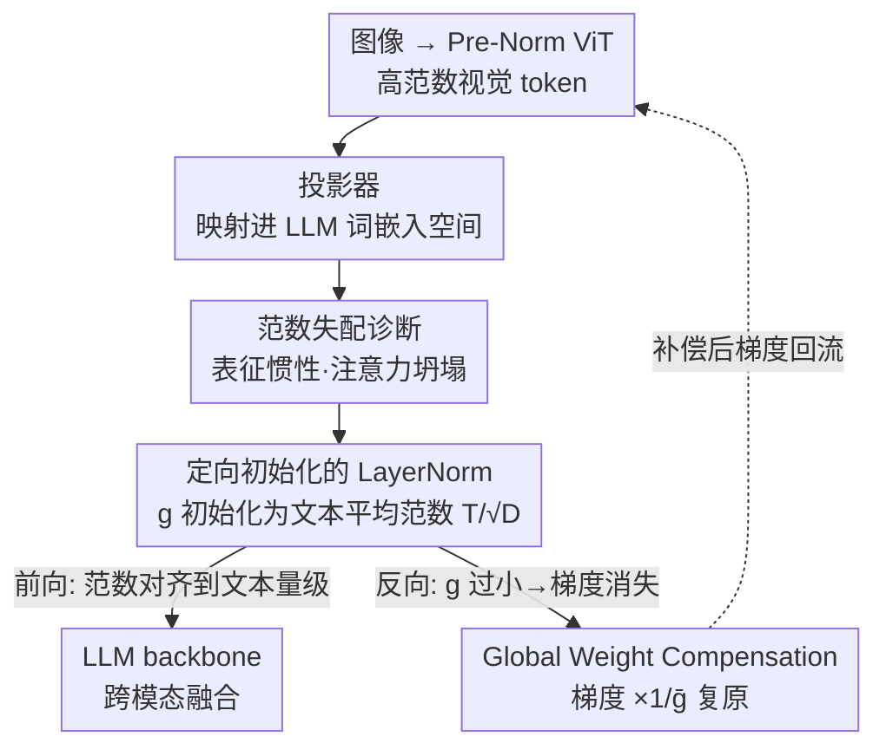

# The Unseen Bias: How Norm Discrepancy in Pre-Norm MLLMs Leads to Visual Information Loss

**会议**: ICLR 2026  
**OpenReview**: [https://openreview.net/forum?id=GVVNG2EMQv](https://openreview.net/forum?id=GVVNG2EMQv)  
**领域**: 多模态VLM  
**关键词**: Pre-Norm 架构, 范数失配, 跨模态融合, LayerNorm 对齐, 梯度补偿

## 一句话总结
本文指出主流 MLLM 普遍采用的 Pre-Norm 架构会让高范数的视觉 token 和低范数的文本 token 之间产生严重的范数失配，进而导致视觉 token 更新缓慢（"表征惯性"）、跨模态注意力坍塌；作者在视觉投影器后插入一个**精心初始化的 LayerNorm** 强制范数对齐，并配套 Global Weight Compensation 解决随之而来的梯度消失，在 LLaVA-1.5 上不仅多模态 benchmark 涨点，连纯文本的 MMLU 都提升。

## 研究背景与动机
**领域现状**：当前 MLLM 的主流范式是"预训练视觉编码器（ViT）+ 轻量投影器（projector）+ 预训练 LLM"。ViT 把图像切 patch 编码成视觉 token，投影器把这些 token 映射进 LLM 的词嵌入空间，然后视觉 token 和文本 token 一起喂进同一个 LLM backbone。而几乎所有现代 Transformer（ViT 和 LLM）都用 Pre-Norm 架构，因为它残差路径不被归一化、梯度流稳定、好训练。

**现有痛点**：已有研究发现 MLLM 在细粒度视觉感知上吃力，且自注意力里视觉 token 拿到的注意力权重往往明显低于文本 token。以往工作把这些归因于各种表面现象，但没人追到架构根因。

**核心矛盾**：Pre-Norm 有一个被忽视的副作用——残差和从不被重新归一化，隐状态的方差（以及 L2 范数）会随层数单调累积。视觉 token 本身就来自一个很深的 Pre-Norm ViT，范数早已膨胀；它们被注入到范数极低的 LLM 词嵌入空间（文本嵌入范数常常 $\approx 1$，而视觉编码器输出范数动辄几十）。于是恰好在跨模态接口处形成了悬殊的初始范数差。

**本文目标**：证明这个初始范数差不是静态无害的，而是会催化两个模态表征的"几何发散"，并设计一个简单干预去消除它。

**切入角度**：作者从 Pre-Norm 的更新动力学入手做理论分析——既然 Pre-Norm 下更新向量的幅度 $\|\Delta h\|_2$ 与输入范数 $\|h\|_2$ 解耦（同一层对所有 token 施加近似相同幅度的更新），那么同样大小的更新作用在高范数向量上能"转动"的角度就更小。

**核心 idea**：高范数视觉 token 拥有更高的"表征惯性"，语义演化速度远慢于文本 token，导致两模态收敛速率不匹配、注意力信噪比坍塌；只要在投影器后强制把视觉 token 的范数对齐到文本范数，就能从根上修复这个失衡。

## 方法详解

### 整体框架
本文的方法分两半：前半是**诊断**（理论 + 实证，证明范数失配真实存在且有害），后半是**干预**（一个极简的架构改动 + 一个保证它训得动的梯度技巧）。

诊断侧：作者先用一套简化假设推导出"有效角速度"公式，证明范数越大角速度越低（更新越慢），并用四个研究问题（RQ1–RQ4）在主流开源 MLLM 上实测验证范数差和更新速率不对称确实普遍存在。

干预侧（也是真正的"方法 pipeline"）：在标准 MLLM 数据流"图像 → ViT → 投影器 → LLM"中，于投影器之后、进入 LLM 之前插入一个额外的 LayerNorm 层，其增益参数 $g$ 被定向初始化为文本嵌入的平均范数，从而把视觉 token 的范数压到与文本 token 同一量级。但这个对齐目标极小（增益要初始化到 $\approx 0.01$），会在反向传播时把流回视觉编码器的梯度压没（梯度被 $g$ 缩放），所以再用一个 Global Weight Compensation 反向钩子，把前向的范数压缩和反向的梯度幅度解耦，保证视觉编码器仍能正常学习。

### 关键设计

**1. 范数失配诱发的非对称更新动力学：把"视觉信息丢失"归因到 Pre-Norm**

这是全文的理论基石，针对的痛点是"为什么视觉 token 在 LLM 里像是被忽视"。作者把 Pre-Norm 块的更新写成 $h^{(l+1)} = h^{(l)} + \Delta h^{(l)}$，并指出由于 Pre-Norm 把归一化放在残差分支内，更新幅度 $C^{(l)} = \|\Delta h^{(l)}\|_2$ 与输入范数 $\|h\|_2$ 解耦。把更新向量分解成与 $h$ 平行（只改长度）和正交（造成旋转）两部分，真正改变方向的"有效角速度" $\theta_{\text{eff}}$ 满足

$$\tan(\theta_{\text{eff}}) = \frac{C^{(l)}\sin(\phi)}{\|h\|_2 + C^{(l)}\cos(\phi)}$$

可见 $\|h\|_2$ 越大，$\tan(\theta_{\text{eff}})$ 越小。因此当 $\|h_{\text{vis}}\|_2 > \|h_{\text{txt}}\|_2$ 时必有 $\tan(\theta_{\text{eff,vis}}) < \tan(\theta_{\text{eff,txt}})$：高范数视觉 token 转得慢、有"表征惯性"，语义演化滞后于文本 token。其后果在注意力层显现——文本 query $q$ 想检索语义相关的视觉 key $k^+$，需要双方在共享度量空间里几何对齐，但视觉 token 转不动，导致相关对的点积信号 $S_{\text{rel}} \propto q\cdot k^+$ 被几何滞后封顶；而无关对（噪声）在高维里近似正交、不受影响。于是相关信号被压、噪声不变，注意力的信噪比坍塌（$\mathbb{E}[S_{\text{rel}}^{(\text{imb})}] < \mathbb{E}[S_{\text{rel}}^{(\text{bal})}]$），Softmax 再也无法把注意力锐化到目标视觉区域——这正是"视觉信息丢失"的第一性原理解释。作者进一步用四个 RQ 实证：RQ1 量出视觉编码器输出范数（CLIP/SigLIP 等约 29–72）远大于文本嵌入（Qwen2.5/Llama3.2 约 0.8–1.4）；RQ2 发现投影器并不能可靠抹平这个差（LLaVA 投影后视觉范数反而升到 $39.96$，Qwen-2.5-VL 仍有 $56.88$ vs 文本 $0.86$）；RQ3 用相邻层余弦相似度作为更新速率代理，证实视觉/文本更新速率系统性背离，且背离程度与初始范数差正相关；RQ4 在采用离散视觉 token 的 Ovis 2.5 上则发现尽管范数差仍在（64 vs 1.38），两模态更新速率却同步，说明离散 tokenization 范式可能天然缓解这种惯性。

**2. 定向初始化的 LayerNorm：用一行架构改动强制范数对齐**

针对痛点"投影器压不平范数差"，作者的干预朴素到只是在视觉投影器后再插一个 LayerNorm 层，但关键不在于"插"，而在于**怎么初始化它的增益 $g$**。目标范数 $T$ 取 LLM 文本嵌入矩阵中所有非零向量的平均 L2 范数：

$$T = \frac{1}{|W^*|}\sum_{w\in W^*}\|w\|_2,\qquad W^* = \{w\in W_e \mid \|w\|_2 > \epsilon\}$$

据此把标量增益初始化为 $g_{\text{init}} = T/\sqrt{D}$，从而让 LayerNorm 输出的视觉 token 范数一开始就落在文本 token 的量级上。消融（关键设计 3 之外的 Table 5）证明这个定向初始化是必需的：用默认初始化（gain=1, bias=0）的 LayerNorm 在 Stage 1 预训练后参数几乎纹丝不动（增益 L2 范数仍是 53.25），说明优化器根本没"启动"；而定向初始化（增益 L2 范数 2.28、绝对均值 0.04）的层有了实质更新——把参数放进损失曲面里梯度丰富的区域，学习才能真正发生。

**3. Global Weight Compensation（GWC）：解开"范数压得越狠、梯度越小"的死结**

定向初始化带来一个新痛点：现代 LLM 文本嵌入幅度极小（$D=4096$ 时 $\|w\|_2\approx 1$），要对齐到这个目标，$g_{\text{init}}$ 得是 $\approx 0.01$ 的极小值。而标准反向传播里，回流到视觉编码器的梯度被这个权重缩放——$\nabla_{\hat x}\mathcal{L} = \nabla_y\mathcal{L}\odot g$——极小的 $g$ 直接触发梯度消失，把视觉编码器从监督信号里"切断"。GWC 用一个反向钩子主动抵消这个衰减：设 $\bar g = \frac{1}{D}\sum_i |g_i|$ 为增益向量的平均幅度，反向时对梯度乘上补偿因子 $1/\bar g$，

$$\text{Backward}(\nabla_{\hat x}\mathcal{L}) = \underbrace{(\nabla_y\mathcal{L}\odot g)}_{\text{标准梯度}}\times\underbrace{\frac{1}{\bar g}}_{\text{补偿因子}}$$

这样前向仍严格保持范数对齐（$g$ 该多小还多小），反向却把 $g\cdot\bar g^{-1}\approx 1$ 抵消掉、梯度恢复到单位尺度——前向压缩与反向梯度幅度被彻底解耦。它的价值在主实验里很直观：Qwen2.5 backbone 下不加 GWC 时朴素对齐确实只涨文本指标、多模态任务停滞甚至掉点（MMBench −1.20、MM-Star −2.26），加了 GWC 才同时解锁两域增益。

### 损失函数 / 训练策略
方法不引入额外损失项，沿用 LLaVA-1.5 标准两阶段训练（Stage 1 预训练对齐 + Stage 2 指令微调），增量只有那一个 LayerNorm 层和它的 GWC 反向钩子。实验在 LLaVA-1.5 框架下进行，视觉编码器为 SigLIP-SO400M-Patch14-384，LLM 用 Llama-3.2-3B-Instruct 和 Qwen2.5-7B-Instruct，全部任务用 greedy 解码。

## 实验关键数据

### 主实验
在两种 backbone 上对比"无范数对齐 / 朴素对齐(w/o GWC) / 本文(w/ GWC)"，覆盖多模态与纯文本 benchmark（节选）：

| Backbone | 方法 | MM-Star | SEED-Bench-2 | OCRBench | MMLU | Avg |
|----------|------|---------|--------------|---------|------|-----|
| Llama-3.2 | w/o Norm | 37.72 | 42.86 | 40.70 | 45.19 | 59.01 |
| Llama-3.2 | w/ Norm (w/o GWC) | 41.19 | 47.26 | 45.60 | 53.21 | 62.04 |
| Llama-3.2 | w/ Norm (w/ GWC) | 41.24 | 45.56 | 44.10 | 51.60 | 61.27 |
| Qwen2.5 | w/o Norm | 50.34 | 56.65 | 47.00 | 71.02 | 68.49 |
| Qwen2.5 | w/ Norm (w/o GWC) | 48.08 | 59.51 | 47.60 | 71.14 | 68.71 |
| Qwen2.5 | w/ Norm (w/ GWC) | 50.58 | 58.27 | 49.40 | 71.74 | 69.41 |

关键现象是 backbone 依赖：Llama-3.2 文本嵌入范数没那么极端，朴素对齐就够，平均分从 59.01 升到 62.04；Qwen2.5 文本范数极小，朴素对齐触发了理论预言的梯度消失病——只涨文本、多模态掉点（平均仅 +0.22），必须靠 GWC 才能两域齐涨（平均 +0.92，且 MM-Star、OCRBench 都转正）。值得注意的是连纯文本 MMLU 也提升（Llama +6.41，Qwen +0.72），说明修掉架构失衡带来的是整体能力提升，而非单纯多模态对齐。

### 消融实验
初始化策略消融（Stage 1 预训练后 LayerNorm 学到的参数）：

| 配置 | 增益 g 的 L2 范数 | 增益绝对均值 | 说明 |
|------|------------------|------------|------|
| 默认初始化 (gain=1) | 53.2500 | 0.9609 | 参数几乎没动，优化未有效启动 |
| 本文定向初始化 | 2.2812 | 0.0400 | 有实质更新，进入梯度丰富区 |

### 关键发现
- **GWC 是 Qwen 类极小范数 backbone 的成败关键**：没有它，朴素范数对齐在 Qwen2.5 上多模态指标普遍下滑（MMBench −1.20、MM-Star −2.26），加上后全部转正——直接验证了"梯度消失"这一理论预言确有其事。
- **定向初始化不可省**：默认初始化的 LayerNorm 在 Stage 1 后参数纹丝不动（增益范数仍 53.25），证明"只是加个 norm 层"不够，必须把参数放到损失曲面梯度丰富的位置。
- **诊断机制被打通验证**：训练后分析显示本文方法从浅层起就把视觉/文本范数拉齐并贯穿全程，且两模态相邻层余弦相似度（更新速率代理）显著同步化，说明性能增益确实来自缓解了非对称更新。注意力可视化进一步显示 baseline 的文本→图像注意力被 RoPE 的距离衰减偏置错误地堆在图像底部，而对齐后正确收敛到语义相关区域。
- **离散 tokenization 是例外**：Ovis 2.5 范数差仍在（64 vs 1.38）但更新速率不失衡，提示离散视觉词表范式可能天然免疫表征惯性，本文结论主要适用于连续投影的 LLaVA 式架构。

## 亮点与洞察
- **把一个广为人知却没人深究的现象（视觉 token 被忽视）追溯到 Pre-Norm 的范数累积**，并给出"有效角速度"这个可量化、可证伪的桥梁——理论推导直接预言了实证可观测的更新速率不对称，理论与实验闭环很漂亮。
- **解法极简但有非平凡的工程洞察**：一个 LayerNorm 谁都会加，但作者点出真正的难点在"对齐到极小目标 → 梯度消失"，并用前向/反向解耦的 GWC 钩子优雅化解，这种"看似一行、实则有坑"的设计很有借鉴价值。
- **"修架构失衡 → 连纯文本能力也涨"** 是最让人意外的发现：它把"多模态对齐"从一个局部修补提升为对模型整体表征健康度的改善，暗示范数对齐可能是被长期忽视的通用设计维度。
- 反向钩子做梯度补偿的 trick（前向压缩、反向 $\times 1/\bar g$ 复原）可迁移到任何"想用极小增益约束前向、又不想牺牲梯度流"的场景，比如各类强约束归一化或低秩压缩。

## 局限与展望
- 作者自承 GWC 存在梯度震荡的潜在风险，更稳定的压缩策略仍是开放问题。
- 实验仅在 LLaVA-1.5 框架 + 两个 backbone 上验证，没有在更大规模（如 70B 级）或更先进的原生多模态架构上检验，泛化性待证。
- 理论分析建立在若干简化假设上（更新幅度均匀、更新几何角一致、旋转方向对称分布），真实大模型动力学更复杂，作者也是靠实证去弥合理想模型与现实的差距。
- Ovis 2.5 的反例说明结论有适用边界——离散视觉 token 架构不在受益范围内，方法的普适性受限于"连续投影 + Pre-Norm"这一前提。
- 一个值得探索的方向：既然范数对齐这么有效，是否可以在预训练阶段就把范数约束设计进投影器/编码器，而不是事后补一层。

## 相关工作与启发
- **vs 注意力重加权类方法**：以往针对"视觉 token 注意力低"的工作多在注意力分数层面打补丁（重加权、加偏置），本文认为那是治标——根因是范数失配导致的几何发散，从范数对齐入手治本，且额外参数几乎为零。
- **vs 投影器内置归一化（KimiVL / GLM-4.1V）**：这些模型的投影器里已有 norm 层、能压一部分范数（视觉范数压到 $\approx 4.7$），但 RQ2 显示各模型最终输出范数仍差一个数量级，本文指出"在投影器里随手加 norm 并不保证对齐"，关键在于把目标显式锚定到文本嵌入范数并配套梯度补偿。
- **vs Pre-Norm 范数累积研究（Kim et al. 2025）**：已有工作注意到 Pre-Norm 下范数随深度累积，本文把这一单模态现象延伸到跨模态接口，揭示它在 MLLM 里被视觉编码器的深度进一步放大，从而首次把它和"视觉信息丢失"挂钩。

## 评分
- 新颖性: ⭐⭐⭐⭐⭐ 首次把 MLLM 视觉信息丢失系统性归因到 Pre-Norm 范数失配，并给出可证伪的理论。
- 实验充分度: ⭐⭐⭐⭐ 四个 RQ 跨多模型实证 + 主实验/消融/诊断闭环，但 backbone 和规模偏少。
- 写作质量: ⭐⭐⭐⭐⭐ 理论—实证—干预三段逻辑清晰，机制解释到位。
- 价值: ⭐⭐⭐⭐⭐ 极简改动、零额外损失、连纯文本都涨，揭示了一个被长期忽视的通用设计维度。

<!-- RELATED:START -->

## 相关论文

- [\[ICLR 2026\] How Do Medical MLLMs Fail? A Study on Visual Grounding in Medical Images](how_do_medical_mllms_fail_a_study_on_visual_grounding_in_medical_images.md)
- [\[CVPR 2026\] Learning to Focus and Precise Cropping: A Reinforcement Learning Framework with Information Gaps and Grounding Loss for MLLMs](../../CVPR2026/multimodal_vlm/learning_to_focus_and_precise_croppinga_reinforcement_learning_framework_with_in.md)
- [\[ICLR 2026\] Visual Jigsaw Post-Training Improves MLLMs](visual_jigsaw_post-training_improves_mllms.md)
- [\[AAAI 2026\] Explore How to Inject Beneficial Noise in MLLMs](../../AAAI2026/multimodal_vlm/explore_how_to_inject_beneficial_noise_in_mllms.md)
- [\[ICLR 2026\] OmniVideoBench: Towards Audio-Visual Understanding Evaluation for Omni MLLMs](omnivideobench_towards_audio-visual_understanding_evaluation_for_omni_mllms.md)

<!-- RELATED:END -->
