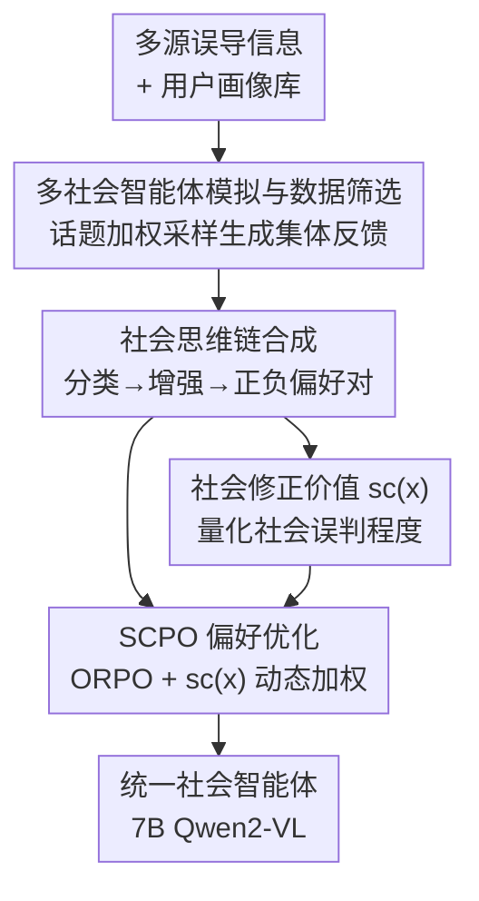

# Thinking as Society: Multi-Social-Agent Self-Distillation for Multimodal Misinformation Detection

**会议**: ICLR 2026  
**OpenReview**: [https://openreview.net/forum?id=nHW64r5KFG](https://openreview.net/forum?id=nHW64r5KFG)  
**代码**: 无  
**领域**: 多模态VLM / 误导信息检测 / 偏好优化  
**关键词**: 多模态误导信息检测, 社会智能体, 自蒸馏, 社会思维链, 偏好优化

## 一句话总结
用一群"社会用户"MLLM 智能体从不同立场对多模态内容做真伪判断，把它们的集体反馈蒸馏成高质量的"社会思维链"偏好数据，再用一种以"社会误判程度"为可验证权重的偏好优化算法 SCPO 把集体推理能力内化进单个 7B Qwen2-VL，让它在 MFC-Bench / MMFakeBench 上超过更大的开源模型、专门的多智能体框架，甚至逼近/超过 GPT-4o 和 Claude。

## 研究背景与动机

**领域现状**：现实世界的多模态误导信息（假新闻、移花接木图、AI 生成内容）混合了多种伪造手段，又裹挟社会语境，单纯做二分类已经不够，检测模型必须具备社会动态理解和稳健推理能力。因此越来越多工作直接把 MLLM 当智能体（agent）来做多模态误导信息检测（MMD）。

**现有痛点**：MLLM-based 方法卡在一个两难里。单智能体方法只能给出单一视角的分析，社会复杂任务下视野受限、容易被误导；多智能体方法虽然能从多个社会角色出发分析，但推理成本高、而且整条多步流水线难以端到端优化（实验里 MMD-Agent 套在 Qwen2-VL 和 34B LLaVA 上反而把准确率拉低了 5.6% / 6.1%，多步推理会累积错误）。

**核心矛盾**：推理效率（单模型）与多视角分析（多智能体）之间存在 trade-off——想要多个社会视角就得付出多智能体的算力与优化代价，想要高效就只能牺牲视角多样性。

**本文目标**：把"集体社会推理"内化进**一个统一模型**，既保留多视角分析又保持单模型的高效。这暴露出两个具体子问题：(1) 数据缺失——缺少能教会 MLLM 整合多种社会视角的多视角推理数据；(2) 优化困难——SFT、DPO 这类现成微调算法对所有样本一视同仁，无法区分并优先处理那些"反映社会认知差异"的高价值样本。

**切入角度**：作者的观察是——既然多智能体的价值在于"不同社会角色给出不同判断"，那不如把这些判断**离线**生成出来、合成成推理数据，再蒸馏回单模型，从而把"多智能体的推理"变成"一次前向"。而且"有多少社会用户判断错了"本身就是一个天然、可观测、可验证的难度信号，可以拿来动态调节训练优先级。

**核心 idea**：用一群带画像的 MLLM 社会智能体生成集体反馈 → 合成"社会思维链（SCoT）"偏好数据 → 用以"社会修正价值"为权重的 SCPO 自蒸馏，把"像社会一样思考（thinking as society）"压进单个 7B 模型。

## 方法详解

### 整体框架
整个框架是一条"离线造数据 + 在线自蒸馏"的两段式流水线。第一段（数据生成）先聚合多个 MMD 数据集并筛选出高质量、多样的误导信息样本，再为每条样本按话题加权采样出一批带社会画像的 MLLM 用户智能体，让它们各自给出真伪判断；这些原始反馈经过"分类→增强→合成"三步，被提炼成带正负偏好对的社会思维链（SCoT）数据。第二段（优化）把每条样本"有多少社会用户判错"量化成一个社会修正价值 $sc(x)$，并用它在 ORPO 框架上动态加权偏好损失，训练出一个统一的"社会智能体"——一个 7B Qwen2-VL，它在一次前向里就能从多个社会角色视角推理并下判断。

### 关键设计

**1. 多社会智能体模拟与数据筛选：让"集体反馈"既多样又不冗余**

这一步针对"数据缺失"痛点的前半截——没有合适的原料就谈不上多视角推理数据。作者先把多个现有 MMD 基准聚合成一个综合数据集，既含合成篡改样本（NewsCLIPpings、DGM4、AutoSplice），也含真实社媒样本（FineFake）。为了处理规模和冗余，每条训练样本相对验证集打两类分：CLIP 语义相似度，以及基于 Wasserstein 梯度的分布一致性；通过 top 选择 + 标签平衡，得到一个高质量、多样的误导信息基础集。

社会反馈则来自一批带画像的用户智能体——画像取自 OASIS 平台，覆盖人口学（国别）、心理（热情/冷静）、职业（记者/工程师/教育者）、兴趣（政治/科学）等维度。关键的"话题驱动采样"模拟了真实社媒"用户更愿意参与与自己兴趣相关内容"的现象：对每条样本抽取话题集 $T_s$，对每个兴趣集为 $T_u$ 的用户算匹配分 $w=\frac{|T_u\cap T_s|}{|T_s|}+\epsilon$，其中 $\epsilon$ 是小正数保证所有用户都有非零被选概率（模拟用户偶尔越界参与）；再按 $w$ 做加权采样。这样话题相关的用户更可能入选，又保留了社媒互动的可控随机性。每个被采样用户的画像被注入结构化系统提示，实例化成一个 MLLM 智能体，生成带其背景偏见的角色化反馈。

**2. 社会思维链合成：把杂乱反馈提炼成正负偏好对**

光有一堆原始反馈还不能直接训练——它们对错混杂、质量参差。作者设计了"分类→增强→合成"三步把它们结构化。**答案中心的反馈分类**用 LLM-as-a-Judge 把每条反馈按"结论与真值的一致性"分成三档：正确集（结论对且推理支撑）、错误集（结论错且推理有关键缺陷，如忽略关键多模态证据）、部分正确集（结论错但含有效观察）；同时给每个分类打一个 0–1 的置信度。最后把"正确集 + 部分正确集中置信度 >0.5"的反馈定义为**潜在正确组**，这个软边界既纳入多样视角又过滤噪声。

**角色化推理增强**进一步打磨潜在正确组：一是知识注入——把真值告诉这些用户、让它们从自己角色视角细化解释，鼓励补上之前漏掉的证据但仍保留角色特色；二是边缘样本自适应增强——对所有智能体都答对的"简单样本"，反过来让它们论证相反结论生成对抗负样本，暴露认知偏差、防过拟合；对所有智能体都答错的"困难样本"，则广播真值、让它们构造朝正确结论的有效角色化推理。最后**偏好数据合成**由两个专门智能体完成：Coordinator Agent 处理潜在正确组、合并重叠推理路径同时保留各角色独特洞见，产出统一的正样本（chosen）SCoT；Summarizer Agent 处理错误集、保留最具代表性的误导推理链和关键缺陷，产出负样本（rejected）SCoT。两者构成偏好对。

**3. 社会修正价值函数 sc(x)：把"社会误判程度"变成可验证的样本难度**

这一步针对"优化困难"痛点——DPO 等算法对所有样本一视同仁，浪费了社会认知差异里的信息。作者把每条样本"需要被纠正的程度"量化为学习价值：

$$sc(x) = 1 - \left(\frac{N_C}{N} + \frac{N_P}{N-N_C}\cdot\frac{1}{N}\right)$$

其中 $N$ 是该样本的总用户数，$N_C$ 是正确集用户数，$N_P$ 是部分正确集用户数。粗粒度项 $\frac{N_C}{N}$ 捕捉判对用户的比例，越高说明样本越简单、纠正需求越低；细粒度项 $\frac{N_P}{N-N_C}\cdot\frac{1}{N}$ 是在 $\frac{1}{N}$ 上对部分正确用户的折扣加权，用来在不盖过"正确用户主导效应"的前提下补充部分正确的信息。整体上 $sc(x)\in[0,1]$：值越高样本越难（错误反馈越多），需要放大偏好强度让模型聚焦化解社会误判；反之共识正确的简单样本被降权，避免在平凡样本上过拟合。相比用奖励模型学到的、不可验证的 reward margin，$sc(x)$ 由可观测的用户反馈统计算出，语义清晰、可验证、可解释，且有界范围天然防止训练过于激进。

**4. SCPO 偏好优化损失：把社会修正价值注入 ORPO 实现自蒸馏**

作者在 ORPO 框架（把 SFT 与偏好优化整合、无需参考模型）上设计 SCPO 损失：

$$\mathcal{L}_{SCPO} = \mathcal{L}_{SFT} + \lambda\cdot(1+\omega\cdot sc(x))\cdot\mathcal{L}_{OR}$$

其中 $\mathcal{L}_{SFT}=-\mathbb{E}_{(x,y_w)\sim D_{SFT}}[\log\pi_\theta(y_w\mid x)]$ 让模型学习 Coordinator 合成的正样本社会推理模式；$\mathcal{L}_{OR}$ 是 Odds Ratio 对齐损失，用 $\log\sigma\big(\log\frac{\pi_\theta(y_w\mid x)}{1-\pi_\theta(y_w\mid x)}-\log\frac{\pi_\theta(y_l\mid x)}{1-\pi_\theta(y_l\mid x)}\big)$ 比较高质量推理 $y_w$（来自潜在正确组）与缺陷推理 $y_l$（来自 Summarizer 的错误集）的生成似然，把模型推离误导推理轨迹。核心创新是用社会修正价值动态缩放 OR 损失的权重 $(1+\omega\cdot sc(x))$：难样本（$sc(x)$ 大）被放大偏好强度，简单样本被降权，从而实现稳定高效的自蒸馏对齐。

### 一个完整示例
以一条"奥巴马与喜剧演员 Joel McHale 并未一起大笑"的图文对（真值=Fake）为例走一遍：先采样出若干带画像的社会用户智能体——`fun_lover_connor`（社交达人）指出文字与画面矛盾、判为 Fake；`@graceful_artiste`（关注文化社会）认为视觉证据不足、需官方核实；`@lilytravels`（15 岁高中生）则倾向相信图像真实。LLM judger 把这些反馈分到正确/部分正确/错误集并打置信度，置信度 >0.5 的正确与部分正确反馈进入潜在正确组并被知识注入增强；Coordinator 把"图像显示友好互动 vs 文字声称无共笑"这一跨模态矛盾合成成正样本 SCoT，Summarizer 把"图像看起来真实、判为非假"这类错误推理合成成负样本。同时统计该样本的 $N_C/N_P/N$ 算出 $sc(x)$，在 SCPO 训练里据此加权这条偏好对。最终训练出的模型能在一次推理里串起"文字可疑→图像模糊→跨模态不一致→潜在操纵手法"的多视角链条，稳定输出 Fake。

### 损失函数 / 训练策略
统一使用 Qwen2-VL-7B-Instruct 作为基座；训练目标即上文 SCPO 损失，在 ORPO 整合框架下联合 SFT 损失与社会修正价值动态加权的 OR 对齐损失，$\lambda$ 控制对齐项强度、$\omega$ 控制社会修正价值的缩放幅度。推理阶段统一用 open-prompting（系统提示不告知具体误导类型）以体现泛化能力。

## 实验关键数据

### 主实验
MFC-Bench（open-prompting，准确率 / macro-F1，%）：

| 模型 | 规模 | Overall Acc | Overall F1 | 说明 |
|------|------|------|------|------|
| GPT-4o | - | 69.11 | 68.49 | 闭源最强 |
| Claude3.5-Sonnet | - | 66.85 | 64.32 | 闭源 |
| Qwen2.5-VL | 7B | 58.23 | 58.34 | 更强开源基座 |
| InternVL3 | 8B | 56.32 | 55.22 | 更强开源基座 |
| Qwen2-VL（基座） | 7B | 57.24 | 56.91 | 本文基座 |
| **SCPO（本文）** | 7B | **67.15** | **66.83** | 较基座 +9.91 / +9.92 |

SCPO 把 7B 基座拉升近 10 个点，超过更大更强的开源模型，超过 Claude、逼近 GPT-4o——说明"内化社会推理"比单纯换更强基座更有效。

MMFakeBench（混合源检测，SCPO 用 open-prompting）：本文 7B SCPO 的 Top-1 准确率 59.2%，而把 MMD-Agent 多智能体框架套在 34B LLaVA-NeXT 上只有 40.5%——一个 7B 自蒸馏模型显著超过 34B + 推理时多智能体框架。

### 消融实验
同一份 SCoT 数据下、不同微调/提示策略（MFC-Bench Overall，%）：

| 配置 | Acc | F1 | 说明 |
|------|------|------|------|
| Qwen2-VL | 57.46 | 57.09 | 基座 |
| Self-Consistency | 61.63 | 58.35 | 提示策略 |
| SFT | 64.20 | 63.10 | 仅用正样本 SCoT 微调，已是强基线 |
| SFT+DPO | 57.98 | 56.09 | DPO 反而掉点 |
| ORPO | 66.30 | 66.01 | 整合 SFT+偏好 |
| **SCPO** | **67.15** | **66.83** | 社会修正价值加权最优 |

### 关键发现
- **SCoT 数据本身就很值**：仅 SFT 就到 64.20%，远超 self-consistency（61.63%），证明合成的社会推理数据质量高、整合多视角有效。
- **社会修正价值是关键增量**：ORPO（66.30%）已优于 DPO，而 SCPO 在同样数据上再涨到 67.15%，说明把训练重心动态压到"社会误判最严重"的难样本上确实带来更稳更好的优化；值得注意的是 SFT+DPO 反而掉到 57.98%，印证"一视同仁的偏好优化"在这类任务上不稳定。
- **推理质量也最好**：GPT-4 评测四维度上 SCPO 全面领先——误导性最低（2.51↓）、信息量（3.69↑）、合理性（4.19↑）、可读性（4.93↑），多视角自蒸馏同时提升了判断质量与可解释性。
- **多智能体推理时框架未必划算**：MMD-Agent 多步分解套在 Qwen2-VL / 34B LLaVA 上反而把准确率拉低 5.6% / 6.1%，多步过程会累积错误——侧面支撑"把集体推理内化进单模型"这条路线。

## 亮点与洞察
- **把"多智能体的价值"离线化再蒸馏回单模型**：既要多视角又要高效这个 trade-off，作者用"训练前造数据、推理时只跑一次"巧妙绕开，是可复用的范式——任何"多智能体辩论/协作能提质但太贵"的任务都能照搬这套自蒸馏思路。
- **用"社会误判程度"当可验证难度信号**：$sc(x)$ 直接由用户反馈的对/错/部分对统计算出，不依赖奖励模型、语义清晰且有界，比 reward margin 更可信，是把"样本难度加权"做得可解释的好例子。
- **边缘样本的对抗式增强**：对全对样本反向生成对抗负样本、对全错样本广播真值再构造正确推理，这种"按难度分别造数据"的策略能迁移到任何偏好数据合成场景。

## 局限与展望
- 数据生成依赖大量 MLLM 智能体调用 + LLM judger + Coordinator/Summarizer 多步合成，离线管线本身算力开销不小，论文未充分讨论造数据成本与可扩展性。
- $sc(x)$ 的质量高度依赖用户反馈分类（LLM-as-a-Judge）的可靠性，若 judger 系统性偏差，难度信号会被污染；置信度阈值 0.5 是经验设定。
- 仅验证于 Qwen2-VL-7B 单一基座与两个 MMD 基准，跨基座（更大/更小模型）、跨任务的泛化性尚未给出。
- 社会画像取自 OASIS 平台，模拟用户的"社会多样性"在多大程度上等价于真实社会分歧，仍是开放问题。

## 相关工作与启发
- **vs 单智能体 MMD（Cekinel/Tahmasebi 等）**：它们只有单一视角、易被误导；本文通过多社会智能体合成多视角推理并蒸馏回单模型，在保持单模型高效的同时补上视角多样性。
- **vs 多智能体 MMD（MMD-Agent / Liu 等）**：它们推理时跑多智能体、贵且难端到端优化，多步还会累积错误（实验里反而掉点）；本文把多视角推理前移到数据生成阶段，推理只需一次前向，7B 即超过 34B+多智能体。
- **vs DPO / ORPO / MM-DPO**：DPO/ORPO 对样本一视同仁，MM-DPO 用 reward margin 调偏好强度但 margin 不可验证；SCPO 用可观测、可验证、有界的社会修正价值动态加权，训练更稳、对难样本更聚焦。

## 评分
- 新颖性: ⭐⭐⭐⭐⭐ "多智能体离线造数据 + 社会误判驱动的可验证偏好加权"组合新颖且自洽
- 实验充分度: ⭐⭐⭐⭐ 两个基准 + 多种微调策略消融 + 推理质量评测，但仅单基座、缺成本分析
- 写作质量: ⭐⭐⭐⭐ 两难矛盾与解法讲得清楚，公式与流程交代完整
- 价值: ⭐⭐⭐⭐⭐ 让 7B 开源模型在 MMD 上逼近/超过 GPT-4o，路线对实际部署有吸引力

<!-- RELATED:START -->

## 相关论文

- [\[ICLR 2026\] Vision-Zero: Scalable VLM Self-Evolution via Multi-Agent Self-Play](vision-zero_scalable_vlm_self-evolution_via_multi-agent_self-play.md)
- [\[AAAI 2026\] Multi-Agent VLMs Guided Self-Training with PNU Loss for Low-Resource Offensive Content Detection](../../AAAI2026/multimodal_vlm/multi-agent_vlms_guided_self-training_with_pnu_loss_for_low-resource_offensive_c.md)
- [\[ICLR 2026\] Thinking with Camera: A Unified Multimodal Model for Camera-Centric Understanding and Generation](thinking_with_camera_a_unified_multimodal_model_for_camera-centric_understanding.md)
- [\[ICLR 2026\] Multimodal Dataset Distillation via Phased Teacher Models](multimodal_dataset_distillation_via_phased_teacher_models.md)
- [\[CVPR 2026\] Multi-speaker Attention Alignment for Multimodal Social Interaction](../../CVPR2026/multimodal_vlm/multi-speaker_attention_alignment_for_multimodal_social_interaction.md)

<!-- RELATED:END -->
