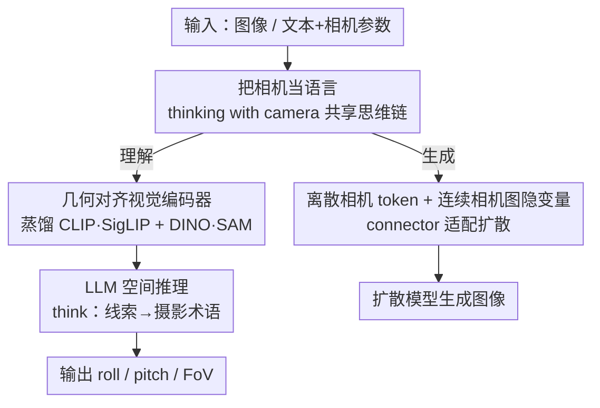

# Thinking with Camera: A Unified Multimodal Model for Camera-Centric Understanding and Generation

**会议**: ICLR 2026  
**OpenReview**: [https://openreview.net/forum?id=5THcDkGGjt](https://openreview.net/forum?id=5THcDkGGjt)  
**代码**: https://kangliao929.github.io/projects/puffin (有)  
**领域**: 多模态VLM  
**关键词**: 相机几何, 统一多模态模型, 空间智能, 思维链, 可控生成

## 一句话总结
本文提出 Puffin，把"相机参数"当成一种语言塞进多模态大模型，用一套共享的"思考相机（thinking with camera）"思维链同时做相机理解（从图像反推 roll/pitch/FoV）和相机可控生成（按指定视角生成图像），在两类任务上都超过各自领域的专用模型。

## 研究背景与动机

**领域现状**：相机几何的理解（从单张图反推相机的朝向、视场角）和相机可控的生成（按指定的内参/外参生成对应视角的图像）是空间智能的两块基石，但长期被当成两个互不相干的问题各自研究——一边是 GeoCalib、UVP 这类标定方法，一边是 PreciseCam 这类可控生成方法。

**现有痛点**：把这两件事塞进同一个多模态大模型（LMM）时会遇到一个"模态鸿沟"。相机参数和文字、图像不一样：它是抽象的纯数字（视场角、旋转角度），没有语义内容。结果是——做生成时，用户说"20° 翻滚"或"35mm 镜头"，模型往往忽略或误解这些数字，只顾语义对齐而丢掉精确的空间控制；做理解时，LMM 又会把几何细节坍缩成粗糙的描述，导致空间不一致。直接把相机数值当辅助标签喂进去，两个任务都做不好。

**核心矛盾**：相机参数是低/中层的几何量，而 LMM 擅长的是高层语义；二者之间缺一座桥。纯视觉表征（几何结构、带置信度的语义特征）只擅长在特征丰富的场景里抠局部线索，抓不住整体、连贯的空间概念，泛化差。

**本文目标**：（1）在一个统一框架里同时做相机理解与生成；（2）让相机数值变得"语言可解释"，使大模型能对它做显式的空间推理。

**切入角度**：作者观察到——天空、天花板、地面这些无纹理区域虽然没有局部特征，却编码了对 pitch 至关重要的垂直规律；FoV 的判断依赖前景/背景比例、物体尺度等构图线索。这些恰恰是 LMM 作为知识先验隐式掌握、却很难从纯视觉表征里抠出来的东西。

**核心 idea**：把相机当语言（camera as language）。用专业摄影术语（如 close-up、tilt-up、Dutch angle）作为相机数值的"量化抽象"，把它和图像里的空间线索绑定，让模型先"思考相机"再给答案，理解和生成共享同一条思维链。

## 方法详解

### 整体框架

Puffin 是一个统一的相机中心多模态模型，骨架是一个 LLM（Qwen），两侧各接一套机制：理解侧给 LLM 配一个保留几何保真度的视觉编码器，让它从图像反推 roll/pitch/FoV；生成侧给 LLM 接一个 connector 和扩散模型，让它按文本+相机条件生成图像。把两侧粘合起来的是"思考相机"这条共享思维链——无论理解还是生成，模型都先把相机数值翻译成摄影术语、推理出对应的空间线索（`<think>...</think>`），再产出最终结果。

理解时，图像经几何对齐视觉编码器进 LLM，LLM 先在 `<think>` 里逐项推理"这张图为什么是这个朝向/视场"（如"天空占比大→大幅上仰→大 tilt-up"），再在 `<answer>` 里给出 roll/pitch/FoV 数值，整个过程是多模态序列上的 next-token prediction。生成时，输入的相机参数被两路编码：数值参数走 tokenizer 变成离散相机 token，像素级相机图（camera map）走 tokenizer 变成连续隐变量；LLM 结合 caption 做语义规划，再通过 connector（一组可学习 query）把隐状态整理成条件信号，交给扩散模型生成图像。

### 关键设计

**1. 把相机当语言：thinking with camera 共享思维链**

这是全文的核心，针对的就是相机数值与语言/视觉之间的模态鸿沟。作者没有去学一个更好的几何表征，而是把相机参数"翻译"成 LMM 听得懂的话，由三个要素拼成：**空间线索（spatially grounded visual cues）**——把天空、天花板、地面这些虽无局部特征却编码垂直/构图规律的区域写进思考 caption，让模型显式地拿它们推理；**专业摄影术语（professional photographic terms）**——用 close-up、tilt-up、Dutch angle 这类术语作为相机数值的量化抽象，作为中间监督信号，因为数值太细 LMM 估不准、而这些术语恰好和 LMM 的知识先验对齐，映射关系记作 $f: p \mapsto t$（数值 $p$ 到术语 $t$）；**几何上下文解耦（geometric context）**——把相机参数沿 roll/pitch/FoV 三个维度拆开，各自对齐到对应的空间线索（roll↔倾斜的路面/招牌、pitch↔天空占比、FoV↔构图广度），最后在 `<answer>` 里预测数值。

关键在于这条思维链是理解和生成**共享**的：理解时它把图像线索映射到术语再到数值；生成时它把数值映射到术语、想象出对应的空间线索（如"大 pitch→室内的吊灯和空旷天花板"）作为语义规划阶段去指导合成。一套思维链同时支撑两个方向，正是"统一"的落点。消融显示，这条思维链对依赖更大范围上下文先验的 pitch 和 FoV 提升尤其明显。

**2. 几何对齐视觉编码器 + LLM 渐进对齐：保住几何保真度**

针对理解侧的一个反直觉痛点：直接微调现成 LMM 反而做不好相机标定，因为它们的视觉编码器是为识别任务设计的、特征过度压缩丢了几何细节，语言部分又几乎没有空间感知先验。论文实测里，直接微调 Qwen2.5-VL / InternVL3 甚至打不过纯视觉的标定网络。

解法是换一个从语义教师（CLIP、SigLIP）和视觉中心教师（DINO、SAM）联合蒸馏出来的几何对齐视觉编码器，它既保留几何保真度又维持强语义；再用渐进解冻、联合微调的分阶段策略把它和 Qwen LLM 对齐——先对齐再在相机理解数据上微调，让训练稳定并逐步建立"从低/中层结构线索到高层语言推理"的空间感知能力。消融里，光换这个编码器（Ours，未加 thinking）就把 roll 误差从直接微调 Qwen2.5-VL 的 0.79° 压到 0.47°。

**3. 离散相机 token + 连续相机图隐变量 + connector：让扩散既守全局又控局部**

针对生成侧"数值太抽象、控不住精细空间布局"的痛点。除了从数值参数得到的离散相机 token（只编码全局属性），论文额外引入像素级相机图（camera map）作为相机几何的**连续隐变量**：这张稠密图在每个像素上编码了朝向、位移等局部几何上下文，转成连续隐变量后喂给扩散模型，使其在守住全局相机设置的同时还能适配细微的几何变化，从而精确控制空间布局和视角。消融表明，去掉相机图后，在大角度等困难配置下生成图会出现严重几何畸变甚至空间错觉。

把 LLM 的语义/几何理解传给扩散模型则靠 connector：一组可学习 query 连同 text/camera token 一起，把 LLM 的隐状态抽取并重组，再投影成扩散模型可读的条件信号，作为 LLM 与扩散模型之间的自适应接口。

**4. Puffin-4M：撑起相机中心多模态训练的数据底座**

跨视觉、语言、相机三模态的数据极其稀缺，本文构建了 Puffin-4M——400 万条 vision-language-camera 三元组，含单视图图像 + 精确相机参数 + 描述 caption + 像素级相机图 + 空间推理标注，覆盖室内外多样场景。构建分四步：全景数据采集与预处理、透视图生成、场景与空间推理 caption、以及为指令微调做的跨视图扩展。正是这条带"思考"标注的数据管线，使"思考相机"这套监督信号成为可能；论文还配套放出 Puffin-Und（1000 张困难理解评测）和 Puffin-Gen（650 对 caption–相机生成评测）两个 benchmark。

### 损失函数 / 训练策略

理解走多模态序列的 next-token prediction（在 `<think>`/`<answer>` 结构内自回归），生成走扩散建模；视觉编码器与 LLM 采用渐进解冻 + 联合微调的分阶段对齐。框架可只加少量 token、切换 prompt 就扩展到跨视图任务：通过指令微调引入额外的 yaw 参数和目标视图相机图条件，支持空间想象（imagine 目标视角的场景描述）、世界探索（生成目标视角图像）、摄影指导（建议相机调整量以提升构图美感）三类下游任务。

## 实验关键数据

### 主实验

相机理解（中位误差，单位度，越低越好）：

| 数据集 | 指标 | Puffin | GeoCalib(前SOTA) |
|--------|------|--------|------|
| MegaDepth | Roll / Pitch / FoV | 0.32 / 1.08 / 2.42 | 0.36 / 1.94 / 4.46 |
| Puffin-Und | Roll / Pitch / FoV | 0.41 / 0.74 / 1.21 | 0.92 / 2.18 / 5.04 |
| LaMAR | Roll / Pitch / FoV | 0.38 / 0.71 / 3.62 | 0.28 / 0.87 / 3.03 |

在 MegaDepth 和自建困难集 Puffin-Und 上全面领先，尤其 Puffin-Und 上 pitch/FoV 误差几乎砍半；在 LaMAR 上 roll/FoV 略逊于 GeoCalib，作者归因于训练分辨率固定为 512×512、对非方形图做中心裁剪导致丢内容（与本文方法正交，可用多尺度训练缓解）。

相机可控生成（Puffin-Gen，误差越低越好）：

| 方法 | Gravity 中位误差 | FID |
|------|------|------|
| GPT-4o | 26.32 | 94.43 |
| Qwen-Image | 26.45 | 83.37 |
| Nano Banana | 26.73 | 88.02 |
| PreciseCam | 15.34 | 90.91 |
| Puffin | **3.43** | **69.46** |

生成侧大幅领先：通用多模态模型图好看但守不住相机配置；PreciseCam 能控但风格单调（偏动漫）、应对大倾斜失败。Puffin 在重力误差和 FID 上都远超。

### 消融实验

| 配置 | Roll | Pitch | FoV | 说明 |
|------|------|-------|-----|------|
| 直接微调 Qwen2.5-VL | 0.79 | 1.61 | 2.91 | 现成 LMM，甚至不如纯视觉网络 |
| 仅几何对齐视觉编码器 | 0.55 | 1.00 | 1.87 | 换编码器 |
| Ours（编码器+LLM对齐） | 0.47 | 0.91 | 1.48 | 分阶段对齐 |
| Ours w/ Thinking | **0.41** | **0.74** | **1.21** | 加思考相机思维链 |

（中位误差，单位度）

### 关键发现
- 直接微调主流 VLM 做相机标定会有性能瓶颈，甚至打不过纯视觉网络——视觉编码器特征过度压缩、语言侧缺空间先验是根因；换几何对齐编码器是最大的单点增益来源。
- "思考相机"思维链对 pitch 和 FoV 的提升明显大于 roll，因为这两者依赖更大范围的上下文先验（天空占比、整体构图），正好是显式空间推理擅长补的部分。
- 生成侧的连续相机图是守住困难视角几何一致性的关键，去掉后大角度配置下出现几何畸变和空间错觉。

## 亮点与洞察
- **"把相机当语言"是一个很轻却很对路的桥**：不去学新的几何表征，而是借专业摄影术语把数值翻译成 LMM 已经掌握的知识先验，几乎零额外结构就跨过了模态鸿沟，这个思路可迁移到深度、位姿等其他"抽象数值"模态的统一建模。
- **理解和生成共享同一条思维链**，让"统一"不只是参数共享，而是推理过程的复用——理解时数值→术语→线索，生成时反向走，对称且自洽。
- **离散 token（全局）+ 连续相机图（局部）双表征**是处理"既要全局守约束又要局部细控"的通用配方，不限于相机控制。

## 局限与展望
- 训练分辨率固定 512×512，对非方形/极端长宽比图像需中心裁剪，会丢语义内容并拉低理解精度（LaMAR 上即因此略逊 SOTA）；作者建议用多尺度训练数据缓解。
- 主要聚焦单视图标定与文生图可控生成，跨视图能力靠指令微调扩展，尚非端到端统一训练，跨视图任务的评测也相对定性。
- 自建 benchmark（Puffin-Und/Gen）由作者构建，与现有标定数据集的分布差异可能放大了相对优势，跨数据集横比需谨慎（不同数据集相机分布、结构化程度不一）。

## 相关工作与启发
- **vs GeoCalib / UVP（专用标定）**: 它们学几何结构或带置信度的语义特征直接回归参数，擅长特征丰富场景但泛化弱；Puffin 用 LMM 做显式空间推理，把整体空间概念也用上，困难集上 pitch/FoV 优势明显，但在固定长宽比假设外的图上会被裁剪策略拖累。
- **vs PreciseCam（专用可控生成）**: 它能控相机但风格单调、应对大倾斜失败；Puffin 靠连续相机图 + connector 在多样场景和困难配置上都稳，且 FID 更低。
- **vs 直接微调通用 LMM（GPT-4o / Qwen-Image / 统一理解生成模型）**: 它们把相机当辅助标签或普通数字，既控不住生成也估不准理解；Puffin 把相机当一等模态、用共享思维链处理，两侧都大幅领先。

## 评分
- 新颖性: ⭐⭐⭐⭐⭐ 首次把相机几何作为一等模态统一进理解+生成，"相机当语言"的思维链设计巧妙。
- 实验充分度: ⭐⭐⭐⭐ 理解/生成双任务 + 多数据集 + 消融充分，但跨视图任务偏定性、部分 benchmark 自建。
- 写作质量: ⭐⭐⭐⭐⭐ 动机层层递进，图示清晰，方法与思想表达到位。
- 价值: ⭐⭐⭐⭐⭐ 开源代码/模型/数据管线/benchmark，对空间智能与相机中心多模态研究有明确推动价值。

<!-- RELATED:START -->

## 相关论文

- [\[ICLR 2026\] UniF2ace: A Unified Fine-grained Face Understanding and Generation Model](unif2ace_a_underlineunified_underlinefine-grained_underlineface_understanding_an.md)
- [\[ICLR 2026\] Omni-Weather: A Unified Multimodal Model for Weather Radar Understanding and Generation](omni-weather_a_unified_multimodal_model_for_weather_radar_understanding_and_gene.md)
- [\[ICLR 2026\] ORION: Decoupling and Alignment for Unified Autoregressive Understanding and Generation](orion_decoupling_and_alignment_for_unified_autoregressive_understanding_and_gene.md)
- [\[ICCV 2025\] GenDoP: Auto-regressive Camera Trajectory Generation as a Director of Photography](../../ICCV2025/multimodal_vlm/gendop_auto-regressive_camera_trajectory_generation_as_a_director_of_photography.md)
- [\[ICLR 2026\] Manzano: A Simple and Scalable Unified Multimodal Model with a Hybrid Vision Tokenizer](manzano_a_simple_and_scalable_unified_multimodal_model_with_a_hybrid_vision_toke.md)

<!-- RELATED:END -->
