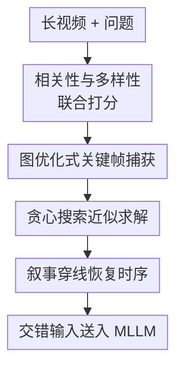

# Threading Keyframe with Narratives: MLLMs as Strong Long Video Comprehenders

**会议**: ICLR 2026  
**OpenReview**: [https://openreview.net/forum?id=kyLS9EhPhY](https://openreview.net/forum?id=kyLS9EhPhY)  
**代码**: https://github.com/bofang98/Nar-KFC  
**领域**: 多模态VLM / 长视频理解  
**关键词**: 长视频理解、关键帧选择、MLLM、视频问答、训练-free推理  

## 一句话总结
Nar-KFC把长视频输入压缩成“查询相关且内容多样的关键帧 + 按真实时间插入的非关键帧叙事”，在不训练 MLLM 的情况下显著提升多种长视频问答和开放生成任务。

## 研究背景与动机
**领域现状**：多模态大语言模型已经能处理图像和短视频，但长视频会把问题放大到另一个量级：一小时视频即使按 $1$ fps 抽帧也有数千帧，直接塞给 MLLM 会超过上下文和显存预算。现有路线大致分两类，一类训练专门的 VideoLLM，通过长上下文、帧压缩或 token merge 容纳更多视觉 token；另一类先把视频转成文字描述，再让 LLM 在长文本上推理。

**现有痛点**：前一类方法代价高，通常要额外后训练，而且更多帧并不等于更多有用信息，冗余和无关片段会干扰推理。后一类方法虽然省 token，但把视觉帧完全翻译成 caption 会丢掉关键视觉细节，例如人物动作、物体状态、空间关系或画面中不容易被短句描述的证据。

**核心矛盾**：长视频理解真正需要的是“少量高价值视觉证据”和“足够连续的时间上下文”同时存在。只做均匀采样，容易错过与问题相关的瞬间；只做 query top-$K$，相邻帧相似度高，选中的帧可能挤在同一小段时间里；只保留 caption，又会把视觉细节压扁成文本偏见。

**本文目标**：作者希望在不重新训练 MLLM 的前提下，让现成 MLLM 能更强地理解长视频。具体来说，一要在有限帧数 $K$ 下选出与问题相关且彼此有差异的关键帧；二要修补稀疏关键帧之间的时间断裂；三要让最终输入仍然足够紧凑，可以作为 plug-and-play 模块接到 InternVL、Qwen-VL、LLaVA 等主流 MLLM 上。

**切入角度**：作者把关键帧选择看成图上的子图选择问题，而不是一条经验采样规则。每一帧是节点，帧对之间的边权同时编码“某一帧和问题有多相关”以及“两帧内容有多不重复”。这样，选帧不再只是排序取前几名，而是在有限预算里寻找一组互补证据。

**核心 idea**：Nar-KFC先用图优化式 KFC 选出查询相关且内容多样的关键帧，再用轻量 captioner 为关键帧之间的非关键帧生成短叙事，并按真实时间顺序把视觉帧和文本叙事穿起来。

## 方法详解

### 整体框架
Nar-KFC的输入是一段长视频 $V=\{f_i\}_{i=1}^N$ 和一个问题 $q$，输出不是新训练的模型参数，而是一段更适合 MLLM 读取的交错上下文。它先用 CLIP 类视觉语言模型为每帧和问题提 embedding，构造关键帧选择分数；再用 KFC 在 $N$ 帧里选 $K$ 个关键帧；最后对未选中的中间帧抽取简短 caption，把这些 narratives 插入相邻关键帧之间，让 MLLM 看到“关键画面 + 中间故事”的连续表达。

在这条流程里，真正的贡献节点是四个：相关性与多样性联合打分、图优化式关键帧捕获、贪心搜索近似求解、叙事穿线恢复时序。前两者决定“选哪些视觉证据”，第三者让这个选择能在长视频规模上跑起来，第四者解决关键帧稀疏后 MLLM 缺少上下文的问题。

形式上，普通视频问答可以写成 $M(\{f_i\}_{i=1}^K, q) \rightarrow Answer$，其中 $K \ll N$。Nar-KFC改变的是 $\{f_i\}_{i=1}^K$ 的来源和排列方式：它不是均匀抽帧，而是把 $\{f_{y_1}, c_{y_1+\Delta}, \ldots, c_{y_2-\Delta}, f_{y_2}, \ldots, f_{y_K}\}$ 作为交错上下文，其中 $f_{y_i}$ 是 KFC 选出的关键帧，$c_j$ 是非关键帧的短文本叙事，$\Delta$ 控制插入叙事的间隔。

### 关键设计
**1. 相关性与多样性联合打分：避免 query top-$K$ 挤在同一时间窗口**

长视频问答的第一直觉是找和问题最像的帧，但相邻帧在语义和画面上高度相似，单纯按 query-frame 相似度取前 $K$ 很容易选到一小段连续镜头。作者因此把每一帧的 query-relevance 和帧对之间的 frame-diversity 放到同一个分数里：对第 $i$ 帧，相关性为 $S_{QR}(i)=sim(f_i,q)$；对帧 $i,j$，多样性为 $S_{FD}(i,j)=\exp(-sim(f_i,f_j))$。最终边权写成 $S(i,j)=S_{QR}(i)+S_{FD}(i,j)$。

这个式子背后的直觉很直接：一组好关键帧不能只是“每张都像问题”，还要“彼此提供不同证据”。$\exp(-sim(f_i,f_j))$ 让相似帧获得较低多样性分数，而差异更大的帧获得更高奖励；同时保留 $S_{QR}$ 可以防止多样性把模型带到完全无关的片段。相比 AKS、DPP、BOLT 等启发式采样，本文至少给出了一个明确目标：在有限帧数下最大化所选子图的总边权。

**2. 图优化式关键帧捕获：把选帧从排序问题改成子图选择问题**

KFC把视频构成一个图：节点是帧，边权是上面的联合分数。选择 $K$ 个关键帧就等价于在 $N$ 个节点里找一个 $K$ 节点子图，使子图内部边权总和最大。若用 $Y=\{y_1,\ldots,y_K\}$ 表示选中帧的索引集合，目标是最大化所有选中帧对的 $S(i,j)$ 之和。

作者进一步把它写成整数二次规划：

$$
\max_x x^T Sx \quad
\text{s.t. } \mathbf{1}^T x=K,\; x_i\in\{0,1\}.
$$

这里 $x_i=1$ 表示第 $i$ 帧被选中，$S$ 是上三角得分矩阵。这个表达的价值不是说实际部署要精确求 IQP，而是把“好的一组关键帧”定义清楚了。它也解释了为什么只看单帧分数不够：$x^T Sx$ 依赖帧与帧之间的组合关系，某一帧是否好取决于它和已选证据是否互补。

**3. 贪心搜索近似求解：用低秩降噪、下采样和局部微调把 IQP 变成可用模块**

精确求解 IQP 的搜索空间是 $C(N,K)$，对长视频不可行。Nar-KFC的实用版本采用 greedy search：先对分数矩阵做 SVD 低秩近似，保留前 $r$ 个奇异值以减少噪声；再把矩阵下采样到固定大小，降低帧数规模；接着从最相关问题的帧开始，每一步加入与当前已选集合累计分数最高的帧；最后在每个选中帧附近的 $k$ 个邻居里做 refinement，如果邻近帧能带来更高累计分数就替换。

这个贪心流程的关键不是“简单贪心”四个字，而是把三种误差控制放在一起：低秩近似让相似镜头产生的局部噪声更平滑，下采样让小时级视频可以在固定规模上比较，局部微调则修正粗粒度采样可能带来的时间偏移。论文报告 GS 的复杂度约为 $O(NK)$，并在消融中接近 IQP 解，这让 KFC可以作为现成 MLLM 前面的训练-free预处理模块。

**4. 叙事穿线恢复时序：用短文本补上稀疏关键帧之间的故事**

KFC解决的是“哪些帧值得看”，但长视频理解还需要“这些帧之间发生了什么”。当关键帧分布很不均匀时，MLLM会看到几个相隔很远的画面，容易误解动作链、事件顺序或因果关系。Nar-KFC因此用一个轻量 captioner（默认 Qwen2-VL-2B）给非关键帧生成不超过 15 个词的短描述，再按原始时间顺序插到关键帧之间。

这种 interleaving 比把所有 caption 放在前面或后面更自然，因为它保留了视频的时间结构：关键帧提供高保真的视觉证据，叙事提供低成本的连续背景。作者把它类比为一种双流压缩：关键帧像 slow branch，保留稀疏但重要的视觉信息；caption 像 fast branch，用很少 token 扫过更宽的时间范围。实验里的结构分析也支持这一点：把 narrative 和 keyframe 分块堆叠都会弱于交错排列。

### 一个完整示例
假设视频是一场接力赛，问题是“哪支队伍最先到达终点”。均匀采样可能看到若干跑步片段，却漏掉冲线瞬间；query top-$K$ 可能选中几个都含“运动员奔跑”的近邻帧，但它们不一定覆盖交接棒、冲刺和庆祝阶段。

Nar-KFC会先用问题和帧 embedding 找到与“队伍、终点、接力”相关的画面，再用多样性项避免所有关键帧集中在同一个镜头。假设它选出四个关键帧：起跑、交接棒、冲刺、冲线后庆祝。接着 captioner 为中间未选帧写出短叙事，例如“加拿大选手接过接力棒”“两名运动员并排冲刺”“加拿大队员举起手臂庆祝”。最终 MLLM 读到的是按时间排列的视觉帧和文字线索，而不是几张孤立截图，因此更容易判断最终胜者。

论文的定性例子也体现了同样逻辑：KFC在食物问答中比 uniform/top-$K$ 更能选到共同食物的视觉证据；而在接力赛问题中，单独 KFC 仍可能因为帧数有限缺少连续过程，Nar-KFC通过中间叙事把完整比赛过程连起来，回答从错误队伍转向正确队伍。

### 损失函数 / 训练策略
Nar-KFC没有额外训练损失，也不需要微调目标 MLLM。它的“训练策略”更准确地说是推理时配置：用 CLIP-ViT-L-336px 提取帧和问题 embedding，原始视频候选帧按 $1$ fps 采样；KFC贪心搜索中保留前 $N/4$ 个奇异值构造低秩矩阵，再下采样到 $128\times128$，局部 refinement 的窗口 $k=2$；captioner 默认使用 Qwen2-VL-2B，并用简短 prompt 要求每帧 caption 不超过 15 个词。

默认评测使用 $8$ 个关键帧。叙事数量通过 interval $\Delta$ 控制，论文主设置中约插入 $210$ 条 narratives。这个选择体现了它的工程取舍：更多叙事能提高覆盖范围，但相邻帧描述会变得冗余；captioner 变大可以略微提升 narrative 质量，但收益不到 $1\%$，所以轻量 2B captioner 已经足够作为辅助上下文。

## 实验关键数据

### 主实验
论文在 Video-MME、LongVideoBench 和 MLVU 上评测多个 MLLM，并统一报告 $8$ 帧设置下的性能。最有代表性的结果是：KFC单独使用已经稳定提升，Nar-KFC进一步用叙事补足时序连续性，在不同模型上都有效。

| 模型 / 方法 | Video-MME no sub. | Video-MME sub. | LongVideoBench | MLVU |
|--------|------|------|------|------|
| InternVL2-8B | 51.9 | 52.5 | 52.3 | 54.3 |
| InternVL2-8B + KFC | 53.5 | 55.0 | 53.3 | 62.2 |
| InternVL2-8B + Nar-KFC | 56.3 | 58.1 | 53.9 | 64.4 |
| Qwen2.5-VL-7B | 55.4 | 55.9 | 52.7 | 55.8 |
| Qwen2.5-VL-7B + Nar-KFC | 57.9 | 58.6 | 55.3 | 64.4 |
| LLaVA-Video-7B | 55.9 | 56.7 | 54.2 | 60.5 |
| LLaVA-Video-7B + Nar-KFC | 61.6 | 63.0 | 57.7 | 67.7 |
| InternVL3-8B | 59.0 | 60.0 | 53.6 | 60.9 |
| InternVL3-8B + Nar-KFC | 63.8 | 64.1 | 54.8 | 68.4 |

在 Video-MME no-subtitle 设置下，Nar-KFC相对五个 MLLM baseline 平均提升约 $4.38\%$。尤其是 InternVL3-8B + Nar-KFC 达到 $63.8\%$，超过不少使用更大 LLM 或更多帧的 VideoLLM，例如 VILA-34B 的 $58.3\%$ 和 Video-XL 256-frame 的 $55.5\%$。这说明长视频里“更会选、更会串”有时比单纯加帧更重要。

论文还在开放生成任务上验证细粒度能力。Nar-KFC不是只对选择题有效，在 MMBench-Video 和 MLVU-OpenEnded 上也能带来提升。

| 模型 / 方法 | MMBench-Video Perception | MMBench-Video Reasoning | MMBench-Video Overall | MLVU Sub scene | MLVU Summary | MLVU G-Avg |
|--------|------|------|------|------|------|------|
| InternVL3-8B | 1.54 | 1.61 | 1.57 | 5.47 | 4.40 | 4.92 |
| InternVL3-8B + KFC | 1.56 | 1.58 | 1.58 | 5.73 | 4.23 | 4.95 |
| InternVL3-8B + Nar-KFC | 1.76 | 1.78 | 1.78 | 5.69 | 4.39 | 5.02 |
| Qwen3-VL-8B | 1.62 | 1.65 | 1.64 | 6.17 | 6.01 | 6.09 |
| Qwen3-VL-8B + KFC | 1.65 | 1.75 | 1.69 | 6.32 | 5.71 | 6.00 |
| Qwen3-VL-8B + Nar-KFC | 1.75 | 1.76 | 1.76 | 6.28 | 5.97 | 6.12 |

这里一个有意思的现象是：KFC在 MLVU-OpenEnded 的 Summary 项上可能下降，因为摘要类任务需要全局覆盖，而 KFC会更偏向问题相关关键片段。Nar-KFC通过插入叙事缓解了这个问题，说明 narrative 的价值主要在补全覆盖范围和时序背景。

### 消融实验
| 配置 | Video-MME sub. Overall | MLVU | 说明 |
|------|---------|------|------|
| Uniform | 52.5 | 54.3 | 默认均匀采样，作为 MLLM baseline |
| Uniform + Narratives | 55.4 | 59.4 | 不做 query-specific 选帧，仅加叙事已有明显提升 |
| KFC (IQP) | 55.1 | 62.0 | 理论优化解，效果强但复杂度不可扩展 |
| KFC (GS) | 55.0 | 62.2 | 贪心近似几乎追平 IQP，复杂度约 $O(NK)$ |
| w/o $S_{QR}$ | 51.8 | 57.3 | 去掉问题相关性后显著下降 |
| w/o $S_{FD}$ | 52.5 | 60.9 | 去掉帧多样性后退化，Video-MME 基本回到 baseline |
| Nar-KFC | 58.1 | 64.4 | 关键帧 + 交错叙事同时使用，整体最好 |

| Greedy Search 组件 | Video-MME sub. Overall | MLVU | 说明 |
|------|---------|------|------|
| Vanilla GS | 52.3 | 60.4 | 只按累计分数迭代选帧 |
| + Initialization | 53.3 | 61.0 | 从最相关问题的帧开始 |
| + LowRank | 53.7 | 61.8 | 用低秩矩阵减少噪声 |
| + Downsample | 53.9 | 61.6 | 降低问题规模，同时保持趋势 |
| + LowRank + Downsample | 54.7 | 62.2 | 两者组合效果更稳 |
| + Refinement (KFC) | 55.0 | 62.2 | 局部邻域微调后达到最终 KFC |

### 关键发现
- $S_{QR}$ 是长视频问答的基础：去掉问题相关性后 Video-MME 从 $55.0$ 降到 $51.8$，说明关键帧不能只求分散，还必须围绕问题找证据。
- $S_{FD}$ 主要抑制“同一镜头重复命中”：去掉多样性后 MLVU 仍高于 baseline，但 Video-MME 回到 $52.5$，说明不同 benchmark 对内容覆盖和问题定位的依赖不同。
- 贪心搜索不是粗糙替代品：GS 的 $55.0/62.2$ 与 IQP 的 $55.1/62.0$ 几乎一致，却从指数级搜索变成可用于长视频的 $O(NK)$。
- narrative 数量越多总体越好，但有边际收益递减；论文默认 $210$ 条叙事，因为继续增加会带来相邻 caption 冗余。
- captioner 质量不是瓶颈：Qwen2-VL-72B 生成的叙事最好，但不同 captioner 的差距小于 $1\%$，说明关键帧承担主要证据，叙事更多是时序胶水。
- 输入结构很重要：把所有 narrative 放在 keyframe 前或后分别只有 $55.5$ 和 $55.3$，交错排列达到 $56.3$，直接验证了“穿线”而不是“堆文本”的必要性。

## 亮点与洞察
- KFC最漂亮的地方是把选帧目标说清楚了：长视频 MLLM 不只是需要“相关帧”，而是需要一组相关且互补的帧。这个子图选择视角比经验采样更容易扩展到其他约束，比如加入时间距离、动作变化或镜头边界。
- Nar-KFC对 caption 的定位很克制：它不把视频完全转成文本，而是让文本补视觉帧之间的空白。这个设计避免了 caption-only 信息损失，又利用文本 token 便宜的优势扩大时间覆盖。
- 论文的工程价值很高：它不要求重新训练 MLLM，也不依赖某个特定 backbone。对已有视频问答系统来说，Nar-KFC更像一个可插拔的输入编排层。
- 消融里“纯 narratives 低于 8 帧，但 narratives + KFC 最好”很有启发。它说明文本描述不是视觉证据的替代品，而是让视觉证据更可解释、更连续的上下文。
- 这个思路可以迁移到长文档、多摄像头视频、机器人轨迹回放等场景：核心都是先挑少量高保真锚点，再用低成本摘要填补锚点之间的连续状态。

## 局限与展望
- Nar-KFC依赖外部 captioner，虽然实验显示 captioner 大小影响不大，但 caption 错误仍可能把 MLLM 带偏。尤其是细粒度动作、物体属性或遮挡场景，15词短 caption 可能遗漏关键条件。
- KFC使用 CLIP 类 embedding 做相关性和多样性估计，这对视觉-语言对齐质量有要求。如果问题涉及复杂时序、隐含因果或需要听觉信息，仅靠单帧 embedding 可能难以定位真正证据。
- 叙事插入数量需要权衡。$210$ 条 narratives 在实验里有效，但不同视频长度、任务类型和 MLLM 上下文长度下，最优 $\Delta$ 可能不同。未来可以让 narrative budget 根据问题难度或视频事件密度自适应。
- 方法主要围绕视觉帧和短文本，没有显式利用音频、字幕或 OCR。对讲座、访谈、影视剧情等内容，字幕和语音可能是关键证据，把 Nar-KFC扩展成多源叙事会更完整。
- 图优化目标目前把相关性与多样性相加，权重形式相对简单。后续可以研究可学习或任务自适应的边权，甚至加入时间连续性作为 KFC 阶段内的约束，而不是只在后处理叙事中修补。

## 相关工作与启发
- **vs 均匀采样 / 更多帧输入**: 均匀采样保留时间结构但不知道问题关注什么，更多帧输入又会带来计算和噪声。Nar-KFC用少量关键帧保留问题证据，再用文本叙事恢复时间覆盖，因而在 $8$ 帧预算下尤其有优势。
- **vs caption-only 长视频推理**: caption-only 方法能省 token，也能利用 LLM 长文本能力，但会丢掉视觉细节并放大 captioner 偏差。Nar-KFC没有把视觉证据完全替换掉，而是保留关键画面，让 caption 只负责补充中间过程。
- **vs DPP / AKS / BOLT 等帧选择方法**: 这些方法也意识到多样性重要，但多依赖启发式或手工规则。KFC把 query relevance 和 frame diversity 写进一个子图最大化目标，并用 GS 给出接近 IQP 的可行求解。
- **vs VideoLLM 后训练路线**: VideoLLM通常通过长上下文训练、token 压缩或层级记忆来扩展视频长度，成本更高且依赖模型内部改造。Nar-KFC站在输入侧，适合快速增强不同 MLLM，但上限仍受目标 MLLM 本身的视觉推理能力约束。
- **启发**: 长上下文多模态不一定总要“扩大窗口”。很多时候更有效的方向是重写输入表示：让高保真证据和低成本上下文各司其职，并保持它们在时间或逻辑上的正确顺序。

## 评分
- 新颖性: ⭐⭐⭐⭐☆ 把关键帧选择形式化为子图/IQP并和叙事穿线结合，想法清晰且实用，但部分组件建立在已有关键帧采样和 caption 辅助推理之上。
- 实验充分度: ⭐⭐⭐⭐⭐ 覆盖多个 MLLM、多个长视频 benchmark、选择题与开放生成任务，并有充分组件、结构、数量和 captioner 消融。
- 写作质量: ⭐⭐⭐⭐☆ 主线易懂，方法和实验支撑充分；不足是部分复杂度、矩阵预处理细节放得较紧，需要读者跟着附录和算法一起理解。
- 价值: ⭐⭐⭐⭐⭐ 训练-free、可插拔、跨模型稳定提升，对长视频 MLLM 系统很有直接工程价值，也给输入压缩式长视频理解提供了清楚范式。

<!-- RELATED:START -->

## 相关论文

- [\[ICLR 2026\] VideoChat-Flash: Hierarchical Compression for Long-Context Video Modeling](videochat-flash_hierarchical_compression_for_long-context_video_modeling.md)
- [\[ICLR 2026\] BaseReward: A Strong Baseline for Multimodal Reward Model](basereward_a_strong_baseline_for_multimodal_reward_model.md)
- [\[CVPR 2026\] MSJoE: Jointly Evolving MLLM and Sampler for Efficient Long-Form Video Understanding](../../CVPR2026/multimodal_vlm/msjoe_jointly_evolving_mllm_and_sampler_for_efficient_long-form_video_understand.md)
- [\[CVPR 2025\] Video-XL: Extra-Long Vision Language Model for Hour-Scale Video Understanding](../../CVPR2025/multimodal_vlm/video-xl_extra-long_vision_language_model_for_hour-scale_video_understanding.md)
- [\[ICLR 2026\] MMDuet2: Enhancing Proactive Interaction of Video MLLMs with Multi-Turn Reinforcement Learning](mmduet2_enhancing_proactive_interaction_of_video_mllms_with_multi-turn_reinforce.md)

<!-- RELATED:END -->
