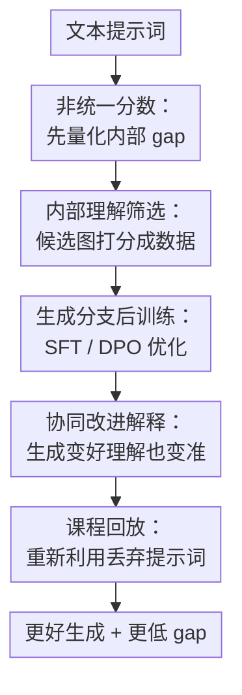

# Turning Internal Gap into Self-Improvement: Promoting the Generation-Understanding Unification in MLLMs

**会议**: ICLR2026  
**OpenReview**: [https://openreview.net/forum?id=tVnml9Q4XW](https://openreview.net/forum?id=tVnml9Q4XW)  
**代码**: 暂未公开  
**领域**: 多模态VLM  
**关键词**: 统一多模态模型、文生图、理解生成统一、自我改进、课程学习

## 一句话总结
这篇论文先用“非统一分数”系统验证统一 MLLM 的生成分支常弱于理解分支，再把这种内部差距转化为无需外部奖励模型的自我改进信号：让理解分支筛选生成候选来构造 SFT/DPO 数据，并用课程回放继续挖掘难样本，从而同时提升生成质量、理解判别能力和生成-理解一致性。

## 研究背景与动机
**领域现状**：统一多模态大模型（unified MLLM）希望同一个模型既能看图回答问题，也能根据文本生成图像。Janus-Pro、Show-o、EMU3、VILA-U、BAGEL、BLIP3-o 这类模型都在尝试把视觉理解和视觉生成放进同一套或相互耦合的架构里，让“理解”和“创作”不再是两个完全分离的系统。

**现有痛点**：名义上的统一不等于能力真的统一。很多模型看图时能发现细节和逻辑错误，但自己生成图像时却会犯同样的错误。例如提示词要求“镜子前的毛绒狮子”，生成分支可能画出不合物理反射关系的图；同一个模型的理解分支再回头检查这张图，却能指出镜子里不应该显示正面。这说明模型内部存在一种很尴尬的错位：它知道什么是对的，却生成不出来。

**核心矛盾**：过去缓解这种错位的方法常常依赖外部奖励模型、额外监督数据或专门的生成评估器。这样虽然能提升生成，但很难回答一个更基础的问题：如果统一 MLLM 内部本来就有更强的理解能力，能不能直接把它当作免费监督信号，用来训练较弱的生成分支？换句话说，内部 gap 不一定只是缺陷，也可能是模型自我改进的入口。

**本文目标**：作者把问题拆成四步：第一，定义一个不依赖外部评估器的内部一致性指标，确认统一 MLLM 是否普遍非统一；第二，判断非统一主要来自生成太弱还是理解误判；第三，用更强的理解分支筛选生成候选，构造 post-training 数据来提升生成；第四，解释为什么只训练生成目标也会让理解变好，并进一步利用这种协同改进做课程式数据扩展。

**切入角度**：论文最关键的观察是，统一 MLLM 的理解分支经常比生成分支更可靠。作者没有把这个现象只当作评测结论，而是把它变成训练机制：生成分支先产生多个候选图，理解分支再判断哪些图符合提示词，符合者作为正样本，不符合者作为负样本或被暂存。这样一来，模型无需额外 reward model，就能从自己的内部不一致中获得训练信号。

**核心 idea**：用 MLLM 自身更强的理解分支为较弱的生成分支提供候选筛选和偏好监督，把内部生成-理解 gap 转化为自我改进数据，并通过课程回放让逐步增强的模型继续利用早期无法利用的难样本。

## 方法详解

### 整体框架
本文方法可以分成“发现 gap、利用 gap、再挖难样本”三个层次。首先，作者让统一 MLLM 对自己的生成结果进行理解判别，用非统一分数衡量生成和理解是否一致；接着，在训练阶段让生成分支为每个提示词采样多张候选图，再让理解分支给候选图打分，从中构造 SFT 或 DPO 数据；最后，随着模型变强，重新访问一开始没有合格候选的提示词，把后来能生成且能被理解分支认可的样本加入训练集。

这条 pipeline 的重点在于：外部模型只用于分析和评估，不参与核心自我改进数据构造。真正的训练信号来自模型自己的理解分支，因此论文称之为 internal gap-based self-improvement。

更具体地，给定提示词 $y$，生成分支产生 $N$ 张候选图 $\{x_i\}_{i=1}^N=\pi_\theta^{gen}(y)$。理解分支看到候选图和问题 $q(y)$，也就是“这张图是否描述了提示词 $y$”，输出二值判断或对应概率。被判为对齐的图进入 chosen 集合，被判为不对齐的图可以作为 rejected 样本。SFT 只用 chosen 图做监督；DPO 则用 chosen/rejected 形成偏好对。

### 关键设计
**1. 非统一分数：不用外部裁判也能量化内部 gap**

作者首先定义 non-unification score，直接测量模型生成结果能否通过自身理解分支的检查。给定文本提示 $y$，模型先生成图像 $x=\pi_\theta^{gen}(y)$；再构造问题 $q(y)$，让理解分支判断“图像 $x$ 是否描述了 $y$”。如果理解分支输出 0，说明生成图与提示词不匹配，模型内部出现了生成-理解不一致。指标写作：$\mathbb{E}_{(x,y)}\mathbb{I}[\pi_\theta^{und}(x,q(y))=0]$。

这个指标的好处是它评估的是模型内部一致性，而不是外部模型眼里的绝对生成质量。作者还特别控制了任务难度这个混杂因素：简单任务可能让 gap 被低估，因为猫、狗、单物体都太容易；困难任务又可能让理解也失败，从而高估 gap。因此论文从 GenEval、T2I-CompBench++、Science-T2I 中选出 easy/medium/hard 三档任务，分别测量六个统一 MLLM。结果显示，非统一现象普遍存在，VILA-U 在困难任务上非统一分数接近 60%。

**2. 内部理解筛选：把“理解比生成强”变成 post-training 数据**

确认 gap 之后，作者进一步判断 gap 到底来自“生成没画对”还是“理解误判”。他们用 Qwen2.5-VL-72B-Instruct 和人工复核检查理解分支的拒绝样本，发现大多数情况下理解分支拒绝是合理的，弱生成比例通常超过 50%，有些任务接近 100%。这一步很重要：如果理解本身不可靠，那么用理解指导生成会放大错误；但如果主要问题是生成弱，理解分支就可以作为内部筛选器。

训练数据构造也很直接。对每个提示词生成 $N$ 个候选图，理解分支用固定问法打分：“Does this original image describe {prompt}? ... score 1 or 0”。SFT 版本把所有 score 为 1 的图像对 $(y,x_{chosen})$ 加入监督集；DPO 版本则选出最像正例的 chosen 图和最像反例的 rejected 图，形成 $(y,x_{chosen},x_{rejected})$。如果一个提示词没有任何合格候选，它不会被强行加入训练，而是进入 discard pool $B$，留给后续课程回放。

**3. 只更新共享 LLM：让生成训练同时牵动理解能力**

论文没有把整个视觉系统都打开训练，而是在主要实验中只更新 Janus-Pro 和 Show-o 的共享 LLM 组件。这个选择看似保守，却和统一 MLLM 的问题本质匹配：如果生成和理解都经过同一个语言骨干或共享表征通道，那么对生成 likelihood 的更新会改变模型处理图文条件的共同动态。附录消融也显示，对 Janus-Pro 来说，只训练 LLM 已经能明显提升生成、理解和统一性；继续更新 projector 或 vision tower 没有带来稳定收益，甚至可能伤害理解和非统一分数。

作者用学习动态理论解释这种协同改进。对 SFT 来说，生成分支的更新量 $\Delta G_t$ 和理解分支的更新量 $\Delta U_t$ 都受到类似的 empirical neural tangent kernel（eNTK）项影响。当一个误判为“对齐”的旧图像 $(y_0,x_0)$ 与 post-training 数据中的样本 $(y_u,x_u)$ 很相似时，理解更新会被共享 eNTK 项主导；如果训练降低了错误生成 $\pi_\theta(x_0\mid y_0)$ 的概率，也会降低理解端把 $x_0$ 错判为匹配 $y_0$ 的概率。这解释了为什么针对生成的训练能修正大量 false positive understanding。

**4. 课程回放：让早期丢弃的难提示词重新进入训练**

标准自我改进有一个天然限制：如果初始模型对某个提示词生成的 $N$ 张图全都不合格，这个提示词就无法贡献训练样本。作者没有把这些提示词永久丢弃，而是维护 discard pool $B$。当训练进行到一定 epoch 后，模型的生成和理解都变强，再对 $B$ 中提示词重新生成候选并重新打分；只要这次出现合格图像，就把它加入 SFT 数据，并从 $B$ 中移除。

这就是 curriculum replay。它不是人为按难度标签排序，而是由模型自身能力变化决定哪些样本“现在可以学”。Janus-Pro 的 SFT 实验中，原始数据约 2265 个样本，课程回放额外加入 1091 个样本；相比只增强单个分支时约 600 个新增样本，生成和理解共同变强可以显著扩大可用数据池。这个机制把 co-improvement 从一个观察结果变成了新的训练资源。

### 一个完整示例
设有提示词“a brown cat and a red orange”。原始 Janus-Pro 可能生成一张只有棕色猫、没有红色橙子的图。旧理解分支看到这张图时，可能把红橙色背景或光照误当作“red orange”，输出 score 1，于是生成和理解都没有意识到错误。

在自我改进流程里，同一个提示词会先生成多张候选图。理解分支把真正包含棕色猫和红色橙子的候选标为 1，把只有猫或只有橙色背景的候选标为 0。SFT 会把 score 1 的图作为正监督；DPO 会把 score 1 和 score 0 的图组成偏好对。训练后，生成分支更容易画出同时包含猫和红橙的图；理解分支也更可能指出旧图“有猫但没有 red orange”，把 score 从 1 改成 0。这正是论文图 5 和附录示例展示的 co-improvement。

### 损失函数 / 训练策略
SFT 版本使用标准生成负对数似然，只在被理解分支选中的图像上优化生成分支。若 $D_{SFT}$ 是所有 chosen 样本集合，训练目标就是最大化 $\log \pi_\theta(x_{chosen}\mid y)$，也就是最小化生成 NLL。DPO 版本则使用 chosen/rejected 偏好对，优化 chosen 图像相对 rejected 图像的偏好概率；论文还采用常见做法，在 DPO 中加入 preferred response 的 NLL 项以增强训练稳定性。

实现上，Janus-Pro-7B 和 Show-o 都使用 T2I-CompBench++ 约 6000 个训练提示词，每个提示词采样 $N=10$ 张图构造数据。主要训练只更新 LLM，Janus-Pro 的 SFT/DPO epoch 分别为 20/30，Show-o 也是 20/30；课程回放在 epoch 10 触发。训练使用 4 张 80GB A800，完整 self-improvement 约需 7-8 小时。课程学习版本记作 C-SFT 或 C-DPO。

## 实验关键数据

### 主实验
作者同时评估生成质量（Gen. 越高越好）、理解 win rate（Und. 越高越好）和非统一分数（Non. 越低越好）。最核心的结果来自 T2I-CompBench++：内部 gap 自我改进显著提升 Janus-Pro，Show-o 因原始 gap 已经很小，提升幅度相对温和但仍稳定降低非统一分数。

| 模型 / 方法 | Gen. Overall ↑ | Und. Overall ↑ | Non. Overall ↓ | 说明 |
|--------|------|------|------|------|
| Janus-Pro-7B | 35.21 | 50.00 | 26.22 | 原始统一 MLLM，生成-理解 gap 明显 |
| Janus-Pro-7B + SFT | 43.29 | 58.39 | 16.98 | 只用内部理解筛选，生成提升约 8 点，Non. 降约 9 点 |
| Janus-Pro-7B + C-SFT | 44.18 | 61.13 | 16.92 | 课程回放继续提升生成和理解 |
| Janus-Pro-7B + DPO | 35.44 | 55.62 | 25.97 | DPO 对理解有帮助，但生成提升弱于 SFT |
| T2I-R1（外部奖励） | 42.22 | 55.67 | 18.33 | 使用外部奖励模型的强基线 |
| Show-o | 49.66 | 50.00 | 0.95 | 初始非统一分数很低 |
| Show-o + SFT | 52.67 | 66.67 | 0.11 | 生成提升约 3 点，Non. 接近 0 |
| Show-o + C-SFT | 52.82 | 66.67 | 0.06 | 课程回放进一步压低 gap |
| HermesFlow（外部奖励） | 49.65 | 41.67 | 0.83 | Show-o 系外部奖励基线 |

在更简单的 GenEval 上，Janus-Pro 的总体 Gen. 从 79.36 提升到 79.89（SFT）和 80.87（C-SFT），Show-o 从 70.11 提升到 71.40（SFT）和 73.22（C-SFT）。Science-T2I-S 更强调隐式科学常识，Janus-Pro 的总体 Gen. 从 24.49 提升到 25.07（SFT）和 25.18（C-SFT），Show-o 从 24.72 提升到 25.22（SFT）和 26.04（C-SFT）。这些提升数值不如 T2I-CompBench++ 大，但方向基本一致。

### 消融实验
| 配置 | 关键指标 | 说明 |
|------|---------|------|
| Janus-Pro-7B baseline | T2I-CompBench++ Overall Gen. 35.21 / Und. 50.00 / Non. 26.22 | 未做内部 gap 自我改进 |
| + LLM only | Gen. 43.29 / Und. 58.39 / Non. 16.98 | 只更新共享 LLM，已经取得主要收益 |
| + LLM and Projector | Gen. 42.10 / Und. 51.42 / Non. 18.82 | 加 projector 后生成相近，但理解和统一性变差 |
| + LLM, Projector and Vision Tower | Gen. 43.18 / Und. 55.64 / Non. 17.02 | 扩大可训练模块没有明显优于 LLM only |
| Janus-Pro SFT, $N=2$ | 构造 254 个样本 | 候选太少，容易找不到合格图 |
| Janus-Pro SFT, $N=10$ | 构造 2265 个样本 | 数据量明显增加并趋于饱和 |
| C-SFT at epoch 4 | Overall Gen. 43.86 / Und. 56.94 / Non. 17.14 | 早期回放有效但弱于后期 |
| C-SFT at epoch 10 | Overall Gen. 44.18 / Und. 61.13 / Non. 16.92 | 模型能力增强后再回放更好 |

### 关键发现
- 内部 gap 越大的模型和子任务越能从 self-improvement 中获益。Janus-Pro 的初始 Non. 明显高于 Show-o，因此提升也更大；在 T2I-CompBench++ 中，Texture、Shape、Spatial 等 gap 较大的子任务会贡献更多 post-training 样本，也得到更明显收益。
- 生成目标训练会带来理解端的 co-improvement。Janus-Pro + SFT 在理解 win rate 上从 50.00 提升到 58.39；论文进一步在 POPE、MMB、SEED、GQA、MMMU 等理解 benchmark 上看到小幅但稳定的收益，例如 Janus-Pro 的 MMMU 从 32.86 提升到 35.24。
- 课程回放的价值来自“动态扩数据”。Janus-Pro 的 SFT 课程回放额外加入 1091 个样本，Show-o 加入 64 个样本；这不是简单多训几轮，而是把初始模型无法产生合格候选的提示词重新变成可学习数据。
- 外部奖励模型仍然有上限优势。Qwen-assisted SFT 的 Janus-Pro Overall Gen. 为 44.78，略高于 self-improved SFT 的 43.29；但本文方法不使用外部信号，已经接近外部裁判辅助训练的效果。

## 亮点与洞察
- 把缺陷变成训练信号是这篇论文最漂亮的地方。很多工作看到生成弱于理解会直接引入外部 reward model，本文则问“模型自己能不能发现自己的生成错了”，这让 unified MLLM 的内部结构优势真正参与训练。
- 非统一分数的定义很朴素，但很有诊断价值。它不追求替代 FID、CLIPScore 或人类偏好评估，而是专门回答“同一个模型生成和理解是否互相承认”这个问题，因此更适合研究统一模型的内部一致性。
- 课程回放把 co-improvement 变成可操作算法。理解和生成一起变强之后，早期被丢弃的难提示词会重新产生合格样本，这比静态数据筛选更贴近自训练的本质。
- 理论部分用 eNTK 解释生成训练为何影响理解，提供了比“共享参数所以会一起变好”更细的机制图景。虽然理论有简化假设，但它明确指出相似 post-training 样本会主导理解更新，这和实验证据能够对上。

## 局限与展望
- 论文主要实验集中在 Janus-Pro 和 Show-o，附录虽补充了 Janus-Pro-1B 与 BAGEL，但模型覆盖仍有限。特别是 BAGEL 这类 MoT/专家分离架构中，生成提升对理解帮助有限，说明该方法对“共享程度”敏感。
- 理解分支被当作内部裁判，但它并非总是可靠。作者用 Qwen 和人工复核确认大多数拒绝来自弱生成，不过在 hard science 类任务中，Qwen 与人工差异也更大；如果理解分支在某些领域系统性误判，自我改进可能会强化偏差。
- 生成评估仍以文生图组合性 benchmark 为主。对于真实开放式创作、长上下文多图生成、编辑式生成或视频生成，内部理解筛选是否仍能稳定构造高质量数据，还需要更多验证。
- 课程回放目前比较简单，只是在固定 epoch 重新访问 discard pool。未来可以根据提示词类型、候选通过率、理解置信度或历史提升速度设计更细的 adaptive curriculum。
- 理论解释强调共享 eNTK，但为什么统一 MLLM 会形成这种共享动态、哪些架构更容易形成有效共享，仍是开放问题。后续可以比较共享 tokenizer、解耦 tokenizer、MoT、扩散生成头等架构差异。

## 相关工作与启发
- **vs HermesFlow**: HermesFlow 也试图缩小多模态理解和生成之间的 gap，但依赖外部 BERT、自评/问答模型等外部信号。本文强调不引入外部裁判，直接利用 MLLM 自身理解分支构造训练数据，因此更像一种纯内部自训练机制。
- **vs T2I-R1**: T2I-R1 使用多个外部 reward model 强化 Janus-Pro 的图像生成，生成质量很强。本文在不使用外部奖励的情况下接近甚至在部分指标上超过 T2I-R1，说明内部理解信号本身已经有很高价值；但 Qwen-assisted SFT 仍略优，提示外部高质量裁判和内部自改进可以互补。
- **vs UniRL / 其他统一模型 self-improvement**: 相关工作常用监督或强化学习提升统一模型，但未必系统区分内部 gap 的来源，也未必强调生成训练带来的理解 co-improvement。本文的贡献在于把“测 gap、用 gap、解释 co-improvement、再用 curriculum 扩数据”串成闭环。
- **对后续研究的启发**: 类似思路可以迁移到视频生成-视频理解、图像编辑-编辑验证、机器人动作生成-状态理解等任务。只要模型内部存在“判别强于生成/执行”的不对称，就可以尝试把内部判别能力转化为自我改进数据。

## 评分
- 新颖性: ⭐⭐⭐⭐☆ 从内部 gap 出发做无外部信号自我改进很清晰，非统一分数和课程回放组合有辨识度，但 SFT/DPO 本身是常规训练工具。
- 实验充分度: ⭐⭐⭐⭐☆ 覆盖六个模型的 gap 验证、多个 benchmark、SFT/DPO/C-SFT/C-DPO、组件和候选数消融，整体扎实；主要训练实验仍集中在少数模型。
- 写作质量: ⭐⭐⭐⭐☆ 论文逻辑链完整，从现象到方法再到理论解释和课程学习，读起来比较顺；理论符号部分略密，需要读者有学习动态背景。
- 价值: ⭐⭐⭐⭐⭐ 对统一 MLLM 很有启发：它把“理解强、生成弱”的内部不一致从坏消息变成训练资源，给无需外部 reward 的多模态自训练提供了可复用范式。

<!-- RELATED:START -->

## 相关论文

- [\[ICLR 2026\] Understanding vs. Generation: Navigating Optimization Dilemma in Multimodal Models](understanding_vs_generation_navigating_optimization_dilemma_in_multimodal_models.md)
- [\[CVPR 2026\] DuetSVG: Unified Multimodal SVG Generation with Internal Visual Guidance](../../CVPR2026/multimodal_vlm/duetsvg_unified_multimodal_svg_generation_with_internal_visual_guidance.md)
- [\[NeurIPS 2025\] HermesFlow: Seamlessly Closing the Gap in Multimodal Understanding and Generation](../../NeurIPS2025/multimodal_vlm/hermesflow_seamlessly_closing_the_gap_in_multimodal_understanding_and_generation.md)
- [\[ICLR 2026\] ChartGalaxy: A Dataset for Infographic Chart Understanding and Generation](chartgalaxy_a_dataset_for_infographic_chart_understanding_and_generation.md)
- [\[ICLR 2026\] UniF2ace: A Unified Fine-grained Face Understanding and Generation Model](unif2ace_a_underlineunified_underlinefine-grained_underlineface_understanding_an.md)

<!-- RELATED:END -->
