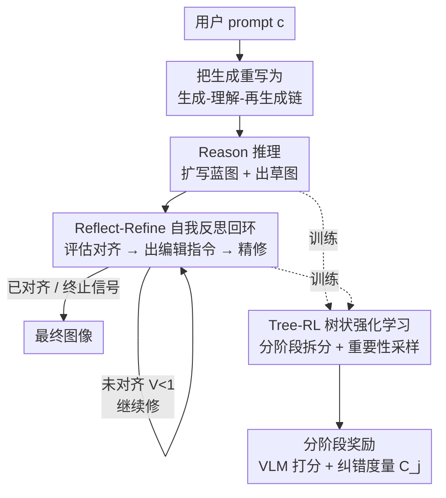

# Understanding vs. Generation: Navigating Optimization Dilemma in Multimodal Models

**会议**: ICLR2026  
**OpenReview**: [https://openreview.net/forum?id=1smez00sCm](https://openreview.net/forum?id=1smez00sCm)  
**代码**: https://github.com/sen-ye/R3  
**领域**: 多模态VLM / 统一理解生成模型  
**关键词**: 统一多模态模型, 理解-生成权衡, 生成式思维链, 强化学习, 自我反思

## 一句话总结
针对统一多模态模型里"提升生成就掉理解、提升理解就掉生成"的优化困境，本文提出 Reason-Reflect-Refine（R3）框架，把单步图像生成改写成"推理→生成→反思→再生成"的多步链式过程，让生成内在依赖模型的理解能力，再用树状强化学习训练，最终在 BAGEL 上同时把生成（GenEval++ 0.371→0.689）和理解（ITA 60.6→73.4）都显著拉高。

## 研究背景与动机
**领域现状**：统一多模态模型（unified multimodal model）希望用一个模型同时具备视觉理解（VQA、密集描述）和视觉生成（文生图）两种能力，被视为通往 AGI 的关键一步。BAGEL、Janus-Pro、Chameleon 等都是这条路线的代表。

**现有痛点**：理解和生成很难同时变强。专门微调高保真图像合成的模型（如扩散架构）往往在物体计数、空间推理这类需要精确视觉理解的任务上很弱；反过来，为 VQA / 密集描述优化的模型，创造性与生成质量又明显落后。论文用 BAGEL 做的对照实验（图 1）直接坐实了这点：只在生成上微调，理解能力掉；只在理解上微调，生成能力掉；而把两类数据简单混合（naive co-training）只带来微不足道的提升。

**核心矛盾**：作者认为问题根子在于**两个任务的训练目标不一致**。生成的目标通常是最大化样本在数据分布下的似然，这个目标**可以完全不依赖理解能力就被优化好**；于是在共享参数的模型里，生成会"独占"模型容量，和理解所需的鲁棒表征产生竞争。前人尝试过统一 tokenizer、或用解耦架构给两个功能分配独立容量，但这些都只是缓解，没触及目标冲突本身。

**本文目标**：能不能让生成和理解的优化目标**对齐**，从而让二者在同一个模型里训练时不再相互拆台？

**切入角度**：作者提出一个根本性的问题——生成过程**应不应该主动调用模型对底层语义的理解**？类比画家作画：先构思（理解意图）、画草稿、再端详哪里不对、最后修改。如果把理解嵌进生成的每一步，那么"生成变强"就内在地要求"理解变强"，竞争关系自然转成协同关系。

**核心 idea**：把图像生成从"单步映射"重写成"推理-反思-精修"的**多步链式过程**，让理解成为生成思维链（generative chain-of-thought）里不可绕过的一环——用理解驱动生成，而非和生成抢容量。

## 方法详解

### 整体框架
R3（Reason-Reflect-Refine）建立在统一多模态模型 BAGEL（参数 $\theta$）之上，BAGEL 本身就能做理解、生成和编辑。原本一步到位的文生图 $\pi_\theta(I|c)$，被改写成一串交替的文本/图像生成步骤 $t_1, I_1, \dots, t_n, I_n \sim \pi_\theta(\cdot|c)$，其中文本 $t_i$ 自回归生成、图像 $I_i$ 由渐进去噪生成。在马尔可夫假设下，这条轨迹被拆成三类交替的专门任务：

- **Reason（推理）**：模型先把用户 prompt $c$ 扩写成一段带细节的"<think>plan</think>"蓝图 $t_1$，再据此合成初始草图 $I_1$，建模为 $\pi_\theta(I_1, t_1|c)=\pi_\theta(I_1|t_1,c)\pi_\theta(t_1|c)$。
- **Reflect（反思）**：拿到草图后，模型评估它和原始意图 $c$ 的对齐程度 $\pi_\theta(t_{i+1}|I_i,c)$；满意就输出终止信号"No further edit needed"，不满意就指出差距并生成一条修改指令 $e_{i+1}$，格式严格约束为"<think>reflection</think>editing instruction"。
- **Refine（精修）**：模型执行修改指令 $e_{i+1}$，在 $I_i$ 基础上编辑出更好的 $I_{i+1}$，建模为 $\pi_\theta(I_{i+1}|e_{i+1},I_i)$。

Reflect-Refine 构成一个迭代回环，反复执行直到模型自己判断图像已满足全部需求才停。整条链路用基于最终图像质量的结果奖励端到端训练，并配一套树状 RL 策略和分阶段奖励来稳定优化。

### 关键设计

**1. Reason-Reflect-Refine：把理解嵌进生成的链式思维**

针对"生成目标可以不依赖理解就被优化好、于是独占容量"这个根矛盾，R3 不再把理解和生成当成两个竞争的目标，而是把理解**塞进生成回环里当必经步骤**。Reason 阶段模型要先读懂用户意图、把简短 prompt 扩写成细粒度蓝图，这本身就是一次理解；Reflect 阶段模型要把当前图像和原 prompt 比对、判断哪里不符——这一步 $\pi_\theta(t_{i+1}|I_i,c)$ **强烈依赖多模态理解**，理解越强，反思越准、修改指令越到位、最终图越好。于是"生成变强"被结构性地绑定到"理解变强"上：理解不再是旁观的评估任务，而是生成的主动组件。这正是它能化解困境的关键——不是靠分配更多容量，而是改变了优化的依赖结构，让两种能力协同演化（co-evolution）。

**2. Tree-RL：用树状分阶段强化学习驯服长链生成**

把整条 Reason→Reflect→Refine→Reflect→Refine… 直接当成图像生成的思维链、用 RL 端到端优化，会撞上两个问题：轨迹太长导致误差累积、训练不稳；中间步缺乏显式监督导致效率低、优势（advantage）难以分配。作者因此把轨迹**切成 Reason 阶段和若干 Reflect-Refine 阶段**，每个阶段把自己的结果图 $I_i$ 和当前奖励作为初始条件灌给下一阶段（图 3）。训练时在挑选上一阶段结果时用**重要性采样**——多采"奖励差异大"的样本，把学习重心放在纠错上，从而在不牺牲整体完成能力的前提下加速收敛。所有策略都用 GRPO 损失优化，文本侧用 GRPO、扩散侧用 FlowGRPO。图 4 显示，相比全轨迹 RL，树状 RL 的训练奖励曲线明显更高——全轨迹方案因长链带来的高方差和噪声让优势分配变得困难，树状切分正好对症。

**3. Stage-wise Reward：给每个阶段量身定制奖励，尤其是纠错度量**

不同阶段评什么、怎么评不能一刀切。Reason 阶段含两个策略：图像策略 $\pi_\theta(I_1|t_1,c)$ 直接用预训练 VLM 打分 $V_j=V(I_1^j,c)\in[0,1]$（图文对齐度），奖励 $r_{j,\text{diffusion}}=V_j$；文本策略 $\pi_\theta(t_1|c)$ 额外加格式奖励，$r_{j,\text{text}}=V_j+r_{j,\text{format}}$。Reflect-Refine 阶段的核心是一个**纠错度量** $C_j$：

$$
C_j=\begin{cases} V_j-\hat{V} & \text{if } \hat{V}<1 \\ \mathbb{I}(e_j=\text{"No further edit needed"}) & \text{if } \hat{V}=1 \end{cases}
$$

其中 $\hat{V}$ 是上一步图像的奖励、$V_j$ 是精修后新图的奖励。这个度量同时奖励两种正确行为：对有缺陷的图，奖励**可度量的提升** $V_j>\hat{V}$；对已满足 prompt（$\hat{V}=1$）的图，奖励**正确终止**（输出"No further edit needed"）。最终反思和精修步的奖励基于它：$r_{j,\text{reflection}}=C_j+r_{j,\text{format}}$，$r_{j,\text{refinement}}=C_j$。值得注意的是，RL 目标**从不直接优化理解任务**，但模型为了准确评估图文对齐、拿到反思奖励，被动地练就了鲁棒的视觉理解能力——这正是"理解随生成一起涨"的机制来源。

### 一个完整示例
以 prompt "A photo of four cats"（四只猫的照片）为例走一遍：Reason 阶段模型先想"应该生成……"并扩写出更详细的蓝图，据此画出初始草图。进入 Reflect 阶段，模型给自己提问"目标图描述是……，当前图显示……，该怎么进一步编辑？"，发现当前图只有两只猫，于是反思输出"<think>……</think>"并给出编辑指令"Add two more cats"（再加两只猫）。Refine 阶段执行该指令、把图改成四只猫。再次 Reflect 时模型判断"Current image matches the target description. No further edit needed."（当前图已匹配目标，无需再改），于是终止。整个过程是模型自己决定要修几轮、何时收手，计数这类组合属性正是靠这种"画-看-改"回环被逐步纠正到位的。

### 损失函数 / 训练策略
所有策略统一用 GRPO 优化：文本生成（推理蓝图、反思指令）走标准 GRPO，扩散图像生成走 FlowGRPO（把 GRPO 套到去噪 SDE 序列上）。训练在 Reason 策略与 Reflect-Refine 策略之间交替进行，Reason 阶段产出的结果填入 replay buffer 作为后续阶段的 on-policy 数据。奖励模型用 Qwen-2.5-VL-72B；默认配置为 1 个推理阶段 + 4 个反思-精修阶段。消融显示训练时轨迹长度取 2（Reason + 1×RR）已是算力与性能的最佳平衡点。

## 实验关键数据

### 主实验
在 GenEval++ 上评测指令遵循生成能力（GPT-4.1 评判，↑ 为相对 BAGEL 基线的提升）：

| 方法 | Count | Multi-Count | Overall |
|------|-------|-------------|---------|
| BAGEL（基线） | 0.600 | 0.375 | 0.371 |
| Echo-4o（前 SOTA，在相关数据上微调） | 0.575 | 0.625 | 0.679 |
| BAGEL + Ours†（仅推理阶段） | 0.650 | 0.600 | 0.593 ↑0.22 |
| **BAGEL + Ours（完整 R3）** | **0.725** | **0.800** | **0.689 ↑0.32** |

完整 R3 在总分上反超在相关数据上微调的 SOTA Echo-4o 约 1 个点，在 Multi-Count 这种复杂组合场景上优势尤其明显（0.800 vs 0.625）。

理解能力上，作者自建了 ITA（Image-Text Alignment，评图文整体对齐判断）和 VQA（评对自生成图像中组合元素的感知）两套协议：

| 任务 | BAGEL | + Ours†（仅推理） | + Ours（完整） |
|------|-------|------------------|---------------|
| ITA Overall (%) | 60.60 | 61.76 ↑1.16 | **73.37 ↑12.77** |
| VQA Overall (%) | 86.48 | 86.72 ↑0.24 | **89.63 ↑3.15** |

### 消融实验

| 配置 | GenEval++ | ITA (%) | 说明 |
|------|-----------|---------|------|
| 仅 Reason | 0.654 | 62.83 | 只有推理扩写阶段 |
| Reason + 1× RR | 0.729 | 74.49 | 加一轮反思-精修，生成和理解都大涨 |
| Reason + 2× RR | 0.732 | 74.76 | 继续加几乎饱和 |

### 关键发现
- **反思-精修阶段才是关键**：仅推理阶段对理解几乎没帮助（ITA 仅 +1.16、VQA 仅 +0.24），加上反思-精修后理解暴涨（ITA +12.77、VQA +3.15）。说明真正解锁理解能力的是"评估自己输出"这一步，而非单纯的 prompt 扩写。
- **推理时可缩放（inference-time scaling）**：增大反思-精修轮数上限，GenEval/GenEval++/TIIF 全线上升，最大增益来自第一轮反思-精修，之后逐步饱和，4~5 轮见顶。
- **理解与生成协同演化**：训练前 150 步生成准确率与无反思基线相近、VQA 几乎不动；越过 150 步反思机制开始见效，理解先涨、紧接着生成加速超过基线——直接证据表明理解上升带动了生成提升。
- **学到的是领域专用理解**：跨主题实验（表 5）显示，在 counting 上训练只让 counting 的理解涨，迁移到 color/position 有限——当前框架学到的是 domain-specific understanding，泛化到通用理解仍是开放问题。
- **泛化到通用域**：在 TIIF 通用基准上，BAGEL+Ours 总分 82.02，远超 BAGEL 基线 70.97，说明收益能迁移到非 GenEval++ 的一般生成场景。

## 亮点与洞察
- **把"竞争"改成"依赖"是最巧的一招**：以往大家想方设法给理解和生成分配独立容量来止血，本文反其道，让生成**结构性地依赖**理解（反思必须看懂图），从根上把两个目标的优化方向对齐——这是迁移性极强的思路，凡是"两个能力抢容量"的多任务场景都值得借鉴。
- **理解能力是"免费"练出来的**：RL 目标里从没显式优化理解任务，理解纯粹是为了拿反思奖励、准确评估图文对齐而被动习得的。这提示：与其单独造理解数据，不如设计一个"必须用到理解才能拿高分"的生成任务。
- **Tree-RL 对长链 RL 的工程价值**：把长轨迹切成阶段、用阶段奖励 + 重要性采样（多采奖励差异大的样本）解决长链优势分配难题，对任何多步生成式 RL（如 agent、长链推理）都有参考意义。
- **纠错度量 $C_j$ 设计精巧**：一个分段函数同时编码了"该改的图要真改好"和"该停的图要正确停"两种行为，避免模型无脑反复编辑或过早终止。

## 局限与展望
- **理解是领域专用的**：作者自己承认（表 5），跨主题泛化有限，模型学到的是 domain-specific understanding，如何培养更通用的理解能力是明确的未来方向。
- **依赖外部 VLM 当奖励模型**：用 Qwen-2.5-VL-72B 打分，奖励质量受限于这个 VLM 的能力上限，存在奖励噪声/偏差风险；评估端又用 GPT-4.1、Gemini-2.5-Flash 造 ground truth，链路较重。
- **推理成本上升**：把单步生成变成多轮"画-看-改"，推理时延和算力随轮数增加；虽然 4~5 轮饱和，但相比一步到位仍是数倍开销。
- **仅在 BAGEL 上验证**：框架建立在 BAGEL 这一特定统一模型上，是否在其他架构（纯离散 token 或纯连续 token 路线）上同样有效尚未验证。
- **自建理解基准（ITA/VQA）**：理解能力的提升数字依赖作者新提出的评测协议，虽做了人工对齐校验，但与社区通用 benchmark 的可比性有待观察。

## 相关工作与启发
- **vs 统一 tokenizer 路线（Chameleon / Janus-Pro 等）**：他们试图用统一离散 token 或更好的 tokenizer 在表示层弥合理解与生成的鸿沟，本文认为冲突根子在训练目标而非表示，转而从**任务结构**上把理解变成生成的子任务，是 task-oriented 而非 representation-oriented 的解法。
- **vs 解耦架构路线（给理解/生成分配独立容量）**：解耦只是物理上隔离两个功能、回避竞争，本文则让二者协同——理解驱动生成，二者一起涨而非各管一摊。
- **vs 多模态 RL（T2I-R1 / FlowGRPO / GoT-R1）**：T2I-R1 联合训练文本和图像 token，FlowGRPO 把 GRPO 套到扩散去噪步上，GoT-R1 学语义规划与布局。本文复用了 GRPO + FlowGRPO 的优化工具，但落点不同——核心是把理解重塑为生成的组件、并用多任务组合出更复杂彻底的生成链，而不只是把 RL 用于提升单步生成质量。

## 评分
- 新颖性: ⭐⭐⭐⭐⭐ 把"理解 vs 生成"的竞争重构成结构性依赖，视角新颖且切中根本矛盾
- 实验充分度: ⭐⭐⭐⭐ 生成/理解双线 + 协同演化分析 + 推理缩放 + 跨主题泛化都有覆盖，但仅在 BAGEL 上验证、理解基准为自建
- 写作质量: ⭐⭐⭐⭐⭐ 动机推导清晰、画家类比贴切、图表（co-evolution 曲线、Tree-RL 对比）很有说服力
- 价值: ⭐⭐⭐⭐⭐ 为下一代统一多模态模型给出可落地的"理解驱动生成"范式，思路迁移性强

<!-- RELATED:START -->

## 相关论文

- [\[ICLR 2026\] On Discriminative vs. Generative Classifiers: Rethinking MLLMs for Action Understanding](on_discriminative_vs_generative_classifiers_rethinking_mllms_for_action_understa.md)
- [\[ICLR 2026\] Thinking with Camera: A Unified Multimodal Model for Camera-Centric Understanding and Generation](thinking_with_camera_a_unified_multimodal_model_for_camera-centric_understanding.md)
- [\[ICLR 2026\] Lavida-O: Elastic Large Masked Diffusion Models for Unified Multimodal Understanding and Generation](lavida-o_elastic_large_masked_diffusion_models_for_unified_multimodal_understand.md)
- [\[ICLR 2026\] UniF2ace: A Unified Fine-grained Face Understanding and Generation Model](unif2ace_a_underlineunified_underlinefine-grained_underlineface_understanding_an.md)
- [\[ICLR 2026\] Omni-Weather: A Unified Multimodal Model for Weather Radar Understanding and Generation](omni-weather_a_unified_multimodal_model_for_weather_radar_understanding_and_gene.md)

<!-- RELATED:END -->
