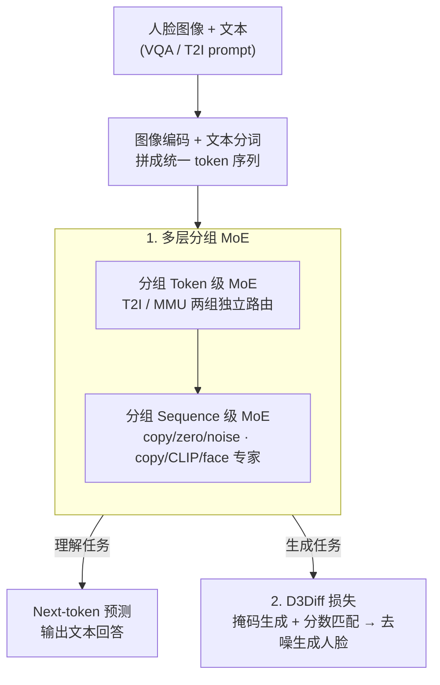

# UniF2ace: A Unified Fine-grained Face Understanding and Generation Model

**会议**: ICLR 2026  
**OpenReview**: [https://openreview.net/forum?id=LV01JdxARe](https://openreview.net/forum?id=LV01JdxARe)  
**代码**: 有（论文称代码与数据集开源，见原文链接）  
**领域**: 多模态VLM / 统一多模态 / 人脸理解与生成  
**关键词**: 统一多模态模型, 离散扩散, 分数匹配, 混合专家, 细粒度人脸

## 一句话总结
UniF2ace 是首个把人脸"理解"（VQA / 描述）和"生成"（文本→人脸）统一进单一模型的统一多模态模型（UMM），靠一个把掩码生成与离散分数匹配统一起来的 D3Diff 损失提升细粒度生成保真度、靠分组的 token 级 + 序列级 MoE 把语义与身份特征重新注入以对抗"属性遗忘"，并配套构建了含 130K 图文对 + 1M VQA 的 UniF2aceD-1M 数据集；在 1.8B 规模下，Desc-GPT 和 VQA-score 分别比同量级模型高 7.1% 和 6.6%。

## 研究背景与动机

**领域现状**：统一多模态模型（UMM）近年成为热点，能在单一"any-to-any"框架里同时做理解和生成，被视为通往 AGI 的一步。但在"人脸"这一对身份验证、人机交互、虚拟人都至关重要的垂直领域，这套统一范式几乎没人碰过。

**现有痛点**：人脸方向的研究被切成两半且都缺细粒度。一方面**任务割裂**——理解模型通常是在粗粒度文本上微调的 MLLM，生成模型通常是靠语义 mask / 草图引导的扩散模型，两者各干各的，无法直接"从详细描述生成人脸"，工作流既低效又功能受限。另一方面**普遍缺细粒度信息**：(a) 现有离散扩散在 UMM 里主要依赖掩码生成模型，没和精确的分数匹配结合，难以生成精细的图像细节；(b) 细粒度属性表示在多模态学习的表征演化过程中容易被丢弃（"属性遗忘"）；(c) 缺少带细粒度属性的跨模态人脸数据——现有文本-人脸数据要么是低分辨率、描述不准的网络爬取图，要么每条描述只覆盖 2~7 个属性，且几乎都没有 VQA。

**核心矛盾**：要做"细粒度人脸的统一理解与生成"，必须同时啃下三块硬骨头——生成端如何更精确逼近最大似然以合成细节、网络如何在统一表征里不丢身份和语义属性、以及训练数据从哪来。这三者相互纠缠，缺一块都做不到位。

**本文目标**：在单一模型里同时完成细粒度人脸理解与生成，并把细粒度属性真正捕捉住。

**切入角度**：作者认为人脸生成比理解更难（细节多、保真度要求高），因此生成端要从"训练目标"层面动刀——把离散扩散里的分数匹配理论引进来，让模型对负对数似然（NLL）有更紧的上界；架构端则要为生成与理解分别设计专家路由，把外部的语义/身份特征"选择性地"补回来。

**核心 idea**：用"统一掩码生成与分数匹配的 D3Diff 损失 + 分组多层 MoE 架构 + 大规模细粒度人脸 VQA 数据集"三件套，让一个 1.8B 的 UMM 在人脸理解与生成上同时打过同量级专用模型。

## 方法详解

### 整体框架
UniF2ace 是一个 AR + Diffusion 混合的统一 Transformer：输入是人脸图像与文本，经图像编码器和文本分词器拼成统一 token 序列，送入 L 层带 MoE 层级的 Transformer；理解任务（Und/MMU）走自回归、用 Next-token 预测损失输出文本回答，生成任务（Gen/T2I）对图像 token 加噪、用 D3Diff 损失做离散扩散去噪。整个模型的两个核心创新都长在这条主干上：(1) 每个 Transformer block 里先过**分组 Token 级 MoE**再过**分组 Sequence 级 MoE**，把 token 级专精路由和实例级（整图、人脸 embedding）特征注入结合起来；(2) 生成端用 **D3Diff 损失**把掩码生成与分数匹配统一优化。此外作者把"数据"也当成一等公民，构建了 UniF2aceD-1M 来喂这套训练。

### 关键设计

**1. 多层分组 MoE：让理解和生成各用各的专家，并把丢掉的语义/身份特征选择性补回来**

针对的是"属性遗忘"和现有 UMM 架构的两个不足——要么是纯 dense 架构、要么只做 token 级 MoE，都没有"选择性注入实例特征"的能力。UniF2ace 的做法是在每个 block 里叠两层 MoE 并按任务分组。**Token 级 MoE**把 FFN 切成多个小专家、用 Top-K 激活，关键是把专家分成 T2I 和 MMU 两组、每组各有共享专家 + 路由专家，且**每组独立**算专家均衡损失 $L_{\text{Balance}} = \lambda_{t2i}\sum_{i=1}^{N_{t2i}} f_i P_i + \lambda_{mmu}\sum_{j=1}^{N_{mmu}} f_j P_j$，其中 $f$、$P$ 是专家被选频率与概率——这样生成与理解的路由不会互相干扰。**Sequence 级 MoE**则在 token 级之后处理整段图像特征：T2I 组设 copy（跳过，$E_{\text{copy}}(x)=x$）、zero（丢弃，$E_{\text{zero}}(x)=0$）、noise 三个专家；MMU 组设 copy、CLIP、face 三个专家。其中 noise / CLIP / face 专家的形式都是"门控加权 + resampler 注入外部特征"，例如 face 专家 $E_{\text{face}}(x) = w_{\text{face}} x + (1-w_{\text{face}}) S(F(X))$，$F$ 是人脸编码器（AntelopeV2）、$S$ 是把特征映射进序列空间的 resampler、$w$ 由可训练权重经 Softmax 得到。这样模型就能在深层"按需"把 CLIP 的语义和 InsightFace 的身份 embedding 重新拌进表征里，专门补回那些在表征演化中被丢掉的细粒度人脸属性（实验里 face/CLIP 专家在靠近输出的深层激活更频繁，印证了这一点）。

**2. D3Diff 损失：把掩码生成和分数匹配统一成对负对数似然更紧的上界**

生成端的痛点是：UMM 里的离散扩散主要靠掩码生成模型实现，缺少与精确分数匹配的结合，导致细节难以生成准确。作者先从负对数似然（NLL）出发，指出已有两种可计算的代理上界——一种带分数损失 $L_1 = L_{\text{score}}(s_\theta) + D_{KL}(q_{T|0}\,\|\,p_{\text{base}})$，一种是常用于预测掩码 token 的 $L_2$。其 Theorem 1 证明 $-\log p_\theta(x_0) \le L_1 \le L_2$，也就是带分数损失的 $L_1$ 是更紧的上界、对 NLL 逼近更精确。利用掩码生成里后验 $p_\theta(x_0|x_t) \approx q_t(x_t|x_0)\,s_\theta(x_t)$ 这一贝叶斯关系，作者把两者缝起来，提出 D3Diff 训练损失：

$$L_{D3Diff} = -\sum_{t=1}^{T} \mathbb{E}_{q(x_0)q(x_t|x_0)}\big[\log p_\theta(x_0|x_t)\big] + \alpha\, L_{\text{score}}\big(p_\theta(x_0|x_t)/q_t(x_t|x_0)\big)$$

第一项是常规掩码生成的似然项，第二项是分数匹配项（权重 $\alpha$）。它的妙处在于**同时优化最大似然目标的两个不同上界**，既保留掩码生成的稳定优化，又借分数匹配收紧上界，从而在细粒度细节（如"红润脸颊""圈形耳环"）上对齐文本。消融显示 $\alpha=0.01$ 最优——它正好平衡分数匹配项与掩码项之间约 200× 的量级差异；且"只用分数损失"优于"只用掩码损失"，从经验上印证了理论分析。模型最终训练目标为 $L_{total} = L_{MMU} + L_{D3Diff}$，其中 $L_{MMU}$ 是理解端标准的 NTP 语言建模损失。

**3. UniF2aceD-1M：补上细粒度人脸跨模态数据这块缺口**

前面两项再好，没有覆盖足够属性、带 VQA 的高分辨率数据也喂不出细粒度能力。作者构建 UniF2aceD-1M：约 130K 张高保真人脸图，每张配覆盖外貌/动作/情绪共 46 类属性的详细描述，平均**每条描述 17.7 个属性**（对比 MM-CelebA 6.2、CelebV-Text 4.3），描述 token 平均长度 120；更关键的是用自动化流水线生成了约 **1M 条人脸专用 VQA**，专门探问外貌、情绪、动作推理——这是现有人脸数据集普遍缺失的部分，使模型能通过指令微调学会对细粒度属性做理解和推理。可以把它理解为前两个设计的"燃料"：D3Diff 要靠密集属性描述学会生成细节，MoE 的理解分支要靠大规模 VQA 学会细粒度问答。

### 损失函数 / 训练策略
两个学习目标联合优化：理解端用 Next Token Prediction $L_{MMU} = \sum_{i=1}^{M}\log P(Y_i\mid Y_{<i}, X)$，生成端用 D3Diff 损失；总损失 $L_{total} = L_{MMU} + L_{D3Diff}$。MoE 额外带分组专家均衡损失，分数匹配项权重取 $\alpha=0.01$。

## 实验关键数据

### 主实验
人脸生成（UniF2aceD-1M 测试集，越高越好除 FID）：1.8B 的 UniF2ace 在 FID / VQA-score / VLM-score 上同时拿下同量级 UMM 的 SOTA，VLM-score 甚至超过 12B 的 Flux.1-dev。

| 模型 | 类型 | 参数量 | VQAscore-CF5↑ | FID↓ | VLM-score↑ |
|------|------|--------|---------------|------|------------|
| Show-o | AR+Diff | 1.3B | 0.855 | 142.557 | 75.618 |
| JanusFlow | AR+Diff | 1.3B | 0.881 | 72.825 | 61.593 |
| Flux.1-dev | Diff | 12B | 0.893 | 76.427 | 84.513 |
| **UniF2ace** | AR+Diff | 1.8B | **0.894** | **66.005** | **88.049** |

人脸理解（UniF2aceD-1M，GPT-4o / DeepSeek 1-10 打分）：在所有指标上拿 SOTA，且超过 8B 的 InternVL2.5 这种更大的专用理解模型。

| 模型 | 参数量 | Desc-GPT↑ | Conv-GPT↑ | Desc-DS↑ | Conv-DS↑ |
|------|--------|-----------|-----------|----------|----------|
| InternVL2.5 | 8B | 5.62 | 5.89 | 6.30 | 6.55 |
| JanusFlow | 1.3B | 4.88 | 6.06 | 5.42 | 6.77 |
| Show-o | 1.3B | 3.88 | 4.17 | 5.24 | 4.90 |
| **UniF2ace** | 1.8B | **6.02** | **6.53** | **7.38** | **7.29** |

此外在 FFHQ-Text / MM-CelebA / CelebV-Text 等公开数据集上生成与理解均保持领先，在 FaceXBench 单图子集（2,150 实例）和 FLIP-80M 非名人样本上也优于 Qwen2-VL(7B)、Qwen2.5-VL(3B)，体现泛化性与鲁棒性。

### 消融实验

| 配置 | VQAscore-CF5↑ / Desc-GPT↑ | 说明 |
|------|---------------------------|------|
| Only Mask（α=0） | 0.879 | 仅掩码生成损失 |
| Only Score（α=0.01） | 0.886 | 仅分数匹配损失，已优于纯掩码 |
| **D3Diff（α=0.01）** | **0.894** | 完整损失，FID 最低 66.005 |
| Token+Seq MoE 全开 | 6.023（Desc-GPT） | 完整架构 |
| w/o 两级 MoE | 4.988（Desc-GPT） | 去掉 MoE 理解掉约 1 分 |
| w/o Face & CLIP 专家 | 5.21（Desc-GPT） | 同时去掉身份+语义专家，理解显著下降 |

### 关键发现
- **D3Diff 的两项缺一不可**：单用掩码或单用分数都不如联合；"只用分数"优于"只用掩码"在经验上印证了 $L_1\le L_2$ 的理论；$\alpha=0.01$ 是用来抹平分数项与掩码项约 200× 量级差的甜点值。
- **MoE 两级互补**：token 级与序列级单独开都比无 MoE 强，合起来最好；序列级 Top-K=2 在生成与理解上综合最优（再增大 Top-K 收益饱和）。
- **Face 与 CLIP 专家各管一摊**：去掉任一都掉点，二者同开才拿到 Desc-GPT 6.02——身份特征和语义特征对细粒度理解是互补的；激活分析显示它们在靠近输出的深层更活跃，说明深层更依赖视觉 embedding 来读懂人脸。

## 亮点与洞察
- **把"统一理解与生成"具体落到损失层面**：D3Diff 不是简单把两个 loss 相加，而是用 NLL 上界的紧致性给出理论依据（Theorem 1），再用贝叶斯关系把掩码后验和分数函数缝起来——这是"理论先行、再落工程"的范例，可迁移到其他需要离散扩散精细生成的任务。
- **MoE 当作"特征再注入"通道**：把 CLIP / InsightFace 等外部专用编码器的输出，用门控 + resampler 选择性地拌回主干表征，专治表征演化中的属性遗忘；这种"外部专家挂载"的思路对任何垂直域 UMM（医学、商品、文档）都好借鉴。
- **数据按属性密度做文章**：用"平均每条描述 17.7 个属性 + 1M VQA"直接把细粒度能力的天花板抬高，提醒大家垂直域 UMM 的瓶颈常常先在数据。

## 局限与展望
- **仍是单图推理**：在 FaceXBench 上不得不剔掉多图推理任务、只评单图子集，说明模型当前不支持多图人脸推理（如跨图身份比对）。
- **理论上界依赖近似**：D3Diff 用了 token 独立性假设和 $p_\theta\approx q_t s_\theta$ 的贝叶斯近似，紧致性结论在这些近似成立的前提下才严格，实际收益用 $\alpha$ 调参兜底。
- **强依赖外部编码器**：身份/语义补回靠 CLIP 与 AntelopeV2，这些编码器本身的偏差与覆盖范围会传导到下游；非名人、低质图场景虽有评测但仍是难点。
- **改进方向**：把多图推理纳入序列级 MoE、用更强人脸编码器、或把 D3Diff 推广到视频人脸生成都是自然延伸。

## 相关工作与启发
- **vs 纯理解 MLLM（Qwen2-VL / InternVL2.5）**：它们只做理解、且在粗描述上微调；UniF2ace 用 1.8B 同时做理解+生成，并靠 Face/CLIP 专家在细粒度人脸理解上反超 8B 的 InternVL2.5。
- **vs 纯生成扩散（SD3 / Flux.1-dev）**：它们只能从短文本生成、缺乏理解能力，且大参数量；UniF2ace 用 D3Diff 在 1.8B 下把 VLM-score 做到 88.0，超过 12B 的 Flux。
- **vs 其他 UMM（Show-o / JanusFlow / TokenFlow）**：Show-o / JanusFlow 也是 AR+Diff 但只做 token 级或 dense 架构、未针对人脸细粒度；UniF2ace 的分组多层 MoE + D3Diff + 专用数据集让它在人脸域同时刷新理解与生成 SOTA。

## 评分
- 新颖性: ⭐⭐⭐⭐⭐ 首个细粒度人脸统一 UMM，D3Diff 的 NLL 紧致性理论 + 特征再注入 MoE 都有原创性。
- 实验充分度: ⭐⭐⭐⭐⭐ 生成/理解双任务、多公开数据集、FaceXBench、非名人鲁棒性、三组消融齐全。
- 写作质量: ⭐⭐⭐⭐ 理论与架构脉络清晰，符号偏密、部分推导放附录需对照原文。
- 价值: ⭐⭐⭐⭐⭐ 同时给出方法、理论与 130K+1M 数据集，为人脸统一多模态建立了强基线。

<!-- RELATED:START -->

## 相关论文

- [\[ICLR 2026\] Thinking with Camera: A Unified Multimodal Model for Camera-Centric Understanding and Generation](thinking_with_camera_a_unified_multimodal_model_for_camera-centric_understanding.md)
- [\[ICLR 2026\] Omni-Weather: A Unified Multimodal Model for Weather Radar Understanding and Generation](omni-weather_a_unified_multimodal_model_for_weather_radar_understanding_and_gene.md)
- [\[ICLR 2026\] MotionSight: Boosting Fine-Grained Motion Understanding in Multimodal LLMs](motionsight_boosting_fine-grained_motion_understanding_in_multimodal_llms.md)
- [\[ICLR 2026\] ORION: Decoupling and Alignment for Unified Autoregressive Understanding and Generation](orion_decoupling_and_alignment_for_unified_autoregressive_understanding_and_gene.md)
- [\[ICLR 2026\] GranViT: A Fine-Grained Vision Model For Autoregressive Multimodal Large Language Models](granvit_a_fine-grained_vision_model_for_autoregressive_multimodal_large_language.md)

<!-- RELATED:END -->
