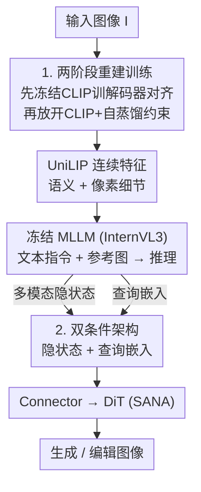

# UniLIP：改造 CLIP 以统一多模态理解、生成与编辑

**会议**: ICLR 2026  
**OpenReview**: [https://openreview.net/forum?id=6tx4BGjwJP](https://openreview.net/forum?id=6tx4BGjwJP)  
**代码**: https://github.com/nnnth/UniLIP  
**领域**: 多模态VLM  
**关键词**: 统一多模态模型, CLIP, 图像重建, 自蒸馏, 图像编辑

## 一句话总结
UniLIP 用「两阶段+自蒸馏」训练把原本只擅长理解的 CLIP 改造成既能保留语义、又能高保真重建像素的统一视觉编码器，再配上「多模态隐状态 + 查询嵌入」双条件架构桥接 MLLM 与扩散模型，让 1B/3B 的小模型在 GenEval（0.90）、WISE（0.63）、ImgEdit（3.94）上反超 BAGEL（7B）、UniWorld-V1（12B）等更大的统一模型。

## 研究背景与动机
**领域现状**：统一多模态模型想让一个模型同时做「理解」和「生成」。理解侧主流是把 CLIP 这类语义编码器对齐到 LLM；生成侧要么用扩散建模 VAE 隐空间、要么用 VQVAE 离散 token 做自回归。两条技术路线天然割裂，于是大家都想找一个「统一的视觉 tokenizer」。

**现有痛点**：CLIP 特征语义丰富、和文本对齐好，是理解任务的最优选择，但它**缺乏像素细节**，无法直接重建图像。现有基于 CLIP 的统一方法都在「理解」和「重建」之间顾此失彼：VILA-U / TokenFlow 把 CLIP 特征**量化**成离散 token，重建尚可但语义退化（理解还不如原始 CLIP）；Emu2 冻结 CLIP、单独训一个扩散解码器从 CLIP 特征还原图像，语义保住了但**重建不一致**（如示例里洞的位置、数量都错），编辑任务直接崩。

**核心矛盾**：把 CLIP 直接拿去训重建，会对理解能力造成**灾难性遗忘**；而靠外挂扩散解码器「补细节」，又因为 CLIP 特征本身丢了像素信息，补出来的细节和原图对不上。重建质量与语义保持成了一对 trade-off。

**本文目标**：(1) 如何让 CLIP 学会重建，又不损伤原有理解能力？(2) 如何把这样的 CLIP 高效用到生成和编辑里，尤其是对一致性要求极高的编辑？

**切入角度**：作者做了个关键的探针实验——直接从**冻结** CLIP 特征重建图像，结果虽然模糊，但**仍能还原出大致轮廓**，说明 CLIP 里其实潜藏着微弱的像素线索。这意味着不必从零硬塞细节，而是去「定位并放大」CLIP 已有的重建潜能。

**核心 idea**：用两阶段训练 + 自蒸馏约束，渐进地赋予 CLIP 高保真重建能力同时锁住语义分布（得到 UniLIP 编码器）；再用双条件架构把 MLLM 的推理结果（查询嵌入）和上下文细节（多模态隐状态）一起喂给扩散 transformer，避免编辑时的信息丢失。

## 方法详解

### 整体框架
UniLIP 把「让 CLIP 既懂又能画」拆成两件事来做。第一件事是**改造编码器**：通过两阶段重建训练，把 InternVL3 里的 InternViT（即这里的 CLIP）升级成既保留语义、又能被轻量解码器还原成像素的 UniLIP 编码器，关键约束是自蒸馏。第二件事是**搭生成/编辑管线**：沿用 MetaQuery 的「查询嵌入桥接 MLLM 与 DiT」思路，但额外把 MLLM 的多模态隐状态也作为条件，形成双条件，解决编辑时固定长度查询信息不够的问题。整套系统里 MLLM（InternVL3）全程冻结以保住理解性能，只训 connector 和 DiT（SANA）。

### 关键设计

**1. 两阶段自蒸馏重建训练：在不遗忘语义的前提下给 CLIP 注入像素细节**

这一设计直接针对「CLIP 缺像素细节、硬训重建会灾难性遗忘」的核心矛盾。结构上是一个自编码器：把 CLIP 和像素解码器 $D_{pix}$ 配对，中间用投影 $h_\phi$ 对齐维度，重建过程为 $\hat{I} = D_{pix}(h_\phi(\mathrm{CLIP}(I)))$。

训练分两阶段。**阶段一冻结 CLIP，只训像素解码器和投影**，目标 $L_{stage1} = L_{MSE} + L_{LPIPS}$（像素重建 + LPIPS 感知损失）。此时 CLIP 不动，模型只是充分挖掘已有特征里的信息、先把解码器和 CLIP 对齐好，输出虽模糊但稳定。**阶段二放开 CLIP 一起训**，但引入自蒸馏损失约束特征分布漂移：

$$L_{stage2} = L_{MSE} + L_{LPIPS} + \lambda\lVert F_{orig} - F_{ft}\rVert_2^2$$

其中 $F_{orig}$ 是原始（冻结教师）CLIP 特征，$F_{ft}$ 是微调中的特征，$\lambda=1$。直觉是：CLIP 自己当自己的教师，把更新后的特征拉回原分布附近，从而在加细节的同时不破坏语义。作者还把 CLIP 的学习率设为全局学习率的 0.1 倍，进一步限制参数更新。

为什么有效：阶段一先把解码器和 CLIP「预对齐」是关键——否则阶段二里未冻结的 CLIP 和随机初始化的投影层之间存在严重错配，会导致梯度不稳定。消融显示，去掉两阶段直接单阶段训练，初始蒸馏损失尖峰几乎翻倍（0.0939 vs 0.0497），收敛要慢 3 倍、恢复理解性能要慢 4 倍。最终 UniLIP 不仅重建大幅领先（448 分辨率 rFID 0.31、PSNR 24.62，远超 Emu2 的 3.27/13.49），理解性能还**不降反升**（见 Table 1），因为重建训练逼着模型去捕捉更多图像细节。

**2. 双条件架构：用查询嵌入管推理、多模态隐状态管细节，破解编辑一致性难题**

有了能重建的 UniLIP 后，生成/编辑管线沿用 DreamLLM / MetaQuery 的范式：用固定数量的查询嵌入（query embeddings）作为桥梁连接 MLLM 和扩散 transformer，查询 token 充当生成条件。这在文生图里够用——因为生成 prompt 通常很短，LLM 擅长压缩文本。但作者指出**瓶颈在于查询数量固定**（DreamLLM 用 64、MetaQuery 用 256），编辑时查询要保留一张甚至多张参考图的细节，固定 token 必然信息丢失，导致编辑后不一致。

双条件架构的做法是：除了查询嵌入，**把 MLLM 的多模态隐状态也作为 DiT 交叉注意力的条件**，两者拼接形成「双条件」。这相当于把生成/编辑解耦成互补的两半——MLLM 负责抽取丰富上下文并推理出「该画成什么」，DiT 负责在这些线索上合成图像；而双条件保证了这个解耦过程中**信息无损传递**，把查询嵌入压不下去的参考图像素细节补回来。消融印证了二者的分工（Table 7）：WISE（知识驱动生成）上只用查询嵌入比只用隐状态高 5 分（0.52 vs 0.47），因为查询更能调动 MLLM 的推理；而编辑上只用查询嵌入反而最差（ImgEdit 仅 3.38），因为它压不住参考图细节；双条件兼得两者优势，达到最优（WISE 0.56、ImgEdit 3.81）。

### 损失函数 / 训练策略
重建训练之外，搭建统一模型采用**三阶段训练**，全程冻结 MLLM、只训 connector 与 DiT（因此无需昂贵的理解任务训练数据）：阶段一只训 connector，让它把 MLLM 输出特征对齐到 DiT 的条件特征空间（仅生成任务）；阶段二用大规模数据训通用生成与编辑（训 connector + DiT）；阶段三用高质量指令数据做 SFT 提升生成保真度与 prompt 对齐。生成/编辑三阶段分别训 50k / 200k / 30k 步，batch 512，学习率 1e-4→1e-5 余弦衰减。模型有 UniLIP-1B（InternVL3-1B + SANA-0.6B）与 UniLIP-3B（InternVL3-2B + SANA-1.6B）两个版本，查询数 $N=256$，connector 6 层。

## 实验关键数据

### 主实验

**重建 + 理解（替换 InternVL3 里的 InternViT 为 UniLIP）**：

| 模型 | rFID↓ | PSNR↑ | SSIM↑ | MME-P↑ | MMBench↑ | MMVP↑ |
|------|-------|-------|-------|--------|----------|-------|
| Frozen CLIP（InternViT） | 6.14 | 16.26 | 0.572 | 1492 | 72.6 | 67.3 |
| UniLIP | 0.31 | 24.62 | 0.788 | 1499 | 72.6 | 68.7 |

重建质量碾压式提升，理解性能不降反升。CLIP-based tokenizer 对比中，UniLIP（448 分辨率、32× 下采样）rFID 0.31 / PSNR 24.62，远超 Emu2（3.27 / 13.49）。

**生成与编辑（小模型反超大模型）**：

| 基准 | 指标 | UniLIP-1B | UniLIP-3B | BAGEL(7B+7B) | UniWorld-V1(7B+12B) | BLIP3-o-8B |
|------|------|-----------|-----------|--------------|---------------------|-----------|
| GenEval | Overall | 0.88 | **0.90** | 0.82 | - | 0.84 |
| WISE | Overall | 0.56 | **0.63** | 0.52 | - | 0.62 |
| ImgEdit | Overall | 3.81 | **3.94** | 3.20 | 3.26 | - |

3B 模型在三个基准全面 SOTA，编辑分 3.94 显著超过 OmniGen2（3.44）和 UniWorld-V1（3.26）。

### 消融实验

| 配置 | rFID↓ | MME-P↑ | MMBench↑ | 说明 |
|------|-------|--------|----------|------|
| 直接微调（无任何策略） | 0.43 | 124 | 0 | 重建 PSNR 最好但理解崩到 0 |
| +两阶段 +学习率衰减（无自蒸馏） | 0.29 | 709 | 18.4 | 去掉自蒸馏 MMBench 暴跌 54.2 分 |
| 完整 UniLIP | 0.31 | 1499 | 72.6 | 三策略齐备，理解几乎无损 |

| 条件配置 | WISE | ImgEdit | 说明 |
|---------|------|---------|------|
| 仅多模态隐状态 | 0.47 | 3.62 | 推理弱 |
| 仅查询嵌入 | 0.52 | 3.38 | 编辑压不住参考图细节 |
| 双条件（完整） | 0.56 | 3.81 | 兼得两者优势 |

### 关键发现
- **自蒸馏是重建训练里最关键的一环**：去掉它 MMBench 直接掉 54.2 分；直接微调虽然重建 PSNR 最高，但理解性能几个 benchmark 归零，印证了「硬训重建会灾难性遗忘」。
- **两阶段是稳定性来源**：阶段一预对齐解码器后，阶段二收敛快 3 倍、恢复理解快 4 倍；单阶段因 CLIP 与随机投影错配导致梯度不稳。
- **查询嵌入与隐状态分工明确**：查询嵌入擅长调动 MLLM 推理（利好知识型生成 WISE），隐状态擅长保留参考图细节（利好编辑一致性），缺一不可。
- **目标图编码器用 UniLIP 比 VAE 好**：Table 8 显示把目标图编码器从 UniLIP 换成 VAE(DC-AE)，WISE 从 0.56 掉到 0.48，说明 UniLIP 的 prompt 对齐优于 VAE。

## 亮点与洞察
- **"CLIP 里本就藏着像素线索"这个探针观察很妙**：它把问题从「给 CLIP 硬塞细节」重构为「定位并放大已有潜能」，直接催生了两阶段+自蒸馏的设计，是整篇方法的思想原点。
- **自蒸馏用模型自己当教师约束分布漂移**，是一种轻量又有效的抗遗忘手段，可迁移到任何「想给预训练编码器加新能力又怕破坏原能力」的场景（如给检索编码器加生成能力）。
- **双条件的本质是「让推理通道和细节通道各司其职」**：固定长度 token 压缩文本够用、压缩图像不够用，这个洞察很直白却被以往 query-based 方法忽略，补一路隐状态就解决了编辑一致性，思路可复用到任何需要传递高分辨率参考信息的条件生成任务。
- **小模型反超大模型**说明统一模型的瓶颈往往不在参数量，而在视觉表征是否「既懂又可还原」。

## 局限与展望
- 论文未深入讨论 UniLIP 编码器在更高分辨率、更复杂多参考图编辑下的扩展性，三阶段训练数据规模（40M）和算力门槛仍不低。
- 自蒸馏权重 $\lambda=1$ 与 CLIP 学习率 0.1× 等超参基于经验设定，是否对不同 backbone（非 InternViT）普适未充分验证。
- 理解性能虽不降反升，但提升幅度有限（MMVP 67.3→68.7），重建训练对理解的增益机制（捕捉更多细节）仍停留在定性解释。
- 编辑评测主要在 ImgEdit-Bench 上，对更细粒度的局部编辑、文字编辑的鲁棒性可进一步考察。

## 相关工作与启发
- **vs VILA-U / TokenFlow（量化 CLIP）**：它们把 CLIP 特征离散化以支持重建，代价是信息损失和语义退化（理解还不如原 CLIP）；UniLIP 保持连续特征、用自蒸馏锁语义，理解反而更强。
- **vs Emu2（扩散解码器）**：Emu2 冻结 CLIP 外挂扩散解码器补细节，但 CLIP 已丢像素细节导致重建不一致、编辑崩；UniLIP 直接让 CLIP 学会重建，轻量解码器即可还原，一致性更好。
- **vs MetaQuery / BLIP3-o（查询桥接）**：同样用可学习查询连接 MLLM 与 DiT，但它们固定查询数量在编辑时信息不够；UniLIP 的双条件补一路多模态隐状态，专门解决编辑一致性。
- **vs UniWorld-V1（SigLIP 条件编辑）**：UniWorld 靠 SigLIP 保一致性但受限于高分辨率、且生成仍依赖与 SigLIP 错配的 VAE 特征；UniLIP 用同一套 UniLIP 特征贯通生成与编辑，无 VAE 依赖、无分辨率约束。

## 评分
- 新颖性: ⭐⭐⭐⭐⭐ 「探针发现 CLIP 潜在重建力 + 自蒸馏抗遗忘 + 双条件破编辑一致性」三点环环相扣，把 CLIP 真正打通到生成编辑
- 实验充分度: ⭐⭐⭐⭐⭐ 重建/理解/生成/编辑四类基准全覆盖，消融清晰证明每个设计的必要性
- 写作质量: ⭐⭐⭐⭐ 动机推导和图示清楚，方法表述紧凑易懂
- 价值: ⭐⭐⭐⭐⭐ 1B/3B 反超 7B-12B 模型，为「统一视觉表征」指出可复用方向

<!-- RELATED:START -->

## 相关论文

- [\[ICML 2026\] ATHA: 通过打破尾部对齐改进 CLIP 在源数据无关跨域小样本上的适配](../../ICML2026/multimodal_vlm/improving_clip_adaptation_by_breaking_tail_alignment_for_source-free_cross-domai.md)
- [\[CVPR 2026\] Reevaluating the Intra-Modal Misalignment Hypothesis in CLIP](../../CVPR2026/multimodal_vlm/reevaluating_the_intra-modal_misalignment_hypothesis_in_clip.md)
- [\[CVPR 2026\] Explaining CLIP Zero-shot Predictions Through Concepts](../../CVPR2026/multimodal_vlm/explaining_clip_zero-shot_predictions_through_concepts.md)
- [\[CVPR 2026\] IsoCLIP: Decomposing CLIP Projectors for Efficient Intra-modal Alignment](../../CVPR2026/multimodal_vlm/isoclip_decomposing_clip_projectors_for_efficient_intramodal_alignment.md)
- [\[ICCV 2025\] CLIPSym: Delving into Symmetry Detection with CLIP](../../ICCV2025/multimodal_vlm/clipsym_delving_into_symmetry_detection_with_clip.md)

<!-- RELATED:END -->
