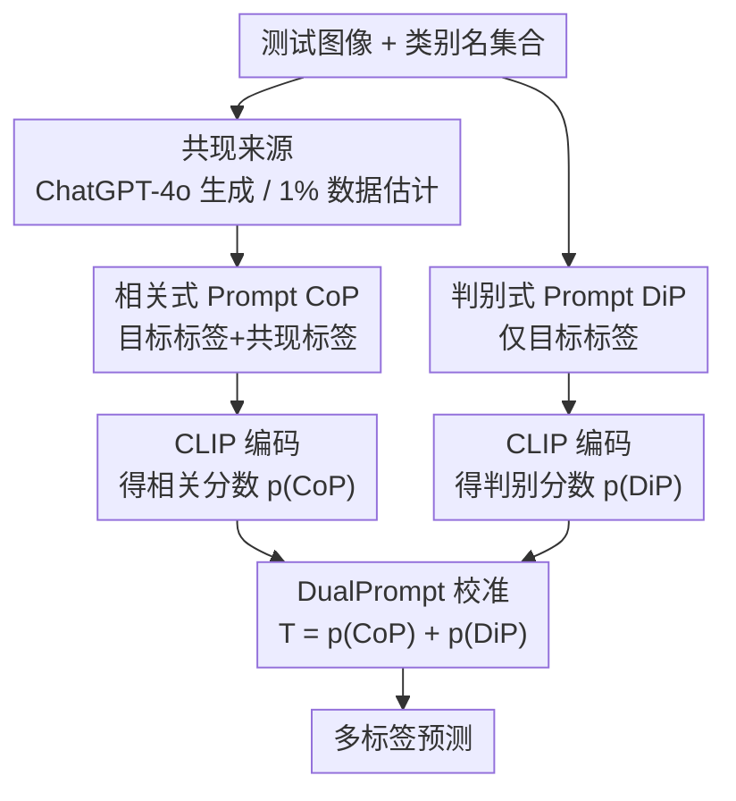

# Unlocking the Power of Co-Occurrence in CLIP: A DualPrompt-Driven Method for Training-Free Zero-Shot Multi-Label Classification

**会议**: ICLR 2026  
**OpenReview**: [https://openreview.net/forum?id=QGXVZ0OPLy](https://openreview.net/forum?id=QGXVZ0OPLy)  
**领域**: 多模态VLM  
**关键词**: CLIP、零样本多标签分类、标签共现、因果推断、Prompt 工程

## 一句话总结
本文发现把 CLIP 的判别式 prompt（只含目标标签）改写成含共现标签的"相关式 prompt"，能引入共现信息提升多标签识别，但也会让 CLIP 过拟合共现、产生物体幻觉；于是作者用因果推断把共现建模为中介变量，推导出一个无需训练的校准公式——直接把判别式与相关式两路 prompt 的预测分数相加（DualPrompt），在 MS-COCO 和 VG-256 上超过现有 SOTA。

## 研究背景与动机

**领域现状**：CLIP 通过图文对比预训练，在单标签零样本分类上表现强劲，标准做法是用"A photo of a {label}"这类模板把每个类别名扩成 prompt，再比对图像与文本特征的余弦相似度。

**现有痛点**：一旦迁移到更现实的多标签场景（一张图含多个物体），CLIP 性能显著下滑。原因有二：其一，对比目标让图像编码器只聚焦图中最显著的物体，忽略其余物体；其二，无论预训练还是推理，CLIP 都没有显式利用标签共现关系。作者在 MS-COCO 上画出 CLIP 预测的共现概率矩阵与真实共现矩阵，二者差距明显——说明 vanilla CLIP 压根没法准确建模标签间的共现先验，导致漏标、掉点。

**核心矛盾**：多标签分类早被证明高度依赖标签共现（co-occurrence）来压缩输出空间、补回缺失标签，但 CLIP 的判别式 prompt 只盯单个目标标签，天然不带任何共现信号。已有工作 TagCLIP 试图从 ViT 的 patch 局部特征下手补救显著性偏置，却重度依赖 ViT 结构、无法迁移到 ResNet 等 backbone，通用性差。

**本文目标**：在不训练、不改 backbone 的前提下，回答一个问题——CLIP 到底需不需要、又该如何用上标签共现？并把"如何在引入共现的同时不被共现带偏"拆成可操作的子问题。

**切入角度**：与以往"增强图像特征"的路线不同，作者从**改写 prompt** 这个极轻量的角度切入：把"A photo of a {label}"改成"A photo of a {label} often contains a {co-label1}, ..."，用文本侧直接把共现喂进 CLIP。一个有意思的发现是这个改动同时有好有坏——好处是激活了相关模式、能认出不显著的物体；坏处是 CLIP 会过拟合共现，目标物体不在图里、但其共现物体在，它也会高概率误报，产生物体幻觉。

**核心 idea**：用因果推断把"共现"建模为中介变量，**保留共现的正面直接效应、剔除其负面中介效应**；推导后惊人地简化为"把相关式 prompt 与判别式 prompt 的预测分数相加"这一行公式，全程无需训练。

## 方法详解

### 整体框架

DualPrompt 是一套纯推理期（training-free）的零样本多标签分类策略。对每个测试图像，它并行走两条 prompt 通路：一条是只含目标标签的**判别式 prompt（DiP）**，强调目标物体本身的判别响应；另一条是把目标标签和它的若干共现标签拼在一起的**相关式 prompt（CoP）**，借共现模式补回 CLIP 容易漏掉的物体。两条通路各自与图像特征算余弦相似度得到分数，最后相加作为该类的最终预测——这个"相加"不是拍脑袋的集成，而是从"共现作为中介"的因果图中严格推导出来的校准公式。共现标签集本身则由一个独立的来源模块（ChatGPT-4o 生成 或 用极少量训练数据估计共现概率）提供。

### 关键设计

**1. 相关式 Prompt（CoP）：用一句改写把共现信息塞进 CLIP**

针对"CLIP 推理时完全不带共现信号"这个痛点，作者不去碰图像特征，而是直接改写文本侧 prompt。对每个标签 $y_k$，假设它有一组共现标签 $C_k=\{label_j\}_{j=1}^{m_k}$，就把模板改写成"A photo of a {label$_k$} often contains a {label$_1$}, ..., a {label$_{m_k}$}"，称为相关式 prompt $P^c_k$，而原始只含目标标签的叫判别式 prompt $P^d_k$。这个改动极轻量，却真的把共现喂进了模型：实验（Figure 2）显示 CoP 相比 DiP 在不少类别上 AP 大涨，因为它通过共现模式帮 CLIP 认出了原本不显著、会被漏掉的物体。但作者也诚实指出其副作用——当目标物体不在图里、它的共现物体却在时，CoP 仍会被共现标签激活、给出高概率，从而误报，即物体幻觉。CoP 因此是一把双刃剑，需要后续校准。

**2. 因果视角下的共现中介：把好效应留住、坏效应剔掉**

为了从理论上解释 CoP 的好坏两面，作者构建因果图：相关式 prompt $P^c$ 含目标标签 $L^t$ 和共现标签 $L^c$，它们分别激活判别特征 $F^d$ 和相关特征 $F^c$，再共同决定预测 $Y$。相比 DiP 只有单条路径 $L^t\to F^d\to Y$，CoP 多了一条 $(L^t,L^c)\to F^c\to Y$——这条路在目标物体显著性不足时仍能补上预测（正面效应）；但当目标物体缺席时，$L^t\to F^d\to Y$ 断开、$L^c\to F^c\to Y$ 却被共现物体接通，于是产生幻觉（负面效应）。作者据此把共现当作**中介变量**，目标是保留直接效应、消除经由共现的有偏中介效应。

**3. 从 TDE 减法到 DualPrompt 加法：一行可落地的校准公式**

顺着因果框架，作者用总直接效应（Total Direct Effect, TDE）来去偏。最初的形式是减法：

$$T_k(x) = p(y_k=1\mid x, L^t_k, L^c_k) - p(y_k=1\mid x, L^c_k)$$

第一项是目标标签+共现标签的正面效应，第二项是仅凭共现标签做出的预测（负面效应），相减即"留正去负"。但实测这个减法几乎不 work——因为 CLIP 常高估 $p(y_k=1\mid x, L^c_k)$（尤其当 $L^c$ 里出现 CLIP 偏爱的标签时），减过头导致低估、掉点。作者于是推导出一个等价的**加法**形式（推导见原文附录 A）：

$$T_k(x) = p(y_k=1\mid x, P^c_k) + p(y_k=1\mid x, P^d_k)$$

直觉解释是"削弱间接效应等价于增强直接效应"：第二项是判别式 prompt 给出的直接因果效应，加号意味着强化目标物体的判别响应。最终方法就这么简单——把相关式与判别式两路 prompt 的预测分数相加，无需任何训练或微调，这正是 DualPrompt 名字的由来。

**4. 共现标签从哪来：通用知识 vs 数据集先验**

CoP 的前提是要拿到每个目标标签的共现标签集。作者给两条路：其一，问 ChatGPT-4o 生成至多 $l$ 个常与目标物体同框的标签——但 ChatGPT 给的共现并不全对，$l$ 太大会引入无关标签、误导模型，所以作者把 $l$ 压到只取 2；其二，标注极少量训练数据（如 MS-COCO 的 1%）来估计共现概率，再按概率取最常共现的标签。作者强调这种"通用性 vs 特异性"的权衡：ChatGPT 给的是描述物理世界的普适规律，而少量数据估计的是下游数据集自己的共现先验。实验表明用 1% 数据估计共现优于 ChatGPT，且这点数据量根本不足以微调 CLIP——侧面说明 DualPrompt 的数据效率远高于 prompt tuning 类方法。

## 实验关键数据

### 主实验

在 MS-COCO（80 类、平均 2.9 标签/图）和 VG-256（256 类）两个基准上，与训练类方法（DualCoOp、TaICLIP）和免训练方法（CLIP、TagCLIP）对比，指标为 mAP 与 F1。

| 数据集 | 方法 / Backbone | 训练数据 | mAP | F1 |
|--------|------|------|------|------|
| MS-COCO | CLIP (RN-101) | None | 62.9 | 59.8 |
| MS-COCO | DualPrompt (RN-101) | None | **65.5** | **61.7** |
| MS-COCO | DualPrompt (RN-101) | 1% 估共现 | **67.1** | **63.0** |
| MS-COCO | CLIP (ViT-B/16) | None | 64.9 | 61.5 |
| MS-COCO | DualPrompt (ViT-B/16) | None | **67.7** | **63.6** |
| MS-COCO | DualPrompt (ViT-B/16) | 1% 估共现 | **69.4** | **65.0** |
| MS-COCO | TagCLIP (ViT-B/16) | None | 68.7 | 65.2 |
| MS-COCO | DualPrompt + TagCLIP | 1% 估共现 | **70.0** | **66.1** |
| VG-256 | CLIP (RN-101) | None | 29.2 | 32.2 |
| VG-256 | DualPrompt (RN-101) | None | **33.5** | **36.1** |
| VG-256 | DualPrompt + TagCLIP | 2% 估共现 | **40.7** | **42.7** |

DualPrompt 在免训练设定下全面超过 vanilla CLIP，且 ResNet 与 ViT 两种 backbone 都涨，证明其不依赖特定结构；与 TagCLIP 正交叠加还能进一步刷到 SOTA。

### 消融实验

逐步对比 DiP → CoP → DualPrompt 的逐类 AP（MS-COCO）：

| 配置 | 表现 | 说明 |
|------|---------|------|
| DiP（判别式） | 基线 | 仅目标标签，无共现 |
| CoP（相关式） | 部分类涨、部分类跌，整体劣于 DiP | 引入共现但过拟合共现、误报增多 |
| DualPrompt | 几乎所有类都涨 | TDE 加法校准，留正去负 |

### 关键发现

- **CoP 单独用反而整体掉点**：它在某些类靠共现补回真阳性，却在更多类因过拟合共现制造假阳性，净效应为负——这正是需要校准的根因。
- **减法形式失效、加法形式才有效**：直接减去仅共现项会因 CLIP 高估该项而过度低估；等价转成"判别式+相关式相加"后才稳定提升，是本文最关键的工程洞察。
- **数据极省**：DualPrompt 只用 1%-2% 数据估共现概率，这点量不足以微调 CLIP；随训练数据增多，TaI 等微调方法才逐渐反超，说明 DualPrompt 在极低资源区间优势最大。
- **共现估计更准**：在 kitchenware 六类（bottle/cup/fork/knife/spoon/bowl）上，DualPrompt 估计的共现概率比 DiP、CoP 都更接近真实共现矩阵。

## 亮点与洞察
- **把"prompt 改写"上升到因果校准**：不是简单做 prompt ensemble，而是把共现显式建模为中介变量，从 TDE 推出"两路分数相加"，给了一个看似平凡的操作以严格的因果解释——是什么、为什么有效都讲清了。
- **减法→加法的等价变换是点睛之笔**：直接照搬因果去偏的减法公式会失败，作者发现并证明等价加法形式，既绕开 CLIP 高估副作用、又把方法压缩成一行，免训练、可即插即用。
- **诚实地展示双刃剑**：论文没有藏 CoP 的负面效应，而是用 Figure 2 的真/假阳性统计把"好处来自补回不显著物体、坏处来自共现幻觉"量化讲透，这种"先暴露问题再解决"的叙事可迁移到其他 prompt 工程研究。
- **与 TagCLIP 正交**：本文从文本侧（共现）发力，TagCLIP 从图像侧（patch 局部特征）发力，二者叠加即涨，说明两类多标签瓶颈可分别独立缓解。

## 局限与展望
- **依赖共现标签的质量**：ChatGPT 生成的共现不全对，$l$ 稍大就掉点，被迫压到 2；数据估计虽更好但仍需标注少量数据，纯零先验场景下共现来源是瓶颈。
- **共现是静态的、非图像自适应**：方法用的是数据集级或通用级共现，没有针对单张图像动态调整，遇到反常组合（罕见共现）可能仍会幻觉。
- **校准是固定等权相加**：两路分数直接相加、无可调权重，不同数据集/类别下最优正负权衡未必一致，引入可学习或自适应权重或可进一步提升。
- **评测仅限 MS-COCO / VG-256 两个基准**：更长尾、更大类别空间（如 OpenImages）下共现先验是否还稳定有待验证。

## 相关工作与启发
- **vs TagCLIP**：TagCLIP 改用 ViT patch 局部特征解决"只认显著物体"，但重度依赖 ViT、无法用于 ResNet；本文从共现这一被忽视的维度入手，backbone 无关，且能与 TagCLIP 叠加。
- **vs DualCoOp / TaI（prompt tuning）**：它们用下游数据微调连续 prompt 向量，需要可观的训练数据与训练成本；DualPrompt 完全免训练，仅用 1%-2% 数据估共现，低资源区间优势明显。
- **vs 传统多标签共现建模（CNN-RNN / SST / SCPNet）**：以往工作在监督训练里显式学共现矩阵或用文本相似度近似共现；本文把共现以自然语言 prompt 注入冻结 CLIP，并用因果框架处理其副作用，是零样本无训练范式下对共现的全新利用方式。

## 评分
- 新颖性: ⭐⭐⭐⭐⭐ 用因果中介视角重新解释 prompt 改写，并推出免训练的加法校准，角度新颖
- 实验充分度: ⭐⭐⭐⭐ 两数据集、两 backbone、逐类 AP 与共现矩阵可视化齐全，但基准数量偏少
- 写作质量: ⭐⭐⭐⭐⭐ 先抛问题、暴露 CoP 双刃剑、再用因果给解法，逻辑递进清晰
- 价值: ⭐⭐⭐⭐⭐ 即插即用、backbone 无关、可与 SOTA 叠加，工程落地价值高

<!-- RELATED:START -->

## 相关论文

- [\[ICLR 2026\] Memory-Free Continual Learning with Null Space Adaptation for Zero-Shot Vision-Language Models](memory-free_continual_learning_with_null_space_adaptation_for_zero-shot_vision-l.md)
- [\[CVPR 2026\] Explaining CLIP Zero-shot Predictions Through Concepts](../../CVPR2026/multimodal_vlm/explaining_clip_zero-shot_predictions_through_concepts.md)
- [\[CVPR 2026\] SOTA: Self-adaptive Optimal Transport for Zero-Shot Classification with Multiple Foundation Models](../../CVPR2026/multimodal_vlm/sota_self-adaptive_optimal_transport_for_zero-shot_classification_with_multiple_.md)
- [\[CVPR 2026\] STiTch: Semantic Transition and Transportation in Collaboration for Training-Free Zero-Shot Composed Image Retrieval](../../CVPR2026/multimodal_vlm/stitch_semantic_transition_and_transportation_in_collaboration_for_training-free.md)
- [\[ICCV 2025\] NegRefine: Refining Negative Label-Based Zero-Shot OOD Detection](../../ICCV2025/multimodal_vlm/negrefine_refining_negative_label-based_zero-shot_ood_detection.md)

<!-- RELATED:END -->
