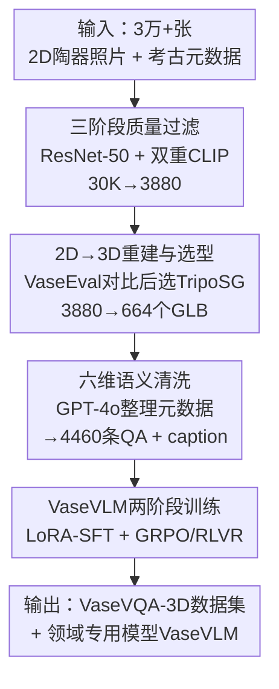

# VaseVQA-3D: Benchmarking 3D VLMs on Ancient Greek Pottery

**会议**: ICLR 2026  
**OpenReview**: [https://openreview.net/forum?id=LcgzZZ921O](https://openreview.net/forum?id=LcgzZZ921O)  
**代码**: https://github.com/AIGeeksGroup/VaseVQA-3D  
**领域**: 多模态VLM / 3D视觉 / 数字文化遗产  
**关键词**: 3D VQA、古希腊陶器、文化遗产、可验证奖励、领域自适应

## 一句话总结
本文构建了首个面向古希腊陶器的 3D 视觉问答数据集 VaseVQA-3D（664 个 3D 陶器模型 + 4460 条问答），并基于一条「2D 图像过滤 → 单图 3D 重建 → 六维考古语义清洗」的合成管线，训练出领域专用模型 VaseVLM，其 7B-RL 版本在 R@1 上相对最强基线提升 12.8%、词汇相似度提升 6.6%。

## 研究背景与动机

**领域现状**：通用视觉-语言模型（VLM，如 GPT-4V、Gemini、Qwen2.5-VL、InternVL）在图像描述、视觉推理等通用任务上表现亮眼；3D 方向也出现了 Cap3D、DiffuRank、LLaVA-3D 等专门做 3D 描述与问答的方法。

**现有痛点**：一旦进入古希腊陶器这种专业文化遗产领域，现有模型立刻露怯。一方面，古陶器是典型的长尾数据，公开数据集里几乎没有它们的高质量 3D 表示；另一方面，由于缺乏针对性训练数据，没有任何现成 VLM 能胜任这种需要考古专业知识的任务（陶器的胎质、制陶技法、器型、断代、纹饰、归属画师都不是靠常识能答的）。

**核心矛盾**：陶器的考古价值恰恰落在空间特征上——对称性、比例、形态、完整几何结构，这些是碎片化的 2D 视图无法完整刻画的；但现实中能拿到的高质量素材又主要是 2D 馆藏照片，且充斥着碎片、模糊图、素描。也就是说，「3D 理解的必要性」和「只有脏 2D 数据可用」之间存在张力。

**本文目标**：(1) 把脏的 2D 陶器图像系统性地转成高保真 3D 资产并配上考古问答，填补 3D 文化遗产 benchmark 的空白；(2) 训练一个真正懂陶器的领域专用 VLM。

**切入角度**：既然单图 2D-to-3D 重建技术（TripoSG、Hunyuan3D）已经成熟，就可以把海量 2D 馆藏照片「升维」成 3D 模型，再渲染成多视角/旋转视频喂给 VLM；同时陶器的标注天然分解成六个考古维度，这正好可以当作强化学习里的「可验证答案」。

**核心 idea**：用「严格过滤 + 单图 3D 重建 + 六维考古语义结构化」造出 3D 陶器 VQA 数据，再用「LoRA-SFT 打底 + GRPO/RLVR 六维可验证奖励」把通用 VLM 调成陶器专家。

## 方法详解

### 整体框架

整篇工作其实是一条端到端的「2D 脏数据 → 3D 专用 VQA 模型」流水线。输入是 VaseVQA 提供的 3 万多张古希腊陶器 2D 照片及其考古元数据，输出是 (a) 数据集 VaseVQA-3D（664 个 GLB 3D 模型 + 4460 条结构化问答 + 清洗后的描述 caption），以及 (b) 在其上训练的领域模型 VaseVLM。

整条流水线分四个动作：先用 ResNet-50 + 双重 CLIP 把 3 万张图过滤到 3880 张高质量图；再用 TripoSG 把这些 2D 图逐张重建成 664 个 3D 模型（选型前先用 24 个真实 GLB 组成的 VaseEval 验证集，对比 TripoSG 与 Hunyuan3D 后选定 TripoSG）；接着用 GPT-4o 把原始零碎的考古元数据清洗成连贯的博物馆式描述，并组织成围绕六个考古维度（胎质 Fabric、技法 Technique、器型 Shape、断代 Dating、纹饰 Decoration、归属 Attribution）的问答；最后把 GLB 渲染成 360° 旋转视频，用 LoRA-SFT + GRPO-RLVR 两阶段训练出 VaseVLM。

### 关键设计

**1. 三阶段渐进式质量过滤：把脏 2D 数据筛成可重建的素材**

原始 VaseVQA 数据集虽有 3 万多张图，却混杂着大量陶器碎片、模糊图甚至素描，直接拿去做 3D 重建会得到一堆垃圾模型。作者设计了一条三级递进过滤管线：第一级训练一个 ResNet-50 二分类器（基于人工标注「什么是好图」）做初筛，把低质量图直接剔除；第二级用 CLIP 做碎片检测——预设「完整陶器」与「陶器碎片」两类文本提示，比较图像与两类描述的相似度差异，二分类地剔掉碎片；第三级针对同一陶器存在多视角的问题，用 CLIP 计算每个视角图与高质量描述文本的相似度，只保留得分最高的那张作为代表视图。三级过滤后从 3 万张收敛到 3880 张高质量图（再经 3D 生成进一步落到 664），整体保留率约 2.2%，可见过滤之严格。这一步是后续所有环节质量的地基。

**2. 单图 3D 重建 + VaseEval 验证集选型：把 2D 升维成可信的 3D 资产**

光有干净 2D 图还不够，必须把它们变成 3D。作者面对 TripoSG 和 Hunyuan3D 两个当下领先的单图 2D-to-3D 方法，没有拍脑袋选，而是先专门从 Sketchfab 数字博物馆收集了 24 个高质量真实陶器 GLB 文件组成 VaseEval 验证集作为 ground truth。在 VaseEval 上对两种方法做定量对比（PSNR、SSIM、LPIPS、Chamfer Distance、Normal Consistency、CLIP-I/T），结论是 TripoSG 的网格质量更好、更贴近真值（虽然 Hunyuan3D 在纹理贴图上略有优势），于是选定 TripoSG 对 3880 张图做大规模重建，得到 664 个高保真 GLB 模型。VaseEval 的价值在于：它把「生成方法该选哪个」从主观判断变成了有真值依据的可量化决策。

**3. 六维考古语义结构 + GPT-4o 元数据清洗：让问答真正考「考古知识」**

陶器问答如果只问「这是什么颜色」就毫无专业价值。作者把每件陶器的标注组织成六个考古语义维度——胎质、技法、器型、断代、纹饰、归属画师，问答统一采用「What is the [attribute] of the vase?」的标准化格式，答案全部来自经核验的考古元数据，保证学术可靠与评测公平。但原始元数据往往是 `Fabric: ATHENIAN; Technique: BLACK-FIGURE; ...` 这种零碎带噪的结构化片段，作者用 GPT-4o 把它们整理成连贯的博物馆式描述（如「Athenian black-figure lekythos, c. 525–475 BCE」），关键是**只做清洗去噪、不引入新的考古内容**，从而在提升可读性的同时不破坏事实。最终每个 GLB 模型都配齐了结构化问答 + 清洗后的描述 caption。这个六维结构不仅定义了评测维度，也直接成为下一步强化学习奖励的拆解依据。

**4. VaseVLM 两阶段训练：LoRA-SFT 打底 + GRPO/RLVR 六维可验证奖励**

以 Qwen2.5-VL（3B/7B）为基座，VaseVLM 先做 LoRA 监督微调——训练输入是 GLB 渲染出的 360° 旋转视频 + 富含考古信息但表达简洁的 caption，建立陶器分析的基础能力；随后用 GRPO 做强化学习进一步优化。RLVR（可验证奖励强化学习）在这里特别自然：ground truth caption 本身就完整覆盖六个维度，rollout 阶段模型生成的描述可以逐维与标准答案核验，就像数学题对标准解。每个维度的奖励为

$$r_i = \begin{cases} \mathrm{sim}(g_i, t_i), & \text{if } \mathrm{sim}(g_i, t_i) \geq \tau \\ 0, & \text{otherwise} \end{cases}$$

其中 $g_i$、$t_i$ 是该维度的生成内容与目标内容，$\mathrm{sim}(\cdot,\cdot)$ 为余弦相似度，阈值 $\tau = 0.7$。六维带不同权重（胎质 $w_f{=}0.20$、技法 $w_t{=}0.20$、纹饰 $w_{dec}{=}0.20$、器型 $w_s{=}0.15$、断代 $w_d{=}0.15$、归属 $w_a{=}0.10$）。此外引入质量控制惩罚项 $P = \alpha_l P_{length} + \alpha_r P_{repetition} + \alpha_i P_{irrelevant}$（分别罚不当长度、重复措辞、无关内容，权重 $\alpha_l{=}0.1,\alpha_r{=}0.1,\alpha_i{=}0.15$）。最终奖励为

$$R = \sum_{i=1}^{6} w_i \cdot r_i - P + B,$$

其中 $B$ 是基于序列匹配的相似度奖励项，整体奖励被约束到单位区间 $[0,1]$ 以保证策略优化的训练稳定性。这套设计的巧妙在于：把「描述好不好」从模糊的人评，拆成了六个可逐项验证、可加权、可惩罚的客观信号。

### 损失函数 / 训练策略
两阶段：① LoRA-based SFT，输入 360° 旋转视频 + caption，建立基础；② GRPO 强化学习，奖励即上面的六维 RLVR 函数。基座为 Qwen2.5-VL-3B/7B。全流程在 8× A100（80GB）上约 14.5 天（单卡折算），其中 3D 生成 13.5 天、SFT 4 小时、RL 训练 20 小时。

## 实验关键数据

### 主实验：数据集质量评测（部分模型，Table 3）

| 方法 | FID↓ | CLIP↑ | R@10↑ | R@5↑ | R@1↑ | 词汇相似↑ |
|------|------|-------|-------|------|------|-----------|
| DiffuRank（3D 专用） | 0.421 | 0.798 | 16.67% | 8.33% | 2.08% | 0.274 |
| Gemini-2.5-Pro（闭源） | 0.397 | 0.680 | 22.92% | 14.58% | 3.12% | 0.162 |
| GPT-4.1（闭源） | 0.501 | 0.644 | 25.00% | 10.42% | 3.12% | 0.128 |
| Qwen2.5-VL-7B（开源基座） | 0.334 | 0.775 | 18.75% | 9.38% | 2.08% | 0.217 |
| VaseVLM-7B-SFT（本文） | 0.332 | 0.779 | 20.83% | 10.42% | 3.12% | 0.272 |
| **VaseVLM-7B-RL（本文）** | **0.328** | **0.792** | **21.24%** | **11.12%** | **3.52%** | **0.276** |

VaseVLM-7B-RL 在 R@1 上相对最强基线提升约 12.8%（3.52% vs 3.12%，相对值），词汇相似度提升约 6.6%（0.276 vs 0.259，相对值），并在 FID 上取得最低 0.328。

### 数据过滤与 3D 生成选型（Table 1 / Table 2）

| 过滤阶段 | 输入 | 输出 | 保留率 |
|----------|------|------|--------|
| 初始采集 | 30,000 | 30,000 | 100% |
| ResNet-50 质量过滤 | 30,000 | 13,599 | 45.3% |
| CLIP 碎片过滤 | 13,599 | 6,330 | 46.5% |
| CLIP 视图选择 | 6,330 | 3,880 | 61.3% |
| 3D 生成（TripoSG） | 3,880 | 664 | 17.1% |
| **整条管线** | 30,000 | 664 | **2.2%** |

3D 生成选型（24 个真值模型上）：TripoSG 的 SSIM 0.8676、LPIPS 0.1308、CD 0.1490、CLIP-I 0.8896 整体优于 Hunyuan3D（SSIM 0.8657、LPIPS 0.1319、CD 0.1515），因此选定 TripoSG。

### 人评（Table 4，10 位专家 0-5 分）
VaseVLM-7B-RL 平均 4.57 分排第 1，VaseVLM-3B-RL 4.37 分第 2，均优于 3D 专用模型 DiffuRank（4.07）与通用 VLM，验证了领域微调在「描述准确性 + 文化恰当性」上的优势。

### 关键发现
- **RL 优于 SFT**：同尺寸下 7B-RL 比 7B-SFT 在 R@1（3.52% vs 3.12%）和词汇相似（0.276 vs 0.272）上都更好，说明六维可验证奖励确实带来增益。
- **过滤极其激进但必要**：整条管线只保留 2.2% 的原始图，碎片/模糊图被大量剔除——这是 3D 重建质量的前提。
- **绝对指标仍偏低**：即便最强模型 R@1 也仅 3.52%，反映古陶器这一长尾专业领域对所有 VLM 都极具挑战，benchmark 留有充足提升空间。

## 亮点与洞察
- **「2D 升维造 3D 数据」的范式很巧**：在真实 3D 文化遗产数据稀缺时，用成熟的单图 3D 重建把海量 2D 馆藏照片转成 3D 资产，是绕开数据稀缺的实用路径，可迁移到其他只有 2D 照片的文物领域。
- **VaseEval 把生成选型变成可量化决策**：用一小批真实 GLB 当真值来选生成方法，而非主观判断，这个「小验证集驱动选型」的思路简单但靠谱。
- **六维语义既是评测轴也是奖励轴**：同一套考古维度同时服务于结构化问答评测和 RLVR 奖励拆解，设计统一、复用度高——把领域知识结构化后，可验证奖励几乎是「免费」的。

## 局限与展望
- **数据规模偏小**：最终只有 664 个 3D 模型、4460 条问答，对训练强模型而言体量有限，绝对指标低也部分源于此。
- **3D 质量受限于单图重建**：TripoSG 从单张图重建，无法还原真实陶器背面/内部等被遮挡结构，纹理也可能失真，3D「保真」是相对的。
- **GPT-4o 清洗可能引入偏差**：虽强调「只清洗不增内容」，但 LLM 重写仍有改变语义或风格的风险，作者未充分量化这一影响。
- **改进方向**：扩充真实 3D 采集、引入多视角/多图重建提升几何完整性、把六维奖励扩展到更细粒度的考古子属性。

## 相关工作与启发
- **vs Cap3D / DiffuRank / LLaVA-3D**：这些是通用 3D 描述/问答方法，本文指出它们在古陶器专业领域表现不佳（R@1 普遍 ≤2%），凸显领域专用数据与微调的必要性。
- **vs VaseVQA（2D 前作）**：本文的数据源就来自 VaseVQA 的 3 万张 2D 图与元数据，区别在于把它升维成 3D 并配套训练专用模型，从 2D 走向 3D 文化遗产理解。
- **vs 通用闭源 VLM（GPT-4.1 / Gemini-2.5-Pro / Claude）**：它们在检索类指标（R@10）上靠常识尚可，但在词汇相似度等需要考古术语精确性的指标上明显落后于经领域微调的 VaseVLM。

## 评分
- 新颖性: ⭐⭐⭐⭐ 首个 3D 古希腊陶器 VQA 数据集 + 六维 RLVR，问题与组合都新
- 实验充分度: ⭐⭐⭐⭐ 过滤/生成/数据集质量/人评多维评测，但数据规模与绝对指标偏低
- 写作质量: ⭐⭐⭐⭐ 管线讲述清晰，公式与图表完整
- 价值: ⭐⭐⭐⭐ 为数字文化遗产保护与「2D 升维」范式提供了可复用样板

<!-- RELATED:START -->

## 相关论文

- [\[ICLR 2026\] SR-3D: 3D-Aware Region Prompted Vision Language Model](3d_aware_region_prompted_vision_language_model.md)
- [\[ICLR 2026\] EgoHandICL: Egocentric 3D Hand Reconstruction with In-Context Learning](egohandicl_egocentric_3d_hand_reconstruction_with_in-context_learning.md)
- [\[ICLR 2026\] IndicVisionBench: Benchmarking Cultural and Multilingual Understanding in VLMs](indicvisionbench_benchmarking_cultural_and_multilingual_understanding_in_vlms.md)
- [\[ICLR 2026\] GPT4Scene: Understand 3D Scenes from Videos with Vision-Language Models](gpt4scene_understand_3d_scenes_from_videos_with_vision-language_models.md)
- [\[CVPR 2025\] Global-Local Tree Search in VLMs for 3D Indoor Scene Generation](../../CVPR2025/multimodal_vlm/global-local_tree_search_in_vlms_for_3d_indoor_scene_generation.md)

<!-- RELATED:END -->
