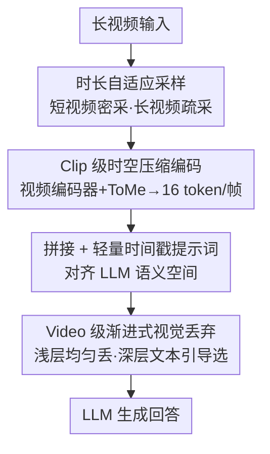

# VideoChat-Flash: Hierarchical Compression for Long-Context Video Modeling

**会议**: ICLR 2026  
**OpenReview**: [https://openreview.net/forum?id=MUjdNcfNPv](https://openreview.net/forum?id=MUjdNcfNPv)  
**代码**: https://github.com/OpenGVLab/VideoChat-Flash (有)  
**领域**: 多模态VLM / 视频理解  
**关键词**: 长视频理解, 视频 token 压缩, 多模态大模型, 层次化压缩, NIAH 评测

## 一句话总结
本文提出层次化视频 token 压缩方法 HiCo，把长视频上下文从 Clip 级到 Video 级两步压到约 $1/50$（平均每帧仅 16 token），再配上一套短到长的多阶段训练、114K 长视频的 LongVid 数据集和更难的多跳 NIAH 评测，造出 7B 量级就能在长短视频基准上同时超过 GPT-4o / Gemini-1.5-Pro 的 VideoChat-Flash，并在万帧 NIAH 上拿到 99.1% 的准确率。

## 研究背景与动机
**领域现状**：多模态大模型（MLLM）在分钟级短视频理解上已经很成熟，但要处理电影、监控、直播流这种小时级长视频，就必须把成千上万帧塞进模型。当前主流路线有两条：一是像 Gemini-1.5-Pro 那样直接把 LLM 的上下文窗口撑大，硬吃超长多模态序列；二是把视频 token 压缩成极紧凑的表示（如 LLaMA-VID 每帧压到 2 个 token）再喂给 LLM。

**现有痛点**：扩上下文窗口的代价是计算量爆炸——Gemini-1.5-Pro 把一小时视频转成约 92 万个 token，训练和推理效率被严重拖垮，落地几乎不可行；而暴力压缩 token 又会无差别地丢掉细节信息，压得越狠掉点越多，以至于一些长视频模型在某些长视频基准上甚至打不过纯图像 MLLM。

**核心矛盾**：长视频理解本质上是「效率」与「性能」的拉锯。长视频上下文里充斥着大量冗余（相邻帧背景/物体几乎不变），但现有压缩手段把帧当成相互独立的个体逐帧压，没有真正利用帧与帧之间的时序冗余，于是压缩比一上去信息损失就失控。

**本文目标**：把长视频理解这件事从模型架构、训练数据、训练策略、评测基准四个维度系统性地补齐，做到既高效又不掉点。

**切入角度**：作者观察到两类可利用的稀疏性——其一是 Clip 内部的「单模态视觉冗余」（相邻帧高度相似），可以用带时空注意力的视频编码器去聚合而非逐帧硬压；其二是 LLM 处理长视频时的「跨模态稀疏性」（浅层关注全局、深层只盯局部相关片段），可以据此在 LLM 内部进一步丢弃与当前问题无关的 token。

**核心 idea**：用「层次化压缩」（HiCo）把视频上下文分两级压——Clip 级用视频编码器吃掉帧间时序冗余，Video 级顺着 LLM 注意力规律渐进丢弃无关 token，从而在约 $1/50$ 的极端压缩比下几乎不损性能。

## 方法详解

### 整体框架
VideoChat-Flash 要解决的是「怎么把上万帧长视频高效喂进 MLLM 且不掉点」。整条推理管线是：原始长视频先经**时长自适应采样**抽出合适数量的帧；这些帧被切成等长的小 Clip，每个 Clip 送进带时空注意力的**视频编码器**做 **Clip 级压缩**（配合 ToMe token 合并），平均每帧只剩 16 个 token，再按时间顺序拼接、过一个 MLP connector 对齐到 LLM 语义空间，并在末尾追加一句轻量的时间戳提示词；进入 LLM 后，再做 **Video 级渐进式视觉丢弃**——浅层均匀丢一小批、深层按文本相关性精选保留，最后由 LLM 生成回答。这套架构（HiCo）就是图中三个核心阶段。

除了架构本身，本文另有三块同等重要的贡献支撑起最终性能：大规模长视频指令数据集 **LongVid**、**短到长（short-to-long）多阶段训练策略**，以及更难的 **Multi-Hop NIAH** 评测基准。下面的框架图描绘的是推理时的 HiCo 数据流，训练与数据相关设计在关键设计第 4 点统一交代。

### 关键设计

**1. 时长自适应采样：让长短视频各取所需**

逐帧均匀采样有个天然矛盾：短视频要看清细微动作得密采，长视频只看事件脉络宜疏采，固定帧数无法兼顾。本文设计了一个按时长 $D$ 决定采样帧数 $T$ 的策略 $T = \min(T_{max}, \max(D, T_{min}))$，并定义采样密度 $\phi(T,D) = T/D$。当 $D < T_{min}$（短视频）时 $\phi = T_{min}/D$，视频越短密度越高，保住细节；当 $D > T_{max}$（长视频）时 $\phi = T_{max}/D$，视频越长密度越低，把帧预算花在覆盖更长时间跨度上。消融显示它把 MVBench 从 66.5 抬到 67.0、MLVU 从 62.4 抬到 64.5，是一个低成本但实打实有效的输入侧调度。

**2. Clip 级时空压缩编码：用视频编码器吃掉帧间冗余**

这一步针对的是「逐帧独立压缩会丢细节」的痛点。常用图像编码器（如 SigLIP）假设帧间独立 $p(Y_1,\cdots,Y_T)=\prod_t p(Y_t)$，压缩造成的信息损失为 $L_c^{img}=\sum_t H(Y_t^{img})-H(Z)$；而视频编码器用时空注意力建模联合分布，其损失可写成

$$L_c^{vid}=\sum_{t}\big[H(Y_t^{vid})-I(Y_t^{vid};Y_1^{vid},\cdots,Y_{t-1}^{vid})\big]-H(Z),$$

其中 $I(\cdot)$ 是第 $t$ 帧与前序帧之间的互信息（即帧间冗余）。绝大多数视频满足 $I>0$，在 $H(Z)$ 与帧熵之和近似相等的前提下就有 $L_c^{img} > L_c^{vid}$——也就是说同样压到一个目标尺寸，视频编码器能少丢信息。实现上把视频切成每 4 帧一个 Clip，用 UMT-L 做时空编码、ToMe 做 token 合并，每个 Clip 压到 64 token，折合平均每帧仅 16 token。此外作者用一句极简的时间戳提示词「The video lasts for $N$ seconds, and $T$ frames are uniformly sampled from it.」附在视频上下文之后，替代了以往逐帧插文本标注的昂贵做法，却足以让模型感知时间、在 Charades-STA 时序定位上拿到不错的 mIoU。

**3. Video 级渐进式视觉丢弃：顺着 LLM 注意力规律砍 token**

Clip 级压完后，长视频里仍可能存在更长程的冗余（如监控视频），而且回答某条具体指令时也未必要时刻盯着整段视频。关键观察是：LLM 在浅层会关注整段长视频上下文，到深层则只聚焦某些局部时刻的细节。据此设计两阶段渐进丢弃——浅层做「均匀丢」（uniform drop），均匀去掉一小撮 token 以保留视频原本的时空结构、降低后续计算；深层做「文本引导选」（text-guided select），按文本 token 与视觉 token 的相关性只留最关键的相关信息。值得注意的是该策略训练时启用反而略掉点，所以只在推理阶段开启；它不仅省算力，还因为滤掉了无关视觉噪声而略微提升了理解性能。

**4. LongVid 数据集与短到长训练：补齐长视频指令数据短板**

长视频模型训练长期受限于缺乏大规模高质量的 (视频, 指令, 答案) 三元组指令数据。本文构建了 LongVid，含 114,228 条长视频（平均时长 367.3 秒）和 3,444,849 个 QA 对，覆盖长视频描述、时序定位、事件关系识别、场景关系识别、视频事件计数五类任务；构建走「数据源筛选（Ego4D / HowTo100M / HD-VILA / MiraData）→ 基于高质量短视频字幕生成带时间戳的稠密事件标签 → 用字幕+事件标签+时间戳拼出多类型 QA」三步。配套的短到长多阶段训练分四步：Stage-1 冻结视觉编码器与 LLM、只训压缩器和 MLP 做图文/视频对齐；Stage-2 用 350 万图像+250 万短视频做短视频预训练打牢视觉感知；Stage-3 把短视频（<60s）与长视频（60∼3600s）数据混合做联合指令微调，使模型既保细粒度理解又扩展到长视频；Stage-4 把视频编码器分辨率从 224 提到 448、用 25% 数据做高分辨率后微调。此外作者还提出更难的 Multi-Hop NIAH 评测，把多张图像串成一条推理链插入视频「草垛」并掺入干扰错链，模型须沿正确链找到 needle（Q1）再回答相关问题（Q2），从而区分出真正的多跳推理能力而非单纯检索。

### 损失函数 / 训练策略
训练即上文四阶段的短到长课程式学习：先对齐、再短视频预训练、然后短长联合指令微调、最后高分辨率后微调；Clip 内每 4 帧成一组、压到 64 token，Video 级丢弃只在推理时启用。

## 实验关键数据

### 主实验
视觉编码器用 UMT-L、connector 用带 MLP 的 token merging、LLM 用 Qwen2-7B。在六大视频理解基准上，7B 的 VideoChat-Flash 平均每帧只用 16 token 却全面领先，甚至超过参数量大得多的 InternVL2-76B 以及闭源的 GPT-4o、Gemini-1.5-Pro。

| 模型 | 规模 | token/帧 | MVBench | LongVideoBench | MLVU | VideoMME(Overall) | Charades mIoU |
|------|------|---------|---------|----------------|------|-------------------|---------------|
| GPT-4o | - | - | 64.6 | 66.7 | 64.6 | 71.9 | - |
| Gemini-1.5-Pro | - | - | 60.5 | 64.0 | - | 75.0 | - |
| LLaVA-Video | 7B | 676 | 58.6 | 58.2 | 70.8 | 63.3 | - |
| Qwen2.5-VL | 7B | 1924 | 69.6 | 56.0 | 70.2 | 65.1 | 43.6 |
| **VideoChat-Flash@448** | 7B | **16** | **74.0** | **64.7** | **74.7** | **65.3** | 48.0 |
| **VideoChat-Flash@448** | 2B | **16** | 70.0 | 58.3 | 65.7 | 57.0 | 45.2 |

在万帧单跳 NIAH 上 VideoChat-Flash 拿到 99.1% 的检索+问答成功率，而 LongVA 在 3000 帧约 92%、LLaMA-VID 在万帧仅 55%。在更难的多跳 MH-NIAH（1000 帧、约 266k token）上：

| 模型 | token/帧 | Cap Score | QA Score |
|------|---------|-----------|----------|
| 随机 | - | 25% | 6.25% |
| LLaMA-VID | 2 | 20% | 7% |
| LongVA | 144 | 25% | 18% |
| **VideoChat-Flash** | 16 | **33%** | **27%** |
| Gemini2.5 Flash | 258 | 35% | 31% |
| Gemini2.5 Flash (thinking) | 258 | 60% | 54% |

### 消融实验
各设计逐项叠加的消融（部分基准）：

| 配置 | MVBench | MLVU | VideoMME | Charades mIoU |
|------|---------|------|----------|---------------|
| Baseline (SigLIP, 196 token/帧) | 60.2 | 63.7 | 52.8 | - |
| + HiCo (压到 16 token/帧) | 61.1 | 60.6 | 53.2 | - |
| + 短视频预训练 | 66.5 | 62.4 | 53.9 | - |
| + 时长自适应采样 | 67.0 | 64.5 | 55.5 | - |
| + LongVid 数据 | 66.5 | 68.3 | 55.8 | - |
| + 短长联合 SFT | 73.2 | 74.5 | 64.0 | 48.4 |
| + 高分辨率后微调 | 74.0 | 74.7 | 65.3 | 48.0 |
| – 时间戳提示词 | 73.4 | 73.2 | 63.4 | 44.2 |

### 关键发现
- **压缩比可以激进**：把每帧从 196 token 压到 16 token（HiCo），计算量随帧数增长能省到 47.3×（万帧时达 119×），而性能几乎不掉；即便压到极端的 2%，模型仍能保留约 95% 性能，短/长视频任务在合适压缩下甚至略有提升——说明冗余被吃掉、噪声被滤掉。
- **视频编码器 > 图像编码器**：同样压到 16 token/帧、训练数据从 2M 增到 8M 时，UMT-L 在 MVBench/MLVU/VideoMME 上分别比 SigLIP 高出 +2.3/+2.9/+0.3，且 FLOPs（596G vs 2679G）和延迟（11.8ms vs 79.7ms）都低一个量级，验证了时空注意力聚合更紧凑特征的价值。
- **丢弃要分层**：浅层均匀丢、深层文本引导选才是最优组合——深层用 attention select（MLVU +0.3、VideoMME +0.5）优于均匀丢，浅层则相反，印证了「浅层看全局、深层看局部」的注意力规律。
- **时间戳提示词廉价好用**：去掉后 Charades mIoU 从 48.0 掉到 44.2，一句话提示就能撑起时序定位能力。
- **性能大跃迁主要来自数据与训练**：短到长学习与更好的数据混合（短长联合 SFT 那一行）带来了最大的单步提升。

## 亮点与洞察
- **用「视频编码器的时序建模」替代「逐帧硬压」**：从条件熵/互信息角度给出 $L_c^{img}>L_c^{vid}$ 的直觉，把「为什么视频编码器压得更省信息」讲成了可证明的事，而非拍脑袋，这个分析框架可迁移到任何要做时序冗余压缩的模态。
- **顺着 LLM 自己的注意力规律做压缩**：先观察到浅层全局/深层局部的现象，再据此设计浅层均匀丢、深层文本选，把「无关视觉噪声」当成可去除项——既省算力又涨点，且只在推理开启，是个零训练成本的免费午餐。
- **MH-NIAH 把检索和推理解耦**：通过插入干扰错链、强制模型沿链多跳，戳破了「单跳 NIAH 人人 99%」的虚高，连 Gemini2.5 Flash 不开 thinking 都只比本文略高、开了 thinking 才大幅领先，证明这个基准真在考多跳视频推理。

## 局限与展望
- Video 级丢弃在训练时启用会掉点，只能放到推理阶段，意味着训练与推理的 token 分布并不完全一致，长程冗余在训练时仍被全量喂入，存在训练效率与一致性的折中。
- 多跳推理仍是短板：MH-NIAH 上 QA Score 仅 27%，与开启 thinking 的 Gemini2.5 Flash（54%）差距明显，说明在压缩高效的同时，复杂长程推理能力还远未饱和。
- 时间戳能力依赖一句固定模板提示词，对更细粒度、多事件密集时序的场景是否够用、是否会在极长视频下失效，论文未充分探究。
- 压缩比与任务难度的关系给的是经验曲线（2% 仍保 95%），但对需要精细像素级证据的任务（如细粒度计数、OCR 密集场景）激进压缩的上限在哪，缺少针对性分析。

## 相关工作与启发
- **vs Gemini-1.5-Pro（扩上下文窗口）**: 它把一小时视频转成约 92 万 token 硬吃，靠系统/硬件撑住超长上下文；本文反其道用层次化压缩把每帧压到 16 token，效率高一个量级，7B 即可在多基准上反超它，代价是放弃了「不压缩、最大化保真」的上限。
- **vs LLaMA-VID（极致 token 压缩）**: 它每帧压到 2 token、逐帧独立处理，压缩比虽高但细节损失严重，万帧 NIAH 仅 55%；本文用视频编码器利用帧间互信息，在 16 token/帧下仍保细节、万帧 NIAH 达 99.1%，说明「怎么压」比「压多狠」更关键。
- **vs LongVA（文本上下文迁移到视频）**: LongVA 用长文本扩 LLM 上下文再迁到视频；本文主张直接在长视频上训练以缩小训练-测试鸿沟，并把 LongVA 与 LLaMA-VID 都当作受益来源与对照基线。

## 评分
- 新颖性: ⭐⭐⭐⭐ 层次化两级压缩 + 基于 LLM 注意力规律的渐进丢弃，思路清晰且有信息论支撑，但单点技术多为已有组件（ToMe/UMT）的巧妙组合
- 实验充分度: ⭐⭐⭐⭐⭐ 覆盖 8 个基准、2B/7B 两档、逐项叠加消融、压缩比/编码器/丢弃/采样多维分析，还自建更难评测
- 写作质量: ⭐⭐⭐⭐ 四维度（架构/数据/训练/评测）组织清晰，压缩损失的熵分析是亮点，个别实现细节下放到附录
- 价值: ⭐⭐⭐⭐⭐ 开源、效率-性能双优，万帧 99.1% NIAH 与超越 GPT-4o/Gemini 的结果对长视频 MLLM 落地有很强实用价值

<!-- RELATED:START -->

## 相关论文

- [\[CVPR 2026\] MSJoE: Jointly Evolving MLLM and Sampler for Efficient Long-Form Video Understanding](../../CVPR2026/multimodal_vlm/msjoe_jointly_evolving_mllm_and_sampler_for_efficient_long-form_video_understand.md)
- [\[CVPR 2025\] Video-XL: Extra-Long Vision Language Model for Hour-Scale Video Understanding](../../CVPR2025/multimodal_vlm/video-xl_extra-long_vision_language_model_for_hour-scale_video_understanding.md)
- [\[CVPR 2026\] Scaling the Long Video Understanding of Multimodal Large Language Models via Visual Memory Mechanism](../../CVPR2026/multimodal_vlm/scaling_the_long_video_understanding_of_multimodal_large_language_models_via_vis.md)
- [\[CVPR 2026\] ReMoRa: Multimodal Large Language Model based on Refined Motion Representation for Long-Video Understanding](../../CVPR2026/multimodal_vlm/remora_multimodal_large_language_model_based_on_refined_motion_representation_fo.md)
- [\[ICLR 2026\] When MLLMs Meet Compression Distortion: A Coding Paradigm Tailored to MLLMs](when_mllms_meet_compression_distortion_a_coding_paradigm_tailored_to_mllms.md)

<!-- RELATED:END -->
