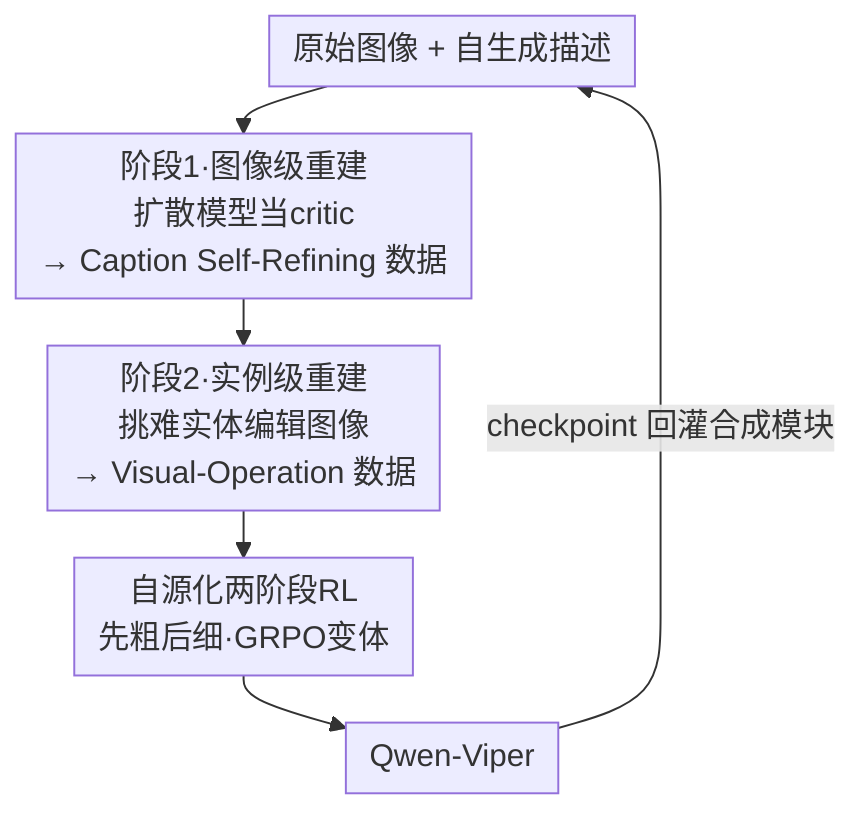

# ViPER: Empowering the Self-Evolution of Visual Perception Abilities in Vision-Language Models

**会议**: ICLR 2026  
**OpenReview**: [https://openreview.net/forum?id=uxea0QCT0e](https://openreview.net/forum?id=uxea0QCT0e)  
**代码**: https://github.com/Icarus1216/ViPER  
**领域**: 多模态VLM  
**关键词**: 视觉感知, 自进化, 强化微调, 数据合成, 闭环训练

## 一句话总结
ViPER 把"提升 VLM 细粒度视觉感知"重构成一个由粗到细的两阶段任务，并用一个"模型自己造数据、自己学"的闭环框架——靠扩散模型把文字描述还原成图像来给 VLM 当 critic、再配两阶段强化学习——在不依赖外部蒸馏和冷启动的前提下，让 Qwen2.5-VL 自我进化出更强的感知力（细粒度感知最高 +6.0%）。

## 研究背景与动机
**领域现状**：VLM 由视觉编码器 + 语言主干拼成，整体表现取决于两者协同。近期受 o1 / DeepSeek-R1 的"慢思考"启发，多模态领域也在堆推理链（CoT），希望靠语言端的强推理拉高视觉任务表现。

**现有痛点**：对很多视觉-语言任务、尤其是依赖细粒度感知的任务，光靠语言主干的推理力撑不起来——表现真正卡在"看不清"而非"想不明白"。但现有提升路线各有硬伤：① 监督微调（SFT）靠从更强模型蒸馏数据来 scale，合成成本高、大规模蒸馏还会牺牲泛化，是不可持续的 trade-off；② 强化学习走"thinking-with-image"路线、靠多轮调用视觉工具，引入大量延迟，而且推理常常浮于"操作工具"而非"真看懂图像"，下游任务的底层感知力并没被真正提升。

**核心矛盾**：只在视觉端或只在语言端孤立做后训练，收益都很微弱——视觉理解和语言推理是相互依存、需要共同进化的，而现有方法要么割裂二者，要么用外部监督把感知能力"喂"进来而非"长"出来。

**本文目标**：在不依赖外部强模型蒸馏、不依赖多轮工具、不依赖高质量冷启动数据的前提下，让 VLM 自己驱动感知能力的进化，并且这种进化要真正落到底层感知、同时不损害通用能力。

**切入角度**：作者抓住一个观察——生成与理解是互逆互促的。如果让模型把自己对图像的文字理解，经由生成模型"还原"回一张图像，那么还原图与原图之间的差异，就是模型理解里漏掉/错掉的部分的可视化证据。这等于给 VLM 装了一面"镜子"，让它看到自己描述的视觉后果，从而自我批判、自我修正。

**核心 idea**：把感知学习组织成"先看广、再看准"的两阶段任务，并用扩散模型当 critic 搭一个"模型自造数据→自我强化"的闭环，让内部合成的数据直接喂养感知能力的提升。

## 方法详解

### 整体框架
ViPER 要解决的是"如何让 VLM 不靠外部监督、自己把视觉感知练上去"。它的答案是把数据构造和后训练拧成一个闭环：模型先用扩散模型把自己的文字理解"画"回图像，从原图与还原图的差异里自动生成训练数据，再用两阶段强化学习吃下这些自造数据；训练出的 checkpoint 又回灌到数据合成模块里，让模型和它的训练数据协同进化。整条管线没有任何外部 bootstrapping，是一个真正的自进化范式。

整体由两条主线串成：上半部分是**两阶段数据合成**，核心是一个由 VLM 和扩散模型组成的双向视觉-语言映射模块；下半部分是与之对应的**两阶段强化学习**，第一阶段练 Caption 自我精修、第二阶段练视觉操作预测。两条主线都遵循同一个"由粗到细"的渐进式任务结构。基于这套框架作者构建了 Viper10K 数据集（7K Caption Self-Refining + 3K Visual-Operation Predicting），把 Qwen2.5-VL 训成 Qwen-Viper 系列。

> 说明：图中"图像级重建 → 实例级重建"这条由粗到细的链，就是**渐进式两阶段任务**（设计 1）的具象；两个重建节点合起来是**双粒度数据合成模块**（设计 2）；底部的 RL 节点是**自源化两阶段强化学习**（设计 3）；末端 checkpoint 回灌构成闭环。

### 关键设计

**1. 渐进式两阶段任务：把感知学习拆成"先看广、再看准"**

现有方法的毛病是把"提升感知"当成一个笼统目标硬怼数据，模型既没学会全局理解、也没练出局部精度。ViPER 先在任务层面动刀，把它结构化成由粗到细的两步。第一步 **Caption Self-Refining**：给模型一张图 $I$ 和它自己生成的初始描述 $C_g$，让模型分析描述里的错误/偏差，输出一组"精修动作" $R_{pred}=f(I,C_g;\theta)$，训练目标是最小化预测精修集与真值集的差异 $\min_\theta \mathbb{E}_{(I,C_g,R)\sim D}[\delta(R,R_{pred})]$——本质是教模型"看广"，建立对静态场景的整体理解与自我反思纠错能力。第二步 **Visual-Operation Predicting**：给一对高度相似、仅有细微差异的图像 $(I_{orig},I_{recon})$，让模型推断从原图到重建图施加了什么视觉操作 $Ops_{pred}=f(I_{orig},I_{recon};\theta)$，最小化 $\delta(Ops,Ops_{pred})$——这一步把注意力逼到细粒度的属性/关系变化上，教模型"看准"。两步从全局理解过渡到局部精度，刻意规划了模型的学习轨迹，这也是后面消融里"两者都需要、且必须有序"的根源。

**2. 双粒度重建的数据合成：让扩散模型从生成器变成 critic**

光有任务定义还缺数据，而蒸馏太贵、还伤泛化。ViPER 的巧思是用一个 VLM↔扩散模型的双向映射，在两个粒度上自动造数据。第一阶段是**图像级重建**：VLM 先对原图生成静态描述，扩散模型再依描述还原一张图——由于"图像→文字"必然丢信息，还原图会和原图出现局部差异，这些差异就成了视觉反馈，引导 VLM 在物体属性、文字、空间关系上修正自己的初始描述。此时扩散模型不只是"画图工具"，而是一个让 VLM 不断校准视觉 grounding 的 critic。第二阶段是**实例级重建**：VLM 基于上一阶段精修后的描述挑出"难实体"（hard entities），按手工启发式规则生成视觉操作指令，扩散模型据此编辑原图得到重建版；这些指令天然成为 Visual-Operation Predicting 任务的真值。生成模型把 VLM 的内部推理外化成一张可见的"图像快照"，等于给模型一个具象的"认知锚点"，赋予它一种"图像想象力"——通过直面自己描述的视觉后果来感知、批判、精修自身理解。框架中 VLM 用 Qwen2.5-VL-7B（与被训 baseline 保持一致），两阶段扩散模型分别用 Qwen-Image 与 OmniGen2，且 VLM 会从训练 checkpoint 动态更新，实现模型与数据的协同进化。

**3. 自源化两阶段强化学习：自造数据 + 语义奖励，免冷启动**

由于所有训练数据都是被训模型自己合成的，异构数据源带来的分布漂移被消除，整个 RL 过程因此**无需任何冷启动**。训练按任务顺序进行：先用 Caption Self-Refining 数据、再用 Visual-Operation Predicting 数据，两阶段共用同一套奖励。奖励由格式奖励 $R_{format}$（输出符合预期格式给 1，否则 0）和正确性奖励 $R_{correct}$ 组成，$R=w_f R_{format}+w_c R_{correct}$（$w_f=0.05,w_c=0.95$）。$R_{correct}$ 把模型输出切成句子集合 $S$，用 BGE-M3 算每句与真值集 $G$ 的语义相似度，相似度超过阈值 $\tau=0.85$ 才算命中，并按句子字符长度 $L(s_i)$ 加权——既看"命中比例"又看"命中内容的信息量"，避免模型靠短句刷分。优化用 GRPO 变体：follow DAPO 把裁剪区间的上下界解耦（$\epsilon_{low}$ 与 $\epsilon_{high}$ 分离）以促进多样性、避免熵坍缩，并移除 KL 惩罚项以鼓励更大胆的策略更新；优势用组内 reward 标准化 $\hat A_{i,t}=(R_i-\text{mean})/\text{std}$。

### 损失函数 / 训练策略
基模为 Qwen2.5-VL-3B / 7B，在 Viper10K 上做两阶段 RL，两阶段超参一致：batch size 128、每个 prompt 采样 5 条 rollout、温度 1.0，奖励由 BGE-M3 按上式计算。优化目标为 GRPO 的裁剪式策略目标 $J(\theta)=\mathbb{E}\big[\frac{1}{G}\sum_i \frac{1}{|o_i|}\sum_t \min(r_{i,t}\hat A_{i,t}, \text{clip}(r_{i,t},1-\epsilon_{low},1+\epsilon_{high})\hat A_{i,t})\big]$，其中 $r_{i,t}=\pi_\theta/\pi_{\theta_{old}}$ 为重要性比。

## 实验关键数据

### 主实验
七个综合 benchmark（涵盖单图 / 多图 / 幻觉任务）上，Qwen-Viper 相对基模一致提升，3B / 7B 平均分别 +1.7% / +1.6%。

| 模型 | MMStar | RealWorldQA | MME-RW(en) | BLINK | Mantis | HallusionB | CRPE | Overall |
|------|--------|-------------|------------|-------|--------|-----------|------|---------|
| Qwen2.5-VL-3B | 55.9 | 65.4 | 53.1 | 47.6 | 68.7 | 46.3 | 73.6 | 58.7 |
| **Qwen-Viper-3B** | 57.8 | 67.7 | 54.6 | 49.2 | 70.0 | 49.1 | 74.3 | **60.4** |
| Qwen2.5-VL-7B | 63.9 | 68.5 | 57.4 | 56.4 | 75.1 | 52.9 | 76.4 | 64.4 |
| +Viper10K (SFT) | 64.5 | 68.2 | 57.9 | 56.8 | 75.6 | 53.2 | 76.1 | 64.6 |
| **Qwen-Viper-7B** | 66.2 | 71.4 | 59.0 | 57.6 | 75.6 | 54.4 | 77.6 | **66.0** |

值得注意的是同样的数据若只做 SFT（+Viper10K SFT，64.6）几乎没涨，而走 RL 闭环的 Qwen-Viper-7B 到 66.0，说明收益来自 RL 范式而非数据本身。

按 MMStar 六个子域细分，提升最集中在**细粒度感知**：

| 子域 | 3B 基模→Viper | 7B 基模→Viper |
|------|--------------|--------------|
| Coarse Perception | 68.8→70.0 (+1.2) | 73.6→75.2 (+1.6) |
| **Fine-grained Perception** | 48.4→52.8 (**+4.4**) | 55.6→61.6 (**+6.0**) |
| Instance Reasoning | 62.4→64.4 (+2.0) | 73.2→74.8 (+1.6) |
| Science & Technology | 37.2→39.2 (+2.0) | 44.4→48.0 (+3.6) |

### 消融实验

| 配置 | 结论 |
|------|------|
| 仅 Caption Self-Refining | 培养全局视觉推理，建立场景理解的脚手架，提升均衡但温和 |
| 仅 Visual-Operation Predicting | 驱动局部感知敏感度，细粒度属性/关系任务上提升更锐利 |
| 两阶段完整 | 第一阶段建立可靠全局上下文，反过来为第二阶段密集的局部分析"打底"，整合后远超任一单阶段 |
| 两阶段 RL vs. 混合 RL | 两阶段（先粗后细）在六个子域上显著优于把两类数据随机混训 |
| 无冷启动 vs. 有冷启动 | 无冷启动起点 reward 低，但 300 步后反超，最终收敛到略高 reward |

### 关键发现
- **生成与理解互促有了实证**：Science & Technology 子域 7B 提升 3.6%，但模型并未在知识任务上直接训练——说明更强的感知让模型能更准地把视觉线索与参数化知识结合，能力是深度交织而非模块化的。
- **自发涌现"thinking-with-image"**：Caption 自精修阶段训练后，CoT token 词云里高频出现 "scan / zoom in / look closely at / focus on" 等视觉操作动词；第二阶段后注意力热图显著向关键局部区域集中。
- **冷启动反而有害**：用 Gemini-2.5-Pro 造 1K CoT 数据做 SFT 冷启动，不仅没帮助，还可能约束模型的探索与自进化潜力——自源数据消除了外部模型引入的分布差异。
- **幻觉率下降**：HallusionBench 上 Qwen-Viper 幻觉更低，说明更强感知带来对图像信息更忠实的处理，部分抵消语言先验的负面影响。

## 亮点与洞察
- **把"生成当 critic"用对了地方**：扩散模型还原图与原图的差异，恰好是 VLM 描述里的盲区可视化——这把抽象的"理解错误"变成可监督的视觉信号，是整个闭环能自驱的关键，且这套"想象→对照→修正"的思路可迁移到任何需要自我校准的多模态任务。
- **自源数据天然免冷启动**：因为数据由被训模型自己产生，不存在分布漂移，反手把 RL 领域默认要冷启动的前提推翻了，工程上省掉一大块外部标注/蒸馏成本。
- **两阶段顺序本身是设计**：先粗后细不是凑出来的流程，而是消融证明"混训会掉点"的必要结构——全局上下文为局部精分析打底这一点很有迁移价值。

## 局限与展望
- 框架依赖扩散模型（Qwen-Image / OmniGen2）的还原/编辑质量，若生成模型本身在某类图像上能力弱，造出的"差异信号"可能是噪声而非有效反馈，论文未深入分析这种失效模式。
- 视觉操作指令依赖"手工启发式规则"挑难实体、生成指令（附录 A.2），这部分仍有人工先验，规则的覆盖面与领域适应性可能限制 Visual-Operation 数据的多样性。
- 实验主要在 Qwen2.5-VL 3B/7B 上验证，闭环里 VLM 与扩散模型协同更新的稳定性在更大规模或更弱基模上是否同样成立、是否会累积偏差，尚需更多验证。
- 语义奖励用 BGE-M3 + 阈值 0.85 判命中，奖励质量受嵌入模型的语义粒度限制，对需要精确数值/坐标的感知（如计数、定位）可能不够锐利。

## 相关工作与启发
- **vs 蒸馏式 SFT（scale up 数据）**：他们靠从更强模型蒸馏数据 scale，成本高且伤泛化；ViPER 用模型自造数据走 RL 闭环，免外部监督、且实验证明同数据下 SFT 几乎不涨、RL 才有效。
- **vs thinking-with-image / 工具增强 RL（DeepEyes、Chain-of-Focus、Mini-o3）**：他们靠多轮调用外部视觉工具改善系统级表现，但引入延迟、推理浮于"操作工具"、底层感知没真正提升；ViPER 把感知力内化进模型参数，单次推理即可、且自发涌现 thinking-with-image 的注意力模式。
- **vs 通用多模态 RL（Vision-R1、VLM-R1）**：同样用 GRPO 类算法，但 ViPER 把数据构造和后训练拧成闭环，用双粒度重建以"生成促理解"，实现无外部监督、无大规模数据的自进化。

## 评分
- 新颖性: ⭐⭐⭐⭐⭐ 用扩散模型当 critic 搭自造数据闭环、把感知学习重构成由粗到细两阶段任务，思路新且自洽。
- 实验充分度: ⭐⭐⭐⭐ 七 benchmark + 六子域 + 冷启动/混训/单阶段多组消融，较扎实；但主要限于 Qwen2.5-VL 两个规模。
- 写作质量: ⭐⭐⭐⭐ 任务公式化清晰、动机与消融衔接紧密，图表完整。
- 价值: ⭐⭐⭐⭐⭐ 给出"生成与理解互促"的实证，自源免冷启动范式对降低 VLM 后训练成本有现实意义。

<!-- RELATED:START -->

## 相关论文

- [\[ICLR 2026\] Vision-Zero: Scalable VLM Self-Evolution via Multi-Agent Self-Play](vision-zero_scalable_vlm_self-evolution_via_multi-agent_self-play.md)
- [\[ICLR 2026\] ASCIIEval: Benchmarking Models' Visual Perception in Text Strings via ASCII Art](asciieval_benchmarking_models_visual_perception_in_text_strings_via_ascii_art.md)
- [\[ICLR 2026\] Visual Prompt-Agnostic Evolution](visual_prompt-agnostic_evolution.md)
- [\[CVPR 2026\] DEVA: Fine-tuning Multimodal Large Language Models for Visual Perception Tasks](../../CVPR2026/multimodal_vlm/deva_fine-tuning_multimodal_large_language_models_for_visual_perception_tasks.md)
- [\[ICLR 2026\] Visual Self-Refine: A Pixel-Guided Paradigm for Accurate Chart Parsing](visual_self-refine_a_pixel-guided_paradigm_for_accurate_chart_parsing.md)

<!-- RELATED:END -->
