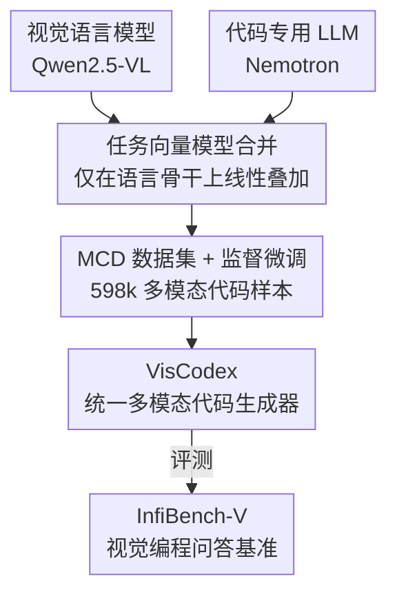

# VisCodex: Unified Multimodal Code Generation via Merging Vision and Coding Models

**会议**: ICLR 2026  
**OpenReview**: [https://openreview.net/forum?id=hUXzPauNEM](https://openreview.net/forum?id=hUXzPauNEM)  
**代码**: https://github.com/JackLingjie/VisCodex  
**领域**: 多模态VLM  
**关键词**: 多模态代码生成, 模型合并, 任务向量, 指令微调数据, 视觉到代码

## 一句话总结
VisCodex 用「任务向量」把一个强代码 LLM 算术地合并进一个视觉语言模型的语言骨干里（视觉编码器和投影层保持不动），再配上自建的 598k 多模态代码数据集 MCD 做监督微调，让 MLLM 同时保住视觉理解又获得强代码能力，在 UI→代码、图表→代码等任务上达到开源 SOTA、逼近 GPT-4o。

## 研究背景与动机
**领域现状**：多模态大模型（MLLM）在视觉问答、图像描述、多模态对话上已经很强，能「看懂」UI 布局、数据图表、编程相关截图。但一个非常实用的方向——从视觉输入生成可运行代码（multimodal code generation）——仍被严重忽视。

**现有痛点**：把 UI 设计稿翻译成 HTML、把一张图表复刻成 matplotlib 代码，这类任务既要细致解读视觉元素，又要写出语法无误、功能正确的代码。可现有 MLLM 普遍「会描述、不会写」：它们擅长视觉描述，却缺乏稳健代码生成所需的深层编程知识。

**核心矛盾**：要让模型既强视觉又强代码，最直接的办法是从头预训练或大规模联合训练，但代价高昂；而如果直接「换骨干」——把 VLM 的语言模型直接替换成一个代码 LLM——又会破坏原本辛苦学到的视觉对齐能力（视觉 grounding 被打乱）。视觉能力与代码能力之间存在一个「鱼与熊掌」的张力。

**本文目标**：在不做昂贵重训的前提下，造出一个同时具备「强视觉理解 + 强代码生成」的统一模型，并解决该方向训练数据和评测基准都匮乏的问题。

**切入角度**：作者注意到，代码相关的专长主要驻留在语言模型骨干里，而视觉理解能力主要在视觉编码器和跨模态投影模块里。两者在参数空间上是「可分离」的，于是可以用模型合并（model merging）只在语言骨干上做手术、把视觉部分原封不动地保留下来。

**核心 idea**：用「任务向量」线性合并 VLM 和代码 LLM 的语言骨干参数——既注入代码专长、又不动视觉模块，再用大规模多模态代码数据微调，从而以极低成本得到一个统一的多模态代码生成器。

## 方法详解

### 整体框架
VisCodex 的输入是两个现成的同架构模型——一个视觉语言模型（Qwen2.5-VL，负责视觉理解）和一个代码专用 LLM（OpenCodeReasoning-Nemotron，负责代码推理），输出是一个统一的多模态代码生成模型。整条管线分两步走：先用「任务向量线性合并」把代码能力注入 VLM 的语言骨干、得到合并初始化参数；再在自建的 598k 多模态代码数据集 MCD 上做监督微调，把合并后的模型对齐到具体的视觉编程任务。为了能严格评测，作者还额外造了一个真实场景的视觉编程问答基准 InfiBench-V。

整个方法的关键在于「只动语言骨干」：合并和微调都只作用于语言模型，视觉编码器（ViT）和跨模态投影模块全程冻结，这样既保留了原 VLM 的视觉对齐，又把新增的代码能力清晰地归因到语言侧。

### 关键设计

**1. 任务向量模型合并：只在语言骨干注入代码能力，视觉模块原封不动**

这一步直击「换骨干会破坏视觉对齐」的痛点。任务向量（task vector）刻画的是一个基座模型在某任务上微调后的参数偏移：给定预训练基座 $\theta_{base}$ 和其微调变体 $\theta_{ft}$，任务向量定义为 $\tau_{task} = \theta_{ft} - \theta_{base}$，它把「学会某种能力所需的参数变化」打包成一个模块化、可迁移的单元。作者对 VLM 和代码模型各算一个任务向量——$\tau_{vlm} = \theta_{vlm} - \theta_{base}$（让语言模型学会联合处理图文）、$\tau_{code} = \theta_{code} - \theta_{base}$（编码代码理解与生成能力），然后线性组合：

$$\theta_{VisCodex} = \theta_{base} + \lambda \tau_{vlm} + (1-\lambda)\tau_{code}$$

其中 $\lambda \in [0, 1]$ 控制「保留多模态表示」与「注入代码专长」之间的权衡。关键在于合并范围被严格限制在语言模型骨干，视觉编码器和投影模块完全不参与运算——这正是它优于直接换骨干的地方：换骨干会扰乱已学好的视觉 grounding，而合并把视觉对齐能力完整保住、同时把代码能力叠加进来。一个工程前提是两个被合并模型必须同架构：因为 Qwen2.5-VL 的语言骨干源自 Qwen2.5，所以代码侧选了同样基于 Qwen2.5 的 Nemotron，保证 $\theta_{base}$ 一致、任务向量可加。

**2. MCD 多模态代码数据集：四路异构来源覆盖真实视觉编程场景**

合并只是给了模型好的初始化，要真正对齐多模态编程任务还缺大规模高质量数据，而该方向数据极度匮乏。作者因此构建了 598k 样本的 Multimodal Coding Dataset（MCD），由四类互补来源拼成：（1）增强 HTML 代码——发现已有 Web2Code 数据存在断图、CSS 粗糙、设计丑陋等问题，且直接让 GPT-4o 重写旧代码会因原结构约束产生渲染瑕疵，于是改用「图驱动生成」：拿 56 万网页图当风格种子、让 GPT-4o 据此设计全新网页、用 Playwright 渲染截图、再经严格过滤剔除渲染失败和异常尺寸，最终得到 20 万高质量代码-图对；（2）图表图→代码——合并 16.4 万合成 Chart2Code 样本与从 GitHub 收集、经 GPT-4o 重写归一化 + 规则多级过滤 + 美学打分精选出的 4.6 万真实样本，共 21 万对；（3）图像增强代码问答——爬取 StackOverflow 含图、且被采纳答案含 Python/HTML 代码的帖子，经清洗与 GPT-4o 精炼得到 5.9 万对；（4）算法代码——从 Kodcode 选取 LeetCode、Codeforces、TACO 等五类共 12.9 万条，用来保住模型的核心算法推理能力。四路来源既覆盖前端/图表/真实问答这些视觉密集场景，又用算法数据防止纯代码推理退化。

**3. InfiBench-V 基准：图像不可或缺的真实视觉编程问答评测**

现有基准要么只考纯文本代码问答（如 InfiBench），要么只考简单视觉任务，无法衡量「视觉上下文对答对题至关重要」的能力。InfiBench-V 专门补这个洞：从 StackOverflow 爬约 100 万含图且有采纳答案的问题，逐步收窄到 4 万高热度问题，再用 GPT-4o 筛出「图像不可或缺、纯文本无法解」的核心 1 万题，最后由领域专家按 InfiBench 的类别分布原则手选 322 题，横跨 13 种编程语言、映射到前端/后端/数据科学与机器学习/移动桌面/IT 运维五大类。为防预训练记忆泄漏，专家还对每题做了改写（paraphrasing）。评测采用三管齐下、取归一化平均：关键词匹配（专家为每题定制可加权的关键短语规则、支持正则与逻辑式）、单元测试（对以代码为主的题目用专家提供的 setup/teardown 脚本自动执行验证）、GPT-4o 评判（对依赖自然语言理解的题目，对照参考答案从正确性与完整性两个维度打分）。

**4. 监督微调与合并系数：冻结视觉模块，按下游基准调 $\lambda$**

合并得到 $\theta_{VisCodex}$ 后，模型在 MCD 上做监督微调，进一步把「合并初始化」对齐到多模态编程任务。训练时同样冻结视觉编码器和投影模块、只微调语言骨干，既高效利用了已有的视觉 grounding 又巩固新注入的代码能力。合并系数 $\lambda$ 不是拍脑袋定的：在 8B 主实验里，作者在 $\{0.7, 0.8, 0.85, 0.9\}$ 中按 MMCode 基准的表现挑选，最终取 $\lambda = 0.7$——即给视觉任务向量 0.7、给代码任务向量 0.3 的权重，在保住视觉的同时把代码能力提到最佳。

### 损失函数 / 训练策略
标准的指令微调（监督微调）目标，在 MCD 的 598k 图文-代码指令样本上训练；全程冻结 ViT 与跨模态投影、只更新语言骨干。8B 模型用 Nemotron-1.1-7B 的代码任务向量、$\lambda=0.7$；33B 模型对应用 Nemotron-1.1-32B 变体。

## 实验关键数据

### 主实验
在 Design2Code（UI→代码）、ChartMimic（图表→代码）、MMCode（视觉算法题 pass@1）、InfiBench-V 四个基准上评测，Average 为综合分。

| 模型 | 规模 | Design2Code (Low/High) | ChartMimic (Low/High) | MMCode pass@1 | InfiBench-V | Average |
|------|------|------|------|------|------|------|
| GPT-4o-mini | - | 85.8 / 87.3 | 68.4 / 68.5 | 12.2 | 71.9 | 65.7 |
| GPT-4o | - | 90.2 / 90.4 | 79.0 / 83.5 | 17.0 | 79.9 | 73.3 |
| Qwen2.5-VL-7B-Instruct | 8B | 83.4 / 87.6 | 39.5 / 38.3 | 5.3 | 54.0 | 51.4 |
| InternVL3-14B | 15B | 82.9 / 88.3 | 53.9 / 55.0 | 11.4 | 70.5 | 60.3 |
| **VisCodex-8B** | 8B | **90.1 / 90.9** | **74.8 / 74.1** | 11.0 | **72.1** | **68.8** |
| Qwen2.5-VL-72B-Instruct | 73B | 86.9 / 88.7 | 66.7 / 68.7 | 15.2 | 75.2 | 66.9 |
| **VisCodex-33B** | 33B | **90.5 / 91.1** | **79.3 / 78.5** | 15.6 | 78.6 | **72.3** |

VisCodex-8B 综合分 68.8，不仅碾压同量级（7-15B）全部开源模型，还反超 GPT-4o-mini；VisCodex-33B 综合分 72.3，与 GPT-4o（73.3）基本持平，且优于 72B/78B 量级的开源大模型。最大短板出现在 MMCode（纯算法 pass@1）上，8B 仅 11.0，落后 GPT-4o。

### 消融实验

| 配置 | 关键指标 | 说明 |
|------|---------|------|
| VisCodex-8B（完整） | ChartMimic 74.8/74.1, MMCode 11.0 | 合并 + MCD 微调 |
| w/o model merge（8B） | ChartMimic 73.4/70.6, MMCode 6.8 | 去掉合并，MMCode 暴跌至 6.8 |
| Replace（1-stage 换骨干） | Design2Code 88.7, ChartMimic 70.4/69.2 | 直接换语言骨干 |
| Replace（2-stage 换骨干） | Design2Code 88.2, ChartMimic 73.4/70.9 | 先训投影再联合微调 |
| **Model Merge（本文）** | **Design2Code 90.1, ChartMimic 74.8/74.1** | 视觉密集任务明显更优 |

代码 LLM 选型消融：相比合并通用 LLM（Qwen2.5-7B-Instruct，MMCode 仅 6.8），合并代码专用模型都更好，其中 Nemotron-1.1-7B 把 MMCode pass@1 从 6.8 拉到 11.0，提升最显著。

### 关键发现
- **模型合并对代码能力的贡献最大**：去掉合并后，8B 在 MMCode 上从 11.0 掉到 6.8（近乎腰斩），ChartMimic High-L 从 74.1 掉到 70.6，证明合并主要在「需要执行正确性」的任务上发力，而视觉理解（Design2Code）几乎不掉，说明视觉对齐确实被保住了。
- **合并优于换骨干，尤其在视觉密集任务**：在 Design2Code、ChartMimic 上合并明显超过 1-stage/2-stage 换骨干，原因正是换骨干会扰乱已学的视觉 grounding，而合并把视觉对齐与代码能力同时保留。
- **必须合并代码专用模型**：通用 LLM 提不动 MMCode（6.8），只有代码专用模型（Nemotron）能把可执行正确性显著拉起来。

## 亮点与洞察
- **用「参数空间分工」绕开重训**：作者敏锐地发现代码能力住在语言骨干、视觉能力住在 ViT+投影，于是只在语言骨干做任务向量加法，就把两种本来要联合训练的能力低成本拼起来——这是把「模型合并」从纯 LLM 场景成功迁移到 MLLM 多模态代码场景的关键洞察。
- **「图驱动生成」造 HTML 数据的 trick 可复用**：与其让 GPT-4o 在旧代码结构约束下重写（会渲染出鬼畜布局），不如用旧网页图当风格种子、让模型从零设计新页面再渲染截图配对，这种「拿图当 prompt、代码当标签、渲染做闭环过滤」的数据合成范式可迁移到任何「视觉产物→生成代码」任务。
- **冻结视觉模块带来清晰归因**：合并和微调都只动语言侧，使得性能增益能被干净地归因到代码能力注入，而不是视觉侧也偷偷变了——这让消融结论更可信。

## 局限与展望
- **纯算法视觉题仍是短板**：MMCode pass@1（8B 仅 11.0）明显落后 GPT-4o（17.0），说明合并对「需要长链推理 + 视觉解析」的硬算法题帮助有限，视觉算法推理仍是开放难题。
- **依赖同架构基座**：合并要求 VLM 语言骨干与代码模型同源（都基于 Qwen2.5），换成异构模型对（不同 tokenizer/层结构）时任务向量不可直接相加，方法的普适性受限。
- **数据构建重度依赖 GPT-4o**：HTML 生成、图表重写、问答精炼、基准筛题都靠 GPT-4o，既有成本也可能引入教师模型的偏置；$\lambda$ 也只在 MMCode 上调，可能对其他基准不是最优。
- **可改进方向**：探索代码任务向量与视觉模块的联合（轻量）适配、多个代码/推理任务向量的多向量合并，或把 $\lambda$ 做成逐层/逐任务自适应。

## 相关工作与启发
- **vs 直接换骨干（Backbone Replacement）**：1-stage 直接替换、2-stage 先训投影再联合微调，都会破坏原 VLM 的视觉对齐；本文用任务向量线性合并在保住视觉 grounding 的同时注入代码能力，视觉密集任务上明显更优。
- **vs Web2Code 等 HTML 数据集**：Web2Code 存在断图、CSS 粗糙、设计丑等问题；本文用图驱动生成 + Playwright 渲染过滤，造出 20 万更高质量、可渲染的 HTML 代码-图对。
- **vs 模型合并增强 MLLM 的其他工作（REMEDY 改 VQA、Chen et al. 改数学推理）**：同样用合并思路，但本文首次证明合并能给 MLLM 赋予强多模态代码理解与生成能力，并配套了 MCD 数据集与 InfiBench-V 基准。

## 评分
- 新颖性: ⭐⭐⭐⭐ 把模型合并迁移到「多模态代码生成」并验证只动语言骨干的有效性，思路清晰但合并技术本身是已有工具的组合应用。
- 实验充分度: ⭐⭐⭐⭐⭐ 四基准主结果 + 合并/换骨干/代码模型选型多组消融，对比覆盖开源与专有模型，论证充分。
- 写作质量: ⭐⭐⭐⭐ 动机—方法—数据—评测—实验链条完整，公式与数据构建流程交代清楚。
- 价值: ⭐⭐⭐⭐⭐ 低成本造出逼近 GPT-4o 的开源多模态代码生成器，并开源 598k 数据集与新基准，对社区实用价值高。

<!-- RELATED:START -->

## 相关论文

- [\[ICLR 2026\] OptMerge: Unifying Multimodal LLM Capabilities and Modalities via Model Merging](optmerge_unifying_multimodal_llm_capabilities_and_modalities_via_model_merging.md)
- [\[ICLR 2026\] Breaking the SFT Plateau: Multimodal Structured Reinforcement Learning for Chart-to-Code Generation](breaking_the_sft_plateau_multimodal_structured_reinforcement_learning_for_chart-.md)
- [\[ICLR 2026\] Lavida-O: Elastic Large Masked Diffusion Models for Unified Multimodal Understanding and Generation](lavida-o_elastic_large_masked_diffusion_models_for_unified_multimodal_understand.md)
- [\[ICLR 2026\] Omni-Weather: A Unified Multimodal Model for Weather Radar Understanding and Generation](omni-weather_a_unified_multimodal_model_for_weather_radar_understanding_and_gene.md)
- [\[ICLR 2026\] Thinking with Camera: A Unified Multimodal Model for Camera-Centric Understanding and Generation](thinking_with_camera_a_unified_multimodal_model_for_camera-centric_understanding.md)

<!-- RELATED:END -->
