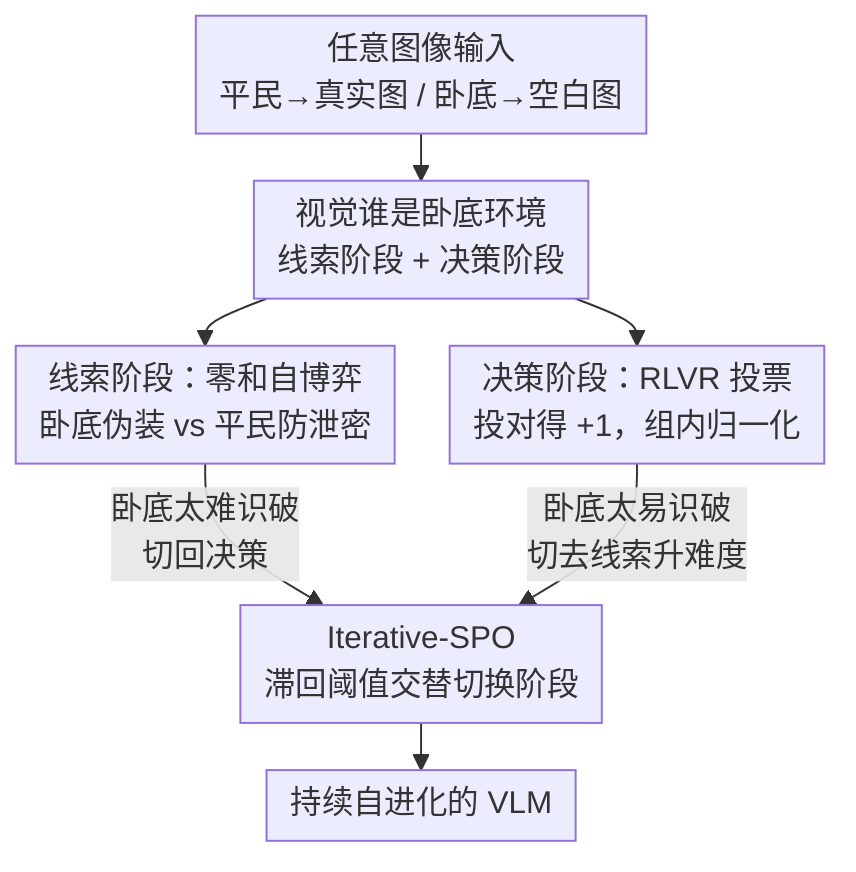

# Vision-Zero: Scalable VLM Self-Evolution via Multi-Agent Self-Play

**会议**: ICLR 2026  
**OpenReview**: [https://openreview.net/forum?id=s00SNXREV6](https://openreview.net/forum?id=s00SNXREV6)  
**代码**: https://github.com/wangqinsi1/Vision-Zero  
**领域**: 多模态VLM  
**关键词**: VLM自进化, 多智能体自博弈, 社交推理游戏, RLVR, 无标注训练

## 一句话总结
把"谁是卧底"搬进视觉世界——给平民真实图、给卧底空白图，让 VLM 通过多角色对抗博弈自动生成训练数据，再用 Self-Play 与 RLVR 交替优化（Iterative-SPO），在完全无标注的前提下让 Qwen2.5-VL-7B 在推理、图表、视觉中心三大类任务上同时超过用昂贵人工标注训练的 SOTA。

## 研究背景与动机
**领域现状**：当前 VLM/MLLM 的后训练严重依赖人工：SFT 要人写推理轨迹、RLHF 要人标偏好、RLVR 要人精心设计可验证的奖励与题库。这条路线训出来的模型确实强，但每一步都被"人能提供多少监督"卡住。

**现有痛点**：多模态标注的成本高得离谱——论文给的数字很扎心：COCO Attributes 标 20 万物体要 6 万美元，Ego4D 烧掉 25 万标注小时，Visual Genome 动员了 3.3 万名标注员。这带来两个瓶颈：一是**数据稀缺**，成本限制了数据的规模和多样性；二是**知识天花板**，模型能力被人类监督的上限锁死，学不到超出人类经验的策略。

**核心矛盾**：要让 VLM 持续自我提升，就必须摆脱"人在回路"，但自博弈（Self-Play）在 VLM 上几乎是空白。一个理想的自博弈环境需同时满足四个条件：①赢得游戏所需的技能要与目标任务高度对齐；②难度可随能力增长而持续上升（不收敛到固定上限）；③环境足够多样复杂以覆盖广泛任务；④只需无标注或极低成本数据。现有视觉游戏（如数独）顶多满足其中两三个，做不到四者兼得——尤其因为 VLM 同时涉及视觉与语言两个模态，设计这种环境并不平凡。

**本文目标**：造一个无标注、领域无关、难度自升级的视觉自博弈环境，让 VLM 在玩游戏的过程中自己生产监督信号，并且学到的能力能迁移到通用任务。

**切入角度**：作者从社交推理游戏（尤其是"陈述—投票"交替的"谁是卧底"）取经——这类游戏天然需要观察、推断、沟通、博弈，且对手会随你变强而变强，难度自动水涨船高，恰好命中上述四条件。

**核心 idea**：构造一个视觉版"谁是卧底"——平民看到真实图、卧底拿到空白图，卧底必须仅凭平民的发言反推隐藏画面并伪装，平民则要在"说清楚"和"不泄密"之间权衡。再用 Iterative-SPO 把零和的 Self-Play 阶段和可验证的 RLVR 阶段交替起来，避免自博弈陷入均衡停滞。

## 方法详解

### 整体框架
Vision-Zero 是一个游戏化的 VLM 后训练框架，输入只需任意图像（无标注），输出是被持续强化的同一个 VLM。它把训练拆成一局局"谁是卧底"：每局有 $n_c$ 个平民和 1 个卧底，平民各自拿到真实图 $I_c$、卧底拿到空白图 $I_s$。一局分两个阶段——**线索阶段**（Clue Stage）每个玩家轮流用一句话描述自己看到的画面，发言对后续玩家可见但思考过程私密；**决策阶段**（Decision Stage）平民综合所有线索和自己的图投票指认卧底，卧底因为知道自己身份故不投票。这两个阶段恰好对应两种训练信号：线索阶段是平民 vs 卧底的零和对抗，用 Self-Play 优化；决策阶段是"投得对不对"的可验证奖励，用 RLVR 优化。

关键不是把这两种训练混在一起，而是让它们**交替**：当决策阶段太容易识破卧底（说明线索阶段饱和），就切去练线索阶段把难度顶上去；当卧底太难被识破时，再切回练决策阶段。这套带滞回阈值的开关就是 Iterative-SPO，目的是不让任何一方率先收敛到均衡而停滞。

### 关键设计

**1. 视觉"谁是卧底"环境：用信息不对称逼出视觉推理与博弈**

针对"找不到一个同时满足四条件的视觉自博弈环境"这个痛点，作者把社交推理游戏视觉化。核心机巧在于**信息不对称**：平民看真实图、卧底看空白图，于是卧底必须像侦探一样从平民零碎的发言里反推隐藏画面，再编出一句既不暴露自己又与共识一致的线索；而平民要给出准确清晰的描述以洗清嫌疑，同时尽量少泄露信息给卧底。这个设定天然逼着模型在多个角色间做策略推理，并且要同时处理空间关系、物体细节等视觉理解——而不是只靠语言走捷径。难度还会自升级：随着模型变强，对手（自己的副本）也变强，环境持续保持挑战性，对应理想环境的条件②。论文用 CLEVR 合成场景、图表、真实图三类数据验证它对任意图像都成立（条件③④）。

**2. 线索阶段的零和自博弈奖励 + 角色优势估计（RAE）**

线索阶段要解决的是"怎么给一句句线索打分、又不让卧底/平民因为信息不对称而天然占优"。奖励按零和博弈设计：得票越多（越像卧底）奖励越低。卧底奖励 $r^{clue}_s = -\beta(v_s - \bar{v}_c)$，平民奖励 $r^{clue}_{c_j} = \frac{\beta}{n_c}(v_s - \bar{v}_c) - \lambda(v_{c_j} - \bar{v}_c)$，其中 $v_s$ 是卧底得票、$\bar{v}_c$ 是平民平均得票、$\beta$ 控制对抗强度、$\lambda$ 惩罚平民间行为不一致。这保证卧底与平民总奖励为零，且谁被怀疑得越多谁分越低。

但卧底拿空白图、平民拿真实图，胜率天生失衡，直接用奖励会让模型学偏。作者用**角色优势估计（RAE）**消掉这种不对称：分别维护卧底与平民的基线 $b_s, b_c$，按 $b_s = \alpha b_s + (1-\alpha)r^{clue}_s$ 做指数滑动更新，优势 $A^{clue}_k = r^{clue}_k - b_k$ 用奖励减去对应角色的基线，从而把"你是卧底所以本来就难"这部分剔除掉。最终目标是优势加权的对数似然加 KL 正则（约束到参考策略 $\pi_{ref}$，防止退化发言），未基线化的回报保持零和以促成寻求均衡的动力学。

**3. 决策阶段的离散可验证奖励 + 组内归一化（GRPO）**

决策阶段的目标很干脆——投对卧底。因为平民共享对齐的信息，可看作一个群体，于是套用 GRPO。奖励是离散且可验证的：投对得 $+1$，回答"n/a"（不确定）得 $-0.5$，投错得 $-1$。这个设计巧在它鼓励模型在没把握时**诚实承认不确定**而非乱猜，避免被错误答案带偏。为消除每局难度差异，再做组内归一化 $A^{dec}_{c_i} = (r^{dec}_{c_i} - \mu_r)/(\sigma_r + \varepsilon)$，把奖励减去组均值除以组标准差，让优势只反映"这一局里谁判断得相对更好"，而不被这局本身好不好猜所污染。优化同样是优势加权对数似然加 KL 正则。

**4. Iterative-SPO：用滞回阈值交替 Self-Play 与 RLVR，破解均衡停滞**

这是论文的算法核心，针对两个相反的失败模式：纯自博弈会收敛到局部均衡、停止探索新推理路径；纯 RLVR 一旦题库被吃透就知识饱和。Iterative-SPO 让两阶段**交替训练**并用决策阶段的表现当信号来切换。它维护一个批次内的平均准确率 $acc_t$ 和"n/a"率 $na_t$ 的指数滑动均值，用一组**滞回阈值**决定切换：当 $\overline{acc}_t \ge \tau^{\uparrow}_{acc}$ 且 $\overline{na}_t \le \tau^{\downarrow}_{na}$（卧底太好认，说明线索太弱）就切去练线索阶段把难度顶上去；当 $1-\overline{acc}_t \ge \tau^{\uparrow}_{err}$ 或 $\overline{na}_t \ge \tau^{\uparrow}_{na}$（卧底太难认）就切回练决策阶段。为防止频繁抖动，还要求每个阶段至少停留 $K_{min}$ 步。每步只有激活模块吃梯度，损失为 $L_t = m_t L_{clue}(\theta) + (1-m_t)L_{dec}(\theta)$。这套交替带来两个好处：动态检测停滞信号并切换阶段，避免陷在策略均衡或知识平台期；同时把 RLVR 的监督信号注入自博弈，稳住训练、防止角色坍塌或发散。

### 一个完整示例
以 CLEVR 场景为例走一遍：三个平民各看到含金属圆柱、金属球、黄色立方体、红圆柱的同一场景，卧底看到一张空白图。线索阶段平民依次说"金属圆柱在金属球右边""红圆柱在黄球和黄立方体后面""黄立方体在金属球左边"。轮到卧底时，它在私密思考里推断："黄立方体被反复提及是共有物体，结合两条线索可推出红圆柱在金属球左边"，于是它没有暴露任何破绽地说出"红圆柱在金属球左边"——一句基于推理而非观察、又与共识自洽的伪装线索。决策阶段平民综合线索投票。论文图 5 给出训练前后对比：训练前卧底的推理在分解（DECOMPOSE）和策略（STRATEGIZE）维度被 GPT 打低分、逻辑判错；训练后这些维度全部拉满、逻辑正确——说明自博弈确实把"规划、检索、分解、策略、逻辑"这些底层推理能力练了出来。

### 损失函数 / 训练策略
每局 4 个平民（$n_c=4$）、两轮线索发言。线索超参 $\beta=\lambda=0.1$ 以保持奖励在 $[-1,1]$；RAE 与滑动均值衰减 $\alpha=\rho=0.95$；KL 权重 $\tau_{dec}=\tau_{clue}=0.04$。切换阈值 $\tau^{\uparrow}_{acc}=0.9$、$\tau^{\uparrow}_{err}=0.4$、$\tau^{\uparrow}_{na}=0.5$、$\tau^{\downarrow}_{na}=0.1$，每阶段最少 $K_{min}=5$ 步、耐心 $P=20$。基于 VLM-R1 框架训练 100 轮、batch size 128。固定交互模式（两轮线索+一轮决策）让多局可完全并行前后向、无异步延迟，每个样本产生多个动作、监督信号更密、样本效率更高。

## 实验关键数据

### 主实验
在 Qwen2.5-VL-7B 上后训练，对比一众用人工标注数据 RLVR 的 SOTA（推理/数学六项基准，VLMEvalKit 评测）：

| 方法 | 训练数据 | MathVision | WeMath | LogicVista | Avg. |
|------|---------|-----------|--------|-----------|------|
| Qwen2.5-VL-7B（基座） | — | 25.4 | 36.1 | 47.2 | 41.1 |
| MM-Eureka-Qwen-7B | 人工标注 | 26.9 | 36.2 | 42.9 | 42.9 |
| VLAA-Thinker-7B | 人工标注 | 26.4 | 36.0 | 47.2 | 41.9 |
| ViGaL-Snake+Rotation | 游戏采集 | 27.5 | 36.9 | 46.5 | 43.0 |
| **VisionZero-Qwen-7B (CLEVR)** | **无标注** | 28.4 | 39.2 | 49.8 | **44.3** |
| **VisionZero-Qwen-7B (Real-World)** | **无标注** | 28.5 | 40.1 | 50.8 | **44.5** |

无标注的 Vision-Zero 平均分超过所有用数百上千条数学/推理样本训练的基线（最强基线仅 +1.9%，本文约 +3%），而它本身**没有任何数学专项训练**——能力是从博弈中迁移出来的。

成本对比（表 3）更说明问题：

| 方法 | RL 数据量 | 标注成本(tokens) | 训练时长 | MMMU |
|------|----------|----------------|---------|------|
| R1-OneVision-7B | 10k | ≥1.1M | ≥170 A100h | 51.9 |
| MM-Eureka-Qwen-7B | 15k | — | ≈700 A100h | 55.8 |
| ViGaL-Snake+Rotation | 72k | 0 | ≈170 A100h | 58.0 |
| **VisionZero-Qwen-7B (CLEVR)** | **2k** | **0** | **127 A100h** | **58.8** |

零标注成本、仅 2k 图像、127 A100 小时即达到最高 MMMU。相对原始 GRPO，训练效率在 Qwen2.5-VL-7B / InternVL3-8B 上分别提升 $3.3\times$ / $6.4\times$。

### 消融实验

| 配置 | LogicVista 最终精度 | 说明 |
|------|-------------------|------|
| Iterative-SPO（完整） | 最高 | 交替 Self-Play + RLVR |
| Pure Clue（纯自博弈） | 比完整低约 2% | 缺可验证奖励，过早陷入均衡、增益缓慢 |
| Pure Decision（纯 RLVR） | 比完整低约 1% | 知识饱和 |

跨模型泛化（CLEVR 数据训练，六项推理基准平均）：InternVL3-8B 从 34.7 → 36.5（+1.8）、InternVL3-14B 从 45.8 → 47.4（+1.6），均超过同设定下用 MM-Eureka + GRPO 的基线。

### 关键发现
- **交替是关键**：纯自博弈最差——它的奖励信号来自决策方，一旦决策方判别力不足就无法区分角色，性能过早见顶；引入 RLVR 的可验证监督才能持续涨。
- **能力会迁移且不打架**：在图表数据上训练的 VisionZero 在四个图表基准平均涨 +3.9%，CLEVR 训练的把 MMVP 从 76.8% 提到 79.5%——同一框架同时改善推理、图表、视觉中心三类任务，有效缓解了传统单任务训练常见的跨能力负迁移。
- **推理变"长"也变"对"**：训练中胜率从 50% 升到 71%，决策阶段平均输出长度从 250 涨到约 400 token，说明模型确实在做更充分的推理而非套模板。

## 亮点与洞察
- **把信息不对称当训练引擎**：给卧底一张空白图，这个看似简单的设定一举逼出视觉理解、空间推理、推断与沟通四种能力，比堆叠专项数据集优雅得多——是个可迁移到其他自博弈设计的思路。
- **滞回阈值切换很务实**：用决策准确率和"n/a"率当"线索阶段是否饱和"的探针，再加最小停留步数防抖动，给"什么时候该切换训练目标"提供了一个可操作的工程答案，而非拍脑袋。
- **"n/a"奖励 -0.5 的设计**：让模型在没把握时诚实弃权而非乱猜，这是把校准（calibration）思想塞进 RLVR 奖励的小巧设计，可复用到任何允许"拒答"的可验证任务。
- **零标注却超过有标注**：最反直觉的一点——无标注、2k 图、127 A100h，却在数学推理上超过用上千条专项标注训练的模型，强力支撑了"博弈能突破人类监督天花板"的论点。

## 局限与展望
- 环境是固定的"谁是卧底"，交互模式写死为两轮线索+一轮决策；游戏机制本身决定了能力上限，换更复杂任务时是否还能自升级未充分验证。
- 切换阈值（$\tau^{\uparrow}_{acc}=0.9$ 等）和 $\beta,\lambda$ 是经验设定的，论文未给这些超参的敏感性分析，迁到新模型/新数据时可能需要重调。
- 评测虽覆盖 14 个任务，但增益幅度多在 1.6%–3.9% 区间，属稳健而非颠覆性提升；自博弈能否长期突破而不再饱和，仍只在 100 轮内观察。
- 视觉版"谁是卧底"主要练的是物体/空间/图表层面的描述与推断，对需要细粒度 OCR、长文档、复杂因果链的任务，博弈技能与目标任务的"对齐度"（条件①）是否足够，值得进一步检验。

## 相关工作与启发
- **vs Absolute Zero / SPIRAL（LLM 自博弈）**: 它们在纯语言游戏（Tic-Tac-Toe、Kuhn Poker、proposer-solver）里做自博弈，本文把自博弈首次系统地引入 VLM，关键增量是处理视觉模态、并用信息不对称的视觉游戏制造监督——LLM 的现成游戏无法逼出视觉理解。
- **vs ViGaL（游戏化 VLM 训练）**: ViGaL 先在游戏环境里离线采集数据再训练，本文是在线交互式自博弈、训练数据随模型一起进化；ViGaL 用 72k 样本，本文仅 2k 且效果更好。
- **vs MM-Eureka / VLAA-Thinker / OpenVLThinker（RLVR + 人工标注）**: 这些方法都靠人工构造的题库与 CoT 标注做 RLVR，本文完全零标注，靠博弈自动产生可验证信号，成本（标注 0、训练 127 vs ≥120–700 A100h）显著更低且性能更高。

## 评分
- 新颖性: ⭐⭐⭐⭐⭐ 首个 VLM 游戏化自博弈框架，信息不对称视觉游戏 + Iterative-SPO 两点都新颖。
- 实验充分度: ⭐⭐⭐⭐ 三模型 14 任务、成本/效率/泛化/算法消融齐全，但超参敏感性与长程自博弈缺验证。
- 写作质量: ⭐⭐⭐⭐ 动机与方法链条清晰，奖励与切换公式给得完整。
- 价值: ⭐⭐⭐⭐⭐ 零标注超越有标注，给 VLM 摆脱人工监督天花板提供了可落地范式。

<!-- RELATED:START -->

## 相关论文

- [\[ICLR 2026\] Thinking as Society: Multi-Social-Agent Self-Distillation for Multimodal Misinformation Detection](thinking_as_society_multi-social-agent_self-distillation_for_multimodal_misinfor.md)
- [\[ICLR 2026\] ViPER: Empowering the Self-Evolution of Visual Perception Abilities in Vision-Language Models](viper_empowering_the_self-evolution_of_visual_perception_abilities_in_vision-lan.md)
- [\[ICLR 2026\] Self-Aug: Query and Entropy Adaptive Decoding for Large Vision-Language Models](self-aug_query_and_entropy_adaptive_decoding_for_large_vision-language_models.md)
- [\[ICLR 2026\] Self-Evolving Vision-Language Models for Image Quality Assessment via Voting and Ranking](self-evolving_vision-language_models_for_image_quality_assessment_via_voting_and.md)
- [\[AAAI 2026\] Multi-Agent VLMs Guided Self-Training with PNU Loss for Low-Resource Offensive Content Detection](../../AAAI2026/multimodal_vlm/multi-agent_vlms_guided_self-training_with_pnu_loss_for_low-resource_offensive_c.md)

<!-- RELATED:END -->
