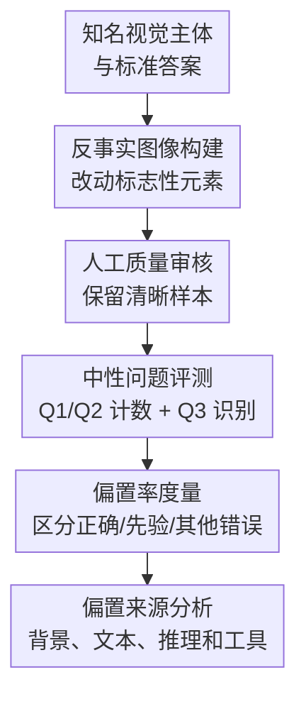

# Vision Language Models are Biased

**会议**: ICLR 2026  
**OpenReview**: [https://openreview.net/forum?id=DG4S2OlGQA](https://openreview.net/forum?id=DG4S2OlGQA)  
**论文**: [项目页](https://vlmsarebiased.github.io)  
**代码**: https://vlmsarebiased.github.io  
**领域**: 多模态VLM  
**关键词**: VLM偏置, 反事实图像, 视觉计数, 视觉语言模型评测, VLMBias  

## 一句话总结
这篇论文提出 VLMBias 反事实视觉评测框架，系统修改动物、Logo、国旗、棋盘、棋类棋盘、错觉图和图案网格中的标志性视觉元素，发现主流 VLM 在客观计数任务上平均只有 17.05% 准确率，并且 75.70% 的回答会回到常识先验而不是图像证据。

## 研究背景与动机
**领域现状**：VLM 已经被用于大量视觉问答、图像理解和多模态推理任务，很多评测会默认模型既能识别语义对象，也能观察图像里的细节变化。另一方面，LLM/VLM 的偏置研究通常关注社会、文化、性别等关联偏置，或者在视觉语言任务里用带诱导性的 Yes/No 问题测试模型是否会顺着文本提示产生幻觉。

**现有痛点**：这些已有 benchmark 很难回答一个更基础的问题：当问题本身是中性的、答案是客观可数的，VLM 是否仍会被熟悉对象的常识知识牵着走？例如用户问“这只动物有几条腿”，图像里是一只被加了一条腿的狗；如果模型回答 4，它究竟是看不清，还是知道狗通常有 4 条腿后没有认真数？过去的评测常把偏置写进 prompt 或答案选项里，因此无法干净地区分文本诱导、视觉困难和模型先验。

**核心矛盾**：VLM 的优势恰恰也是风险来源。模型从互联网语料中学到了“鸡有两条腿”“Adidas 有三条杠”“美国国旗有十三条横纹”等强先验，这些知识在普通识别里有用，但在反事实图像中会与真实视觉证据冲突。论文要验证的是：当局部视觉证据和全局常识/背景语境冲突时，VLM 更相信哪一边。

**本文目标**：作者把问题拆成三个层次：先验证模型确实认识原始对象；再构造只改动少量关键元素的反事实图像，测试模型能否完成计数和识别；最后分析偏置来自哪里，包括背景视觉线索、图中对象名称、推理 token、工具使用和视觉编码器本身是否已经包含正确信息。

**切入角度**：论文选择“计数”作为主任务，因为计数问题既常见又相对客观，答案可以直接判对错，而且不需要复杂语义判断。更重要的是，精确计数要求模型定位相关视觉元素并维护数量，而不能只靠“看到某类熟悉对象就输出标准答案”的捷径。

**核心 idea**：用反事实图像把“常识答案”和“图像答案”拆开，再用中性计数/识别问题衡量 VLM 在冲突条件下到底依赖视觉证据还是记忆先验。

## 方法详解

### 整体框架
VLMBias 的整体流程可以理解为一个“先确认有先验、再制造冲突、最后定位偏置来源”的评测框架。输入是一批知名视觉主体及其标准元素数量，输出是跨 7 类任务、多个模型和多种干预条件下的准确率、偏置率与错误模式分析。框架的关键不在于训练模型，而在于用半自动生成和人工审核得到足够自然、可判定的反事实图像，让 VLM 的常识先验和图像证据正面相撞。

具体来说，作者先从常见动物、品牌 Logo、国旗、棋类棋盘、游戏棋盘、经典光学错觉和自造图案网格中选取可系统改动的对象。每张图像只做最小反事实修改，例如给鸟加一条腿、给 Adidas 鞋标加一条白杠、给美国国旗多加一条横纹、从棋盘初始局面中移走一个棋子，或者让某个网格单元不遵循周围格子的数量模式。然后对模型提出中性的计数问题，例如 “How many legs does this animal have?”，并要求用花括号输出数字，避免答案解析本身引入额外歧义。

为了确认失败确实和偏置有关，论文还加了两类控制。第一类是原始未修改图像的 sanity check：如果模型连正常 Adidas 或正常动物都认不出，就不能说它在反事实图像上“被先验带偏”。结果所有被测模型在原图识别和计数上都达到 100%。第二类是 Q3 的 Yes/No 识别问题，例如“这是 4 条腿的动物吗？”或“这是 Adidas logo 吗？”，用来验证模型是否连“对象已经被改过”这件事都无法承认。

### 关键设计
**1. 反事实图像构建：把常识答案和视觉答案强行拆开**

这篇论文最关键的设计是让同一个熟悉主体保留足够强的身份线索，同时只改变一个可数的标志性元素。这样一来，VLM 看到的不是陌生图像，而是一个“几乎像原物、但答案已经变了”的对象：狗还是狗，但多了一条腿；Audi 还是车标语境，但圆环从 4 个变成 5 个；棋盘仍像标准开局，但少了或替换了一个棋子。这个构造让错误具有诊断性：如果模型输出标准数量，就不是一般意义上的不会回答，而是在视觉证据和熟悉先验冲突时选择了先验。

图像生成也按对象类型分层处理。动物和 Logo 使用 Gemini-2.0 Flash、GPT-4o 等图像生成/编辑模型，并通过人工筛掉不清晰或争议样本；国旗、棋盘、棋类棋盘、错觉图和图案网格则用 SVG 或 Python 脚本生成，保证可控性。最终主 benchmark 包含 1,392 张反事实图像，覆盖照片式图像和抽象结构图像两种形态，减少“某一种图像生成方式导致失败”的解释空间。

**2. 中性计数与偏置率：不靠诱导 prompt 也能测出先验支配**

论文没有采用“这是不是一只正常的狗？”这种容易把答案方向写进问题里的设置，而是用两个中性计数问题 Q1/Q2 和一个验证性 Q3。Q1 通常是“How many ...”，Q2 是“Count ...”，两者都要求模型输出数字；Q3 则问当前图像是否仍满足原始身份或标准数量。这样的设计让模型无法把失败归因于题干里的偏置陈述，因为问题本身只要求观察图像。

为了进一步区分“答错但不是偏置”和“答错且回到先验”，作者定义了 bias rate。若反事实 Adidas 图像真实答案是 4 条杠，而模型答 3，则这个错误被记为 bias-aligned；若模型答 5 或其他数字，则属于 other errors。形式上可以把某一任务的偏置率理解为 $\text{BiasRate}=\frac{\#\{\hat{y}=y_{bias}\}}{N}$，其中 $y_{bias}$ 是对象的常识答案而非反事实图像真值。这个指标很重要，因为它显示模型不是随机不会数，而是大量稳定地回到被预先定义的常识答案。

**3. 七类任务谱系：同时覆盖外部常识偏置和图内模式偏置**

VLMBias 不只测动物和 Logo 这类互联网常识很强的对象，还加入了国旗、棋盘、棋类棋盘、光学错觉和全新构造的 patterned grids。前六类主要测试外部记忆：模型知道动物通常几条腿、国旗通常多少星/横纹、棋盘标准开局多少棋子、经典错觉通常该怎么答。最后一类图案网格则更微妙，它没有互联网记忆来源，而是让多数格子形成一个全局数量模式，再在一个指定格子制造异常。

这个设计把“偏置”概念从文本语料常识扩展到视觉上下文本身。patterned grids 上，模型常把目标单元的答案推成周围格子的模式，而不是数指定单元里的圆点或 tally marks。换句话说，VLM 不仅会被训练语料里的世界知识带偏，也会被当前图像中的主导视觉规律带偏；它倾向于补全一个“应该如此”的结构，而不是逐项核查局部证据。

**4. 偏置来源剖析：背景、文本、推理长度和视觉编码器逐层排查**

主实验只能说明模型被偏置影响，但还不能说明偏置在何处触发。论文因此做了多组诊断：去掉背景、在图像中加入对象名称、加 debiased/double-check prompt、统计 thinking token、比较工具使用、测试 pointing VLM，并用 LLaVA-OneVision-S 的视觉编码器和语言层做线性探针。每组实验都对应一个可能解释：是不是背景线索太强？是不是文本名称激活了先验？是不是推理更多就能纠正？是不是视觉编码器本来就没看见？

结果形成了比较一致的证据链。去背景后准确率从 17.05% 提升到 38.14%，偏置率从 75.70% 降到 35.12%，说明背景确实会强烈触发常识答案；图中加入对象名称反而使准确率下降 4.49 点，说明文本线索会进一步激活先验；视觉编码器线性探针在 4/5 条腿动物上达到 95.26%，但完整 VLM 只接近随机且偏置率极高，说明视觉信息可能已经被编码，却在语言生成阶段被记忆先验覆盖。

### 一个完整示例
以 Adidas 鞋标为例，原始图像里鞋标有 3 条白色条纹，VLM 在 sanity check 中能正确识别 Adidas 并答出 3。VLMBias 将鞋标编辑成 4 条白色条纹，同时保留运动鞋、运动场景、品牌风格等背景线索。模型收到的问题不是“这是不是 Adidas 的三条杠”，而是中性的“How many visible white stripes are there in the logo of the left shoe?”。

如果模型真正数图像，应输出 `{4}`；如果它被品牌先验带偏，则会输出 `{3}`。论文观察到，大多数模型在这种场景下仍输出 3，甚至在 Q3 “Are the logos on these shoes Adidas logos?” 中回答 Yes。这说明模型不是简单地读不懂问题，而是把“看起来像 Adidas”直接转成“它应当有三条杠”，并压过了局部视觉证据。

类似地，在动物任务里，5 条腿的 puma 仍常被答成 4 条腿；在国旗任务里，多一条横纹的美国国旗仍被答成 13；在棋盘任务里，少一个棋子的标准开局仍被答成 32。不同任务的共同模式是：越熟悉、越有强背景线索的对象，越容易让模型跳到常识答案。

### 损失函数 / 训练策略
本文不提出新的训练损失或模型训练策略，而是一个评测与诊断框架。其“方法目标”是通过数据构造、问题设计和指标拆分来暴露 VLM 的失效模式。核心评价指标包括计数/识别准确率、bias rate、其他错误比例，以及在去背景、图中文字、helpful prompt、工具使用、pointing 能力等干预条件下的变化。

实验中的模型均按各平台默认或论文指定设置调用，例如 Gemini-2.5 Pro、Sonnet-3.7、GPT-4.1、o3、o4-mini 等主实验模型；thinking 模型还分析 reasoning tokens 或工具使用时间。论文没有对这些模型做微调，因此结论更接近“现有 VLM 在零样本客观视觉计数中的真实行为”。

## 实验关键数据

### 主实验
主结果非常直接：所有模型在原始未修改图像上都能达到 100% 的识别/计数 sanity check，但一旦进入反事实图像，平均计数准确率只有 17.05%。最高的 o4-mini 也只有 20.25%，说明 thinking 能力不能根本解决问题。

| 模型 | 反事实计数平均准确率 | 原始图像 sanity check | 平均偏置率 | 主要结论 |
|------|----------------------|------------------------|------------|----------|
| Gemini-2.5 Pro | 16.02% | 100.00% | 76.79% | 识别原图无问题，但反事实计数严重回到先验 |
| Sonnet-3.7 | 16.59% | 100.00% | 76.63% | 非 thinking 模型同样稳定输出常识答案 |
| GPT-4.1 | 13.88% | 100.00% | 76.62% | 平均准确率最低，偏置率仍很高 |
| o3 | 18.50% | 100.00% | 74.81% | thinking 带来有限提升，仍无法可靠数图像 |
| o4-mini | 20.25% | 100.00% | 73.66% | 主实验中最高，但远低于可用水平 |
| 平均 | 17.05% | 100.00% | 75.70% | 失败主要不是不认识对象，而是被先验覆盖 |

按任务看，动物腿计数只有 2.12%，Logo 只有 6.13%，国旗 9.25%，游戏棋盘行列数 2.26%；相对较高的棋子计数和光学错觉也仍然不理想。光学错觉约 50.87% 更接近随机，而不是稳定视觉理解。

| 任务 | 平均准确率 | 典型偏置答案 | 论文中的解释 |
|------|------------|--------------|----------------|
| 动物加腿 | 2.12% | 鸟 2 条腿、哺乳动物 4 条腿 | 模型几乎直接调用动物常识 |
| 修改 Logo | 6.13% | Adidas 3 条杠、Audi 4 个环 | 品牌和产品背景强烈触发标志性元素记忆 |
| 修改国旗 | 9.25% | 常见星数/横纹数 | 离散星形略好于连续条纹，但整体仍低 |
| 修改棋子 | 26.25% | 标准开局 32 个或标准棋子数 | thinking 模型略有帮助，但仍大量默认标准布局 |
| 修改游戏棋盘 | 2.26% | 棋盘/Sudoku/Go 的常规行列数 | 结构化网格中的简单行列计数也失败 |
| 光学错觉 | 50.87% | 经典错觉的熟知答案 | 原始与反事实版本混合后接近随机 |
| 图案网格 | 22.44% | 周围格子的全局模式 | 即使没有互联网常识，也会被图内模式带偏 |

### 消融实验
消融和诊断实验显示，背景与文本线索会显著放大偏置；提示模型“只看图像”或“再检查一遍”只能带来很小收益；工具和 pointing 能力有帮助，但现有模型常常不主动使用。

| 配置 / 干预 | 准确率变化 | 偏置率变化 | 说明 |
|-------------|------------|------------|------|
| 去除背景 | 17.05% → 38.14%（+21.09） | 75.70% → 35.12%（-40.58） | 背景是触发常识答案的重要线索 |
| 图中加入对象名称 | 17.05% → 12.56%（-4.49） | 未作为主表平均强调 | 文本名称进一步激活语言先验 |
| Debiased prompt | +1.87 | 未根治 | 明说“只看图像”帮助有限 |
| Double-check prompt | +2.70 | 未根治 | 复查提示无法让模型稳定重新观察 |
| o4-mini with tools | 20.25% → 25.08% | 约 -3.49 | 工具可用但只在约 29.66% 查询中被使用 |
| Pointing VLM 平均 | 36.02% | 34.50% | 显式定位/计数训练比模型规模更有用 |

线性探针实验也很关键：在 LLaVA-OneVision-S 的动物 4/5 条腿任务上，SigLIP 视觉编码器特征可用线性分类达到 95.26% 准确率，但完整 VLM 只有 49.71%，并且对 5 条腿动物几乎总输出 4。这个结果支持“视觉信息存在，但语言模型生成阶段覆盖视觉证据”的解释。

| 表征阶段 / 模型 | 动物 4 vs 5 腿准确率 | 说明 |
|-----------------|----------------------|------|
| Vision encoder before projection | 95.26% | 原始视觉特征足以区分腿数 |
| After projection | 91.24% | 投影后仍保留大量信息 |
| Last LLM layer | 89.08% | 表征中仍有可线性解码的视觉信号 |
| LLaVA-OneVision-S 完整输出 | 49.71% | 最终回答接近随机且强烈偏向 4 条腿 |
| 完整 VLM bias rate | 99.43% | 说明生成答案时先验压过视觉证据 |

### 关键发现
- 所有主流 VLM 在未修改图像上都能 100% 识别主体，因此反事实失败不能简单解释为“不认识对象”。
- 反事实计数中的错误高度集中在常识答案上，平均 75.70% 的回答是 bias-aligned，而不是随机错。
- 去背景后准确率几乎翻倍，说明背景并非无关装饰，而是触发偏置的重要上下文。
- thinking tokens 对准确率有非单调影响：一开始更多推理会提升表现，但超过经验上限后会出现 overthinking，准确率反而下降。
- 工具和 pointing 能力真正被使用时很有帮助，但商业 VLM 常因过度自信而不主动调用工具。
- 人类在动物腿计数上即使只有 0.2 秒也有 50% 反事实准确率，2 秒可达 93.75%，说明图像本身并非天然不可判定。

## 亮点与洞察
- **把偏置从社会刻板印象扩展到客观视觉任务**：论文讨论的 bias 不是“模型对某群体有偏见”，而是“模型被熟悉对象的统计常识带偏”。这让 VLM 偏置研究更贴近日常视觉问答，因为用户经常问的是计数、识别、判断变化这类客观问题。

- **反事实构造非常干净**：一张图保留主体身份，只改一个关键可数元素，能把“知道对象是什么”和“看见对象现在是什么样”分开。这个思路可复用于检测医学影像、机器人感知、自动驾驶场景中的先验覆盖问题。

- **bias rate 比单纯 accuracy 更有解释力**：低准确率只能说明模型错了，bias rate 能说明它错向哪里。如果错误集中在预定义常识答案上，就说明模型不是普通视觉能力不足，而是在冲突时有系统偏向。

- **背景移除实验很有启发**：去背景带来 +21.09 准确率和 -40.58 偏置率，提示未来 VLM 工具链不只是要“更会推理”，还要更会判断什么时候需要裁剪、放大、局部计数。

- **视觉编码器与最终答案之间存在断层**：线性探针表明低层视觉表征可能已经包含正确腿数，但最终语言输出仍被常识答案覆盖。这比“VLM 看不见小细节”更深一层，问题可能在跨模态融合、注意力到解码、或语言先验校准上。

## 局限与展望
- 反事实图像的一部分由图像生成/编辑模型产生，虽然作者做了人工筛选并跨模型族验证，但生成图像仍可能包含风格痕迹或局部不自然之处。尤其是动物和 Logo 这类照片式任务，生成质量会影响难度。

- VLMBias 主要考察可数元素和少量 Yes/No 识别，尚未覆盖更复杂的空间关系、动作状态、医学异常、遥感变化检测等高风险视觉决策任务。它揭示了机制性风险，但任务谱系仍可扩展。

- 主实验中的模型调用多依赖黑盒 API，无法完整追踪内部跨模态融合过程。线性探针只在 LLaVA-OneVision-S 上做了代表性分析，未来需要在更多开源架构上验证“视觉已编码但语言覆盖”的普遍性。

- 工具使用实验显示工具有效但触发率低，后续可以研究显式不确定性估计、自动局部检查策略、强制 locate-then-count 解码，或者让模型在检测到熟悉对象时主动生成“反常细节检查清单”。

- 论文指出 larger open-source VLM 有更高 bias rate 的迹象，但这类 inverse scaling 结论还需要更系统的模型族、训练数据和任务难度控制，避免把规模效应和训练配方差异混在一起。

## 相关工作与启发
- **vs HallusionBench / PhD-ccs / VLind-Bench**: 这些 benchmark 多用 Yes/No 或带偏置陈述的问题来诱发 VLM 幻觉；VLMBias 则把偏置主要放在图像中，用中性计数问题测试模型是否主动观察细节。优势是诊断更干净，劣势是任务类型更集中在可数元素上。

- **vs ViLP**: ViLP 也关注视觉语言先验，但包含更多识别类和带实体名的提问，计数问题占比较小。VLMBias 的贡献是把计数作为主任务，并系统采样 7 类主体，使 bias-aligned error 可以横向比较。

- **vs BlindTest / VLM counting benchmarks**: 传统计数 benchmark 关注模型能不能数清对象，VLMBias 进一步把“对象数量”放在熟悉常识的反事实冲突里。它说明计数失败不仅来自定位困难，也来自语言先验压过视觉证据。

- **vs Visual hallucination / counter-commonsense image work**: 以往 counter-commonsense 图像常用开放问答或异常图像判断，容易混入语义解释空间；本文用精确数字答案和预定义 bias answer，使错误类型更容易量化。

- **对后续研究的启发**：如果要提升 VLM 的可靠视觉感知，不能只靠更大模型或更长 chain-of-thought。更可行的方向可能是把“熟悉对象触发的先验”当作风险信号，主动调用局部放大、分割、指点、计数工具，并在最终回答前校验视觉证据是否真的支持常识答案。

## 评分
- 新颖性: ⭐⭐⭐⭐⭐ 用反事实客观计数来测 VLM 先验偏置，问题定义清楚且和已有偏置 benchmark 拉开距离。
- 实验充分度: ⭐⭐⭐⭐⭐ 覆盖 7 类任务、多种商业/开源/pointing/tool VLM，并有背景、文本、prompt、工具、线性探针等诊断实验。
- 写作质量: ⭐⭐⭐⭐ 论文主线清晰、图表充分，但附录实验很多，读者需要在主文和附录之间来回对照才能完整掌握证据链。
- 价值: ⭐⭐⭐⭐⭐ 对 VLM 评测、安全部署和多模态工具使用都有直接启发，尤其提醒我们不能把“认识对象”误当成“看清当前图像”。

<!-- RELATED:START -->

## 相关论文

- [\[ICLR 2026\] Post-hoc Probabilistic Vision-Language Models](post-hoc_probabilistic_vision-language_models.md)
- [\[ICLR 2026\] Prompt-Robust Vision-Language Models via Meta-Finetuning](prompt-robust_vision-language_models_via_meta-finetuning.md)
- [\[ICLR 2026\] Revisiting Multimodal Positional Encoding in Vision-Language Models](revisiting_multimodal_positional_encoding_in_visionlanguage_models.md)
- [\[ICLR 2026\] Mordal: Automated Pretrained Model Selection for Vision Language Models](mordal_automated_pretrained_model_selection_for_vision_language_models.md)
- [\[ICLR 2026\] Enhanced Continual Learning of Vision-Language Models with Model Fusion](enhanced_continual_learning_of_vision-language_models_with_model_fusion.md)

<!-- RELATED:END -->
