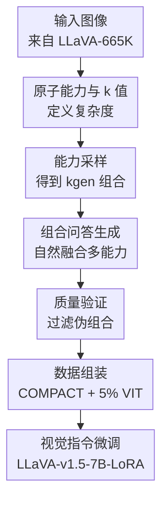

# Visual Compositional Tuning

**会议**: ICLR 2026  
**OpenReview**: [https://openreview.net/forum?id=073WQjmWKU](https://openreview.net/forum?id=073WQjmWKU)  
**论文**: [https://princetonvisualai.github.io/compact/](https://princetonvisualai.github.io/compact/)  
**代码**: 有项目页，代码未在缓存中确认  
**领域**: 多模态VLM / 视觉指令微调 / 数据高效训练  
**关键词**: 视觉组合调优, 多模态大模型, 指令微调, 数据合成, 组合泛化

## 一句话总结
COMPACT 把视觉指令微调样本从“单一视觉能力问答”改造成“多个原子视觉能力自然组合的一问一答”，用 10% 的 LLaVA-665K 数据量达到甚至略超完整视觉指令微调的平均效果。

## 研究背景与动机
**领域现状**：多模态大模型的视觉指令微调（Visual Instruction Tuning, VIT）长期沿着“数据越多越好”的路线扩张。LLaVA-665K 已经是一个常用基准，Cambrian-10M 和 Eagle 系列又把指令微调数据继续放大，模型在 VQA、OCR、图表理解、空间推理等任务上确实随规模提升而变强。

**现有痛点**：问题在于，大规模 VIT 数据里很多样本的信息密度并不高。大量问答只要求模型看图中的一个局部属性，例如“车是什么颜色”“图里有什么动物”，模型只需要用到物体识别或颜色识别这样的单一能力，就能给出答案。这类样本有助于学习格式和基本视觉对齐，但没有充分利用一张图里同时存在的空间关系、动作、文字、数量、场景等信息。

**核心矛盾**：传统扩量把复杂性当成数据规模的副产物，希望海量样本里自然出现足够多复杂组合；而视觉推理真正困难的地方往往是把多个基础视觉能力绑定起来。比如“车左边的物体是什么颜色”同时需要识别车、定位左侧物体、判断颜色。若训练数据中这些组合模式稀少，模型在复杂 benchmark 上就容易只学会局部捷径。

**本文目标**：作者想回答一个更细的问题：能不能不盲目增加样本数，而是提高每个样本需要调用的视觉能力数量，让同一张图贡献更多训练信号？具体来说，论文需要定义什么叫“样本复杂度”，找到可组合的视觉原子能力，并给出一个可以自动生成、过滤、组装训练数据的配方。

**切入角度**：作者从 LLaVA-665K 的问题复杂度分布入手，发现其平均复杂度约为 $k=1.95$，77% 的问题只需要两个或更少原子视觉能力。探索实验进一步显示，在生成方式不变的情况下，把部分问题的 $k$ 值往右推一格，会带来更好的下游表现。这说明“提高样本复杂度”本身可能是有效训练信号，而不只是换了生成器或换了数据源。

**核心 idea**：COMPACT 用一组原子视觉能力作为积木，先采样能力组合，再让 VLM 生成必须同时使用这些能力的简洁问答，并用验证器过滤掉伪组合样本，从而用更少数据完成更高密度的视觉组合调优。

## 方法详解
### 整体框架
COMPACT（COMPositional Atomic-to-complex Visual Compositional Tuning）本质上是一个视觉指令微调数据配方，而不是新的模型结构。它先定义 10 类原子视觉能力，用 $k$ 值表示一个问题需要多少类能力；然后对每张图采样若干能力组合，生成自然融合这些能力的问答，过滤低质量或不匹配的问题，最后把合成的组合调优数据和少量原始 LLaVA-665K 指令数据混合，用来微调 LLaVA-v1.5-7B-LoRA。

整个流程里有两个角色分工很清楚：COMPACT 合成数据负责逼模型学习“看得更全、组合得更准”的视觉推理；5% 原始 VIT 子集负责保留多选、短答、长答等 benchmark 所需的回答格式。这样做避免了让复杂合成问答同时承担视觉能力学习和格式对齐两件事。

### 关键设计
**1. 原子能力与 $k$ 值：把“复杂视觉问题”变成可控的数据变量**

COMPACT 的第一步是把视觉推理拆成可组合的原子视觉能力。论文定义了 10 类能力，分成三组：属性类包括颜色和形状；识别类包括物体识别、动作识别、文本识别、计数、空间识别；关系类包括空间关系、物体交互和场景理解。一个问题所需的原子能力集合记作 $\{c_1, \ldots, c_k\}$，其复杂度就是 $k$，也就是回答该问题必须同时调用的能力数量。

这个定义的价值在于，它把原本很模糊的“问题更难”转成了可采样、可统计、可消融的训练变量。比如“车是什么颜色”大致是物体识别加颜色，$k=2$；“车左侧物体是什么颜色”还要理解空间关系，$k=3$。作者并不声称这 10 类能力覆盖全部多模态任务，也承认能力之间不完全正交，例如物体识别常常是其他能力的基础。但对数据配方来说，关键不是完美 taxonomy，而是能稳定生成“需要整合更多图像信息”的训练样本。

**2. 能力采样：用 $k_{gen}$ 控制每张图被挖掘出的视觉信息密度**

在生成阶段，COMPACT 从 LLaVA-665K 随机取图，并为每张图从 10 类能力中均匀采样 $k_{gen} \in \{1,2,3\}$ 个能力。这里 $k_{gen}$ 不是最终问题复杂度，而是生成问题时指定的下界，因为生成器可能隐式引入物体识别，空间识别、空间关系和场景理解也经常自然共现，所以最终 $k$ 往往满足 $k_{gen} \le k$。

为了避免同一张图被反复问相似问题，采样时会优先选择该图还没用过的能力，并丢弃重复的能力组合。这一点很重要：COMPACT 不是简单把一个复杂 prompt 套在所有图上，而是让每张图围绕不同视觉能力组合产生多个训练信号。对于一张信息丰富的图，它可能产生颜色+空间关系+物体识别的问题，也可能产生文本识别+场景理解的问题，从而让模型在同一视觉内容上学习不同的绑定方式。

**3. 组合问答生成：要求能力自然融合，而不是把多个简单问题拼接起来**

COMPACT 使用 Gemini-2.0-Flash 生成一轮问答，并要求问题必须依赖图像、答案必须简短、问题必须自然整合采样到的能力，不能用 “and” 或逗号把多个单能力问题机械拼成一句。这个约束直接对应论文想解决的核心痛点：训练样本要让模型完成多能力绑定，而不是在一个样本里回答多个互不相关的小题。

例如，一个坏问题是“车是什么颜色，并且它在哪里”，这只是两个子问题并列；一个更符合 COMPACT 的问题是“停在红砖楼旁边的车是什么颜色”，模型需要先定位红砖楼，再找到相邻车辆，再识别颜色。作者还要求问题只询问图中确实存在、答案明确的内容，避免“这个人可能在想什么”之类主观题。这使得合成样本更像视觉监督，而不是语言想象。

**4. 质量验证与数据组装：过滤伪组合，同时把格式学习交给少量原始 VIT**

生成器并不总能真正使用所有指定能力，所以 COMPACT 又用 Gemini 做验证：判断生成的问题是否确实需要指定的 $k_{gen}$ 个能力，过滤置信度低于 70%、答案无信息（如 unknown、not visible、yes/no）、与同图已接受问题词重合超过 60%、或能力要求不匹配的样本。附录的失败模式分析显示，多阶段过滤约拒绝 21% 的生成问题，其中能力不匹配在高 $k$ 问题中尤其常见，说明验证步骤不是形式上的清洗，而是在阻止“看起来复杂、实际只问单能力”的伪组合样本混入训练。

最后的数据组装也很克制：COMPACT 使用 32K 合成组合调优样本，再混入 5% LLaVA-665K，也就是约 33K 原始 VIT 样本，总量 65K。原始 VIT 子集保留多选、短答、长答等响应格式适配，合成数据则专注视觉能力组合。消融显示，加入很少量 VIT 数据后性能明显改善，并在约 5% 附近趋于稳定；继续加到 7% 反而开始出现收益递减。这支持了作者的判断：格式对齐和视觉组合学习可以分工处理。

### 一个完整示例
假设输入图像是一辆车停在建筑物旁边，原始 VIT 数据可能问“车是什么颜色”，模型只需要找到车并识别颜色，复杂度约为 $k=2$。COMPACT 会先采样一个能力组合，例如颜色、空间关系、物体识别，对应 $k_{gen}=3$。生成器被要求写出一个自然融合三者的问题，于是可能得到“停在红砖建筑旁边的车是什么颜色？”答案是“蓝色”或“红色”这类短语。

验证阶段会检查三件事：这个问题是否必须看图才能回答；是否真的需要识别建筑、理解“旁边”的空间关系、再识别车的颜色；答案是否明确且不是无信息回答。如果问题被写成“车是什么颜色，建筑在哪里”，它会因为不是自然融合而被拒；如果图里没有红砖建筑，也会因为答案不可靠而被拒。通过反复生成和过滤，COMPACT 为同一张图收集 2-3 个高质量组合问答，而不是盲目堆很多相似单问。

### 损失函数 / 训练策略
论文没有提出新的训练损失，而是沿用 LLaVA-v1.5 的 LoRA 视觉指令微调设置，对预 VIT 的 LLaVA-v1.5-7B-LoRA checkpoint 训练 1 个 epoch。主要变量是训练数据配方：默认 COMPACT 由 32K compositional tuning data 和 5% LLaVA-665K VIT 子集组成，总量约 65K。

训练策略可以概括为：用原始 VIT 小子集学习回答格式，用 COMPACT 合成问答提高视觉信息密度。作者还做了规模实验，把合成组合数据从 2K 扩到 32K，并与同等样本量的随机 VIT 子集比较；结果表明 COMPACT 的实线曲线整体高于随机 VIT 的虚线曲线，尤其在 SeedBench2Plus、MM-Vet 这类更依赖组合视觉能力的 benchmark 上收益明显。

## 实验关键数据

### 主实验
COMPACT 的主实验使用 LLaVA-v1.5-7B-LoRA，在相同训练配置下比较完整 LLaVA-665K、随机子集、多个数据筛选方法以及 COMPACT。最核心的结论是：COMPACT 只用 65K 样本，就达到完整 665K VIT 的 100.18% 相对平均表现；相比 ICONS 的 97.47% 和随机子集的 95.38%，说明它不是单纯“少量数据也能训”，而是合成样本的信息密度更高。

| Recipe | #Data | InfoVQA | TextVQA | MM-Vet | MMStar | LLaVA-W | 相对表现 |
|--------|-------|---------|---------|--------|--------|---------|----------|
| LLaVA-665K | 665K | 20.80 | 46.99 | 29.22 | 35.11 | 68.50 | 100.00% |
| Random | 65K | 20.05 | 42.88 | 30.46 | 34.13 | 64.30 | 95.38% |
| ICONS | 65K | 21.00 | 43.12 | 31.23 | 35.96 | 61.80 | 97.47% |
| COMPACT | 65K | 23.68 | 44.37 | 31.74 | 36.13 | 64.50 | 100.18% |

更值得注意的是，COMPACT 不是在所有任务上简单全面碾压完整 LLaVA-665K。它在 TextVQA 和 LLaVA-W 上略低于 full VIT，但在 InfoVQA、MM-Vet、MMStar 这类更需要图文信息整合、空间关系或实例推理的任务上更强。这与论文“组合能力更适合复杂视觉任务”的解释是一致的。

### 消融实验
作者做了多组消融来拆解收益来源：一组控制能力分布和 $k$ 值分布，说明高复杂度确实贡献了增益；一组改变 $k_{gen}$ 范围，说明只要高复杂样本还不够，简单到复杂的混合分布更好；另一组改变原始 VIT 混入比例，说明少量格式对齐数据非常关键。

| 配置 | 数据量 | 关键指标 | 说明 |
|------|--------|----------|------|
| Random | 49K | 96.28% Rel. | 同等规模随机 LLaVA-665K 子集 |
| COMPACTllava | 49K | 97.55% Rel. | 生成器相同，但能力和 $k$ 分布匹配 LLaVA，控制复杂度 |
| COMPACT | 49K | 98.83% Rel. | 使用更高 $k$ 的组合调优数据 |
| COMPACT (Qwen3 generator) | 65K | 98.31% Rel. | 换开源 Qwen3-VL-4B-Instruct 生成器，仍优于大多数 65K baseline |

能力消融也很有信息量。去掉 scene understanding 平均相对表现下降 5.2%，去掉 spatial relationship 下降 4.9%，去掉 text recognition 下降 4.7%，去掉 object recognition 下降 4.0%；shape 的下降最小，为 0.7%。这说明 COMPACT 的收益不是某一个标签偶然带来的，而是多种视觉能力组合共同提供训练信号，其中场景、空间、文本和物体 grounding 尤其重要。

### 关键发现
- COMPACT 的 65K 数据达到 100.18% 相对表现，而完整 LLaVA-665K 是 100.00%，说明在固定模型和训练设置下，提高样本复杂度可以抵消约 90% 的数据量缺口。
- 高 $k$ 训练数据对高 $k$ 测试问题更有帮助。MMStar 上，$k_{gen}=1,2,3$ 相比 $k_{gen}=1$ 在 $k=3$ 问题提升 22.7%，在 $k=4$ 问题提升 33.5%，但在 $k=1$ 问题略降 0.5%，说明复杂样本不是越纯越好，仍需要简单样本帮助拆解基础能力。
- 知识密集型任务收益有限。OK-VQA、MMMU、MMMU-Pro 上 COMPACT 相比随机子集有小幅提升，但仍明显落后或接近完整 VIT，说明本文方法主要改善视觉中心能力组合，不直接解决外部知识、数学或专业推理。
- COMPACT 的 token 也更省：32K 样本对比中，COMPACT 每条约 104.87 tokens，LLaVA 子集约 197.42 tokens，减少 46.88%；答案平均只有 1.70 tokens，说明它用短问短答集中训练视觉绑定，而不是靠长文本输出堆监督。

## 亮点与洞察
- 把 VIT 数据质量问题从“选哪些样本”转成“每个样本需要多少视觉能力”。这个视角很清楚地解释了为什么简单问答会浪费图像信息，也给数据合成提供了可控旋钮。
- $k$ 值虽然粗糙，但足够有操作性。它不追求定义一个完美认知复杂度指标，而是服务于采样、生成、验证和消融，工程上很实用。
- COMPACT 的关键不只是生成复杂问题，而是防止“伪复杂”。论文明确过滤并列拼接、无信息答案、重复问题和能力不匹配，这让组合调优更像有效监督，而不是 prompt engineering 噪声。
- “原始 VIT 管格式，COMPACT 管视觉组合”是一个可迁移的数据配方。其他 VLM 训练也可以把格式对齐、领域知识、视觉组合能力拆成不同数据源，而不是让一个巨型混合数据集承担所有目标。
- 结果对当前多模态数据扩张路线有提醒：如果 benchmark 需要的是空间、文本、计数、关系的组合，继续增加低 $k$ 样本可能边际收益很低；更好的方向是让单样本覆盖更多图像内容。

## 局限与展望
- 主要生成器是 Gemini-2.0-Flash，属于闭源模型。论文补充了 Qwen3-VL-4B-Instruct 的实验，结果仍有 98.31% 相对表现，但低于 Gemini 版 COMPACT，说明生成器能力和偏差会影响最终训练数据质量。
- 数据生成成本不为零。附录提到生成 32K 组合调优数据大约 2 小时、32 个并行进程、约 86.5 美元 API 成本；对大规模复现实验或频繁迭代 taxonomy 的团队来说仍有门槛。
- 原子能力 taxonomy 只覆盖视觉中心任务，没有覆盖文化知识、历史常识、数学、代码等非感知能力。因此 COMPACT 在知识密集 benchmark 上提升有限，不能直接替代更广泛的多模态后训练数据。
- $k$ 值把“能力数量”当作复杂度，但没有刻画能力之间的难度差异。同样是 $k=2$，文本识别+空间关系可能比颜色+物体识别难得多；未来可以把能力权重、图像内容复杂度和问题语言复杂度一起纳入采样。
- 生成验证仍可能漏掉错误。附录承认残留失败包括高 $k$ 问题过难、VLM 误识别图像内容、空间关系歧义、遮挡物体属性不可见等，这些会给训练引入一定噪声。

## 相关工作与启发
- **vs LLaVA 视觉指令微调**: LLaVA-665K 依靠大规模人工或模型生成指令数据训练通用视觉指令跟随能力，本文则保留少量 LLaVA 数据做格式对齐，把新增数据集中用于多原子能力组合。优势是数据效率高，劣势是仍依赖 LLaVA 图像来源和基础训练框架。
- **vs ICONS 等数据选择方法**: ICONS、EL2N、Perplexity、SemDeDup、D2-Pruning 等方法主要从已有 VIT 数据中挑选高价值子集，COMPACT 则重新生成更复杂的问答。前者节省生成成本，后者能主动改变复杂度分布，实验中 COMPACT 的 65K 相对表现高于 ICONS。
- **vs compositional evaluation benchmarks**: MMStar、MM-Vet、ConceptMix、MMComposition 等工作强调评测组合视觉能力，COMPACT 把组合性从评测端移到训练数据构造端。这个转向很有启发：如果 evaluation 暴露了组合短板，training data 就应该显式覆盖这些组合模式。
- **vs 大规模 VIT 数据扩张**: Cambrian、Eagle 等路线强调用更多数据覆盖更多能力，COMPACT 证明在至少一部分视觉中心任务上，“单样本更复杂”可以替代“样本更多”。两条路线并不冲突，未来可以在千万级数据中进一步控制复杂度分布。

## 评分
- 新颖性: ⭐⭐⭐⭐☆ 用原子视觉能力和 $k$ 值控制 VIT 样本复杂度，思路直接但抓住了数据效率的关键变量。
- 实验充分度: ⭐⭐⭐⭐☆ 主实验、分布控制、$k_{gen}$、VIT 混入比例、能力消融、开源生成器和失败模式都覆盖到了，但更大模型和更多数据源还可以补。
- 写作质量: ⭐⭐⭐⭐⭐ 论文叙事很清晰，从复杂度观察到数据配方再到消融验证，读者很容易理解为什么每一步必要。
- 价值: ⭐⭐⭐⭐⭐ 对 VLM 后训练数据构造很有实用价值，尤其适合指导“少数据但高信息密度”的视觉指令微调流程。

<!-- RELATED:START -->

## 相关论文

- [\[ICLR 2026\] Revisit Visual Prompt Tuning: The Expressiveness of Prompt Experts](revisit_visual_prompt_tuning_the_expressiveness_of_prompt_experts.md)
- [\[NeurIPS 2025\] Advancing Compositional Awareness in CLIP with Efficient Fine-Tuning](../../NeurIPS2025/multimodal_vlm/advancing_compositional_awareness_in_clip_with_efficient_fin.md)
- [\[ICLR 2026\] CoMem: Compositional Concept-Graph Memory for Vision-Language Adaptation](comem_compositional_concept-graph_memory_for_visionlanguage_adaptation.md)
- [\[NeurIPS 2025\] Visual Instruction Bottleneck Tuning](../../NeurIPS2025/multimodal_vlm/visual_instruction_bottleneck_tuning.md)
- [\[CVPR 2026\] LLaDA-V: Large Language Diffusion Models with Visual Instruction Tuning](../../CVPR2026/multimodal_vlm/llada-v_large_language_diffusion_models_with_visual_instruction_tuning.md)

<!-- RELATED:END -->
