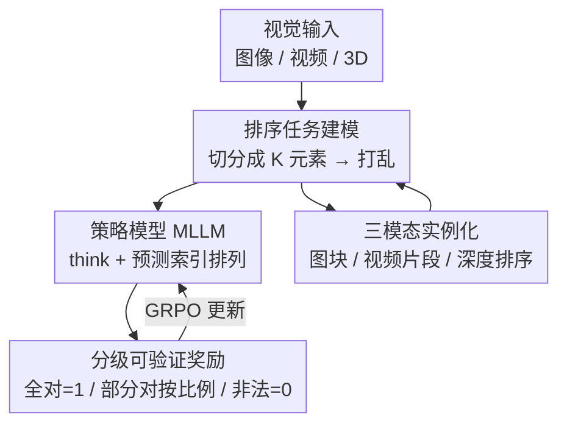

# Visual Jigsaw Post-Training Improves MLLMs

**会议**: ICLR 2026  
**OpenReview**: [https://openreview.net/forum?id=tBf2SUzfZw](https://openreview.net/forum?id=tBf2SUzfZw)  
**论文**: [Project Page](https://penghao-wu.github.io/visual_jigsaw/)  
**代码**: 见项目主页  
**领域**: 多模态VLM  
**关键词**: 自监督后训练, RLVR, 拼图任务, 视觉感知, MLLM

## 一句话总结
把"打乱再排序"的经典拼图任务搬进 MLLM 的强化学习后训练阶段，让模型在不改架构、不加生成模块、不需任何标注的情况下，通过自监督的可验证奖励显著增强对图像、视频、3D 三种视觉模态的细粒度感知、时序理解与空间理解能力。

## 研究背景与动机
**领域现状**：RLVR（可验证奖励强化学习）在 LLM 上点燃了复杂推理能力后，多模态社区迅速把同一套范式搬到 MLLM 上，绝大多数工作都在做基于文本的多模态思维链（CoT），主攻数学、科学这类需要长推理的任务。

**现有痛点**：在这种"文本中心"的后训练里，稠密的视觉输入往往只是一个上下文证据池——模型从图里抽出几条稀疏线索就转去做文本推理，视觉信号本身的深层细粒度理解被严重低估。少数想补这块的工作（如显式加视觉重建目标）又要往现成的理解型 MLLM 上嫁接额外的视觉生成模块和像素级重建损失，既改了架构，也未必是增强视觉理解的最优路径。

**核心矛盾**：能不能在**不改架构、不改输出格式**（仍然只吐文本）、不引入生成组件的前提下，直接强化 MLLM 对视觉信号本身的理解？像素级重建的高保真要求，对一个以"理解"为目标的模型来说可能是过度的负担。

**本文目标**：找到一个轻量、可自动验证、与现有纯文本 MLLM 无缝兼容、且跨模态通用的视觉中心后训练任务。

**切入角度**：回看自监督表示学习的历史，拼图类任务（打乱图块重排、恢复视频帧序）是一种"重建/生成任务的简化版"——它只要求恢复**结构顺序**而非像素，天然产出确定性的 ground-truth，正好契合 RLVR 的可验证奖励范式，也不需要任何人工标注。

**核心 idea**：把视觉理解重新表述成一个"排序问题"——将视觉输入切块、打乱，让 MLLM 用自然语言输出正确的排列顺序，用 GRPO 在后训练阶段优化，从而把视觉中心的感知能力注入模型。

## 方法详解

### 整体框架
Visual Jigsaw 是一个通用的"视觉排序"自监督后训练框架。给定某一视觉模态（图像 / 视频 / 3D）的数据，先用模态特定的切分规则得到 $K$ 个拼图元素（图像切成图块、视频切成片段、3D 采样若干带深度的点），随机打乱后喂给策略模型；模型必须预测一个长度为 $K$ 的索引排列，把它还原成原始结构顺序。这个排列与确定的 ground-truth 比对，按"放对了几个"给出分级奖励，用 GRPO 做强化学习更新。整个过程不需要标注、不需要额外生成头、输出仍是纯文本，因此可以直接套在任意现成 MLLM 上。

为什么放在**后训练**阶段：解拼图要求模型已经具备基础的视觉理解（否则连图块里有什么都认不出），而且 RL 相比 SFT 有更强的泛化性，能让模型把从拼图里学到的视觉技能迁移到下游任务，而不是死记拼图本身。

### 关键设计

**1. 把视觉理解重写成可验证的排序任务：RLVR 友好且零标注**

针对"想强化视觉理解又不想改架构、加生成模块、做标注"这个核心矛盾，本文把任务统一建模成排序：对模态数据施加一个随机置换 $\pi:\{1,\dots,K\}\to\{1,\dots,K\}$，原本在位置 $i$ 的元素被移到位置 $\pi(i)$，打乱序列为 $P_\pi=[p_{\pi^{-1}(1)},\dots,p_{\pi^{-1}(K)}]$，模型的目标是预测出 $[\pi(1),\dots,\pi(K)]$ 把它还原。这样的好处是三重的：ground-truth 是一串确定的索引，**自动可验证**，正好套进 RLVR；输出只是一串数字，**纯文本即可**，与现成 MLLM 无缝兼容；监督信号从数据本身派生，**完全不需要标注**。相比那些要嫁接视觉生成头、做像素级重建的方案，排序只要求恢复结构顺序，是重建任务的"简化版"——避开了高保真重建的负担，却保留了有效的自监督信号。

**2. 分级部分正确奖励：让难拼图也能被学起来**

如果只给二元奖励（全对才给分），在 $3\times3$ 这种较难配置下，训练早期模型几乎从来全对，反馈极度稀疏，根本学不动。本文设计了一个分级奖励：完全匹配给 1；合法但只对了一部分的排列，奖励等于"放对的比例"再乘一个折扣因子 $\gamma\in(0,1)$（实验取 $0.2$）；任何不是合法长度 $K$ 排列的输出（如所有位置预测同一个索引）给 0。形式上

$$
\text{Reward}(o,g)=\begin{cases}1, & o=g\\[2pt]\gamma\cdot\frac{1}{K}\sum_{i=1}^{K}\mathbb{1}[o_i=g_i], & \text{合法排列且 }o\neq g\\[2pt]0, & \text{否则}\end{cases}
$$

折扣 $\gamma$ 的作用是惩罚"不完整解"、防止模型高估部分匹配，但又不至于把部分正确的微弱学习信号也抹掉。对非法排列直接判 0 则杜绝了"全填同一个数"这类奖励作弊。此外还加了 0.2 的格式奖励，要求把思考放进 `<think></think>`、答案放进 `<answer></answer>`，格式错则格式与准确率奖励全为 0。消融显示：在 $3\times3$ 这种难配置上，去掉部分正确奖励模型直接学不会——这是该设计的关键价值所在。

**3. 三模态实例化：同一套排序范式覆盖图像、视频、3D**

为证明范式的通用性，本文把排序任务实例化到三种模态，难点在于"如何为每种模态定义有意义、又不能靠捷径作弊的切分方式"。**图像拼图**把图切成 $m\times n$ 个不重叠图块（取 $3\times3=9$ 块，COCO 11.8 万张图训练），模型按光栅顺序（行优先、左上到右下）恢复排列，逼它同时关注局部图块细节、推断全局空间布局、推理图块间关系。**视频拼图**沿时间轴均匀切成 $K=6$ 个片段（LLaVA-Video 10 万条），模型恢复时间先后顺序；为防止模型靠片段边界的"帧匹配"捷径作弊，把每段首尾各 5% 的帧裁掉。**3D 拼图**因为通用 MLLM 一般经 2D 图像/视频处理 3D，作者做了个实用变体：从 RGB-D 图里随机取 $K=6$ 个深度各异的点（ScanNet，30 万样本，深度限 0.1–10 m、两点间距 ≥40 像素且深度差 >0.2 m），在 RGB 视图上标注序号，让模型按由近到远的深度排序。三种实例化共享同一套奖励与 GRPO 优化，只换切分规则。

### 损失函数 / 训练策略
基座统一用 Qwen2.5-VL-7B-Instruct。优化用 GRPO，并**去掉 KL 正则与熵损失**；部分正确折扣 $\gamma=0.2$。图像拼图全局 batch 256、视频/3D 为 128，学习率 $1\times10^{-6}$，每个 prompt 采样 16 条回复、解码温度 1.0。图像、视频拼图各训 1000 步，3D 拼图训 800 步。（注：在推理型 MLLM 上做拼图训练时则**开启** KL 约束，以保住已有的推理能力。）

## 实验关键数据

### 主实验
三种模态都以 Qwen2.5-VL-7B 为基座，对比同样从它后训练而来的若干方法。图像拼图在细粒度感知、单目空间、组合理解三类共 13 个 benchmark 上一致提升：

| 模态 / 基准 | 指标 | 基座 Qwen2.5-VL-7B | 本文 | 提升 |
|--------|------|------|------|------|
| 图像·MMVP | acc | 54.66 | 60.66 | +6.00 |
| 图像·MMStar(细粒度) | acc | 59.75 | 65.81 | +6.06 |
| 图像·V* | acc | 76.96 | 80.63 | +3.66 |
| 图像·DA-2K | acc | 54.45 | 60.35 | +5.90 |
| 视频·AoTBench(vqa,16帧) | acc | 45.52 | 51.67 | +6.15 |
| 视频·Vinoground(64帧) | group | 21.80 | 25.20 | +3.40 |
| 3D·SAT-Real | acc | 48.66 | 64.00 | +15.34 |
| 3D·DA-2K | acc | 54.45 | 71.56 | +17.11 |

3D 拼图在与深度排序直接相关的 DA-2K 上涨幅最大（+17.11），但在单视图（3DSRBench）、多视图（ViewSpatial、All-Angles）、第一人称视频（VSI-Bench）等间接任务上同样一致上升，说明它不仅教会了"深度排序"这一具体技能，还泛化成了通用的 3D 空间感知能力。

### 消融实验

| 配置 | 关键指标 | 说明 |
|------|---------|------|
| Image Jigsaw (RL, 完整) | 多基准一致提升 | 完整方法 |
| Image Jigsaw (SFT) | 部分基准小幅提升，LISA-Grounding/OVD-Eval 大幅下降 | SFT 易过拟合拼图、迁移失败 |
| 2×2 图像拼图 | 平均 61.0（基座 58.9） | 难度低，增益明显小于 3×3 |
| 3×3 图像拼图 | 平均 62.1 | 标准难度，增益最大 |
| 4-clip 视频拼图 | 平均 45.0（基座 44.0） | 难度低，增益小 |
| 6-clip 视频拼图 | 平均 46.2 | 标准难度，增益最大 |
| 3×3 去掉部分正确奖励 | 学不会任务 | 稀疏二元反馈无法冷启动 |

### 关键发现
- **RL 远强于 SFT**：SFT 只带来温和提升，且在 LISA-Grounding、OVD-Eval 上反而大幅掉点，说明它把拼图死记下来却没法迁移；RL 才能把视觉技能泛化到下游，印证"SFT 偏记忆、RL 偏泛化"。
- **难度越高、信号越强**：$2\times2$、4-clip 这类简单拼图也有增益，但明显小于标准的 $3\times3$、6-clip——更难的拼图提供更强的监督信号。
- **难度并非越大越好**：$4\times4$ 图像拼图模型学不会，作者归因于信息稀缺（COCO ≈640×480 下小块语义不足）、语义歧义（天空/墙面等均匀块难分辨）、组合爆炸（排列空间从 $9!$ 涨到 $16!$）；8-clip 视频因 LLaVA-Video 多为 30 s 短视频、切 8 段后片段太短歧义，提升也不明显。
- **跨基座、跨推理模型都成立**：换更强的 MiMo-VL-7B-SFT 仍一致提升（图像 63.77→65.14、视频 51.84→54.47、3D 50.67→52.91）；在已做过推理 RL 的 ThinkLite-VL 上加图像拼图（开 KL 约束），视觉感知提升的同时数学推理能力（MathVista/MathVision 等）基本保持。

## 亮点与洞察
- **"重排序"是被低估的自监督富矿**：拼图在传统表示学习里曾因不如对比/掩码建模而边缘化，但作者敏锐地发现它的"确定性 ground-truth + 纯文本输出"恰好是 RLVR 时代 MLLM 后训练最缺的——同一个任务在新范式下重新焕发价值，这种"老任务配新框架"的迁移思路很值得复用。
- **用任务设计而非新模块解决问题**：不加任何生成头、不改输出格式，仅靠"怎么造监督信号"就把视觉感知拉起来，工程落地门槛极低，可直接叠加在任意现成 MLLM 上。
- **分级奖励是难任务能学起来的关键开关**：把"全对/全错"换成"放对几个按比例给分 + 折扣 + 非法判零"，一个看似工程化的小设计，实测是 $3\times3$ 能不能学会的分水岭，提醒 RLVR 中奖励稠密化对硬任务的重要性。
- **防捷径的细节很扎实**：视频裁掉首尾 5% 帧防帧匹配作弊、3D 强制点间距与深度差阈值保证任务良定义，这些约束都是"让任务真考视觉理解而非捷径"的可迁移技巧。

## 局限与展望
- **难度扩展有天花板**：$4\times4$ 图像、8-clip 视频都学不动，受限于训练数据分辨率/时长，需要更高分辨率数据、图块多样性约束、课程学习才可能突破，当前框架并非"难度越大越好"。
- **3D 是 2D 代理而非原生**：3D 拼图实际是 RGB-D 上的深度点排序，并未真正在体素/点云等原生 3D 表示上做拼图，受限于通用 MLLM 当前处理 3D 的方式。
- **任务仍偏"感知"而非"推理"**：拼图主要强化视觉中心的感知/理解，对需要长链推理的任务未必直接受益（虽在推理模型上能保住推理能力）。
- **改进方向**：把课程学习引入难度递增、为长视频设计自适应切段数、探索原生 3D 切分，都是自然的下一步。

## 相关工作与启发
- **vs Jigsaw-R1（最相关）**: 同样想把拼图引入 MLLM 后训练，但 Jigsaw-R1 连简单的 $2\times2$ 图像拼图都难学好，只好退化成预测一对图块的相对位置；本文用标准更难的 $3\times3$ 等配置系统性增强感知，且把范式扩展到视频和 3D。
- **vs 视觉重建类后训练（Wang et al. 2025b;a）**: 它们显式加视觉重建目标确实能增强理解，但要引入额外生成模块与目标、需从头联合训练、且未在 Qwen2.5-VL 这类强模型上验证；本文不改架构、纯后训练、跨三模态验证。
- **vs ViCrit / LLaVA-Critic-R1**: 它们靠检测 caption 错误或评判文本回复来提升感知，但训练信号最终系于"文本-图像对齐"；本文的信号直接来自视觉信号本身的结构理解。
- **vs 文本中心的多模态推理后训练（ThinkLite-VL / VL-Cogito）**: 它们把视觉当作抽取稀疏线索的上下文、主攻文本 CoT，在视觉中心 benchmark 上反而不如本文；二者可互补叠加（在 ThinkLite-VL 上加拼图既提感知又保推理）。

## 评分
- 新颖性: ⭐⭐⭐⭐ 老拼图任务嫁接 RLVR 后训练，跨三模态统一，角度新颖但属"旧任务新框架"
- 实验充分度: ⭐⭐⭐⭐⭐ 三模态 30+ benchmark、多基座、SFT/RL 与难度消融、含失败配置分析，非常扎实
- 写作质量: ⭐⭐⭐⭐⭐ 动机推导清晰，任务形式化与奖励定义严谨，失败案例诚实
- 价值: ⭐⭐⭐⭐⭐ 零标注、不改架构、可直接叠加，落地门槛极低且增益稳定

<!-- RELATED:START -->

## 相关论文

- [\[ICML 2026\] Med-Scout: Curing MLLMs' Geometric Blindness in Medical Perception via Geometry-Aware RL Post-Training](../../ICML2026/multimodal_vlm/med-scout_curing_mllms_geometric_blindness_in_medical_perception_via_geometry-aw.md)
- [\[ICLR 2026\] Post-hoc Probabilistic Vision-Language Models](post-hoc_probabilistic_vision-language_models.md)
- [\[AAAI 2026\] Revisiting the Data Sampling in Multimodal Post-training from a Difficulty-Distinguish View](../../AAAI2026/multimodal_vlm/revisiting_the_data_sampling_in_multimodal_post-training_from_a_difficulty-disti.md)
- [\[ICLR 2026\] OmniVideoBench: Towards Audio-Visual Understanding Evaluation for Omni MLLMs](omnivideobench_towards_audio-visual_understanding_evaluation_for_omni_mllms.md)
- [\[ICML 2026\] FreeRet: MLLMs as Training-Free Retrievers](../../ICML2026/multimodal_vlm/freeret_mllms_as_training-free_retrievers.md)

<!-- RELATED:END -->
