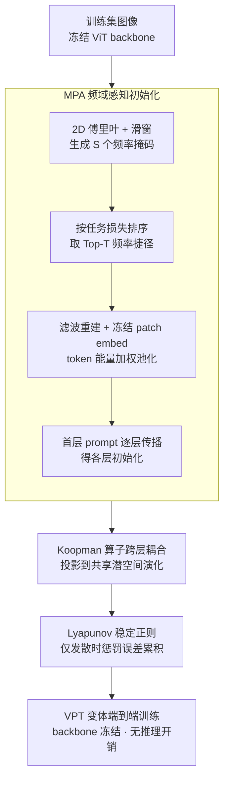

# Visual Prompt-Agnostic Evolution

**会议**: ICLR2026  
**arXiv**: [2601.20232](https://arxiv.org/abs/2601.20232)  
**代码**: [reeive/PAE](https://github.com/reeive/PAE)  
**领域**: 多模态VLM  
**关键词**: Visual Prompt Tuning, Vision Transformer, 参数高效微调, Koopman算子, 频域初始化, Lyapunov稳定性  

## 一句话总结
提出 Prompt-Agnostic Evolution (PAE)，通过频域感知的任务初始化 (MPA) 和 Koopman-Lyapunov 动力系统 (KLD) 跨层关联 prompt，加速 VPT 收敛（平均 1.41× 加速）并在 25 个数据集上提升 1–3% 精度，且对各类 VPT 变体即插即用、无推理开销。

## 背景与动机
1. **VPT 的成功与局限**：Visual Prompt Tuning (VPT) 在冻结 ViT 的每一层插入少量可学习 prompt token 实现下游适配，参数高效但实际训练中收敛慢、精度不佳。
2. **梯度振荡问题**：作者实验发现多种 VPT 变体在训练过程中存在显著的梯度振荡，尤其在训练早期和中期最为严重。
3. **跨层不匹配**：逐层梯度分析揭示浅层 prompt 在训练初期梯度激增后迅速停滞，而深层 prompt 则出现高方差振荡，导致层间优化严重不协调。
4. **任务无关的初始化**：现有 VPT 变体的 prompt 初始化策略对下游任务不敏感，导致早期梯度主要在与预训练backbone对齐上浪费，需要较高学习率反而加剧不稳定。
5. **层间独立优化**：各层 prompt 被独立预置和优化，梯度需穿过多个冻结层反传，浅层信号衰减严重而深层被过度调整，缺乏显式跨层协调。
6. **VPT 变体涌现但根本问题未解**：结构化 prompt、自适应 prompt、投影式 prompt、感知驱动 prompt 等四大方向的改进均未从根本上解决上述训练动态问题。

## 方法详解

### 整体框架
PAE 把"如何让 VPT 训得又快又稳"拆成两件互补的事，对应训练前和训练中两个阶段。训练开始前，MPA（Modal Pre-Alignment，模态预对齐）模块做一次频域感知的任务初始化：它先在训练集上搜出 backbone 最依赖的"频率捷径"，把它们编码成第一层 prompt，再逐层传播得到与 backbone 层级语义对齐的各层初始 prompt，让训练一开始就把梯度投在任务相关方向、而不是浪费在和 backbone 重新对齐上。训练过程中，KLD（Koopman-Lyapunov Discrete dynamical system，Koopman-Lyapunov 离散动力系统）模块把原本逐层独立优化的 prompt 用一个全局共享的 Koopman 算子串成一条跨层演化轨迹，再叠一个 Lyapunov 稳定正则抑制误差沿层累积。整条流程不碰冻结的 backbone、也不改 prompt 的结构设计与推理路径，因此 MPA 和 KLD 与具体 prompt 形式正交，可即插即用地套在 VPT、E2VPT、VFPT、SA2VP、BPT 等变体上，训练完没有任何推理开销。

### 关键设计

**1. MPA 频域感知初始化：让初始 prompt 直接命中任务依赖的频率捷径**

现有 VPT 变体的 prompt 初始化与下游任务无关，早期梯度大量浪费在和 backbone 重新对齐上，反而要靠更高学习率而加剧不稳定。MPA 抓住一个已有发现——预训练视觉 backbone 做对预测时往往依赖特定的"频率捷径"——把初始化变成一次任务感知的频域搜索。它先对训练小批量做 2D 傅里叶变换，用滑动窗口（$w=16$、$\text{stride}=8$）生成 $S$ 个二值频率掩码 $M_s$，逐一作用于频谱并逆变换重建图像，按重建图在冻结模型上的任务损失 $\mathcal{L}_{\text{task},s}$ 排序，找出模型最依赖的频率区域。随后取 loss 最低的 Top-$T$ 个掩码作为频率捷径，把对应滤波图像送入冻结的 patch embedding 得到 patch token，再按 token 能量（激活范数，能量越高语义越强）加权池化，聚合成 $T$ 个代表向量拼成第一层 prompt $P_1^{init}$。

关键的一步是不对每层各搜一次，而是只搜首层、再把 $P_1^{init}$ 逐层喂入冻结的 encoder block，用各层输出当对应的初始化 $P_i^{init}$——这样初始化轨迹天然与 backbone 的层级语义一致。消融印证了这条"单次搜索 + 逐层传播"的设计：把首层 prompt 直接复制到所有层只有 73.17%、逐层独立搜索 74.29%，而传播式达到 74.84%。整套初始化仅约 74 秒（相当于 5.3 个 epoch），却让早期梯度一上来就投向任务相关方向。

**2. KLD 的 Koopman 算子：把层间独立优化变成一条显式的跨层演化轨迹**

逐层梯度分析显示，浅层 prompt 早期梯度激增后迅速停滞、深层 prompt 则高方差振荡，根源是各层 prompt 被独立优化、梯度还要穿过多个冻结层反传，缺乏显式的跨层协调。KLD 把"prompt 的逐层变化"重新表述成一个离散动力系统：引入全局可学习投影矩阵 $U\in\mathbb{R}^{d\times K}$ 把每层 prompt 抬升到共享潜空间 $z_i = P_i\,U$，再用一个全局共享的 Koopman 算子 $\mathcal{K}\in\mathbb{R}^{K\times K}$（单位矩阵初始化）在该空间里做线性演化 $\hat{z}_{i+1} = z_i\,\mathcal{K}$，即"由上一层状态预测下一层"。

一致性损失 $\mathcal{L}_{kp}$ 最小化预测态 $\hat{z}_{i+1}$ 与实际投影态 $z_{i+1}$ 的 Frobenius 范数差，使每层 prompt 同时受到来自前层和后层的约束，把原本割裂的层间优化耦合成一条平滑轨迹。之所以用一个全局算子而非每层各一个：实验里层级专属算子在第 7 层的谱半径竟超过 3（达 3.68）、演化发散，而全局算子的特征值集中在正实轴、谱半径 $\rho(\mathcal{K})<1$，CKA 上呈现清晰的对角带状结构，说明 prompt 随深度渐进分化而非全局冗余纠缠。潜空间维度 $K=256$ 时最优（太小如 64 欠拟合、太大如 384 又难优化），引入的额外参数极少。

**3. Lyapunov 稳定正则：只在演化"发散"时才惩罚，自适应抑制误差累积**

线性 Koopman 近似并不完美，误差会沿层级联放大，单靠一致性损失压不住。KLD 借 Lyapunov 稳定性理论补一个条件触发的正则：定义 Lyapunov 能量 $V(z) = \mathrm{tr}(z\,Q\,z^\top)$（$Q$ 为可学习对称正定矩阵），把"演化稳定"刻画为跨层能量不增（$V(z_{i+1})\le V(z_i)$）。只有当相邻层之间 $V$ 值上升、即演化在发散时，$\mathcal{L}_{stab}$ 才施加惩罚，对正常收缩的演化完全不干预。这相当于给跨层 prompt 轨迹装了个自适应阻尼，把梯度振荡压在稳定区间内，又不会过度约束有益的层间变化——消融里它与 $\mathcal{L}_{kp}$ 协同再带来 +1.29% 的 VTAB 增益。

### 损失函数 / 训练策略
端到端联合优化任务损失与两项正则：$L_{total} = L_{task} + \alpha\,\mathcal{L}_{kp} + \beta\,\mathcal{L}_{stab}$，默认 $\alpha=0.5$、$\beta=0.2$。MPA 在训练前一次性完成、不进入反传；KLD 的投影矩阵 $U$、Koopman 算子 $\mathcal{K}$、Lyapunov 矩阵 $Q$ 与 prompt 一起随主任务训练。

## 实验关键数据

### 表1：ViT-B/16 在 FGVC + VTAB-1k 上的分类精度与加速比

| 方法 + PAE | 加速 | FGVC | VTAB-Natural | VTAB-Specialized | VTAB-Structured | VTAB 均值 |
|---|---|---|---|---|---|---|
| Full Fine-tune | - | 88.54 | 75.88 | 83.36 | 47.64 | 68.96 |
| VPT + PAE | 1.78× | 89.11 (+1.91) | 78.48 (+3.25) | 82.43 (+2.09) | 54.98 (+3.30) | 71.96 (+2.88) |
| E2VPT + PAE | 1.65× | 89.22 (+1.74) | 80.01 (+1.38) | 84.43 (+1.33) | 57.39 (+2.34) | 73.94 (+1.68) |
| VFPT + PAE | 1.27× | 89.24 (+2.24) | 81.35 (+0.72) | 84.93 (+1.03) | 60.19 (+0.77) | 75.39 (+0.94) |
| SA2VP + PAE | 1.60× | 90.08 (+1.12) | 80.97 (+1.89) | 85.73 (+0.85) | 60.80 (+2.25) | 75.83 (+1.66) |
| BPT + PAE | 1.37× | 90.86 (+1.35) | 80.24 (+2.22) | 84.45 (+1.88) | 60.39 (+1.66) | 75.02 (+1.92) |

### 表2：消融实验（VPT baseline，ViT-B/16）

| MPA | L_kp | L_stab | FGVC | VTAB 均值 |
|---|---|---|---|---|
| ✗ | ✗ | ✗ | 89.11 | 71.96 |
| ✓ | ✗ | ✗ | 89.63 | 74.02 |
| ✗ | ✓ | ✗ | 90.56 | 73.13 |
| ✗ | ✓ | ✓ | 90.78 | 74.42 |
| ✓ | ✓ | ✓ | 91.02 | 74.84 |

- MPA 单独使用即贡献最大增量（VTAB +2.06%），KLD 两个损失协同后进一步 +1.29%。
- ADE20K 语义分割（ViT-L）：PAE 为 VPT/E2VPT/VFPT 提升 mIoU 2–3%，加速 1.15–1.29×。
- 跨架构扩展性：在 ViT-B/16、Swin-B、ViT-L/16、ViT-H/14 上均一致有效。
- Prompt CKA 可视化：PAE 使 prompt 呈现清晰的对角带状结构，表明渐进式深度感知演化取代了全局冗余。
- 高方差难类受益最大：类内方差越大的类别从 PAE 获得越大的相对精度提升。

## 亮点
- **首次将 VPT 形式化为 prompt 轨迹的动力系统控制问题**，提供了全新视角。
- **频域初始化 (MPA) 深刻利用了 backbone 的频率偏置**，无需额外数据或预训练即可实现任务感知初始化。
- **Koopman 算子跨层耦合**巧妙解决了 VPT 层间独立优化导致浅层停滞、深层振荡的核心瓶颈。
- **即插即用、无推理开销**：可集成到 8 种不同 VPT 变体中，对 backbone 零修改。
- **实验极其充分**：涵盖 25 个数据集、4 种 backbone 架构、分类+分割任务、多维度可视化分析。
- **损失景观分析**：PAE 使优化收敛到更宽更平的极小值，Hessian 最大特征值和条件数均显著下降，理论上解释了更好的泛化性。
- **Grad-CAM 可视化**：VPT+PAE 在训练极早期（epoch 5）即聚焦类别判别区域，vanilla VPT 到 epoch 50 仍不稳定。
- **初始化代价极低**：MPA 全部初始化过程仅 74 秒，相当于 ~5 个训练 epoch，性价比极高。

## 局限与展望
- Koopman 算子假设层间 prompt 演化近似线性，对于非常深或异构架构中这一假设可能不成立。
- MPA 的频率窗口搜索虽轻量但仍引入额外预处理时间（~74s），在大规模连续学习场景中可能累积。
- 实验主要集中在图像分类和语义分割，尚未验证在检测、视频理解等更复杂视觉任务上的泛化性。
- 超参数 α、β 的选择未提供自适应方案，不同数据集可能需单独调整。
- Koopman 空间维度 K=256 的选取缺乏理论指导。
- 论文未探讨 PAE 与文本 prompt tuning（如 CoOp/CoCoOp）的结合可能性。
- 对自监督预训练（MAE）backbone 的改进幅度未单独报告分类精度，仅展示了 CKA 可视化。

## 与相关工作的对比
- **vs. VPT/E2VPT/ProVP 等结构化 prompt**：PAE 不改变 prompt 结构设计，而是从初始化和优化动态层面增强，二者正交互补。
- **vs. VFPT（频域 prompt）**：VFPT 在频域重加权 prompt 特征，PAE 则用频域发现任务捷径初始化 prompt，出发点不同；PAE 应用于 VFPT 仍有 +0.94% 增益。
- **vs. GatePT**：GatePT 通过门控机制调整 prompt，但 CKA 分析显示其跨层 prompt 仍高度冗余，PAE 的 Koopman 演化实现了更优的渐进深度分化。
- **vs. LoRA/Adapter 等其他 PEFT**：PAE 专注于 prompt tuning 范式的优化加速，与 LoRA 是不同的 PEFT 路线，可能可以组合使用。
- **vs. LPT（自适应 prompt）**：LPT 动态组合共享和组特定 prompt 应对长尾分布，PAE 在其上仍可叠加使用，加速 1.44× 并提升 VTAB 均值 +1.81%。
- **vs. Full Fine-tuning**：多个 VPT + PAE 组合在 VTAB-1k 上显著超越全参微调（如 SA2VP+PAE 75.83% vs Full 68.96%），参数量仅为其 1% 以下。

## 评分
- 新颖性: ⭐⭐⭐⭐ — 动力系统视角重构 VPT 优化，Koopman+Lyapunov 理论框架原创性强
- 总体: 极具实用价值的 prompt tuning 增强工作，理论与实践并重
- 实验充分度: ⭐⭐⭐⭐⭐ — 25 个数据集、8 种 VPT 变体、4 种架构、分类+分割、消融+可视化全面
- 写作质量: ⭐⭐⭐⭐ — 问题动机清晰、理论推导完整，但符号较多读起来较重
- 价值: ⭐⭐⭐⭐ — 即插即用的通用 VPT 加速器，对 prompt tuning 社区有直接实用价值

<!-- RELATED:START -->

## 相关论文

- [\[ICLR 2026\] Revisit Visual Prompt Tuning: The Expressiveness of Prompt Experts](revisit_visual_prompt_tuning_the_expressiveness_of_prompt_experts.md)
- [\[ICLR 2026\] ViPER: Empowering the Self-Evolution of Visual Perception Abilities in Vision-Language Models](viper_empowering_the_self-evolution_of_visual_perception_abilities_in_vision-lan.md)
- [\[NeurIPS 2025\] VIPAMIN: Visual Prompt Initialization via Embedding Selection and Subspace Expansion](../../NeurIPS2025/multimodal_vlm/vipamin_visual_prompt_initialization_via_embedding_selection_and_subspace_expans.md)
- [\[ICCV 2025\] PRO-VPT: Distribution-Adaptive Visual Prompt Tuning via Prompt Relocation](../../ICCV2025/multimodal_vlm/pro-vpt_distribution-adaptive_visual_prompt_tuning_via_prompt_relocation.md)
- [\[ICCV 2025\] Attention to the Burstiness in Visual Prompt Tuning!](../../ICCV2025/multimodal_vlm/attention_to_the_burstiness_in_visual_prompt_tuning.md)

<!-- RELATED:END -->
