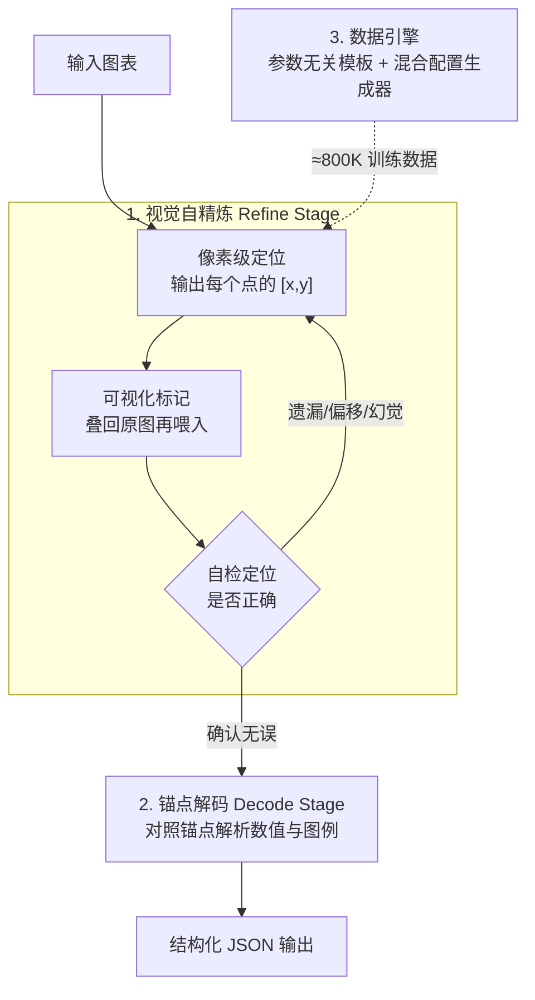

# Visual Self-Refine: A Pixel-Guided Paradigm for Accurate Chart Parsing

**会议**: ICLR 2026  
**OpenReview**: [https://openreview.net/forum?id=RI0oNr1b0y](https://openreview.net/forum?id=RI0oNr1b0y)  
**代码**: https://github.com/InternLM/VSR  
**领域**: 多模态VLM  
**关键词**: 图表解析, 视觉自精炼, 像素级定位, 视觉反馈, 视觉感知

## 一句话总结
针对视觉密集型图表解析中大模型容易漏点、错位、幻觉的问题，本文提出"视觉自精炼"(VSR) 范式——让模型先输出像素级定位坐标、把坐标可视化标记后喂回自己迭代纠错，再以校验过的坐标当"手指锚点"解析数值，在自建的高难度 ChartP-Bench 上以 3B 小模型反超 Gemini-2.5-Pro。

## 研究背景与动机
**领域现状**：当前具备"思考"能力的大模型（如 o1、Gemini-2.5-Pro）能在**文本层面**反思并纠正自己的回答，这在数学题这类纯文本任务上很有效。图表解析（Chart Parsing）的目标是把一张折线图/柱状图还原成底层结构化数据（JSON/表格），是下游图表问答的基础步骤；LVLM 时代的主流做法是在"图表—标注"数据对上端到端训练。

**现有痛点**：对视觉信息密度高、又没有显式数字标签的图表，即便 GPT-4o、Gemini 这类强模型一次性解析也错漏百出——常见的是数值偏差大、数据对应错位（misalignment）、数据点遗漏（omission）、甚至凭空捏造不存在的点（hallucination）。更要命的是，当你让模型自己"检查并纠错"时，它往往坚称"所有坐标都正确"，**文本层面的自我纠错对视觉感知任务几乎不起作用**（论文 Figure 2）。

**核心矛盾**：现有"思考型"模型的反思发生在文本空间，而图表解析的核心难点在**视觉感知**——错误本身是"看错了"，模型在文本里反复推敲也看不出自己看错了哪里。感知错误需要"重新看"才能发现，而不是"重新想"。

**本文目标**：为以视觉感知为核心的任务引入一种"视觉反馈"机制，让模型能像人一样"重新看一眼自己刚才的输出"，从而发现并修正定位类错误。

**切入角度**：作者观察到人读复杂图表的策略——用**手指逐个点向数据点**，手指位置充当"视觉锚点"，能有效防止重复读、漏读、对错行。关键在于：手指把"读数"这个高维感知问题降维成了"指对位置"这个简单的定位问题。

**核心 idea**：让模型生成像素级定位坐标 → 把坐标画回图上 → 把带标记的图喂回自己看 → 自检纠错，用"视觉反馈"替代"文本反思"；纠错收敛后再拿这些可信坐标当锚点去解析数值。

## 方法详解

### 整体框架
ChartVSR 基于开源的 Qwen2.5-VL-3B，把传统"一步到位"的图表解析拆成**两个阶段**：**Refine Stage（精炼阶段）**让模型只负责"指出"图里每个数据元素在哪——输出一串像素级定位 $[x, y]$，把它们用预设标记可视化叠回原图、喂回模型自检，循环"生成—反馈—纠正"直到模型确认无误或达到最大轮数；**Decode Stage（解码阶段）**拿这批已被模型自己校验过的高精度坐标当"手指锚点"，对照图表坐标系和图例标签把每个锚点翻译成具体数值，输出结构化 JSON。两个阶段的训练数据由一个高多样性**数据引擎**离线合成（约 800K 样本）。

整条流程的关键在于把"感知（定位在哪）"和"解析（值是多少）"两个子任务解耦，用像素级定位当二者之间的桥梁。

### 关键设计

**1. 视觉自精炼：生成—反馈—纠正的视觉闭环**

这一设计直击"文本自纠错对视觉任务无效"的痛点。在 Refine Stage，模型不直接读值，而是输出一串像素级定位坐标——这一步把复杂的图表解析降维成了一个更简单的**视觉定位（grounding）**问题，模型只需关注"数据点在哪儿"，暂时不用管"它是什么/值多大"。随后系统用预设标记把这些坐标画回原图，得到一张"带标记的图"再喂回模型。模型通过观察自己上一轮画的标记，能直观看出哪些标偏了、哪些点漏标了、哪些是幻觉点，进而输出一组修正后的坐标。这个闭环可迭代多轮，直到模型确认可视化结果正确或达到预设最大轮数 $N_{max}$。它之所以有效，是因为错误被**重新渲染成了像素**——模型不再凭记忆推敲文本坐标，而是真的"重新看了一眼"，这正是人用手指指读图表的数字化版本。

**2. 感知与解析解耦的两阶段：用像素锚点搭桥**

Refine Stage 解决了"看准位置"，Decode Stage 负责"读出数值"。进入解码时，模型收到的是原图 + 一组已被自己校验过的高精度像素定位，任务从"定位"切换为"解释"：对每个锚点，模型把它的像素坐标（如 $[541, 458]$）映射到图表坐标系（如 $(88.0, 8.9)$），并关联到对应的图例标签，最终拼成带数值和元信息的 JSON。把"感知（定位）"和"解析（解释）"拆成两步、并用像素级定位当中间桥梁，是 ChartVSR 缓解数据错位、遗漏、数值偏差的关键——因为一旦锚点本身是可信的，解码时就不会再发生"对错行""漏一整列"这类结构性错误。消融实验也印证了二者缺一不可：只加像素定位、却不配套 VSR 自精炼，几乎没有增益（见下文 Table 4）。

**3. 高多样性数据引擎：根治合成数据的隐式规律**

作者指出现有可解析图表数据集的两大顽疾：风格单一（只调颜色/字体等少数参数，泛化差）、以及**隐式规律与数据同质化**（来自网络/统计库的数据常含单调趋势、重复字符串，比如"2000 年附近的数字标签往往是递增年份序列"，模型会过拟合这些 pattern，收敛快但真实泛化差）。为此设计了由两部分组成的数据引擎：**参数无关模板**（Parameter-Agnostic Templates，每类图一份通用绘图脚本，同时产出图和标注，覆盖 Matplotlib 该图类的全部绘图参数）+ **混合配置生成器**（Hybrid Configuration Generator，在配色/字体/布局的完整可视化空间里采样，并把真实内容和随机生成内容混合来合成标签、标题、数据点），从而最大化风格多样性、刻意打散隐式规律。生成后再经"人工标注正负例 → 微调一个 Qwen2-VL-2B 当过滤器 → 模型自动筛除低质图"的双重质检。作者还提出四个数据集质量指标（平均数据点数、唯一数值比、平均绝对相关性、Top-K 配对的平均 PMI）量化其优越性——例如平均每图 22.69 个点、唯一数值比 59.20%，均显著优于 ChartQA/PlotQA/ChartX。

### 损失函数 / 训练策略
模型在 8 张 H200（144GB）上端到端微调，三个组件（视觉编码器、语言模型、MLP merger）全部解冻。为避免缩放导致像素定位与模型内部坐标系不匹配，把每张图长边 resize 到 1036 像素（28 的倍数）。训练 1 个 epoch，总 batch size 128，AdamW，学习率 $2\times10^{-7}$，warmup 比例 0.03，weight decay 0.01。训练样本按两阶段设计：Refine Stage 构造三类样本教模型 a) 从零生成定位、b) 纠正错误标记（漏标/偏移/幻觉）、c) 确认正确标记以终止循环；Decode Stage 则给定校验过的坐标、训练模型解析出结构化 JSON。

## 实验关键数据

### 主实验
通用图表解析基准（评测指标为 SCRM 的平均精度 AP，分 Strict/Slight/High 三档阈值）：

| 基准 | 指标 | ChartVSR (3B) | OneChart (0.2B) | ChartVLM (7.3B) |
|------|------|------|------|------|
| ChartQA-SE-Clean | AP-Slight | **83.69** | 78.89 | 77.17 |
| ChartQA-SE-Clean | AP-High | **85.64** | 83.92 | 82.11 |
| PlotQA-SE | AP-Slight | **84.61** | 84.18 | 46.83 |
| PlotQA-SE | AP-High | **88.10** | 86.10 | 54.00 |
| ChartX-SE | AP-High | **62.89** | 59.72 | 40.82 |

ChartVSR 用 3B 在三个分布迥异（真实图/真实数据合成/纯合成）的基准上、尤其在 Slight/High 档全面领先，显示出强泛化。

自建高难度 ChartP-Bench（每图平均 >20 点，按数据点数分 Easy ≤18 / Hard >18）：

| 模型 | Size | Easy Avg. | Hard Avg. | 总 Avg. |
|------|------|------|------|------|
| GPT-4o | - | 2.81 | 1.71 | 2.09 |
| Gemini-2.5-Flash | - | 30.86 | 21.35 | 24.62 |
| Gemini-2.5-Pro | - | 27.54 | 37.50 | 34.07 |
| OneChart | 0.2B | 7.88 | 3.82 | 5.22 |
| **ChartVSR** | 3B | **39.83** | **37.66** | **38.41** |

3B 的 ChartVSR 总均值 38.41，明显超过最强闭源 Gemini-2.5-Pro 的 34.07；GPT-4o 在这种高密度无标签图上近乎失效。注意几乎所有模型 AP-Strict 都接近 0，因为 ChartP-Bench 的数值标签极精确（如 17.12 而非整数 10/20），$e_{thr}=0$ 的零误差要求过于苛刻。

### 消融实验

| 配置 | Easy Avg. | Hard Avg. | 总 Avg. |
|------|------|------|------|
| ChartVSR (Full) | 39.83 | 37.66 | 38.41 |
| w/o VSR | 39.20 | 36.54 | — |
| w/o VSR & w/o Pixel | 38.97 | 36.17 | — |

去掉 VSR 自精炼后，性能下降，且在 Hard 子集（点更多、更密）上掉得更明显（37.66 → 36.54）；而"只去 VSR"与"VSR 和像素定位都去"差距很小，说明**单独加像素定位几乎没用，必须配合 VSR 闭环**。

逐轮纠错能力（Table 5）：

| 轮次 | 含错样本数 | 上轮错误的召回 | 正确确认率 |
|------|------|------|------|
| 0 | 110 | - | - |
| 1 | 51 | 92.3% | 88.2% |
| 2 | 54 | 85.5% | 76.0% |
| 3 | 52 | 85.8% | 76.6% |

### 关键发现
- **第一轮纠错收益最大、之后边际递减**：第 1 轮就识别出 92.3% 的初始错误，把含错样本从 110 压到 51（纠正过半）；后续轮次召回仍 >85%，但含错总数不再明显下降，说明剩下的是模型更深层感知能力难解的"硬骨头"，简单多轮迭代救不回来。作者建议用 bootstrapping 把纠错失败的难例回收进训练数据迭代微调。
- **VSR 的增益集中在复杂图**：简单图的错误主要是数值微偏，复杂图的瓶颈是结构性的漏点/错位，而 VSR 的视觉反馈正是为纠正这类"视觉上显眼"的错误而设计。
- **以推理开销换精度**：baseline 只需 1 次前向，VSR 至少 3 次（初始定位 + 反馈确认 + 最终解码），$N_{max}=n$ 时为 $3 \sim (n+2)$ 次，是与 o1/Gemini 2.5 Pro 类似的"花更多推理算力换可靠性"的主动权衡。

## 亮点与洞察
- **把"自我纠错"从文本空间搬到像素空间**：这是最 "啊哈" 的地方——错误既然是"看错的"，就该"重新渲染成图再看一眼"，而不是在文本里空想。VSR 等于给视觉任务造了一个 o1 式的反思回路，但反思介质是图像。
- **降维思路很巧**：先把"读数"(高维感知) 拆成"指位"(低维 grounding)，再把可信锚点喂给解码，巧妙绕开了一次性解析里感知与解析互相污染的难题。
- **可迁移性明确**：作者已在视觉计数（先定位所有目标、可视化后自检漏/多计）和视觉定位（直接可视化预测框自评是否要修正）上验证 VSR，说明这是一套通用的"视觉反馈自纠错"机制，凡是输出可被渲染回像素的视觉感知任务都能套用。

## 局限与展望
- **作者承认**：多轮迭代对"顽固错误"收益递减，根因是模型自身感知上限；推理成本相比 baseline 翻 3 倍以上。
- **自己发现的局限**：方法强依赖像素级定位标注，数据引擎与训练完全围绕合成数据展开，真实世界标注稀缺这一根本困难其实是用大规模合成"绕开"而非真正解决；AP-Strict 近乎全员归零也暴露出在高精度数值场景下，纯视觉读数仍难达到零误差。
- **改进思路**：作者提出的 bootstrapping 难例回收很有可操作性；此外可探索让 Refine 与 Decode 联合优化、或引入更强的坐标系标定来降低 Strict 档误差。

## 相关工作与启发
- **vs DePlot / ChartVLM / OneChart**：这些是"一次性"端到端解析（DePlot 做 plot-to-table，OneChart 加数值损失监督），没有视觉反馈回路，在高密度无标签图上漏点/错位严重；ChartVSR 用两阶段 + VSR 闭环显式校验定位，3B 即反超 7.3B 的 ChartVLM 和闭源 Gemini。
- **vs o1 / Gemini-2.5-Pro 这类思考型模型**：它们在文本空间反思，对视觉感知任务几乎无增益（Figure 2 中 GPT-4o 自检后仍坚称全对）；ChartVSR 把"思考"落到像素反馈上，是同一"以推理换精度"哲学在视觉任务上的对应物。

## 评分
- 新颖性: ⭐⭐⭐⭐⭐ "视觉反馈自纠错"是对文本式自反思的一个干净且自然的补全，立意清晰
- 实验充分度: ⭐⭐⭐⭐ 三大公开基准 + 自建 ChartP-Bench + 逐轮分析 + 跨任务验证，较完整；但 AP-Strict 全员归零、缺与更大同类模型的对照略可惜
- 写作质量: ⭐⭐⭐⭐⭐ 用"手指指读"类比贯穿全文，动机—方法—实验逻辑顺畅
- 价值: ⭐⭐⭐⭐ 既给出可落地的 ChartVSR 与新基准，又提出可迁移到计数/定位的通用范式

<!-- RELATED:START -->

## 相关论文

- [\[CVPR 2026\] RxnCaption: Reformulating Reaction Diagram Parsing as Visual Prompt Guided Captioning](../../CVPR2026/multimodal_vlm/rxncaption_reformulating_reaction_diagram_parsing_as_visual_prompt_guided_captio.md)
- [\[ICLR 2026\] ViPER: Empowering the Self-Evolution of Visual Perception Abilities in Vision-Language Models](viper_empowering_the_self-evolution_of_visual_perception_abilities_in_vision-lan.md)
- [\[ICLR 2026\] PSP: Prompt-Guided Self-Training Sampling Policy for Active Prompt Learning](psp_prompt-guided_self-training_sampling_policy_for_active_prompt_learning.md)
- [\[ICLR 2026\] Uni-DPO: A Unified Paradigm for Dynamic Preference Optimization of LLMs](uni-dpo_a_unified_paradigm_for_dynamic_preference_optimization_of_llms.md)
- [\[ICLR 2026\] When MLLMs Meet Compression Distortion: A Coding Paradigm Tailored to MLLMs](when_mllms_meet_compression_distortion_a_coding_paradigm_tailored_to_mllms.md)

<!-- RELATED:END -->
