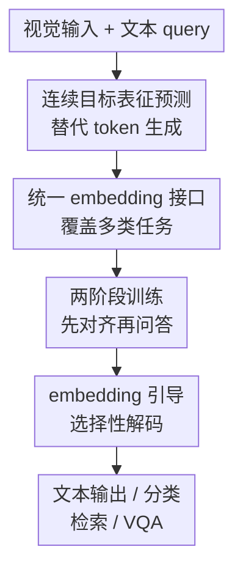

# VL-JEPA: Joint Embedding Predictive Architecture for Vision-language

**会议**: ICLR2026  
**OpenReview**: [https://openreview.net/forum?id=tjimrqc2BU](https://openreview.net/forum?id=tjimrqc2BU)  
**代码**: 暂未确认  
**领域**: 多模态VLM / 视觉语言表征学习  
**关键词**: JEPA, 视觉语言模型, 连续表征预测, 选择性解码, 视频理解  

## 一句话总结
VL-JEPA 把传统 VLM 的自回归 token 生成改成目标文本语义 embedding 的非自回归预测，在同等训练设置下比 token-space VLM 更省参数、更快收敛，并天然支持分类、检索、VQA 与在线视频场景下的选择性解码。

## 研究背景与动机
**领域现状**：当前通用视觉语言系统大多沿着生成式 VLM 路线发展：先把图像或视频编码成视觉 token，再把视觉 token 与文本 query 一起送进语言模型，用 next-token prediction 生成答案、描述或解释。这条路线很直接，也和 LLM 生态兼容，因此在 captioning、VQA、视觉指令跟随等任务上成为主流。

**现有痛点**：问题在于，很多视觉语言任务并不真正需要模型学习“怎么写出某个句子”。例如同一个视频片段可以回答成 “the lamp is turned off”，也可以回答成 “the room goes dark”，两句话在语义上接近，但 token 序列几乎不重合。生成式 VLM 训练时仍要在离散 token 空间里拟合这些表面措辞差异，计算量被花在词序、风格、同义改写等非任务关键信息上。

**核心矛盾**：视觉语言理解真正需要的是从视觉状态和问题中抽取正确语义，而自回归语言生成却把“理解语义”和“逐 token 写句子”绑在一起。这个绑定在离线问答里只是成本问题，在实时视频流里会进一步变成延迟问题：模型必须持续读视频，但只有发生语义变化时才需要输出文字。

**本文目标**：作者希望构建一个仍能覆盖 captioning、开放词表分类、文本到视频检索、判别式 VQA 等任务的通用视觉语言模型，但训练目标不再是生成 token，而是预测目标答案在连续语义空间中的 embedding；同时，模型在需要文字时才调用轻量文本 decoder，把 embedding 翻译回可读文本。

**切入角度**：JEPA 的基本思想是“在表征空间预测目标”，而不是重构原始数据。作者把这个思想搬到 vision-language：视觉输入先变成视觉表征，目标文本先变成文本表征，predictor 学的是从视觉表征和 query 到目标文本表征的映射。这样，同义答案可以在 embedding 空间中靠近，模型要拟合的是更平滑、更抽象的目标分布。

**核心 idea**：用目标文本 embedding 预测替代自回归 token 预测，把 VLM 的学习重心从“写出答案”前移到“预测答案语义”，再按需把语义 embedding 解码成文本。

## 方法详解

### 整体框架
VL-JEPA 的训练样本是三元组 $\langle X_V, X_Q, Y \rangle$：$X_V$ 是图像或视频帧，$X_Q$ 是文本 query，$Y$ 是目标文本答案。模型先用 X-Encoder 得到视觉 embedding $S_V$，用 Y-Encoder 得到目标文本 embedding $S_Y$，再让 Predictor 在 query 条件下预测 $\hat{S}_Y$；训练损失直接比较 $\hat{S}_Y$ 与 $S_Y$，而不是比较生成文本 $\hat{Y}$ 与原答案 $Y$。

推理时，VL-JEPA 可以有两种用法。若任务是开放式生成或 captioning，就把预测出的 $\hat{S}_Y$ 交给 Y-Decoder 读成文本；若任务是分类、检索或判别式 VQA，则把候选文本也编码成 embedding，直接在 embedding 空间做最近邻匹配，不必生成任何 token。对在线视频流，模型可以连续输出 $\hat{S}_Y$ 序列，只在 embedding 发生显著语义变化时才触发文本解码。

### 关键设计
**1. 连续目标表征预测：把答案从 token 分布压到语义空间**

传统 VLM 优化的是 $L_{VLM}=D(\hat{Y},Y)$，也就是逐 token 预测真实文本；VL-JEPA 优化的是 $L_{VL\text{-}JEPA}=D(\hat{S}_Y,S_Y)$，预测目标文本的连续 embedding。这个变化看似只是把监督信号换了一个空间，实际改变了模型要学习的分布形状：离散 token 空间里，语义等价但措辞不同的答案可能相互正交；embedding 空间里，这些答案可以聚成同一个语义区域。

这对视觉语言任务尤其重要，因为许多任务的“正确性”不依赖唯一表述。模型不必学习所有可接受答案的表面形式，只要预测到正确语义附近即可。作者用严格控制实验验证了这一点：在同一视觉 encoder、同一数据、同一 batch 和训练步数下，embedding prediction 的 VL-JEPA 比 token prediction 的 VLM 更快提升，在 15M samples seen 时 captioning 平均 CIDEr 达到 14.8，而 VLM 只有 7.1；分类 top-5 也从 VLM 的 27.2% 提高到 41.0%。

**2. 统一 embedding 接口：同一架构同时做生成、分类、检索和判别式 VQA**

VL-JEPA 没有把每种任务拆成独立 head，而是把任务都转成“预测 embedding 与候选 embedding 的关系”。对生成任务，query 可以是 caption prompt 或问题，Predictor 输出答案 embedding，再由 Y-Decoder 解成文本；对开放词表分类，类别名称被 Y-Encoder 编码成候选 embedding，模型选择与 $\hat{S}_Y$ 最近的类别；对文本到视频检索，则给视频一个检索式 caption prompt，得到视频侧预测 embedding，再与文本查询 embedding 做相似度排序。

这种接口的好处是结构统一，坏处是它把 Y-Encoder 的质量变成系统上限之一。论文因此专门评估 Y-Encoder 在 SugarCrepe++ 和 VISLA hard-negative 文本基准上的表现：VL-JEPA_BASE 的文本 encoder 在 SugarCrepe++ 达到 63.9%，在 VISLA 达到 42.9%，高于 PE-Core 或 SigLIP2 等强基线，说明 JEPA 训练不仅让 Predictor 学会对齐，也让目标文本空间对细粒度语义差异更敏感。

**3. 两阶段训练：先建立视觉语言对齐，再注入 query 条件的 VQA 能力**

最终模型采用两阶段训练。第一阶段是 query-free 的大规模 caption 预训练，目标是建立稳定的图文/视频文对齐。数据包括 Datacomp、YFCC-100M，以及基于 HowTo100M 构建的 ACTION100M 视频动作描述和 caption。训练先用单帧图像大 batch 训练 100k iterations，随后切到 8 帧视频继续 60k iterations，最后用 32 帧训练 10k iterations，得到 VL-JEPA_BASE。

第二阶段是 query-conditioned SFT，用 PLM 数据混合训练模型回答具体问题，同时尽量保留第一阶段学到的分类与检索能力。数据包括 25M VQA、2.8M captioning、1.8M classification，以及下采样的预训练数据以缓解灾难性遗忘。消融显示，去掉第一阶段 caption 预训练会让分类从 49.0 降到 27.3、检索从 47.5 降到 30.2，说明 SFT 不是从零学对齐，而是依赖第一阶段打底。

**4. embedding 引导选择性解码：让在线视频只在语义变化时说话**

VL-JEPA 的另一个关键价值来自非自回归预测。生成式 VLM 要获得语义输出通常必须真的 decode 一段文本，而 VL-JEPA 每个滑动窗口只需一次前向就能得到 $\hat{S}_Y$。这些 embedding 可以形成一个连续语义流，系统可以先监控 embedding 变化，再决定是否调用 Y-Decoder。

论文用 EgoExo4D 长视频验证这一点：统一间隔解码相当于定时“开口说话”，无论视频语义是否变化；VL-JEPA 则用带时间连通约束的聚类，把 embedding 序列分成语义较一致的段落，只在每段中点解码。结果显示，在整个解码频率范围内，selective decoding 都 Pareto 优于 uniform sampling；0.35 Hz 的选择性解码可以达到 1 Hz 均匀解码的效果，相当于减少约 $2.85\times$ 文本解码次数。

### 一个完整示例
假设输入是一段第一视角做菜视频，query 是“当前用户正在执行什么步骤？”。传统 VLM 会把每个查询窗口都送入语言模型，逐 token 生成类似“the person is chopping onions”的答案；如果下一秒仍在切洋葱，系统仍可能重复 decode 一次近似句子。

VL-JEPA 的流程不同。每个视频窗口先经过冻结的 V-JEPA 2 X-Encoder 变成视觉 token，query token 与视觉 token 一起进入 Predictor，输出一个目标语义 embedding $\hat{S}_Y$。如果连续几个窗口的 $\hat{S}_Y$ 方差很小，说明语义状态仍在“切洋葱”附近，系统只保留 embedding 流而不解码；当用户从切洋葱切换到倒油，embedding 簇发生明显移动，才调用 Y-Decoder 输出新的文字描述。

如果任务换成分类，流程更短。系统把候选标签“chopping onions”“pouring oil”“washing pan”等用 Y-Encoder 预先编码，当前窗口的 $\hat{S}_Y$ 与这些候选 embedding 比距离，最近的标签就是预测结果，不需要生成完整自然语言。这解释了为什么同一个模型可以在 captioning、分类、检索和 VQA 之间复用。

### 损失函数 / 训练策略
论文采用 bi-directional InfoNCE 训练 Predictor 和 Y-Encoder。直观上，InfoNCE 同时做两件事：一方面让同一样本的预测 embedding $\hat{S}_Y$ 与目标 embedding $S_Y$ 靠近，另一方面把 batch 内不同样本的 embedding 推开，从而避免所有目标塌缩到同一点。

训练中的几个实现细节也很关键。X-Encoder 使用冻结的 V-JEPA 2 ViT-L，视频输入均匀采样到 $256^2$ 分辨率；Predictor 初始化为 Llama-3.2-1B 的后 8 层 Transformer，并去掉 causal attention mask，让视觉 token 和 query token 能双向注意；Y-Encoder 初始化为 EmbeddingGemma-300M，最大上下文长度 512，并对文本 encoder 参数使用 $0.05\times$ 学习率倍率。Projection head 把 Predictor 与 Y-Encoder 输出映射到共享的 1,536 维 embedding 空间。

消融支持这些选择。Y-Encoder 的学习率倍率在 0.05 到 0.10 左右较稳，过快或冻结都会伤害效果；InfoNCE 在分类和检索上明显优于 cosine、L1、L2 等直接回归损失；Predictor 用更多 Llama 层通常有利于 VQA，保留 causal attention 会使 VQA 下降 1.9，因为 query token 位于视觉 token 之后时，视觉 token 无法反向关注 query。

## 实验关键数据

### 主实验
论文的主实验覆盖四类能力：视频分类、文本到视频检索、判别式 VQA，以及 world modeling。最能说明问题的是，VL-JEPA_BASE 在零样本分类和检索上超过 CLIP/SigLIP2/PE-Core 等通用表征模型，而 VL-JEPA_SFT 在加入 SFT 后把分类能力大幅推高，同时仍保持统一架构。

| 任务 / 数据集组 | 指标 | VL-JEPA | 强基线 | 结果解读 |
|--------|------|------|----------|------|
| 8 个视频分类数据集 | 平均 Top-1 | VL-JEPA_BASE 52.5 | PE-Core-G 44.7 | 在只看零样本通用模型时领先 7.8 点，尤其强在 SSv2、EK100、EgoExo4D 等运动相关数据集 |
| 8 个文本到视频检索数据集 | 平均 Recall@1 | VL-JEPA_BASE 63.7 | PE-Core-G 58.1 | 用统一 embedding 接口做检索，平均领先 5.6 点 |
| 8 个视频分类数据集 | 平均 Top-1 | VL-JEPA_SFT 75.4 | VL-JEPA_BASE 52.5 | SFT 后因见过更多域内任务，分类能力明显提升 |
| WORLDPREDICTION-WM | Top-1 accuracy | VL-JEPA_SFT 65.7 | 最强对比模型约 57.0 | 在由初末状态选择动作的视频 world modeling 任务上达到新 SOTA |

VQA 表现更像“接近强生成式 VLM”，而不是全面碾压。VL-JEPA_SFT 只有 1.6B 参数，却在多个感知型 VQA 数据集上达到可比水平：GQA 61.5、TallyQA 69.9、POPE 85.7、POPEv2 86.3。它不一定超过最大模型，但证明了 embedding prediction 架构并不只适合检索，也能通过候选答案 embedding 做判别式问答。

| VQA 数据集 | VL-JEPA_SFT | 代表性强基线 | 观察 |
|------|---------|------|------|
| GQA | 61.5 | LLaVA-1.5 7B: 62.0；InternVL-Chat 13B: 66.6 | 接近中等规模生成式 VLM，但还未追上最大模型 |
| TallyQA | 69.9 | InstructBLIP 13B: 68.0；PaliGemma 3B: 76.8 | 复杂计数上优于部分大模型，但仍有提升空间 |
| POPE | 85.7 | LLaVA-1.5 7B: 85.9；SmolVLM-2B: 87.5 | 幻觉检测接近主流 VLM |
| POPEv2 | 86.3 | Qwen2-VL-2B: 91.3；SmolVLM-2B: 88.8 | 表现稳健，但离最强小模型仍有差距 |

### 消融实验
消融表明，VL-JEPA 的收益不是单个 trick，而是预训练、InfoNCE、双向注意和文本 encoder 选择共同作用。特别是 caption 预训练对分类/检索非常关键，说明这种模型仍需要大规模视觉语言对齐作为基础。

| 配置 | 分类 / 检索 / VQA | 说明 |
|------|---------|------|
| 完整 VL-JEPA_SFT | 75.4 / 63.8 / 74.2 | 最终模型在完整训练规模下的主结果 |
| w/ Pretraining | 49.0 / 47.5 / 46.1 | 小规模消融默认设置，先做 caption 预训练再 SFT |
| w/o Pretraining | 27.3 / 30.2 / 42.5 | 去掉预训练后分类下降 21.7、检索下降 17.3，VQA 也下降 3.6 |
| Y-Encoder 学习率倍率 0.05 | 27.3 / 30.2 / 42.5 | 默认较稳设置，避免初期预测质量差时把文本空间带偏 |
| Y-Encoder 学习率倍率 0.00 | 20.0 / 25.9 / 41.4 | 完全冻结会明显削弱分类和检索 |
| InfoNCE | 23.3 / 30.3 / 44.3 | 在分类和检索上优于直接回归损失，并提供 anti-collapse 作用 |
| Cosine loss | 16.5 / 20.2 / 46.6 | VQA 略高，但分类和检索大幅下降，且缺少显式防塌缩 |
| w/o Bi-direction Attention | 26.7 / 31.2 / 40.6 | VQA 下降 1.9，说明 query 与视觉 token 的双向交互有用 |

### 关键发现
- embedding prediction 的样本效率优势很明显：在 5M samples seen 时，VL-JEPA 已达到 14.7 CIDEr 和 35.3% top-5，VLM 训练曲线明显更慢；到 15M samples seen 时，VL-JEPA 仍保持更高绝对性能。
- 选择性解码是架构层面的推理优势，而不只是后处理优化。因为模型先输出语义 embedding，系统可以在不生成文本的情况下判断“是否值得说话”。
- VL-JEPA_BASE 在运动、过程、步骤识别类数据集上特别强，但在更外观中心的数据集上相对弱；作者认为这与其训练样本量远少于 PE-Core-G 的 86B 有关。
- Y-Encoder 不是普通文本 encoder 的静态替换件。经过 JEPA 训练后，VL-JEPA_BASE 的 Y-Encoder 在 hard-negative 文本评测上更强，说明目标语义空间本身被训练得更适合细粒度视觉语言匹配。

## 亮点与洞察
- 最大亮点是把“生成答案”拆成“预测答案语义”和“按需读出文本”两步。这个拆分让训练目标更接近任务本质，也给实时视频系统留下了省解码的空间。
- 论文最有说服力的实验不是单纯刷榜，而是 embedding prediction vs token prediction 的严格控制比较。同 encoder、同数据、同 batch、同训练步数，只换目标空间，这个设置比较干净地验证了核心假设。
- VL-JEPA 连接了 CLIP-style 表征模型和生成式 VLM 的两个世界：像 CLIP 一样能做检索和开放词表匹配，又能通过 decoder 生成文本。它不是把 LLM 接在视觉 encoder 后面，而是把“答案语义空间”放在架构中心。
- 选择性解码的思路可以迁移到机器人、AR 眼镜、在线监控等场景。只要任务存在连续状态流且文本输出稀疏，就可以先监控 embedding，再在语义变化点解码。
- 这篇论文也提醒我们，VLM 的效率不一定只能靠剪 token、量化或小模型实现；改变监督空间本身，可能比在生成式框架里做局部加速更根本。

## 局限与展望
- 论文明确承认 VL-JEPA 还不是生成式 VLM 的通用替代品。当前评测主要集中在视觉感知、视频理解、检索、判别式 VQA 和在线 captioning，尚未覆盖工具使用、复杂多步推理、agentic behavior 等 token-generative VLM 擅长的任务。
- Y-Decoder 的质量仍会影响开放式文本输出。embedding 预测可以让语义更稳，但最终要给人读的句子仍需 decoder 读出；如果 decoder 对细节或长答案表达不足，生成任务可能受限。
- 选择性解码实验很有启发，但当前主要在 EgoExo4D procedural activity 上验证。更复杂的实时场景可能既有短暂动作，也有长期上下文依赖，单纯基于 embedding 方差或聚类的触发策略可能还不够。
- 训练成本并不低。最终预训练使用 24 个 H200 节点跑约 4 周，虽然 trainable parameters 比对照 VLM 少，但整体构建仍是大厂级资源。
- 未来值得探索非对比式 anti-collapse 正则，如 VICReg、SIGReg，或者更强的 Y-Encoder / Y-Decoder 组合；也可以把连续语义流进一步用于 latent-space reasoning，而不只是省解码。

## 相关工作与启发
- **vs CLIP / SigLIP / PE-Core**: CLIP-style 模型把视觉和文本分别编码到同一空间，强在分类和检索，但没有条件预测机制，也不天然生成文本；VL-JEPA 多了 query-conditioned Predictor，因此能从视觉输入和问题预测目标答案 embedding。
- **vs 生成式 VLM / PerceptionLM**: 生成式 VLM 直接优化 next-token cross-entropy，输出能力强但训练和推理都要处理 token 级表面差异；VL-JEPA 把主训练目标移到 embedding 空间，只在需要时 decode，控制实验显示样本效率和分类/captioning 表现更好。
- **vs I-JEPA / V-JEPA**: 早期 JEPA 主要在图像或视频内部预测表征，用于自监督视觉表征学习；VL-JEPA 把 JEPA 扩展到通用 vision-language 条件预测，让目标不再只是另一个视觉块，而是文本答案的语义表征。
- **vs latent-space language modeling**: Large Concept Models、COCONUT 等工作讨论在连续 latent space 中做语言建模或推理；VL-JEPA 的启发是把类似思想放到多模态对齐里，让视觉状态和文本答案共享一个可预测、可检索、可解码的语义空间。
- **启发**: 对需要长时间运行的多模态系统，可以考虑把“高频理解”和“低频语言化”分离：前者用 embedding 流持续更新，后者只在用户需要或语义变化时触发。

## 评分
- 新颖性: ⭐⭐⭐⭐⭐ 从 JEPA 角度重构通用 VLM 的训练目标，并把 selective decoding 作为架构自然属性，想法清晰且有辨识度。
- 实验充分度: ⭐⭐⭐⭐☆ 覆盖分类、检索、VQA、world modeling、控制比较、选择性解码和消融，但复杂推理/agent 类任务还缺失。
- 写作质量: ⭐⭐⭐⭐☆ 论文结构顺畅，核心对照实验讲得很清楚；部分实现细节和大表格较密，需要读者自行整理。
- 价值: ⭐⭐⭐⭐⭐ 对实时视频 VLM、机器人/AR 场景和 latent-space 多模态建模都有直接启发，是一个值得跟进的架构方向。

<!-- RELATED:START -->

## 相关论文

- [\[ICML 2026\] CHARM: 用 Multimodal JEPA + 通道描述做时间序列 foundation embedding](../../ICML2026/multimodal_vlm/giving_sensors_a_voice_multimodal_jepa_for_semantic_time-series_embeddings.md)
- [\[CVPR 2026\] VL-Eraser: Vacuum Distillation for Machine Unlearning in Vision-Language Models](../../CVPR2026/multimodal_vlm/vl-eraser_vacuum_distillation_for_machine_unlearning_in_vision-language_models.md)
- [\[NeurIPS 2025\] HoPE: Hybrid of Position Embedding for Long Context Vision-Language Models](../../NeurIPS2025/multimodal_vlm/hope_hybrid_of_position_embedding_for_long_context_visionlan.md)
- [\[ICLR 2026\] Efficient Discriminative Joint Encoders for Large Scale Vision-Language Re-ranking](efficient_discriminative_joint_encoders_for_large_scale_vision-language_rerankin.md)
- [\[ICLR 2026\] Delving into Spectral Clustering with Vision-Language Representations](delving_into_spectral_clustering_with_vision-language_representations.md)

<!-- RELATED:END -->
