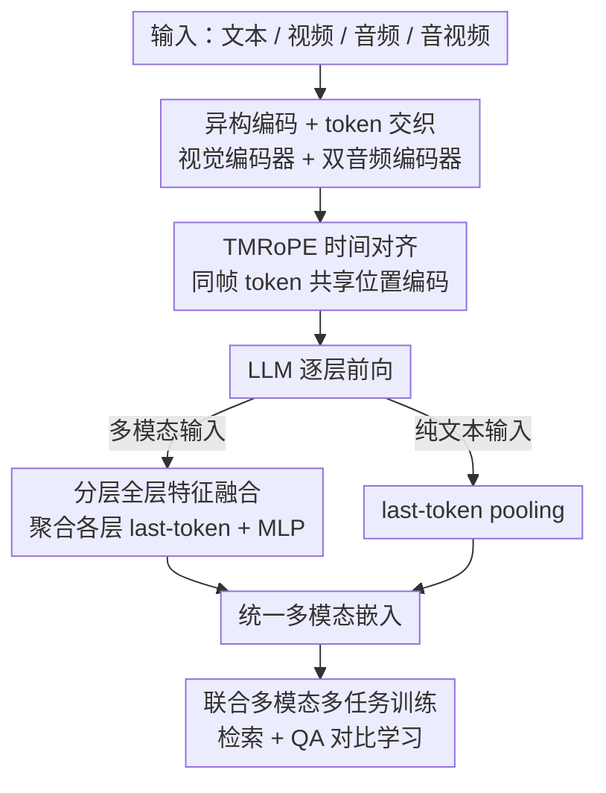

# WAVE: Learning Unified & Versatile Audio-Visual Embeddings with Multimodal LLM

**会议**: ICLR 2026  
**OpenReview**: [https://openreview.net/forum?id=MiV3WXDYJb](https://openreview.net/forum?id=MiV3WXDYJb)  
**代码**: https://github.com/TCL606/WAVE （有）  
**领域**: 多模态VLM  
**关键词**: 多模态嵌入, 音视频表示, MLLM嵌入, 跨模态检索, prompt-aware

## 一句话总结
WAVE 基于 Qwen2.5-Omni 把文本、音频、静默视频和同步音视频投影到同一个语义空间，靠"双音频编码器 + 分层全层特征融合 + 联合多模态多任务训练"，做到任意模态间检索（any-to-any）和随指令变化的 prompt-aware 嵌入，在 MMEB-v2 视频赛道刷到 SOTA。

## 研究背景与动机
**领域现状**：多模态嵌入的主流是 CLIP 式"每个模态一个独立编码器 + 对比学习对齐"。近来 LLM 的崛起带来更整合的范式——用单个多模态 LLM（MLLM）同时为所有模态产出嵌入，天然具备更好的跨模态互通和语义对齐，还能继承指令跟随能力。

**现有痛点**：绝大多数 MLLM 嵌入工作都集中在视觉、尤其是静态图像上，对音频和同步音视频流严重欠探索。结果是"真正通用的音视频嵌入空间"基本没人做出来。此外，多数嵌入模型在被改造成嵌入器后，其原始 MLLM 的多模态理解能力会明显退化。

**核心矛盾**：动态模态（音频、视频）是时序信号，既要在统一空间里和文本/彼此对齐，又要保留 MLLM 本身的理解推理能力；而单一静态的嵌入表示对像多模态 QA 这种依赖具体问题的任务又力不从心——同一段视频面对不同问题应该给出不同的表示。

**本文目标**：做一个统一的音视频嵌入 MLLM，覆盖文本/音频/静默视频/同步音视频四种输入配置，同时支持任意模态间检索与随指令条件化的嵌入。

**切入角度**：作者押注"联合多模态多任务训练能催生更鲁棒的通用嵌入空间"——让模型同时见到音频、视频、文本数据，使一个模态的知识正向迁移到另一个模态；并利用 MLLM 各层分工不同这一观察，从所有层抽取信息而非只取最后一层。

**核心 idea**：用一个 MLLM 把异构模态交织成统一 token 序列、对齐时间编码，再聚合所有层的 last-token 经轻量融合得到嵌入，配合检索+QA 的联合训练，让一个模型既会任意检索又能 prompt-aware。

## 方法详解

### 整体框架
WAVE 接收四类输入之一——纯文本、纯视觉（视频帧）、纯音频、同步音视频——输出一个可用于分类/检索/QA 的多模态嵌入。整条流水线是：非文本输入先各走专属编码器变成 token，按交织规则拼成统一序列并附上文本 prompt，套用 TMRoPE 时间对齐位置编码后喂进 LLM；对非文本模态，收集**每一层** LLM 的最后一个输出 token、拼接后送进轻量融合模块得到最终嵌入；纯文本输入则保留标准的 last-token pooling（取末层 EOS 隐状态）。关键点在于：所有非文本输入都必须带一段文本 prompt 作为指令，检索任务用通用 prompt（如"Describe the video"），QA 任务用具体问题，这正是 prompt-aware 的来源。

### 关键设计

**1. 双音频编码 + 模态交织：把异构时序信号拼成 LLM 能读的统一序列**

针对"音频/视频是时序信号、且音频里语音和环境声是互补线索"这一痛点，WAVE 不用单一音频编码器，而是并排一个语音编码器（speech encoder，来自 Qwen2.5-Omni）和一个独立的音频事件编码器（audio encoder，采用 BEATs + 可训练 aligner），分别产出语音相关 token 和音频事件相关 token，覆盖说话内容与背景声响两类互补信息。两个编码器频率相同、token 数相等，于是按 1:1 交织成统一听觉序列；同步音视频时，视觉序列与听觉序列各自按采样帧数切段，再逐段交织，最后把 prompt 的文本 token 接在序列末尾。这样异构信号被组织成 LLM 可直接消费的单一序列，而双编码器让音频表达力比单编码器更全面。

**2. TMRoPE 时间对齐：让同一时刻的多模态 token 在位置上严格对齐**

音视频是天然同步的，但拼成序列后若位置编码错位，时空结构就被破坏。WAVE 沿用 Qwen2.5-Omni 的 time-aligned multimodal rotary position embedding（TMRoPE）：因为语音和音频编码器被同步到相同输出频率，它们的 token 在时间上天然对齐；属于同一帧的所有 token 共享同一个 TMRoPE，从而保证精确的时间对齐。这一步是双编码器交织能成立的前提——只有时间对齐了，LLM 才能把"这一帧的画面 + 这一帧的声音"当成同一时刻的整体来理解，增强对时空结构的捕捉。

**3. 分层全层特征融合：从所有层抽信息而非只取最后一层**

标准做法是 last-token pooling，只取最后一层 EOS 隐状态。但作者观察到（引 Gou et al., 2025）LLM 不同层在视频理解上分工不同——底层偏低级感知线索、高层偏高级语义抽象，互补信息分散在深度上。于是 WAVE 收集**每一层**的 last-token 状态，拼接后送进一个两层 MLP（GELU 激活）的轻量融合模块来精炼压缩，得到最终嵌入。消融证实：只用首层/中层会明显掉点，而全层 MLP 融合稳定超过强的末层基线；相比之下简单的"全层加权和"反而不如末层，说明跨层交互对视频任务是复杂非线性的，需要可学习变换而非线性叠加。

**4. 联合多模态多任务训练：用检索 + QA 双任务催生 prompt-aware 的统一空间**

WAVE 以对比学习为主范式，用余弦相似度度量任意两个嵌入。训练混合两个互补任务：检索任务里 source 和 target 属于不同模态（可任意组合），用对称 InfoNCE，对小批量内第 $i$ 个样本以 source 嵌入 $e_{s_i}$ 为 query、target $e_{t_i}$ 为正例，批内其余作负例，损失为
$$L_{s_i} = -\log \frac{\exp(\mathrm{sim}(e_{s_i}, e_{t_i})/\tau)}{\sum_{j=1}^{N}\exp(\mathrm{sim}(e_{s_i}, e_{t_j})/\tau)}$$
再加上反向 $L_{t_i}$ 取双向平均，得 $L_{\text{Retrieval}} = \frac{1}{2N}\sum_i (L_{s_i}+L_{t_i})$，保证双向对齐。QA 任务里 source 是"多模态信号 + 问题 prompt"，target 是正确答案文本，并补充 $n$ 个干扰答案，损失为
$$L_{QA_i} = -\log \frac{\exp(\mathrm{sim}(e_{s_i}, e_{t_i})/\tau)}{\exp(\mathrm{sim}(e_{s_i}, e_{t_i})/\tau) + \sum_{k=1}^{n}\exp(\mathrm{sim}(e_{s_i}, e'_{t_i,k})/\tau)}$$
迫使模型产出"最贴近正确答案、远离干扰项"的 query 嵌入。一个 task-aware 数据采样器保证同一个 mini-batch 内样本同任务同数据源。两任务并训让模型既学会通用检索表示，又学会随问题变化的判别性嵌入——这正是 prompt-aware 能力的训练来源。

### 损失函数 / 训练策略
分两阶段。先做 BEATs aligner 预训练：冻结其它一切，只更新 aligner，用音频 caption 任务（WavCaps / AudioCaps / Clotho）让 LLM 学会解读 BEATs 特征，128 张 H20 训 3 个 epoch。然后主训练阶段在 4.9M 样本（视频文本检索、视频 QA、视频音频检索、音频文本检索四类任务）上用对比学习，温度 $\tau=0.01$，LLM 用 LoRA（rank=128、scale=2.0、dropout=0.05）微调，可训练部分为视觉 aligner + LoRA + 融合模块，其它冻结；192 张 H20、batch size 192、学习率 $2\times10^{-5}$、1 个 epoch、约 36 小时。

## 实验关键数据

### 主实验
视频赛道（MMEB-v2-Video Overall / LoVR theme-to-clip 的 R@25）：

| 模型 | MMEB-v2-Video Overall | QA | LoVR theme-to-clip |
|--------|------|------|------|
| LamRA 7B | 35.0 | 42.6 | 60.2 |
| GME 7B | 38.4 | 50.4 | 43.9 |
| CAFe 7B | 42.4 | 58.7 | - |
| Seed-1.6-Embedding（工业级） | 55.3 | 60.9 | - |
| **WAVE 7B** | **59.9** | **72.5** | **66.0** |

WAVE 全面超过开源模型，Overall 甚至反超工业级 Seed-1.6-Embedding。音频/音视频域（R@1 / Acc%）：

| 任务 | 数据集 | 参考模型 | WAVE 7B |
|------|------|------|------|
| 音频检索 A-RET | AudioCaps | 42.2 | **44.2** |
| 音频检索 A-RET | Clotho | 21.5 | **25.6** |
| 视频→音频 AV-RET | VGGSound | 10.3 | **25.0** |
| 视频→音乐 AV-RET | MusicCaps | 8.6 | **20.4** |
| 音频 QA | MMAU | 71.5 | **76.6** |
| 音频 QA | MMAR | 56.7 | **68.1** |

视频→音频/音乐这种绕开文本的高难检索上，WAVE 大幅超过用相同数据训的 encoder-only 检索模型；音频 QA 上超过其基座 Qwen2.5-Omni，而它根本没专门为音频 QA 训练，体现跨模态迁移。

### 消融实验

| 配置 | 关键指标 | 说明 |
|------|---------|------|
| 联合训练 Joint | 8 任务中 7 项最优 | 跨模态正迁移 |
| 单独训练 Separate | 多数任务略低 | 各模态单独训练 |
| 全层 MLP 融合 | 视频 RET 50.5 | 完整方案 |
| 末层 last-token pooling | 49.6 | 仅末层 |
| 全层加权和 | 48.3 | 线性叠加反而更差 |
| 中层 last-token | 45.0 | 信息不足 |
| 首层 last-token | 38.8 | 大幅掉点 |

QA 上 prompt 的作用极端明显：用"分别的问题"做 prompt，平均 72.5，比 Seed-1.6-Embedding 高约 12%；换成统一通用 prompt（"Please describe the video"）则骤降到 51.8，所有 QA 子集全线塌方。

### 关键发现
- **prompt-aware 是真有效**：同一模型在 QA 上从 51.8（通用 prompt）跳到 72.5（具体问题），证明嵌入确实随指令条件化，而非只编码视频主内容；也暴露"单一静态表示"对复杂 QA 的根本局限。
- **全层融合需要可学习的非线性**：直接加权和（48.3）连末层基线（49.6）都不如，而 MLP 融合（50.5）稳定胜出，说明跨层交互是非线性的。
- **联合训练带来正迁移**：8 个任务里 7 个 Joint 优于 Separate，音频还能反哺视频检索，支持"模型学到的是模态无关的统一语义空间"这一假设。
- **不退化反提升**：WAVE 在多模态理解基准上维持甚至超过基座 Qwen2.5-Omni，区别于多数嵌入模型改造后理解能力明显下滑。

## 亮点与洞察
- **双音频编码器是被低估的细节**：语音 + 音频事件分别编码再 1:1 交织，让"说话内容"和"环境声响"两类互补信息都进入嵌入，这是音频/音视频检索拉开差距的关键，可迁移到任何需要细粒度声学线索的任务。
- **"所有层都有用"的工程化**：把 LLM 各层分工不同的观察落成"全层 last-token 拼接 + MLP 融合"，且用消融排除了简单加权和，提供了一个干净、可复用的 MLLM 嵌入抽取配方。
- **prompt-aware 把检索器和 QA 判别器统一**：同一嵌入空间，换个 prompt 就从"通用检索表示"变成"问题条件化判别表示"，这种"指令即视图"的思路可迁移到任意需要任务自适应表示的检索/重排场景。

## 局限与展望
- 单一静态嵌入对复杂 QA 力不从心是作者自己点出的现象——prompt-aware 缓解了它，但也意味着没有合适 prompt 时性能会塌（通用 prompt 下 QA 暴跌），实际部署需要保证 query 侧给出有信息量的指令。
- 规模和成本偏重：基于 7B Qwen2.5-Omni，主训练用 192 张 H20、4.9M 样本，复现门槛高；论文未深入探讨更小模型或更省算力下能否保持优势。
- MRET（moment retrieval）是少数没拿到最优的子任务（50.8 低于 Seed 的 53.5），细粒度时间定位可能仍是统一嵌入的弱项。
- 训练数据里 Panda-70M 的 caption 是用 InternVL-2.5-8B 重标注的，文本质量受标注模型上限制约，可能引入偏置。

## 相关工作与启发
- **vs CLIP / CLAP / AudioCLIP（独立编码器对齐）**：它们每模态一个编码器在共同空间对齐，WAVE 用单个 MLLM 统一产出，跨模态互通和语义对齐更自然，还继承指令跟随能力做 prompt-aware，这是独立编码器范式给不了的。
- **vs VLM2Vec / VLM2Vec-V2 / GME / CAFe（MLLM 嵌入但偏视觉）**：这些工作集中在图像/视频，音频和同步音视频欠探索；WAVE 是首个把文本/音频/静默视频/同步音视频统一进单一空间的嵌入 MLLM，并在视频赛道反超它们。
- **vs Seed-1.6-Embedding（工业级闭源）**：作为开源 7B 模型，WAVE 在 MMEB-v2-Video Overall 与 QA 上反超工业级基线，且代码与 checkpoint 开源。

## 评分
- 新颖性: ⭐⭐⭐⭐ 首个覆盖文本/音频/静默视频/同步音视频的统一嵌入 MLLM，双音频编码 + 全层融合组合扎实
- 实验充分度: ⭐⭐⭐⭐⭐ 视频/音频/音视频多基准 + 联合训练、融合策略、prompt 三组消融，证据链完整
- 写作质量: ⭐⭐⭐⭐ 结构清晰、公式与消融对得上，部分实现细节需看附录
- 价值: ⭐⭐⭐⭐ 为通用音视频表示学习立了一个强 baseline，any-to-any 应用前景明确

<!-- RELATED:START -->

## 相关论文

- [\[ICLR 2026\] OmniVideoBench: Towards Audio-Visual Understanding Evaluation for Omni MLLMs](omnivideobench_towards_audio-visual_understanding_evaluation_for_omni_mllms.md)
- [\[NeurIPS 2025\] Watch and Listen: Understanding Audio-Visual-Speech Moments with Multimodal LLM](../../NeurIPS2025/multimodal_vlm/watch_and_listen_understanding_audio-visual-speech_moments_with_multimodal_llm.md)
- [\[ACL 2026\] ViLL-E: Video LLM Embeddings for Retrieval](../../ACL2026/multimodal_vlm/vill-e_video_llm_embeddings_for_retrieval.md)
- [\[CVPR 2026\] Illuminating Visual Identity in Universal Multimodal Embeddings](../../CVPR2026/multimodal_vlm/illuminating_visual_identity_in_universal_multimodal_embeddings.md)
- [\[CVPR 2026\] Semantic Noise Reduction via Teacher-Guided Dual-Path Audio-Visual Representation Learning](../../CVPR2026/multimodal_vlm/semantic_noise_reduction_via_teacher-guided_dual-path_audio-visual_representatio.md)

<!-- RELATED:END -->
