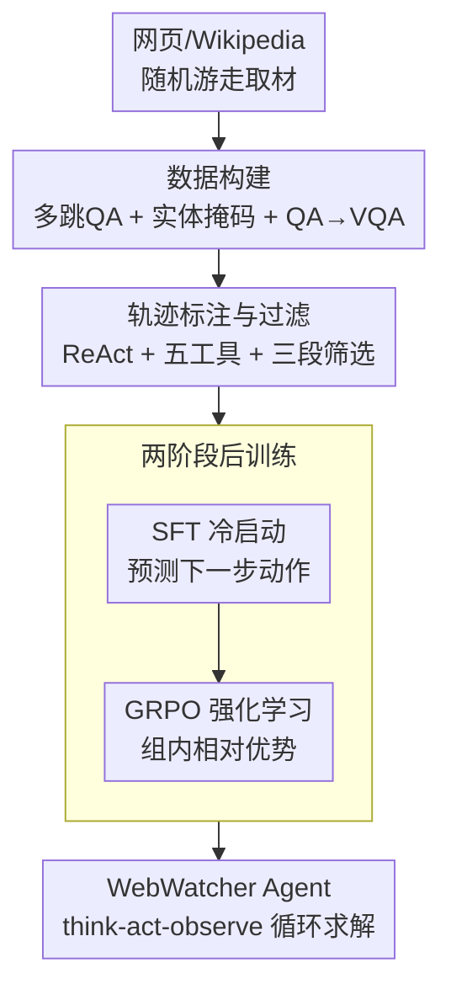

# WebWatcher: Breaking New Frontiers of Vision-Language Deep Research Agent

**会议**: ICLR 2026  
**OpenReview**: [https://openreview.net/forum?id=8jsaazdAb3](https://openreview.net/forum?id=8jsaazdAb3)  
**代码**: https://github.com/Alibaba-NLP/DeepResearch/tree/main/WebAgent/WebWatcher  
**领域**: 多模态VLM / Agent  
**关键词**: 视觉语言Agent, 深度研究, 工具调用, GRPO, 多模态VQA

## 一句话总结
WebWatcher 是一个能在文本与图像两种模态上联合推理的"深度研究"网页 Agent：它用自动合成的高质量工具调用轨迹做 SFT 冷启动、再用 GRPO 强化学习打磨决策，并配套提出了需要跨模态检索的 BrowseComp-VL 基准，在 HLE、LiveVQA、MMSearch 等多个高难度榜单上超过提示词工作流和现有开源多模态 Agent。

## 研究背景与动机
**领域现状**：以 deep research 为代表的网页 Agent 已经能多步规划、调用搜索/浏览工具解决极难的信息检索题，在 BrowseComp、Humanity's Last Exam（HLE）这类基准上展现出超越常人的能力。但目前绝大多数工作是"以文本为中心"的，把现实世界里无处不在的视觉信息当成了盲区。

**现有痛点**：现实任务里大量场景——读科学图表、分析图表数据、在带界面的网页里导航——都要求视觉和语言联合推理，而当前的多模态 Agent 走的是两条都走不通的路。一条是 VL Agent：它们围绕 OCR、检测框、裁剪、标注这些"视觉感知"工具打转，能看图但不会把视觉感知和深度文本理解、跨模态推断串起来，遇到 GAIA、HLE 这种需要"看完图还得多步推理"的题就崩。另一条是纯搜索 Agent：检索增强能答很多知识题，但当答案是隐含的、需要点链接交互、需要额外计算时就失效。

**核心矛盾**：多模态深度研究的真正门槛在于——它同时要求更强的感知、逻辑、知识推理，以及对一组输入输出格式各异的工具的灵活编排，而现有方法要么工具太单一（只有视觉工具或只有搜索工具），要么靠模板化、场景固定的流水线，缺乏灵活的推理与规划。论文用一个 GAIA 案例点题：在图里认出一种动物（实为海鹦），再去它的 Wikipedia 历史里数 2020 年前带 "visual edit" 标签的修订数（答案 11）——纯视觉 Agent 在边缘/纹理分析上过度推断、放大下游错误，搜索 Agent 又无法点进页面浏览，都答错。

**本文目标**：造一个真正会"跨模态深度研究"的 Agent，需要同时解决三个子问题——(1) 没有兼具高质量视觉内容和复杂多跳推理的训练数据；(2) 没有能协调多种异构工具、贴合真实推理过程的工具调用轨迹；(3) 缺少能评测这种能力的高难度基准。

**核心 idea**：用一条"数据合成 → 自动轨迹标注 → SFT 冷启动 → GRPO 强化学习"的完整管线，把一个普通多模态大模型训成会规划、会用五种工具、会跨模态推理的深度研究 Agent；并配套构建 BrowseComp-VL 把 BrowseComp 那种"故意欠定、难到人类都吃力"的题搬进视觉域来检验它。

## 方法详解

### 整体框架
WebWatcher 的核心不是一个新模型结构，而是一整套把"会看图会搜索会推理"的能力灌进 Agent 的训练管线。输入端先从开放网页/Wikipedia 出发合成大规模多模态 VQA 数据（BrowseComp-VL），再让 GPT-4o 在这些数据上跑出 ReAct 风格的工具调用轨迹并严格过滤，得到的高质量轨迹用于 SFT 冷启动，最后用 GRPO 强化学习继续优化工具使用与决策。训练好的 Agent 在推理时配备五种工具（图像搜索、文本搜索、网页访问、代码解释器、内部 OCR），以 think-act-observe 循环逐步求解，直到 Finish 给出答案。

### 关键设计

**1. BrowseComp-VL 数据构建：从随机游走到带掩码的多模态多跳题**

第一个痛点是没有"视觉内容真实 + 推理足够深"的训练数据——现有 VQA 多是两跳以内的浅层感知题，缺规划复杂度和推理深度。WebWatcher 用一条三段管线造数据。先是 **QA 生成**：从 Wikipedia 页面出发递归遍历超链接来模拟人类浏览，聚合内容后让 GPT-4o 合成问答对；Level 1 题引用明确实体但需多跳，Level 2 题则按 WebSailor 的思路做"实体模糊化"——从根实体 $B_{root}$ 出发按深度 $d=3$、分支 $k=3$ 展开超链接树（共 $(k^{d+1}-1)/(k-1)$ 个节点），采样出含 $N$ 个实体的子图定义从根到目标实体 $B$ 的推理路径，再把精确引用替换成"部分/含糊描述"，逼模型靠上下文推理而非字符串匹配抄近道。接着是 **QA→VQA 转换**：丢掉缺乏视觉落地的实体（如纯时间引用），对保留实体 $\hat{B}$ 用 Google SerpApi 检索 $K=2$ 张真实网页图作视觉锚点，再把文本题 $q_t$ 里的目标实体掩成"图中这个实体"这类视觉指代 token $r_{vis}$，一道文本题就能生成 $K$ 道多模态题。最后是 **两阶段质控**：Selector 丢掉转换后与原题相同、或实体名/别名仍泄露在题面里的失败样本，Examiner 让 GPT-4o 只看图和图注去答配套的图像查询，答不对说明视觉上下文不充分、同样剔除。整套设计的关键在于"图片严格真实 + 实体被掩 + 信息密集"，使得题目必须靠非平凡的视觉推理加多源信息整合才能解。

**2. 五工具协同与自动轨迹标注：把真实工具行为蒸成可学的推理示范**

第二个痛点是工具调用轨迹难造——异构工具输入输出格式与推理角色各不相同，手工模板做出来的轨迹僵硬、跨任务适应性差，模型容易学成"靠运气蒙对答案"而非真用工具。WebWatcher 先给 Agent 配齐五种工具：Web 图像搜索（带图注和 URL）、Web 文本搜索、Visit（按目标访问并摘要网页）、Code Interpreter（符号/数值计算）、以及通过提示和 SFT 数据内化的 OCR。然后用 GPT-4o 在 BrowseComp-VL 实例 $(I,q,a)$ 上自动构造 ReAct 式轨迹：每步生成 Thought（`<think>` 包裹的中间推理/计划）、Action（`<tool_call>` 包裹的工具调用，或 `<answer>` 的最终答案）、Observation（`<tool_response>` 里的环境反馈），一条长度 $L$ 的轨迹记为 $\tau = \{(t_0,o_0),\dots,(t_L,o_L)\}$。关键在于这些轨迹"扎根真实工具行为"而非凭空编造，因此过滤也下了狠手——三段筛选：(1) 最终答案匹配 ground truth；(2) 让 GPT-4o 逐步检查逻辑一致性，丢掉含幻觉、矛盾、无理由工具调用的轨迹，专治"蒙对答案但过程乱"；(3) 工具调用少于 3 次的直接删，确保训练数据反映的是实打实的多步工具交互。

**3. 两阶段后训练：SFT 冷启动 + GRPO 强化学习**

光有轨迹数据还不够，得让模型既学会工具用法、又能在复杂任务上自主优化决策。WebWatcher 先用 SFT 做冷启动：在过滤后的 $K$ 条高质量轨迹上，给定图像 $I^{(i)}$、问题 $q^{(i)}$ 和此前动作观测 $(t^{(i)}_{<l}, o^{(i)}_{<l})$，最大化下一步正确动作的对数似然

$$\max_{\theta} \sum_{i=1}^{K}\sum_{l=1}^{L_i} \log P_\theta\!\left(t^{(i)}_l \mid I^{(i)}, q^{(i)}, t^{(i)}_{<l}, o^{(i)}_{<l}\right),$$

教会 Agent 用工具并遵循结构化多步推理。随后用 GRPO 强化学习继续打磨：对一道题，当前策略 $\pi_\theta$ 采样一组 $G=\{\tau_1,\dots,\tau_K\}$ 轨迹，用组内相对优势 $A_{rel}(\tau^{(i)}) = R^{(i)} - \frac{1}{K}\sum_{j} R^{(j)}$ 归一化奖励、省掉单独的价值函数，再以带裁剪的代理损失 $L_{GRPO}$ 优化（含重要性采样比 $\rho^{(i)}$、裁剪阈值 $\epsilon$ 和 KL 惩罚 $\beta$）。奖励只在 episode 结束时给出，由格式分 $r_f\in[0,1]$（所有工具调用都符合 schema 才为 1）和 LLM 评分的语义准确分 $r_a\in[0,1]$ 加权而成：

$$R = w\,r_f + (1-w)\,r_a, \quad w=0.2,$$

把 $w$ 压到 0.2 是为了优先保证任务完成、同时维持结构化工具使用。每组采 $N=16$ 条 rollout 兼顾多样性与效率。两阶段配合的好处是：SFT 先把"会用工具"这件冷启动的事教会，GRPO 再在稀疏的最终奖励下做有效的信用分配，让 Agent 在没有逐步奖励塑形的情况下也能学会更优的工具编排。

## 实验关键数据

### 主实验
WebWatcher 在五个高难度基准上评测：HLE-VL、BrowseComp-VL（BC-VL）、LiveVQA、MMSearch、SimpleVQA，对比 Direct Inference、Prompt Workflow、推理模型与开源/闭源 Agent。

| 基准 | 指标 | WebWatcher-32B | 强基线 | 说明 |
|------|------|------|------|------|
| HLE-VL | Avg | 13.6 | o4-mini 16.0 / Gemini-2.5-Pro 15.8 | 32B 参数却逼近大模型，Biology 达 33.8 |
| BC-VL | Avg | **27.0** | o3 24.9 / OmniSearch 16.3 | 多页浏览+细粒度视觉定位，多数基线<20 |
| LiveVQA | Avg | **58.7** | o3 50.0 | SOTA |
| MMSearch | Avg | **55.3** | o3 54.3 | SOTA |
| SimpleVQA | Avg | 59.0 | o3 70.3 | 偏纯视觉推理，仍有竞争力 |

WebWatcher-32B 在 BC-VL（L1 28.4 / L2 25.0，平均 27.0）、LiveVQA、MMSearch 三项上超过所有对比方法，其中 BC-VL 和 LiveVQA/MMSearch 拿到 SOTA；7B 版本同样不弱（BC-VL 21.2、LiveVQA 51.2、MMSearch 49.1）。HLE 上 32B 仅 13.6 略低于专门的推理模型，但参数量只有它们的零头。

### 消融实验
论文对"训练数据需要多少次工具调用"做了消融：每种工具调用设定随机取 8000 条轨迹做 SFT、在 HLE 上测。

| 工具调用次数 | Best Pass@1 | Average@3 | Best Pass@3 |
|------|------|------|------|
| =1 | 8.79 | 7.98 | 14.24 |
| =2 | 10.61 | 9.90 | 18.18 |
| =3 | 10.61 | 9.90 | 19.09 |
| ≥3 | **12.12** | **10.61** | **19.09** |
| =5 | 9.70 | 9.49 | 16.58 |
| =6 | 8.79 | 8.33 | 15.76 |

性能在工具调用 **≥3** 时最好，这也正是轨迹过滤里"最少 3 次工具调用"门槛的依据——太少说明没真用工具，过多则可能引入噪声。

### 关键发现
- **L2 题上 Agent 反超人类**：人类基准（Tab. 4）里 L2（模糊实体题）准确率仅 18.0%，且常在 100 分钟后放弃（144 题弃答）；WebWatcher-32B 在 L2 上达 25.0%，且平均仅花 0.8 分钟。这说明面对故意欠定、需大量信息整合的题，自动化深度研究 Agent 比人更有耐心也更高效。
- **L1 上人类仍略胜**：L1（明确实体多跳题）人类 33.2% vs Agent 28.4%，但人类要花 35 分钟、Agent 只要 0.3 分钟。
- **检索主导 vs 均衡用工具**：HLE 需要搜索+计算+推理，工具使用在文本搜索、图像搜索、代码解释器间较均衡，Visit 负责网页导航；BC-VL 和 MMSearch 更偏信息搜寻，检索类工具占主导。
- **参数效率**：32B 模型在多个榜单逼近甚至超过闭源大模型，凸显"数据+轨迹+两阶段训练"管线的价值大于单纯堆参数。

## 亮点与洞察
- **把 BrowseComp 的"故意难"搬进视觉域**：实体掩码 + 真实网页图 + 信息密集图片三件套，逼 Agent 必须做跨模态推理而非字符串匹配，是数据侧最值得复用的设计——它本质是在"防作弊"地构造需要真推理的题。
- **轨迹"扎根真实工具行为"再过滤**，而非手写模板：用 GPT-4o 跑出 ReAct 轨迹后再做答案匹配+逐步一致性+最少 3 次工具调用三重过滤，直接对治"蒙对答案"这一 Agent 训练的核心顽疾，这套思路可迁移到任何工具增强 Agent 的数据合成。
- **SFT 冷启动 + GRPO 的组合拳**对稀疏奖励的工具 Agent 很对症：先用模仿学习把工具用法这件"冷启动"的事固化，再让 GRPO 在 episode 级奖励下做信用分配，避免了从零强化学习的不稳定。
- **最让人"啊哈"的是 L2 反超人类**：在模糊欠定题上机器比人更有耐心、更会系统检索，揭示了深度研究 Agent 的真正价值场景——不是替人答简单题，而是啃人类会半途放弃的硬骨头。

## 局限与展望
- **重度依赖 GPT-4o 做数据/轨迹/评分**：QA 合成、VQA 转换、轨迹标注、逐步一致性检查、RL 里的语义准确分都靠 GPT-4o，数据质量和评分上限受其能力与偏差牵制，也带来不小的构造成本。
- **SimpleVQA 等纯视觉题仍落后闭源模型**（59.0 vs o3 70.3）：当任务更偏视觉感知、少依赖外部知识检索时，工具调用的优势减弱，暴露出底座感知能力的短板。
- **HLE 综合分仍不及专门推理模型**：跨模态深度研究在某些纯推理密集学科上未必占优，工具编排的收益依赖任务确实"需要外部信息"。
- **图像锚点只取 $K=2$ 张**：视觉上下文相对有限，对需要多图对照或更丰富视觉证据的任务可能不够；评测也主要在合成/检索式题面上，真实开放网页交互（如登录、动态页面）的鲁棒性尚未充分检验。

## 相关工作与启发
- **vs 纯视觉 VL Agent（OCR/裁剪/检测框类）**：它们强在感知工具但不会把视觉与深度文本理解、跨模态推断结合，遇 GAIA/HLE 这类"看完还要多步推理"的题就崩；WebWatcher 把五类异构工具统一进 ReAct 循环并用 RL 学编排，补上了"深度推理"这一环。
- **vs 纯搜索/文本 deep research Agent（如 WebSailor 系）**：本文沿用了 WebSailor 的实体模糊化思路造难题，但把整条管线扩到视觉域、引入图像搜索和 OCR，解决了"答案藏在图里或需点链接浏览"时纯文本 Agent 失效的问题。
- **vs 模板驱动的多模态流水线**：旧方法场景固定、轨迹僵硬；WebWatcher 用自动轨迹标注 + 三段过滤生成贴合真实推理的训练数据，再以 SFT+GRPO 让 Agent 自主规划，灵活性显著更高。

## 评分
- 新颖性: ⭐⭐⭐⭐ 把"深度研究 Agent"从文本扩到视觉语言双模态，数据/轨迹/训练管线整体成体系，但单点技术（GRPO、ReAct、实体掩码）多为已有思路的组合迁移。
- 实验充分度: ⭐⭐⭐⭐ 五个高难度基准 + 人类基准 + 工具调用消融，覆盖面广；7B/32B 双规模验证，但消融主要围绕工具调用次数，对数据各环节的贡献拆解略少。
- 写作质量: ⭐⭐⭐⭐ 动机用 GAIA 案例点题清晰，管线分节明确，公式完整；个别符号（如 $K$ 在不同处含义不同）需对照原文。
- 价值: ⭐⭐⭐⭐⭐ 同时产出可训练 Agent、可复用数据管线和 BrowseComp-VL 基准，且代码开源，对多模态深度研究方向有较强推动作用。

<!-- RELATED:START -->

## 相关论文

- [\[ACL 2026\] CogGen: A Cognitively Inspired Recursive Framework for Deep Research Report Generation](../../ACL2026/multimodal_vlm/coggen_a_cognitively_inspired_recursive_framework_for_deep_research_report_gener.md)
- [\[ICLR 2026\] FLARE: Fully Integration of Vision-Language Representations for Deep Cross-Modal Understanding](flare_fully_integration_of_vision-language_representations_for_deep_cross-modal_.md)
- [\[ICLR 2026\] Breaking the SFT Plateau: Multimodal Structured Reinforcement Learning for Chart-to-Code Generation](breaking_the_sft_plateau_multimodal_structured_reinforcement_learning_for_chart-.md)
- [\[ICLR 2026\] Vision-Zero: Scalable VLM Self-Evolution via Multi-Agent Self-Play](vision-zero_scalable_vlm_self-evolution_via_multi-agent_self-play.md)
- [\[CVPR 2026\] World in a Frame: Understanding Culture Mixing as a New Challenge for Vision-Language Models](../../CVPR2026/multimodal_vlm/world_in_a_frame_understanding_culture_mixing_as_a_new_challenge_for_vision-lang.md)

<!-- RELATED:END -->
