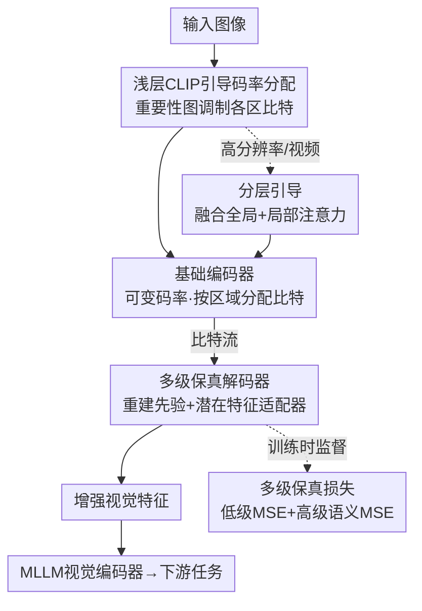

# When MLLMs Meet Compression Distortion: A Coding Paradigm Tailored to MLLMs

**会议**: ICLR 2026  
**论文**: [OpenReview](https://openreview.net/)（ICLR 2026 conference paper）  
**代码**: https://github.com/jmliu206/CoTAM  
**领域**: 多模态VLM / 图像编码  
**关键词**: MLLM图像编码, 压缩失真, 码率分配, CLIP语义先验, 跨层级特征

## 一句话总结
作者先系统分析了图像压缩失真对多模态大模型（MLLM）的影响，发现"跨层级特征"最脆弱，进而提出面向 MLLM 的图像编解码器 CoTAM——编码端用 CLIP 浅层注意力做语义码率分配、解码端用重建先验+适配器+多级损失保住多层级信息，在保持下游任务性能不变的前提下省下最多 35.99% 码率。

## 研究背景与动机
**领域现状**：MLLM（GPT-4o、Gemini、LLaVA 等）大多部署在云端，边缘设备要把图像/视频传上去，必须先压缩。可现在能用的压缩器分两类：传统编解码器（JPEG、ELIC 等）为人眼视觉系统（HVS）优化，追求像素保真；图像编码服务机器（ICM）方法则针对单一窄任务（如检测、分割）优化。

**现有痛点**：这两类方法用在 MLLM 上都"忽好忽坏"——HVS 编解码器在低级结构任务（如大字 OCR）上表现好、在高级任务上掉点；ICM 方法反过来在高级语义任务（如地标识别）上好、在别的任务上崩。原因是它们都没回答一个根本问题：MLLM 到底是怎么"整体地"感知压缩失真、又被它怎样影响的？

**核心矛盾**：MLLM 的下游任务横跨多个粒度——OCR 要低级结构、识物要高级语义、而数数（counting）同时需要两者。现有 ICM 范式只想保住高级语义、丢掉低级细节，恰恰破坏了那些"既要细节又要语义"的任务。

**切入角度**：作者借鉴 inflow/outflow 注意力分析方法，剖开 CLIP 视觉编码器，发现它处理信息分**三个阶段**：① 浅层做初步筛选（注意力发散、抓纹理边缘）；② 中层做局部信息提取（注意力收缩到邻近 patch、提取有清晰结构的低级特征）；③ 深层做全局语义整合（注意力汇聚到少数"summary token"、把局部特征拼成高级语义）。用平均注意力距离 $D_{avg}$ 和最大注意力距离 $D_{top1}$ 量化，得到一条清晰的"U 形曲线"——印证了三阶段。

**关键发现**：再测原图与压缩图在各层 token 的余弦相似度，发现 Stage 1/2 的低级特征对压缩很鲁棒（相似度线性缓降），但在 **Stage 3 早期相似度骤降**——这正是"跨层级特征"（cross-level features）形成的临界点。它脆弱是因为同时要靠 Stage 2 的高保真低级细节和 Stage 3 涌现的高级语义来合成，低级细节稍有损坏，合成就会不成比例地崩。而 Stage 3 后期的"粗粒度高级语义"反而又恢复鲁棒。

**核心 idea**：好的 MLLM 编解码器必须**同时**保住低级保真和高级语义，才能让脆弱的跨层级特征不崩——这就是 CoTAM 的基石。

## 方法详解

### 整体框架
CoTAM 是一个"编码端做语义码率分配、解码端做多层级保真修复"的双策略编解码器，整条链路冻结基础编解码器、只在外围插轻量模块。输入一张图，编码端先用冻结 CLIP 的浅层注意力算出一张"重要性图"，告诉基础编码器哪些区域该多分比特、哪些少分；压缩成比特流传输后，解码端把解码出的图当作"重建先验"保住低级结构，再用一个轻量适配器往特征域里注入高级语义增强，最终喂给 MLLM 的视觉编码器做下游任务。训练时额外用一个"多级保真损失"同时监督低级和高级特征的还原。面对高分辨率图和视频，再叠一个"分层引导"机制融合全局/局部注意力。

### 关键设计

**1. 浅层 CLIP 引导编码器：用三层注意力当"该往哪儿多花比特"的语义罗盘**

这针对的痛点是——传统编解码器按像素均匀分比特、ICM 又只顾窄任务，都不知道"对 MLLM 而言哪块区域语义最重要"。作者由 Takeaway 2（浅层做初步筛选、注意力距离最大）出发，取冻结 CLIP **前三层**的 [CLS] 注意力分数取平均，下采样成一张小空间图（如 $8\times8$），量化每个区域的语义丰富度。这张连续图再用基于统计的 $\mu \pm k\sigma$ 量化成**三级离散掩码**，三个整数等级直接对应码率指令：降码率 / 维持基准码率 / 升码率。这张掩码以 patch 为单位去调制基础编码器内部的量化参数，把比特倾斜给 MLLM 关心的语义关键区。妙在它几乎零开销——图很小、又只量化成三个值，$336\times336$ 输入下这张图只占 128 bit。之所以用浅层而非深层，是因为浅层注意力发散、适合做"全局初筛"，深层注意力已经汇聚到 summary token、拿来做码率分配反而掉点（消融已验证）。

**2. 多级保真解码器：重建先验保低级、潜在适配器补高级**

这针对的是 ICM 方法的通病——为追高级语义保真，反而把低级结构信息搞坏、连带跨层级特征一起崩。解码器用两手化解：其一，把**解码出的图像本身当作重建先验**。一方面标准压缩对鲁棒的低级结构本就保得不错（Takeaway 3），用解码图能稳住这份基础信息；另一方面 MLLM 视觉编码器是在自然 RGB 图上预训练的，直接喂解码图能避免域偏移（domain shift）。其二，在这个先验之上挂一个**轻量潜在特征适配器**（Latent Feature Adapter，单个 transformer block），它直接作用于比特流解出的潜在码，生成一份"语义增强特征"，再以逐元素相加的方式融进从解码图提取的 patch embedding。这样就把高级语义引导直接注入特征域、又不碰底层的低级信息，鱼和熊掌兼得。

**3. 多级保真损失：在特征谱的两端同时打监督**

只用一种损失都不行——只用高级损失会丢低级细节、只用低级损失则细节够但语义不连贯（消融已验证）。作者用一个加权的多级保真损失端到端训练：

$$L_{total} = \lambda_{low} L_{low} + \lambda_{high} L_{high}$$

低级保真损失 $L_{low}$ 约束**浅层**，最小化原图与解码图在 patch embedding 特征上的 MSE，把易被现有方法破坏的细粒度细节拉回来；高级感知损失 $L_{high}$ 约束**末层**，最小化原图与处理后输出在最终层 token 表示上的 MSE，保证全局语义连贯。两端一起管，正好对应"低级保真 + 高级语义都要保"的核心原则。训练协议是 5 个 epoch，第 1 个 epoch 只用 $L_{low}$ 做初始化、先学会还原基础结构以稳住优化轨迹，超参取 $k{=}0.75$、$\lambda_{low}{=}0.1$、$\lambda_{high}{=}1$。

**4. 分层引导：把方案扩展到高分辨率图与视频**

高分辨率是 MLLM 的刚需，但单张定尺寸下采样图给的引导太粗（背景注意力糊、抓不住关键如人头），而纯 patch-by-patch 的局部引导又缺全局视野、判断不出哪块局部对跨 patch 的语义最关键。作者提出**分层引导**：把全局重要性图和局部重要性图相加融合，得到一份"既局部精确又全局感知"的引导信号；同时把解码出的高分辨率特征 resize 成一份全局特征再过适配器，以匹配高分辨率 MLLM "多个高分 patch + 一个下采样全局 patch"的输入结构。视频 MLLM 通常把视频抽成固定帧（如 16、32 帧）当图像处理，于是这套语义引导可直接逐帧套用。

### 损失函数 / 训练策略
见关键设计 3。核心是多级保真损失 $L_{total} = \lambda_{low} L_{low} + \lambda_{high} L_{high}$，在 CC3M 采样的一百万张图上训练 5 个 epoch，首个 epoch 仅用 $L_{low}$ 预热。全程**冻结基础编解码器**，只学外围的适配器与引导模块，以此绕开"性能 vs 重建保真"的 trade-off。

## 实验关键数据

### 主实验
基础编解码器用 ELIC 和 DCAE 两个学习型压缩模型验证通用性；MLLM 用 LLaVA-1.5（7B/13B）为主，并在 LLaVA-OneVision-7B（SigLIP）、InternVL2-8B（InternViT）上验证泛化。下表给出复杂度与 BD-Rate：

| 方法 | 编码(s) | 解码(s) | 总耗时(s) | BD-Rate↓ |
|------|---------|---------|-----------|----------|
| ELIC | 0.173 | 0.096 | 0.269 | 0.00 |
| Ours(ELIC) | 0.178 (+2.9%) | 0.101 (+5.2%) | 0.279 (+3.7%) | **-35.99%** |
| DCAE | 0.077 | 0.085 | 0.162 | 0.00 |
| Ours(DCAE) | 0.080 (+3.9%) | 0.091 (+7.1%) | 0.171 (+5.6%) | **-31.05%** |

- 在同等下游任务性能下，ELIC 基座可省 35.99% 码率、DCAE 基座省 31.05%，且因只用 CLIP 前三层、不微调 codec，编码耗时仅增约 3–6%、PSNR 仅轻微下降（Kodak 上对比）。
- 跨 6 个图像 benchmark（MME / TextVQA / POPE / SeedBench / VQAv2 / MMMU / MMBench）一致超越 ELIC、DCAE、Bridge-d1/d3、ICMH-adapt 等 baseline；并首次把编码框架推到高分辨率图与视频（Video-MME）MLLM 场景。

### 消融实验

| 配置 | 表现 | 说明 |
|------|------|------|
| Full model | 最优 | 完整 CoTAM |
| w/o Adapter | 全 benchmark 灾难性掉点 | 适配器是压缩特征与 MLLM 间不可或缺的桥 |
| w/o Rec.（去重建先验） | TextVQA/SeedBench 急掉，MME 影响较小 | 不同任务对视觉保真依赖不同 |
| w/o CLIP guidance | 各 benchmark 一致下降 | 语义码率分配是有效的通用优化 |
| only $L_{high}$ | 丢低级细节 | 缺细粒度结构 |
| only $L_{low}$ | 语义不连贯 | 细节够但高级语义不一致 |

### 关键发现
- **适配器贡献最大**：去掉它三个 benchmark 全面崩，说明它在对齐压缩特征与下游 MLLM 特征空间上是普适且关键的。
- **重建先验的价值随任务而异**：TextVQA、SeedBench 这类依赖视觉保真的任务掉得狠，MME 则影响温和——印证不同任务对低级细节的依赖度不同。
- **浅层注意力优于深层**：用 CLIP 前三层做引导最优，深层注意力偏全局汇聚、拿来分比特反而掉点，与三阶段信息流模型一致。
- **多级损失缺一不可**：只高级损失或只低级损失都次优，二者融合才最好。

## 亮点与洞察
- **"跨层级特征最脆弱"是全文最 aha 的洞察**：把 MLLM 视觉编码拆成三阶段、再用 token 余弦相似度定位到 Stage 3 早期的骤降，解释了"为什么数数任务在压缩下崩得最惨"——它不是某类特征均匀丢失，而是桥接低级与高级的合成过程不成比例地塌掉。
- **零成本语义罗盘**：用冻结 CLIP 前三层注意力 + $\mu\pm k\sigma$ 三级量化，128 bit 就编码完一张重要性图，几乎不增加码率开销却能指导比特倾斜，这套"轻量语义先验做码率分配"的思路可迁移到任意学习型编解码器。
- **冻结 codec 绕开 trade-off**：不微调基础编解码器、只在外围加适配器与损失，既保住通用重建质量又服务 MLLM，工程上很解耦——换 ELIC/DCAE 都即插即用。
- **可直接吃高分/视频**：分层引导 + 逐帧套用，把方法从低分图扩到高分图和视频 MLLM，是该方向首个统一框架。

## 局限与展望
- 分析只隔离了视觉编码器、刻意剥离了受文本 prompt 影响的 LLM 主干，因此结论是"视觉处理管线"层面的通用规律，未必涵盖 LLM 端对压缩失真的二次放大/补偿效应。
- 码率分配依赖冻结 CLIP 的注意力，若 MLLM 用的视觉编码器与 CLIP 差异较大（如纯 SigLIP/InternViT），引导是否仍最优值得更细的验证（论文已在这些模型上测过泛化，但码率分配仍取自 CLIP）。
- 三级离散掩码（降/平/升）较粗，未来可探索更细粒度或可学习的码率指令；视频侧仍是"逐帧套用"，未利用帧间时序冗余，留有压缩空间。
- BD-Rate / 性能数值多以图（Fig.7–9）呈现，正文仅点出 35.99%、31.05% 等代表性数字，具体各 benchmark 增益⚠️ 以原文图表为准。

## 相关工作与启发
- **vs 传统 HVS 编解码器（ELIC、DCAE）**: 它们为人眼保真优化，低级结构任务好但高级语义任务掉点；CoTAM 以它们为基座、外挂语义引导与多级保真，把"为人眼"改造成"为 MLLM"。
- **vs ICM 方法（Bridge-d1/d3、ICMH-adapt）**: 它们只保高级语义、丢低级细节，破坏跨层级特征；CoTAM 同时保两端，故在数数这类跨层级任务上不崩。
- **vs 微调编码器的 ICM（Bridge-d3）**: CoTAM 主方案冻结 codec、绕开性能-重建 trade-off；即便也加 rate loss 做微调变体对比，仍优于对方，且两者都远超未微调基座。

## 评分
- 新颖性: ⭐⭐⭐⭐⭐ 首次系统刻画压缩失真对 MLLM 多层级特征的差异化影响，并据此设计编解码器
- 实验充分度: ⭐⭐⭐⭐ 跨 4 个 MLLM、7+ benchmark、两种基座 codec，还覆盖高分/视频，消融完整
- 写作质量: ⭐⭐⭐⭐ 从分析到方法逻辑闭环清晰，但关键结果多以图呈现、数字略难查
- 价值: ⭐⭐⭐⭐⭐ 云端 MLLM 部署的传输瓶颈是真实刚需，35.99% 码率节省且即插即用，落地价值高

<!-- RELATED:START -->

## 相关论文

- [\[ICLR 2026\] Constructive Distortion: Improving MLLMs with Attention-Guided Image Warping](constructive_distortion_improving_mllms_with_attention-guided_image_warping.md)
- [\[AAAI 2026\] When Eyes and Ears Disagree: Can MLLMs Discern Audio-Visual Confusion?](../../AAAI2026/multimodal_vlm/when_eyes_and_ears_disagree_can_mllms_discern_audio-visual_confusion.md)
- [\[ICLR 2026\] EventFlash: Towards Efficient MLLMs for Event-Based Vision](eventflash_towards_efficient_mllms_for_event-based_vision.md)
- [\[ICLR 2026\] Visual Jigsaw Post-Training Improves MLLMs](visual_jigsaw_post-training_improves_mllms.md)
- [\[ICLR 2026\] Sparsity Forcing: Reinforcing Token Sparsity of MLLMs](sparsity_forcing_reinforcing_token_sparsity_of_mllms.md)

<!-- RELATED:END -->
