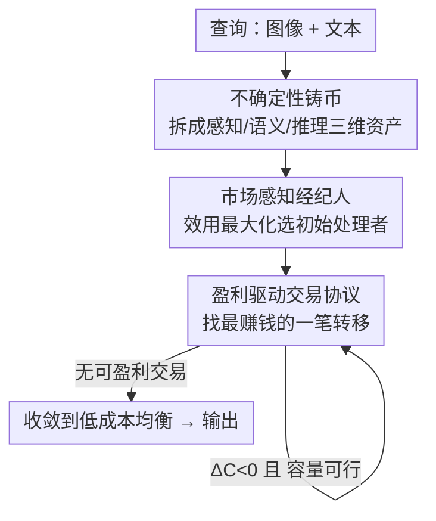

# Why Keep Your Doubts to Yourself? Trading Visual Uncertainties among Vision-Language Models

**会议**: ICLR 2026  
**OpenReview**: [https://openreview.net/forum?id=zeqCjGQB4U](https://openreview.net/forum?id=zeqCjGQB4U)  
**领域**: 多模态VLM / 多智能体系统  
**关键词**: VLM多智能体, 不确定性交易, 市场机制, 成本感知协调, Thompson Sampling

## 一句话总结
本文提出 **Agora**，把多个异构 VLM 之间的协作重构成一个「不确定性交易市场」：将认知不确定性拆成感知/语义/推理三维可交易资产，让智能体按「能不能降低系统总成本」的经济规则把不确定性卖给最擅长且最便宜的专家，并用一个扩展自 Thompson Sampling 的「市场经纪人」挑选初始智能体，在五个多模态基准上既涨点（MMMU +8.5%）又把成本砍掉 3 倍以上。

## 研究背景与动机

**领域现状**：VLM 能力变强后，大家自然想用「多智能体系统（MAS）」把多个 VLM 拼起来做集体智能，主流的协调范式有两类——Mixture-of-Agents（MoA）这种「多模型投票取共识」的聚合式方法，以及 KABB 这类「按历史表现 + 语义相似度打分选模型」的路由式方法。

**现有痛点**：这些方法在规模扩大时经济上不可持续——为了协调一群信息不对称的异构智能体，调用成本会失控地螺旋上升。更要命的是它们的协调依据是「启发式代理量」：MoA 假设错误是独立同分布的，可一旦多个智能体共享同样的架构偏置，对模糊输入会产生**相关的幻觉**，投票反而会把这种共同错误放大；KABB 的打分函数 $S = \alpha \cdot P_{hist} + \beta \cdot Sim_{sem}$ 里既看不到成本向量 $c$，又把整个不确定性向量压成一个标量，丢掉了结构信息。

**核心矛盾**：作者把这两类失败抽象成一个统一缺陷——**Agnostic Coordination（无知协调）**：一个协调机制如果同时是「成本无知」（选智能体时无视处理成本）和「不确定性结构无知」（把不确定性向量塌缩成标量），那它就被证明在「启发式上最强的智能体并非最具成本效益的求解者」的任务上必然次优（论文的 Inefficiency Theorem）。问题的根源在于：把智能（intelligence）当成可以蛮力堆砌的商品，而不是需要精细管理的稀缺经济资源。

**本文目标**：设计一个**同时显式地把成本与不确定性结构纳入决策**的协调机制，直接求解「在把最终不确定性压到可接受阈值 $\epsilon$ 的约束下最小化系统总期望成本」这个约束优化问题：$\min_\pi \mathbb{E}_{t\sim T}[C(\pi, u(t), c, \Xi)]$ s.t. $\|u_{final}\|\le\epsilon$。

**切入角度**：作者借经济学视角——既然根问题是「信息不对称下协调自利的智能体」，那就别去近似一个中央规划者，而是用**去中心化的市场机制**：让价格信号和经济激励驱动智能体主动暴露私有信息、把不确定性流向最该处理它的人。

**核心 idea**：**把认知不确定性「铸成货币」**——将其结构化为可定价、可交易的三维资产，让智能体之间按「降本即成交」的盈利规则交易不确定性，从而把多智能体协调变成一个收敛到低成本均衡的微型经济体。

## 方法详解

### 整体框架

Agora 的输入是一个带图像的查询（query text + query images），输出是最终回答。它把「协调」这件事做成三步串行的市场流程：**先建立可交易的资产 → 再定义成交规则 → 最后由经纪人启动并跑到均衡**。

具体来说：① 系统先在「不确定性评估中心」把这个查询的认知不确定性拆成感知 $U_{perc}$、语义 $U_{sem}$、推理 $U_{inf}$ 三个维度的向量资产，每个智能体维护自己的不确定性「投资组合」；② 一个「市场经纪人」用市场感知的效用函数从智能体池里挑一个经济上最划算的初始处理者，把全部初始不确定性分配给它；③ 进入迭代交易阶段，系统反复寻找「最赚钱的一笔交易」——即把某维不确定性从智能体 $i$ 转给更擅长它（专长高）且更便宜的智能体 $j$，只要这笔交易能降低系统总成本就执行，直到再也找不到能盈利的交易，市场就收敛到一个局部最优、成本高效的均衡。整个过程靠一本「历史交易账本」记录过往成交，用来给后续的不确定性转移定价。

### 关键设计

**1. 不确定性铸币：把单块认知负担拆成三维可交易资产**

针对 KABB「把不确定性塌缩成标量」的结构无知，Agora 的第一步是「铸造货币」——给市场定义一个良构的资产。它先把总不确定性 $u$ 分成两类：**可交易的认知不确定性 $u_{epis}$**（可被信息消除的、可约减的部分）和**不可交易的偶然不确定性 $u_{alea}$**（系统固有、不可约减的风险）。真正进入市场的 $u_{epis}$ 是一个三维向量 $u_{epis} = [u_{perc}, u_{sem}, u_{inf}]^T$，分别对应感知、语义、推理三个认知域。这一步「向量化」的关键意义在于：原本铁板一块、只能整体处理的不确定性，被拆成三种可以**独立定价、独立交易**的资产——一个智能体可能感知很强但推理很弱，于是它可以只「买下」别人的感知不确定性、把自己的推理不确定性「卖给」更会推理的人。每个智能体 $a_i$ 维护一个不确定性组合 $U(a_i,t) = U_{base}(a_i,t) + \sum_{j\ne i} U_{transfer}(a_j\to a_i,t)$，即自生不确定性叠加上通过市场交易净获得的部分，其中转移量 $U_{transfer}$ 由历史交易账本按相关性与成本效益加权聚合得到。

**2. 盈利驱动交易协议：用成本增量 $\Delta C$ 决定一笔交易成不成交**

这是克服「成本无知」的核心机制——所有交易都只看一条纯经济理性规则。当系统识别到一个「套利机会」（即有可能降低系统总成本）时，就计算把一个不确定性包 $T_{ij}(t)$ 从 $a_i$ 转给 $a_j$ 后的成本增量：

$$\Delta C(T_{ij}(t)) = \underbrace{[c_i(U_i - T_{ij}) + c_j(U_j + (1-\xi_j)T_{ij})]}_{\text{交易后成本}} - \underbrace{[c_iU_i + c_jU_j]}_{\text{交易前成本}} = T_{ij}(t)\cdot[c_j(1-\xi_j) - c_i]$$

这个化简后的式子非常直观：$\xi_j$ 是接收方 $a_j$ 在该维度的专长（专长越高，它处理同样不确定性的「残留成本系数」$c_j(1-\xi_j)$ 越低），只有当「让更擅长它的便宜专家来处理」比「自己留着」更省钱时 $\Delta C$ 才为负。于是成交规则简洁有力：**当且仅当这笔交易盈利（$\Delta C<0$）且可行（接收方还有认知容量 $U_j + T_{ij}\le C_j$）时才执行**。由于这条规则同时显式地用到了成本 $c$ 和不确定性的结构维度，它从构造上就同时违反了 Inefficiency Theorem 里「次优」的两个前提条件；每一笔成交都是在 Eq.1 全局成本目标上做的一次贪心下降。

**3. 市场感知经纪人：用扩展 Thompson Sampling 找经济上靠谱的起点**

交易协议保证了「往哪走是省钱的」，但去中心化优化还需要一个好的**起点**——否则贪心下降容易陷在糟糕的局部解。Agora 用一个扩展自 Thompson Sampling 的「经纪人」来选初始智能体，它最大化一个市场感知的期望效用：

$$\tilde{\theta}^{(t)}_S = (\mathbb{E}[Reward^{(t)}_S] - Cost^{(t)}_S)\cdot \exp(-\lambda\cdot Dist(S,t))\cdot U_{strategic}(S)^\omega \cdot Synergy(S)^\eta \cdot \gamma^{\Delta t}$$

这个效用函数把「期望收益减成本」作为主项，再乘上若干乘性调节因子：任务距离 $Dist$（这个智能体配置离当前任务有多对口）、战略不确定性 $U_{strategic}$（选它能不能开启后续有利可图的交易链）、协同度 $Synergy$（它和池中其他智能体的互补性）、时间衰减 $\gamma^{\Delta t}$（让陈旧的历史经验贬值）。整套 Agora 算法因此分两个阶段：经纪人先做一次效用最大化的初始化，把全部初始不确定性交给选中的处理者；随后进入迭代市场阶段，反复执行交易协议做确定性的贪心成本下降，直到无利可图为止。消融实验显示其中**战略不确定性 $U_{strategic}$ 因子贡献最大**——去掉它准确率掉得最多，说明「选一个能撬动后续盈利交易的起点」正是经纪人智能的关键。

### 损失函数 / 训练策略

Agora 不是端到端可训练的网络，而是一个**推理期的协调算法**：智能体池由五个现成的代表性 VLM（qwen2.5vl-72b/7b、gemini-2.0-flash、gemma-3-27b、gpt-4o-mini）以「基座模型 + 特定 prompt/角色」的形式组成「专家」，并发专家数 $N$ 可调。整个系统通过 OpenRouter API 访问、用 greedy decoding（`do_sample=False`）保证可复现；优化体现在交易协议的贪心成本下降与经纪人 MAB 的在线选择上，无需梯度训练。

## 实验关键数据

### 主实验

在五个多模态基准上，Agora 都把同池基座模型的最好成绩进一步抬高（括号为相对池中最优的增益）：

| 基准 | 池中最优基座 | Agora | 增益 |
|------|------|------|------|
| MMMU (Val) | 70.7% (gemini-2.0-flash) | 79.2% | +8.5% |
| MMBench V11 Test | 88.4% (qwen-72b) | 89.5% | +1.1% |
| MathVision | 41.3% (gemini-2.0-flash) | 44.3% | +2.0% |
| InfoVQA (test) | 87.3% (qwen-72b) | 88.9% | +1.6% |
| CC-OCR | 79.8% (qwen-72b) | 81.2% | +1.4% |

在 MMBench 上与其他路由 / 多智能体策略横向对比（$N=6$，成本归一化到 Agora=1.00）：Agora 以 89.50% 取得最高准确率，相对成本仅 1.00；而 KABB-VLM、MoA 准确率（87.12%、86.65%）更低却分别花 1.24×、3.11× 成本，协作开销指数 COI（1.53、1.82）和残留不确定性（0.21、0.25）也更高；FrugalGPT 等省成本（0.73–0.91×）的方法则掉点 8–9.6 分。Agora 占据明显更优的准确率-成本 Pareto 前沿。

### 消融实验

经纪人选择策略对比（MMMU Val，除 No Trading 外都开启交易）：

| 配置 | 准确率(%) | $U_{final}$↓ | COI↓ | UAPS(%)↑ |
|------|------|------|------|------|
| Agora (Ours, MAB) | 79.0 | 0.15 | 1.2 | 70.5 |
| Agora (No Trading) | 75.5 | 0.22 | 1.0 | 65.0 |
| KABB Selector + Trading | 76.0 | 0.25 | 1.5 | 65.5 |
| PPO Selector + Trading | 74.0 | 0.28 | 1.6 | 62.0 |
| DQN Selector + Trading | 73.0 | 0.30 | 1.7 | 60.0 |

效用函数各因子消融（MMBench V11 Test，$N=6$）：

| 变体 | 准确率(%)↑ | $U_{final}$↓ | UAPS(%)↑ | 相对成本↓ |
|------|------|------|------|------|
| Agora (Full) | 89.50 | 0.16 | 78.33 | 1.00 |
| w/o $U_{strategic}$ | 86.42 | 0.23 | 71.58 | 1.06 |
| w/o Synergy | 87.91 | 0.19 | 74.88 | 1.03 |
| w/o Dist | 88.53 | 0.18 | 76.21 | 1.01 |
| Only Net Return | 82.15 | 0.31 | 60.72 | 0.92 |

### 关键发现
- **交易机制本身就值很多分**：在 MMMU 上，开启交易的 Agora（79.0%）比 No Trading（75.5%）高 3.5 分、残留不确定性从 0.22 降到 0.15，说明「让智能体互相交易不确定性」而非各干各的是涨点主力。
- **市场感知经纪人 > RL/启发式选择器**：同样开交易，MAB 经纪人比 KABB 选择器高 3.0 分、比 PPO/MCTS/A2C/DQN 都高，说明经济学知情的效用函数比通用 RL 更适合这个协调任务。
- **战略不确定性因子最关键**：去掉 $U_{strategic}$ 掉 3.08 分（最多），且成本反升 6%，印证它在「引导选择朝有利可图的交易链走」上的核心作用；而完全只看净收益的「Only Net Return」直接掉 7.35 分。
- **成本随智能体池次线性增长**：即便只有 $N=1$，Agora 也能以极低成本比（0.02057）拿到 87.5% 准确率，超过 gemini-2.5-pro、InternVL3-78B 等贵模型；$N=8$ 时准确率达峰值 89.6% 后边际收益递减——体现「不需要无限堆智能体」的经济理性。

## 亮点与洞察
- **把「协调」翻译成「市场」是真正的范式跳跃**：作者没有去近似一个全知的中央调度器，而是承认信息不对称这一现实，用价格信号和盈利规则让去中心化的智能体自发收敛——这套「不确定性即货币」的隐喻不是花架子，$\Delta C = T_{ij}\cdot[c_j(1-\xi_j)-c_i]$ 这条成交规则把「专长 vs 成本」的权衡浓缩成一行可计算的判据。
- **把不确定性向量化，使「按维度分工」成为可能**：感知/语义/推理三拆让「擅长 OCR 的便宜模型只处理感知不确定性、擅长推理的贵模型只处理推理不确定性」这种细粒度分工在算法层面落地，这是相对 MoA「整体投票」最本质的进步。
- **可迁移的思路**：这套「把某种代价/不确定性形式化为可交易资产 + 用边际成本判据驱动贪心分配」的框架，原则上可迁移到任何异构模型集成、级联推理预算分配的场景（如 LLM 路由、检索-生成的预算切分）。

## 局限与展望
- **不确定性量化的可靠性是地基**：整个市场建立在「能准确把查询的认知不确定性拆成三维并打分」之上，但论文对 $u_{perc}/u_{sem}/u_{inf}$ 的具体估计方式在正文交代较略（细节在附录），若这一步噪声大，下游的定价与交易都会失真。⚠️ 自定义指标 UAPS、COI、$U_{final\_epis}$ 的精确定义需以原文附录为准。
- **贪心下降只保证局部最优**：交易协议是确定性贪心，收敛到的是「局部最优均衡」而非全局最优，经纪人选起点正是为了缓解这一点，但起点选差时仍可能陷入次优解。
- **依赖闭源 API 与固定智能体池**：实验都跑在 OpenRouter 上的现成模型，专长向量 $\xi$、成本 $c$ 的设定对不同池/不同定价的鲁棒性、以及在更大/更动态智能体池下的表现，仍有待检验。
- **理论假设与现实差距**：Inefficiency Theorem 等结论建立在对成本、专长的形式化假设上，真实部署中专长会随任务漂移、成本会随 API 价格波动，市场是否仍稳定收敛值得进一步研究。

## 相关工作与启发
- **vs Mixture-of-Agents (MoA)**：MoA 靠多智能体输出取共识，假设错误独立同分布；本文指出当智能体共享架构偏置时会放大相关幻觉，且 MoA 完全无视投票成本。Agora 用「按维度交易 + 成本判据」取代「无差别投票」，既省钱又避免共识陷阱。
- **vs KABB / 知识路由器**：KABB 用 $S=\alpha P_{hist}+\beta Sim_{sem}$ 选模型，既成本无知又把不确定性压成标量；Agora 保留不确定性的三维结构并把成本显式写进成交规则，在相同池上准确率更高（89.5% vs 87.12%）、成本更低（1.00× vs 1.24×）。
- **vs FrugalGPT / RouteLLM 等成本优化路由**：这些方法能省成本但普遍掉点 8–9.6 分；Agora 通过交易而非「选一个便宜模型一锤定音」，在省成本的同时把准确率推到 Pareto 前沿更优的位置。

## 评分
- 新颖性: ⭐⭐⭐⭐⭐ 「不确定性即可交易资产 + 去中心化市场协调」是对多智能体 VLM 协作的一次真正概念重构，并配有可证明的次优性定理支撑。
- 实验充分度: ⭐⭐⭐⭐ 五基准 + 多种路由/MAS/RL 选择器对比 + 因子消融 + $N$ 扩展分析较全面，但不确定性量化本身的可靠性验证偏少。
- 写作质量: ⭐⭐⭐⭐ 经济学叙事统一、动机清晰，公式与定理到位；部分核心指标（UAPS/COI）与不确定性估计细节下放附录。
- 价值: ⭐⭐⭐⭐⭐ 在「多智能体 VLM 经济上不可持续」这个真问题上给出了既涨点又省 3× 成本的可落地范式，实用价值与理论启发性都强。

<!-- RELATED:START -->

## 相关论文

- [\[ICLR 2026\] ERGO: Efficient High-Resolution Visual Understanding for Vision-Language Models](ergo_efficient_high-resolution_visual_understanding_for_vision-language_models.md)
- [\[ICLR 2026\] Multimodal Prompt Optimization: Why Not Leverage Multiple Modalities for MLLMs](multimodal_prompt_optimization_why_not_leverage_multiple_modalities_for_mllms.md)
- [\[ICLR 2026\] ViPER: Empowering the Self-Evolution of Visual Perception Abilities in Vision-Language Models](viper_empowering_the_self-evolution_of_visual_perception_abilities_in_vision-lan.md)
- [\[CVPR 2026\] The LLM Bottleneck: Why Open-Source Vision LLMs Struggle with Hierarchical Visual Recognition](../../CVPR2026/multimodal_vlm/the_llm_bottleneck_why_open-source_vision_llms_struggle_with_hierarchical_visual.md)
- [\[ICLR 2026\] Why Reinforcement Fine-Tuning Preserves Prior Knowledge Better: A Data Perspective](why_reinforcement_fine-tuning_enables_mllms_preserve_prior_knowledge_better_a_da.md)

<!-- RELATED:END -->
