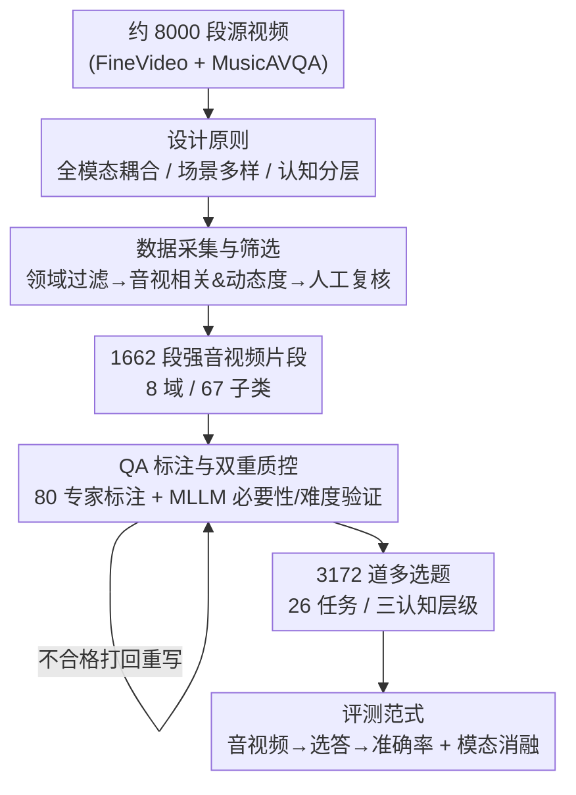

# WorldSense: Evaluating Real-World Omnimodal Understanding for Multimodal LLMs

**会议**: ICLR 2026  
**OpenReview**: [https://openreview.net/forum?id=YxsfxAvJv4](https://openreview.net/forum?id=YxsfxAvJv4)  
**论文**: [Project Page](https://jaaackhongggg.github.io/WorldSense)  
**代码**: https://github.com/jaaackhongggg/WorldSense (项目页)  
**领域**: 多模态VLM / Omnimodal 评测基准  
**关键词**: 全模态理解、音视频协同、视频问答基准、MLLM 评测、真实世界场景

## 一句话总结
WorldSense 是第一个**强制音频与视觉协同**的真实世界全模态视频理解基准——1662 段同步音视频、3172 道多选题，每道题都设计成"去掉音频或去掉视频就答不对"，结果连最强的 Gemini 2.5 Pro 也只有 65.1% 准确率，多数开源音视频模型甚至接近随机猜测。

## 研究背景与动机

**领域现状**：多模态大模型（MLLM）在分类、字幕、问答、OCR、分割、自动驾驶等任务上进步很快，配套基准也从静态图像理解一路演进到视频的时序理解。

**现有痛点**：现有的多模态分析和评测**几乎只盯着"视觉 + 语言"**，把音频这个真实世界里至关重要的模态丢在一边，导致对模型多模态能力的评估是不完整的。少数引入音频的基准也各有硬伤：OmniBench、AV-Odyssey 本质上评的是**静态图像 + 音频**而非真正的视频；Music-AVQA、AVQA 局限在单一领域、提问模式单调；LongVALE 只评字幕生成（captioning）。

**核心矛盾**：真实世界的理解本质是**多模态耦合**的——开车时人要同时整合看到的路标红绿灯、听到的鸣笛警报、握方向盘的触感才能做决策；任何单一模态都给不出完整语境。但现有基准要么缺音频，要么音视频"弱相关"（看视频或读字幕就能答），根本无法逼出模型真正的音视频协同能力。

**本文目标**：造一个能严格考核 MLLM"在真实世界场景下感知、理解、推理全模态信息"的综合基准，具体要解决三个子问题——如何保证每道题都**真的需要音视频协同**、如何覆盖**足够多样**的真实场景与认知层级、如何保证标注**高质量可靠**。

**切入角度**：作者认为评测的关键不是"题目里有没有音频"，而是"答对**必须**用上音频"。于是把"模态必要性"做成一条硬约束贯穿全流程，并用专家 + MLLM 双重验证来执行这条约束。

**核心 idea**：用"去掉任一模态就必然答错"的强耦合设计，把全模态视频理解从"可选加分项"变成"必答项"，从而第一次诚实地暴露出当前 MLLM 在真实世界全模态推理上的巨大差距。

## 方法详解

WorldSense 是一篇**基准（benchmark）论文**，没有提出新模型，核心贡献是一套从"设计原则 → 数据采集 → 标注质控 → 评测范式"的数据集构建方法学，以及在其上对三类 MLLM 的系统评测。

### 整体框架

整个基准的构建可以看成一条带质量闭环的流水线：先按"全模态耦合 / 场景多样 / 认知分层"三条设计原则定下蓝图，再从大规模视频库里**两级过滤**出 1662 段强音视频相关的片段，然后由 80 名专家为每段视频人工标注多选题，最后用"专家评审 + MLLM 自动验证"的**双重质控回环**把不合格的题打回重写，最终产出可评测的 3172 道题。评测时给模型喂"同步音视频 + 多选题"，用准确率打分，并通过模态消融量化各模态的贡献。

### 关键设计

**1. 全模态强耦合：把"音视频协同"做成答题的硬约束**

这是 WorldSense 区别于一切既有基准的根本点，针对的正是"现有基准音视频弱相关、看一个模态就能答"的痛点。作者要求**每道题都满足"去掉音频或去掉视频就必然答错"**：例如视频里一个人手里拿着水果，画面只能告诉你"是什么水果"，唯有音频里的旁白才能说清"他在展示蓝莓的大小"还是"在数蓝莓"；又如要判断"视频中那段欢快有活力、音调最高的音乐对应哪个国家"，必须同时用文化视觉线索和听觉线索才能定位。这条约束不是靠出题人主观把关，而是后续被自动验证机制强制执行（见设计 3），从而保证基准考的是真正的协同感知，而不是单模态捷径。

**2. 分层 taxonomy + 三级认知评测：覆盖真实场景的广度与认知的深度**

针对"现有音视频基准领域单一、提问单调"的痛点，WorldSense 在两个维度上做系统铺开。**内容维度**上构建层级化分类体系：从以人为中心的 8 个一级领域（科技与科学、文化与政治、日常生活、影视、表演、游戏、体育、音乐）细化出 67 个细粒度子类，并刻意覆盖三类声学模态——语音（speech）、环境事件音（environmental events）、音乐（music），从带语言内容到非语言、再到抽象听觉线索的完整谱系。**认知维度**上设计三层框架：识别（recognition，检测基本音视元素）、理解（understanding，把握多模态关系）、推理（reasoning，因果推断、抽象思维等高阶任务），共 26 个任务对齐这三层。最终 1662 段视频平均时长 141.1 秒，配 3172 道题，使评测既铺得开又有梯度。

**3. 80 专家标注 + MLLM 双重验证的质控闭环：让"模态必要性"可执行、可保证**

设计 1 提出的"必须音视频协同"若没有强制手段就只是口号，这个设计就是它的执行器。标注端由 80 名专业标注员逐段审看音视内容、人工撰写多选题；质控端则是一个**专家评审 + 自动验证并行**的回环。专家按三条标准打分：语言清晰连贯、答对确需多模态、难度适当，不达标的题被打回重写。自动验证更巧妙地分两路：用**纯视觉语言模型 Qwen2-VL** 去试答，若它仅凭视觉就能答对，说明这题不满足"音频必要性"，需返修；再用 **Video-LLaMA2、OneLLM 等能同时吃视频/音频/文本的全模态模型**评估难度，凡是被所有模型都答对的题被标记为"太简单"打回。这套机制把抽象的"模态必要 + 有挑战性"翻译成了可机器执行的过滤规则，是基准可靠性的核心保障。

### 损失函数 / 训练策略
本文不训练模型，评测范式为：每个测试实例 = 一段同步音视频 + 一道多选题，模型读入多模态输入后从候选项中选答，用**基于匹配的方式**抽取模型答案与真值比对，指标为准确率（accuracy）。为量化各模态贡献，作者额外做了多组模态配置的消融（纯音频 / 音频+字幕 / 音频+视频帧；视频 / 视频+字幕 / 视频+原始音频等）。

## 实验关键数据

评测覆盖三类模型：开源音视频 MLLM（Unified-IO-2、OneLLM、VideoLLaMA2、Qwen2.5/3-Omni 等）、开源视频 MLLM（Qwen2-VL、LLaVA-OneVision、InternVL2.5、LLaVA-Video 等）、闭源 MLLM（Claude 3.5、GPT-4o、Gemini 1.5/2.5）。

### 主实验

| 模型类别 | 代表模型 | 整体准确率 Avg |
|--------|---------|------|
| 闭源 MLLM | **Gemini 2.5 Pro**（音视频） | **65.1%**（最高） |
| 闭源 MLLM | Gemini 2.5 Flash | 52.3% |
| 闭源 MLLM | Gemini 1.5 Pro | 48.0% |
| 闭源 MLLM | GPT-4o（纯视觉） | 42.6% |
| 闭源 MLLM | Claude 3.5 Sonnet | 34.8% |
| 开源音视频 | video-SALMONN 2+ (72B) | 56.5% |
| 开源音视频 | Qwen3-Omni (7B) | 54.0% |
| 开源音视频 | Unified-IO-2 / OneLLM / VideoLLaMA2 | 22.8–25.9%（≈随机） |
| 开源视频 | LLaVA-Video / InternVL2.5 (7-8B) | 39–40% |

关键观察：(i) 即便最强的 Gemini 2.5 Pro 也只有 65.1%，远未达到真实世界可靠应用的门槛；(ii) **反直觉地**，早期开源音视频模型（如 Unified-IO-2、OneLLM、VideoLLaMA2）虽然能同时吃音视频，准确率却只有约 25%、**比纯视频模型还差**，说明"有多模态输入能力"不等于"会做多模态融合"。

### 消融实验（模态贡献）

| 配置 | 代表结果（Gemini 1.5 Pro） | 结论 |
|------|------|------|
| 纯音频 → +视频帧 | 34.6% → 48.0%（+13.4） | 视觉信息显著提升理解 |
| 纯视频 → +字幕 → +原始音频 | 34.4% → 39.3% → 48.0% | 字幕有用，**原始音频用处更大** |
| 视频 → +字幕（GPT-4o） | 42.6% → 50.1%（+7.5） | 转写字幕能显著补足视频模型 |
| 视频 → +原始音频（OneLLM） | 12.6% → 22.8%（+10.2） | 音频对弱模型增益最明显 |

### 关键发现
- **原始音频 > 字幕**：在 Music 等任务上，字幕无法捕捉旋律、节奏、和声等声学特征，原始音频保留了韵律、语调、情感、环境音等副语言线索，因此带来字幕之外的额外增益——印证了"完整声学线索对全模态理解不可或缺"。
- **音视频互补且必须联合建模**：视觉是基础，音频是显著增量，二者协同才能稳健理解真实世界；这也解释了为何"弱融合"的模型反而拖后腿。
- **能力短板集中**：模型在**音频相关任务**（音频识别、音频计数）、**空间推理与计数**、**情感相关任务**上普遍最差——情感任务需要整合面部表情、语调、上下文语义等细微多模态线索，暴露当前训练数据与能力的明显缺口。
- **声学类型不一致**：即便整体最强的 Gemini 1.5 Pro，在环境事件音上的准确率也明显低于语音和音乐，说明对复杂环境声的理解仍是通病。

## 亮点与洞察
- **"模态必要性"从口号变成可执行的过滤器**：用纯视觉模型去"反向证伪"——若它能单凭视觉答对就说明题不合格——这个思路把"是否真需要音频"变成了机器可判定的硬规则，非常值得迁移到任何"要求多模态协同"的数据集构建中。
- **基准最有价值的不是排行榜而是失败模式**：作者通过细粒度任务/声学类型拆解，精准定位出音频理解、计数、情感三大短板，给后续模型改进指出了具体方向，而不只是给个总分。
- **"有输入能力 ≠ 有融合能力"被定量证实**：开源音视频模型反而不如纯视频模型，这个反直觉结论提醒社区：堆模态接口不等于真融合，融合机制本身才是瓶颈。

## 局限与展望
- **题型单一**：全部为多选题（multiple-choice），便于自动评分但可能高估模型能力（蒙对/排除法），也无法考核开放式生成与解释能力。
- **数据来源偏置**：视频主要来自 FineVideo（YouTube）+ MusicAVQA，可能偏向特定内容风格与语言，真实世界的更长尾场景覆盖有限。
- **音频类型与触觉等缺失**：虽涵盖语音/事件/音乐三类声学模态，但 introduction 里强调的触觉等其他模态并未纳入，"全模态"实际仍是"音 + 视 + 文"。
- **改进方向**：作者把工作定位为"通往真实世界理解的 roadmap"，通过消融指出原始音频、视觉线索是关键因素；后续可在此基准上探索更强的音视频融合架构与针对情感/计数短板的定向训练。

## 相关工作与启发
- **vs OmniBench / AV-Odyssey**：它们虽含音频，但本质是**静态图像 + 音频**，缺乏时序；WorldSense 用真实同步视频，考的是时序事件、运动模式与音视相关性。
- **vs Music-AVQA / AVQA**：它们领域单一（如只音乐）、提问模式单调；WorldSense 跨 8 域 67 子类、26 任务，开放域且多任务。
- **vs LongVALE**：它只评字幕生成；WorldSense 评从识别到推理的三层认知能力。
- **vs Video-MME 等视频基准**：它们音视频"弱相关"（看视频就能答），WorldSense 第一个把"答对必须音视频协同"做成硬约束，真正逼出协同感知能力。

## 评分
- 新颖性: ⭐⭐⭐⭐⭐ 第一个强制音视频协同的真实世界全模态视频基准，"模态必要性可验证"的构建思路有原创性。
- 实验充分度: ⭐⭐⭐⭐⭐ 覆盖三类共数十个 MLLM，配多组模态消融与细粒度失败分析，结论扎实。
- 写作质量: ⭐⭐⭐⭐ 设计原则—采集—质控—评测脉络清晰，图表丰富，但模型缩写密集略费读。
- 价值: ⭐⭐⭐⭐⭐ 诚实暴露 SOTA 仅 65% 的差距并定位三大短板，为全模态理解研究提供高价值评测平台。

<!-- RELATED:START -->

## 相关论文

- [\[ACL 2026\] EDU-CIRCUIT-HW: Evaluating Multimodal Large Language Models on Real-World University-Level STEM Student Handwritten Solutions](../../ACL2026/multimodal_vlm/edu-circuit-hw_evaluating_multimodal_large_language_models_on_real-world_univers.md)
- [\[ICLR 2026\] Bongard-RWR+: Real-World Representations of Fine-Grained Concepts in Bongard Problems](bongard-rwr_real-world_representations_of_fine-grained_concepts_in_bongard_probl.md)
- [\[ICLR 2026\] MotionSight: Boosting Fine-Grained Motion Understanding in Multimodal LLMs](motionsight_boosting_fine-grained_motion_understanding_in_multimodal_llms.md)
- [\[ACL 2026\] GuideDog: A Real-World Egocentric Multimodal Dataset for Blind and Low-Vision Accessibility-Aware Guidance](../../ACL2026/multimodal_vlm/guidedog_a_real-world_egocentric_multimodal_dataset_for_blind_and_low-vision_acc.md)
- [\[ICML 2026\] TimeSpot: Benchmarking Geo-Temporal Understanding in Vision-Language Models in Real-World Settings](../../ICML2026/multimodal_vlm/timespot_benchmarking_geo-temporal_understanding_in_vision-language_models_in_re.md)

<!-- RELATED:END -->
