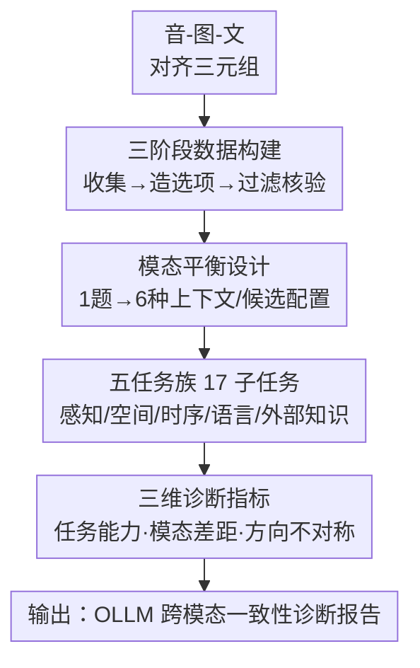

# XModBench: Benchmarking Cross-Modal Capabilities and Consistency in Omni-Language Models

**会议**: ICLR 2026  
**论文**: [Project Page](https://github.com/XingruiWang/XModBench)  
**代码**: https://github.com/XingruiWang/XModBench (有)  
**领域**: 多模态VLM  
**关键词**: 全模态大模型, 跨模态一致性, 音视频文本, 评测基准, 模态偏置

## 一句话总结
XModBench 是首个"三模态全平衡"的多选题评测基准，用 6.1 万道把同一语义在 音/图/文 三种模态、6 种"上下文→候选"方向上各问一遍的题目，专门诊断全模态大模型（OLLM）到底是真做到了模态无关推理，还是在偷偷依赖某种模态的表层特征——结论是连最强的 Gemini 2.5 Pro 都远没达标。

## 研究背景与动机
**领域现状**：全模态大模型（Omni-modal LLM，OLLM）如 Gemini 2.5、Qwen2.5-Omni 把文本、视觉、音频塞进同一个推理框架，号称能"统一理解"。现有评测（Music-AVQA、OmniBench、WorldSense、AVQA 等）基本只看"模型能不能答对跨模态问题"，即综合准确率。

**现有痛点**：这些 benchmark 几乎都把上下文或候选项固定在单一模态（比如永远是"看图选文字"），覆盖不到所有模态方向；更关键的是，它们都**不检验一致性**——当同一件事换成"听声音选图""看图选声音"时，模型答案会不会变。少数做一致性的工作（如 Modality Importance Score、文本-图像一致性）又只局限在 视觉-文本 这一个模态对里。

**核心矛盾**：人类做跨模态整合是无缝的——"狗叫"无论是听到、看到还是读到，结论都一样。但 OLLM 究竟是在**共享语义表示**上推理（模态无关），还是在不同模态各自记了一套表层模式（模态特定偏置）？这二者用现有"只看综合准确率"的评测根本区分不开：一个模型在"图→文"上拿高分，可能只是视觉通道强，并不代表它在"音→文"上同样可靠。

**本文目标**：造一个能把"模态无关推理 / 模态间差距 / 方向不对称"三件事拆开、量化诊断的基准。

**切入角度**：关键观察是——只要让**语义完全相同**的题目在不同模态配置下各问一遍，准确率的分歧本身就是"依赖表层模式"的直接证据。于是把"控制变量"思想搬进评测设计：固定语义内容，只变模态。

**核心 idea**：用 音/图/文 对齐三元组造题，把每道题实例化成全部 6 种"上下文模态→候选模态"方向，再在这套平衡设计上定义两个差异指标，直接量出模型的模态偏置和方向不对称。

## 方法详解

### 整体框架
XModBench 本质是一条"造数据 + 定指标"的评测构建流水线，不是一个模型。它要回答的是"怎么把跨模态一致性测出来"。整体分三步走：先收集 音-图-文 **对齐三元组**（同一语义有三种模态形态），把每个三元组按"上下文取哪种模态、四个候选取哪种模态"排列组合，**实例化成 6 种模态配置**的多选题；这些题覆盖 **5 大任务族 17 个子任务**，经过 LLM 过滤 + 人工核验后得到 10,220 个独立实例、61,320 道题；最后在这套平衡题库上定义 **3 个诊断维度**（任务能力 / 模态差距 / 方向不对称），把模型的弱点细粒度地照出来。

### 关键设计

**1. 模态平衡设计：同一道题强行问满 6 个方向，把"模态"变成唯一变量**

这针对"现有 benchmark 固定上下文/候选模态、测不出一致性"的痛点。每道题是四选一的多选题，由一个 `<context>`（题干，描述某对象/事件）和四个 `<candidates>`（选项）组成。把文本(T)、视觉(V)、音频(A) 在 context 和 candidates 两个位置上做排列，就得到 6 种配置：$A\!\to\!T,\ A\!\to\!V,\ T\!\to\!A,\ T\!\to\!V,\ V\!\to\!A,\ V\!\to\!T$（箭头左边是上下文模态、右边是候选模态）。因为同一份语义被实例化成 6 个版本、内容完全不变只换模态壳，任何配置间的准确率差异都只能归因于模态本身——这正是"控制变量"在评测里的体现，也是后面两个诊断指标能成立的前提。没有平衡设计，"模型在音频上弱"这种结论就永远和"音频任务恰好更难"纠缠不清。

**2. 五任务族 17 子任务：覆盖从感知到外部知识的能力谱，且每个子任务都跨模态可问**

光有平衡方向还不够，得保证测的能力够全且够难。XModBench 设计了 5 大任务族：**感知**（识别同一对象/活动/乐器/自然环境，含通用与细粒度识别）、**空间推理**（2D 左右排列、3D 定位、3D 运动方向，音频用立体声左右/远近线索）、**时序推理**（事件顺序、重复计数、计数后再做简单算术如 $2\times\text{count}$）、**语言理解**（跨模态的文字识别/OCR-ASR 统一、中英翻译、对话情绪分类）、**外部知识**（电影识别、音乐流派、歌手辨识，需链接世界知识）。每个子任务都按平衡设计实例化到所有模态对，干扰项专门造得"语义接近但不歧义"（如翻译题把"very"换成"a little"、计数题只差几次、乐器题同类混淆），逼模型做精确判别而非蒙。

**3. 三维诊断指标：把"综合准确率"拆成能力、模态差距、方向不对称三把尺子**

这是 XModBench 区别于普通 benchmark 的核心。① **任务能力**：每个任务在 6 个模态方向上都问过，对它们取平均，得到不受单一模态偏置干扰的任务级能力估计。② **模态差距（Modality disparity）**：固定语义、只换模态来量两种模态谁更弱，定义为成对相减之和，例如比较文本与视觉

$$\Delta_{T\ \text{vs}\ V} = (\text{Acc}_{A\to V} - \text{Acc}_{A\to T}) + (\text{Acc}_{V\to A} - \text{Acc}_{T\to A})$$

负值越大说明把同样内容换成该模态时掉分越狠。③ **方向不对称（Directional imbalance）**：交换 context 与 candidate 的角色看准确率差

$$\Delta_{X\leftrightarrow Y} = \text{Acc}(X\to Y) - \text{Acc}(Y\to X),\quad (X,Y)\in\{(A,T),(V,T),(V,A)\}$$

它暴露的是"读 X 选 Y"和"读 Y 选 X"不对等的 grounding 缺陷——理想的模态无关模型这俩应该相等。三把尺子合起来，就能说清模型到底是"哪类任务弱""哪种模态弱""哪个方向弱"。

**4. 三阶段数据构建：保证三元组真对齐、选项有挑战、标注可信**

跨模态一致性评测的命门是"三种模态版本必须语义严格对齐"，否则差异就成了噪声。流水线分三阶段：(i) **跨模态收集**——融合三类来源：重标注/扩展已有数据集（如 VGG-Sound 做感知、STARSS23 做空间）、合成补全缺失模态（FireRedTTS 生成语音、渲染翻译用的文字图）、网络采集冷门域（歌手肖像与歌曲、电影海报与预告）；(ii) **题目候选生成**——先用人工模板套三元组造多选题，再用 GPT-5 仅润色语言流畅度（明确不引入新信息、不改语义），干扰项造得语义难但无歧义；(iii) **LLM 过滤 + 人在环核验**——先用基础模型过滤低质/歧义样本，再由标注员双重核对、内部试答、对有歧义的题反复重生成重测，直到合格。这套流程换来的是 61,320 道高质量、跨模态严格对齐的题。

## 实验关键数据

### 主实验
在 14 个开源/闭源 OLLM 上评测（含 Gemini 1.5/2.0/2.5 系列、Qwen2.5-Omni、EchoInk-R1、Baichuan-Omni、VITA、Unified-IO 2 系列、PandaGPT 等），并设人类与"无上下文"对照。报告各任务族平均准确率、6 种模态配置准确率、整体均值 Avg. 与跨配置标准差 Std.（越小越稳健）。

| 模型 | Avg. | Perc. | Spat. | Temp. | Ling. | Knwl. | Std.（6配置） |
|------|------|-------|-------|-------|-------|-------|------|
| 人类 | 91.5 | 91.0 | 89.7 | 88.9 | 93.9 | 93.9 | 3.0 |
| **Gemini 2.5 Pro** | **70.6** | 75.9 | 50.1 | 60.8 | 76.8 | 89.3 | 11.7 |
| Gemini 2.5 Flash | 63.7 | 66.1 | 48.0 | 48.6 | 73.1 | 82.8 | 14.2 |
| EchoInk-R1（开源最强） | 59.2 | 75.8 | 36.6 | 37.1 | 73.3 | 73.3 | 11.3 |
| Qwen2.5-Omni | 58.6 | 75.5 | 38.4 | 32.3 | 74.1 | 72.8 | 10.1 |
| Gemini 1.5 Pro | 55.0 | 56.2 | 40.1 | 37.1 | 72.6 | 69.4 | 16.7 |
| No Context（瞎猜对照） | 25.1 | 25.5 | 24.8 | 24.9 | 24.7 | 25.5 | 0.4 |

要点：① 最强的 Gemini 2.5 Pro 也只有 70.6，离人类 91.5 差一大截，**空间(50.1)、时序(60.8) 是公认短板**（比感知/语言低 15–25 分）；② 开源最强 EchoInk-R1/Qwen2.5-Omni 在感知上能追平 Gemini 2.5 Pro，但外部知识差很多（Gemini 2.5 Pro 89.3 vs ~73），作者归因于闭源模型更大规模的网络预训练；③ "No Context" 全在 25% 随机线附近，说明题目无法靠先验蒙对，设计有效。

### 诊断指标分析（模态差距 / 方向不对称）

| 诊断维度 | 关键数值（Gemini 2.5 Pro） | 说明 |
|---------|---------------------------|------|
| $\Delta_{T\ \text{vs}\ A}$（文本 vs 音频） | **−49** | 差距最大，**音频是最弱模态** |
| $\Delta_{V\ \text{vs}\ A}$（视觉 vs 音频） | −33 | 中等 |
| $\Delta_{T\ \text{vs}\ V}$（文本 vs 视觉） | −15 | 最小，文本最稳健 |
| $\Delta_{T\to V \leftrightarrow V\to T}$ | 8.8（Qwen2.5-Omni 达 16.6） | 视觉-文本方向不对称明显 |
| 音频-文本方向差 | ~6–8 | 也存在不对称 |
| 音频-视觉方向 | 近乎对称但整体准确率最低 | 缺文本锚点时最难 |

### 关键发现
- **音频是全场最弱一环**：只要题目涉及音频，准确率就大幅下滑；感知任务在 视觉-文本 下能超 90%，换成 音频-文本 直接掉 20+ 分。听觉表示的对齐质量远落后于视觉。
- **方向不对称暴露双向对齐没做全**：候选项是文本时普遍更准；$T\to V$ 比 $V\to T$ 系统性更高，作者推测是训练数据偏向"以文本为输出模态"。
- **标准差是被低估的诊断量**：Gemini 2.5 Pro 在高准确率同时 Std. 仅 11.7（最稳）；Gemini 1.5 Pro、Baichuan-Omni 1.5 的 Std. >14，说明它们对模态变化更脆弱——光看 Avg. 看不出这种鲁棒性差异。
- **失败案例**：让模型边答边给推理，发现常见错误正对应模态差距与对齐问题（如对音频内容的错判、跨模态 grounding 错位）。⚠️ 具体失败类别细节以原文 Sec. 4.5 为准。

## 亮点与洞察
- **"控制变量"思想做评测**：固定语义、只变模态，把"模型弱"和"任务难"彻底解耦——这是 XModBench 能给出可信一致性结论的根本，也是普通 benchmark 学不来的地方。
- **两个诊断指标可直接复用**：模态差距 $\Delta_{\text{vs}}$ 和方向不对称 $\Delta_{\leftrightarrow}$ 的定义很通用，任何想测"模态偏置/双向对齐"的多模态系统都能照搬这套成对相减的算法。
- **Std. 当作鲁棒性指标**：用跨配置标准差量"模型对模态变化的稳定性"，提供了一个超越平均准确率的评价角度，值得迁移到其他多配置评测。
- **三源数据构建模板**：重标注现有集 + 合成补缺模态 + 网络采冷门域，是造"严格三模态对齐"数据集的实用配方。

## 局限与展望
- **只覆盖 音/图/文 三模态**：未涉及视频时序的更复杂场景、触觉/3D 点云等其他模态；"全模态"实际仍是三模态。
- **多选题格式的天花板**：四选一能精确判分，但也限制了对开放式生成、长链推理一致性的评估；真实应用里模型未必以选择题形式工作。
- **GPT 系列被排除**：因 OpenAI API 当前不支持音视频联合输入而未评测，闭源对比不完整。⚠️ 以原文为准。
- **改进思路**：可扩展到开放式作答的一致性度量、引入更多模态对、或把诊断指标反过来当训练信号去显式优化模态无关性。

## 相关工作与启发
- **vs OmniBench / WorldSense / AVQA**：它们做"覆盖广度"（多任务多模态），但固定模态方向、不测一致性；XModBench 做"诊断深度"，用全平衡 6 方向专测模态无关推理。
- **vs Modality Importance Score (Park et al. 2025) / 文本-图像一致性 (Zhang et al. 2024)**：前人一致性研究局限在单一模态对（视频QA 或 视觉-文本）；XModBench 把范围扩到全部三模态对，并配上成对差异指标做系统量化。
- **vs AV-Odyssey / Pano-AVQA**：同为音视融合评测，但它们仍以综合准确率为主；XModBench 额外拆出模态差距与方向不对称两个轴。

## 评分
- 新颖性: ⭐⭐⭐⭐⭐ 首个三模态全平衡、专测跨模态一致性的基准，控制变量式设计是真创新
- 实验充分度: ⭐⭐⭐⭐⭐ 14 个 OLLM + 人类对照，三维诊断把弱点照得很细
- 写作质量: ⭐⭐⭐⭐ 设计动机与指标定义清晰；部分子任务细节散在附录
- 价值: ⭐⭐⭐⭐⭐ 给 OLLM 指出"音频弱、方向不对称"的明确改进方向，诊断工具价值高

<!-- RELATED:START -->

## 相关论文

- [\[ICLR 2026\] Omni-Captioner: Data Pipeline, Models, and Benchmark for Omni Detailed Perception](omni-captioner_data_pipeline_models_and_benchmark_for_omni_detailed_perception.md)
- [\[ICLR 2026\] PhysLLM: Harnessing Large Language Models for Cross-Modal Remote Physiological Sensing](physllm_harnessing_large_language_models_for_cross-modal_remote_physiological_se.md)
- [\[ICLR 2026\] OmniVinci: Enhancing Architecture and Data for Omni-Modal Understanding LLM](omnivinci_enhancing_architecture_and_data_for_omni-modal_understanding_llm.md)
- [\[CVPR 2026\] ProSoftArena: Benchmarking Hierarchical Capabilities of Multi-modal Agents in Professional Software Environments](../../CVPR2026/multimodal_vlm/prosoftarena_benchmarking_hierarchical_capabilities_of_multi-modal_agents_in_pro.md)
- [\[ICLR 2026\] OmniVideoBench: Towards Audio-Visual Understanding Evaluation for Omni MLLMs](omnivideobench_towards_audio-visual_understanding_evaluation_for_omni_mllms.md)

<!-- RELATED:END -->
