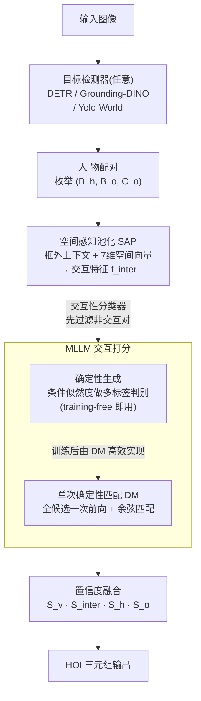

# Zero-shot HOI Detection with MLLM-based Detector-agnostic Interaction Recognition

**会议**: ICLR 2026  
**arXiv**: [2602.15124](https://arxiv.org/abs/2602.15124)  
**代码**: [https://github.com/SY-Xuan/DA-HOI](https://github.com/SY-Xuan/DA-HOI)  
**作者**: Shiyu Xuan, Dongkai Wang, Zechao Li, Jinhui Tang  
**领域**: 多模态VLM  
**关键词**: HOI detection, zero-shot, MLLM, interaction recognition, detector-agnostic

## 一句话总结

提出将目标检测与交互识别完全解耦的零样本 HOI 检测框架 DA-HOI，利用 MLLM 的 VQA 能力替代传统 CLIP 特征做交互识别，核心贡献是确定性生成（training-free 即达 31.50 mAP）、空间感知池化（引入空间先验和跨注意力）和单次确定性匹配（M 次前向变 1 次），在 HICO-DET 四种零样本设定下全面超越 SOTA，且训练后可即插即用切换任意检测器。

## 研究背景与动机

**领域现状**：HOI 检测要求同时定位人和物体、识别它们之间的交互关系。近年基于 CLIP 的零样本方法（GEN-VLKT、HOICLIP、ADA-CM、LAIN 等）通过文本嵌入构建交互分类器取得初步进展，但性能瓶颈仍然明显。

**现有痛点**：

**CLIP 特征分辨力不足**：CLIP 擅长类别级对齐，但对"holding a cup"和"lifting a cup"这类视觉相似交互缺乏细粒度区分能力，必须额外融合检测器特征补偿

**检测器-交互识别耦合严重**：包括 ADA-CM、BCOM 等两阶段方法在内，交互识别模块都依赖特定检测器的特征或物体间关系建模（如 UPT），更换检测器即需重新训练——BCOM 换 Grounding-DINO 后 Full mAP 从 33.74 暴跌至 20.31

**泛化天花板低**：基于 CLIP 的方法本质上只在训练类别上对齐视觉和文本特征，对 Unseen Verb/Object 类别泛化困难

**核心矛盾**：开放词汇检测器已能较好地定位未见物体，真正瓶颈在交互识别——而交互识别恰恰被绑在了特定检测器上。

**本文切入角度**：MLLM 在大规模图文对和指令跟随任务上训练，具备远超 CLIP 的跨模态泛化能力和细粒度理解能力。如果将 HOI 检测拆成两个独立流程——检测器负责定位、MLLM 负责交互识别——就可以各自利用最强模型，且模块间解耦带来即插即用的灵活性。

**核心 idea**：把交互识别建模为向 MLLM 提问的 VQA 任务，用确定性生成获取多标签置信度，用空间感知池化注入空间先验，用单次匹配消除重复推理开销。

## 方法详解

### 整体框架

DA-HOI 将 HOI 检测解耦为两个完全独立的阶段：

1. **目标检测阶段**：使用任意检测器（DETR / Grounding-DINO / Yolo-World）获取检测结果 $\{C^i, B^i\}_{i=1}^{N_{\text{det}}}$
2. **交互识别阶段**：将所有人类实例与物体实例配对，对每个人-物对 $(B_h, B_o, C_o)$ 构造 VQA prompt 送入 MLLM（Qwen2.5-VL），预测交互置信度

两阶段之间唯一的接口是边界框坐标和类别标签，不共享特征，因此训练后可自由更换检测器而无需重训。整条流水线是：检测器枚举出人-物对后，先经空间感知池化（SAP）把每对的外观和相对空间关系压成交互特征，再交给 MLLM 用确定性生成给候选交互打分，最后融合各路置信度输出 HOI 三元组。

### 关键设计

**1. 确定性生成：把 MLLM 的自由文本回答改造成可评分的多标签判别**

如果直接让 MLLM 回答"图里这个人和这个杯子在做什么"，会撞上三个硬伤：格式错误率高达 36.78%（输出不是标准交互词），单输出偏差严重——80.91% 的回答只给一个交互，而交互识别本质是多标签问题，而且文本回答压根给不出 mAP 评价所需的置信度分数。确定性生成绕开了"让模型自由说话"这条路：对候选交互列表 $\Theta(C_o) = \{T_1, T_2, \dots, T_M\}$ 里的每个候选 $T_k$，不去读模型的输出，而是直接算它在当前图像和问题条件下"生成这串词"的条件似然度，把这个似然度当作该交互的置信分数：

$$S_v[k] = p(T_k | I, Q) = \prod_{j=1}^{N} p(t[j] | T_k[<j], I, Q)$$

这样一来格式错误率和单输出率都直接归零——因为根本不依赖模型实际吐出什么，每个候选都能独立拿到一个 $[0,1]$ 的分数。和 ADA-CM 这类用 CLIP 算视觉-文本相似度的做法相比，这里换成了 MLLM 更强的跨模态理解、用条件生成概率做判别；即使一行训练都不做，training-free 就到 31.50 mAP，已经超过 ADA-CM 的 25.19。

**2. 空间感知池化（SAP）：给交互特征补上框外上下文和人-物相对空间关系**

ROIAlign 抠出来的特征只看得到框内，碰上部分遮挡、背景干扰、检测框画歪的情况就很脆弱；更要命的是它完全丢掉了人和物的相对位置，而位置恰恰是区分"sit on chair"和"stand next to chair"的关键。SAP 分三步把交互特征补强：先把 ROIAlign 得到的人/物特征 $f_h, f_o$ 经 MLP 融成初始交互特征 $f_{\text{inter}}$；再用一层交叉注意力从全局图像特征里聚合边界框外部的上下文，弥补框不准时丢失的信息；最后编码一个 7 维成对空间向量

$$U = [w_h h_h, w_o h_o, \frac{w_h}{h_h}, \frac{w_o}{h_o}, \text{IoU}(B_h, B_o), \frac{x_h - x_o}{w_h}, \frac{y_h - y_o}{h_h}]$$

它把面积（区分大小物体）、宽高比（区分形状）、IoU（衡量人物重叠程度）、人到物的方向（区分左右上下）都显式写进去，经 MLP 投影后加性融合进交互特征。消融能看出这两路各有贡献：去掉空间编码 UO Full 掉 1.62，去掉交叉注意力掉 2.23。SAP 还顺带训练了一个线性分类器 $S_{\text{interactiveness}} = \sigma(\text{Linear}(f_{\text{inter}}))$ 来判断一对人-物到底有没有交互，推理时先用它过滤掉大量非交互对，单这一步就把推理时间从 569ms 压到 217ms。

**3. 单次确定性匹配（DM）：把 M 次前向传播折成一次**

确定性生成效果好，但有个绕不开的代价：算分的计算量和候选数 M 成正比。HICO-DET 里单个物体类别平均有约 15 个候选交互，意味着每一对人-物都要让 LLM 前向 15 次，密集场景下开销爆炸。DM 把"逐候选算生成概率"换成"一次算完所有候选"：在候选列表里每个候选后面插一个特殊 token `<|hoi|>`，把所有候选拼进同一个 prompt 一次性送进 LLM，取出每个特殊 token 的输出特征 $\hat{f}_{\text{hoi}}[k]$ 和交互特征 $\hat{f}_{\text{inter}}$，用余弦相似度替代原来的条件生成概率来打分：

$$S_v[k] = \text{cosine}(\hat{f}_{\text{hoi}}[k], \hat{f}_{\text{inter}})$$

生成问题就此变成一次前向里的特征匹配，所有候选的分数同时出来。配合 SAP 的非交互对过滤，推理时间从基线 569ms 进一步降到 91ms，整体加速 6.3 倍。

### 训练策略

两阶段训练，视觉编码器始终冻结：

1. **第一阶段**：仅训练 SAP（30 epochs, lr=1e-4, batch=16），用 Binary Focal Loss 训练交互性预测和空间编码
2. **第二阶段**：冻结 SAP，仅用 LoRA 微调 LLM（16 epochs, lr=1e-4, batch=16），用 Focal BCE 训练确定性匹配

推理时最终置信度：$\hat{S}^i_v[k] = S^i_v[k] \cdot S^i_{\text{interactiveness}} \cdot S^i_h \cdot S^i_o$，融合交互分数、交互性分数和检测器置信度。所有实验在 4 张 RTX 3090 上完成。

## 实验关键数据

### 主实验：HICO-DET 零样本性能

| 方法 | RF-UC Full | NF-UC Full | UO Full | UV Full | Avg Full |
|------|-----------|-----------|---------|---------|----------|
| GEN-VLKT | 30.56 | 23.71 | 25.63 | 28.74 | 27.16 |
| HOICLIP | 32.99 | 27.75 | 28.53 | 31.09 | 30.09 |
| CLIP4HOI | 34.08 | 28.90 | 32.58 | 30.42 | 31.50 |
| LAIN | 34.41 | 33.23 | 34.27 | 33.12 | 33.76 |
| EZ-HOI | 36.73 | 34.84 | 36.38 | 36.84 | 36.20 |
| BC-HOI (BLIP2) | 40.99 | 36.40 | 34.18 | 39.89 | 37.87 |
| **DA-HOI (Ours)** | **43.56** | **40.33** | **43.60** | **42.88** | **42.59** |
| Ours + Grounding-DINO | 44.81 | 41.51 | 45.28 | 44.43 | 44.00 |
| Ours + Yolo-World | 44.00 | 42.01 | 44.82 | 43.88 | 43.68 |
| ADA-CM (training-free) | - | - | 25.19 | 25.19 | 25.19 |
| **Ours (training-free)** | - | - | **31.50** | **31.50** | **31.50** |

### 消融实验：组件贡献 & 推理效率

| 配置 | UO Full | UV Full | 推理时间 (ms/图) |
|------|---------|---------|-----------------|
| Baseline (SFT + Det. Gen.) | 39.24 | 37.84 | 569 |
| + SAP only | 42.31 | 41.95 | 217 |
| + DM only | 40.50 | 39.24 | 189 |
| + SAP + DM (Full) | **43.60** | **42.88** | **91** |
| Full − Pairwise Spatial | 41.98 | 40.77 | 86 |
| Full − Cross Attention | 41.37 | 40.74 | 87 |
| 替换 SAP 为 UPT | 41.76 | 40.58 | 122 |

### 关键发现

- **确定性生成是最关键设计**：training-free 设定下从简单 QA 的 14.23 mAP 提升到 31.50 mAP（+17.27），提升幅度超过所有微调组件之和。即使做了 SFT，不加确定性生成只有 31.61，加上后升至 39.87（+8.26）
- **SAP 是最强微调组件**：UO Full +3.07，UV Full +4.11，同时推理加速 2.6 倍（569→217ms），效果和效率双丰收
- **DM 是高效加速器**：SAP+DM 联合将推理从 217ms 降至 91ms，同时性能继续提升
- **MLLM 规模效应显著**：LLaVA-0.5B (42.00) → Qwen-3B (43.60) → Qwen-7B (45.99)，证明方法可直接受益于更强 MLLM
- **跨数据集泛化突出**：HICO-DET→V-COCO 达 59.91%，比第二名 BCOM (48.87) 高 11.04，超 CMMP 12.26 个百分点
- **候选顺序鲁棒**：5 次不同排列推理 Full mAP 仅波动 ±0.02
- **LoRA 优于全量微调**：LoRA 仅调 LLM 即达到甚至超过 Full Tuning 效果，证明 MLLM 的预训练知识值得保留

## 亮点与洞察

- **解耦设计是范式级创新**：首次将 HOI 检测拆成完全独立的检测+识别模块，训练后换任意检测器无需重训。这让 HOI 检测"免费"享受检测器的进步（换用 Grounding-DINO 直接提分 1.41），可迁移到 scene graph generation 等组合式视觉理解任务
- **确定性生成巧妙弥合了生成式 MLLM 与判别式任务的鸿沟**：用条件似然度代替文本生成，不改模型架构即将生成模型转为判别器。这一 trick 可直接迁移到任何需要用 MLLM 做多标签分类/排序的场景（如属性识别、动作分类）
- **SAP 设计优于广泛使用的 UPT**：UPT 建模不同检测结果间的关系导致与检测器耦合，SAP 仅关注当前人-物对自身的空间关系和全局图像特征，保持解耦特性的同时性能更好

## 局限与展望

- **推理效率仍有优化空间**：91ms/图≈11 FPS，对实时场景（自动驾驶、机器人）不够。可考虑 MLLM 知识蒸馏到轻量模型，或对多个人-物对做批量推理
- **暴力配对策略不够优雅**：人-物配对数为 $O(N^2)$，密集场景冗余大。可学习配对先验或用空间启发式预筛选
- **候选交互列表需预定义**：确定性生成/匹配依赖预定义的候选列表，对完全开放式交互发现（open-vocabulary interaction）的适用性有限
- **MLLM 部署成本高**：即使最小的 Qwen2.5-VL 3B 也有 3B 参数，移动端部署需量化/蒸馏
- **训练数据多样性有限**：仅在 HICO-DET（600 类 HOI、80 物体类别）上训练，对更开放的真实场景验证不足

## 相关工作与启发

- **vs EZ-HOI**：EZ-HOI 同样增强零样本能力但仍基于 CLIP 特征对齐，本文用 MLLM 替代 CLIP 做 IR，Avg Full 高 6.39（42.59 vs 36.20），证明 MLLM 的跨模态理解显著优于 CLIP 的视觉-语言对齐
- **vs BC-HOI**：BC-HOI 用 MLLM（BLIP2）做辅助 caption 监督但仍耦合检测器，本文直接用 MLLM 做交互判别且完全解耦，UO Full 高出 9.42（43.60 vs 34.18），证明 MLLM 应直接参与判别而非仅提供辅助信号
- **vs ADA-CM / BCOM**：这两方法号称不依赖检测器特征，但换检测器后性能暴跌（BCOM 从 33.74→17.69），因为训练过程隐式依赖了检测器的物体间关系。本文真正做到解耦，换检测器不降反升
- **启发**：确定性生成方法可迁移到任何需要用 MLLM 做结构化判别输出的任务（scene graph generation、action recognition、visual grounding）

## 评分

- 新颖性: ⭐⭐⭐⭐ 解耦框架 + 确定性生成是有实质创新的设计，但各子组件（ROIAlign、交叉注意力、LoRA）都是成熟技术
- 实验充分度: ⭐⭐⭐⭐⭐ 四种零样本设定 + 跨检测器 + 跨数据集 + training-free + 全监督 + 多 MLLM 消融 + 训练策略消融，非常全面
- 写作质量: ⭐⭐⭐⭐ 结构清晰、动机阐述到位，公式推导规范，部分 section 略有冗余
- 价值: ⭐⭐⭐⭐⭐ 提出 MLLM 时代 HOI 检测新范式，解耦设计具有很强的工程价值和学术影响力

<!-- RELATED:START -->

## 相关论文

- [\[CVPR 2025\] Locality-Aware Zero-Shot Human-Object Interaction Detection](../../CVPR2025/multimodal_vlm/locality-aware_zero-shot_human-object_interaction_detection.md)
- [\[ICLR 2026\] Memory-Free Continual Learning with Null Space Adaptation for Zero-Shot Vision-Language Models](memory-free_continual_learning_with_null_space_adaptation_for_zero-shot_vision-l.md)
- [\[CVPR 2026\] From Attraction to Equilibrium: Physics-Inspired Semantic Gravitons for Zero-Shot Anomaly Detection](../../CVPR2026/multimodal_vlm/from_attraction_to_equilibrium_physics-inspired_semantic_gravitons_for_zero-shot.md)
- [\[CVPR 2026\] Pixels Don't Lie (But Your Detector Might): Bootstrapping MLLM-as-a-Judge for Trustworthy Deepfake Detection and Reasoning Supervision](../../CVPR2026/multimodal_vlm/pixels_dont_lie_but_your_detector_might_bootstrapping_mllm-as-a-judge_for_trustw.md)
- [\[ICLR 2026\] SpatialViz-Bench：一个认知科学驱动、用于诊断 MLLM 空间可视化能力的基准](spatialviz-bench_a_cognitively-grounded_benchmark_for_diagnosing_spatial_visuali.md)

<!-- RELATED:END -->
