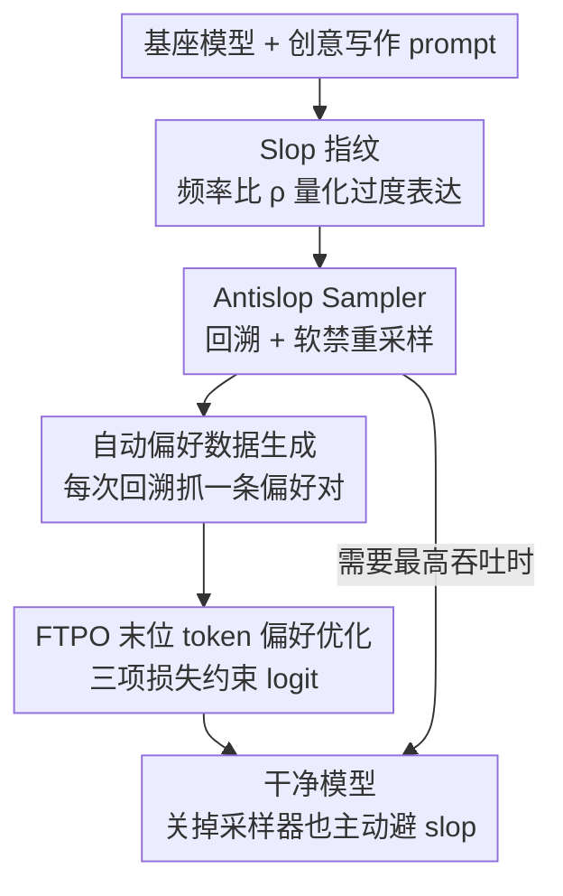

# Antislop: A Comprehensive Framework for Identifying and Eliminating Repetitive Patterns in Language Models

**会议**: ICLR2026  
**OpenReview**: [https://openreview.net/forum?id=gLcyM1khyp](https://openreview.net/forum?id=gLcyM1khyp)  
**代码**: https://github.com/sam-paech/auto-antislop （MIT）  
**领域**: 文本生成 / 偏好优化  
**关键词**: slop 抑制, 回溯采样, 偏好优化, 创意写作, 词汇多样性

## 一句话总结
Antislop 把"LLM 生成里那些一眼能认出是 AI 的重复套话（slop）"当成可量化、可定位、可消除的对象：先用频率比统计画出模型专属的"slop 指纹"，再用一个推理期的回溯采样器精准压制这些模式，最后把采样器的拦截记录自动转成偏好数据，用新提出的 FTPO 微调把抑制能力永久焊进权重——在 GSM8K/MMLU/创意写作上几乎不掉点的前提下做到 90% 的 slop 削减。

## 研究背景与动机
**领域现状**：现在的 LLM，尤其在创意写作场景，会高频复用一小撮词和短语——女主角永远叫 "Elara"、说话总是 "voice barely above a whisper"、功能性写作里到处是 "it's not just X, it's Y"。作者称这类过度复用的模式为 **slop**。为了对抗生成退化（degeneration），社区已有 top-k、top-p（nucleus）、min-p 等随机解码策略，以及 XTC、DRY 这类反重复采样器。

**现有痛点**：这些方法治标不治本。top-k/top-p/min-p 只改候选集的熵或大小，不动真正触发套话的那几个 token 的相对排序，所以全局的词/trigram 过度表达分布基本没变；DRY 只能挡住"逐字重复"的局部循环。更直接的"token 封禁"则有严重附带损伤——想封 "catatonic"，它被分词成 ["cat", "atonic"]，结果所有以 "cat" 开头的词全被误伤。让模型在 prompt 里"别用这些词"则效果有限，还会因为"粉色大象问题"（你越说别想大象越想）适得其反。

**核心矛盾**：要消除一个模型最偏好的高频套路，本质上需要对它"最想输出的 token"做很大的概率调整；但这种大幅 logit 移动极易破坏模型，导致整体退化甚至崩溃。于是出现一个张力：**抑制强度越大、附带损伤越大**。DPO 这类偏好优化能在末位 token 对上训练抑制，但它已知会降低被选回答的似然、诱发多样性坍缩、削减句法和 n-gram 变化；它唯一的约束旋钮 $\beta$ 又太粗——调大伤学习、调小伤模型。

**本文目标**：(1) 把 slop 量化、定位出来；(2) 在推理期无损地压制任意词/短语/正则模式；(3) 把这种抑制以最小附带损伤的方式永久训进权重。

**切入角度**：与其在候选集层面"撒胡椒面"，不如**序列感知**——等整个被禁模式真的出现在推理轨迹里再触发，回溯到它的第一个 token、压低概率、重采样。这样既避免 token 封禁的误伤，又能精确干预到"套话正要冒头"的那一刻。

**核心 idea**：用"统计取证（slop 指纹）→ 回溯采样器（推理期硬/软禁）→ 自动偏好数据 → FTPO（末位 token 偏好优化）"这条端到端管线，把"识别—压制—固化"三步打通，让模型即使关掉采样器也主动偏好替代词。

## 方法详解

### 整体框架
Antislop 是一条闭环管线，输入是一个会冒 slop 的基座模型，输出是一个"嘴巴干净了、能力没掉"的微调模型，外加一个可即插即用的推理期采样器。整条管线分四步串起来：**① 取证**——对模型生成的 2,000 条创意写作样本统计词/bigram/trigram 相对人类语料的过度表达比，把比值最高的那批模式收进 banlist，形成模型专属"slop 指纹"；**② 采样器压制**——推理时维护一份 token + logit 轨迹，扫到 banlist 里的模式就回溯到其首 token、按可调强度压低概率、再用 min-p 重采样；**③ 自动造数据**——采样器每发生一次回溯，就在那个位置抓一条偏好对（被拒的首 token vs 一组连贯替代 token），无需人工；**④ FTPO 训练**——用这些末位 token 偏好对微调模型，三项损失协同把抑制焊死，同时把非目标词汇牢牢拴在参考 logit 上防漂移。采样器保证"推理时一定挡住"，FTPO 让模型"即使没采样器也想用替代词"，两者分工互补。

### 关键设计

**1. Slop 指纹：用频率比把"套话"变成可量化、可定位的对象**

要消除 slop，先得说清楚"哪些才算 slop"。作者对每个模型生成 2,000 条创意写作输出，统计词、bigram、trigram 相对人类基线的频率比 $\rho(p)=\dfrac{f_{\text{LLM}}(p)}{f_{\text{human}}(p)}$，其中人类基线对单词用 wordfreq、对 n-gram 用 Reddit 创意写作 + Project Gutenberg 语料（n-gram 处理前去停用词），并因为 $n\geq4$ 的模式在 2,000 样本里通常出现不到 5 次而把分析限制在 $n\leq3$。$\rho>1$ 即视为过度表达，取过度表达最严重的子集加入 banlist。这一步揭示的数字非常夸张：gemma-3-12b 里 "elara" 的 $\rho$ 高达 **85,513×**，trigram "heart hammered ribs" 是 1,192×，"It's not X, it's Y" 这类句式比人类高 6.3×。更重要的发现是 slop 指纹在同一模型家族内高度聚集、不同家族之间差异很大——这就**论证了 slop 必须按模型定制**，而不是一份通用黑名单走天下。

**2. Antislop Sampler：序列感知的回溯软禁，绕开 token 封禁的误伤**

token 封禁在被禁序列的**第一个 token**就触发，极易误伤同前缀的无辜词；Antislop 反过来——**等整个序列真的出现在轨迹里才触发**。生成时维护所有 token 及其 logit 分布，每出一个 token（或一段 chunk）就扫一遍 banlist，命中就回溯到模式起始位置，把那个起始 token 的概率按 $p_{\text{new}}=p_{\text{old}}\cdot 10^{-10s}$ 压低（$0\leq s\leq 1$ 是可调禁强），重归一化 $p'_i=p_i/\sum_j p_j$ 后用固定阈值 0.1 的 min-p 过滤重采样。关键的**软禁（soft-banning）**思想是：$s=0$ 完全放行、$s=1$ 完全封死，中间值给渐进抑制；而且如果压低后那个 token 仍被采到（说明它概率确实高、缺乏好替代），采样器就放它过去并在后续检查里忽略它，避免死循环。这样既能在 "Write an essay about tapestries" 这种 prompt 里允许 "tapestry"、又能在别处压制它。代价是吞吐：每次回溯都要从更早位置重启推理，大 banlist 下 vLLM 吞吐下降 69%–96%——这正是要补一个训练侧方案 FTPO 的动机。

**3. 自动化偏好数据生成：把采样器的每次拦截直接变成一条训练样本**

FTPO 需要偏好数据，而采样器恰好天然在制造这种数据。每发生一次回溯事件，就在"被禁序列本会开始"的精确位置抓一条 **末位 token 偏好对**：缓存该位置 top-$k$（$k=20$）logit，从候选集里剔掉被拒 token、对剩余重归一化，再采 4–8 个高概率、互不相同的替代词组成 chosen 集合 $C$。一条偏好对包含三部分——prompt（含 chat 模板 + 到套话冒头前的已生成文本）、单个被拒续写 token（如 "Elara" / "tapestry"）、一组连贯替代 token（如 ["Madelyne","Nadia","Freya"] / ["cascade","brilliant","crimson"]）。整条"识别过度模式 → 采样器造偏好集 → FTPO 训练"全自动、开源，无需人工标注。

**4. FTPO：末位 token 偏好优化，用三项损失做"软触碰"式精准抑制**

DPO 也能在末位 token 对上训练，但它一次只更新一个 chosen token，且靠 $\beta$ 这一粗旋钮约束。FTPO 在轨迹最后一个位置定义被拒 token $r$ 和 chosen 集合 $C$，同时优化三项损失。**带 margin 的偏好损失**要求 chosen 的 logit 超过 $r$ 至少 $m$：
$$L_{\text{pref}}=\frac{\sum_{c\in C} w_c\cdot \text{softplus}((m-\Delta_c)/\tau)}{\sum_{c\in C} w_c}$$
其中 $\Delta_c=y[c]-y[r]$ 是 chosen 与 rejected 的 logit 差，权重 $w_c=\text{clamp}((m-\Delta_c)/m,0,1)$ 在达标后自动归零——这就是 **margin 自停**，赢够 $m$ 就关掉训练信号，防过训。**目标正则**把 chosen+rejected 这组"目标 logit" $T=C\cup\{r\}$ 用 MSE（直接在 logit delta 上、不是 logprob）拴回冻结基座的参考值 $y_{\text{ref}}$，并留一个零惩罚窗口 $\tau_{\text{target}}$：
$$L_{\text{target}}=\frac{1}{|T|}\sum_{j\in T}\max(|y[j]-y_{\text{ref}}[j]|-\tau_{\text{target}},0)^2$$
**非目标正则**则把其余全部词汇 $N$ 强力锚定，防分布漂移：$L_{\text{nontarget}}=\frac{1}{|N|}\sum_{j\in N}(y[j]-y_{\text{ref}}[j])^2$。总损失 $L_{\text{FTPO}}=L_{\text{pref}}+\lambda_{\text{target}}L_{\text{target}}+\lambda_{\text{nontarget}}L_{\text{nontarget}}$。

三条设计原则解释了它为什么比 DPO 稳：**① logit 空间操作**——大幅更新后若用 KL 正则会对无关 logit 施加补偿压力，改用 logit 上的 MSE 就把更新局部化到只关心的 chosen/rejected；**② margin 自停**——赢够就停，训到高偏好准确率也不崩；**③ 两段式正则**——目标 logit 可相对自由移动、其余词汇紧拴参考，从而能训到高偏好准确率又不发生破坏性发散。参考 logit $y_{\text{ref}}$ 在造数据时就缓存好、训练时复用，省掉重复前向。

### 一个完整示例
拿创意写作里的句子 "The sky was a ↓tapestry of color" 走一遍：① 取证阶段发现 "tapestry" 在该模型里相对人类语料过度表达，进入 banlist；② 生成到 "The sky was a" 后模型最想接 "tapestry"，采样器扫到命中、回溯到这个位置，缓存 top-20 logit；③ 剔掉 "tapestry"、重归一化后采出 chosen = ["cascade","brilliant","crimson"]，连同被拒 "tapestry" 打包成一条偏好对（"purple"、"bagel" 这种既非套话也非首选的词保持中性）；④ FTPO 用这条对训练，把 cascade/brilliant/crimson 的 logit 抬到比 tapestry 高出 margin $m=2.0$ 就停手，同时把全词表其余 token 拴回参考。训练后即便关掉采样器，模型在 "The sky was a" 之后也更愿意写 cascade 而不是 tapestry——抑制从"推理时挡"变成了"模型自己不想说"。

### 损失函数 / 训练策略
本文所有 FTPO 结果用同一套默认配置：偏好项 margin $m=2.0$、目标拴系 $\lambda_{\text{target}}=0.05$ 配零惩罚窗 $\tau_{\text{target}}=0.5$、非目标拴系 $\lambda_{\text{nontarget}}=0.4$。为最小化对原权重的扰动，冻结除最后 5 层和 lm head 外的所有层，训一个高秩 LoRA（$r\in[128,512]$，高秩能在更低退化下达到更高偏好准确率目标），训 1 个 epoch 并在达到目标抑制率时早停。DPO 对照用 $\beta=0.1$；偏好准确率消融里两者学习率经过缩放，使其在大致相同的训练样本量上达到早停目标。对 Llama-3.3-70B 这类对偏好训练更敏感、易重复的模型，把 LoRA 更新限制在 lm head 以避免重复，代价是抑制率降到 66%。

## 实验关键数据

### 主实验
评测三个模型家族（gemma-3-12b、Mistral-Small-3.2、Llama-3.3-70B），训练用 Reddit Writing Prompts 2,000 条造 slop 指纹与 FTPO 数据，评测用留出集 + 跨分布的 EQ-Bench 创意写作集；指标含 banlist 抑制率、GPT-5-as-Judge 写作质量（0–100）、长度受控的词汇多样性（归一化到基线 100）、MMLU（5-shot）、GSM8K（8-shot）、30k-token 长文写作。对比四种方法：token 封禁（logit bias −100）、Antislop 采样器、FTPO、DPO，banlist 规模 2k/4k/8k。

| 方法（gemma-3-12b） | banlist 抑制 | 写作质量(0-100) | 备注 |
|--------|------|------|------|
| 基线 | 0% | 67.8 | — |
| Antislop 采样器 | **100%** | 高于基线 | 推理期、无质量损失 |
| FTPO | 83–92% | 基线 ±1% | 永久训进权重 |
| DPO | 80–82% | 掉 6–15 分 | 抑制更弱、质量更差 |
| token 封禁 | — | 8k 时崩到 28 | 严重重复/拼写/语法损坏 |

FTPO vs DPO 详细对比（节选 Table 2）：

| 配置 | MMLU | GSM8K | 长文 | 写作质量 | 多样性 | 抑制% |
|------|------|-------|------|---------|--------|-------|
| gemma-3-12b 基线 | 0.590 | 0.888 | 51.3 | 67.80 | 100.0 | 0 |
| FTPO 2k | 0.559 | 0.876 | 47.5 | 68.93 | 101.1 | 92.4 |
| FTPO 4k | 0.565 | 0.880 | 49.4 | 67.31 | 97.7 | 90.2 |
| FTPO 8k | 0.592 | 0.889 | 52.3 | 67.49 | 95.1 | 83.4 |
| DPO 2k | 0.541 | 0.847 | 36.6 | 62.98 | 91.0 | 82.0 |
| DPO 8k | 0.571 | 0.864 | 26.9 | 54.61 | 73.9 | 81.4 |

FTPO 在等价训练设置下比 DPO 抑制强 8.5%；MMLU/GSM8K 保持在基线 1–3% 内（DPO 掉 2–5%）；词汇多样性 95–102%（DPO 渐进坍缩到 74–92%）；长文写作 FTPO 各 banlist 规模都贴着基线、DPO 大幅退化。这一模式从 12B 一直成立到 70B。

### 消融实验

| 配置 | 关键现象 | 说明 |
|------|---------|------|
| 训到高偏好准确率 | FTPO 近 100% 仍几乎不退化；DPO 过 40% 后急剧崩 | margin 自停 + MSE 拴系是主因（Fig.4） |
| DPO $\beta$ 1.0 | 退化缓解但抑制率降 15.9% | 印证 $\beta$ 是粗旋钮 |
| 正则 logit 发散 | FTPO logit 贴参考；DPO 无约束发散 | "软触碰"机制定位为 FTPO 优于 DPO 的根因 |
| 正则 ban（qwen3-4b） | "It's not X, it's Y" 从 1.10/千字符 降到 **精确为 0** | 采样器能压结构性模板，不止逐字模式 |
| FTPO 超参偏离默认 | 偏好准确率差、退化 | 验证 margin/拴系安全阀有效 |

### 关键发现
- 同样在末位 token 偏好对上训练，FTPO 的优势几乎全部来自"约束 logit 贴参考、同时让目标 logit 自由移动"这套机制——这是它能训到接近 100% 偏好准确率而不崩的根因。
- 重新画 slop 指纹 + cosine 嵌入分析显示：FTPO 后过度表达模式是**真的下降**，而不是被另一批同样极端的新套话替换，语义漂移也远小于一次简单 style-prompt 切换——抑制是"消除"而非"换皮"。
- 采样器抑制完美但吞吐砍 69–96%，FTPO 抑制略弱但零吞吐损失——两者明确互补，性能敏感场景应优先把抑制训进权重。

## 亮点与洞察
- **把"AI 味"做成可量化的工程问题**：用一个 $\rho$ 频率比就把模糊的"slop 感"变成模型专属、可定位、可消除的清单，并实证 slop 指纹按家族聚集，论证了"按模型定制"的必要——这个量化框架本身就可迁移到毒性、风格漂移等其他"过度表达"问题。
- **回溯软禁的"序列感知"很巧**：等整个模式出现再回溯首 token，既绕开 token 封禁的同前缀误伤，又用 $10^{-10s}$ 的连续禁强 + "压不下去就放行"避免硬禁破坏连贯性——比在候选集层面调熵精准得多。
- **FTPO 的"软触碰"三件套可复用**：logit 空间 MSE（而非 KL）做局部化、margin 自停防过训、两段式正则放目标收其余——这套"既要大改目标 token、又要锁住其余分布"的思路，可直接迁到任何"需要外科手术式改写偏好但怕伤模型"的对齐任务。
- 最 "啊哈" 的是采样器与训练的分工：**采样器负责造数据 + 推理兜底，FTPO 负责把意图固化**——拦截事件天然就是最优质的偏好样本来源，一鱼两吃。

## 局限与展望
- 作者承认只能做**机械式的词法/n-gram 检测**：隐喻滥用、叙事套路这类高层语义重复，嵌入聚类/句法解析虽能识别但太贵、塞不进训练循环，仍是开放难题。
- 采样器吞吐下降 69–96%，性能敏感部署只能退而求其次用 FTPO（抑制略弱）。
- 写作质量主要靠 GPT-5/Claude 当裁判，缺人类评测复核；评测集中在创意写作单一域。
- $n\leq3$ 的限制让更长的固定套句（≥4-gram）逃出统计网；Llama-70B 为防重复只更新 lm head，抑制掉到 66%，说明方法对大模型/敏感模型的稳健性还需更细的层级控制。
- 展望：作者点名希望把 Antislop 推广到创意写作以外的域、AI 文本检测、毒性文本抑制，以及用人类评测复现质量指标。

## 相关工作与启发
- **vs top-k/top-p/min-p/XTC/DRY**：这些解码期方法只改候选集大小或熵、不动真正触发套话那几个 token 的局部排序，所以全局过度表达分布基本没变（DRY 只挡逐字循环）；Antislop 是序列感知、在套话冒头那一刻精确干预，因此能真正改变全局指纹。
- **vs token 封禁**：封禁在被禁序列首 token 触发、误伤同前缀词且 8k 规模就崩到质量 28；Antislop 等整序列出现再回溯，可压 8,000+ 模式仍保质量。
- **vs DPO**：DPO 一次只更一个 chosen token、靠粗旋钮 $\beta$ 约束，已知诱发似然下降与多样性坍缩；FTPO 一步更新整组 chosen、用三项损失把 logit 贴参考，抑制强 8.5% 且多样性/能力几乎不掉。
- **vs unlikelihood 训练（Welleck 2020）**：unlikelihood 给负例加负对数概率项，但留了两个空白——怎么构造负例数据集、配什么正例目标；本文用"采样器自动造偏好对 + 三项正则"对这两点给了具体答案。
- **vs 带 [RESET] token 的回溯（Zhang 2025）**：思路相近（检测到不良内容就回溯重试句子），但本文聚焦风格性过度表达且把拦截转成可训练偏好数据。

## 评分
- 新颖性: ⭐⭐⭐⭐⭐ 把"AI 味"量化为 slop 指纹，并用回溯软禁 + FTPO 三项损失给出完整识别—压制—固化闭环，FTPO 的 logit-MSE/margin 自停组合是真新东西。
- 实验充分度: ⭐⭐⭐⭐⭐ 三个模型家族 ×3 banlist 规模，覆盖抑制率/质量/多样性/MMLU/GSM8K/长文，含过训稳健性、正则 ban、超参消融与"换皮检验"。
- 写作质量: ⭐⭐⭐⭐ 动机生动、公式清晰、图表到位；个别指标分散在附录、长文裁判换模型略影响可比性。
- 价值: ⭐⭐⭐⭐⭐ 全部代码与数据 MIT 开源，端到端自动化、即插即用，对创意写作与 AI 文本去味是直接可用的工程方案。

<!-- RELATED:START -->

## 相关论文

- [\[ACL 2025\] PerSphere: A Comprehensive Framework for Multi-Faceted Perspective Retrieval and Summarization](../../ACL2025/nlp_generation/persphere_a_comprehensive_framework_for_multi-faceted_perspective_retrieval_and_.md)
- [\[ACL 2026\] Investigating the Representation of Backchannels and Fillers in Fine-tuned Language Models](../../ACL2026/nlp_generation/investigating_the_representation_of_backchannels_and_fillers_in_fine-tuned_langu.md)
- [\[ACL 2025\] An Empirical Study of Many-to-Many Summarization with Large Language Models](../../ACL2025/nlp_generation/an_empirical_study_of_manytomany_summarization.md)
- [\[ACL 2025\] Theme-Explanation Structure for Table Summarization Using Large Language Models](../../ACL2025/nlp_generation/theme-explanation_structure_for_table_summarization_using_large_language_models_.md)
- [\[ICLR 2026\] Unveiling the Potential of Diffusion Large Language Model in Controllable Generation](unveiling_the_potential_of_diffusion_large_language_model_in_controllable_genera.md)

<!-- RELATED:END -->
