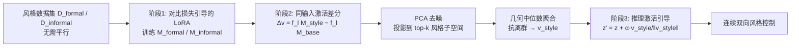

# Causal-Steer: Disentangled Continuous Style Control without Parallel Corpora

**会议**: ICLR 2026  
**OpenReview**: [https://openreview.net/forum?id=yfiOYXvsX5](https://openreview.net/forum?id=yfiOYXvsX5)  
**代码**: [https://github.com/APTX574/Causal-Steer](https://github.com/APTX574/Causal-Steer)  
**领域**: 可控文本生成 / 激活引导（Activation Steering）  
**关键词**: activation steering, style control, LoRA, causal intervention, contrastive learning, PCA denoising  

## 一句话总结
本文提出 Causal-Steer：把 LoRA 当成一次"因果干预"，在**同一条输入**上对比加/不加 LoRA 扰动的激活差，从而摆脱平行语料、抽出一条干净的风格向量，再经 PCA 去噪 + 几何中位数鲁棒聚合，最终在推理时用一个标量 $\alpha$ 实现连续、双向、可线性插值的 LLM 风格控制。

## 研究背景与动机
**领域现状**：让 LLM 在保持内容不变的前提下调节"风格维度"（正式度、概念复杂度、毒性等）是人机交互的刚需。主流做法有三类——提示工程 / 指令微调（离散控制空间，只能在"小白 vs 专家"这种粗粒度档位间跳变）、LoRA 参数插值（task arithmetic，能形成连续空间但易吸收语料伪特征）、以及近年兴起的激活引导（直接在隐空间操纵表示，原理上最适合连续细粒度控制）。

**现有痛点**：激活引导的效果完全取决于能否拿到高质量的"引导方向"，而现有方法（CAA、RepE 等）几乎都依赖**平行语料**——内容对齐、仅风格不同的文本对，对概念复杂度这类维度几乎无法构造。由此带来两个致命问题：①**内容污染**——内容对齐不完美时，作差得到的方向同时编码了风格和语义差异，泛化性差；②**鲁棒性差**——即便分离出风格信号，引导方向也容易被噪声和离群样本带偏，跨主题不稳定。

**核心矛盾**：风格控制本质是"连续光谱"，但现有方法要么离散跳变，要么为了连续而依赖昂贵且常常不存在的平行语料，且抽出的方向纠缠了内容、不鲁棒。

**本文目标**：在**不需要任何平行语料**（甚至单一风格数据集即可）的前提下，抽出一条与内容解耦、抗离群的风格向量，实现连续、细粒度、可双向线性插值的风格控制，且推理几乎零额外开销。

**核心 idea**：**[把 LoRA 重新诠释为因果干预工具]** —— 不再去比较"两批不同文本"的激活差（那需要内容对齐），而是固定同一条输入 $d_i$，比较"基座模型"与"加了风格 LoRA 的模型"在这条输入上的激活差，从而把语义变量天然控制住，干净地分离出 LoRA 注入的那一份纯风格扰动。

## 方法详解

### 整体框架
Causal-Steer 分三个阶段串成一条流水线：①用**对比损失引导的 LoRA** 对基座模型注入一个低秩风格扰动；②在每条样本上做"加扰动 vs 不加扰动"的激活差分，再用 **PCA 去噪 + 几何中位数** 把成千上万条差分向量鲁棒地聚合成单条风格向量 $v_{\text{style}}$；③推理时把归一化后的 $v_{\text{style}}$ 按强度 $\alpha$ 加进若干层 MLP 输出，实现连续双向控制。

### 关键设计

**1. 对比损失引导的 LoRA：让低秩扰动只装风格、不装内容**。普通 LoRA 微调会把语料里的内容偏好一并学进 $\Delta W$，作差时这些内容痕迹会泄漏到风格向量里。本文在训练风格 LoRA 时加一个 InfoNCE 式对比损失：以 $D_{\text{formal}}$ 内部样本互为 anchor/positive、以 $D_{\text{informal}}$ 样本作 negative，$L_{\text{contrastive}} = -\mathbb{E}\left[\log \frac{\exp(\text{sim}(h_{d_a}, h_{d_p})/\tau)}{\exp(\text{sim}(h_{d_a}, h_{d_p})/\tau) + \sum_{d_n}\exp(\text{sim}(h_{d_a}, h_{d_n})/\tau)}\right]$。这个判别式目标迫使 $\Delta W$ 去寻找"能跨内容区分两种风格"的可泛化特征，从而主动压制内容相关的激活，学到的是纯风格表示而非语料伪特征——这正是它能甩开平行语料的关键。

**2. 同输入因果差分：用一阶 Taylor 展开为"激活差≈纯风格扰动"背书**。对每条形式化样本 $d_i$、每层 $l$，风格扰动向量定义为 $\Delta v^{(l)}_{\text{formal},i} = f_l(M_{\text{formal}}, d_i) - f_l(M_{\text{base}}, d_i)$，其中 $f_l(M,d)$ 取该层 MLP 输出在所有**生成 token**（不含 prompt）上的均值，保证捕捉的是整体风格而非 prompt 结构或个别 token 的语义偏置。与"在基座模型上直接对 $D_{\text{formal}}$、$D_{\text{informal}}$ 两批文本作差"的朴素观测法不同——后者要假设内容能被向量相减抵消、因此必须依赖精心构造的平行语料；而本文固定同一条输入 $d_i$，差的两项内容完全相同，语义被天然抵消。理论上，把激活看成权重与数据的函数 $h^{(l)}(W,d)$，在 $W_0$ 处一阶展开得 $\Delta h^{(l)}(d) \approx J_{h,W}(W_0,d)\cdot \Delta W$，说明抽出的激活差就是权重空间风格扰动 $\Delta W$ 经 Jacobian 映射到隐空间的像，提供了一个直接、解耦的风格控制把手。

**3. PCA 去噪 + 几何中位数：把上万条带噪差分压成一条鲁棒方向**。先把两个风格的差分对齐方向，构造统一集合 $X^{(l)} = \{\Delta v^{(l)}_{\text{formal}}\} \cup \{-\Delta v^{(l)}_{\text{informal}}\}$，并建模为"共享低维风格信号 + 样本特有内容噪声"：$x_i = v^{(l)}_{\text{style}} + \epsilon_{\text{content},i}$。作者假设风格信号是方差最大的主成分、内容噪声散落在低方差成分上，于是用 PCA 把每条向量投影到 top-$k$ 主子空间 $\tilde{x}_i = (P^{(l)}_k)^\top x_i$（实验发现 $k=8$ 就足够，印证"风格是低维属性"）。PCA 滤掉结构性噪声后，子空间里仍可能残留离群样本，故再用**几何中位数** $\tilde{m}^{(l)}_* = \arg\min_{\tilde m}\sum_i \|\tilde{x}_i - \tilde m\|_2$ 做中心估计——相比算术均值，它对极端值不敏感。最后投回原激活空间得到定版风格向量 $v^{(l)}_{\text{style}} = P^{(l)}_k \tilde{m}^{(l)}_*$。两步去噪+鲁棒聚合是这套方法能跨主题/跨语言稳定的工程核心。

**4. 单向量双向推理引导：一个标量 $\alpha$ 控连续光谱**。推理时在选定层集合 $L_{\text{steer}}$ 的 MLP 输出上注入归一化风格向量：$z'^{(l)}_t = z^{(l)}_t + \alpha \cdot \frac{v^{(l)}_{\text{style}}}{\|v^{(l)}_{\text{style}}\|_2}$。归一化保证干预强度只由可调标量 $\alpha$ 决定：$\alpha > 0$ 推向目标风格（如复杂/正式），$\alpha < 0$ 推向反方向（如简单/口语），$\alpha = 0$ 恢复原模型。最妙的是**单边数据也能双向控制**——只用"复杂概念"这一侧语料抽出的向量，靠 $\alpha$ 反号就能让输出变简单。由于向量预先算好，推理只是一次向量加法，开销可忽略，还支持多属性同时叠加。

## 实验关键数据

### 主实验（概念复杂度控制，节选 Qwen2.5-7B-Instruct）
Diff. 表示风格分化幅度（Complex 越高越好、Simple 越低越好），F-G./SMOG/C-L 为可读性指标。

| Method | Complex Acc.↑ | Complex Diff.↑ | Complex C-L.↑ | Simple Acc.↑ | Simple Diff.↓ | Simple C-L.↓ |
|---|---|---|---|---|---|---|
| CAA | 8.19 | 5.37 | 15.64 | 7.58 | 4.18 | 15.71 |
| ITI | 8.48 | 5.16 | 15.45 | 7.83 | 4.17 | 17.14 |
| RepE | 8.24 | 5.35 | 14.84 | 8.17 | 4.37 | 17.93 |
| CLMI | 7.60 | 8.36 | 26.91 | 7.64 | 3.47 | 10.02 |
| **CS (本文)** | **8.59** | **8.42** | **31.55** | 6.85 | **2.77** | **7.46** |
| CS_single | 8.56 | 8.40 | 27.28 | 6.76 | 2.80 | 9.74 |

Causal-Steer 在风格分化幅度（Diff./C-L）上大幅领先，且 Complex/Simple 两端拉得最开；仅用单边数据的 $\text{CS}_{\text{single}}$ 仍接近全量版本，验证了"单数据集即可双向控制"。

### 消融实验（Qwen2.5-7B-Instruct）

| 变体 | Complex Acc. | Complex Diff. | Simple Acc. | Simple Diff. |
|---|---|---|---|---|
| **Causal-Steer (完整)** | **8.59** | **8.42** | 6.85 | 2.77 |
| − w/o Contrast（去对比损失） | 8.50 | 8.24 | 6.87 | 3.01 |
| − w/o Difference（去同输入差分） | 7.95 | 7.90 | 6.67 | 2.85 |
| − w/o Mean Token（不按生成token均值） | 7.28 | 4.26 | 8.24 | 4.73 |
| − w/o PCA（去PCA去噪） | 8.27 | 8.18 | 5.20 | 2.81 |
| − w/o Mean（用均值替代几何中位数） | 8.48 | 8.24 | 6.61 | 2.82 |

### 关键发现
- **Mean Token 提取最关键**：去掉后 Diff. 从 8.42 暴跌到 4.26，说明在生成 token 上取均值（而非 prompt 或单 token）是抽出整体风格的命门。
- **同输入差分 + 对比损失共同保证解耦**：两者去掉后准确度均下滑，印证"因果差分"与"对比引导"协同压制内容污染。
- **PCA 去噪主要稳住 Simple 端**：去 PCA 后 Simple Acc. 从 6.85 降到 5.20，去噪对鲁棒性贡献明显。
- **跨模型/任务/语言泛化**：在 LLaMa-3.1-8B、文本去毒（APPDIA→RealToxicityPrompts）、正式度控制（→ELI5）上均拿到 SOTA 或次优，且支持多属性同时控制。

## 亮点与洞察
- **"LoRA = 因果干预"的视角转换很优雅**：把"两批文本作差"这一需要平行语料的范式，换成"同一输入加/不加扰动作差"，用控制变量法的思想一举绕开平行语料这个长期瓶颈，并有一阶 Taylor 展开做理论支撑。
- **风格是低维属性的实证**：$k=8$ 主成分就能装下核心风格方差，给"风格 vs 内容"在表示空间的可分性提供了干净证据。
- **几何中位数这种鲁棒统计在 steering 里被用对了地方**：激活差分天然带离群样本，用对极值不敏感的中心估计比算术均值更合身。
- **单边语料即可双向控制 + 推理零开销**，工程落地性强，单标量 $\alpha$ 的连续可解释接口非常适合产品化。

## 局限与展望
- **依赖一阶线性近似**：方法核心建立在"权重扰动→激活变化近似线性"上，对更大的 LoRA 扰动或强非线性风格维度，近似可能失效，论文未深入刻画其适用边界。
- **需要先训风格 LoRA**：相比纯无训练的 ActAdd/CAA，本文多了一步对比 LoRA 训练，虽一次性但仍有成本；对极稀缺风格数据是否够用待考。
- **层选择与 $\alpha$ 调参**：$L_{\text{steer}}$ 和强度系数需要按任务调，论文给了选层依据但缺乏自动化方案；过大的 $\alpha$ 可能损害流畅度（图3显示在合理区间内才两全）。
- **评测重度依赖 GPT-4.1 打分**：复杂度/正式度等主观指标用 LLM 评判，虽有自动可读性指标和人评补充，但仍可能有评测偏差。
- **多属性同时控制的干涉**：声称支持多属性叠加，但不同风格向量之间是否正交、叠加时是否相互干扰，缺少系统分析。

## 相关工作与启发
- **参数空间路线**：Task Arithmetic（Ilharco 2022）、多 LoRA 插值（Dekoninck 2023）、CLMI（连续语言模型插值）——能形成连续空间但易吸收语料伪特征，本文正是针对这点改进。
- **激活工程路线**：ActAdd（单对提示作差）、CAA（大规模配对均值）、GCAV（训线性分类器取方向）、ITI（在特定注意力头干预）、RepE（统一表示工程框架）——本文与它们同属 steering，但用因果差分+鲁棒聚合解决了平行语料依赖和稳定性两大短板。
- **启发**：①"控制变量"思想可迁移到其他表示编辑任务——凡是想抽"某个干预的净效应"，固定输入比配对数据更干净；②鲁棒统计（几何中位数/截尾）值得在更多 activation engineering 工作里成为标配；③"风格低维"假设若成立，未来可探索更紧凑的风格码本或可组合的多属性子空间。

## 评分
- **新颖性**: ⭐⭐⭐⭐ —— "LoRA 作为因果干预 + 同输入差分摆脱平行语料"是一个清晰且有理论支撑的视角转换，在拥挤的 activation steering 赛道里找到了真问题（平行语料依赖）并给出干净解法。
- **实验充分度**: ⭐⭐⭐⭐ —— 覆盖三任务、两模型、跨语言、多属性，消融拆解到每个组件，主实验对比 9 个 baseline；扣分在主观指标重度依赖 GPT 打分、线性近似边界未实测。
- **写作质量**: ⭐⭐⭐⭐ —— 动机层层递进、方法图与公式对应清晰，"内容污染/鲁棒性"两难点提炼到位；个别表格 OCR 排版略乱但不影响理解。
- **价值**: ⭐⭐⭐⭐ —— 摆脱平行语料 + 单标量连续双向控制 + 推理零开销，落地性强，对可控生成与个性化交互有直接实用价值。

<!-- RELATED:START -->

## 相关论文

- [\[ACL 2026\] Can You Make It Sound Like You? Post-Editing LLM-Generated Text for Personal Style](../../ACL2026/nlp_generation/can_you_make_it_sound_like_you_post-editing_llm-generated_text_for_personal_styl.md)
- [\[ICLR 2026\] FS-DFM: Fast and Accurate Long Text Generation with Few-Step Diffusion Language Model](fs-dfm_fast_and_accurate_long_text_generation_with_few-step_diffusion_language_m.md)
- [\[ICLR 2026\] Rethinking Uncertainty Estimation in LLMs: A Principled Single-Sequence Measure](rethinking_uncertainty_estimation_in_llms_a_principled_single-sequence_measure.md)
- [\[ICLR 2026\] Rainbow Padding: Mitigating Early Termination in Instruction-Tuned Diffusion LLMs](rainbow_padding_mitigating_early_termination_in_instruction-tuned_diffusion_llms.md)
- [\[ICLR 2026\] Unveiling the Potential of Diffusion Large Language Model in Controllable Generation](unveiling_the_potential_of_diffusion_large_language_model_in_controllable_genera.md)

<!-- RELATED:END -->
