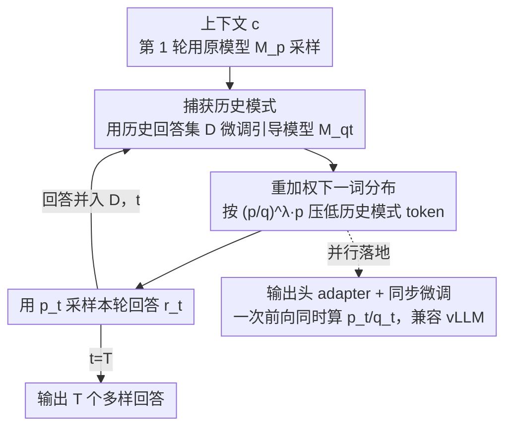

# Diverse Text Decoding via Iterative Reweighting

**会议**: ICLR 2026  
**OpenReview**: [https://openreview.net/forum?id=2Xd5RlypLx](https://openreview.net/forum?id=2Xd5RlypLx)  
**代码**: https://github.com/shi-rq/OverRIDE  
**领域**: 文本生成 / LLM 解码  
**关键词**: 多样性解码, 重加权, 推理时微调, 引导模型, 并行解码

## 一句话总结
本文提出 OverRIDE（Reweighting-based Iterative DEcoding），在多轮采样时用历史生成结果在推理阶段增量微调一个"引导模型"，再用它去压低会导致历史模式重现的 token 概率，从而在几乎不损失质量的前提下显著提升多个回答之间的多样性，并能以 6.4%（72B）的吞吐损失嵌入 vLLM 这类服务系统。

## 研究背景与动机
**领域现状**：要让 LLM 对同一个 prompt 生成多个回答，主流靠采样类技巧——top-k、top-p、温度采样、min-p 等，它们都在 token 级别上对下一个 token 的概率分布做截断或重缩放，引入随机性。

**现有痛点**：即便如此，多次生成出来的回答往往"结构雷同、只在末尾或局部细节上有差异"。在代码生成里，模型可能只换了变量名和格式，底层逻辑完全一样，于是多次生成会犯同一个错；数学题也常常是同一个开头反复出现。

**核心矛盾**：根因在于自回归解码的"路径依赖"——给定相同上下文，模型每一轮都用**同一个**下一词分布，而采样只是独立地在 token 级别扰动这个分布，**完全不会从历史生成的样本中学习**。结果就是反复在高概率区域里"内卷"，既不够多样，还容易退化（重复、低质）。提高温度虽然能拉开差异，但只是把分布拍平，是以牺牲质量为代价的。

**本文目标**：让解码过程能"记住"之前已经生成过什么，并主动避开那些模式，同时把质量损失和效率损失都压到最小。

**切入角度**：作者的关键观察是——历史样本本身不能直接拿来当约束，因为采样是非确定性的、每轮回答都不一样；但如果用历史样本去**微调一个引导模型**，它就能学到并泛化出这些样本里反复出现的"公共语义模式"，从而被用来识别并压制这些模式。

**核心 idea**：在推理时迭代微调一个引导模型 $M_{q_t}$ 来捕获历史回答的共性，再用"原模型概率 / 引导模型概率"的比值去重加权下一词分布，鼓励模型探索"少有人走的路"。

## 方法详解

### 整体框架
给定一个预训练 LLM $M_p$ 和一组上下文 $C=\{c_i\}_{i=1}^N$，目标是为每个上下文生成 $T$ 个彼此多样的回答。OverRIDE 把"生成 $T$ 个回答"组织成 $T$ 轮迭代：第一轮直接用原模型采样，探索它的默认高概率路径；从第二轮起，每一轮都做四件事——① 用当前重加权分布生成新回答；② 把新回答并入历史回答集合 $D$，并据此（增量）微调引导模型 $M_{q_t}$ 去拟合历史模式；③ 用 $M_{q_t}$ 去重加权原模型 $M_p$ 的下一词分布，得到 $p_t$；④ 用 $p_t$ 驱动下一轮生成。核心约束是：重加权后的 $p_t$ 既要足够贴近原模型 $M_p$ 的分布（保住质量），又要避开会复现历史回答的方向（换来多样性）。

为落到 vLLM/SGLang 等服务系统上，作者把这套串行流程改造成并行版本：把引导模型的可训练参数限制在输出头的一个低秩 adapter 上，让 $p_t$ 和 $q_t$ 在一次前向里同时算出来；并把微调动作"同步"到采样之后立刻进行，使其与并行解码复用 KV cache 的机制兼容。

### 关键设计

**1. 引导模型捕获历史模式：把"已经生成过什么"蒸成可泛化的分布**

直接拿历史样本当硬约束行不通——采样非确定，每轮回答都不同，逐字匹配既脆弱又学不到共性。OverRIDE 的做法是从原模型 $M_p$ 出发，用历史回答集 $D=\{(c_i,r_i)\}$ 微调一个引导模型 $M_{q_t}$，目标就是最大化历史回答的似然：

$$\mathcal{L}_{q_t} = -\frac{1}{|D|}\sum_{(c,r)\in D}\log q_t(r\mid c).$$

这一步的意义在于"泛化"：$M_{q_t}$ 学到的不是某一条具体回答，而是多条历史样本里反复出现的**公共语义模式**（相似的开头、相似的推理骨架等）。于是后续轮次就有了一个可微、可查询的"历史模式探测器"，能告诉我们"哪些 token 会把生成重新拽回老路上"。

**2. 比值重加权下一词分布：用引导模型当"排斥项"压制旧模式**

有了 $M_{q_t}$，就在每一轮用它去改写原模型的下一词分布。重加权后的分布为：

$$p_t(x_i\mid x_{<i}) = \frac{1}{Z}\left(\frac{p(x_i\mid x_{<i})}{q_t(x_i\mid x_{<i})}\right)^{\lambda} p(x_i\mid x_{<i}),$$

其中 $p$ 是原模型分布、$q_t$ 是引导模型分布、$Z$ 是归一化项、$\lambda$ 控制重加权强度。直觉很清晰：如果某个 token 被引导模型赋予高概率（说明它通向历史模式），比值 $p/q_t$ 就变小，这个 token 在新一轮被选中的概率被压低；反之那些历史里少被选中的 token 获得相对更高的概率，从而被推去探索替代路径。$\lambda$ 正是多样性—质量这对 trade-off 的旋钮——它的妙处在于，重加权是相对原模型分布做"定向排斥"，而不是像温度那样无差别拍平整个分布，所以能在保质量的同时定向制造差异。

**3. 输出头 adapter + 同步微调：把推理时训练塞进并行服务系统**

串行版要求"收齐一轮所有回答 → 再微调 → 再进下一轮"，这与 vLLM/SGLang 复用 KV cache 的并行解码不兼容。作者两手解决。其一，把可训练参数全部限制在**输出头**上，为每一轮配一个类 LoRA 的低秩 adapter，于是 $p_t$ 和 $q_t$ 可在一次前向里同时算出：

$$\text{logit}_p = Wh,\qquad \text{logit}_{q_t} = Wh + W_B^t W_A^t h.$$

adapter 只需捕获"原分布"与"实际采样 token 分布"之间的细小漂移，参数量极小；而且模型越大、adapter 占比越小，效率损失反而越低。其二，把微调改成**同步**进行——在第 $t$ 轮用 head $t$ 算出 $p_t$ 并采样后，立刻用该 token 的交叉熵（式 (1) 的 token 级版本）更新 head $t{+}1$ 的 adapter，使其马上能用于第 $t{+}1$ 轮。配合"把同一上下文复制成 $T$ 个请求、按轮次顺序排队处理"的技巧，既复用了 KV cache，又让 head 的更新与解码顺序天然对齐。

## 实验关键数据

### 主实验
评测覆盖代码生成（HumanEval）、数学推理（MATH500 / GSM8K）和故事生成（CCNews），基座为 Qwen-2.5-7B-Instruct 与 Mistral-7B-Instruct-v0.3，并叠加 Greedy / Top-p / Top-k / Min-p 等多种采样。指标包括 PASS@k（质量兼多样性）、CodeBLEU↓、成对余弦相似度↓、MAUVE↑。下表为 Qwen-2.5-7B 上"基线 / +OverRIDE"配对结果节选：

| 任务 | 采样方法 | PASS@5 | PASS@10 | 相似度↓ / CodeBLEU↓ |
|------|---------|--------|---------|------|
| HumanEval | Greedy | 64.9 → 81.2 | 64.9 → 86.0 | 1.000 → 0.626 (CodeBLEU) |
| HumanEval | Top-p τ=1.0 | 82.1 → 83.6 | 85.5 → 88.5 | 0.666 → 0.578 (CodeBLEU) |
| MATH500 | Greedy | 72.5 → 84.3 | 72.5 → 87.0 | 1.000 → 0.938 (相似度) |
| MATH500 | Top-p τ=0.6 | 84.1 → 84.8 | 86.8 → 87.3 | 0.950 → 0.936 (相似度) |

OverRIDE 在几乎所有采样方法与温度设置下，都能**同时**抬高 PASS@5 / PASS@10 并降低回答间相似度，叠在贪心解码上的增益尤其夸张（HumanEval PASS@10 从 64.9 升到 86.0）。这印证了它"既探索高概率路径、又探索低概率替代"的动态行为，绕开了多样性—质量的常见 trade-off。

故事生成（CCNews，给 32 token 续写 256 token，10 轮）上，MAUVE 与相似度也一致改善，例如 Qwen 贪心从 MAUVE 0.803 / 相似度 1.000 变为 0.753 / 0.606，说明在拉开多样性的同时更贴近人类写作分布、缓解了重复退化。

### 消融实验
输出头 adapter 的秩 $r$（Qwen-2.5-7B，MATH500，top-p τ=0.6）：

| 配置 | PASS@10 | 吞吐(token/s) | 吞吐下降 |
|------|---------|--------------|---------|
| Baseline | 86.8 | 3709.6 | / |
| r = 4 | 86.9 | 3453.1 | -6.9% |
| **r = 16（采用）** | **87.5** | **3435.8** | **-7.4%** |
| r = 64 | 87.3 | 3301.0 | -11.0% |
| r = 256 | 87.1 | 2569.2 | -30.7% |
| Full（独立输出头） | 87.3 | 1984.1 | -46.5% |

秩太小（r=4）adapter 容量不足、建模 $q_t$ 不准；秩太大（r=256）质量几乎不再涨却带来 30%+ 的吞吐崩塌。$r=16$ 是容量与效率的甜点。

### 关键发现
- **越大模型越划算**：Qwen-2.5 从 3B 到 72B，并行版吞吐损失从 8.2% 单调降到 6.4%，因为 adapter 占总参数比例随规模缩小；且 72B 比 3B 通过 OverRIDE 获得的质量增益更大——更强的隐状态让 adapter 更易捕获分布差异。
- **解码动力学独特**：熵在第 1 轮（贪心）很低，第 2 轮因 OverRIDE 主动压制高概率模式而骤升（λ=1.0 时峰值约为初值的 10 倍），随后逐渐回落稳定；对数似然则先骤降（被逼进低概率区）后部分回升，停在一个中间水平。这与温度采样"全程压低似然"本质不同——OverRIDE 是在高/低概率之间动态游走，而非简单拍平分布。
- **λ 是模型相关的**：Qwen-2.5-7B 在 λ=0.8 时 PASS@5/@10 最优，Mistral-7B 则在 λ=0.4 最优，需按基座调。

## 亮点与洞察
- **"推理时训练一个排斥模型"这个角度很新**：多样性问题历来在采样层面（截断/缩放分布）解决，本文却把它转成"在线学习历史模式 + 定向压制"，用一个可微的引导模型把"别再走老路"变成可执行的概率操作。
- **比值重加权 $(p/q)^\lambda p$ 是巧妙的"定向排斥"**：它只压低通向历史模式的方向，而非无差别加噪，因此能保质量；和对比解码（contrastive decoding）一脉相承，但这里的"业余模型"是在线、从历史样本里学出来的。
- **工程落地很到位**：把可训练参数压进输出头低秩 adapter、并把微调同步进 KV-cache 复用的并行解码，使得"推理时训练"这种听起来很贵的方案在 72B 上只掉 6.4% 吞吐，可迁移到任何需要"边生成边自适应约束"的解码场景。

## 局限与展望
- λ 需按基座模型单独调（Qwen 0.8、Mistral 0.4），缺乏自适应或免调机制。
- 推理时仍要做增量微调，虽然吞吐损失小，但相比纯采样多了训练逻辑与显存/调度复杂度；秩、轮数等都是额外超参。
- 引导模型学的是"历史回答集的公共模式"，当真正的多样解本就稀少、或任务正确答案高度集中时，强行压制高概率路径可能把模型推向低质回答（实验里贪心+OverRIDE 偶有相似度大降但需关注质量保持）。
- 评测以 7B 为主、任务集中在代码/数学/新闻续写，向开放式长文本、对话等更主观多样性场景的迁移性有待验证。

## 相关工作与启发
- **vs 采样类方法（top-k / top-p / 温度 / min-p）**：它们只在单步、token 级独立地改分布，不跨轮学习历史；OverRIDE 显式地把历史样本蒸成引导模型并跨轮重加权，且能**叠加**在这些采样方法之上进一步提升。
- **vs 温度采样**：温度是无差别拍平整个分布、全程牺牲似然；OverRIDE 在高/低概率间动态游走、定向避开旧模式，质量损失更小。
- **vs 对比解码 / 负向引导**：思路同源（用一个"对照分布"做排斥），但本文的对照分布 $q_t$ 不是固定的弱模型，而是在推理时从自己的历史生成里在线微调出来的，专门捕获"本批次已经出现过的模式"。

## 评分
- 新颖性: ⭐⭐⭐⭐⭐ 把多样性解码重构为"推理时在线学习历史模式 + 定向重加权"，角度新颖。
- 实验充分度: ⭐⭐⭐⭐ 覆盖三类任务、五种采样、3B–72B 规模，并有熵/似然动力学与效率分析；多样性—质量权衡的更深机制仍可再挖。
- 写作质量: ⭐⭐⭐⭐ 动机清晰、公式与并行实现讲得明白，图示直观。
- 价值: ⭐⭐⭐⭐ 即插即用、可叠加现有采样、可嵌 vLLM 且大模型上代价更低，实用性强。

<!-- RELATED:START -->

## 相关论文

- [\[ACL 2025\] Odysseus Navigates the Sirens' Song: Dynamic Focus Decoding for Factual and Diverse Open-Ended Text Generation](../../ACL2025/nlp_generation/odysseus_dynamic_focus_decoding.md)
- [\[ICLR 2026\] p-less Sampling: A Robust Hyperparameter-Free Approach for LLM Decoding](p-less_sampling_a_robust_hyperparameter-free_approach_for_llm_decoding.md)
- [\[AAAI 2026\] Structured Language Generation Model: Loss Calibration and Formatted Decoding for Efficient Text](../../AAAI2026/nlp_generation/structured_language_generation_model_loss_calibration_and_formatted_decoding_for.md)
- [\[ICLR 2026\] Text Summarization via Global Structure Awareness](text_summarization_via_global_structure_awareness.md)
- [\[ACL 2025\] CoCoLex: Confidence-guided Copy-based Decoding for Grounded Legal Text Generation](../../ACL2025/nlp_generation/cocolex_legal_text_gen.md)

<!-- RELATED:END -->
