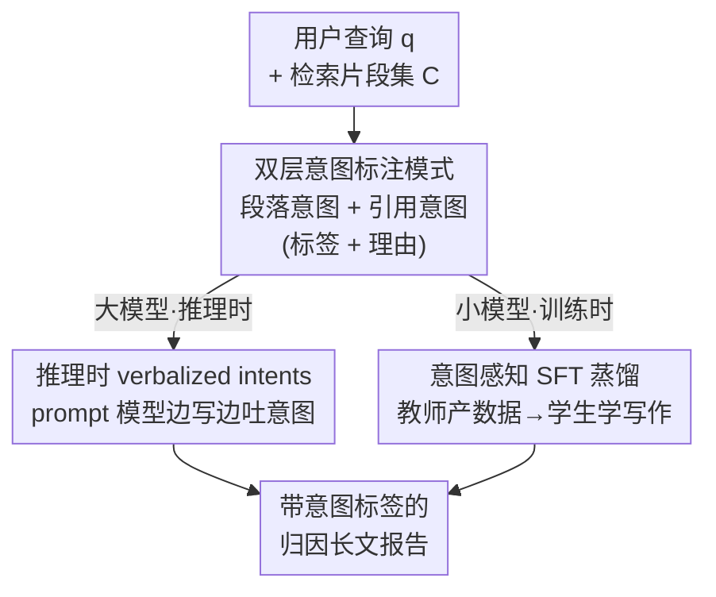

# Improving Attributed Long-form Question Answering with Intent Awareness

**会议**: ICLR 2026  
**OpenReview**: [https://openreview.net/forum?id=fRCm5c8x0j](https://openreview.net/forum?id=fRCm5c8x0j)  
**代码**: https://github.com/colinzhaoust/intent-aware-deep-research  
**领域**: 文本生成 / 长文问答 / 归因生成  
**关键词**: 意图感知, 引用归因, 长文报告生成, 深度研究系统, 知识蒸馏

## 一句话总结
针对深度研究系统生成的长文报告"引用质量差、可读性低"的问题，本文提出一套基于标签的双层意图（段落意图 + 引用意图）写作框架，既能在推理时通过 prompt 直接提升大模型，又能用带意图的合成数据蒸馏小模型——在三个科学报告生成基准上，大模型平均涨 +2.9 分、小模型涨 +12.3 分，引用指标提升尤为显著。

## 研究背景与动机
**领域现状**：深度研究系统（deep research）让 LLM 从几十上百个来源里汇总信息、生成带引用的多段落长报告，已经成为知识密集型问答的主流形态。和老式 QA 只检索几篇文档给个简短答案不同，这类任务要求组织结构、论证编织、来源归因三者兼顾。

**现有痛点**：现有方法基本都是 RAG 范式——把检索到的文档塞进上下文让模型一边写一边加引用。但模型只学到了人类写作的"文字风格"，却没学到人写作时背后的"思维过程"。一项记录学者在 Overleaf 上写作的研究发现，近 10% 的击键花在大纲、规划和组织上，可这些高层意图在最终文本里全被抹掉了，自然也不在训练语料里。结果是模型会模仿文风，却不会显式地规划"这段为什么这么写、这个引用为什么放这"。

**核心矛盾**：人类写作"每一段、每一句都有目的"（intent），但这种目的在成稿里是隐形的。模型从没被暴露过这些意图，因此在长文归因任务上引用召回低、引用精度不稳、报告读起来像一堆孤立段落的堆砌，缺乏论证的连贯性。

**本文目标**：把写作意图显式地注入生成过程，分解为两个子问题——(i) 怎么在写作时表示意图；(ii) 怎么把意图感知分别注入推理阶段（大模型）和训练阶段（小模型）。

**切入角度**：作者借鉴人类 sensemaking 与写作理论，假设"增强模型的意图意识能显著提升长文报告质量"。意图分两个粒度：段落级（这段是背景/对比/因果……）和引用级（这个引用是用于背景/动机/方法借用……），并用文献里成熟的引用意图与篇章模式分类体系来落地。

**核心 idea**：用一套内联的"标签 + 理由"意图模式（tag-based schema），在生成报告时显式吐出每段和每个引用的意图，作为写作的脚手架；推理时当作 test-time scaling，训练时当作高质量蒸馏信号。

## 方法详解

### 整体框架
方法的核心是一个**意图感知写作框架**：给定用户查询 $q$，系统要生成多段落报告 $R$，每段 $p_i$ 含若干句子，句中需要外部依据处插入引用 $c_j \in C$（来自参数化知识或检索片段）。框架不改动底层 RAG 架构，只在"怎么写"这一层做文章——先定义一套双层意图标注模式，再把这套模式分别注入两条路径：推理路径（直接 prompt 大模型边写边吐意图）和训练路径（让大教师模型生成带意图的数据，蒸馏给小学生模型）。最终产出的是嵌入了意图标签的、归因更可靠、可读性更高的长文报告。

### 关键设计

**1. 双层意图标注模式：用"标签+理由"把隐形写作目的显式化**

这一步直击"模型从没见过写作意图"的痛点。作者设计了两个粒度的意图：**段落意图**（paragraph intent）刻画整段在报告叙事中的功能（如背景铺垫、两种 SOTA 方法的对比），**引用意图**（citation intent）更细，刻画某个引用 $c_j$ 为什么被用来支撑某句话（如借用其方法、表达异同）。表示形式借鉴 STaR 与 ToW 的思路，用内联标签模板 `<begin intent> [意图类型] 理由 <end intent>`——引用意图用 `<bcit>...<ecit>` 包裹放在句子和内联引用之间，段落意图用 `<bpit>...<epit>` 放在每段正文之前。意图类型不是随意定的：引用意图直接采用 ACL-ARC 的六类体系（Background / Motivation / Uses / Extension / Comparison / Future），段落意图则取自篇章模式研究里的功能类别（Exposition / Definition / Argumentation / Compare-contrast / Cause-effect / Problem-solution / Evaluation / Narration，去掉了情感表达类）。关键在于每个标签都配一句自然语言**理由**，让意图不只是个类别符号，而是带着"为什么"的可读注释——这既是给模型的写作提示，也是给读者的导航。

**2. 推理时 verbalized intents：把意图当作一种针对性的 test-time scaling**

对已经很强的大商用模型，作者不做任何训练，只在推理时改 prompt：让模型直接输出嵌入了段落意图和引用意图标签的报告。作者把这种策略称为 verbalized intents，本质是 test-time scaling 的一个变体——但和 CoT 那种泛化的"想一想"不同，它专门诱导出"意图"这一类特定思维。直觉是：模型在落笔每段前先声明这段的功能、在每个引用前先声明引用的作用，相当于先做了一次轻量的写作规划，从而更克制地组织论证、更准确地把引用绑到它真正支撑的论点上。实验证实这主要提升了归因质量（引用精度/召回），而 rubric、答案精度这类不涉及引用的指标基本持平——因为 SOTA 大模型本就擅长抽取要点。

**3. 意图感知 SFT 蒸馏：先让教师产意图数据，再分三种粒度喂给小模型**

小模型本就落后大模型，直接让它边写边吐意图反而被额外复杂度拖累。作者的解法是：先用 verbalized intents 提示一个大教师模型（gemini-2.5-pro）生成带意图标签和理由的训练数据，再对小模型做 SFT，并设计三种逐级降低指令复杂度的变体。**intent-implicit SFT** 在训练前把意图标签和理由全删掉——数据是"带着意图想法"产出的，但学生只学直接写报告这件事，不学生成意图。**intent-explicit SFT** 保留意图标签和理由，让显式标签充当额外解释，帮小模型理解怎么组织段落、怎么用引用。**intent-multiview SFT** 进一步把意图感知生成拆成多个子任务：对每条数据产出四个"指令-报告"对（完整意图版、仅段落意图版、仅引用意图版、无意图版），在四者上联合训练，以降低单条数据点的指令复杂度。为公平起见，multiview 虽有 4 倍数据点，但训练步数压到 1/4，保证算力可比。两条 baseline 分别是：直接 prompt 不训练，以及在同一教师生成但不带意图的数据上做普通 SFT。

> ⚠️ **框架↔关键设计一致性**：框架图里的"双层意图标注模式 → 推理路径 / 训练路径 → 归因报告"三块，分别对应上面设计 1、2、3；训练路径内部的三种 SFT 变体收在设计 3 里统一讲。

### 一个完整示例
以图 1 的例子说明意图怎么改变生成：查询是"哪些实证研究考察了科研项目中重大思路转变（pivot）的成因？"。默认深度研究 agent 写出的某段，把"职业生涯转向"当成了研究方向转变来谈，离题且引用用得含糊。加上意图标注后，模型先在段前打出段落意图 `[PIT-Cause-Effect] 本段说明意外结果如何导致研究方向的重大改变`，落笔时就被这个"因果"功能约束住；写到引用处，又分别标出 `[1][2]: [CIT-Motivation] 意外发现` 和 `[3]: [CIT-Background] 假设重构`——于是模型清楚每个引用各自承担什么角色，写出的段落聚焦在"意外发现驱动 pivot"这一真正切题的因果链上，引用也各归其位。读者据此能一眼判断要不要展开读这段、要不要点进某个引用。

## 实验关键数据

### 主实验
三个长文报告生成基准：**SQA-CS-V2**（AstaBench 科学问答，rubric / 答案精度 / 引用精度 / 引用召回四指标）、**DeepScholar Bench**（生成 related-work 章节）、**ResearchQA**（综述派生的 rubric 评分，仅用段落意图、无检索）。检索集对每条查询固定，以排除检索质量干扰、只看写作差异。

推理时给大模型加意图（+intent）的效果：

| 模型 (SQA-CS-V2) | Overall | 引用精度 | 引用召回 |
|--------|------|------|------|
| o3 | 85.1 | 89.4 | 63.4 |
| o3 + intent | 86.0 | 89.9 | 66.9 |
| gemini-2.5-pro | 88.1 | 93.2 | 82.4 |
| gemini-2.5-pro + intent | **89.7** | 95.7 | 86.1 |
| Claude opus-4 | 85.4 | 89.6 | 79.6 |
| Claude opus-4 + intent | **89.0** | 95.1 | 86.0 |

Claude 的引用精度/召回提升 5-7 个绝对点；配对 t 检验显示 gemini 的 Overall 提升 $p=0.013$、o3 $p=0.072$（$\alpha=0.1$ 下显著）。大模型跨基准宏平均 +2.9 分，其中引用指标 +3.7 分。

小模型意图感知 SFT（SQA-CS-V2）：

| 基座 / 变体 | Overall | 引用精度 | 引用召回 |
|--------|------|------|------|
| gemini-2.5-pro (参考) | 88.1 | 93.2 | 82.4 |
| qwen3-8b 无训练 | 80.7 | 83.2 | 66.9 |
| qwen3-8b baseline SFT | 83.2 | 85.8 | 73.9 |
| qwen3-8b intent-multiview | **88.6** | 93.7 | 84.7 |
| llama3.1-8b 无训练 | 66.4 | 67.2 | 56.1 |
| llama3.1-8b intent-multiview | **89.2** | 95.4 | 86.7 |
| qwen3-4b 无训练 | 80.9 | 82.8 | 68.1 |
| qwen3-4b intent-explicit | **87.5** | 91.5 | 81.3 |

qwen3-8b / llama3.1-8b / qwen3-4b 相对各自基座分别 +7.9 / +22.8 / +6.1 分；8B 模型的 multiview 变体甚至反超 gemini-2.5-pro。小模型跨任务平均 +12.3 分，引用指标平均 +18.7 分。

### 消融实验
gemini-2.5-pro 在 SQA-CS-V2-dev 上的意图类别消融与方法对比：

| 配置 | Overall | 引用精度 | 引用召回 | 说明 |
|------|---------|---------|---------|------|
| 无意图 | 88.1 | 93.2 | 82.4 | baseline |
| 仅引用意图 | 88.6 | 95.3 | 86.2 | 引用指标已大涨 |
| 仅段落意图 | 89.1 | 95.2 | 85.6 | 单用也有效 |
| 全部意图 | **89.7** | 95.7 | 86.1 | 两类正交叠加最优 |
| CoT | 81.3 | 83.3 | 76.1 | 反而掉点 |
| ReAct | 77.6 | 76.5 | 72.0 | 更差 |

### 关键发现
- **引用是涨点主战场**：rubric / 答案精度基本不动，提升几乎全来自引用精度和召回——意图主要修的是"归因"而非"找要点"。
- **两类意图正交互补**：段落意图、引用意图单独用都涨，合起来最优；且都明显优于 CoT、ReAct 这类通用推理 prompt（后者在长文报告上甚至掉点）。
- **意图让小模型"像大模型一样用引用"**：分析显示加意图后小模型用到的检索候选比例大幅上升（baseline SFT ~34% → multiview ~64%）且不掉精度，与 gemini 的引用重叠覆盖度也从 ~58 升到 ~87。
- **multiview 对 8B 最稳**：把意图生成拆成多视图子任务、降低单点指令复杂度，对 8B 模型一致最优；4B 上 explicit/multiview 明显优于 implicit，印证"保留意图标签=额外解释"的假设。
- **o3 引用行为反常**：约 60% 的 claim 掺入了 o3 自身记忆而非上下文片段，加引用意图在 DeepScholar 上反而掉引用质量，只用段落意图才稳（+2.5 分）。
- **意图分布暴露模型差异**：模型整体复现了人类"Background/Uses 主导"的趋势，但严重低用 Comparison/Contrast（~5% vs 人类 17%），说明当前系统倾向"陈述"而非"综合对比"。
- **用户研究证实可读性**：20 名被试、71 份报告，读带意图版本的段落/引用 Likert 评分 4.47 / 4.46，显著高于 baseline 的 3.84 / 3.62，意图能帮读者快速决定是否展开某段或点进某引用。

## 亮点与洞察
- **意图既是生成脚手架，也是诊断探针**：同一套标签，推理时拿来 test-time scaling、训练时拿来蒸馏、事后还能统计分布来诊断"模型 vs 人类"的写作差异（如缺对比），一物三用。
- **不动 RAG、纯靠解码与蒸馏**：方法是 plug-and-play 的，保留现有 RAG 架构，只在写作层加意图，迁移成本低。
- **"标签+理由"的双重价值**：理由不仅给模型当写作提示，还直接成了给读者的导航注释，把可解释性顺手做进了产物里——这个把"训练信号"和"用户体验"合二为一的设计很巧。
- **可迁移 trick**：当大模型的某种隐式技能（这里是写作意图）难以蒸馏时，让教师显式吐出该技能的中间表示、再用多视图拆解降低学生学习难度，是个通用的蒸馏配方。

## 局限与展望
- 作者承认意图模式是**纯合成**的，只有段落和引用两层，而人类写作是多层、层级化的意图（段落间相互支撑、引用承担批判/预期/语境化等更细的修辞角色），未来可用人工标注或写作过程日志来 grounding，并探索树/图结构的意图表示。
- 研究**局限在科学领域**，写作结构相对规范；政策、法律、人文等领域的引用可能承担修辞、历史、伦理等本模式覆盖不到的功能，schema 可能需要领域自适应。
- o3 的反常案例说明方法**对模型自身引用行为依赖较大**：当模型倾向用参数化记忆而非上下文时，引用意图可能反噬，需要按模型挑意图类型。
- 评测重度依赖 LLM-judge 流水线，引用精度/召回这类指标本身的可靠性会传导到结论上；用户研究规模（20 人）也偏小。

## 相关工作与启发
- **vs 普通 RAG 归因生成**：以往工作训练 LLM 在生成时结合外部/参数化知识并加引用，关注引用质量本身；本文不改 RAG，而是在写作层注入"为什么这么写/为什么引这篇"的意图，把归因问题转化为意图规划问题。
- **vs CoT / ReAct**：同属推理时增强，但 CoT/ReAct 诱导的是通用"思考/行动"，在长文报告上反而掉点；本文 verbalized intents 专门诱导"写作意图"这一类思维，更贴合报告组织与归因，实验上明显占优。
- **vs STaR / ToW 等 rationale 方法**：借用了"标签+理由"的表示形式，但把 rationale 从"解题推理"换成"写作意图"，并首次系统地把它同时用于推理增强和小模型蒸馏。
- **vs 引用意图分类 / 篇章解析**：以往把意图理解当成分类或解析任务（事后分析既有文本）；本文反过来把意图类别当成生成时的前置规划信号，让模型先声明意图再写作。

## 评分
- 新颖性: ⭐⭐⭐⭐ 把"写作意图"从分析任务转成生成脚手架，并打通推理增强与蒸馏两条路，视角新颖
- 实验充分度: ⭐⭐⭐⭐ 三基准 + 多基座 + 意图类别消融 + 引用行为分析 + 用户研究，较完整；但 judge 依赖与用户规模偏小
- 写作质量: ⭐⭐⭐⭐ 动机清晰、图 1 例子直观、意图分布分析有洞见
- 价值: ⭐⭐⭐⭐ 即插即用、对小模型增益巨大（+12.3），对深度研究/长文归因系统有直接实用价值

<!-- RELATED:START -->

## 相关论文

- [\[ACL 2026\] Frankentext: Stitching Random Text Fragments into Long-Form Narratives](../../ACL2026/nlp_generation/frankentext_stitching_random_text_fragments_into_long-form_narratives.md)
- [\[ICLR 2026\] Text Summarization via Global Structure Awareness](text_summarization_via_global_structure_awareness.md)
- [\[ICLR 2026\] FS-DFM: Fast and Accurate Long Text Generation with Few-Step Diffusion Language Model](fs-dfm_fast_and_accurate_long_text_generation_with_few-step_diffusion_language_m.md)
- [\[ACL 2026\] Difficulty-Controllable Cloze Question Distractor Generation](../../ACL2026/nlp_generation/difficulty-controllable_cloze_question_distractor_generation.md)
- [\[ACL 2025\] Context-Aware Hierarchical Merging for Long Document Summarization](../../ACL2025/nlp_generation/context-aware_hierarchical_merging_for_long_document_summarization.md)

<!-- RELATED:END -->
