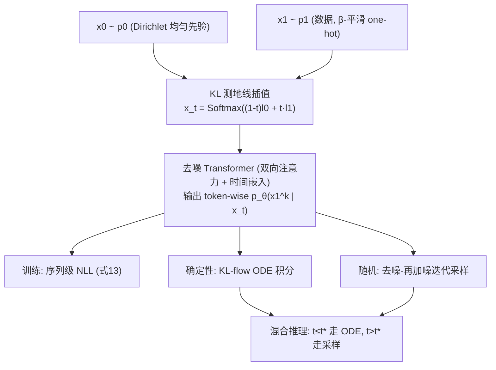

# Logit-KL Flow Matching：用采样-混合推理做非自回归文本生成

**会议**: ICLR 2026  
**OpenReview**: [https://openreview.net/forum?id=scgtQSpROE](https://openreview.net/forum?id=scgtQSpROE)  
**代码**: 待确认  
**领域**: 非自回归文本生成 / 离散流匹配  
**关键词**: Non-Autoregressive Generation, Conditional Flow Matching, KL Geodesic, Logit Interpolation, Iterative Sampling  

## 一句话总结
本文用"logit 空间的线性插值"（等价于 simplex 上的 KL 测地线）作为离散流匹配的路径，证明了最大化条件似然恰好恢复出流匹配的速度场，并配上一套"去噪-再加噪"的迭代采样器和混合推理方案，在非自回归文本/代码生成上显著刷低困惑度、刷高 BLEU。

## 研究背景与动机
- **领域现状**：非自回归（NAR）语言模型一次性并行生成所有 token，绕开了自回归逐字解码的串行瓶颈，效率诱人。近年一批工作把流匹配/扩散搬到离散序列上——Discrete Flow Matching、Dirichlet Flow Matching、Fisher-Flow 都把 token 表示成 $(V-1)$-维 simplex（概率单纯形）上的 one-hot 向量，再在初始分布 $\rho_0$ 与数据分布 $\rho_1$ 之间插值出一条概率路径 $\rho_t$。
- **现有痛点**：路径怎么选是核心设计点，而既有选择都有毛病。**simplex 上的线性插值**（直接在概率空间连直线）被前人指出对离散数据效果差；**Fisher-Rao 测地线**沿超球面走，理论漂亮但同样存在信号衰减问题。本文用一张图点破了根因：这两种路径在 $t$ 接近 0 时就让 $\mathrm{KL}(x_1\|x_t)$ 迅速塌到接近 0，相当于把整个传输压缩成"一步到位"，模型在大部分时间轴上拿不到有信息量的梯度——词表越大（$|V|=10000$）塌得越狠。
- **核心矛盾**：NAR 要靠"一条信息饱满的插值路径"提供持续训练信号，但已有的几何路径恰恰在大词表下过早丢失信号；同时 NAR 把序列条件分布近似成 token-wise 独立乘积，推理时 token 间依赖建模不准。
- **本文目标**：找一条几何上更合理、在大词表下仍保留学习信号的离散插值路径，并补上推理阶段被 token 独立假设拖累的性能缺口。
- **核心 idea**：**【路径几何】** 改用 KL 散度诱导的测地线——它在 logit 空间就是一条直线（$l_t=(1-t)l_0+t l_1$ 再过 Softmax），$\mathrm{KL}(x_1\|x_t)$ 沿路衰减得慢得多，全程都有梯度；**【推理修正】** 再叠一个随机迭代采样器 + 确定性 ODE 的混合方案，针对性补救 token 独立近似在小 $t$ 处失真的问题。

## 方法详解

### 整体框架
训练阶段：采 $x_0\sim p_0$（simplex 上均匀的 Dirichlet(1) 先验）、$x_1\sim p_1$（数据，one-hot 顶点经 $\beta$-平滑），沿 KL 测地线插值得到中间态 $x_t=\mathrm{Softmax}((1-t)\log x_0+t\log x_1)$；去噪网络（双向注意力 Transformer + 连续时间嵌入）输出 token-wise 条件 $p_\theta(x_1^{(k)}\mid x_t)$，用序列级 NLL 训练。推理阶段提供三条互补路线：确定性 KL-flow ODE 积分、随机迭代采样、以及二者按切换时刻 $t^\star$ 拼接的混合方案。

### 关键设计

**1. KL 测地线 = logit 空间线性插值：用对几何换回梯度信号。** 本文把插值路径定义为 KL 散度诱导的测地线：$x_t=C_t\, x_0^{1-t} x_1^{t}$，其中 $C_t$ 把结果归一回 simplex。它的关键性质是在 logit 上就是一条直线——令 $l_0=\log x_0,\ l_1=\log x_1$，则 $l_t=(1-t)l_0+t l_1$ 且 $x_t=\mathrm{Softmax}(l_t)$，对应线性 ODE $\frac{dl_t}{dt}=l_1-l_0$。由于 $\log$ 在 0 处发散，目标 one-hot 用 $\beta$-平滑写成 $x_1=(1-\beta)\delta_i+\frac{\beta}{V}\mathbf{1}$。这条路径让 $\mathrm{KL}(x_1\|x_t)$ 衰减得比 Linear/Fisher-Rao 慢得多，在 $|V|=10000$ 下尤其明显，从而把"全程有学习信号"这件事从经验观察落成了几何解释；Table 1 直接印证：同样 150M 模型，KL-Flow 的困惑度（41/53/62）远好于 Fisher-Rao（192/298/379）和 Linear（>1300）。

**2. 条件似然最大化 ⇔ 流匹配速度场：把回归速度场变成去噪问题。** 单 token 情形下，条件流匹配目标 $\mathcal{L}_{\text{CFM}}=\mathbb{E}\|v_\theta(x_t,t)-(l_1-l_0)\|^2$ 看似要直接拟合速度。本文做了一步重参数化 $v_\theta(x_t,t)=\frac{\hat v_\theta(x_t,t)-l_t}{1-t}$，把目标等价改写成对"干净目标 logit"的去噪回归 $\mathcal{L}_{\text{CFM}}=\mathbb{E}\|\hat v_\theta(x_t,t)-l_1\|^2$。命题 3.2 给出其唯一最优解 $\hat v_\theta^\star(x_t,t)=\mathbb{E}_{x_1\sim p(x_1\mid x_t)}[l_1]$，于是速度场 $v(x_t,t)=\frac{1}{1-t}(\mathbb{E}_{x_1\sim p_\theta(x_1\mid x_t)}[l_1]-l_t)$ 完全通过学一个条件密度 $p_\theta(x_1\mid x_t)$ 得到，而不必直接参数化速度场。命题 3.4 进一步证明在 KL 测地线下这个期望按 token 分解，因此学序列速度场就归结为对每个 token 独立估计边缘后验 $p_\theta(x_1^{(k)}\mid x_t)$，用序列级 NLL（式 13）训练即可。这正是"理论上为何这套 NAR 做法成立"的核心论证：把单 token 才有的保证推广到了整个序列。

**3. 去噪-再加噪的迭代采样器：绕开 token 独立假设的失真。** 确定性 ODE 积分（KL-flow basic）虽稳定但实测困惑度偏高。本文据 Markov 分解 $p(x_{t+h}\mid x_t)=\int p(x_{t+h}\mid x_1)p(x_1\mid x_t)dx_1$ 设计随机采样器：每步先从去噪器的因子化后验里采一个完整目标 $x_1^{(k)}\sim p_\theta(x_1^{(k)}\mid x_t)$，再沿 KL 测地线"再加噪"采 $x_{t+h}^{(k)}\sim p(x_{t+h}^{(k)}\mid x_1^{(k)})$ 前进一步，迭代到 $t=1$。每步只需一次前向，复杂度与 ODE 求解器持平。它的代价是显式依赖 token 独立近似 $p(x_1\mid x_t)\approx\prod_k p_\theta(x_1^{(k)}\mid x_t)$，会降低熵（多样性下降）。

**4. 混合推理：用切换时刻 $t^\star$ 在两套机制间取长补短。** token 独立近似在 $t=1$ 处精确，但 $t$ 减小时 token 间依赖逐渐浮现导致采样器失真；确定性 ODE 则在早期（小 $t$）更稳。于是混合方案在 $t\le t^\star$ 用 Algorithm 1 的确定性积分打稳早期传输，$t>t^\star$ 切到 Algorithm 2 的随机采样器抓后期细节。代价是要调一个超参 $t^\star$，但换来的是困惑度/熵的更优权衡——在多解任务（Lamini 指令）上 hybrid 拿最高分，在低熵的机器翻译上纯 sampling 反而更强，说明这个切换给了任务自适应的空间。

## 实验关键数据

### 主实验：无条件生成（FineFineWeb，生成困惑度↓）

| 方法 | NFE 256/512/1024 (Llama-2 ppl ↓) |
|------|------|
| GPT-2 (AR) | 48.7 (NFE=1024) |
| DFM | 150.6 / 107.3 / 75.0 |
| SEDD | 70.8 / 57.7 / 47.6 |
| KL-flow (150M) | 61.0 / 47.1 / 35.1 |
| **KL-flow (1.5B)** | **51.5 / 41.7 / 32.7** |

1.5B 的 KL-Flow 在所有评测 LM（Llama-2/GPT-3/GPT-2）和所有 NFE 上都拿最佳困惑度；即便 NFE 砍到 256（4 倍加速），仍与自回归 GPT-2 持平或更优。

### 主实验：条件生成（BLEU ↑）

| 数据集 | 方法 | BLEU Top-5 / Avg |
|------|------|------|
| Lamini Instruction | DFM | 8.1 / 3.6 |
| Lamini Instruction | **KL-flow (hybrid)** | **9.5 / 4.3** |
| WMT14 De-En | DFM | 21.3 / 11.2 |
| WMT14 De-En | **KL-flow (sampling)** | **27.0 / 18.1** |

多解的指令任务 hybrid 最优；确定性翻译任务 sampling 最优，印证了切换机制的任务自适应。

### 关键发现
- **路径几何决定成败**：Table 1 中 KL-Flow（41/53/62 ppl）相对 Fisher-Rao（192/298/379）和 Linear（>1300）是数量级的差距，验证"大词表下慢衰减的 KL 路径才保住梯度信号"这一核心主张。
- **整体增益**：无条件生成困惑度至少降 27%（FineFineWeb），条件任务 BLEU 至少提升 17%/26%（Lamini/WMT14），代码补全 Pass@1/Pass@10 各涨 56%/14%（遮 10% 代码行）。
- **加速不掉质**：NFE 减半甚至四倍缩减时性能稳定，体现 NAR 并行解码的效率优势在该框架下可兑现。

## 亮点与洞察
- **几何选择被理论+可视化双重坐实**：不是经验试出来的路径，而是先用 $\mathrm{KL}(x_1\|x_t)$ 衰减曲线指出 Linear/Fisher-Rao 的"早塌"病灶，再证明 KL 测地线恰好在 logit 空间是直线，逻辑闭环漂亮。
- **把速度场学习降维成去噪**：重参数化后只需学条件密度 $p_\theta(x_1\mid x_t)$，并证明在 KL 测地线下按 token 分解，工程上直接复用标准（双向）Transformer + NLL，落地成本低。
- **推理三件套各司其职**：确定性稳早期、随机抓后期、混合调权衡，且实验揭示不同任务（高熵多解 vs 低熵确定）最优策略不同，给了实践者明确选型依据。

## 局限与展望
- **token 独立假设仍是天花板**：随机采样器显式假设 $p(x_1\mid x_t)\approx\prod_k p_\theta(x_1^{(k)}\mid x_t)$，本文也承认这在小 $t$ 处会因 token 间依赖而退化，混合方案只是缓解而非根治；序列级依赖的精确建模仍是开放问题。
- **混合方案要调 $t^\star$**：切换时刻是额外超参，缺乏自动确定的理论指引。
- **采样器缺完整理论**：作者明确说去噪-再加噪迭代器"缺乏完整理论分析"，目前靠经验有效。
- **规模与基线范围有限**：最大 1.5B，对比集中在 DFM/SEDD/GPT-2 同设置重训，未与更大规模或扩散语言模型的最新强基线正面比较。

## 相关工作与启发
- **离散流匹配/扩散谱系**：Discrete Flow Matching (Gat et al. 2024)、Dirichlet Flow Matching (Stärk et al. 2024)、Fisher-Flow (Davis et al. 2024)、SEDD/score-based 离散扩散 (Lou et al. 2024)、Discrete Flow Models (Campbell et al. 2024) 构成本文的直接对照系；本文的贡献在于换了一条几何上更优的 KL 测地线路径并给出理论。
- **启发**：当一个生成框架在"插值路径/噪声 schedule"上有自由度时，先用一个可量化的几何/信息量指标（这里是 $\mathrm{KL}(x_1\|x_t)$ 的衰减速度）去诊断路径好坏，往往比盲目调网络更有效；"把速度场回归重写成去噪回归"也是连接流匹配与扩散去噪两套语言的实用桥梁。

## 评分
- 新颖性: ⭐⭐⭐⭐ KL 测地线=logit 线性插值的视角清晰，并配上"条件似然最大化恰好恢复速度场"的理论，是离散流匹配路径设计上扎实的一步。
- 实验充分度: ⭐⭐⭐⭐ 覆盖无条件/条件/代码补全三类任务、多个评测 LM 与 NFE，且基线同设置重训保证公平；但最大仅 1.5B、强基线略窄。
- 写作质量: ⭐⭐⭐⭐ 理论推导（命题 3.2/3.4）与几何可视化（Fig.2）配合到位，三种推理方案用 Table 2 对照清楚。
- 价值: ⭐⭐⭐⭐ 为 NAR 文本生成提供了几何原理 + 可落地的去噪式实现 + 任务自适应推理选型，对追求高效并行解码的方向有实际参考价值。

<!-- RELATED:START -->

## 相关论文

- [\[ICLR 2026\] FS-DFM: Fast and Accurate Long Text Generation with Few-Step Diffusion Language Model](fs-dfm_fast_and_accurate_long_text_generation_with_few-step_diffusion_language_m.md)
- [\[ICLR 2026\] Unveiling the Potential of Diffusion Large Language Model in Controllable Generation](unveiling_the_potential_of_diffusion_large_language_model_in_controllable_genera.md)
- [\[ICLR 2026\] Rainbow Padding: Mitigating Early Termination in Instruction-Tuned Diffusion LLMs](rainbow_padding_mitigating_early_termination_in_instruction-tuned_diffusion_llms.md)
- [\[ICLR 2026\] Text Summarization via Global Structure Awareness](text_summarization_via_global_structure_awareness.md)
- [\[ICLR 2026\] Rethinking Uncertainty Estimation in LLMs: A Principled Single-Sequence Measure](rethinking_uncertainty_estimation_in_llms_a_principled_single-sequence_measure.md)

<!-- RELATED:END -->
