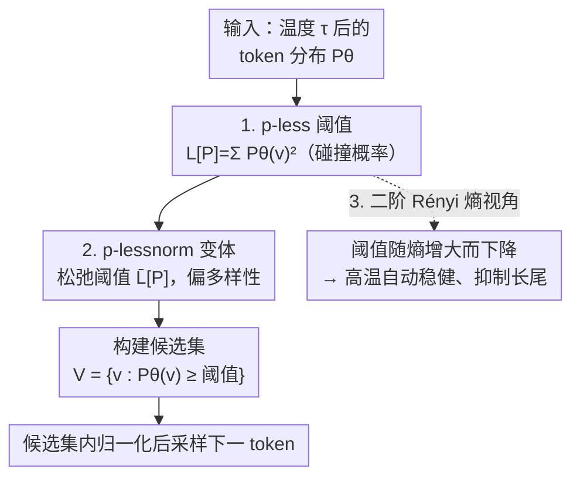

# p-less Sampling: A Robust Hyperparameter-Free Approach for LLM Decoding

**会议**: ICLR 2026  
**OpenReview**: [https://openreview.net/forum?id=ItFuNJQGH4](https://openreview.net/forum?id=ItFuNJQGH4)  
**代码**: 已开源（论文中以脚注给出，未在缓存正文中给出具体地址）  
**领域**: 文本生成 / LLM 解码 / 采样策略  
**关键词**: 截断采样, 无超参数解码, 信息论, 碰撞熵, 温度稳健性

## 一句话总结
本文提出 p-less 采样：一种**完全没有超参数**的截断式解码方法，每一步用整个 token 分布的"碰撞概率" $\sum_v P_\theta(v)^2$ 当作动态截断阈值，在数学、逻辑推理和创意写作上都优于 top-p / min-p 等方法，并且在高温下几乎不退化、推理还更快。

## 研究背景与动机

**领域现状**：LLM 的概率式解码大量依赖**截断采样**——先把 next-token 分布砍成一个"高概率子集"，再从中按概率采样。主流做法包括 top-k（取概率最高的 k 个）、top-p（取累积概率超过 p 的最小集合）、$\epsilon$-sampling（砍掉概率低于 $\epsilon$ 的 token）、mirostat（假设分布服从 Zipf 律、动态维持目标 surprisal）、min-p（用"众数概率 × 分数 $p$"当阈值）等。

**现有痛点**：这些方法**都带超参数**（$k$、$p$、$\epsilon$、目标 surprisal、学习率……），而且最优值会随**生成任务**和**采样温度**漂移。一个在 GSM8K 上调好的 top-p 值，换到创意写作或者把温度从 0.7 调到 2.0 就可能崩。更糟的是，当温度升高、分布被"压平"时，固定阈值的方法会把大量长尾低概率 token 也放进候选集，导致文本退化（degeneration）——读起来语无伦次。

**核心矛盾**：阈值要不要随**当前分布**和**温度**自适应？现有方法要么用固定阈值、完全无视当前分布（top-p / top-k / $\epsilon$），要么只看分布的**单个统计量**（min-p 只用众数概率），要么只在满足条件时才考虑分布（$\eta$-sampling）。没有一个方法是"看着整张分布、又不需要调参"的。

**切入角度**：作者从一个信息论问题出发——"给定一张 token 分布，哪些 token 才**值得**留下来采样？"答案应该由分布**本身的全部信息**决定，而不是外部塞进来的超参数。

**核心 idea**：把截断阈值定义为"**随机采一个 token、恰好采中 ground-truth 的概率**"，也就是分布的碰撞概率 $L[P]=\sum_v P_\theta(v)^2$。一个 token 只有当它的概率"至少不低于这个随机命中概率"时，才有资格进候选集——既无超参数，又天然随分布和温度变化。

## 方法详解

### 整体框架

p-less 不改训练、不改模型，只替换**解码时每一步的截断规则**。在第 $t$ 步，自回归模型给出（施加温度后的）词表分布 $P_\theta(v\mid x_{1:t-1})$，p-less 做三件事：① 用整张分布算出一个标量阈值 $L[P]$；② 把概率不低于该阈值的 token 收进候选集 $V_{\text{p-less}}$；③ 在候选集内重新归一化后采样下一个 token。整个过程**不引入任何需要调的参数**，阈值完全由当前分布决定。

在此基础上作者给出一个偏多样性的变体 **p-lessnorm**（松弛阈值），并从**二阶 Rényi 熵**的角度解释了为什么这个阈值会随温度自适应、从而在高温下稳健。

### 关键设计

**1. p-less 阈值：用"随机命中概率"当动态截断线**

针对"阈值要不要看整张分布"这个痛点，作者给出一个纯信息论的答案。设 $S$ 是被采样到的 token、$T$ 是 ground-truth token，二者相互独立（采样不带反馈），则"采样恰好命中 ground-truth"的概率为

$$L[P]=\sum_{v\in V} P(S=v)\,P(T=v)=\sum_{v\in V} P_\theta(v\mid x_{1:t-1})^2,$$

这里用了一个关键近似：因为我们只能拿到模型预测分布、没有外部真值，于是把 $P(T=v)$ 直接取成模型分布 $P_\theta$，从而 $L[P]$ 退化成"分布自身平方和"，即**碰撞概率**（collision probability）。截断规则就是：

$$V_{\text{p-less}}=\{\,v\in V: P_\theta(v\mid x_{1:t-1})\ge L[P]\,\},$$

再在 $V_{\text{p-less}}$ 内按 $P_\theta$ 归一化采样。直觉是：$L[P]$ 就是"随便采一个、恰好对的"那条线，能进候选集的 token 至少要比"随机蒙对"更有把握。这条线**完全由分布算出**，不需要任何超参数；分布越尖锐（模型越确信）$L[P]$ 越大、候选集越小，分布越平 $L[P]$ 越小、候选集越大。作者还指出 $L[P]=|V|\cdot M[P]$，其中 $M[P]$ 是概率质量函数二阶矩的无偏估计，给阈值又添了一层统计矩的解释。

**2. p-lessnorm 变体：在偏好多样性的场景松弛阈值**

p-less 默认偏连贯；但创意写作等场景更想要多样性，阈值就需要放低一点、放进更多 token。作者构造了 p-lessnorm，把"随机采到一个**错误** token 的概率"按"正确/错误结果数之比"归一化后从原阈值里减掉：

$$\bar L[P]:=L[P]-\frac{1}{|V|-1}\sum_{\substack{u,v\in V\\ u\ne v}}P_\theta(u)P_\theta(v)=\frac{|V|}{|V|-1}L[P]-\frac{1}{|V|-1}.$$

由于 $\bar L[P]\le L[P]$，阈值被系统性地调低，候选集变大、采样更发散。它和 p-less 共用同一套机制，只是把"门槛"换成更宽松的一条线，因而依旧**无超参数**——是否用 norm 版本取决于任务对"连贯 vs 多样"的偏好，而不是一个要调的数。

**3. 与二阶 Rényi 熵的联系：阈值随温度自动稳健**

这一节解释了 p-less 高温不退化的根因。$\alpha$ 阶 Rényi 熵为 $H_\alpha(p)=\frac{1}{1-\alpha}\log\sum_i p_i^\alpha$，其中二阶（碰撞熵）恰好是

$$H_2(p)=-\log\sum_i p_i^2=-\log L[P].$$

因为 $\log$ 单调，**$L[P]$ 随碰撞熵下降而上升**；又因 $H_2(p)\le H_1(p)$（Shannon 熵），可推出 $L[P]\ge \exp(-H_1(p))$，即阈值也与 Shannon 熵**负相关**。这正是关键：升高温度会压平分布、抬高熵，于是 $L[P]$ 自动**变小**——但作者强调（对照论文 Figure 1）p-less 仍然能合理地砍掉长尾，而 top-p / min-p 这类方法在高温下会大量放进低概率 token 导致退化。二阶 Rényi 熵对"概率质量的集中度"敏感，恰好衡量了模型的全局置信度，所以用它当门槛比只看单个 token（min-p）或假设某种分布形态（mirostat）更稳。这也解释了为什么 p-less 在温度趋于 0 或 ∞ 时阈值依然有意义，而别的方法的超参数在极端温度下会失效。

### 损失函数 / 训练策略
无。p-less 是**纯解码期**方法，不涉及任何训练、微调或额外模型，可直接替换现有采样器的截断步骤。

## 实验关键数据

**设置**：在 Llama-2-7B(Chat)、Mistral-7B(Instruct)、Llama3-70B(Instruct) 三个模型上，覆盖数学/逻辑推理（GPQA、GSM8K、QASC、CSQA）和创意写作（Writing Prompts）。温度从 0.5 扫到 2.0。为公平比较不同温度，作者用**准确率-温度曲线下面积 AUC**（归一化到 0~1）作主指标；创意写作用 length-controlled win rate，并补充人工评测。

### 主实验（数学 / 逻辑推理 AUC，越高越好）

| 模型 | 数据集 | top-p | min-p | mirostat | p-less | p-lessnorm |
|------|--------|-------|-------|----------|--------|------------|
| Llama2-7b | CSQA | 0.410 | 0.488 | 0.410 | 0.503 | **0.503** |
| Llama2-7b | QASC | 0.393 | 0.502 | 0.419 | 0.537 | **0.538** |
| Llama2-7b | GSM8K | 0.210 | 0.256 | 0.201 | **0.267** | 0.267 |
| Mistral-7b | GSM8K | 0.438 | 0.523 | 0.392 | 0.562 | **0.564** |
| Mistral-7b | QASC | 0.604 | 0.730 | 0.684 | 0.736 | **0.739** |
| Llama3-70b | GSM8K | 0.870 | 0.924 | 0.879 | **0.932** | 0.930 |

在 Llama2-7b 和 Mistral-7b 上，p-less / p-lessnorm 在**所有数据集**的 AUC 都领先；在更强的 Llama3-70b 上则是最高或与最高相差不超过 0.005。从准确率-温度曲线看，所有 baseline 都随温度升高不同程度退化，而 p-less 在温度 ≥ 1.0 时**拉大领先优势**。

### 创意写作（Writing Prompts，length-controlled win rate）

| 模型 | 温度 | $\epsilon$ | min-p | top-p | p-less | p-lessnorm |
|------|------|-----------|-------|-------|--------|------------|
| Llama-2-7b | 1.0 | 62.18 | 57.48 | 62.07 | 55.08 | 58.74 |
| Llama-2-7b | 1.5 | 1.99 | 58.17 | 4.39 | 58.23 | **59.58** |
| Llama-2-7b | 2.0 | 0.00 | 48.94 | 0.00 | **65.64** | 59.29 |
| Mistral-7b | 1.5 | 3.71 | 62.17 | 0.00 | **66.97** | 66.89 |
| Mistral-7b | 2.0 | 0.00 | 54.11 | 0.00 | 60.32 | **61.99** |

关键现象：温度升到 1.5 / 2.0 时，$\epsilon$-sampling、top-p、$\eta$-sampling 的胜率直接**崩到接近 0**（文本退化严重），而 p-less / p-lessnorm 仍稳定在 ~60。人工评测与自动评测方向一致，标注者也更偏好 p-less 生成的故事。

### 关键发现
- **温度稳健性是最大卖点**：p-less 在低温与别的方法相当，在高温（≥1.0）显著拉开差距，恰好印证了"阈值随熵/温度自适应"的理论。
- **效率更高**：作者报告 p-less 的平均单 token 采样耗时更低、生成长度更短，在不牺牲准确率的前提下提升了推理效率。
- **不是退化成贪心**：在偏低熵的数学/推理任务上 p-less 能逼近甚至超过贪心解码，但在高熵的创意写作上又显著优于贪心，说明它是真在按分布熵动态调节，而非单纯求 argmax。
- **p-less vs p-lessnorm**：推理任务两者几乎并列；创意写作里谁更优随温度/模型摆动，整体印证 norm 版本偏多样性的定位。

## 亮点与洞察
- **把"超参数"彻底从截断采样里抹掉**：阈值是分布的一个闭式函数 $\sum P^2$，不需要为每个任务/温度调参——这对要在多任务、多温度下部署同一套解码器的场景非常实用。
- **一个公式三种解读**：碰撞概率（概率论）、二阶 Rényi 熵（信息论）、二阶矩的无偏估计（统计矩）三条路径都指向同一个阈值，理论自洽度很高，也让"为什么这样设阈值"有了底。
- **高温不崩**这一点很有迁移价值：任何需要高多样性采样（合成数据生成、创意写作）又怕退化的流程，都可以直接把截断器换成 p-less，省掉为高温重新调 top-p/min-p 的功夫。

## 局限与展望
- **依赖模型分布即"真值"的近似**：方法把 $P(T=v)$ 直接取成 $P_\theta$，当模型本身校准很差（过度自信或欠自信）时，阈值是否仍合理值得追问。
- **阈值形态固定**：$\sum P^2$ 给的是一条确定的线，缺少像 min-p 那样"再松一点/紧一点"的旋钮——虽然 p-lessnorm 提供了一档松弛，但本质仍是两个离散选项，遇到介于"连贯"和"多样"之间的细粒度偏好时不易微调。
- **评测以 7B / 70B 开源模型为主**：在更大规模或经过强 RLHF 对齐的模型上，分布通常更尖锐，p-less 的截断行为与收益是否依旧，需要进一步验证。
- 可改进方向：把 p-less 推广到 $k$ 阶 Rényi 熵阈值（论文附录已提及），用阶数 $k$ 作为一个**可解释**的连贯-多样旋钮，可能在保持"低调参负担"的同时给出更细的控制。

## 相关工作与启发
- **vs top-p / top-k / $\epsilon$-sampling**：它们用固定阈值、无视当前分布，且超参数在极端温度下失去意义；p-less 用整张分布算阈值、随温度自适应，无超参数。
- **vs min-p**：min-p 用"众数概率 × 分数"当阈值，只用到分布的**单个统计量**且仍需调那个分数；p-less 用全分布的二阶矩，且无参数。
- **vs $\eta$-sampling**：$\eta$ 引入熵感知，但只在满足条件时才考虑分布、还额外加超参数并假设熵服从均匀基线；p-less 始终用全分布、不做参数假设。
- **vs mirostat**：mirostat 假设分布服从 Zipf 律、靠反馈维持目标 surprisal，需调目标值与学习率；p-less 不做分布假设、无反馈、无参数，避免了额外估计误差。
- **vs 对比解码 / 对比搜索 / 算术采样**：这些是与截断正交的解码增强（多模型对比、并行采样等），可与 p-less 叠加使用，属互补而非竞争。

## 评分
- 新颖性: ⭐⭐⭐⭐ 把碰撞概率/二阶 Rényi 熵接到截断采样、做到真正无超参数，角度干净且有理论支撑。
- 实验充分度: ⭐⭐⭐⭐ 三模型五数据集、跨温度 AUC + 人工评测 + 效率分析，覆盖到位；但偏向 7B 级开源模型。
- 写作质量: ⭐⭐⭐⭐ 动机—方法—理论—实验链条清晰，三种解读串得顺。
- 价值: ⭐⭐⭐⭐ 即插即用、零调参、高温稳健，部署友好，实用价值高。

<!-- RELATED:START -->

## 相关论文

- [\[ACL 2025\] Balancing Diversity and Risk in LLM Sampling: How to Select Your Method and Parameter for Open-Ended Text Generation](../../ACL2025/nlp_generation/balancing_diversity_and_risk_in_llm_sampling_how_to_select_your_method_and_param.md)
- [\[AAAI 2026\] Structured Language Generation Model: Loss Calibration and Formatted Decoding for Efficient Text](../../AAAI2026/nlp_generation/structured_language_generation_model_loss_calibration_and_formatted_decoding_for.md)
- [\[ACL 2026\] ConlangCrafter: Constructing Languages with a Multi-Hop LLM Pipeline](../../ACL2026/nlp_generation/conlangcrafter_constructing_languages_with_a_multi-hop_llm_pipeline.md)
- [\[ACL 2025\] IMPARA-GED: Grammatical Error Detection is Boosting Reference-free Grammatical Error Quality Estimator](../../ACL2025/nlp_generation/impara-ged_grammatical_error_detection_is_boosting_reference-free_grammatical_er.md)
- [\[ACL 2026\] Are Emotion and Rhetoric Neurons in LLM? Neuron Recognition and Adaptive Masking for Emotion-Rhetoric Prediction Steering](../../ACL2026/nlp_generation/are_emotion_and_rhetoric_neurons_in_llm_neuron_recognition_and_adaptive_masking_.md)

<!-- RELATED:END -->
