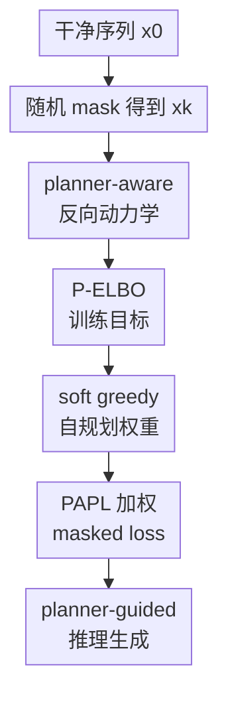

# Planner Aware Path Learning in Diffusion Language Models Training

**会议**: ICLR2026  
**OpenReview**: [https://openreview.net/forum?id=lAlI5FuIf7](https://openreview.net/forum?id=lAlI5FuIf7)  
**代码**: https://github.com/pengzhangzhi/PAPL  
**领域**: 文本生成 / 扩散语言模型  
**关键词**: 扩散语言模型、路径规划、掩码扩散、P-ELBO、代码生成  

## 一句话总结
这篇论文指出掩码扩散语言模型训练时默认的“随机解掩码路径”和推理时实际使用的 planner 路径不一致，并提出 Planner-Aware Path Learning（PAPL），用 planner 置信度重加权 masked diffusion loss，让训练更贴近推理路径，在蛋白序列、文本生成和代码生成上稳定提升质量。

## 研究背景与动机
**领域现状**：离散扩散语言模型，尤其是 Masked Diffusion Language Models（MDLMs），把生成看成从全 mask 序列逐步恢复干净 token 的过程。相比自回归模型必须从左到右生成，MDLM 可以按任意顺序填 token，天然适合文本、代码、蛋白序列这类没有唯一“正确生成顺序”或需要并行生成的离散数据。

**现有痛点**：标准 MDLM 训练时通常随机 mask 一部分 token，然后对所有 masked 位置做均匀加权的交叉熵；这等价于假设推理时每一步也从当前 masked 位置里均匀随机选一个位置解码。但实际生成时，为了提高样本质量，大家很少真的完全随机解码，而是会用 greedy confidence、MaskGIT、P2 self-planning、remasking 等 planner 来决定下一步填哪里。

**核心矛盾**：模型训练时被要求平均处理所有随机路径，可推理时 planner 会偏向某些高置信度、更容易成功的路径。换句话说，训练目标在优化“均匀路径上的 denoiser”，而部署时模型被拿去走“planner 选择的路径”。如果 denoiser 不是完美的，不同解码顺序会产生不同质量，标准 ELBO 就不再准确描述 planner-guided inference 的生成概率。

**本文目标**：作者要回答的问题不是“推理时哪个 planner 更好”，而是“既然推理一定会用 planner，训练目标应该怎样改，才能让 denoiser 学会它真正会走的路径”。这需要先在理论上把 planner 写进扩散语言模型的反向动力学，再从新的 lower bound 推出可训练的近似目标。

**切入角度**：论文把 MDLM 的逐 token 解掩码过程视为一条离散时间 Markov chain，并比较模型 planner-guided reverse dynamics 与一个“知道真实数据的理想 planner reverse dynamics”之间的 path-wise KL。这个角度的好处是，planner 不再只是推理技巧，而是直接进入生成分布和 ELBO 的定义。

**核心 idea**：用 planner 会选择某个 masked 位置的概率来重加权 denoising loss，让模型把更多训练容量放在推理时更可能经过的生成路径上，而不是平均浪费在 planner 基本不会走的随机路径上。

## 方法详解

### 整体框架
PAPL 的整体逻辑可以分成四步：先形式化“带 planner 的反向解掩码过程”，再证明标准 uniform ELBO 对 planner 推理不再匹配，接着推导 planner-aware ELBO（P-ELBO），最后把复杂的理论目标近似成一个几乎只改 loss 权重的训练算法。输入是一条干净序列 $x_0$，训练时随机得到部分 mask 状态 $x_k$，denoiser 对每个 masked 位置预测原 token，planner 根据 denoiser 置信度给每个位置一个权重，最终 loss 对 planner 更可能选择的位置加大监督。

图里真正的贡献节点是 planner-aware 反向动力学、P-ELBO、soft greedy 自规划权重和 PAPL 加权 masked loss。前后两端的干净序列、随机 mask 和推理生成只是训练/采样脚手架；它们帮助读者定位流程，但不是本文单独提出的新模块。

### 关键设计
**1. planner-aware 反向动力学：把“下一步填哪里”写进生成分布**

标准 MDLM 的一步反向转移可以理解为：在当前状态 $x_k$ 中，从 masked 位置里均匀抽一个位置 $i$，然后用 denoiser $D_\theta^i(x_k)$ 采样该位置 token。本文把这个“均匀抽位置”替换成 planner $G_\phi$。planner 先看 denoiser 对所有位置的候选预测 $z \sim D_\theta(x_k)$，再输出选择每个位置的概率，最后只更新被选中的位置。

这样一步转移不再只是 $\mathrm{Cat}(y;D_\theta^i(x_k))/(L-k)$，而变成 token 概率乘上 planner 选择该位置的有效概率：

$$
q_{\theta,\phi}^i(y\mid x_k)=\mathrm{Cat}(y;D_\theta^i(x_k))F_{\theta,\phi}(x_k,y,i).
$$

这里 $F_{\theta,\phi}$ 表示在把第 $i$ 个候选 token 固定为 $y$ 后，planner 最终选择位置 $i$ 的期望概率。这个定义把“模型猜什么 token”和“planner 认为该先填哪个位置”绑在同一个 transition kernel 里，因此后面的 ELBO 才能真正描述 planner-guided sampling。

**2. P-ELBO：把训练目标从均匀路径改成 planner 路径**

论文的理论核心是 Planner-Aware ELBO（P-ELBO）。作者构造一个参考 Markov chain：它从全 mask 出发，每一步也按 planner 选择位置，但被选中位置直接填真实 token $x_0^i$。模型链则按同一个 planner 逻辑选择位置，再用 denoiser 采样 token。二者的 path-wise KL 给出一个 lower bound，于是训练目标可以理解为让模型的 planner 路径接近“知道答案的理想 planner 路径”。

P-ELBO 的第一项很直观：它仍然是预测真实 token 的交叉熵，但每个 masked 位置的权重从均匀的 $1/(L-k)$ 变成 planner 选择该位置的概率 $\mathrm{Cat}(i;G_\phi(x_0,x_k))$。第二项是新出现的 planner correction，刻画“理想 planner 看到真实序列时的选择”和“模型 planner 只能依赖 denoiser 预测时的有效选择”之间的差距。uniform planner 是特例，此时第二项消失，标准 MDLM ELBO 被恢复。

这一步的重要性在于，它解释了为什么普通 masked diffusion loss 在 greedy 或 P2 采样下只是一个经验上可用的 surrogate，而不是严格对应该推理分布的 lower bound。论文还给出反例证明，greedy ancestral sampling 下甚至可能出现 $\log p_\theta^{greedy}(x_0)$ 小于标准 uniform ELBO 的情况，说明 mismatch 不是措辞问题，而是真正的目标错配。

**3. soft greedy 自规划权重：用 denoiser 的置信度近似 planner 监督**

精确优化 greedy planner 的 P-ELBO 代价很高，因为需要沿 greedy 路径模拟多步 denoiser，并处理复杂的 correction 项。PAPL 采用一个更实用的近似：把硬 argmax planner 放松成 softmax planner，让 denoiser 对真实 token 的置信度决定位置权重。若某个 masked 位置当前更容易被模型正确恢复，它在 planner 权重里就更大；温度 $\tau$ 越低，权重越接近 greedy 选择。

这个设计有一个微妙但实用的取舍。planner 权重本身来自 denoiser，因此如果对权重也反传，训练会被复杂的 planner correction 和高方差路径影响牵着走。论文选择 detach planner 权重，只保留 planner-weighted cross entropy。这样理论上来自 P-ELBO，工程上仍然只是普通 masked loss 的加权版本。

**4. PAPL 加权 masked loss：一行改动对齐训练和推理**

最终 PAPL 没有真的在训练时采样 planner 路径，而是继续沿用标准 MDLM 的随机 mask 状态 $x_k$，只把每个 masked 位置的 loss 权重改成 planner-adjusted 形式：

$$
L_{PAPL}(\theta)=-\mathbb{E}_{x_0,k,x_k}\left[\sum_{i:x_k^i=m}\frac{1}{L-k}(1+\alpha w_i)\log \mathrm{Cat}(x_0^i;D_\theta^i(x_k))\right].
$$

其中 $w_i$ 来自 soft greedy planner，$\alpha$ 控制 planner 权重的强度。$\alpha=0$ 时完全退化为标准 MDLM loss；$\alpha>0$ 时，模型会额外强调 planner 更可能选择的位置。这个插值很关键，因为纯 planner-weighted loss 会让训练过早聚焦少数路径，可能引发不稳定；与 uniform loss 混合后，PAPL 既保留标准训练的覆盖面，又把训练信号推向实际推理路径。

### 一个完整示例
假设一条长度为 6 的代码片段当前还有 4 个 masked 位置：函数名、循环边界、返回变量和一个缩进块里的表达式。标准 MDLM 训练会把这 4 个位置等权处理，每个位置权重都是 $1/4$，即使推理时 planner 往往会先填最确定、最能约束后续生成的位置。

PAPL 会先让 denoiser 对这 4 个位置预测真实 token 的概率。假如函数名和返回变量的置信度明显更高，soft greedy planner 可能给出 $w=[0.45,0.15,0.30,0.10]$。在 $\alpha=1$ 时，这些位置的 loss 权重会变成 $\frac{1}{4}(1+w_i)$，函数名和返回变量得到更强监督，循环边界和表达式仍然被训练，但权重较低。

从推理角度看，这相当于训练时提前告诉模型：“你之后会用 confidence-aware planner 先走这些更可靠的 token，所以现在应该更认真地学好这些路径上的 denoising。”模型并没有被要求在所有可能随机顺序上同样强，而是把容量向实际会被 planner 访问的局部条件分布倾斜。

### 损失函数 / 训练策略
PAPL 的训练流程和普通 masked diffusion 基本一致。每次迭代采样干净样本 $x_0$，随机采样时间步 $k$，均匀 mask 出状态 $x_k$；denoiser 前向得到每个 masked 位置的 token 分布；用 soft greedy planner 根据真实 token 置信度计算 $w_i$；最后用 $\frac{1}{L-k}(1+\alpha w_i)$ 加权 masked cross entropy 更新 $\theta$。

论文建议实践中从 $\tau=1$、$\alpha=1$ 开始；如果要调参，可以逐步增大 $\alpha$。蛋白实验中 $\alpha$ 增大到约 5 有明显收益，但继续增大可能让训练不稳定。附录里纯 PAPL loss 的训练曲线波动很大，说明 planner-aware weighting 不能简单替代 uniform loss，更合理的做法是作为标准 loss 的路径偏置项。

## 实验关键数据

### 主实验
论文在三个差异很大的离散生成域上验证 PAPL：蛋白序列生成、OpenWebText 无条件文本生成、代码生成/补全。三个实验共用的关键信息是：PAPL 与 DLM baseline 尽量保持相同模型规模和训练配置，只改变训练目标里的 planner-aware 权重，推理时使用 planner-based decoding（主要是 P2 self-planning）。

| 任务 | 指标 | DLM baseline | DLM + PAPL | 提升 |
|------|------|--------------|------------|------|
| 蛋白序列生成 | Foldability | 42.43% | 59.40% | 约 40% 相对提升 |
| OpenWebText 文本生成, $T=128$ | MAUVE | 0.015 | 0.067 | 约 4.5 倍 |
| OpenWebText 文本生成, $T=128$ | Gen PPL | 61.5 | 24.33 | 显著降低 |
| HumanEval 代码生成 | pass@1 | 18.5 | 20.8 | +2.3 点 |
| HumanEval 代码生成 | pass@10 | 31.1 | 38.4 | +7.3 点 |
| HumanEval-Infill | pass@1 | 30.0 | 32.5 | +2.5 点 |
| SantaCoder-FIM | exact match | 30.7 | 32.3 | +1.6 点 |

蛋白实验中，PAPL-150M 的 pTM 从 0.65 提升到 0.72，pAE 从 12.00 降到 8.97，foldability 从 42.43% 提升到 59.40%，同时 entropy 和 diversity 只小幅下降，说明质量提升不是简单的模式坍缩。文本实验中，PAPL 在 32、64、128 三种 sampling step 下都优于其他 diffusion baselines，尤其在较少步数时仍能降低 Gen PPL。代码实验中，pass@10 的改善比 pass@1 更明显，暗示 PAPL 不只改善最贪心的单个输出，也让候选解集合质量更稳定。

### 消融实验
| 消融 / 分析 | 关键指标 | 说明 |
|-------------|----------|------|
| 纯 PAPL loss, $\tau=1$ | validation loss 收敛不稳定 | 只用 planner 权重会让模型过早聚焦少数高置信路径，训练波动变大 |
| 蛋白任务降低 $\tau$ | foldability 提升 | 更尖锐的 planner 分布能提供更有效的路径监督 |
| 蛋白任务增大 $\alpha$ 到 5 | foldability 持续上升 | planner-aware 权重越强，训练越贴近推理路径，但过大后会伤害稳定性 |
| 文本采样 planner 对比, $T=128$ | P2-Self MAUVE 0.067 | P2-Self 优于 Greedy 0.056 与 Probability Margin 0.051 |
| 代码采样 planner 对比 | P2-Self HumanEval pass@1 20.8 | vanilla ancestral 只有 3.3，说明推理路径选择本身非常关键 |
| 近似 loss 分析 | greedy loss 明显大于 vanilla loss | 支持“uniform loss 不再是 greedy planner 的合适 upper bound”这一理论判断 |

### 关键发现
- PAPL 的收益跨域出现：蛋白、文本、代码的结构差异很大，但共同点都是离散序列生成且推理依赖 planner，说明训练-推理路径 mismatch 是一个通用问题。
- 质量提升没有完全靠牺牲多样性换来：蛋白实验 diversity 从 92.45% 降到 91.73%，文本 entropy 也只小幅下降，主要收益来自更合理的生成路径。
- planner 选择和训练目标需要一起考虑：代码消融里 P2-Self 明显优于 vanilla ancestral 和 greedy ancestral，说明只改训练不够，训练目标最好和最终采样 planner 彼此匹配。
- PAPL 的稳定性来自插值项：如果完全丢掉 uniform loss，模型会被自身早期置信度误导；保留 $1/(L-k)$ 基础权重能防止训练只围绕少数路径收缩。

## 亮点与洞察
- 这篇论文最有价值的地方是把“planner 只是推理 trick”提升为“planner 改变了生成分布”。一旦从 path-wise KL 看问题，训练目标和采样路径不一致就变成数学对象，而不是经验调参里的模糊直觉。
- P-ELBO 给现有很多采样策略提供了统一语言。uniform、greedy、soft greedy、P2-style remasking 都可以被看成不同 planner 下的反向 Markov dynamics，这让后续方法可以先问“我的 sampler 对应什么训练 objective”，再设计 loss。
- PAPL 的工程落点很克制。它没有引入额外 teacher、没有训练单独 planner，也不要求每步模拟完整 planner trajectory，而是把理论目标压缩成 loss 权重的一行修改，这种设计很容易被现有 MDLM 训练管线吸收。
- 论文的实验选择有启发性。蛋白序列说明 planner-aware path 对结构约束有帮助，文本说明它能改善开放式分布质量，代码说明它对强逻辑约束任务也有效；三个任务合起来比只在一个文本 benchmark 上报分更有说服力。
- 对其他任务的迁移思路很直接：只要任务中的 diffusion model 推理时依赖 confidence、margin、block denoising、remasking 或外部策略选择 token 顺序，就可以考虑把该 planner 的选择概率反映到训练 loss 中。

## 局限与展望
- PAPL 默认 planner 权重来自 denoiser 自身置信度。早期训练时 denoiser 还不可靠，置信度可能并不代表真正好的生成路径，因此需要 uniform loss 插值来兜底；这也意味着 planner-aware training 的收益依赖模型已经具备一定基础能力。
- 论文的最终实用算法主要针对 soft greedy / confidence-based planner。虽然理论框架可以扩展到 P2、RDM、top-k block denoising 和 confidence thresholding，但对复杂 remasking planner 推导出同样便宜的训练目标仍然困难。
- 大模型成本仍是现实限制。作者也指出，若要验证某个 decoding strategy 是否能通过 planner-aware loss 进一步提升，通常需要额外 post-training；对 7B 以上模型，这比只在推理时换 sampler 昂贵得多。
- 实验中 diffusion 文本模型虽然相对提升明显，但绝对质量仍落后 autoregressive baseline。PAPL 缩小了差距，却没有证明 DLM 在通用文本生成上已经能全面替代 AR 模型。
- 未来可以探索外部 planner 或 learned planner，而不是只用 denoiser self-confidence。特别是在代码和推理任务中，planner 若能结合语法检查、单元测试反馈或约束满足信号，可能比单纯 token 置信度更接近“真正应该先填的位置”。

## 相关工作与启发
- **vs 标准 MDLM / SEDD 类 masked diffusion**: 标准方法训练时按 uniform masking objective 优化 denoiser，推理时再接各种 confidence-based sampler。本文指出这会造成目标错配，并用 PAPL 让 loss 显式偏向 planner 会访问的路径。
- **vs MaskGIT / greedy decoding**: MaskGIT 式方法根据置信度优先填 token，是有效的推理启发式；本文进一步说明 greedy planner 对应的生成分布不再由 vanilla ELBO 描述，因此应该用 planner-aware objective 配套训练。
- **vs P2 path planning**: P2 关注推理时如何选择更好的 denoising path，包括 self-planning 和 remasking；PAPL 关注训练时怎样预先适配这种 path planning。二者关系更像上下游：P2 给出推理路径，PAPL 让 denoiser 在训练时更熟悉这些路径。
- **vs any-order autoregressive models**: AOARM 也关心生成顺序，但很多学习顺序的方法要处理高方差的顺序搜索或策略梯度。PAPL 借助 masked diffusion 的 loss 结构，用位置加权近似路径学习，工程代价更低。
- **对后续研究的启发**: 如果一个离散生成模型的采样器会系统性避开某些状态，那么训练时平均覆盖这些状态未必最优。更一般地，离散生成的训练目标应该从“对所有可能路径公平”转向“对实际推理分布负责”。

## 评分
- 新颖性: ⭐⭐⭐⭐☆ 从 planner-aware ELBO 重新审视 DLM 训练-推理错配，理论视角清晰，PAPL 作为工程近似也很自然。
- 实验充分度: ⭐⭐⭐⭐☆ 覆盖蛋白、文本、代码和多个采样/超参消融，证据较全面；但更大规模通用语言模型上的成本与收益还需要进一步验证。
- 写作质量: ⭐⭐⭐⭐☆ 主线从 mismatch 到 P-ELBO 再到 PAPL 比较顺，公式推导完整；部分附录推导较重，读者需要熟悉 Markov chain / ELBO 才能完全跟上。
- 价值: ⭐⭐⭐⭐⭐ 对扩散语言模型训练很有实际参考价值，尤其适合已有 MDLM 管线想利用 planner sampling 但不想大改架构的场景。

<!-- RELATED:START -->

## 相关论文

- [\[ICLR 2026\] Antislop: A Comprehensive Framework for Identifying and Eliminating Repetitive Patterns in Language Models](antislop_a_comprehensive_framework_for_identifying_and_eliminating_repetitive_pa.md)
- [\[ICLR 2026\] Unveiling the Potential of Diffusion Large Language Model in Controllable Generation](unveiling_the_potential_of_diffusion_large_language_model_in_controllable_genera.md)
- [\[ICLR 2026\] FS-DFM: Fast and Accurate Long Text Generation with Few-Step Diffusion Language Model](fs-dfm_fast_and_accurate_long_text_generation_with_few-step_diffusion_language_m.md)
- [\[ICML 2025\] Understanding and Mitigating Memorization in Diffusion Models for Tabular Data](../../ICML2025/nlp_generation/understanding_and_mitigating_memorization_in_diffusion_models_for_tabular_data.md)
- [\[ACL 2026\] Investigating the Representation of Backchannels and Fillers in Fine-tuned Language Models](../../ACL2026/nlp_generation/investigating_the_representation_of_backchannels_and_fillers_in_fine-tuned_langu.md)

<!-- RELATED:END -->
