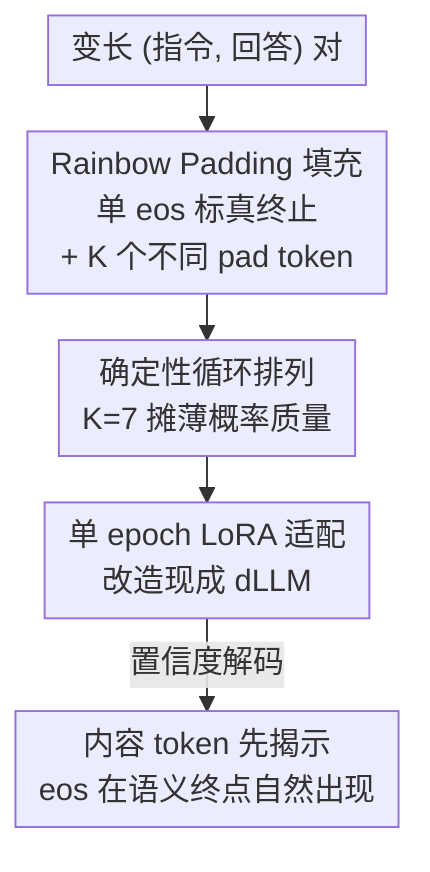

# Rainbow Padding: Mitigating Early Termination in Instruction-Tuned Diffusion LLMs

**会议**: ICLR 2026  
**OpenReview**: [https://openreview.net/forum?id=cznTlh7Msz](https://openreview.net/forum?id=cznTlh7Msz)  
**代码**: https://ai-isl.github.io/rainbow-padding  
**领域**: 文本生成 / 扩散语言模型  
**关键词**: 扩散 LLM, 早停, eos 填充, 循环填充, instruction-tuning

## 一句话总结
本文发现 instruction-tuned 扩散语言模型存在「`<eos>` overflow」早停顽疾——分配的生成长度越长、回答反而越短甚至塌缩成一串 `<eos>`；根因是 `<eos>` 同时被当作终止符和填充符，于是作者提出 Rainbow Padding：只保留一个 `<eos>` 标记真正结束、其余填充位用 K 个不同 padding token 循环铺满，仅靠 7 个 token + 单 epoch LoRA 就能恢复长度鲁棒性，把 LLaDA 在 MATH 上的准确率从 0.6% 拉到 32.6%。

## 研究背景与动机
**领域现状**：离散扩散语言模型（dLLM，如 LLaDA、Dream）被视作自回归 LLM 的有力替代——它不强制从左到右生成，而是通过去噪式的任意顺序解码（any-order decoding）维持全局一致性，在多步推理和规划任务上展现出优势。但与自回归模型不同，dLLM 必须**预先指定一个固定的生成长度 `max_length`**，把整条定长序列一次性输入、每一步对所有位置做预测。

**现有痛点**：作者观察到一个反直觉的现象——给 dLLM 分配越长的 `max_length`，生成的回答反而越短。如图所示，LLaDA 在 MATH 上的准确率从 `max_length=128` 时的 17.1% 一路跌到 `max_length=1024` 时的 0.9%，平均回答长度从 119.9 个 token 萎缩到 1.4 个 token；极端情况下模型几乎不输出内容，整条序列退化成重复的 `<eos>`。作者把这一失效模式命名为 **`<eos>` overflow**。它的危害很实在：哪怕在 512/1024 这种现代标准下并不算长的预算上，推理和代码任务的表现就已经崩坏，直接动摇了 dLLM 在真实指令跟随场景里的可用性。

**核心矛盾**：根因在于 instruction-tuning 流程里 `<eos>` 身兼二职——既是「这句回答到此为止」的合法终止标记，又被拿来当作填充变长序列的 padding。这种混用带来两个后果：其一，模型无法分辨某个 `<eos>` 到底是真正的停止点还是填充，削弱了它学习正确终止的能力；其二，由于训练 batch 里回答长短不一、靠后位置被 `<eos>` 填满的比例越来越高，masked 交叉熵训练让模型的预测对齐经验词频，于是 $\Pr[x_i=\texttt{<eos>}]\to 1$（当位置 $i$ 接近 `max_length` 时），尾部位置的 `<eos>` 先验被训练得畸高。

**本文目标 + 切入角度**：作者要从根上消除 `<eos>` overflow，而不是像前人那样靠手动压低 `<eos>` 置信度（容易过冲、反复重解同一题）或强行 block-wise 半自回归解码（牺牲任意顺序优势、还引入敏感的 block 数超参）这类启发式补丁。切入观察是：既然问题出在「终止」和「填充」共用同一个符号、且单一符号上概率质量过度集中，那就把这两件事拆开、并把填充的概率质量摊薄。

**核心 idea**：保留单个 `<eos>` 专职标记真正结束，把剩余填充位换成一组不同 padding token 的**确定性循环**，既给 `<eos>` 解绑、又防止任何单个填充符独占高置信度。

## 方法详解

### 整体框架
Rainbow Padding 本质上只改了 instruction-tuning 时的填充方案，但要把「为什么这么改」讲透需要三步：先诊断清楚 `<eos>` overflow 是怎么级联发生的，再用「单 `<eos>` + K 个循环填充 token」替换原来一串 `<eos>` 的尾部填充，最后说明为什么循环优于随机、K 取 7 即够，以及如何用极轻量的 LoRA 把现成模型改造过来。改造后的效果是：填充 token 的置信度被压到很低，置信度解码会**先揭示有内容的 token、把填充尾留到最后**，于是 `<eos>` 在内容自然写完的语义终点才出现，而不是在生成尚未开始时就被高概率提前采样。

### 关键设计

**1. 诊断 `<eos>` overflow：终止与填充共用一个符号导致的反向级联**

这是本文的第一项贡献——把一个「实践中被注意到却从未被系统分析」的失效模式定义清楚并量化。作者指出，问题不在解码本身而在 instruction-tuning 的填充约定：`<eos>` 既当终止符又当 padding，使它在靠后位置被严重过曝。在 masked 交叉熵下模型预测对齐经验频率 $\mathbb{E}[p_\theta(x_i=\texttt{<eos>}\mid x_{\overline{M}})]\approx\Pr[x_i=\texttt{<eos>}]$，而尾部该频率趋于 1，于是尾部 `<eos>` 的置信度在生成开始前就接近 1.0。更糟的是这种偏置会被自适应解码放大：一旦某个尾部位置因高概率被采成 `<eos>`，更靠前的位置也会被带偏，作者用条件概率 $p_\theta(x_i=\texttt{<eos>}\mid x_{i+k}=\texttt{<eos>})$ 量化这一现象——哪怕 $k$ 只往后 10 个 token，这个条件概率也会陡升。终止概率就这样从尾部**反向级联**回传，最终把整条回答压塌。实测里 `max_length` 越大，前 50% 解码步内被揭示成 `<eos>` 的比例越高（从 0.081 升到 1.000），这正是「预算越大、内容越少」的微观机制。

**2. Rainbow Padding：解绑终止符 + 把填充概率质量摊到 K 个 token 上**

针对上面的根因，作者只动填充方案：回答的真正结尾仅用一个 `<eos>` 标记，其余所有填充位用一组 $K$ 个专用 padding token $\mathcal{P}=\{\texttt{<pad0>},\texttt{<pad1>},\dots,\texttt{<pad}_{K-1}\texttt{>}\}$ **循环铺满**。值得强调的是，仅仅把尾部一串 `<eos>` 换成单一 `<pad>` 是不够的——那只是把概率质量从 `<eos>` 搬到了 `<pad>` 上，同样会重新引发 overflow。Rainbow Padding 的两个效果缺一不可：一是**解绑**，`<eos>` 只在真实终止事件出现，先验不再被填充污染，从而恢复成一个干净的停止信号；二是**摊薄**，填充区被 $K$ 个 token 均分，每个 `<pad_k>` 都规律但稀疏地出现，模型把它们学成低概率占位符而非高置信度猜测。两者叠加，置信度解码下内容 token 相对概率更高、被更早揭示，模型先把有意义的内容立起来、给后续推理提供连贯上下文，`<eos>` 自然落在内容的收尾处。

**3. 为什么是确定性循环、K 为什么取 7**

一个自然的替代是从均匀分布里**随机**采样每个填充 token 来摊薄概率，但作者发现这会制造一个困难的随机预测任务，把模型容量从「跟随指令」上分走，实验中模型根本学不会合理的填充摆放。相比之下，确定性循环是一个**极易学习**的模式：填充区的训练 loss 在不到 5% 的 epoch 内就掉到接近零，模型几乎不费力就掌握了循环规律，从而把容量留给指令-回答的学习。关于 $K$，核心判据是「每个填充 token 的期望概率 $\approx 1/K$ 要低于内容 token 的置信度」，这样填充才不会在早期被抢先揭示。作者检查前 20 个解码步里最低置信度的内容 token 发现：$K\ge 7$ 时 $1/K$ 明显落在内容置信度之下，$K=3$ 时则会与内容置信度重叠（因此不足以消除早停）；而 $K$ 超过 7 后收益迅速饱和（20 个 token 相比 7 个无明显增益）。所以 7 是「有效性 vs 学习成本」的甜点。

**4. 单 epoch LoRA 轻量适配现成 instruction-tuned 模型**

由于循环填充极易学，Rainbow Padding 不必从头 instruction-tuning，而能直接改造已经用 `<eos>` padding 训过的现成模型。作者用 LoRA 在 0.5M 数据上只跑**一个 epoch**，约两张 H200 上 6 GPU-hours，就把 LLaDA、Dream 的早停问题基本消除——相比原始 instruction-tuning 用 4.5M（LLaDA）/1.8M（Dream）样本训 3 个 epoch，这点开销几乎可忽略。这一设计让方法从「需要重训」变成「即插即用的补丁」，是它「实用」主张的关键支撑。

## 实验关键数据

### 主实验
在 LLaDA-Base / Dream-Base 上做监督微调，仅填充方案不同；评测分两类：`max_length` 鲁棒性（MATH-500、GSM8K、HumanEval）与泛化（MMLU、HellaSwag）。`res length` 指首个 `<eos>` 之前的有效回答长度。

| 模型 / 任务 (max_length=1024) | 指标 | `<eos>` Padding | Rainbow Padding | 提升 |
|--------|------|------|------|------|
| LLaDA-Base · MATH (#Blocks=1) | Acc. | 0.6 | 32.6 | +32.0 |
| LLaDA-Base · GSM8K (#Blocks=1) | Acc. | 13.2 | 75.5 | +62.3 |
| LLaDA-Base · HumanEval (#Blocks=1) | Acc. | 20.7 | 40.2 | +19.5 |
| LLaDA-Base · MATH | res length | 0.98 | 282.1 | 恢复长度 |
| Dream-Base · MATH | Acc. | 0.0 | 34.3 | +34.3 |
| Dream-Base · GSM8K | Acc. | 9.1 | 77.3 | +68.2 |

标准解码（#Blocks=1）下 Rainbow Padding 全面碾压 `<eos>` padding。`<eos>` padding 只有把 block 数堆到 16 才勉强追上（MATH 29.8%），但 block 数一降就崩（#Blocks=4 时仅 1.4%），暴露了半自回归启发式的脆弱；而 Rainbow Padding 跨 block 数稳定（32.6/32.8/32.8），说明填充校准对了之后 block-wise 这套补丁就没必要了。MMLU/HellaSwag 上两者持平，说明学循环模式几乎不带来副作用。

### LoRA 适配 + 填充 token 数消融

| 配置 | MATH Acc. | GSM8K Acc. | 说明 |
|------|---------|---------|------|
| LLaDA Vanilla | 0.1 | 3.0 | 现成模型早停严重 |
| LLaDA +Rainbow (1 epoch LoRA) | 28.6 | 73.8 | 单 epoch 适配即恢复 |
| Dream Vanilla | 0.0 | 60.6 | — |
| Dream +Rainbow (1 epoch LoRA) | 32.4 | 77.3 | 同样大幅提升 |
| K=1 (单 pad) | 21.9 | 15.9 | 概率质量仍集中，不足 |
| K=3 | 33.3 | 58.3 | 仍未完全消除早停 |
| K=7 | 34.3 | 79.6 | 甜点 |
| K=20 | 36.2 | 76.5 | 收益饱和 |

### 关键发现
- **K=7 是分水岭**：少于 7 个填充 token（尤其 1–3 个）无法把 $1/K$ 压到内容置信度之下，GSM8K 等任务明显掉点；超过 7 个收益饱和，且学习负担增大却无回报，故 7 个 token 性价比最高。
- **对解码策略普适**：在 margin-based、entropy-based、confidence-based 三种自适应解码下表现都稳定，因为循环填充本身就压低了所有填充 token 的概率，自然制造低 margin / 高 entropy，使填充位不易被早揭示。
- **学习成本极低**：填充区 loss 在 5% epoch 内归零，是「单 epoch LoRA 就够」的直接证据。

## 亮点与洞察
- **把一个民间已知但没人讲清的 bug 上升为可测量的失效模式**：`<eos>` overflow 不仅被定义，还在 task 级和 token 级两个粒度上被量化（条件概率级联、前 50% 步的 `<eos>` 比例），诊断本身就是贡献，值得借鉴这种「先把现象量化成可观测信号」的写法。
- **最小改动解决根因**：不改架构、不改数据、不加解码超参，只把尾部填充从「一串 `<eos>`」换成「单 `<eos>` + 循环 K-pad」，就把问题当作模型固有属性消除掉——简单到可以成为 dLLM instruction-tuning 的默认实践。
- **「确定性 vs 随机」的取舍很有启发**：随机填充虽然也摊薄概率，却把模型容量浪费在学随机模式上；确定性循环既摊薄又易学，这种「用结构性而非随机性来摊薄分布」的思路可迁移到其他需要分散概率质量、又不想增加学习负担的场景。

## 局限与展望
- 方法专门针对 dLLM 的 `<eos>`/padding 混用问题，对自回归模型不适用（AR 本就把 padding 排除在训练目标外）；适用面是「定长解码 + 填充」的扩散范式。
- 主要在 LLaDA、Dream 两个开源 dLLM 上验证，更大规模或不同架构（如非 Transformer encoder 的 dLLM）上的效果尚待确认。
- $K=7$ 的甜点依赖「$1/K$ 低于内容置信度」这一判据，若任务的内容 token 置信度分布很不同（如某些极低熵任务），最优 $K$ 可能需要重新校准。
- 循环填充提供的是一个「弱的长度结构信号」，论文未深入探讨它是否会在极端长度外推（远超训练见过的 `max_length`）时仍然稳健。

## 相关工作与启发
- **vs 手动压低 `<eos>` 置信度（Zhu et al., 2025）**：他们在解码时直接抑制 `<eos>` 概率，能拿到小幅提升，但容易让模型越过真实回答长度、反复重解同一题导致质量下降；本文从训练侧解绑终止与填充，是根治而非临时压制。
- **vs 半自回归 block-wise 解码（LLaDA 原生）**：把序列分块、后块等前块生成完再解，能避免尾部过早 `<eos>`，但牺牲了 dLLM 任意顺序、双向上下文的核心优势，还引入敏感的 block 数超参（不同 benchmark 取值无原则、性能波动大）；Rainbow Padding 在标准解码下就稳定，跨 block 数不敏感，让 block-wise 这套补丁变得多余。
- **vs 单一 `<pad>` 替换**：仅把 `<eos>` 换成单个 `<pad>` 看似解绑了终止符，却把概率质量原样搬到 `<pad>` 上、重新触发 overflow；本文用「循环多 pad」同时解决解绑与摊薄两件事。

## 评分
- 新颖性: ⭐⭐⭐⭐ 把一个被忽视的失效模式系统化，并给出一个极简却切中根因的修法
- 实验充分度: ⭐⭐⭐⭐ 两模型、多任务、跨 block 数 / 解码策略 / K 值的完整消融，机制分析（置信度、解码顺序、loss 收敛）扎实
- 写作质量: ⭐⭐⭐⭐⭐ 现象—根因—方法—验证的链条清晰，诊断与直觉讲得很透
- 价值: ⭐⭐⭐⭐⭐ 即插即用、单 epoch LoRA 即可部署，有望成为 dLLM instruction-tuning 的标准实践

<!-- RELATED:START -->

## 相关论文

- [\[ICML 2025\] Understanding and Mitigating Memorization in Diffusion Models for Tabular Data](../../ICML2025/nlp_generation/understanding_and_mitigating_memorization_in_diffusion_models_for_tabular_data.md)
- [\[ICLR 2026\] Rethinking Uncertainty Estimation in LLMs: A Principled Single-Sequence Measure](rethinking_uncertainty_estimation_in_llms_a_principled_single-sequence_measure.md)
- [\[ICLR 2026\] Unveiling the Potential of Diffusion Large Language Model in Controllable Generation](unveiling_the_potential_of_diffusion_large_language_model_in_controllable_genera.md)
- [\[ICLR 2026\] FS-DFM: Fast and Accurate Long Text Generation with Few-Step Diffusion Language Model](fs-dfm_fast_and_accurate_long_text_generation_with_few-step_diffusion_language_m.md)
- [\[ACL 2026\] Investigating the Representation of Backchannels and Fillers in Fine-tuned Language Models](../../ACL2026/nlp_generation/investigating_the_representation_of_backchannels_and_fillers_in_fine-tuned_langu.md)

<!-- RELATED:END -->
