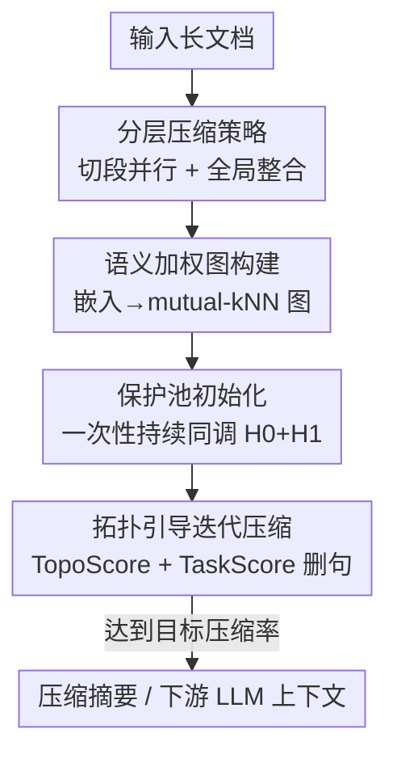

# Text Summarization via Global Structure Awareness

**会议**: ICLR 2026  
**OpenReview**: [https://openreview.net/forum?id=uNaXiGL5uo](https://openreview.net/forum?id=uNaXiGL5uo)  
**代码**: 无  
**领域**: 文本生成 / 文本摘要  
**关键词**: 文本摘要, 拓扑数据分析, 持续同调, 长文档压缩, 无监督抽取

## 一句话总结
GloSA-sum 首次把拓扑数据分析（TDA）引入文本摘要：用持续同调一次性算出文档的语义骨架与逻辑环路存进"保护池"，再用轻量代理指标迭代删句，在不丢核心逻辑链的前提下做到压缩既快又准，并能给下游 LLM 任务缩短上下文。

## 研究背景与动机
**领域现状**：长文档摘要主流有三条路线。一是基于句间相似度图的无监督抽取（TextRank、LexRank），把文档建成句子相似度图后用中心性排序选句；二是模型改进派（BERTSum、MatchSum、MemSum、BART、PEGASUS、BigBird），靠更强的编码器/解码器提升表示力；三是直接调用 LLM 做摘要。

**现有痛点**：图排序类方法只看局部相似度或浅层统计特征，抓不住全局篇章结构和跨段落的长程逻辑依赖；模型改进派在超长文档上面临 $O(N^2)$ 注意力的可扩展性瓶颈，生成式模型还有自回归解码的额外开销，比 TextRank 慢 10–20×；LLM 路线效果好但推理成本高得离谱，大规模长文场景用不起。

**核心矛盾**：现有方法普遍**只在句子层面做局部判断，缺少对文档整体拓扑结构的显式建模**——于是摘要时容易把支撑论证的关键逻辑链一并删掉，破坏连贯性，进而拖累下游任务。准确率与效率之间始终在做取舍。

**本文目标**：在不显著增加资源消耗的前提下保住摘要质量，具体拆成三件事：(1) 显式刻画并保留语义簇与跨段落逻辑依赖；(2) 避免重复的高成本结构计算；(3) 让方法能扩展到超长文档。

**切入角度**：作者观察到 TDA 提供了一个"全局视角"——把句子嵌入看成高维空间里的点云，用持续同调（persistent homology）追踪拓扑特征随观测尺度的"生—死"过程，存活长的是稳健结构、转瞬即逝的是噪声。其中零维同调 $H_0$ 对应连通分量（文档的核心主题簇），一维同调 $H_1$ 对应环路（跨段落的逻辑回环）。

**核心 idea**：用一次性持续同调分析抽出语义+逻辑骨架冻结成"保护池"，之后只用轻量代理指标迭代删句，从而用拓扑结构指导压缩、兼顾保真与效率。

## 方法详解

### 整体框架
GloSA-sum 是一个全局结构感知的摘要框架。输入是一篇（可能超长的）文档，输出是保留语义内核与逻辑链的压缩摘要。整条流水线可以理解为"先用 TDA 把不能删的骨架圈出来，再围着骨架贪心删句"：先把每句编码成嵌入、构造一张融合语义与位置的加权无向图；在这张图对应的点云上**只算一次**持续同调，挑出最持久的 $H_0$ 簇和 $H_1$ 环路存进保护池 $P$ 当作永久骨架；之后的迭代压缩不再碰 TDA，改用结合拓扑连通性与任务相关性的代理打分逐句删除最不重要的句子，直到达到目标压缩率；面对超长文本时再套一层分层策略——先切段并行做局部摘要，再拼接做一次全局压缩去除跨段冗余。

### 关键设计

**1. 语义加权图构建：让图同时编码语义邻近与篇章顺序**

为了能跑 TDA，先得把文档变成适合拓扑分析的结构。每句用预训练句编码器（默认 all-mpnet-base-v2）编码成嵌入 $e_i$ 并归一化，然后建一张加权无向图 $G=(V,E)$，节点是句子。建边用 **mutual k-近邻**策略且邻域大小自适应：$k$ 随文档长度对数增长，短文不会被过度连边、长文又能保留足够连通性，只有当 $s_i$、$s_j$ 互相落在对方邻域时才连边。每条边赋一个混合权重

$$w_{ij} = \alpha \cdot d^{\text{sem}}_{ij} + (1-\alpha)\cdot \exp\!\left(-\frac{|i-j|}{\tau}\right)$$

其中 $d^{\text{sem}}_{ij}=1-\cos(e_i,e_j)$ 是语义距离，$|i-j|$ 是两句在原文中的位置距离，$\alpha$ 调语义与顺序的比例、$\tau$ 控位置衰减的灵敏度。这样设计的用意是：纯语义图会丢掉论证的先后顺序，纯位置图又抓不到跨段呼应；混合权重让相邻句子影响更强的同时保留全局语义关系，兼顾论证连续性。注意语义距离 $d^{\text{sem}}_{ij}$ 还会被单独留作后续 TDA 的主度量。

**2. 保护池初始化：一次性持续同调冻结语义+逻辑骨架**

这是全文最核心的设计，直接对应"避免重复高成本计算"的痛点。和以往迭代式图摘要每轮都要重算结构不同，GloSA-sum **只在开头算一次**持续同调，把全局结构永久固定。具体在点云 $e_1,\dots,e_n$ 上算同调，为提速用带固定比例 landmark 的 Lazy Witness Complex 近似单纯复形，计算到一维，得到对应 $H_0$、$H_1$ 的持续图 $D(0)$、$D(1)$。每个拓扑特征（连通分量或环）用持续长度 $\ell = d - b$ 量化（$b$、$d$ 是它在过滤过程中诞生与消亡的尺度）。保护池 $P=P_{H_0}\cup P_{H_1}$ 由两部分组成：从 $H_0$ 取持续最久的 top-$K$ 个连通分量、收集其 landmark 对应句子进 $P_{H_0}$（保住核心主题簇）；从 $H_1$ 取最持久的 top-$M$ 个环、聚合参与这些环的句子进 $P_{H_1}$（保住跨段逻辑依赖）。这样一次分析就把"哪些句子绝对不能删"钉死，后续迭代不必再碰昂贵的同调计算，可扩展性随之解决。

**3. 拓扑引导迭代压缩：用轻量代理分逼近拓扑重要性**

骨架已被保护池锁定，剩下的压缩就不需要再算 TDA，而是对保护池外的每句 $s_i\in S\setminus P$ 算一个删除优先级综合分，分低的先删：

$$\text{Score}(s_i)=\lambda\cdot\text{TopoScore}(s_i)+(1-\lambda)\cdot\text{TaskScore}(s_i)$$

**TopoScore** 衡量句子相对骨架的结构重要性：在稀疏图 $G$ 上用 Dijkstra 算 $s_i$ 到每个受保护节点 $s_j\in P$ 的最短路 $\text{SPL}(s_i,s_j)$，取 $\text{TopoScore}(s_i)=-\sum_{s_j\in P}\text{SPL}(s_i,s_j)$。因为有负号，值越接近 0 表示与骨架连通越强（越重要），越负表示越边缘；与任何受保护节点都不连通的句子（$\text{SPL}=\infty$）直接给一个很大的负惩罚，让语义孤立的句子最早被删。平局时以原句序号为次准则、优先保留靠后的句子，避免无谓偏好导语段。**TaskScore** 在有下游查询 $q$ 时引入，把压缩偏向与查询相关的句子：$\text{TaskScore}(s_i)=\beta\cdot\cos(e_i,e_q)+(1-\beta)\cdot\text{BM25}(s_i,q)$，用语义相似度配合 BM25 词面匹配。每轮删掉分最低的句子并同步从图中移除该节点及其边，重复到达目标压缩率。每轮成本约 $O(Me\log n)$，远低于反复算同调。

**4. 分层压缩策略：先分段并行、再全局精修保跨段一致**

为进一步扩展到超长文档同时兼顾局部与全局结构，作者加了一层分层策略。先用 NLTK 的 `sent_tokenize` 切句（刻意停在句子粒度而非更细的子句，否则节点数暴涨、同调计算负担骤增），再把文档 $D$ 按章节等自然边界或定长切成 $T$ 段 $\{C_1,\dots,C_T\}$。每段**独立并行**地跑前述 3.3–3.5 流程得到局部压缩段 $\{C'_1,\dots,C'_T\}$，并行化大幅降低成本；随后按原序拼成中间摘要 $D'$ 保留全局篇章流，再对 $D'$ 做一次全局压缩去除跨段冗余、强化文档级连贯。这种"段内保真 + 段间逻辑"的两级设计让模型在极端压缩率下仍能保住准确率，且消融显示它对短文档几乎无副作用、对长文档则不可或缺（去掉后 GovReport 上直接跑不动）。

## 实验关键数据

### 主实验
在 CNN/DM、GovReport、ArXiv、PubMed 等长文数据集上用 ROUGE 评测，与 TextRank、Lead-3、BERTSum、MatchSum、MemSum、BART、PEGASUS、BigBird、DANCER 等 10 个基线对比。

| 数据集 | 指标 | GloSA-sum | 强基线对照 | 提升 |
|--------|------|-----------|------------|------|
| ArXiv | ROUGE-L | 42.0 | BART 39.86 | +2.14 |
| ArXiv | ROUGE-1 | 47.5 | PEGASUS 43.27 | +4.23 |
| PubMed | ROUGE-L | 44.5 | MemSum 44.33 / BigBird 42.33 | +0.17 / +2.17 |
| GovReport | ROUGE-2 | 26.0 | BigBird 24.81 | +1.19 |
| PubMed | ROUGE-1 | 49.5 | BERTSum 49.10 | +0.40 |

效率上（Table 2/3，$N$=输入长度、$M$=迭代次数）：GloSA-sum 一次性建保护池为 $O(n\log n)$，每轮迭代约 $O(Me\log n)$，支持段内/段间并行、近线性扩展，实测仅比 TextRank 慢 6–8×——明显快于 BART/PEGASUS 的 10–20× 和 BigBird/DANCER 的 7–12×。人工评测（1–5 分）GloSA-sum 在连贯性 4.4 / 信息量 4.3 / 简洁性 4.2、均分 4.30，居所有方法之首。配对 bootstrap 显著性检验（1000 次重采样、对比最强基线 DANCER）所有数据集 p<0.01。

### 消融实验

| 配置（GovReport） | ROUGE-1 | ROUGE-2 | ROUGE-L | 说明 |
|------|---------|---------|---------|------|
| GloSA-sum（完整） | 55.5 | 26.0 | 51.0 | 完整模型 |
| w/o 保护池 | 50.2 | 22.1 | 45.8 | 掉 >5 分，骨架最关键 |
| w/o TopoScore（随机删） | 52.4 | 23.3 | 47.0 | 掉约 3 分 |
| 仅 H0（去掉 H1 环） | 54.1 | 24.8 | 49.8 | H1 主要补 ROUGE-L |
| Louvain 社区替代 TDA | 52.9 | 24.1 | 48.3 | 普通图聚类明显更差 |
| w/o 分层 | – | – | – | 长文直接跑不动 |

短文档（CNN/DM）上分层与非分层仅差 <0.2 ROUGE（41.1 vs 40.9），说明分层对短文无害、对长文必需。

### 关键发现
- **保护池贡献最大**：去掉后 ROUGE 掉超过 5 分，证实 TDA 抽出的骨架是保住全局结构的根本。
- **H1 环路确有独立价值**：只用 H0 簇会在 ROUGE-L 上掉点，说明一维持续结构捕获的是简单主题聚类之外的跨段逻辑依赖。
- **TDA 优于普通图聚类**：用 Louvain 社区检测替换持续同调后明显变差，多尺度拓扑持续性提供了比常规聚类更可靠的结构信号。
- **保护池≠位置启发式**：附录分析显示受保护句的位置分布并不像 Lead-3 那样集中在开头，TDA 作用在高维语义几何而非表面位置线索。

## 亮点与洞察
- **把"一次性算结构 + 代理分迭代"拆开**：最贵的持续同调只算一次冻结成骨架，把可扩展性瓶颈一刀切掉，这种"先重后轻"的解耦思路可迁移到任何"每轮都要重算全局结构"的迭代式算法。
- **$H_0$/$H_1$ 的语言学解读很巧**：把连通分量映射成主题簇、把环路映射成跨段逻辑回环，给抽象拓扑量了一个能直接服务摘要的语义含义。
- **TopoScore 用到保护池的最短路总和**作结构重要性代理，既省（稀疏图上 Dijkstra 快）又自然地把"离骨架近=重要"量化出来，对孤立句给大负惩罚的处理也干净。
- **下游 LLM 受益**：摘要不仅自身指标好，还能给 LLM 缩短上下文、保留推理链，把摘要当成长上下文的"无损压缩"前置模块用。

## 局限与展望
- **依赖句编码器质量**：作者刻意选轻量的 all-mpnet-base-v2 以隔离 TDA 的贡献，但这也意味着默认配置的语义图质量受限；换更强的 text-embedding-3 系列才能探到性能上限（附录 A.9）。
- **抽取式而非生成式**：方法本质是删句保留原文，无法像 BART/PEGASUS 那样改写润色，简洁性虽好但仍受原文句子表述限制。
- **超参数较多**：$\alpha$、$\tau$、$\lambda$、$\beta$、$K$、$M$、landmark 比例等都需调，论文主体未给出系统的敏感性分析（留在 Q6/附录），实际迁移到新域时调参成本不小。
- **TaskScore 仅查询可用时启用**：无查询的通用摘要退化为纯拓扑驱动，是否会偏向结构性强但信息量一般的句子值得进一步验证。

## 相关工作与启发
- **vs TextRank / LexRank**：它们把文档建成句子相似度图后用中心性排序，只看局部相似度；GloSA-sum 在同样的图上做多尺度持续同调，显式建模全局拓扑骨架与跨段环路，抓的是局部相似度看不到的长程依赖。
- **vs MemSum**：MemSum 用记忆网络迭代追踪已选内容减冗余、但选择过程是强化学习式的序列决策、并行性差；GloSA-sum 的迭代删句基于轻量代理分、段内段间都可并行，效率更优（6–8× vs MemSum 的串行瓶颈）。
- **vs BigBird / DANCER**：长文优化模型靠稀疏注意力或分段把编码复杂度压到近线性，但在细粒度依赖上吃力；GloSA-sum 在 GovReport ROUGE-2 +1.19、PubMed ROUGE-L +2.17，显示拓扑骨架对细粒度逻辑的保留更好。
- **vs NLP 中已有 TDA 工作**：以往把持续同调用于矛盾检测、可接受性判断、篇章连贯性分析等解释/分类任务；本文首次把 TDA 系统性地搬进大规模文本压缩与摘要框架，填补了这一空白。

## 评分
- 新颖性: ⭐⭐⭐⭐⭐ 首次把拓扑数据分析引入文本摘要，$H_0$/$H_1$ 的语言学映射 + 一次性保护池的解耦设计有原创性。
- 实验充分度: ⭐⭐⭐⭐ 5 数据集 + 10 基线 + 人工评测 + bootstrap 显著性 + 多项消融，扎实；但核心 ROUGE 多为整数估值、主体缺超参敏感性分析。
- 写作质量: ⭐⭐⭐⭐ 动机—方法—实验链条清晰，TDA 预备知识铺垫到位；部分关键结果依赖附录。
- 价值: ⭐⭐⭐⭐ 长文摘要兼顾准确与效率，且能作为 LLM 长上下文压缩前置模块，实用面广。

<!-- RELATED:START -->

## 相关论文

- [\[ACL 2025\] Theme-Explanation Structure for Table Summarization Using Large Language Models](../../ACL2025/nlp_generation/theme-explanation_structure_for_table_summarization_using_large_language_models_.md)
- [\[ICLR 2026\] FS-DFM: Fast and Accurate Long Text Generation with Few-Step Diffusion Language Model](fs-dfm_fast_and_accurate_long_text_generation_with_few-step_diffusion_language_m.md)
- [\[ACL 2025\] What Is That Talk About? A Video-to-Text Summarization Dataset for Scientific Presentations](../../ACL2025/nlp_generation/video_text_summarization.md)
- [\[ACL 2026\] ThreadSumm: Summarization of Nested Discourse Threads Using Tree of Thoughts](../../ACL2026/nlp_generation/threadsumm_summarization_of_nested_discourse_threads_using_tree_of_thoughts.md)
- [\[AAAI 2026\] Structured Language Generation Model: Loss Calibration and Formatted Decoding for Efficient Text](../../AAAI2026/nlp_generation/structured_language_generation_model_loss_calibration_and_formatted_decoding_for.md)

<!-- RELATED:END -->
