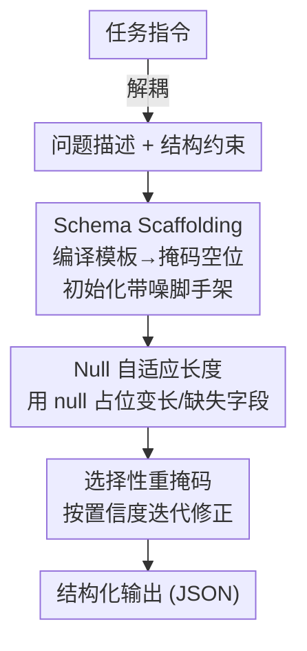

# Unveiling the Potential of Diffusion Large Language Model in Controllable Generation

**会议**: ICLR 2026  
**OpenReview**: [https://openreview.net/forum?id=qhd0qv6L0k](https://openreview.net/forum?id=qhd0qv6L0k)  
**项目页**: [eric2i.github.io/dLLM-CtrlGen](https://eric2i.github.io/dLLM-CtrlGen)  
**代码**: 见项目页  
**领域**: 文本生成 / 扩散语言模型 / 结构化输出  
**关键词**: 扩散大语言模型, 可控生成, 结构化输出, Schema Scaffolding, 训练无关

## 一句话总结
本文提出 **Self-adaptive Schema Scaffolding (S3)**——一种训练无关的方法，把结构模板（schema）当作"半去噪初始态"直接灌进扩散大语言模型（dLLM）的输出上下文，再配合 `null` 占位符自适应长度，让 dLLM 在更少去噪步数下稳定生成合法 JSON 等结构化输出，结构合规率从基线的 30%~80% 提升到 99%+，且幻觉率更低。

## 研究背景与动机
**领域现状**：可控生成（让模型按 JSON / XML / 表格等预定义格式输出）是 LLM 时代工具调用、Agent 通信、对接 API 的基础。当前主流做法有两类：一类是**语法约束解码**，用有限状态自动机（FSA）+ 受约束解码在生成时逐 token 强制满足文法；另一类是**提示工程**，靠手写 prompt 启发模型吐出合规格式。

**现有痛点**：语法约束解码在"没有任何 token 满足文法"时会把所有 beam 剪光、生成直接停摆；提示工程则对不同结构规格要逐个手调，跨领域、跨复杂度表现极不稳定。更根本的是，这些方法都**只依赖语言模型本身的能力**，没有额外机制来引导生成轨迹。

**核心矛盾**：问题的根源在自回归（AR）架构本身——(1) 从左到右生成，早期 token 在不知道完整序列的情况下就被产出，缺乏全局结构协调；(2) 对已生成 token 的"承诺"使得出现结构违规时无法回溯修改；(3) 顺序依赖让模型无法同时满足多个约束。而高质量结构化生成恰恰需要**全局序列规划、迭代修正、并行约束满足**这三种 AR 架构天生缺失的能力。

**切入角度**：扩散大语言模型（dLLM，如 LLaDA、Dream）通过对被掩码序列**迭代去噪**来生成文本，天生具备全局注意力（全局上下文感知）与并行生成能力——这恰好补齐了 AR 的三个短板。但作者发现，现成的指令微调 dLLM 直接拿来跑结构化输出仍会幻觉、破坏结构，且半自回归实现（block-wise 解码）反而把 dLLM 的全局感知与并行优势给削掉了。

**核心 idea**：与其优化 prompt（属于"指令空间"的间接引导），不如把结构模板**直接注入输出上下文**——让 dLLM 从一个"已经填好骨架、只剩空位待填"的部分去噪态出发，把开放式生成转化为"填空"，从而用其反向推理 + 全局感知把空位稳定补齐。

## 方法详解

### 整体框架
S3 是一条**训练无关**的推理流水线。它把原始任务指令拆成两部分——**问题描述**（语义内容）和**结构约束**（格式规格 $S$）；结构约束被编译成 schema，再据此初始化一个"带噪脚手架"（noisy scaffold）：把模板里的固定结构元素（括号、分隔符、字段名）保留，把可变内容位置替换成掩码 token $M$。dLLM 以问题描述为条件，去噪填充这些掩码位置；同时用**选择性重掩码**（selective remask）按置信度反复修正，最终产出结构化输出。

形式上，结构化生成目标是在合法输出空间 $A(S)$ 上求 $A^*=\arg\max_{A\in A(S)} P_{LM}(A|Q,S)$。直接搜索整个 $A(S)$ 因 token 空间巨大而不可行；S3 把它近似为在"共享结构模板的受约束子空间" $\mathcal{S}_C\subset A(S)$ 上、对脚手架 $A_s$ 的掩码位置逐个去噪：$A^*\approx\arg\max_{A_s\in\mathcal{S}_C}\sum_{a_i\in A_s}\mathbb{1}[a_i=M]\log P_\phi(a_i|Q,A_s)$。

### 关键设计

**1. Schema Scaffolding：把结构模板当作"半去噪初始态"灌进输出上下文**

针对"只靠模型自身能力、没有机制引导生成轨迹"这一痛点，作者不再去优化指令端的 prompt，而是直接在**输出上下文**预填结构模板。具体做法是解析结构规格 $S$，识别其中的不变结构元素（括号、分隔符、字段名等）原样保留，把可变内容位置替换成掩码 token $M$，得到一个结构脚手架 $A_s$——它既约束了生成空间，又给语义内容留足灵活度，等于把"无约束生成"变成"填空"。

为什么这对扩散模型有效，作者给出 **Scaffold-Guided Denoising Convergence 定理**：用结构脚手架 $S$ 初始化去噪过程，相比不用脚手架，掩码位置上的期望去噪误差会按比例缩小——$E[\|\hat{x}_0-x_0\|_M]\le E[\|\tilde{x}_0-x_0\|_M]\cdot\left(1-\frac{|S|}{L}\right)$，其中 $|S|/L$ 是脚手架覆盖比例（固定结构占整条序列的比例）。直觉是：脚手架把一部分位置"提前定死"，dLLM 只需在剩下的掩码位置去噪，覆盖比例越高、待去噪的不确定性越小，因此哪怕极少量脚手架也能拉到近乎完美的结构合规——这与实验里"8 步就饱和"的现象吻合。区别于语法约束解码的"逐 token 卡死"，脚手架是从全局给定骨架，不会出现剪光所有 beam 而停摆。

**2. Null 自适应长度：用语义占位符 `null` 化解固定长度脚手架的过生成与幻觉**

脚手架带来一个新难题：每个可变字段该预留**多少个**掩码 token？在不知道目标内容长度时无法预先确定。一个朴素方案是给每个位置塞足够多掩码、指望模型只用需要的部分；但作者分析（Sec. 6.1）发现 dLLM 对序列长度**很敏感**——过长的脚手架会扭曲生成质量，导致字段没填满或干脆编造内容来填空。另一个方案是微调引入专门 padding token，但这违背"训练无关"目标，还会嵌入数据集偏置、损害对未见领域的泛化。

S3 的解法是引入语义 token **`null`** 作为占位符：通过一个增强提示 $Q^+$ 引导模型，对缺失值或变长字段自然地用 `null` 表示——目标变为 $A^*\approx\arg\max_{A_s\in\mathcal{S}_C}\sum_{a_i\in A_s}\mathbb{1}[a_i=M]\log P_\phi(a_i|Q^+,A_s)$。这把"固定长度脚手架"问题转化成"自适应生成"任务。其有效性来自一个洞察：dLLM 本是为"忠实重建"训练的，当僵硬 schema 强迫它在源文本无据可依处也要填内容时，它只能编造合理 token 来满足格式（幻觉的根源就是这种分布偏移）；而允许模型用 `null` 显式承认"这里没信息"，就把测试时的陌生场景拉回到训练时熟悉的分布，从而既守住结构约束、又对齐预训练去噪能力，过生成与幻觉同时被压下去。

**3. 选择性重掩码：借扩散的多步特性做置信度驱动的迭代修正**

不同于 AR 一次性提交不可回改，扩散的多步去噪天然支持对已生成 token 反复编辑。S3 据此加入**选择性重掩码**：在去噪迭代中，按置信度把低置信的预测位置重新掩码、再去噪，逐步精炼输出。这一步利用了 dLLM 的全局注意力——重掩码后的位置能基于已经成型的全局结构上下文重新决策，而不是被早期的局部错误锁死。它也是"迭代修正"这一 AR 缺失能力的具体落地，使 S3 在更少步数下稳定收敛。

### 损失函数 / 训练策略
S3 **完全训练无关（zero-shot）**，不修改 dLLM 权重，全部发生在推理阶段。其复杂度优势也值得一提：dLLM 反向过程整体复杂度约 $O(L^3)$（步数 × 每步全局注意力的 $O(L^2)$）；S3 从"部分去噪态"而非完全随机态 warm-start，把解码复杂度降到约 $O(nL^2)$，其中 $n$ 是远小于 $L$ 的可调超参，对应"8 步即饱和"的少步推理。

## 实验关键数据

实验用 **LLaDA** 作为主力 dLLM，**WikiBio** 数据集（结构化抽取），推理温度设 0。评测沿三个维度展开（也是本文提出的评测框架）：**结构合规**（SV 结构有效性 / FC 字段完整性 / SC schema 合规）、**内容保真**（PR/RE/F1）、**忠实度**（HR 幻觉率，越低越好）。

### 主实验

结构合规（Schema Compliance，越高越好）随去噪步数变化：

| 方法 | 8 步 | 16 步 | 32 步 |
|------|------|-------|-------|
| Baseline（直接提示） | .312 | .576 | .792 |
| Schema Scaffolding (S2) | .993 | .997 | .996 |
| Self-adaptive (S3) | .994 | .997 | .997 |

直接提示 dLLM 严重不足：所有结构指标基线长期低于 65%，即便 32 步最高也只到 ~87%，远达不到实用要求。而脚手架方法**仅 8 步**就近乎完美、16 步饱和——由于扩散推理延迟随步数线性增长，这同时意味着更低延迟 + 更高结构质量。

幻觉率（HR，越低越好，Table 1）：

| 方法 | 8 步 | 16 步 | 32 步 |
|------|------|-------|-------|
| Baseline | 0.404 | 0.403 | 0.409 |
| S2（vanilla 脚手架） | 0.465 | 0.463 | 0.463 |
| S3（self-adaptive） | **0.340** | **0.331** | **0.331** |

关键反差：vanilla 脚手架 S2 的幻觉率反而**高于**基线——僵硬 schema 迫使模型为填满所有槽位而过生成、编造内容；S3 用 `null` 占位后，幻觉率被压到三者最低。

### 消融实验
在三种步数下，对比逐步增强的基线（Table 2，节选 8 步）：

| 配置 | SV↑ | SC↑ | F1↑ | HR↓ | 说明 |
|------|------|------|------|------|------|
| baseline | 0.346 | 0.312 | 0.068 | 0.404 | 直接提示 |
| w/ few-shots（3 例） | 0.471 | 0.443 | 0.068 | 0.366 | 少样本只小幅改善结构 |
| w/ template（指令里附完整 schema） | 0.475 | 0.431 | 0.084 | 0.388 | 把模板当指令引导，结构仍 <50% |
| **S3 (ours)** | **0.994** | **0.994** | **0.130** | **0.340** | 结构合规跃升至 99%+ |

### 关键发现
- **"过思考"现象**：内容保真度并非步数越多越好——延长迭代有时反而掉点，作者称之为扩散反向过程偏离最优解的 overthinking。结构合规 8 步即饱和，强烈的边际递减说明脚手架提供的约束在推理早期就被快速实现。
- **把模板放"指令端"还是"输出端"差别巨大**：w/ template 把完整 schema 塞进指令，结构合规仍 <50%；而 S3 把模板放进**输出上下文**（半去噪初始态），直接到 99%+——这正是本文"输出端脚手架 > 提示工程"的核心论点。
- **null 占位是 S2→S3 的胜负手**：vanilla 脚手架虽提升 recall/F1，但 precision 与忠实度反而恶化；引入 null 自适应长度后三项指标同时改善，解决了过生成与分布偏移导致的幻觉。

## 亮点与洞察
- **"在输出上下文里 warm-start"是把扩散的去噪机制用对地方**：AR 没有"部分去噪初始态"这个概念，而 dLLM 天然支持从带掩码序列出发——本文敏锐地把"结构模板"映射成"已知去噪位置"，并用定理量化了误差随覆盖比例下降，这个视角很巧。
- **用 `null` 把"陌生测试场景搬回训练分布"**：与其微调加 padding token，不如借模型已有的语义先验承认"无信息"，既保训练无关又防幻觉——这是一个可迁移到其他约束生成任务的轻量 trick。
- **结构化输出是检验 dLLM 全局感知的好试验台**：相比开放对话，结构化任务对全局规划/并行约束满足的需求更刚性，正好放大 dLLM 相对 AR 的架构优势。

## 局限与展望
- **内容保真度绝对值仍低**：F1 只有 0.12~0.13 量级，论文也承认"marginal improvement"——S3 主要解决的是结构合规与幻觉，语义抽取准确率离实用还有距离。
- **评测面窄**：主结果集中在单模型 LLaDA + 单数据集 WikiBio（其余仅 Appendix 提及），跨模型、跨更复杂 schema（深层嵌套、多约束耦合）的泛化性证据有限。
- **"过思考"未被根治**：S3 缓解了过生成，但延长去噪仍可能掉点，缺乏自适应停步机制；`null` 占位的提示也需要 $Q^+$ 引导，对提示设计仍有一定依赖。
- **复杂度收益依赖近似**：$O(nL^2)$ 中 $n\ll L$ 是经验设定，未给出 $n$ 与质量的系统权衡曲线。

## 相关工作与启发
- **vs 语法约束解码（FSA + constrained decoding）**：他们在 AR 解码时逐 token 强制满足文法，无合法 token 时全 beam 剪光而停摆；本文从全局给定结构骨架、在输出端做填空，借 dLLM 并行 + 可回改避免了"卡死"，且训练无关。
- **vs 提示工程 / 模板当指令（w/ template）**：他们把 schema 写进指令空间间接引导，跨领域不稳定且本文实测结构合规仍 <50%；S3 把模板放进输出上下文作为半去噪初始态，直接拉到 99%+。
- **vs 半自回归 dLLM 实现（如 LLaDA 的 block-wise 解码）**：那类实现用分块 KV-cache 提速却牺牲了扩散的并行与全局感知；本文反其道，靠 warm-start 初始化在保留全局并行的同时把复杂度从 $O(L^3)$ 降到 $O(nL^2)$。

## 评分
- 新颖性: ⭐⭐⭐⭐ "输出端结构脚手架 + null 自适应长度"是对 dLLM 特性很贴切的利用，视角新颖
- 实验充分度: ⭐⭐⭐ 结论清晰但主要绑定单模型单数据集，泛化证据偏薄
- 写作质量: ⭐⭐⭐⭐ 动机推导（AR 三短板 ↔ dLLM 三优势）和 S2→S3 的失败-修正叙事很顺
- 价值: ⭐⭐⭐⭐ 为把 dLLM 部署到工具调用/Agent 的结构化输出给出了实用且训练无关的路径

<!-- RELATED:START -->

## 相关论文

- [\[ICLR 2026\] FS-DFM: Fast and Accurate Long Text Generation with Few-Step Diffusion Language Model](fs-dfm_fast_and_accurate_long_text_generation_with_few-step_diffusion_language_m.md)
- [\[ACL 2025\] Unveiling Attractor Cycles in Large Language Models: A Dynamical Systems View of Successive Paraphrasing](../../ACL2025/nlp_generation/unveiling_attractor_cycles_in_large_language_models_a_dynamical_systems_view_of_.md)
- [\[AAAI 2026\] Structured Language Generation Model: Loss Calibration and Formatted Decoding for Efficient Text](../../AAAI2026/nlp_generation/structured_language_generation_model_loss_calibration_and_formatted_decoding_for.md)
- [\[ICLR 2026\] Rainbow Padding: Mitigating Early Termination in Instruction-Tuned Diffusion LLMs](rainbow_padding_mitigating_early_termination_in_instruction-tuned_diffusion_llms.md)
- [\[ACL 2026\] Difficulty-Controllable Cloze Question Distractor Generation](../../ACL2026/nlp_generation/difficulty-controllable_cloze_question_distractor_generation.md)

<!-- RELATED:END -->
