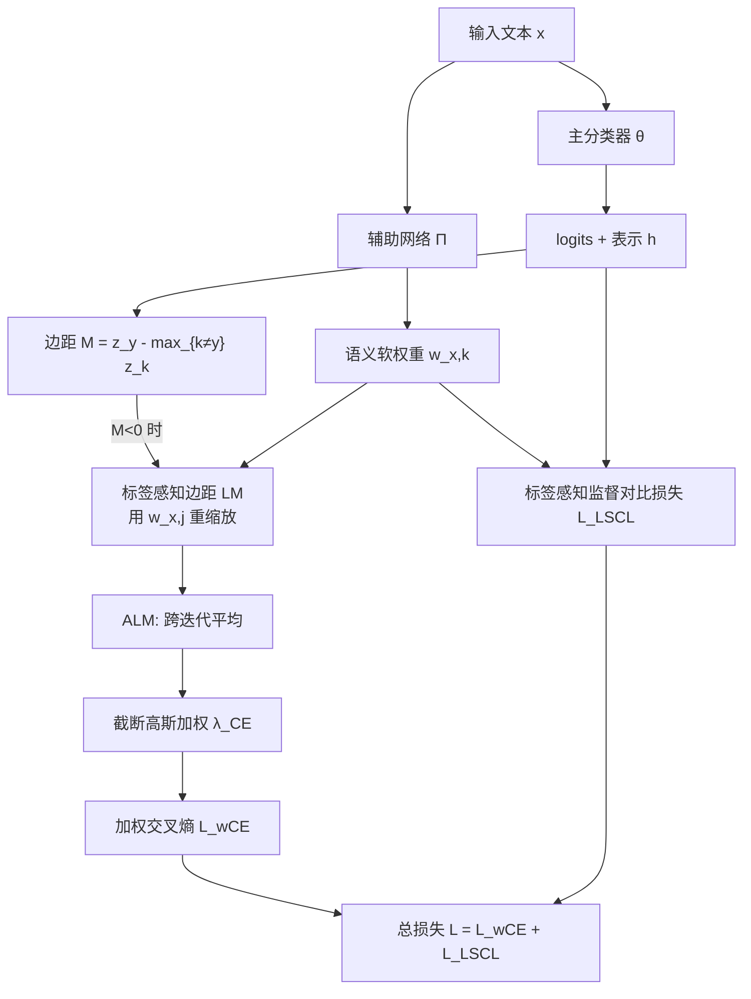

# LANE: Label-Aware Noise Elimination for Fine-Grained Text Classification

**会议**: ICLR 2026  
**OpenReview**: [https://openreview.net/forum?id=PuayLKdrFz](https://openreview.net/forum?id=PuayLKdrFz)  
**代码**: [https://github.com/tsosea2/Label-Aware-Noise-Elimination](https://github.com/tsosea2/Label-Aware-Noise-Elimination)  
**领域**: 噪声标签学习 / 细粒度文本分类  
**关键词**: 噪声标签, 标签感知边距, 文本分类, 对比学习, 样本加权, AUM  

## 一句话总结
LANE 把"识别错标样本"的经典 margin 指标升级为**标签感知边距 (Label-aware Margin)**——同样是负边距，若被错标的类别与模型预测类别语义相近（如把"愤怒"标成"恐惧"）就少惩罚，语义相远（把"信任"标成"恐惧"）才重罚，并据此对每个样本动态加权而非硬删除，在 10 个文本分类数据集上稳定超过 AUM/HMW 等强基线。

## 研究背景与动机
**领域现状**：监督文本分类高度依赖标注质量，但众包标注和弱监督/远程监督天然带噪，尤其在情感识别 (GoEmotions 27 类)、主题分类 (RCV1) 这类**类别多且彼此易混淆**的细粒度任务上，标注错误普遍存在；而过参数化的神经网络能在任意带噪数据上拟合到零训练误差，泛化随之崩溃。

**现有痛点**：识别错标样本的两条主流路线都有结构性缺陷。一是 AUM（Area Under the Margin，赋值标签 logit 与最大其他 logit 之差在各 epoch 上的平均）配合**固定阈值直接删除**低分样本——但"困难却干净"的样本同样得分低，被一并误删，损失了宝贵的难例多样性；二是 Han 等的 small-loss / Co-teaching 用大 loss 删样本，同样面临误删。最新的 HMW (Zhang 2024) 改成保留全部样本、按 IAM（AUM 的扩展，对比赋值 logit 与前两大其他 logit）软加权，缓解了删除问题。

**核心矛盾**：AUM 和 IAM **都只看 logit 数值差，完全不感知类别间的语义关系**——它们把"愤怒被标成恐惧"和"愤怒被标成喜悦"视为同等严重的错误。但前者只是相近情感的轻微混淆，后者才是真正有害的错标。一刀切的惩罚既冤枉了语义合理的边界样本，又稀释了对真错标的打击力度。

**本文目标**：保留全部训练样本，但赋予一种**既能识别错标、又能按"语义严重度"分级**的动态权重，让困难干净样本被保护、真错标样本被压制。

**核心 idea**：**用一个辅助网络学习类别间语义相似度，把它注入 margin 的重缩放**——当 margin 为负（疑似错标）时，按"赋值标签与模型预测标签的语义距离"放大或缩小惩罚；语义距离的学习则靠一个**标签感知监督对比损失**与交叉熵联合训练完成。

## 方法详解

### 整体框架
LANE 联合训练两个 BERT-base 网络：主分类器 $\theta$ 产生 logits 和文本表示，辅助网络 $\Pi$ 产生每个样本对各类别的**软分配权重** $w_{x,k}$（经投影层 + softmax）。训练中对每个样本逐 epoch 计算**标签感知边距 LM**，跨 epoch 平均得到 **ALM**；ALM 低于负 ALM 分布均值的样本被判为疑似错标，按截断高斯赋予 $<1$ 的交叉熵权重，其余样本权重为 1。同时用标签感知监督对比损失训练 $\Pi$ 去学类别语义关系，与加权交叉熵相加构成总损失。

### 关键设计

**1. 标签感知边距 LM：让语义距离决定惩罚力度。** 经典 margin 定义为赋值标签 logit 与最大其他 logit 之差 $M^{(t)}(x,y)=z_y^{(t)}(x)-\max_{k\neq y}z_k^{(t)}(x)$，负值通常意味着错标。LANE 的关键洞察是——只在 margin 为负这一"疑似出问题"区间做重缩放，用辅助网络给出的语义权重去调制惩罚：

$$LM^{(t)}(x,y)=\begin{cases}\dfrac{1}{w_{x,j}}\cdot M^{(t)}(x,y) & M^{(t)}(x,y)<0,\ j=\arg\max_{k\neq y}z_k^{(t)}(x)\\[2mm] M^{(t)}(x,y) & \text{otherwise}\end{cases}$$

这里 $j$ 是模型实际预测的（很可能是隐藏真标签的）类别，$w_{x,j}$ 衡量赋值标签 $y$ 与 $j$ 的语义接近度：两者语义越近 $w_{x,j}$ 越大、$1/w_{x,j}$ 越小，负边距被温和缩放（轻罚）；语义越远 $w_{x,j}$ 越小、$1/w_{x,j}$ 越大，负边距被进一步放大（重罚）。论文 Table 1 给出经典案例：两个样本同样 $M=-0.6$，但样本一赋值"恐惧"而模型预测"愤怒"（情感相近），样本二赋值"恐惧"而模型预测"信任"（相距甚远），LANE 让后者的 LM 远低于前者，从而把真正的错标与合理的边界混淆区分开。

**2. 平均标签感知边距 ALM + 截断高斯加权：保护难例、压制真错标。** 单 epoch 的 LM 有噪声，LANE 跨迭代平均得到 $ALM^{(t)}(x,y)=\frac{1}{t}\sum_{r=1}^{t}LM^{(r)}(x,y)$ 作为稳定的"标签质量"度量。加权时不是粗暴地砍掉所有负 ALM 样本，而是只对**负 ALM 且低于负 ALM 分布均值 $\mu_t$** 的样本降权——其背后假设是：ALM 在均值之上的负样本属于"困难但干净"，应予保留。具体在这些样本上拟合截断高斯，按距均值的远近赋权：

$$\lambda_{CE}^{t}(x_i,y_i)=\begin{cases}\exp\!\left(-\dfrac{(ALM^{(t)}(x_i,y_i)-\mu_t)^2}{2\sigma_t^2}\right) & x_i\in N^t,\ ALM^{(t)}<\mu_t\\[2mm] 1 & \text{otherwise}\end{cases}$$

其中 $N^t$ 是负 ALM 样本集，$\mu_t,\sigma_t$ 用历史预测在线估计。ALM 越是持续地低于均值，权重越小，最终的加权交叉熵 $L_{wCE}=\sum_i\lambda_{CE}^t(x_i,y_i)\cdot H(\theta(x_i),y_i)$ 自然把可疑错标样本对训练的贡献压下去。这一阈值取均值的选择经消融验证优于固定阈值 0。

**3. 标签感知监督对比损失：让 $w$ 真正学到类别语义。** LM 的重缩放完全依赖语义权重 $w$ 的质量，因此 LANE 不让 $\Pi$ 凭空学，而是扩展 Gunel 的监督对比损失，在对比项里用软分配权重加权正负对：

$$L_{LSCL}=\sum_{i=1}^{|B|}H(\Pi(x_i),y_i)+\sum_{i=1}^{|B|}\frac{-1}{|P_{x_i}|}\sum_{p\in P_{x_i}}\log\frac{w_{x_i,y_{x_i}}\cdot\exp(h_{x_i}^{\theta}\cdot h_p^{\theta})}{\sum_{s\in B;\,y_s\neq y_{x_i}}w_{x_i,y_s}\cdot\exp(h_{x_i}^{\theta}\cdot h_s^{\theta})}$$

正样本集 $P_{x_i}$ 是同类样本及其增强（同义词替换、SwitchOut、回译扩充）。分子分母的 $w$ 让对比学习对易混淆类别更敏感，从而把类别间相似度结构学进辅助网络，回头喂给 LM 做语义缩放。最终损失为 $L=L_{wCE}+L_{LSCL}$，两个网络端到端联合训练，形成"对比损失学语义 → 语义调制 margin → margin 加权降噪"的闭环。

## 实验关键数据

### 主实验表格（原始数据集，weighted F1 / Accuracy，5 次平均）

| 方法 | Empath | GoEmo | ISEAR | CEmo | RCV1 | SciHTC | SST-5 | Amazon R | Yelp | Yahoo |
|------|--------|-------|-------|------|------|--------|-------|----------|------|-------|
| BASE (BERT) | 58.5 | 63.6 | 71.5 | 75.8 | 56.8 | 32.5 | 56.3 | 67.5 | 65.9 | 75.4 |
| AUM | 58.4 | 63.1 | 71.8 | 76.0 | 56.3 | 31.2 | 56.4 | 66.4 | 68.1 | 72.9 |
| LCL | 59.1 | 64.8 | 72.4 | 76.5 | 57.9 | 33.1 | 57.6 | 68.2 | 66.8 | 76.8 |
| HMW | 57.6 | 62.8 | 70.4 | 77.1 | 56.7 | 31.6 | 57.2 | 67.4 | 68.1 | 77.3 |
| **LANE** | **60.8** | **66.5** | **74.3** | **78.2** | **59.3** | **34.1** | **58.9** | **69.7** | **69.2** | **78.4** |

LANE 在全部 10 个数据集上均为最佳：相比最强基线在 CancerEmo +1.1、RCV1 +1.4、Amazon +1.5、Yahoo +1.1；相比 BERT 在 GoEmotions +2.9、Yahoo +3.0。原始数据集上平均比 AUM 高 **2.88% F1**、比 HMW 高 **2.32%**。

### 20% 注入噪声 + 消融实验
20% 标签翻转下任务显著变难（如 Empath BERT 从 58.5 暴跌到 11.6），但 LANE 仍稳居最佳，相比 BASE 平均提升 **4.11%**；噪声场景平均比 AUM 高 3.37%、比 HMW 高 3.4%，40% 极端噪声下分别领先 **4.75% / 4.01%**。

消融（Table 4，去掉某组件）：

| 变体 | Empath(orig) | SciHTC(orig) | RCV1(orig) | RCV1(20N) |
|------|--------------|--------------|------------|-----------|
| LANE−sim（去语义，退回 AUM 权重） | 58.7 | 32.4 | 57.3 | 45.2 |
| LANE−alm（去加权交叉熵） | 59.1 | 32.1 | 57.9 | 46.2 |
| AUM（硬删除） | 58.2 | 31.2 | 56.3 | 47.6 |
| **LANE** | **60.8** | **34.1** | **59.3** | **49.4** |

### 关键发现
- **语义感知是主要增益来源**：去掉语义的 LANE−sim 在 RCV1(20N) 比完整 LANE 低 4.2%，证明类别相似度信息比单纯的样本加权更关键。
- **保留优于删除**：完整 LANE 全面超过硬删样本的 AUM，验证"困难干净样本不该被删"的核心论点。
- **计算可控**：辅助网络使训练算力约增 1.8×，但收敛 epoch 数相近，单张消费级 GPU 即可跑，远比用 LLM 做标签纠错经济。

## 亮点与洞察
- **把"语义先验"显式注入噪声度量**：以往 margin/loss 类方法只在数值空间打转，LANE 第一次让"哪类被错标成哪类"的语义结构进入降噪决策，且只在负 margin 区间介入，干预精准、不破坏正常样本。
- **"软加权而非硬删除"配合截断高斯阈值**：用负 ALM 分布的均值自适应区分"难例 vs 真错标"，避免了固定阈值的脆弱性，是一个简洁有效的统计设计。
- **闭环自洽**：对比损失负责学语义、语义负责调 margin、margin 负责加权，三者互相强化，且全部端到端，无需外部知识或 LLM。

## 局限与展望
- **依赖辅助网络的语义权重质量**：若类别语义本身难以从数据学到（如类别定义高度任务相关、语料稀疏），$w$ 不准会直接劣化 LM 的缩放，论文未深入讨论此失败模式。
- **1.8× 训练开销**：双网络联合训练翻倍算力，在大规模或大模型场景下成本上升，是否能蒸馏掉辅助网络或共享参数值得探索。
- **局限于 BERT-base 文本分类**：未验证在更大语言模型、生成式分类或非文本模态上的可迁移性；语义相似度的"轻罚/重罚"假设在层级标签或多标签场景下是否成立也待考。
- **截断高斯的单峰假设**：对噪声 ALM 分布拟合单个高斯，面对多模态噪声结构（多种错标机制并存）可能不够精细。

## 相关工作与启发
- **承接 AUM 谱系**：直接建立在 Pleiss 等的 AUM 与 Zhang 等的 HMW/IAM 之上，把"边距识别错标"从数值层面推进到语义层面，是该谱系的自然延展。
- **与标签感知对比学习呼应**：Suresh & Ong 的 LCL 同样利用类别关系，是本文最强基线之一；LANE 的增益说明"识别并降权错标"与"对比学习类别关系"是互补而非替代的。
- **对噪声标签社区的启发**：Co-teaching / DivideMix / UNICON 等双网络/半监督路线侧重"分干净集与噪声集"，LANE 提示了一条正交思路——不做硬切分，而是用语义连续地调节每个样本的影响力，这一"软语义加权"范式可迁移到图像、语音等带噪标注任务。

## 评分
- **新颖性**: ⭐⭐⭐⭐ —— 把类别语义相似度引入 margin 重缩放、只在负 margin 区间介入的设计简洁且切中 AUM/IAM 语义盲点的要害，是对成熟谱系的实质性推进。
- **实验充分度**: ⭐⭐⭐⭐ —— 10 个跨领域数据集、原始/20%/40% 三档噪声、对三个组件的清晰消融，覆盖全面；但仅限 BERT-base 与文本分类，未触及大模型与其他模态。
- **写作质量**: ⭐⭐⭐⭐ —— 动机用"愤怒/恐惧/信任"的具体例子讲得极清楚，公式与算法伪代码完整，Table 1 的对照案例尤其有画面感。
- **价值**: ⭐⭐⭐⭐ —— 方法即插即用、单 GPU 可跑、对细粒度带噪标注任务普适，且"软语义加权"思路对整个噪声标签学习社区有借鉴意义。

<!-- RELATED:START -->

## 相关论文

- [\[ACL 2026\] MADE: A Living Benchmark for Multi-Label Text Classification with Uncertainty Quantification](../../ACL2026/nlp_understanding/made_a_living_benchmark_for_multi-label_text_classification_with_uncertainty_qua.md)
- [\[ACL 2026\] LLM-Guided Semantic Bootstrapping for Interpretable Text Classification with Tsetlin Machines](../../ACL2026/nlp_understanding/llm-guided_semantic_bootstrapping_for_interpretable_text_classification_with_tse.md)
- [\[ICML 2026\] Causal Fine-Tuning under Latent Confounded Shift](../../ICML2026/nlp_understanding/causal_fine-tuning_under_latent_confounded_shift.md)
- [\[ACL 2026\] Beyond Chunking: Discourse-Aware Hierarchical Retrieval for Long Document Question Answering](../../ACL2026/nlp_understanding/beyond_chunking_discourse-aware_hierarchical_retrieval_for_long_document_questio.md)
- [\[ACL 2026\] Reasoning-Based Refinement of Unsupervised Text Clusters with LLMs](../../ACL2026/nlp_understanding/reasoning-based_refinement_of_unsupervised_text_clusters_with_llms.md)

<!-- RELATED:END -->
