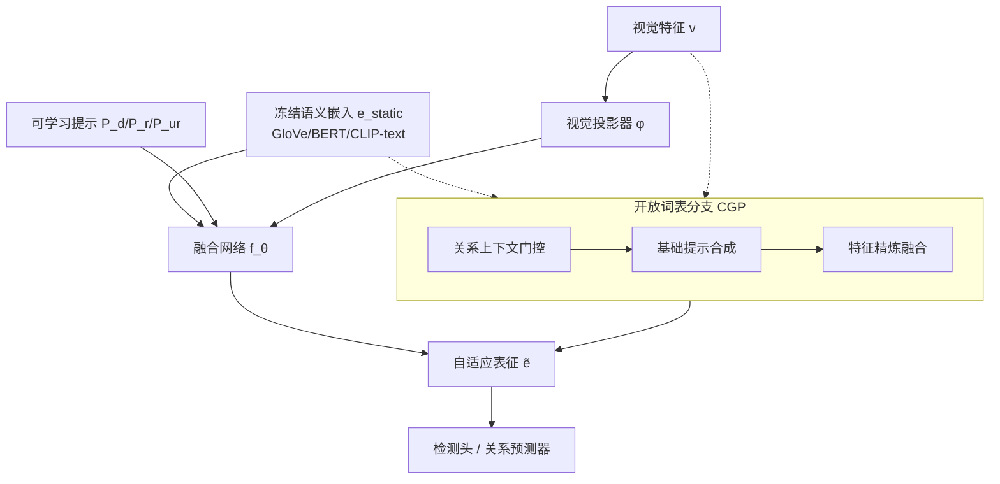

# APT: Towards Universal Scene Graph Generation via Plug-in Adaptive Prompt Tuning

**会议**: ICLR 2026  
**OpenReview**: [https://openreview.net/forum?id=IZWJhdK2o7](https://openreview.net/forum?id=IZWJhdK2o7)  
**代码**: [https://github.com/CGCL-codes/APT](https://github.com/CGCL-codes/APT)  
**领域**: 场景图生成 / 视觉关系检测 / 提示微调  
**关键词**: Scene Graph Generation, Prompt Tuning, 语义表征, Open-Vocabulary, 插件模块  

## 一句话总结
APT 把场景图生成长期沿用的「冻结词向量语义先验」换成一组轻量可学习提示，将静态语义特征动态调制成依赖视觉上下文的表征，作为即插即用模块塞进任意一阶段 / 两阶段 / 开放词表 SGG 框架，用 <0.5M 参数和更短训练时间换来全面涨点。

## 研究背景与动机
- **领域现状**：场景图生成（SGG）要把图像表示成「物体—关系—物体」的结构图，多年来被两条路线主导——两阶段方法先检测物体再预测关系、靠强检测器特征但上下文割裂；一阶段方法端到端联合建模、但计算开销大、关系粒度粗。两类方法都有一个共同习惯：用 GloVe / BERT 等预训练语言模型导出的**静态、固定的语义嵌入**作为语义先验。
- **现有痛点**：这些冻结的词向量虽然在 NLP 里好用，但对 SGG 这种讲究上下文敏感、关系细粒度、主客体角色不对称的任务天然错配。同一个 "person" 嵌入无论这人是在骑马还是拿手机都纹丝不动，无法区分 "standing on" 和 "walking on" 这类近义谓词。作者用 t-SNE 可视化证明：静态语义空间把所有 person 实例塌缩成一个点，而视觉特征空间会按关系上下文（骑、走、拿）自然分簇，两者严重失配。
- **核心矛盾**：社区一直在「一阶段 vs 两阶段」的架构之争里打转，却忽略了真正的瓶颈不在架构，而在**表征范式**——换一个更强的冻结模型（GloVe→BERT→CLIP-text）只是让内部子结构更丰富，并没有解决语义对视觉关系上下文不适配的根本问题（诊断表显示 silhouette / 互信息确实随模型变强而提升，但仍与 SGG 细粒度需求错位）。
- **本文目标**：跳出架构之争，提供一个**轻量、通用、可插拔**的机制，把自适应语义注入任意 SGG 框架，同时保持参数与训练开销极小。
- **核心 idea**：**[范式转换]** 用一组轻量可学习提示充当「条件适配器」，在不反传到预训练骨干的前提下，把冻结语义特征调制成随视觉上下文与关系角色变化的动态表征——作者把这个过程类比成通信里的「调制解调器」，提示 $P$ 携带视觉上下文信息去调制原始语义信号。

## 方法详解

### 整体框架
APT 的核心是一组轻量可学习提示，把冻结的预训练语义嵌入适配成上下文感知的任务特征。它被设计成通用插件：在两阶段方法里分别作用于检测阶段和关系阶段，在一阶段方法里合并成单个关系提示，在开放词表设置里再额外挂一个组合泛化提示器（CGP）。预训练语义骨干始终冻结，只有提示参数、视觉投影器和轻量 MLP 融合网络可学。

### 关键设计

**1. 统一即插入提示：把冻结嵌入「调制」成动态特征。** APT 的运作原理可以用一条通式概括——对任意语义概念 $c$，用一个轻量可学习提示 $P(c)$ 把它的冻结嵌入 $e_{static}(c)$ 在当前视觉上下文下重新调制：$\tilde{e}(c) = f_\theta\big(A(P(c), e_{static}(c), \phi(v))\big)$，其中 $A(\cdot)$ 是把提示序列聚合成单向量的聚合函数，$\phi(v)$ 是编码视觉上下文的投影器，$f_\theta$ 是生成最终自适应表征的小型融合网络。关键在于只有 $P$、$\phi$、$f_\theta$ 可学，预训练语义骨干完全冻结，因此既极度参数高效又能避免灾难性遗忘。作者从信息瓶颈视角给出动机：希望学到的 $\tilde{e}$ 在给定视觉上下文 $v$ 和目标 $y$ 时尽量保留物体身份信息、压缩掉与当前关系无关的冗余语义，目标写作 $\max\ I(\tilde{e}; y) - \beta I(\tilde{e}; e_{static} \mid v, y)$。落到具体阶段则分化成三类提示：两阶段方法用**检测提示** $P_d(c)\in\mathbb{R}^{L_d\times D}$（在物体检测阶段为每个物体类生成自适应表征喂给检测头）和**关系提示** $P_r(r)\in\mathbb{R}^{L_r\times D}$（在关系阶段为谓词类捕捉主客体交互的细微差别）；一阶段方法因为没有独立检测阶段，只用单个**统一关系提示** $P_{ur}$ 去调制语义查询 / 标签嵌入，再送进 transformer 解码器与视觉特征做交叉注意力。

**2. 组合泛化提示器（CGP）：为没见过的概念现场合成提示。** 开放词表设置要求模型泛化到训练时没出现过的物体 / 谓词组合，单靠固定提示不够。CGP 用三个子模块串成一条「条件化—合成—精炼」流水线来动态生成自适应语义。首先是**关系上下文门控（RCG）**，它把视觉证据和初始语义线索拼接后过 MLP 生成角色感知的门控权重 $w_s = \sigma(\text{MLP}_{gate}(\text{Concat}(v_s, e_{static}(s))))$，决定每个实体激活哪些提示基。接着是**基础提示合成（BPS）**，维护一组可学习基础提示 $B\in\mathbb{R}^{N\times L_{ov}\times D}$ 作为关系概念库，把门控权重对基做加权组合 $P_{cgp}(s)=\sum_{i=1}^{N} w_s^i \cdot B_i$，再做带归一化的 token 加权池化得到紧凑提示 $\bar{p}=\text{LayerNorm}(\frac{1}{L_b}\sum_t P_{cgp}(s)_t)$——这样就能从有限基集里生成几乎无限多样的定制提示，实现组合泛化。最后是**特征精炼与融合（FRF）**，把合成提示、冻结语义、投影视觉特征三者拼起来过融合 MLP $\tilde{e}_{ov}(s)=f_{\theta_{frf}}(\text{Concat}(P_{cgp}(s), e_{static}(s), \phi_v(v_s)))$，产出对未见概念也能用于关系推理的上下文敏感表征。CGP 同样是插件，可无缝增强两阶段和一阶段的标准关系提示。

**3. 多正则训练目标：约束提示稀疏、基底正交、表征不漂移。** 为了让提示既灵活又稳定，总目标在分类损失 $L_{cls}$ 之外叠加了一组正则项：对基底和各类提示加 Frobenius 范数约束 $\lambda_p\|B\|_F^2 + \lambda_{pd}\|P_{det}\|_F^2 + \lambda_{pr}\|P_{rel}\|_F^2$ 防过拟合；用蒸馏项 $\lambda_d\,\mathbb{E}[\|\tilde{e}-e_{static}\|_2^2]$ 拴住自适应表征不偏离原始语义太远；用正交项 $\lambda_{orth}\sum_{i<j}\|B_i^\top B_j\|_F^2$ 逼迫不同基底捕捉互补概念；再用门控熵 $-\beta\sum_i w^i\log w^i$ 和 KL 项 $\gamma\,\text{KL}(w\,\|\,u_{prior})$ 同时鼓励门控稀疏、多样并贴近先验分布。这套正则保证了在「<0.5M 新增参数」的极小预算下提示仍能学到有判别力又不退化的语义调制。

## 实验关键数据

数据集为 Visual Genome（VG，150 物体类 / 50 关系类）、Open Image V6、GQA，因篇幅只报 VG。评测三个子任务 PredCls / SGCls / SGDet，指标为 R@K、mR@K（长尾鲁棒）、F@K（R 与 mR 的调和平均，近期主流目标）。

### 主实验表格（VG，节选 PredCls，+APT 为插入本方法）

| 方法 | R@50/100 | mR@50/100 | F@50/100 |
|------|----------|-----------|----------|
| Motif (CVPR'18) | 64.6/66.0 | 15.2/16.2 | 24.6/26.0 |
| Motif+APT | 66.5/68.2 | 17.4/18.1 | 26.4/28.1 |
| PE-Net (CVPR'23) | 65.8/67.6 | 17.7/19.2 | 27.9/29.9 |
| PE-Net+APT | 67.5/69.2 | 19.3/20.5 | 29.7/31.6 |
| EGTR (CVPR'24, 一阶段) | 54.1/56.6 | 35.7/38.2 | 43.0/45.6 |
| EGTR+APT | 56.4/58.3 | 37.5/40.1 | 45.2/47.7 |
| LLM4SGG (CVPR'24) | 62.2/64.1 | 36.2/39.1 | 45.7/48.6 |
| LLM4SGG+APT | 65.1/66.9 | 38.1/42.2 | 47.9/50.3 |
| ST-SGG (ICLR'24) | 53.9/57.7 | 28.1/31.5 | 36.9/40.8 |
| ST-SGG+APT | 58.7/62.3 | 31.3/34.6 | 39.9/43.7 |

涨幅集中在 mR@K（长尾谓词），证明自适应提示缓解了静态特征对高频谓词的偏置；F@K 同步提升说明 mR 的收益不是以牺牲 R 换来的。

### 开放词表表格（VG，Novel split 节选）

| 方法 | Novel R@50/100 | Novel mR@50/100 | Novel F@50/100 |
|------|----------------|------------------|----------------|
| SDSGG (NeurIPS'24) | 25.4/29.6 | 25.2/31.2 | 25.3/30.4 |
| SDSGG+APT | 26.6/31.1 | 26.7/32.3 | 27.1/32.3 |
| OvSGTR (ECCV'24) | 20.5/23.9 | 13.5/16.2 | 16.3/19.3 |
| OvSGTR+APT | 21.2/25.0 | 14.3/17.2 | 17.1/20.4 |

未见类（Novel）上 mR@50 最高 +6.0，验证 CGP 能解锁预训练模型里的组合知识。

### 消融实验表格

| 模型（基于 PE-Net / SDSGG） | 关键观察 |
|------|----------|
| +D-Prompt only | 略升 R@K（更好的物体表征），但对关系推理帮助有限 |
| +R-Prompt only | mR@K 显著提升，直接缓解谓词偏置——关系提示是核心 |
| +Full APT | 各指标最佳，两提示协同从检测贯通到关系预测 |
| CGP: +RCG | Novel 涨，视觉上下文条件化是泛化第一步 |
| CGP: +RCG+BPS | Novel mR@50 较 vanilla +3.8，基底合成定制提示是关键 |
| +Full CGP（含 FRF） | 调和平均最高，FRF 的非线性融合带来均衡提升 |

### 关键发现
- **效率分析**：APT 新增参数全程 <0.5M（即使 LLM4SGG 这种大模型也 <1.5% 开销），且对几乎所有模型**反而缩短**每 epoch 训练时间（一阶段尤其明显，LLM4SGG 减 25%、ST-SGG 减 11.3%），作者归因于上下文感知特征更易优化、加速收敛。
- **新 Pareto 前沿**：LLM4SGG+APT 用 +1.49 性能、−25% 训练时间、−4.6% 参数，证明 APT 在「单位算力性能」上压倒性占优。
- **IB 验证**：APT 相比冻结 GloVe，PCA@90% 从 26 降到 23、离散互信息代理从 1.49 升到 1.96，印证了「保留任务充分信息 + 压缩冗余复杂度」的信息瓶颈解释。

## 亮点与洞察
- **问题诊断有说服力**：用 t-SNE 可视化 + silhouette / 参与率 / PCA@90 / 互信息代理一整套定量诊断，把「冻结语义先验是 SGG 根本瓶颈」从直觉变成可量化的证据，比单纯换架构更有洞见。
- **「调制解调器」类比抓得准**：提示不是当前缀，而是携带视觉信息去调制冻结语义信号，这个视角让 prompt tuning 在结构化视觉任务里的作用一目了然。
- **真·通用插件**：同一范式覆盖两阶段、一阶段、开放词表三类框架，且用 D/R/Pur 三种提示自然适配不同架构的阶段结构，而非生硬套用。
- **省参数还省时间**：插件类工作常以增加开销换性能，APT 反而缩短训练时间，这个反直觉结果（自适应特征加速收敛）是很实用的卖点。

## 局限与展望
- **只报了 VG**：虽然提到 Open Image V6 和 GQA，但因页限只给 VG 结果，跨数据集的通用性证据不够充分。
- **正则项超参偏多**：训练目标里有 $\lambda_p, \lambda_{pd}, \lambda_{pr}, \lambda_d, \lambda_{orth}, \beta, \gamma, \lambda_w$ 一大串系数，实际调参成本和敏感性论文未充分讨论。
- **绝对 mR 仍偏低**：长尾谓词的 mR@K 即便涨点后整体数值仍不高（如 SGDet 多在 10–20），说明 SGG 长尾问题远未解决，APT 是缓解而非根治。
- **依赖底层语义模型质量**：提示调制的上限受冻结语义骨干内部结构限制，诊断也显示「换更强模型只是结构更丰富、仍错位」，提示能否突破这层天花板有待探讨。

## 相关工作与启发
- **vs. 架构之争（一阶段 / 两阶段）**：APT 明确表态不在架构维度再造轮子，而是攻表征范式，这种「换个抽象层下手」的思路对陷入架构内卷的子领域有借鉴意义。
- **vs. 开放词表 SGG（OvSGTR / SDSGG / RAHP）**：这些方法多依赖冻结 CLIP 做零样本对齐，但 CLIP 特征通用而非为关系结构定制；APT 的 CGP 用基底合成 + 上下文门控为未见组合现场造提示，补上了「动态适配」这块短板。
- **vs. 连续提示学习（Prompt Tuning, Lester et al.）**：把 NLP 里的连续提示从「语言模型前缀」迁移到「多模态结构预测的特征调制器」，是 prompt tuning 跨模态落地的一个具体范式，对其他结构化视觉任务（HOI 检测、视觉关系理解）有直接启发。

## 评分
- **新颖性**: ⭐⭐⭐⭐ — 把 SGG 瓶颈从架构重定位到表征范式，并用 prompt 调制 + 信息瓶颈给出统一解释，视角新颖且诊断扎实。
- **实验充分度**: ⭐⭐⭐⭐ — 覆盖两/一阶段 + 开放词表共十余个 baseline，主实验 / 消融 / 效率 / IB 代理俱全；但只报 VG 略减分。
- **写作质量**: ⭐⭐⭐⭐ — 问题动机层层递进、图表诊断清晰，「调制解调器」类比让方法易懂。
- **价值**: ⭐⭐⭐⭐ — 即插即用、<1.5% 参数还省训练时间，对 SGG 社区是低成本高回报的通用增益，落地价值高。

<!-- RELATED:START -->

## 相关论文

- [\[ICLR 2026\] Towards Anomaly-Aware Pre-Training and Fine-Tuning for Graph Anomaly Detection](towards_anomaly-aware_pre-training_and_fine-tuning_for_graph_anomaly_detection.md)
- [\[CVPR 2026\] Prompt-Free Universal Region Proposal Network](../../CVPR2026/object_detection/prompt-free_universal_region_proposal_network.md)
- [\[CVPR 2026\] BUSSARD: Normalizing Flows for Bijective Universal Scene-Specific Anomalous Relationship Detection](../../CVPR2026/object_detection/bussard_normalizing_flows_for_bijective_universal_scene-specific_anomalous_relat.md)
- [\[CVPR 2026\] InsCal: Calibrated Multi-Source Fully Test-Time Prompt Tuning for Object Detection](../../CVPR2026/object_detection/inscal_calibrated_multi-source_fully_test-time_prompt_tuning_for_object_detectio.md)
- [\[ICLR 2026\] OwlEye: Zero-Shot Learner for Cross-Domain Graph Data Anomaly Detection](owleye_zero-shot_learner_for_cross-domain_graph_data_anomaly_detection.md)

<!-- RELATED:END -->
