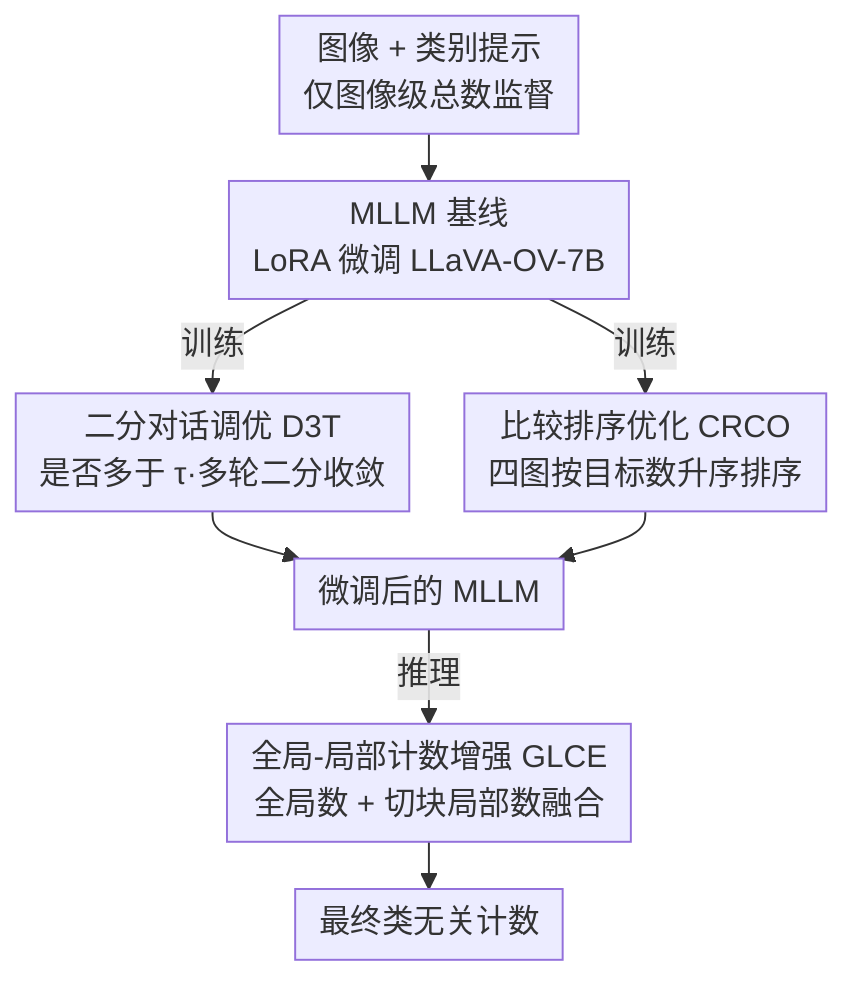

# Bootstrapping MLLM for Weakly-Supervised Class-Agnostic Object Counting

**会议**: ICLR2026  
**OpenReview**: [https://openreview.net/forum?id=QUE0CuClXe](https://openreview.net/forum?id=QUE0CuClXe)  
**代码**: https://github.com/viscom-tongji/WS-COC  
**领域**: 目标计数 / 多模态VLM / 弱监督学习  
**关键词**: 类无关计数、弱监督、MLLM、对话式课程学习、排序优化

## 一句话总结
WS-COC 是首个用多模态大模型（MLLM）做弱监督类无关目标计数的框架，只用图像级总数作监督，靠"二分对话调优 + 比较排序优化 + 全局局部融合"三个简单策略把 MLLM 的计数能力激活出来，在 FSC-147 等四个数据集上逼近甚至超过部分点级监督的全监督方法。

## 研究背景与动机

**领域现状**：目标计数主流是全监督密度图回归——给每个物体打点标注，卷积高斯核生成密度图，对密度图积分得到总数。这类方法在各计数 benchmark 上性能很强，但点级标注极其昂贵，尤其密集场景里成百上千个物体相互遮挡，逐个打点几乎不可行。

**现有痛点**：为降标注成本，少数工作转向弱监督——只用"这张图里有多少个目标"这种图像级总数当监督，学一个从视觉特征到总数的映射。但现有弱监督方法（基于 CNN / ViT）几乎都只能数**单一类别**（典型就是人头计数），无法做类无关计数；而它们也没用上大规模视觉-语言预训练带来的开放词汇能力。

**核心矛盾**：MLLM 本身在大规模图文对上预训练，天然具备文本可提示（text-promptable）的开放类别理解能力，理论上能数任意类别。但作者实测发现，不微调直接拿 MLLM 数数（记作 MLLM-Zero）在稀疏场景还算合理，**一到密集场景就严重低估**——因为 MLLM 的预训练语料里见过的多是稀疏物体分布，缺乏"几十上百个同类物体"的量感。直接拿图像级总数去微调 MLLM 回归绝对计数（记作 WS-COC-Base）也不行：视觉特征是高维表示、计数真值是一个离散标量文本 token，两者间的模态鸿沟让模型很难建立稳健映射，密集场景照样低估。

**本文目标**：在只有图像级总数监督的前提下，把 MLLM 内在的计数潜力"激活"到准确的类无关计数，且微调成本要低。

**切入角度**：与其逼 MLLM 一步回归出精确数字，不如把"数数"这个对 MLLM 困难的任务，重写成它擅长的形式——判断（是否多于某阈值）和比较（哪张图更多）。这两类任务在视觉上更容易被探查，能绕开模态鸿沟。

**核心 idea**：用"二分判断式对话 + 图像间排序"两种代理任务在训练时引导 MLLM 学计数，再在推理时用全局-局部融合纠正密集场景的低估偏差——三个简单策略协同 bootstrap 出 MLLM 的计数能力。

## 方法详解

### 整体框架
WS-COC 建立在一个朴素 baseline（WS-COC-Base，LoRA 微调 LLaVA-OneVision-7B 直接回归总数）之上，要解决的核心问题是"MLLM 直接回归绝对计数因模态鸿沟而失败、密集场景尤其低估"。它的转法是把困难的绝对计数任务拆成两个 MLLM 擅长的代理任务来训练，再在推理时纠偏。

具体地，**训练阶段**叠加两个策略：① 二分对话调优（D3T）把"数出 $c$"重写成一串"是否多于 $\tau$"的范围判断，让模型由粗到细二分收敛、从易到难学计数；② 比较排序优化（CRCO）让模型对一组计数不同的图像按目标数量排序，用相对比较绕过绝对回归的模态鸿沟。两者都只在训练时生效，且都用语言建模损失（language modeling loss）优化。**推理阶段**则启用 ③ 全局-局部计数增强（GLCE）：先出一个全局计数，密集场景再切块分别数、把局部聚合数与全局数融合，专门纠正密集低估。三者各管一段、互不重叠，共同把 MLLM 的"量感"拉起来。

### 关键设计

**1. MLLM 计数基线：把数数变成一句问答**

在引入三策略前，作者先搭了个最直白的 baseline（WS-COC-Base），目的是给后续改进一个公平参照、也暴露"直接回归为什么不行"。它把 MLLM（默认 LLaVA-OneVision-7B）当成文本生成器：对图像 $I$ 和它的总数 $c$，用固定模板构造指令 $T^{inst}=$"How many [obj] are there in the image?"，真值回复 $T^{gt}=$"a photo of [num] [obj]"，把 [num] 换成 $c$、[obj] 换成目标类别，然后用 LoRA 微调让 MLLM 自回归生成这句话。这样计数被表述成纯文本，无需额外计数头。但它的问题正是动机里的模态鸿沟——缺少对物体分布的监督，模型只能硬背"图→数字"的映射，密集场景明显低估（FSC-147 测试集 MAE 21.08，密集子集 MAE 高达 82.44）。后面三个策略都是冲着补这个短板去的。

**2. 二分对话调优 D3T：把一步回归拆成多轮"是否多于 τ"的二分判断**

针对 baseline 在密集场景一步回归不准的痛点，D3T 不让模型直接吐数字，而是把计数重写成一连串范围判断，让它由粗到细二分收敛，等价于一种从易到难的课程学习。给定图像 $I$ 和总数 $c$，设初始范围 $[L_1,U_1]$（如 FSC-147 取 $[1,2000]$），取中点 $\tau_1=\lfloor (L_1+U_1)/2 \rfloor$，构造问题 $Q_1=$"Are there more than $\tau_1$ [obj] in the image?"，真值 $R_1^g$ 在 $c>\tau_1$ 时为 yes、否则为 no，用语言建模损失对齐 MLLM 的回答 $R_1$。随后每轮根据上一轮真值半分范围：

$$[L_t, U_t] = \begin{cases} [\tau_{t-1}+1,\ U_{t-1}], & \text{if } R_{t-1}^g = \text{Yes} \\ [L_{t-1},\ \tau_{t-1}], & \text{if } R_{t-1}^g = \text{No} \end{cases}$$

当 $U_t-L_t < \delta = 0.2\times c$ 时对话终止，此时再让 MLLM 预测实际计数。判断"多还是少"远比一步回归绝对值好学，二分又让搜索空间指数收缩，于是模型逐步把量感建立起来。一个关键细节：训练时的多轮对话是用**真值**构造范围的，所以 D3T 只用于训练；作者实测把它搬到测试（WS-COC w/ D3T-T）反而更差——测试时没有真值，中间任何一轮判断错就会把后续二分带偏到完全错误的方向。

**3. 比较排序优化 CRCO：用图像间相对排序绕开绝对回归的模态鸿沟**

视觉特征是高维表示、计数真值是离散标量 token，直接把预测数对齐真值难以建立稳健映射；而判断"哪张图目标更多"在视觉上更易探查。CRCO 据此训练模型对多张图按目标数排序。难点在采样：计数数据集的总数普遍长尾，密集大计数样本稀少，随机采样几乎采不到。作者用一个简单分桶方案——对每个类别取训练集内的最小、最大计数 $[\underline{c},\overline{c}]$，等长切成 $K$（默认 4）个区间，把该类图像按落入区间分成四组；每次迭代从每组各随机抽一张组成集合 $\mathcal{I}=\{I_1,I_2,I_3,I_4\}$，其计数天然满足 $c_1<c_2<c_3<c_4$，从而稀疏与密集场景都被覆盖。再把四张图打乱成 $\tilde{\mathcal{I}}$ 当视觉输入，配指令 $T=$"Given four images, rank them in ascending order based on their counts of [obj]"，真值 $T^g$ 给出形如"Image $i$ < … < Image $j$"的正确排序，用语言建模损失优化。与外观相似的 CrowdCLIP 排序策略的关键区别：CrowdCLIP 是把**单张图**裁成不同大小的子图（假设裁得越大物体越多）并用对比损失；CRCO 则采样**同类别不同图像**、直接用语言建模损失生成排序——消融里把 CRCO 换成裁子图的 SCRCO 变体明显变差，因为同图裁剪的排序对 MLLM 太容易，学不到跨图像的真量感。

**4. 全局-局部计数增强 GLCE：推理时切块纠正密集场景低估**

即便微调后，模型在密集场景仍倾向低估。GLCE 在推理阶段做纠偏：先用 MLLM 出全局计数 $c_g$；若 $c_g$ 低于密集阈值 $c_h$（默认 100）就直接采用，否则判为密集场景，把图像 $I$ 均匀切成 $L\times L$（默认 $2\times 2$）不重叠子图，分别查询得到局部计数 $\{c_k\}_{k=1}^{L^2}$，求和得 $c_l$。由于子图边界处物体被重复计数（edge effect），$c_l$ 往往相对 $c_g$ 高估；作者发现约 81.2% 的全局预测 $c_g$ 低估、约 79.4% 的局部聚合 $c_l$ 高估，两者方向相反恰好互补，于是最终预测简单取二者平均 $\frac{c_g+c_l}{2}$。一个偏低、一个偏高，平均后相互抵消，密集场景误差被有效压下来。

### 损失函数 / 训练策略
全程统一用 MLLM 自带的语言建模损失（cross-entropy）：baseline 对齐"a photo of [num] [obj]"、D3T 对齐每轮 yes/no、CRCO 对齐排序串，没有额外计数头或回归损失。微调走 LoRA（rank=128、scaling=256），默认骨干 LLaVA-OneVision-7B，密集阈值 $c_h=100$、GLCE 取 $L=2$，batch size 4，单卡 NVIDIA L20，训练仅 3.44 小时。D3T 与 CRCO 只在训练叠加，GLCE 只在推理启用，推理指令统一为"How many [obj] are there in the image?"。

## 实验关键数据

### 主实验
FSC-147（6135 图、147 类）上与 8 个全监督文本可提示方法、3 个弱监督方法对比（带 * 的弱监督变体是把全监督方法解码器末层换成线性计数层适配而来）：

| 方法 | 监督 | VAL MAE↓ | VAL RMSE↓ | TEST MAE↓ | TEST RMSE↓ |
|------|------|----------|-----------|-----------|------------|
| MLLM-Zero | 无 | 38.92 | 119.26 | 38.19 | 145.42 |
| WS-COC-Base | 图像级 | 21.70 | 87.53 | 21.08 | 122.18 |
| GCNet | 图像级 | 19.50 | 63.13 | 17.83 | 102.89 |
| CountDiff（全监督） | 点级 | 15.50 | 54.33 | 14.83 | 103.15 |
| VLPG（全监督） | 点级 | 16.05 | 53.49 | 17.60 | 97.66 |
| **WS-COC** | 图像级 | **14.77** | **54.24** | **13.91** | **97.28** |

WS-COC 作为弱监督方法，测试集 MAE 13.91 不仅比弱监督 SOTA GCNet 降 3.92、RMSE 降 5.61，还反超 CountDiff、VLPG 等近期点级全监督方法。密集场景（>100 实例/图）MAE 从 MLLM-Zero 的 149.69、WS-COC-Base 的 82.44 一路压到 54.37。跨数据集泛化（FSC-147 训练直接测）在 PUCPR+（MAE 42.30）和 SHA（MAE 128.9）取得最好，CARPK、SHB 也与多数全监督方法竞争。成本上训练仅 3.44 小时，远低于 CountGD（11.73h）和 T2ICount（23.84h）。

### 消融实验
FSC-147 上逐策略剥离（数值为去掉/替换后相对完整模型的变化）：

| 配置 | VAL MAE↓ | TEST MAE↓ | 说明 |
|------|----------|-----------|------|
| WS-COC（完整） | 14.77 | 13.91 | 三策略全开 |
| w/o D3T | 18.13 | 17.12 | 去二分对话，TEST +3.21 |
| w/ D3T-T | 28.90 | 37.07 | D3T 误用于测试，反而暴跌 |
| w/o CRCO | 17.39 | 16.75 | 去排序优化，TEST +2.84 |
| w/ SCRCO | 17.24 | 16.63 | 同图裁剪排序，太易、近似无 CRCO |
| w/ CRCO$_{rnd}$ | 16.77 | 16.04 | 随机采样代替分桶，仍逊于默认 |
| w/ GLCE (c$_g$) | 16.64 | 15.72 | 仅全局，TEST +1.81 |
| w/ GLCE (c$_l$) | 17.35 | 16.52 | 仅局部 |

### 关键发现
- **三策略均有效且各司其职**：D3T 去掉掉点最多（TEST MAE +3.21），CRCO 次之（+2.84），GLCE 主要补密集场景（+1.81）；三者叠加才把弱监督做到逼平全监督。
- **D3T 只能训练用**：搬到测试（D3T-T）会因中间轮判断错误级联放大，TEST MAE 反而恶化到 37.07，比完全不用 D3T 还差。
- **CRCO 的分桶采样是关键**：长尾分布下随机采样（CRCO$_{rnd}$）覆盖不到密集样本，效果不如等区间分桶；超参 $K=4$ 最佳。
- **GLCE 靠互补纠偏**：全局约 81.2% 低估、局部约 79.4% 高估，方向相反，简单平均即可抵消，$c_h=100$、$L=2$ 最优。
- **换骨干仍稳健**：从 LLaVA-OV-0.5B 到 DeepSeek-VL2-16B、Qwen3-VL 系列均有效，更大的 DeepSeek-VL2-16B 更好，但 LLaVA-OV-7B 在效率/精度上更划算。

## 亮点与洞察
- **把"难任务"翻译成"易任务"是核心智慧**：MLLM 不擅长一步回归绝对计数，但擅长判断（是否多于 τ）和比较（哪张更多）。D3T 和 CRCO 都是把计数改写成 MLLM 的母语形式，再让它自然学会量感——这种"任务重写绕开模态鸿沟"的思路可迁移到很多"让生成式模型做精确数值预测"的场景。
- **二分对话即课程学习**：把一步回归换成多轮二分判断，搜索空间指数收缩、监督信号从粗到细，本质是用对话格式自然实现了 easy-to-hard 课程，且复用了 MLLM 的多轮对话能力，几乎零额外结构。
- **训练用真值、推理不用的隔离很关键**：D3T-T 暴跌的消融提醒，依赖真值构造的代理任务一旦在推理时复现就会因误差级联崩掉——这是把"训练技巧"误当"推理流程"的典型反例。
- **GLCE 用"两个相反偏差互相抵消"做集成**：不去精修单一估计，而是利用全局低估 / 局部高估的系统性互补，简单平均即纠偏，是个便宜又稳的工程 trick。
- **全程零额外参数头**：所有监督都走语言建模损失，没有计数头、没有密度图，LoRA 微调 3.44 小时即可，弱监督做到逼近全监督，性价比很高。

## 局限与展望
- **推理成本偏高**：GLCE 在密集场景要对 $2\times2$ 子图各查一次 MLLM，FPS 仅 2.16，比 CLIP-Count（15.5）慢一个量级；切块越细成本越高。
- **GLCE 切块是均匀网格**：固定 $L\times L$ 切分对物体分布不均的图未必最优，边界重复计数只靠"局部高估≈全局低估"的统计互补来抵消，缺乏更精细的去重机制。
- **依赖图像级总数标注质量**：弱监督虽省了点标注，但每张图的总数仍需人工给定，且 D3T 的二分范围、CRCO 的分组都建立在准确总数上，标注噪声的影响未充分讨论。
- **密集极端场景仍有差距**：跨数据集到 SHA（人群计数）MAE 仍 128.9，离专门的人群计数方法尚有距离；MLLM 对超密集场景的固有低估只是缓解而非根治。
- **可改进方向**：作者提到可用剪枝、蒸馏压 MLLM 骨干降本；GLCE 也可探索自适应切块或可学习的全局-局部融合权重，替代当前的简单平均。

## 相关工作与启发
- **vs 传统弱监督计数（GCNet、Xiong et al.）**: 它们基于 CNN/ViT 直接把视觉特征映射到计数，但只能数单一类别（多为人头）；WS-COC 借 MLLM 的图文预训练做**类无关**文本可提示计数，且测试集 MAE 反超 GCNet（13.91 vs 17.83）。
- **vs VLM 类无关计数（CLIP-Count、VLPG、VLCounter）**: 它们微调 CLIP 这类**判别式** VLM，必须额外加计数头/出密度图；WS-COC 用**生成式** MLLM 自回归直接吐出计数，无需额外头，且只用图像级监督就逼近它们的点级全监督结果。
- **vs CrowdCLIP 的排序策略**: 两者都用"排序"，但 CrowdCLIP 是把单图裁成不同大小子图（假设大裁剪物体更多）+ 对比损失；CRCO 采样同类不同图像 + 语言建模损失直接生成排序，消融证明跨图像排序比同图裁剪排序学到更真的量感。
- **启发**: "把绝对数值预测重写成判断+比较的代理任务"这条路，对所有想让生成式大模型做精确计数/测量/打分的任务都有借鉴价值；而"训练用真值代理、推理另起一套"的隔离原则，是用代理任务时必须警惕的设计边界。

## 评分
- 新颖性: ⭐⭐⭐⭐⭐ 首个 MLLM 驱动的弱监督类无关计数框架，"把计数重写成判断+比较"思路新颖且自洽
- 实验充分度: ⭐⭐⭐⭐⭐ 四数据集 + 跨数据集泛化 + 逐策略消融 + 多骨干 + 成本对比，覆盖全面
- 写作质量: ⭐⭐⭐⭐ 动机—方法—消融逻辑清晰，三策略各自痛点交代到位，公式与模板说明完整
- 价值: ⭐⭐⭐⭐⭐ 弱监督逼近全监督、训练仅 3.44h，显著降标注与训练成本，工程落地价值高

<!-- RELATED:START -->

## 相关论文

- [\[ICLR 2026\] SPWOOD: Sparse Partial Weakly-Supervised Oriented Object Detection](spwood_sparse_partial_weakly-supervised_oriented_object_detection.md)
- [\[CVPR 2026\] Partial Weakly-Supervised Oriented Object Detection](../../CVPR2026/object_detection/partial_weakly-supervised_oriented_object_detection.md)
- [\[ICCV 2025\] Toward Long-Tailed Online Anomaly Detection through Class-Agnostic Concepts](../../ICCV2025/object_detection/toward_long-tailed_online_anomaly_detection_through_class-agnostic_concepts.md)
- [\[AAAI 2026\] TubeRMC: Tube-conditioned Reconstruction with Mutual Constraints for Weakly-supervised Spatio-Temporal Video Grounding](../../AAAI2026/object_detection/tubermc_tube-conditioned_reconstruction_with_mutual_constraints_for_weakly-super.md)
- [\[ICLR 2026\] CGSA: Class-Guided Slot-Aware Adaptation for Source-Free Object Detection](cgsa_class-guided_slot-aware_adaptation_for_source-free_object_detection.md)

<!-- RELATED:END -->
