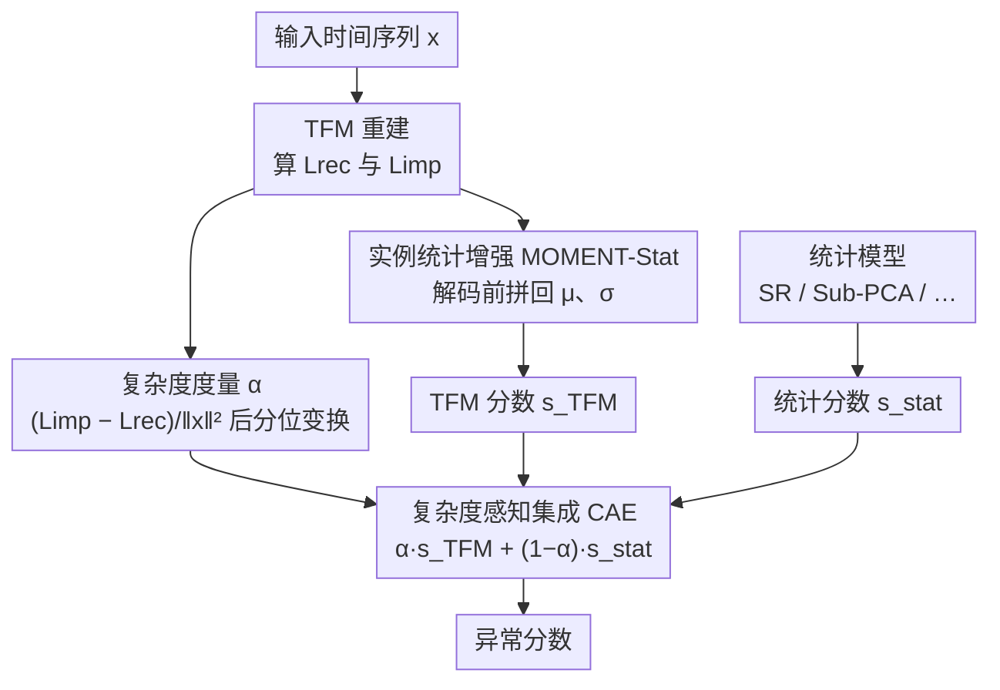

# Complexity- and Statistics-Guided Anomaly Detection in Time Series Foundation Models

**会议**: ICLR2026  
**OpenReview**: [https://openreview.net/forum?id=rBt9aW3Mx7](https://openreview.net/forum?id=rBt9aW3Mx7)  
**代码**: 待确认  
**领域**: 时序异常检测 / 时序基础模型  
**关键词**: 时序基础模型, 异常检测, 重建误差, 复杂度度量, 自适应集成

## 一句话总结
把时序基础模型（TFM，如 MOMENT）搬到重建式异常检测上时，会因「过泛化」（连异常也重建得很好）和「过平稳化」（实例归一化抹掉了均值方差）而失灵；本文用一个从重建/插补误差差导出的复杂度指标 $\alpha$ 自适应地把 TFM 与轻量统计模型混合（CAE），再把均值方差重新注入解码端（MOMENT-Stat），在 23 个单变量 + 17 个多变量基准上把 VUS-PR 从此前 SOTA 的 0.4233 提到 0.4679。

## 研究背景与动机
**领域现状**：受 LLM 启发的时序基础模型（TFM）在「预测」任务上表现强劲，于是一个自然的想法是把它们直接拿来做异常检测——尤其是重建式异常检测：让模型重建输入，重建误差大的点就判为异常。

**现有痛点**：作者发现 TFM 直接做重建式异常检测会踩两个坑。第一个是**过泛化（overgeneralization）**——模型容量太强，连异常片段也能重建得跟正常数据一样准，结果异常点的异常分数反而不高，异常被「抹平」了。以往工作把这归咎于模型容量太大，却忽略了**数据本身的复杂度**：作者观察到过泛化在低复杂度数据（如以低频结构为主的序列）上尤其严重，因为这种数据太好「猜」，异常也顺手被补全了。第二个坑是**过平稳化（overstationarization）**——TFM 普遍带实例归一化层（RevIN / RMSNorm），它能提升预测精度，但会把每段输入的均值 $\mu$ 和方差 $\sigma$ 这类一阶/二阶统计量抹掉，而这些统计量恰恰是判断「统计型异常」的关键。

**核心矛盾**：TFM 为「预测」优化的两个特性——高容量、实例归一化——恰好都是「异常检测」的毒药。高容量导致过泛化，实例归一化导致过平稳化。直接微调或换 decoder 都治标不治本（论文引用：哪怕把 decoder 砍到单层全连接也消不掉过泛化）。

**切入角度**：作者不去改 TFM 本身（不重训那个庞大的 encoder），而是从「这条数据到底有多难」入手——既然过泛化只在简单数据上发作，那就量化「难度」，难的数据交给 TFM、简单的数据交给统计模型；同时把被归一化抹掉的统计量在解码前重新拼回去。

**核心 idea**：用一个从「插补误差 − 重建误差」导出的复杂度指标 $\alpha$ 自适应地在 TFM 与统计模型之间分配权重（治过泛化），并把实例级 $\mu,\sigma$ 重新拼接进解码特征（治过平稳化）——两者都不需要重训 TFM。

## 方法详解

### 整体框架
方法搭在一个预训练 TFM（论文用 MOMENT）的重建框架上：给定时间序列 $x\in\mathbb{R}^T$（实例归一化使 $\|x\|_2^2=T$），编码器 $E$ 把带掩码的输入压成特征、线性解码器 $D$ 重建出 $\hat{x}(M)=D(E(x\odot M))$。在此之上，本文同时算两条误差——**重建误差** $L_{rec}(x)=\|x-\hat{x}(M_{test})\|_2^2$（几乎不掩码，简单任务）和**插补误差** $L_{imp}(x)=\mathbb{E}_{M\sim\mathcal{M}}[\|x-\hat{x}(M)\|_2^2]$（按预训练的随机掩码方案约 30% 掩码，难任务）——用两者之差衡量数据复杂度 $\alpha$。随后一条支路把均值方差重注入解码端得到经过校正的 TFM 分数 $s_{TFM}$，另一条支路用轻量统计模型给出 $s_{stat}$，最后按 $\alpha$ 把两者自适应融合成最终异常分数。

### 关键设计

**1. 复杂度度量 α：用「难任务 vs 易任务」的误差差量化一条序列有多难重建**

针对过泛化只在简单数据上发作这个观察，作者需要一个能区分「TFM 容易过泛化」与「TFM 真的擅长」的信号。他们把重建（test 时几乎不掩码，是简单任务）和插补（按预训练随机掩码，是难任务）的误差差作为原始复杂度分：

$$w(x)=\frac{L_{imp}(x)-L_{rec}(x)}{\|x\|_2^2}.$$

直觉是：如果一条序列即使被遮住一部分也能轻松补全（$L_{imp}\approx L_{rec}$），说明它太「可预测」、TFM 会连异常一起补全——这正是过泛化的温床；反之 $w$ 大说明部分掩码下模型很吃力，数据复杂、不易被过泛化。为消除不同数据集尺度差异，再对 $w(x)$ 做分位变换得到 $\alpha=\text{QuantileTransform}(w(x))\in[0,1]$。论文还给了两条理论支撑：定理 1 用 Haar 小波把 $\Delta=L_{imp}-L_{rec}$ 分解为各频率能量 $\sum_k \phi(k)b_k$，且系数 $b_k$ 随频率 $k$ 单调不减——即 $\alpha$ 实质是高频能量的加权和，$\alpha$ 越大说明序列高频细节越多、越难插值；定理 2 进一步论证高复杂度数据上正常样本损失的梯度范数 $\|\nabla_W L_N\|_F^2$ 更大、优化地形更陡，从而正常/异常分数的间隔 $\Delta_{gap}$ 增长更快——为「$\alpha$ 大时更该信任 TFM」给了可证明的保证。

**2. 实例统计增强 MOMENT-Stat：把被归一化抹掉的 μ、σ 在解码前拼回去**

针对过平稳化，作者先用引理 3 把问题讲死：令 $N(x)=(x-\mu_x)/\sigma_x$ 为实例归一化，对任意仿射变换 $x'=\alpha x+\beta\ (\alpha>0)$ 都有 $N(x')=N(x)$，于是 $f(x')=D(E(N(x')))=f(x)$——也就是说带实例归一化的 TFM 对均值/方差的平移天然不可见，统计型异常（均值或方差异常偏移、但形状正常）会被它当成正常。解法极简且不用重训那个庞大 encoder：令 $F_i=E(\text{RevIN}(x_i))$，在送入线性解码器 $D$ 前把实例统计量直接拼接到特征向量上，再用反归一化复原：

$$\hat{x}_i=\text{RevIN}^{-1}\big(D([F_i;\mu_i;\sigma_i]),\,\mu_i,\sigma_i\big).$$

这样重建误差 $L_{rec}$ 就对 $\mu,\sigma$ 的异常偏移敏感了。代价几乎为零（只多拼两维、不重训 encoder），却在「异常是统计离群而非形状违例」的数据集上明显涨点。

**3. 复杂度感知集成 CAE：按 α 自适应地在 TFM 与统计模型之间分配权重**

有了能区分难易的 $\alpha$ 和校正过的 TFM 分数，最后一步是把 TFM 与一个轻量统计模型融合，让简单数据偏向统计模型、复杂数据偏向 TFM：

$$s_{CAE}=\alpha\cdot s_{TFM}+(1-\alpha)\cdot s_{stat}.$$

$\alpha=0$ 退化为纯统计模型、$\alpha=1$ 退化为纯 TFM，中间值是加权组合。统计模型只挑时间复杂度不超过 $O(N\log N)$ 的轻量货（SR、Sub-PCA、Sub-HBOS、Sub-IForest、POLY），所以 CAE 几乎不增成本。与「加辅助分数」这类需要手调权重的旧路线相比，本文权重完全由数据特性（$\alpha$）自动定，省去人工调参；而且 $\alpha$ 可以取实例级（CAE per data）或数据集级（取中位数）。作者还给了一个极端化变体 CAS（复杂度感知选择）——按数据集复杂度二选一地全权给某个模型，效果优于随机选择但仍不如软加权的 CAE。

### 损失函数 / 训练策略
不重训 TFM 的 encoder。MOMENT 以学习率 $10^{-4}$ 训练 2 个 epoch、窗口大小 256、Adam 优化器；每个数据集的训练数据取时间跨度前 25% 或首个异常之前的部分；重建头是带 SiLU 激活、dropout 0.1 的单层全连接。$\alpha$ 由分位变换在每个数据集上归一化得到。

## 实验关键数据

### 主实验
评测基准为单变量 TSB-AD-U（23 个数据集，覆盖 web 服务、股票、医疗、工业等）与多变量 TSB-AD-M（17 个数据集），主指标为阈值无关的 **VUS-PR**（Precision–Recall 曲面下体积，0–1，越大越好），辅以 AUC-PR / AUC-ROC / VUS-ROC。

先看过平稳化校正（实例统计增强）单独的效果：

| 方法 | AUC-PR | VUS-PR | VUS-ROC | VUS-PR 全局排名 |
|------|--------|--------|---------|-----------------|
| Sub-PCA（旧 SOTA 统计模型） | 0.3700 | 0.4233 | 0.7600 | 1 |
| MOMENT-Stat（本文） | 0.3040 | **0.3913** | 0.7771 | 3 |
| MOMENT (FT，微调) | 0.3000 | 0.3857 | 0.7600 | 6 |
| MOMENT (ZS，零样本) | 0.3000 | 0.3790 | 0.7500 | 7 |

仅把 $\mu,\sigma$ 重注入解码端、不重训 encoder，MOMENT-Stat 就把 VUS-PR 从微调版的 0.3857 提到 0.3913，超过了费力微调的 MOMENT。

再看复杂度感知集成（CAE）把统计模型抬到榜首：

| 统计骨干 | α=0（纯统计） | CAE | 排名变化 |
|----------|---------------|------|----------|
| SR | 0.3237 | **0.4596** | 14 → 1 |
| Sub-PCA | 0.4233 | **0.4679** | 1 → 1 |
| Sub-IForest | 0.2230 | 0.4318 | 29 → 2 |
| POLY | 0.3897 | 0.4274 | 3 → 2 |
| Sub-HBOS | 0.2283 | 0.3734 | 28 → 3 |

CAE 几乎把所有统计骨干都抬进前三：SR 从第 14 飙到第 1，Sub-IForest 从第 29 到第 2；Sub-PCA 在 CAE 下达到 **0.4679**，刷新此前 SOTA（Sub-PCA 单独 0.4233、纯 TFM 0.3857）。

### 消融实验

| 配置 | 关键指标（以 Sub-PCA 为例 VUS-PR） | 说明 |
|------|-----------------------------------|------|
| 纯统计模型（α=0） | 0.4233 | 治不了复杂数据 |
| 朴素平均（α=0.5，多变量 PCA） | 0.3132 | 盲目融合反而比纯统计的 0.3878 还差 |
| 随机选择 | 0.4073 | 不看复杂度地二选一 |
| CAS（按复杂度硬选） | 0.4400 | 软选优于随机 |
| CAE（本文软加权） | **0.4679** | 最优 |
| 换用谱熵/近似熵/样本熵当复杂度 | 0.4288 / 0.4373 / 0.4409 | 都不如本文 α 的 0.4679 |

### 关键发现
- **复杂度自适应是核心**：在多变量上盲目平均 TFM 与统计分数（α=0.5）会因 MOMENT 的通道独立假设而掉点（PCA 的 VUS-PR 从 0.3878 跌到 0.3132），而 CAE 用 $\alpha$ 自适应调节后反而把 HBOS（0.1751→0.2535）、LOF（0.1091→0.2122）等弱骨干显著抬起。
- **本文复杂度指标优于通用熵**：把 $\alpha$ 换成谱熵/近似熵/样本熵，CAE 的 VUS-PR 普遍下降，说明「插补−重建误差差」比现成熵指标更贴合 TFM 的过泛化行为。
- **唯一例外 Sub-HBOS**：当统计骨干本身太弱（Sub-HBOS 单独仅 0.2283，远低于 MOMENT-Stat 的 0.3913）时，纯 TFM（α=1）反而比 CAE 略好——融合一个太差的伙伴收益有限；但 CAE 仍把 Sub-HBOS 从 0.2283 大幅抬到 0.3734（排名 28→3）。
- **预测式 TFM 的反思**：把预测误差当异常分数时，Chronos > TimeMoE > Moirai，且预测越准（sMAPE 越低）异常检测 VUS-PR 越高——预测能力的提升能直接转化为预测式异常检测的提升；但在多变量上，只有显式建模通道关系的 Moirai 才表现得好，凸显通道依赖建模对多变量异常检测的重要性。

## 亮点与洞察
- **把「过泛化」从模型容量问题重构成数据复杂度问题**：以往都在砍 decoder 容量上打转，本文指出过泛化其实是「简单数据 + 高容量」的合谋，于是用一个数据侧的复杂度指标对症下药——视角的切换很巧妙。
- **复杂度指标几乎零成本且有理论背书**：$\alpha$ 直接复用 TFM 已有的重建/插补两条误差，不引入额外网络；还用 Haar 小波分解证明它本质是高频能量的加权和，把一个经验指标讲出了道理。
- **MOMENT-Stat 是典型的「不重训大模型」工程巧思**：仅在解码前拼接 $[F;\mu;\sigma]$ 两维，就让被实例归一化阉割的统计敏感性回来了，几乎可白嫖到任意带 RevIN 的 TFM 上。
- **可迁移性**：「用难/易两种自监督任务的误差差衡量样本难度，再据此自适应混合强/弱模型」这套思路，可迁移到其他重建式自监督场景（如图像/表格异常检测）做难度感知集成。

## 局限与展望
- **依赖统计骨干的质量**：CAE 的增益在统计模型本身够强时才稳；骨干太弱（Sub-HBOS）时融合收益有限、甚至不如纯 TFM，需要先挑对统计模型。
- **通道独立假设的硬伤**：核心 TFM（MOMENT）把多变量当独立通道处理，忽略通道间依赖；虽然 CAE 的自适应加权能缓解，但作者也承认多变量异常检测真正需要的是显式建模通道关系（如 Moirai 那样构造含通道信息的注意力），这超出了本文 backbone 的能力。
- **理论假设较强**：定理 2 依赖「正常与异常数据梯度不对齐」、TFM「保低频抹高频」等假设，且证明在附录、正文只给结论，实际数据未必严格满足。
- **仅在 MOMENT 上验证**：受限于「公开权重 + 显式支持异常检测」的 TFM 不多（One-fits-all、TimesNet、TimeMixer++ 未放权重），重建式实验主要绑定 MOMENT，方法在其它 TFM 上的普适性待验。

## 相关工作与启发
- **vs 砍 decoder 容量 / 记忆式方法（治过泛化）**：旧路线要么限制 decoder 表达力（被证明即使单层全连接也消不掉过泛化），要么用记忆模块（需重训、对大 TFM 昂贵）；本文不动模型结构、不重训，靠数据侧复杂度自适应融合统计模型，更轻更通用。
- **vs 对比学习造合成异常**：合成异常路线要造「有意义的异常」很难（异常定义依数据而定，通用扰动未必像真异常）；本文回避了造异常，直接用统计模型补 TFM 的短板。
- **vs 加辅助打分（auxiliary score）**：加辅助分数会引入对组件选择与权重的敏感性、要手调；本文权重由 $\alpha$ 从数据自动得出，减少人工调参。
- **vs RevIN / 重注入统计量做预测（Kim 2021、Liu 2022）**：前人把丢失的统计量重注入是为了改善「预测」，本文首次把这一思路用于「异常检测」，并以不重训 encoder 的拼接方式落地（MOMENT-Stat）。

## 评分
- 新颖性: ⭐⭐⭐⭐ 把过泛化重构为数据复杂度问题、用插补−重建误差差当复杂度指标，并配上小波频谱的理论解释，角度新。
- 实验充分度: ⭐⭐⭐⭐ 覆盖 23 单变量 + 17 多变量、对比多种统计骨干/复杂度指标/集成策略，并诚实报告 Sub-HBOS 反例；但重建式实验主要绑定单一 TFM。
- 写作质量: ⭐⭐⭐⭐ 两个挑战—两个解法的结构清晰，理论与实验呼应。
- 价值: ⭐⭐⭐⭐ 给「TFM 做异常检测」提供了即插即用、不重训的实用范式，落地性强。

<!-- RELATED:START -->

## 相关论文

- [\[AAAI 2026\] Harnessing Vision-Language Models for Time Series Anomaly Detection](../../AAAI2026/object_detection/harnessing_vision-language_models_for_time_series_anomaly_detection.md)
- [\[ICLR 2026\] Contextual and Seasonal LSTMs for Time Series Anomaly Detection](contextual_and_seasonal_lstms_for_time_series_anomaly_detection.md)
- [\[ICLR 2026\] PAANO: Patch-Based Representation Learning for Time-Series Anomaly Detection](paano_patch-based_representation_learning_for_time-series_anomaly_detection.md)
- [\[CVPR 2026\] AnomalyVFM -- Transforming Vision Foundation Models into Zero-Shot Anomaly Detectors](../../CVPR2026/object_detection/anomalyvfm_--_transforming_vision_foundation_models_into_zero-shot_anomaly_detec.md)
- [\[ICLR 2026\] FSOD-VFM: Few-Shot Object Detection with Vision Foundation Models and Graph Diffusion](fsod-vfm_few-shot_object_detection_with_vision_foundation_models_and_graph_diffu.md)

<!-- RELATED:END -->
