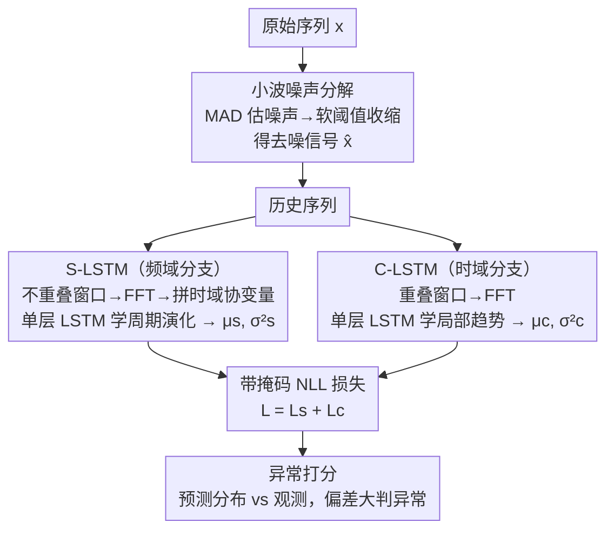

# Contextual and Seasonal LSTMs for Time Series Anomaly Detection

**会议**: ICLR 2026  
**arXiv**: [2602.09690](https://arxiv.org/abs/2602.09690)  
**代码**: [https://github.com/NESA-Lab/Contextual-and-Seasonal-LSTMs-for-TSAD](https://github.com/NESA-Lab/Contextual-and-Seasonal-LSTMs-for-TSAD)  
**领域**: AI Safety / 时间序列异常检测  
**关键词**: time series anomaly detection, LSTM, frequency domain, noise decomposition, univariate time series

## 一句话总结
针对单变量时间序列中现有方法难以检测的"小幅点异常"和"缓慢上升异常"，提出 CS-LSTMs 双分支架构——S-LSTM 在频域建模周期性演化、C-LSTM 在时域捕捉局部趋势，结合小波噪声分解策略，在四个基准上全面超越 SOTA 且推理速度提升 40%。

## 研究背景与动机

**领域现状**：单变量时间序列（UTS）异常检测是云服务、IoT 和系统监控的核心任务。主流方法分为基于重构（如 VAE）和基于预测（如 Transformer/LSTM）两类。

**现有痛点**：通过对 FCVAE、KAN-AD、TFAD 等 SOTA 的复现，发现两类异常难以检测——(1) 小幅点异常：短时小尖峰在较长窗口下看似正常；(2) 缓慢上升异常：渐变偏离周期模式的段异常。

**核心矛盾**：异常判定依赖局部上下文而非绝对值，同一幅度的变化在不同上下文中可能是正常或异常。现有方法要么只关注频率成分（忽略局部依赖），要么只用时序信息（忽略周期演化）。

**本文目标** 三个挑战：(1) 捕捉局部趋势而非绝对值；(2) 建模周期性的动态演化而非静态周期；(3) 在包含异常和噪声的数据中学习正常模式。

**切入角度**：结合时域和频域表示，用双分支 LSTM 分别处理周期性演化和局部趋势变化。

**核心 idea**：通过时频双域双分支 LSTM 联合建模周期演化和局部趋势，配合小波噪声分解，实现对微妙异常的精准检测。

## 方法详解

### 整体框架
CS-LSTMs 要解决的是单变量时间序列里那些"看绝对值很正常、看上下文才露馅"的微妙异常。它把检测拆成两条互补的预测分支：拿到原始序列 $x_{0:t}$ 后，先做小波噪声分解得到去噪信号 $\hat{x}$，再把历史送进两条分支——S-LSTM 站在频域，把历史切成不重叠窗口逐个做 FFT，学周期模式怎么随时间演化；C-LSTM 站在时域，用重叠窗口盯住最近一小段的局部趋势。两条分支各自输出对未来值的均值 $\mu$ 和方差 $\sigma^2$，用带掩码的 NLL 损失联合训练。推理时拿预测分布和实际观测比对，偏差大的点判为异常。整套设计的核心立场是：异常不是"幅度超过某个绝对阈值"，而是"偏离了当前上下文该有的样子"。

### 关键设计

**1. 小波噪声分解：训练前先把噪声和异常点滤掉，但只去噪、不拆趋势周期**

预测式方法有个隐患——如果训练数据里混着噪声和异常，模型会把它们也当成"正常模式"学进去。这里用小波变换把信号分解为一个近似系数 $c_A$ 和各层细节系数 $c_D^{(i)}$，噪声主要藏在细节系数里。关键是噪声水平用 MAD（中位数绝对偏差）来估而不是均值/标准差：$\sigma_i = \frac{\text{median}(|c_D^{(i)}|)}{\Phi^{-1}(0.75)}$——因为异常值会拉偏均值，却动不了中位数，这样估出来的噪声水平对异常点本身鲁棒。据此算出通用阈值 $\lambda_i = \sigma_i \sqrt{2\log n}$，对细节系数做软阈值收缩后重构回 $\hat{x}$。和 DLinear 的 pooling 分解相比它更精细，和 STL 分解相比它更高效；更重要的是它刻意只做去噪，把完整的趋势+周期信号原样留给后面两条分支去建模，而不是提前把信号拆散。

**2. S-LSTM（Seasonal 分支）：在频域建模周期模式的动态演化，而不是假设周期一成不变**

真实序列的周期不是静态的——周期长度和频率本身会随时间漂移，只对比相邻两个周期不足以发现"缓慢上升异常"这类渐变偏离。S-LSTM 的做法是把检测点之前的历史划成等长、不重叠的窗口，每个窗口单独做 FFT 得到频域表示，堆成 $z_s \in \mathbb{R}^{n \times w_s}$，再把对应的时域原始值作为协变量拼上去一起喂进单层 LSTM。这样 LSTM 看到的是"一串频域快照随时间怎么变"，从而学出跨多个周期的演化趋势并预测未来的周期模式。消融里它的贡献最大（去掉后 Yahoo 掉 16.8%），正说明对周期性强的数据，动态周期建模是检测微妙异常的主力。

**3. C-LSTM（Contextual 分支）：用重叠窗口把"点级"学习变成"段级"学习，补单变量信息稀缺的短板**

单变量序列每个时间步只有一个标量值，信息太稀，单看一个点很难判断局部趋势变没变。C-LSTM 针对检测点前的一小段短历史，划成重叠窗口（窗口 $w_c$ 较小），每个窗口同样做 FFT 后拼成 $z_c \in \mathbb{R}^{n \times w_c}$ 送入单层 LSTM 预测未来值。重叠窗口的意义在于：相邻窗口共享大量样本，等于把孤立的"点级预测"转成有上下文支撑的"段级预测"，对"小幅点异常"这种短时小尖峰更敏感——它在长窗口里被淹没，但在贴身的局部窗口里会显出趋势上的违和。

### 损失函数 / 训练策略
两条分支都用带噪声分解的负对数似然（NLL）损失，同时回归均值 $\mu$ 和方差 $\sigma^2$：

$$\mathcal{D}(\mu, \sigma, x, \hat{x}) = \log \sigma^2 + \frac{(x \odot \text{mask} + \hat{x} \odot \tilde{\text{mask}} - \mu)^2}{\sigma^2}$$

这里的 mask 是把去噪策略缝进损失的关键：正常区域用原始值 $x$ 当回归目标，被判为异常的区域改用去噪值 $\hat{x}$，避免模型去拟合异常点本身。预测方差 $\sigma^2$ 让模型对不确定的区段自动放松约束。两分支损失相加得到总损失 $L = L_s + L_c$ 联合优化。

## 实验关键数据

### 主实验

| 数据集 | 指标 | CS-LSTMs | FCVAE (之前SOTA) | 提升 |
|--------|------|----------|------------------|------|
| Yahoo | Best F1 | 0.885 | 0.854 | +3.1% |
| KPI | Best F1 | 0.936 | 0.924 | +1.2% |
| WSD | Best F1 | 0.910 | 0.805 | +10.5% |
| NAB | Best F1 | 0.996 | 0.972 | +0.6% |
| Yahoo | Delay F1 | 0.878 | 0.839 | +3.9% |
| KPI | Delay F1 | 0.879 | 0.851 | +2.8% |
| WSD | Delay F1 | 0.857 | 0.696 | +16.1% |

### 消融实验

| 配置 | Yahoo Best F1 | KPI Best F1 | WSD Best F1 | 说明 |
|------|---------------|-------------|-------------|------|
| Full CS-LSTMs | 0.885 | 0.936 | 0.910 | 完整模型 |
| w/o C-LSTM | 0.864 | 0.923 | 0.856 | 去掉局部分支掉 5.4% (WSD) |
| w/o S-LSTM | 0.717 | 0.904 | 0.762 | 去掉周期分支掉 16.8% (Yahoo) |
| w/o Covariate | 0.826 | 0.925 | 0.840 | 去掉协变量掉 7.0% (WSD) |
| w/o Noise Decomp | 0.868 | 0.913 | 0.858 | 去掉去噪掉 5.2% (WSD) |

### 关键发现
- **S-LSTM 贡献最大**：去掉 S-LSTM 后 Yahoo 下降 16.8%，说明周期演化建模对周期性强的数据集至关重要
- **WSD 提升最显著**（+10.5%/+16.1%）：WSD 数据包含大量缓慢变化的段异常，恰好是 CS-LSTMs 针对优化的目标
- **效率优势明显**：仅 600K 参数（SOTA 的 1.4M 的一半不到），推理时间 4.62ms（GPU）降低约 40%
- **迁移能力强**：Yahoo→KPI/WSD 跨域测试中 F1 达 0.929/0.883，大幅优于其他方法

## 亮点与洞察
- **时频双域互补设计很巧妙**：频域捕周期性，时域捕局部趋势，两个 LSTM 分支各司其职又互补，简单有效。这种双视角理念可迁移到其他时序任务。
- **噪声分解用 MAD 而非均值/标准差**：对异常值的鲁棒性更好，因为异常值不会影响中位数。这个 trick 在任何需要鲁棒统计估计的场景都可以复用。
- **重叠窗口缓解 UTS 信息稀缺**：把"点级"问题转为"段级"问题，是处理单变量数据的通用技巧。

## 局限与展望
- **仅针对 UTS**：多变量时序场景下需要建模变量间依赖，当前架构未涉及
- **窗口大小需要手动调参**：$w_s$ 和 $w_c$ 的选择对结果有影响，自适应窗口大小可能更好
- **LSTM 而非 Transformer**：虽然参数更少更快，但对超长序列的建模能力可能受限
- **评估协议争议**：point adjustment 策略（检测到段中任一点即算正确）可能高估了实际部署的检测精度

## 相关工作与启发
- **vs FCVAE**: FCVAE 侧重频域重构但忽略局部依赖，CS-LSTMs 用双分支弥补了这一缺陷
- **vs Anomaly-Transformer**: Anomaly-Transformer 用 minimax 策略增强鲁棒性，但参数多推理慢；CS-LSTMs 以更小代价获得更好效果
- **vs KAN-AD**: KAN-AD 用时序信息做预测但忽略频域细节，本文恰好互补

## 评分
- 新颖性: ⭐⭐⭐ 双分支时频联合建模不算全新概念，但具体设计和噪声分解策略有新意
- 实验充分度: ⭐⭐⭐⭐ 四个数据集、十个baseline、消融/迁移/效率实验完整
- 写作质量: ⭐⭐⭐⭐ 动机分析清晰，方法描述系统
- 价值: ⭐⭐⭐⭐ 实用性强，轻量高效适合工业部署

<!-- RELATED:START -->

## 相关论文

- [\[ICLR 2026\] PAANO: Patch-Based Representation Learning for Time-Series Anomaly Detection](paano_patch-based_representation_learning_for_time-series_anomaly_detection.md)
- [\[AAAI 2026\] Harnessing Vision-Language Models for Time Series Anomaly Detection](../../AAAI2026/object_detection/harnessing_vision-language_models_for_time_series_anomaly_detection.md)
- [\[ICLR 2026\] Complexity- and Statistics-Guided Anomaly Detection in Time Series Foundation Models](complexity-_and_statistics-guided_anomaly_detection_in_time_series_foundation_mo.md)
- [\[NeurIPS 2025\] Structured Temporal Causality for Interpretable Multivariate Time Series Anomaly Detection](../../NeurIPS2025/object_detection/structured_temporal_causality_for_interpretable_multivariate_time_series_anomaly.md)
- [\[ICML 2025\] KAN-AD: Time Series Anomaly Detection with Kolmogorov-Arnold Networks](../../ICML2025/object_detection/kan-ad_time_series_anomaly_detection_with_kolmogorov-arnold_networks.md)

<!-- RELATED:END -->
